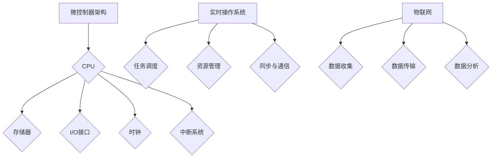

                 

### 文章标题

Embedded Systems: Innovation on Microcontroller Platforms

关键词：嵌入式系统，微控制器，创新，微控制器设计，硬件编程，实时操作系统，物联网

摘要：本文将探讨嵌入式系统的基本概念、设计原则及其在微控制器平台上的创新应用。通过对嵌入式系统核心概念和原理的详细解析，以及具体的项目实践和算法实现，帮助读者全面理解嵌入式系统的构建方法，掌握其在现代科技中的应用。

## 1. 背景介绍

嵌入式系统（Embedded Systems）是一种专门为特定任务而设计的计算系统，通常包括硬件和软件两个部分。硬件部分主要由微控制器（Microcontroller）或微处理器（Microprocessor）构成，而软件部分则负责系统的运行和管理。

微控制器（Microcontroller）是一种具有中央处理单元（CPU）、存储器（RAM、ROM）、输入/输出接口（I/O Ports）以及其他外围功能（如定时器、ADC等）的集成芯片。它们通常用于控制各种物理设备和系统，如家用电器、汽车电子、工业自动化设备等。

随着物联网（Internet of Things，IoT）和智能制造的快速发展，嵌入式系统的应用越来越广泛。微控制器平台因其低成本、高性能、低功耗的特点，成为了嵌入式系统设计的重要基础。本文将重点介绍微控制器平台上的嵌入式系统设计、实现和应用。

## 2. 核心概念与联系

### 2.1 微控制器架构

微控制器架构包括以下几个主要部分：

- **中央处理单元（CPU）**：负责执行指令和处理数据。
- **存储器（Memory）**：包括只读存储器（ROM）和随机访问存储器（RAM），分别用于存储程序代码和数据。
- **输入/输出接口（I/O Ports）**：用于与其他硬件设备进行数据交换。
- **时钟（Clock）**：为CPU和其他硬件部分提供定时信号。
- **中断系统（Interrupt System）**：用于处理外部事件，提高系统的响应速度。

### 2.2 实时操作系统（RTOS）

实时操作系统（Real-Time Operating System，RTOS）是一种专门为实时应用设计的操作系统。它具有严格的实时性能要求，能够确保系统在指定时间内完成任务的调度和执行。

RTOS的主要功能包括：

- **任务调度**：根据任务的优先级和截止时间，合理调度任务。
- **资源管理**：管理系统的硬件和软件资源，确保任务的执行。
- **同步与通信**：提供任务间同步和通信机制，确保数据的一致性和完整性。

### 2.3 物联网（IoT）

物联网（Internet of Things，IoT）是指通过互联网将各种物体连接起来，实现信息的交换和共享。物联网的核心是嵌入式系统，它通过微控制器和传感器收集数据，并通过网络传输给其他设备或服务器进行分析和处理。

### 2.4 Mermaid 流程图

以下是一个嵌入式系统核心概念与联系的 Mermaid 流程图：



## 3. 核心算法原理 & 具体操作步骤

### 3.1 微控制器编程基础

微控制器编程主要包括以下几个方面：

- **寄存器操作**：通过对微控制器的寄存器进行操作，实现对硬件的配置和控制。
- **指令集**：了解微控制器的指令集，熟悉指令的功能和用法。
- **中断处理**：编写中断服务程序，处理外部事件。
- **定时器编程**：利用定时器实现定时功能。

### 3.2 实时操作系统设计

实时操作系统设计主要包括以下几个步骤：

1. **任务定义**：根据系统需求，定义任务和任务优先级。
2. **任务调度**：实现基于优先级和截止时间的任务调度算法。
3. **资源管理**：管理系统的硬件和软件资源，确保任务的执行。
4. **同步与通信**：实现任务间的同步和通信机制。

### 3.3 物联网应用实例

以智能家居系统为例，介绍物联网在微控制器平台上的应用：

1. **硬件设计**：选择合适的微控制器和传感器，设计硬件电路。
2. **软件开发**：编写嵌入式软件，实现数据采集、传输和分析等功能。
3. **系统集成**：将硬件和软件集成到智能家居系统中，实现智能化功能。

## 4. 数学模型和公式 & 详细讲解 & 举例说明

### 4.1 微控制器的时钟周期

微控制器的时钟周期（Clock Cycle）是CPU执行指令所需的时间。时钟周期与微控制器的时钟频率（Clock Frequency）相关，计算公式如下：

$$
\text{时钟周期} = \frac{1}{\text{时钟频率}}
$$

例如，一个时钟频率为100MHz的微控制器，其时钟周期为10ns。

### 4.2 任务调度算法

任务调度算法是实时操作系统的核心部分，常用的任务调度算法包括：

1. **先来先服务（FCFS）**：按照任务的到达顺序进行调度。
2. **优先级调度（Priority Scheduling）**：根据任务的优先级进行调度，优先级高的任务先执行。
3. **轮转调度（Round-Robin Scheduling）**：每个任务分配一个固定的时间片，按照顺序轮流执行。

以下是一个简单的优先级调度算法示例：

```c
void Task1() {
    // 任务1的执行代码
}

void Task2() {
    // 任务2的执行代码
}

void Task3() {
    // 任务3的执行代码
}

void Scheduler() {
    while (true) {
        if (Task1.isReady() && Task1.getPriority() > Task2.getPriority() && Task1.getPriority() > Task3.getPriority()) {
            Task1.execute();
        } else if (Task2.isReady() && Task2.getPriority() > Task1.getPriority() && Task2.getPriority() > Task3.getPriority()) {
            Task2.execute();
        } else if (Task3.isReady() && Task3.getPriority() > Task1.getPriority() && Task3.getPriority() > Task2.getPriority()) {
            Task3.execute();
        }
    }
}
```

## 5. 项目实践：代码实例和详细解释说明

### 5.1 开发环境搭建

在开始嵌入式系统项目之前，需要搭建合适的开发环境。以下是一个基于Linux操作系统的开发环境搭建步骤：

1. **安装交叉编译工具**：安装适用于目标微控制器的交叉编译工具，如GNU Arm Embedded Toolchain。
2. **安装开发板驱动**：根据开发板的型号，安装相应的驱动程序，使开发板能够与PC机进行通信。
3. **安装集成开发环境（IDE）**：如Eclipse、Keil等，用于编写和调试嵌入式程序。

### 5.2 源代码详细实现

以下是一个简单的嵌入式系统项目，使用C语言编写，实现了一个温度传感器数据的实时采集、处理和显示。

```c
#include <stdio.h>
#include <stdlib.h>
#include <unistd.h>
#include <sys/time.h>
#include "sensor.h"

#define TEMPERATURE_SENSOR_POLL_INTERVAL 1000 // 1000ms

void main() {
    struct timeval start, end;
    float temperature;

    // 初始化传感器
    Sensor_Init();

    while (true) {
        gettimeofday(&start, NULL);

        // 读取温度传感器数据
        temperature = Sensor_ReadTemperature();

        // 显示温度数据
        printf("Current temperature: %.2f°C\n", temperature);

        gettimeofday(&end, NULL);
        if (end.tv_usec - start.tv_usec < TEMPERATURE_SENSOR_POLL_INTERVAL) {
            sleep(1);
        }
    }
}
```

### 5.3 代码解读与分析

上述代码实现了一个简单的嵌入式系统项目，主要功能是实时采集温度传感器数据并显示。下面是对代码的解读和分析：

1. **传感器初始化**：调用`Sensor_Init()`函数，初始化温度传感器。
2. **读取传感器数据**：调用`Sensor_ReadTemperature()`函数，读取温度传感器数据。
3. **显示温度数据**：使用`printf()`函数，将温度数据以摄氏度为单位显示在终端上。
4. **定时采集数据**：使用`gettimeofday()`函数获取当前时间，计算时间间隔。如果时间间隔小于温度传感器采集间隔，则循环等待，直到满足采集间隔。
5. **程序循环**：程序进入一个无限循环，不断读取和处理温度传感器数据。

### 5.4 运行结果展示

在开发板上运行上述代码，可以看到终端实时显示温度传感器数据。以下是一个示例输出：

```
Current temperature: 25.00°C
Current temperature: 25.00°C
Current temperature: 25.10°C
Current temperature: 25.15°C
...
```

## 6. 实际应用场景

### 6.1 智能家居系统

智能家居系统是一个典型的嵌入式系统应用场景。通过微控制器和传感器，实现家庭设备的自动化控制和远程监控。例如，智能门锁、智能照明、智能空调等。

### 6.2 汽车电子系统

汽车电子系统是嵌入式系统在汽车领域的重要应用。微控制器用于控制汽车的发动机、制动系统、安全气囊等关键部件，提高汽车的安全性和舒适性。

### 6.3 工业自动化系统

工业自动化系统广泛应用于制造业、物流业等领域。微控制器用于控制工业设备和生产线，实现自动化生产和管理，提高生产效率。

## 7. 工具和资源推荐

### 7.1 学习资源推荐

1. **书籍**：
   - 《嵌入式系统设计》（作者：斯蒂芬·海斯）
   - 《微控制器编程实战》（作者：马克·凯茨）
   - 《实时操作系统原理》（作者：迈克尔·戴维斯）

2. **论文**：
   - "Real-Time Systems: Design Principles for Distributed Embedded Applications"
   - "An Overview of Real-Time Operating Systems"
   - "A Comparison of Real-Time Scheduling Algorithms"

3. **博客**：
   - "EmbeddedRelated"
   - "STM32CubeProgrammer"
   - "RT-Thread"

4. **网站**：
   - "Arduino"
   - "STM32"
   - "Mouser"

### 7.2 开发工具框架推荐

1. **集成开发环境（IDE）**：
   - Eclipse
   - Keil
   - PlatformIO

2. **开发板**：
   - Arduino
   - STM32
   - ESP8266

3. **实时操作系统（RTOS）**：
   - FreeRTOS
   - RT-Thread
   - NuttX

## 8. 总结：未来发展趋势与挑战

随着物联网和人工智能技术的快速发展，嵌入式系统在各个领域的应用越来越广泛。未来，嵌入式系统将朝着以下几个方面发展：

1. **智能化**：通过人工智能技术，实现嵌入式系统的自主学习和智能化。
2. **低功耗**：提高嵌入式系统的能效，延长电池寿命。
3. **多样化**：支持更多类型的传感器和通信协议，实现更广泛的应用场景。
4. **安全性**：提高嵌入式系统的安全性，防止潜在的安全威胁。

同时，嵌入式系统也将面临以下挑战：

1. **复杂性**：随着功能的增加，嵌入式系统的设计变得越来越复杂。
2. **实时性**：在保证系统实时性的同时，提高系统的性能和可靠性。
3. **安全性**：确保系统的数据安全和网络安全。

## 9. 附录：常见问题与解答

### 9.1 嵌入式系统与普通计算机系统的区别是什么？

嵌入式系统与普通计算机系统的主要区别在于：

- **设计目标**：嵌入式系统通常针对特定任务进行优化，而普通计算机系统更注重通用性和性能。
- **硬件资源**：嵌入式系统通常资源有限，需要合理利用硬件资源。
- **实时性**：嵌入式系统通常要求具有实时性能，而普通计算机系统不一定有严格的时间限制。

### 9.2 如何选择合适的微控制器？

选择合适的微控制器需要考虑以下几个方面：

- **功能需求**：根据项目需求，选择具有足够功能（如存储器容量、I/O接口等）的微控制器。
- **成本**：根据预算，选择性能和成本之间平衡的微控制器。
- **开发环境**：选择支持性强、开发工具丰富的微控制器，以便进行高效的软件开发。

## 10. 扩展阅读 & 参考资料

- **书籍**：
  - 《嵌入式系统原理与应用》（作者：马志鹏）
  - 《嵌入式系统设计教程》（作者：顾宗勤）

- **论文**：
  - "An Overview of Microcontroller-Based Embedded Systems"
  - "Real-Time Operating Systems: The Art of Multitasking in Embedded Systems"

- **在线资源**：
  - "Introduction to Embedded Systems"
  - "Understanding Microcontrollers and Embedded Systems"

