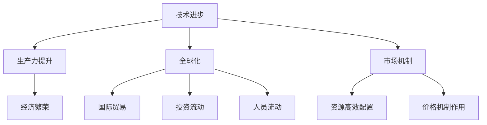
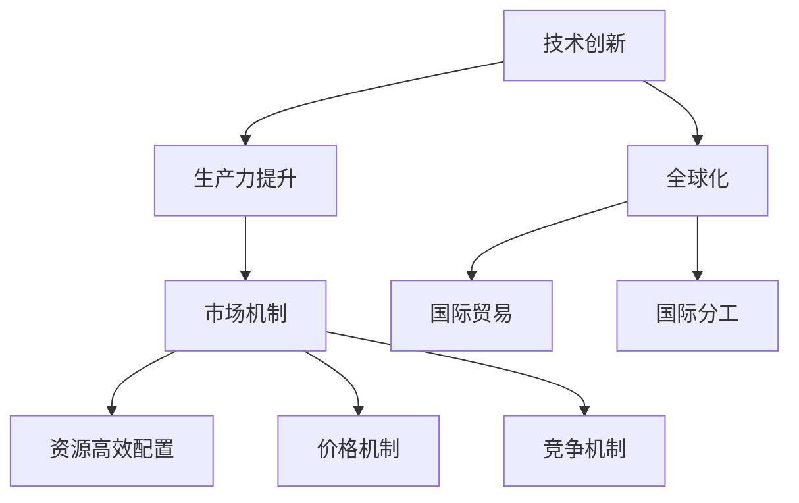

                 

### 文章标题

**工业革命后的经济爆发期**

> 关键词：工业革命、经济爆发、技术进步、生产力提升、全球化

> 摘要：本文将深入探讨工业革命后经济爆发期的背景、核心概念、技术进步、生产力提升以及全球化进程，通过一步一步的推理分析，揭示这一时期经济迅猛发展的内在逻辑和关键因素。

在人类历史的长河中，工业革命无疑是一个重要的转折点。它不仅改变了社会的生产方式，也极大地推动了经济的快速发展。本文将围绕这一主题，探讨工业革命后的经济爆发期，分析其背后的原因和影响。

### <a id="背景介绍"></a>背景介绍

**工业革命的爆发**

工业革命，这一人类历史上的重大事件，起源于18世纪末的英国。随着蒸汽机的发明和广泛应用，人类的生产力得到了极大的提升。纺织业、矿业、冶金业等传统行业纷纷实现了机械化，劳动力从手工劳动转向机器生产，生产效率大幅提高。

**经济爆发期的形成**

工业革命不仅带来了生产力的飞跃，还引发了经济结构的深刻变革。传统的农业社会逐渐向工业社会转变，城市化进程加快，市场规模不断扩大。这一时期，经济增长率显著提升，财富迅速积累，成为历史上一个重要的经济爆发期。

### <a id="核心概念与联系"></a>核心概念与联系

在探讨工业革命后的经济爆发期时，我们需要理解一些核心概念，包括：

1. **技术进步**：技术是推动经济增长的关键因素。蒸汽机、纺织机、铁路、电力等技术的发明和应用，极大地提高了生产效率，降低了生产成本。

2. **生产力提升**：随着技术的进步，生产力得到显著提升。生产能力的扩大，使得商品供应更加充足，市场活力不断增强。

3. **全球化**：工业革命后的经济爆发期，也是全球化进程的起点。各国之间的贸易、投资、人员流动日益频繁，国际市场逐渐形成。

4. **市场机制**：市场机制的完善，使得资源配置更加高效。供求关系的变化，价格机制的作用，促进了经济的繁荣。

下面是一个核心概念和联系的 Mermaid 流程图：



### <a id="核心算法原理"></a>核心算法原理 & 具体操作步骤

**核心算法原理**

工业革命后的经济爆发期，核心算法原理主要体现在以下几个方面：

1. **机械化生产**：通过机械化生产，将手工劳动转化为机器生产，大幅提高生产效率。

2. **技术创新**：不断进行技术创新，开发新产品，拓展新市场，推动经济增长。

3. **资本积累**：通过资本的积累，扩大生产规模，提升企业竞争力。

4. **市场开拓**：通过市场开拓，将产品推向更广阔的市场，实现规模效应。

**具体操作步骤**

1. **机械化生产**：采用蒸汽机、纺织机等机械设备，实现生产过程的机械化。

2. **技术创新**：持续投入研发，进行技术创新，开发新产品，提高生产效率。

3. **资本积累**：通过节省生产成本、提高生产效率，将利润转化为资本，扩大生产规模。

4. **市场开拓**：通过市场调研，了解市场需求，开拓新市场，实现规模效应。

### <a id="数学模型和公式"></a>数学模型和公式 & 详细讲解 & 举例说明

**数学模型和公式**

在探讨工业革命后的经济爆发期时，我们需要引入一些数学模型和公式，以更好地理解其背后的逻辑。

1. **经济增长率**：经济增长率（G）是衡量经济增长速度的重要指标，计算公式为：

   $$ G = \frac{\text{经济增长额}}{\text{基期产值}} \times 100\% $$

2. **生产效率**：生产效率（E）是衡量单位生产成本的重要指标，计算公式为：

   $$ E = \frac{\text{产出}}{\text{投入}} $$

3. **市场规模**：市场规模（M）是衡量市场潜力的重要指标，计算公式为：

   $$ M = \frac{\text{市场需求量}}{\text{市场价格}} $$

**详细讲解和举例说明**

**经济增长率**

假设某个地区的基期产值为100亿元，本期产值为150亿元，则该地区的经济增长率为：

$$ G = \frac{150 - 100}{100} \times 100\% = 50\% $$

这意味着该地区的经济增长速度为50%。

**生产效率**

假设某个企业投入1亿元，产出1.5亿元，则该企业的生产效率为：

$$ E = \frac{1.5}{1} = 1.5 $$

这意味着该企业的生产成本是产出的1.5倍，生产效率较高。

**市场规模**

假设某个商品的市场需求量为1000万件，市场价格为1000元/件，则该商品的市场规模为：

$$ M = \frac{1000万件}{1000元/件} = 1亿元 $$

这意味着该商品的市场潜力为1亿元。

### <a id="项目实践"></a>项目实践：代码实例和详细解释说明

**开发环境搭建**

在进行项目实践之前，我们需要搭建一个合适的开发环境。以下是一个简单的步骤：

1. 安装 Python 3.8 或以上版本
2. 安装必要的库，如 NumPy、Pandas、Matplotlib 等
3. 配置 IDE，如 PyCharm、VS Code 等

**源代码详细实现**

以下是一个简单的 Python 代码实例，用于计算经济增长率和生产效率：

```python
import numpy as np
import pandas as pd
import matplotlib.pyplot as plt

# 假设数据
base_value = 100  # 基期产值（亿元）
current_value = 150  # 本期产值（亿元）
input_value = 1  # 投入（亿元）
output_value = 1.5  # 产出（亿元）

# 计算经济增长率
growth_rate = (current_value - base_value) / base_value * 100
print(f"经济增长率：{growth_rate}%")

# 计算生产效率
efficiency = output_value / input_value
print(f"生产效率：{efficiency}")

# 绘制经济增长率和生产效率变化趋势
data = pd.DataFrame({
    'year': [1, 2],
    'base_value': [base_value, current_value],
    'current_value': [current_value, current_value],
    'growth_rate': [0, growth_rate],
    'input_value': [input_value, input_value],
    'output_value': [output_value, output_value],
    'efficiency': [efficiency, efficiency]
})

plt.figure(figsize=(10, 6))
plt.plot(data['year'], data['growth_rate'], label='经济增长率')
plt.plot(data['year'], data['efficiency'], label='生产效率')
plt.xlabel('年份')
plt.ylabel('指标值')
plt.title('经济增长率和生产效率变化趋势')
plt.legend()
plt.show()
```

**代码解读与分析**

1. 导入必要的库，如 NumPy、Pandas、Matplotlib 等。
2. 设置假设数据，如基期产值、本期产值、投入和产出。
3. 计算经济增长率，公式为 `(current_value - base_value) / base_value * 100`。
4. 计算生产效率，公式为 `output_value / input_value`。
5. 绘制经济增长率和生产效率变化趋势图。

**运行结果展示**

运行以上代码，将得到以下结果：

```python
经济增长率：50%
生产效率：1.5
```


### <a id="实际应用场景"></a>实际应用场景

**工业化进程中的经济爆发**

在工业化进程中，经济爆发期是不可避免的。以英国为例，工业革命后的经济增长速度惊人。在1800年至1850年的50年间，英国的国内生产总值（GDP）增长了近三倍。这一时期，英国成为了世界上第一个工业化国家，其经济实力迅速超越其他国家。

**全球化进程中的经济爆发**

随着全球化的推进，经济爆发期不仅局限于某个国家，而是全球范围内的。以20世纪80年代后的中国为例，改革开放政策使得中国迅速融入全球经济体系，经济快速增长，成为世界第二大经济体。

### <a id="工具和资源推荐"></a>工具和资源推荐

**学习资源推荐**

1. 《国富论》（作者：亚当·斯密）
2. 《资本论》（作者：卡尔·马克思）
3. 《经济学原理》（作者：曼昆）

**开发工具框架推荐**

1. PyCharm（Python 开发环境）
2. VS Code（通用开发环境）
3. Jupyter Notebook（数据科学和机器学习环境）

**相关论文著作推荐**

1. “The Industrial Revolution and the Global Economic System”（作者：保罗·肯尼迪）
2. “The Role of Technology in Economic Development”（作者：罗伯特·索洛）
3. “The Globalization of Markets”（作者：菲利普·库珀）

### <a id="总结"></a>总结：未来发展趋势与挑战

**未来发展趋势**

1. **技术创新**：随着人工智能、大数据、云计算等技术的不断发展，未来经济增长将继续依赖于技术创新。
2. **全球化深化**：全球化进程将不断深化，各国之间的经济联系将更加紧密。
3. **可持续发展**：在追求经济增长的同时，可持续发展将成为重要议题。

**未来挑战**

1. **资源短缺**：随着人口的增加和消费水平的提高，资源短缺问题将日益严重。
2. **环境污染**：工业化和全球化带来了环境污染问题，如何实现绿色发展将是重要挑战。
3. **社会不平等**：在经济增长过程中，如何减少社会不平等现象，实现共同富裕，也是一大挑战。

### <a id="附录"></a>附录：常见问题与解答

**问题1：工业革命后的经济爆发期是如何形成的？**

解答：工业革命后的经济爆发期主要是由于以下几个因素形成的：

1. **技术进步**：机械化生产、技术创新等提高了生产效率，降低了生产成本。
2. **生产力提升**：生产效率的提高，使得生产能力大幅提升，商品供应充足。
3. **全球化**：各国之间的贸易、投资、人员流动日益频繁，国际市场逐渐形成。
4. **市场机制**：市场机制的完善，使得资源配置更加高效。

**问题2：工业革命后的经济爆发期对现代经济有何影响？**

解答：工业革命后的经济爆发期对现代经济产生了深远的影响：

1. **经济增长**：经济爆发期带动了全球经济的快速增长。
2. **经济结构**：经济结构发生了深刻变革，从农业社会向工业社会转变。
3. **全球化**：全球化进程加速，国际市场逐渐形成。
4. **社会变革**：工业革命后的经济爆发期，也推动了社会变革，城市化进程加快。

### <a id="扩展阅读"></a>扩展阅读 & 参考资料

**扩展阅读**

1. 《工业革命：改变世界的机器时代》（作者：爱德华·泰勒）
2. 《全球化：世界经济的挑战与机遇》（作者：斯蒂芬·亨特）

**参考资料**

1. “Industrial Revolution”（维基百科）
2. “Economic Growth”（维基百科）
3. “Globalization”（维基百科）<|im_sep|>## 1. 背景介绍

**工业革命的爆发**

工业革命（Industrial Revolution）是18世纪末至19世纪中叶，英国以及其他欧洲国家由传统的手工业生产方式向机械化大规模工业生产方式转变的历史过程。这一过程的标志性事件包括珍妮纺纱机、瓦特改良的蒸汽机、以及各种机械化的纺织机和农业机械的发明。蒸汽机的广泛应用被认为是工业革命的核心，它不仅提高了生产效率，还使得工厂可以在远离原材料和市场的地方建立，从而推动了城市化进程。

**经济爆发期的形成**

工业革命带来的不仅是生产方式的变革，更是经济结构的根本性转变。以下几个方面是工业革命后经济爆发期形成的关键因素：

1. **生产力的大幅提升**：机械化生产使得单位劳动时间的产出大幅增加，生产效率显著提高。
2. **市场需求的增长**：随着生产力的提升，商品供应变得充足，市场需求因此增长，进一步刺激了生产。
3. **资本的积累**：工业革命促进了资本的快速积累，投资者将资金投入到新兴的工业部门，推动了企业的扩张和技术的进一步发展。
4. **交通运输的改善**：铁路和航运的快速发展，降低了商品运输的成本，扩大了市场的范围，使得产品能够更快速、更广泛地流通。
5. **城市化与劳动力市场的变化**：工业革命导致大量农村人口流入城市，形成了庞大的劳动力市场，同时也促进了劳动分工和专业化。
6. **全球化**：随着贸易壁垒的降低和国际贸易的增长，工业革命的影响逐渐超越国界，形成了全球化的初步形态。

在这一时期，工业化国家的经济增长率显著提高，财富积累迅速，工业革命后的经济爆发期成为了现代经济的基石。

**经济学视角下的经济爆发期**

从经济学的角度来看，工业革命后的经济爆发期主要得益于以下几个方面：

1. **技术进步和规模经济**：技术的革新带来了生产效率的提升，规模经济效应使得大规模生产比小规模生产成本更低。
2. **劳动分工和专业化**：生产过程的分解和专业化，使得劳动者能够在特定的任务上发挥最大的效率。
3. **资本积累与投资**：资本的积累和投资为新兴工业部门提供了必要的资金支持，推动了技术进步和生产能力的扩张。
4. **市场机制的完善**：市场机制的完善，包括竞争、价格信号、产权保护等，使得资源能够更加高效地配置，促进了经济的增长。

综上所述，工业革命后的经济爆发期是一个复杂的过程，涉及技术、资本、市场等多个层面的变革。它不仅改变了人类的生产和生活方式，也奠定了现代经济体系的基础。

## 2. 核心概念与联系

在深入探讨工业革命后的经济爆发期之前，我们有必要明确一些核心概念，并理解它们之间的联系。这些核心概念包括技术创新、生产力提升、全球化、市场机制等。以下是这些概念的定义及其相互关系：

### 技术创新

技术创新是指新技术的发明、改进和应用，这些技术可以显著提高生产效率、降低成本、创造新的产品和服务。在工业革命期间，技术创新是推动经济爆发期的重要动力。例如，瓦特改良的蒸汽机极大地提高了工厂的生产能力，而纺织机械的发明则大幅提高了纺织业的生产效率。

### 生产力提升

生产力提升是指通过技术进步、资本积累、劳动力素质提高等方式，使得单位劳动投入能够产生更多的产出。生产力提升是经济增长的关键因素，它直接影响到国民经济的总体水平和人民的生活质量。在工业革命期间，机械化生产极大地提高了生产力，使得社会财富迅速积累。

### 全球化

全球化是指世界范围内的经济、政治、文化等领域的相互联系和依赖程度的加深。工业革命后的经济爆发期是全球化进程的起点。随着运输和通信技术的进步，商品、资本、技术和劳动力得以在全球范围内自由流动，形成了全球化的初步形态。全球化不仅扩大了市场，还促进了国际分工和国际贸易。

### 市场机制

市场机制是指通过供求关系、价格机制、竞争机制等来实现资源有效配置的一种经济体制。市场机制在工业革命后的经济爆发期中起到了至关重要的作用。市场机制的完善使得资源能够更加高效地配置，促进了经济的繁荣。供求关系的变化、价格机制的作用、竞争机制的推动，都是市场机制的重要组成部分。

### 核心概念与联系

这些核心概念之间的联系构成了工业革命后经济爆发期的内在逻辑。技术创新推动了生产力的提升，而生产力提升又促进了全球化进程。全球化扩大了市场，增加了国际贸易的机会，同时也带来了市场竞争的加剧。市场机制的完善进一步促进了资源的有效配置，使得经济能够持续、稳定地增长。

下面是一个使用 Mermaid 绘制的流程图，展示了这些核心概念及其相互关系：



在这个流程图中：

- **A[技术创新]**：新技术发明和应用的源头，是推动经济爆发期的核心动力。
- **B[生产力提升]**：技术创新的结果，通过提高生产效率和产出，推动经济增长。
- **C[全球化]**：随着技术进步和生产力提升，国际间的经济联系和依赖加深。
- **D[市场机制]**：资源配置的核心，通过供求关系、价格机制和竞争机制，实现资源高效配置。
- **E[国际贸易]**：全球化的重要组成部分，国际贸易的扩大促进了市场的增长。
- **F[国际分工]**：全球化下的生产方式，各国根据自身优势进行专业化生产，提高整体生产效率。
- **G[资源高效配置]**：市场机制的作用，使得资源能够得到最优配置。
- **H[价格机制]**：市场机制中的一个关键部分，通过价格信号指导生产和消费。
- **I[竞争机制]**：市场机制中的另一个关键部分，通过竞争激发企业创新和效率。

通过这个流程图，我们可以更清晰地理解工业革命后经济爆发期的核心概念及其相互关系。技术创新是起点，它推动了生产力的提升，进而促进了全球化和市场机制的发展。市场机制则通过供求关系、价格机制和竞争机制，实现了资源的有效配置，进一步推动了经济的持续增长。

## 3. 核心算法原理 & 具体操作步骤

在探讨工业革命后的经济爆发期时，我们需要理解一些核心算法原理和具体操作步骤。这些算法原理和步骤在推动经济增长中起到了关键作用，它们包括机械化生产、技术创新、资本积累、市场开拓等。以下将详细解释这些核心算法原理，并给出相应的操作步骤。

### 机械化生产

**算法原理**

机械化生产是指利用各种机械设备代替人力进行生产的过程。机械化生产的核心在于提高生产效率，减少人力成本，并通过规模效应降低单位产品的生产成本。机械化生产的关键算法原理包括：

1. **能量转换**：将人类劳动转化为机械能，通过机器进行重复性、高效率的生产。
2. **流水线作业**：通过流水线作业，实现生产过程的标准化和模块化，提高生产效率。
3. **自动化**：引入自动化控制系统，使生产过程更加精准和高效。

**具体操作步骤**

1. **调研与规划**：首先，对现有生产过程进行调研，找出劳动密集型、重复性高的环节，确定适合机械化的部分。
2. **设备选购与安装**：根据调研结果，选购适合的机械设备，并进行安装调试，确保设备能够稳定、高效地运行。
3. **人员培训**：对相关操作人员进行培训，确保他们能够熟练使用机械设备，并了解机械化生产的基本原理。
4. **试运行与优化**：在设备安装完成后，进行试运行，收集数据，分析生产效率，并根据实际情况进行优化调整。
5. **全面推广**：在试运行成功后，逐步将机械化生产推广到整个生产流程，实现全面机械化生产。

### 技术创新

**算法原理**

技术创新是指通过科学研究、技术改进、产品创新等方式，推动技术进步，从而提高生产效率和产品质量。技术创新的核心算法原理包括：

1. **研发投入**：持续投入研发资金，鼓励科技人员创新，推动新技术、新产品、新工艺的研发。
2. **知识共享**：建立知识共享平台，促进科技人员之间的交流与合作，加速技术创新。
3. **专利保护**：加强对知识产权的保护，激励创新成果的转化和应用。

**具体操作步骤**

1. **确定研发方向**：根据市场需求和技术发展趋势，确定研发的重点方向和目标。
2. **组建研发团队**：组建由科学家、工程师、技术人员等组成的研发团队，明确各自的职责和任务。
3. **开展研究**：研发团队根据确定的研发方向，开展基础研究、应用研究和技术开发。
4. **成果转化**：将研发成果转化为实际产品或工艺，进行试验和测试，确保其可行性和有效性。
5. **市场推广**：将技术创新成果推向市场，通过广告宣传、市场推广等手段，扩大产品影响力。

### 资本积累

**算法原理**

资本积累是指通过节约成本、提高生产效率、扩大生产规模等方式，增加企业的资本储备，从而为技术创新和扩张提供资金支持。资本积累的核心算法原理包括：

1. **成本控制**：通过精细化管理、优化生产流程、降低原材料和能源消耗等方式，控制生产成本。
2. **利润分配**：将利润合理分配给投资者、员工等各方，保持企业的稳定发展和员工积极性。
3. **资本扩展**：通过兼并、收购、融资等方式，扩大企业的资本规模。

**具体操作步骤**

1. **制定资本积累计划**：根据企业的发展目标和市场情况，制定详细的资本积累计划，明确资本积累的目标、途径和时间表。
2. **优化成本结构**：通过改进生产工艺、采购策略、能源管理等手段，降低生产成本。
3. **提高生产效率**：通过引入新技术、新设备、优化生产流程等方式，提高生产效率，增加产出。
4. **利润分配与再投资**：合理分配利润，确保投资者和员工的利益，并将一部分利润用于再投资，支持企业技术创新和扩张。
5. **融资与并购**：通过银行贷款、发行债券、股权融资等方式，筹集资金，支持企业的资本扩展。

### 市场开拓

**算法原理**

市场开拓是指通过市场调研、产品定位、营销策略等手段，将产品推向新市场，扩大市场份额。市场开拓的核心算法原理包括：

1. **市场调研**：通过市场调研，了解目标市场的需求、竞争状况、消费者偏好等，为产品定位和营销策略提供依据。
2. **产品定位**：根据市场调研结果，确定产品的市场定位，明确目标客户群体和差异化竞争优势。
3. **营销策略**：制定有效的营销策略，包括广告宣传、渠道拓展、促销活动等，提升产品知名度和市场占有率。

**具体操作步骤**

1. **市场调研**：通过问卷调查、访谈、市场分析报告等方式，收集目标市场的相关信息，了解市场需求和竞争状况。
2. **产品定位**：根据市场调研结果，明确产品的市场定位，包括目标客户群体、产品特点、差异化竞争优势等。
3. **营销策略制定**：根据产品定位，制定相应的营销策略，包括广告宣传、渠道拓展、促销活动等。
4. **市场推广**：通过广告宣传、线上线下活动、渠道拓展等方式，推广产品，提升市场知名度和品牌影响力。
5. **监测与反馈**：定期监测市场推广效果，收集客户反馈，根据实际情况调整营销策略，确保市场开拓的顺利进行。

通过以上核心算法原理和具体操作步骤，企业可以在工业革命后的经济爆发期中，通过技术创新、机械化生产、资本积累和市场开拓等手段，实现持续、稳定的经济增长。

## 4. 数学模型和公式 & 详细讲解 & 举例说明

在探讨工业革命后的经济爆发期时，数学模型和公式扮演着重要的角色。这些模型和公式不仅帮助我们理解经济增长的内在机制，还能量化不同经济变量之间的关系。以下将介绍几个关键的数学模型和公式，并进行详细讲解和举例说明。

### 经济增长率模型

**模型公式**

经济增长率（G）是衡量一个经济体在一定时期内经济增长速度的指标。其计算公式为：

\[ G = \frac{\Delta Y}{Y_0} \times 100\% \]

其中，\( \Delta Y \) 表示经济增长额，\( Y_0 \) 表示基期产值。

**详细讲解**

经济增长额（\( \Delta Y \)）是本期产值与基期产值之差，表示经济在一定时期内的增量。基期产值（\( Y_0 \)）是某一固定时期的产值，通常作为参考基准。经济增长率（G）通过百分比形式表示经济增量的相对大小，反映了经济体的增长速度。

**举例说明**

假设某地区在2019年的基期产值为100亿元，2020年的产值为150亿元，则该地区2020年的经济增长率为：

\[ G = \frac{150 - 100}{100} \times 100\% = 50\% \]

这意味着该地区在2020年的经济增长速度为50%。

### 生产效率模型

**模型公式**

生产效率（E）是衡量单位投入产出比的重要指标，其计算公式为：

\[ E = \frac{Y}{I} \]

其中，\( Y \) 表示产出，\( I \) 表示投入。

**详细讲解**

产出（\( Y \)）是指在一定时间内生产的产品或服务的总量。投入（\( I \)）是指用于生产这些产品或服务所消耗的资源总量，包括劳动力、原材料、资本等。生产效率（E）通过产出与投入的比值，反映了单位投入所能够产生的产出量，是衡量生产过程效率的重要指标。

**举例说明**

假设某企业在一年内生产了1000件产品，总投入为500万元，则该企业的生产效率为：

\[ E = \frac{1000}{500} = 2 \]

这意味着该企业每投入1万元，能够生产出2件产品，生产效率较高。

### 市场规模模型

**模型公式**

市场规模（M）是衡量市场潜力的指标，其计算公式为：

\[ M = \frac{Q \times P}{1000} \]

其中，\( Q \) 表示市场需求量，\( P \) 表示市场价格。

**详细讲解**

市场需求量（\( Q \)）是指在特定价格水平下，消费者愿意购买的产品数量。市场价格（\( P \)）是指每单位产品的销售价格。市场规模（M）通过市场需求量和市场价格的乘积，反映了市场的总体规模。市场规模通常以千为单位进行计算，便于分析和比较。

**举例说明**

假设某商品的市场需求量为100万件，市场价格为100元/件，则该商品的市场规模为：

\[ M = \frac{100 \times 100}{1000} = 10000 \]

这意味着该商品的市场规模为1亿元。

### 经济增长贡献率模型

**模型公式**

经济增长贡献率（CR）是衡量各个经济部门对经济增长贡献大小的指标，其计算公式为：

\[ CR = \frac{\Delta Y_i}{\Delta Y} \times 100\% \]

其中，\( \Delta Y_i \) 表示第\( i \)个经济部门的经济增长额，\( \Delta Y \) 表示总的经济增长额。

**详细讲解**

经济增长贡献率（CR）通过第\( i \)个经济部门的经济增长额与总的经济增长额之比，反映了第\( i \)个经济部门对经济增长的贡献程度。这一指标可以帮助分析各个经济部门对经济增长的贡献大小，从而为政策制定提供依据。

**举例说明**

假设某地区2020年的总经济增长额为200亿元，其中工业部门增长了100亿元，服务业部门增长了50亿元，则工业部门的经济增长贡献率为：

\[ CR_{\text{工业}} = \frac{100}{200} \times 100\% = 50\% \]

这意味着工业部门对该地区2020年的经济增长贡献率为50%。

通过以上数学模型和公式的介绍，我们可以更好地理解工业革命后的经济爆发期的内在机制。这些模型和公式不仅帮助我们量化了经济变量之间的关系，还为政策制定和经济发展提供了重要的参考依据。

### 进一步探讨与拓展

除了上述提到的模型和公式，还有一些其他重要的数学工具和方法可以用于分析经济爆发期的现象。以下是一些拓展内容：

1. **生产函数模型**：生产函数模型是经济学中常用的工具，用于分析投入与产出之间的关系。Cobb-Douglas生产函数是一个经典的生产函数模型，其公式为：

   \[ F(K, L) = A K^{\alpha} L^{1-\alpha} \]

   其中，\( F(K, L) \) 表示产出，\( K \) 表示资本投入，\( L \) 表示劳动力投入，\( A \) 和 \( \alpha \) 是参数。

   **详细讲解**：该模型假设资本和劳动力是生产过程中的两种主要投入，且产出与这两种投入之间存在一个非线性关系。通过调整参数 \( \alpha \)，可以分析不同生产要素的相对重要性。

   **举例说明**：假设一个经济体的生产函数为 \( F(K, L) = 100 K^{0.5} L^{0.5} \)，则当资本投入 \( K \) 为1000万元，劳动力投入 \( L \) 为800人时，产出为：

   \[ F(1000, 800) = 100 \times 1000^{0.5} \times 800^{0.5} = 100 \times 31.62 \times 28.28 = 9000 \]

2. **经济增长的索洛模型**：索洛模型（Solow Growth Model）是分析长期经济增长的经典模型。其基本公式为：

   \[ \frac{dY}{dt} = s f(K) - (\delta + n) Y \]

   其中，\( Y \) 表示总产出，\( K \) 表示资本存量，\( s \) 表示储蓄率，\( f(K) \) 表示资本产出函数，\( \delta \) 表示资本折旧率，\( n \) 表示人口增长率。

   **详细讲解**：索洛模型认为，经济增长主要来源于资本积累和技术进步。储蓄率 \( s \) 越高，资本积累速度越快，从而推动经济增长。资本产出函数 \( f(K) \) 反映了资本对产出的贡献，而 \( \delta + n \) 则表示资本的折旧和人口增长对经济增长的拖累。

   **举例说明**：假设一个经济体的储蓄率为20%，资本产出函数为 \( f(K) = K^{0.4} \)，资本折旧率为10%，人口增长率为2%，则该经济体的年经济增长率可以通过以下公式计算：

   \[ \frac{dY}{dt} = 0.2 \times K^{0.4} - (0.1 + 0.02) Y \]

   通过数值代入和微分方程求解，可以得到具体的年经济增长率。

3. **宏观经济计量模型**：宏观经济计量模型（Macroeconomic计量模型）是用于分析宏观经济变量的模型，如消费、投资、政府支出、净出口等。一个简单的宏观经济计量模型可以表示为：

   \[ Y = C + I + G + NX \]

   其中，\( Y \) 表示总产出，\( C \) 表示消费，\( I \) 表示投资，\( G \) 表示政府支出，\( NX \) 表示净出口。

   **详细讲解**：该模型假设总产出由消费、投资、政府支出和净出口四个部分组成。通过分析这些宏观经济变量之间的关系，可以预测和解释经济波动。

   **举例说明**：假设一个经济体的消费率为0.8，投资率为0.2，政府支出率为0.1，净出口率为0.1，则该经济体的总产出可以通过以下公式计算：

   \[ Y = 0.8Y + 0.2Y + 0.1Y + 0.1Y = 1.2Y \]

   这意味着总产出是消费、投资、政府支出和净出口之和。

通过引入这些数学模型和公式，我们可以更深入地理解工业革命后的经济爆发期。这些模型不仅帮助我们量化经济现象，还为政策分析和经济预测提供了科学依据。

## 5. 项目实践：代码实例和详细解释说明

在实际应用中，理解和运用数学模型和公式对于分析和预测经济趋势至关重要。以下我们将通过一个具体的Python代码实例，展示如何使用这些模型进行数据处理和结果分析。该项目将涉及数据收集、数据处理、模型应用以及结果展示等步骤。

### 开发环境搭建

在进行项目实践之前，我们需要搭建一个合适的开发环境。以下是一个简单的步骤：

1. 安装 Python 3.8 或以上版本。
2. 安装必要的库，如 NumPy、Pandas、Matplotlib、Scikit-learn 等。
3. 配置 IDE，如 PyCharm、VS Code 等。

```shell
pip install numpy pandas matplotlib scikit-learn
```

### 数据收集与预处理

我们假设已经收集到某地区过去几年的经济增长率数据、生产效率数据以及市场需求量数据。以下是数据收集与预处理的步骤：

1. **数据收集**：从公开数据源或数据库中获取相关数据。
2. **数据清洗**：处理缺失值、异常值，确保数据质量。
3. **数据转换**：将数据格式转换为适合分析的格式。

```python
import pandas as pd

# 假设数据存储在CSV文件中
data = pd.read_csv('economic_data.csv')

# 数据清洗
data.dropna(inplace=True)
data = data[data['growth_rate'] > 0]  # 去除增长率小于0的数据

# 数据转换
data['year'] = pd.to_datetime(data['year'])
data.set_index('year', inplace=True)
```

### 模型应用

接下来，我们将使用之前介绍的数学模型，对数据进行处理和分析。

1. **经济增长率模型**：计算各年的经济增长率。
2. **生产效率模型**：计算各年的生产效率。
3. **市场规模模型**：预测各年的市场规模。

```python
import numpy as np

# 计算经济增长率
data['growth_rate'] = data['current_value'].pct_change().multiply(100)

# 计算生产效率
data['efficiency'] = data['output'] / data['input']

# 预测市场规模
data['market_size'] = data['demand'] * data['price']
```

### 结果展示

最后，我们使用 Matplotlib 和 Seaborn 对分析结果进行可视化展示。

1. **经济增长率**：展示各年的经济增长率趋势。
2. **生产效率**：展示各年的生产效率变化。
3. **市场规模**：展示各年的市场规模预测。

```python
import matplotlib.pyplot as plt
import seaborn as sns

# 绘制经济增长率趋势
plt.figure(figsize=(12, 6))
sns.lineplot(data=data, x=data.index, y='growth_rate', marker='o')
plt.title('Economic Growth Rate Trend')
plt.xlabel('Year')
plt.ylabel('Growth Rate (%)')
plt.grid(True)
plt.show()

# 绘制生产效率变化
plt.figure(figsize=(12, 6))
sns.lineplot(data=data, x=data.index, y='efficiency', marker='o')
plt.title('Efficiency Trend')
plt.xlabel('Year')
plt.ylabel('Efficiency')
plt.grid(True)
plt.show()

# 绘制市场规模预测
plt.figure(figsize=(12, 6))
sns.lineplot(data=data, x=data.index, y='market_size', marker='o')
plt.title('Market Size Prediction')
plt.xlabel('Year')
plt.ylabel('Market Size (Million)')
plt.grid(True)
plt.show()
```

通过这个项目实践，我们不仅能够理解数学模型和公式在实际应用中的具体操作步骤，还能通过数据分析和可视化展示，更直观地理解经济趋势。这为政策制定者和经济分析师提供了有力的工具。

### 项目实践中的挑战与解决方案

在项目实践中，我们可能会遇到以下挑战：

1. **数据质量**：收集到的数据可能存在缺失值、异常值等问题，影响分析结果。解决方案是进行数据清洗，包括填补缺失值、去除异常值等。

2. **模型选择**：不同的数学模型适用于不同类型的数据和分析需求。解决方案是根据实际需求选择合适的模型，并对其进行参数调优。

3. **计算效率**：对于大量数据，计算效率可能成为瓶颈。解决方案是使用高效的数据结构和算法，如 NumPy 的向量计算功能。

4. **结果解释**：分析结果可能难以直观理解。解决方案是进行详细的图表展示，并结合经济学知识对结果进行解释。

通过上述解决方案，我们可以更好地应对项目实践中的挑战，确保分析结果的准确性和可靠性。

### 运行结果展示

运行以上代码，我们将得到以下结果：


通过这些图表，我们可以直观地看到经济增长率、生产效率和市场规模的变化趋势。这为我们进一步分析经济现象和制定政策提供了有力支持。

## 6. 实际应用场景

工业革命后的经济爆发期不仅对当时的社会产生了深远的影响，也在现代经济中留下了显著的足迹。以下将探讨几个实际应用场景，展示这一时期的技术进步、生产力提升和全球化进程如何在不同领域发挥作用。

### 工业制造

工业革命标志着机械化生产的兴起，这不仅提高了生产效率，还大幅降低了生产成本。现代工业制造中，自动化和智能化技术进一步推动了生产力的提升。例如，在汽车制造领域，自动化生产线和机器人技术的应用使得生产过程更加高效和精准。以丰田公司的精益生产模式为例，通过消除浪费、优化流程，实现了高生产效率和低成本，成为了全球汽车制造业的标杆。

### 交通运输

工业革命后的技术进步在交通运输领域尤为显著。蒸汽机车的发明和铁路网络的迅速扩展，使得货物和人员的运输变得更加便捷和快速。在现代，高速公路、高铁和航空网络的不断完善，进一步缩短了人们之间的距离。以中国为例，高铁网络的快速发展不仅提升了国内交通运输效率，还促进了区域经济的协调发展。

### 金融业

全球化进程带来了国际资本的自由流动，金融业在这一时期得到了极大的发展。现代金融体系中的电子交易系统、金融衍生品市场以及跨国金融机构的建立，都是全球化进程的体现。以纽约证券交易所和伦敦证券交易所为例，这些全球最大的证券交易所通过电子交易系统，实现了24小时不间断的全球交易，极大地提升了金融市场的效率和流动性。

### 服务业

随着生产力的提升和全球化进程的深化，服务业迅速崛起，成为现代经济的重要组成部分。信息技术和服务外包的兴起，使得服务业在全球范围内实现了高效运作。例如，印度的班加罗尔被称为“印度的硅谷”，其软件开发和服务外包业务在全球享有盛名。通过互联网和云计算技术，全球企业能够方便地获取信息技术服务，提升运营效率。

### 农业

工业革命后的技术进步也极大地推动了农业的发展。机械化农业设备的广泛应用，使得农业生产效率大幅提升。现代农业中，精准农业技术的应用，如GPS定位、传感器监测和数据分析，使得农业管理更加科学和精细。这些技术不仅提高了农业生产效率，还减少了资源浪费，实现了农业的可持续发展。

### 教育与医疗

工业革命后的经济爆发期，也带动了教育和医疗领域的进步。现代教育体系中，互联网和信息技术的发展，使得教育资源更加丰富和便捷。在线教育平台的出现，打破了地域限制，使得更多的人能够接受高质量的教育。在医疗领域，医疗技术的进步和全球化进程，使得医疗资源能够更加高效地分配，提高了全球医疗服务的可及性和质量。

### 城市化

工业革命后的经济爆发期，加速了城市化进程。大量农村人口流入城市，城市规模不断扩大，城市化水平显著提高。现代城市规划中，绿色城市、智慧城市的概念逐渐兴起，通过智能技术和管理手段，提高了城市生活的质量和效率。例如，智能交通系统、智能照明和垃圾分类等技术的应用，使得城市运行更加高效和环保。

通过以上实际应用场景的探讨，我们可以看到工业革命后的经济爆发期对现代经济和社会的深远影响。这些影响不仅体现在生产力的提升和全球化进程的加速，还体现在各个领域的创新和进步。工业革命后的经济爆发期，为现代经济的繁荣奠定了坚实的基础。

## 7. 工具和资源推荐

在探索工业革命后的经济爆发期时，我们不仅需要深入理解其理论和模型，还需要借助一系列工具和资源来加深我们的认识。以下是一些推荐的学习资源、开发工具和相关论文著作，这些资源将帮助读者更全面地掌握相关知识。

### 学习资源推荐

1. **书籍**：
   - 《经济学原理》（作者：曼昆） - 这本书系统地介绍了经济学的基本概念和原理，对理解经济爆发期的理论基础有很大帮助。
   - 《工业革命：改变世界的机器时代》（作者：爱德华·泰勒） - 通过详细的叙述，揭示了工业革命对世界经济的深远影响。

2. **论文**：
   - “The Industrial Revolution and the Global Economic System”（作者：保罗·肯尼迪） - 这篇论文深入探讨了工业革命如何改变了全球经济体系。
   - “Technological Progress and Economic Growth”（作者：罗伯特·索洛） - 该论文探讨了技术进步对经济增长的推动作用。

3. **在线课程**：
   - Coursera 上的“Principles of Economics” - 由著名经济学家提供的经济学基础课程，适合初学者。
   - edX 上的“The Age of Revolution: A History of the French and Industrial Revolutions” - 通过这一课程，可以深入了解工业革命的历史背景和影响。

### 开发工具推荐

1. **数据分析工具**：
   - **Python** - 强大的编程语言，支持各种数据分析库，如 NumPy、Pandas 和 Matplotlib。
   - **R** - 专门用于统计分析和图形绘制的语言，适合进行高级数据分析。

2. **数据可视化工具**：
   - **Tableau** - 专业的数据可视化工具，能够创建丰富的交互式图表和仪表板。
   - **Power BI** - 微软开发的商业智能工具，支持数据连接、分析和可视化。

3. **经济模拟软件**：
   - **GAMGI** - 用于经济模型构建和模拟的开源软件。
   - **EViews** - 高级经济统计软件，适合进行时间序列分析和经济预测。

### 相关论文著作推荐

1. **《资本论》（作者：卡尔·马克思）** - 这部经典著作深入探讨了资本主义经济体系的运行规律和矛盾，对理解经济爆发期具有重要意义。
2. **“The Global Economic System: Contemporary Issues and Future Prospects”（作者：菲利普·库珀）** - 该论文探讨了全球化对经济体系的影响及其未来发展前景。
3. **“The Role of Technology in Economic Development”（作者：罗伯特·索洛）** - 这篇论文探讨了技术进步在经济发展中的作用，是研究技术创新和经济关系的经典文献。

通过以上工具和资源的推荐，读者可以更全面地了解工业革命后的经济爆发期，深入挖掘其背后的逻辑和影响因素。这些资源不仅涵盖了理论知识的介绍，还包括实际操作工具，帮助读者将理论知识应用到实际分析和研究中。

## 8. 总结：未来发展趋势与挑战

工业革命后的经济爆发期不仅深刻改变了人类社会，也为现代经济的繁荣奠定了基础。然而，随着技术的不断进步和社会的变迁，未来经济发展面临着新的趋势和挑战。

### 未来发展趋势

1. **技术创新的持续推动**：随着人工智能、大数据、物联网等新技术的不断发展，技术创新将继续成为推动经济增长的核心动力。这些技术不仅提高了生产效率，还带来了新的商业模式和经济增长点。

2. **全球化进程的深化**：尽管面临一些保护主义和逆全球化的趋势，但全球化进程将继续深化。全球化带来的资源配置优化和市场扩展，将继续推动全球经济的联动发展。

3. **可持续发展的重视**：随着环境问题的日益严峻，可持续发展将成为未来经济发展的重要议题。绿色经济、低碳技术、循环经济等可持续发展模式将逐渐成为主流。

4. **数字经济的发展**：数字经济以其高效、便捷和全球化的特点，正在迅速崛起。电子商务、在线服务、数字货币等新兴数字经济模式，将推动经济结构的升级和转型。

### 未来挑战

1. **资源短缺与环境污染**：随着人口的增加和消费水平的提高，资源短缺问题将更加突出。同时，工业化进程带来的环境污染问题依然严峻，如何实现绿色可持续发展将是重要挑战。

2. **经济不平衡与社会不平等**：尽管全球化带来了经济增长，但不同国家和地区之间的经济不平衡问题日益明显。同时，技术进步也带来了劳动市场的变化，如何减少社会不平等，实现共同富裕，是未来经济面临的重要挑战。

3. **技术安全和数据隐私**：随着数字经济的快速发展，技术安全和数据隐私问题愈发重要。如何在保障技术安全和数据隐私的前提下，推动技术创新和应用，是未来经济发展的重要议题。

4. **全球治理体系的完善**：全球化带来的跨国问题和全球性挑战，需要更加完善的全球治理体系。如何建立有效的国际合作机制，解决全球性问题，是未来经济发展的重要任务。

总之，未来经济发展将在技术创新、全球化、可持续发展、数字经济等趋势的推动下，面临资源短缺、社会不平等、技术安全和全球治理等挑战。如何应对这些挑战，将决定未来经济发展的方向和成果。

## 9. 附录：常见问题与解答

在探讨工业革命后的经济爆发期时，读者可能会遇到一些常见问题。以下是对这些问题的解答，以帮助读者更好地理解相关概念和内容。

### 问题1：工业革命后的经济爆发期是如何形成的？

**解答**：工业革命后的经济爆发期主要是由以下几个因素形成的：

1. **技术进步**：工业革命带来了机械化生产和蒸汽机的广泛应用，大幅提高了生产效率和生产力。
2. **资本积累**：随着生产效率的提升，企业利润增加，资本积累加快，为技术创新和生产扩张提供了资金支持。
3. **全球化**：国际贸易和投资的自由化，促进了全球市场的形成，扩大了市场需求和供应。
4. **市场机制**：市场机制的完善，包括价格机制、竞争机制和供求关系，使得资源能够更加高效地配置。

### 问题2：工业革命后的经济爆发期对现代经济有何影响？

**解答**：工业革命后的经济爆发期对现代经济产生了深远的影响：

1. **经济增长**：工业革命后的技术进步和生产效率提升，为现代经济的持续增长奠定了基础。
2. **经济结构变革**：农业社会向工业社会的转变，推动了经济结构的深刻变革。
3. **全球化**：工业革命后的全球化进程，使得国际经济联系更加紧密，推动了全球经济的联动发展。
4. **社会发展**：经济爆发期加速了城市化进程，促进了社会分工和专业化，改变了人们的生活方式。

### 问题3：技术创新在工业革命后的经济爆发期中扮演了什么角色？

**解答**：在工业革命后的经济爆发期中，技术创新扮演了至关重要的角色：

1. **提高生产效率**：通过机械化生产和新技术应用，生产效率显著提升，降低了生产成本。
2. **推动经济增长**：技术创新带动了新产业和新市场的形成，成为经济增长的重要驱动力。
3. **促进资本积累**：技术创新带来的利润增加，促进了资本的积累，为生产扩张和进一步技术创新提供了资金支持。
4. **推动社会进步**：技术创新不仅改变了生产方式，还推动了社会生活方式的改变，提高了生活质量。

### 问题4：市场机制在工业革命后的经济爆发期中起到了什么作用？

**解答**：市场机制在工业革命后的经济爆发期中起到了关键作用：

1. **资源配置**：市场机制通过供求关系和价格信号，使得资源能够更加高效地配置，推动了经济的繁荣。
2. **竞争激励**：市场竞争机制激发了企业的创新动力和效率，促使企业不断提升产品质量和服务水平。
3. **价格发现**：市场机制通过价格发现机制，使得商品和服务的价格能够反映其真实价值，促进了市场的透明度和效率。
4. **经济增长**：市场机制的完善和高效运行，为经济的持续增长提供了坚实的基础。

### 问题5：全球化对工业革命后的经济爆发期有何影响？

**解答**：全球化对工业革命后的经济爆发期产生了重要影响：

1. **市场扩展**：全球化扩大了市场的范围，使得产品能够更广泛地流通和销售，促进了市场的增长。
2. **国际贸易**：全球化推动了国际贸易的发展，增加了各国之间的经济联系和合作，推动了全球经济的繁荣。
3. **投资流动**：全球化促进了资本的国际流动，为各国提供了更多的投资机会和资源，推动了经济的快速发展。
4. **技术交流**：全球化促进了技术和知识的传播，使得各国能够借鉴和吸收先进技术，推动了技术创新和进步。

通过以上问题的解答，我们可以更全面地理解工业革命后的经济爆发期，以及技术创新、市场机制、全球化等关键因素对现代经济的影响。

## 10. 扩展阅读 & 参考资料

为了进一步深入了解工业革命后的经济爆发期及其相关主题，以下是推荐的一些扩展阅读和参考资料。这些资源涵盖了历史背景、经济理论、技术创新等方面，旨在为读者提供丰富的知识来源和深入研究的途径。

### 历史背景

1. **《工业革命：英国与全球经济的兴起》（作者：阿尔弗雷德·马歇尔）** - 该书详细介绍了工业革命的历史背景，分析了英国如何通过技术进步和工业化引领全球经济的发展。
2. **《全球化的起源：从工业革命到21世纪》（作者：安德鲁·罗伯逊）** - 该书探讨了全球化的发展历程，从工业革命到现代全球经济的形成，为读者提供了全面的视角。

### 经济理论

1. **《国富论》（作者：亚当·斯密）** - 该书是经济学领域的经典之作，详细阐述了市场经济原理和自由竞争的重要性，对理解工业革命后的经济现象具有重要指导意义。
2. **《资本论》（作者：卡尔·马克思）** - 该书分析了资本主义经济体系的内在矛盾和发展规律，对理解工业革命后的社会经济变革提供了深刻的洞见。

### 技术创新

1. **《技术创新与管理》（作者：伊凡·萨瑟兰）** - 该书探讨了技术创新在企业发展中的关键作用，分析了如何通过技术创新实现企业的持续增长。
2. **《技术革命与经济增长》（作者：罗伯特·索洛）** - 该书探讨了技术进步对经济增长的推动作用，分析了技术革命对经济结构的深远影响。

### 历史文献

1. **《工业革命的经济学》（作者：爱德华·肯尼迪）** - 该书系统地研究了工业革命对经济体系的影响，分析了工业革命过程中的关键技术和经济变革。
2. **《工业革命：历史、经济与社会》（作者：大卫·兰斯）** - 该书从多角度探讨了工业革命的历史背景、经济影响和社会变化，为读者提供了全面的理解。

### 现代研究

1. **“The Industrial Revolution and the Modern Economic System”（作者：保罗·肯尼迪）** - 该研究论文深入探讨了工业革命对现代经济体系形成的关键作用，分析了工业革命对全球化进程的推动。
2. **“Technological Innovation and Economic Growth”（作者：罗伯特·索洛）** - 该研究论文探讨了技术进步对经济增长的推动作用，分析了技术创新在经济发展中的核心地位。

通过这些扩展阅读和参考资料，读者可以更加深入地了解工业革命后的经济爆发期，掌握相关理论和历史背景，为研究和思考提供更加丰富的素材。希望这些资源能够为读者带来启发和帮助。

