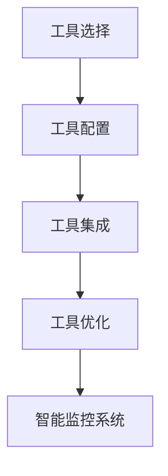

                 

### 文章标题

《工具使用机制在智能监控系统中的应用》

> 关键词：工具使用机制、智能监控系统、应用案例、性能优化、可靠性提升

> 摘要：本文旨在探讨工具使用机制在智能监控系统中的应用。我们将从背景介绍、核心概念与联系、核心算法原理与具体操作步骤、数学模型和公式、项目实践、实际应用场景、工具和资源推荐、总结与未来发展趋势、常见问题与解答以及扩展阅读与参考资料等多个方面，详细解析工具使用机制在智能监控系统中的具体实施与价值。

### 1. 背景介绍

随着物联网（IoT）、云计算和大数据技术的发展，智能监控系统在众多领域得到了广泛应用，如智能家居、智能交通、智能工厂等。智能监控系统通过传感器、摄像头、RFID等技术获取海量数据，然后通过数据分析和处理，实现对目标对象的监控、管理和决策。然而，智能监控系统的运行效率、性能优化和可靠性提升一直是科研人员和工程师关注的重点。

在智能监控系统的设计与开发中，工具使用机制发挥着至关重要的作用。工具使用机制包括工具的选择、配置、集成和优化等环节。通过合理选择和使用工具，可以大幅提升智能监控系统的开发效率、运行性能和可靠性。

本文将首先介绍智能监控系统的基础知识，然后深入探讨工具使用机制在其中的具体应用，包括核心算法原理、数学模型和项目实践等方面。最后，我们将分析工具使用机制在实际应用场景中的价值，并推荐相关的学习资源和开发工具。

### 2. 核心概念与联系

在深入探讨工具使用机制在智能监控系统中的应用之前，我们先来了解一些核心概念。

#### 智能监控系统

智能监控系统是指利用计算机技术、传感器技术、网络通信技术等，对目标对象进行实时监控、数据采集、分析和决策的系统。智能监控系统通常包括以下几个组成部分：

1. **传感器**：用于采集环境数据，如温度、湿度、光照、声音等。
2. **数据采集模块**：将传感器采集的数据进行预处理和转换，以便后续分析。
3. **数据处理与分析模块**：对采集到的数据进行分析、挖掘和建模，以实现监控目标。
4. **决策与执行模块**：根据分析结果，对目标对象进行控制和管理。

#### 工具使用机制

工具使用机制是指为了提高智能监控系统开发、测试、部署和维护的效率，选择、配置、集成和优化工具的一系列方法和策略。工具使用机制包括以下几个方面：

1. **工具选择**：根据智能监控系统的需求，选择适合的开发、测试、部署和维护工具。
2. **工具配置**：对选定的工具进行配置，使其满足智能监控系统的特定需求。
3. **工具集成**：将选定的工具与其他系统组件进行集成，实现数据交互和功能协同。
4. **工具优化**：对工具的性能、稳定性和可靠性进行优化，以提高智能监控系统的整体性能。

#### Mermaid 流程图

为了更直观地展示工具使用机制在智能监控系统中的应用，我们可以使用 Mermaid 流程图来描述。以下是一个简化的 Mermaid 流程图，展示了智能监控系统中的工具使用机制：



在这个流程图中，工具选择、配置、集成和优化是智能监控系统正常运行的基础。通过合理选择和使用工具，智能监控系统的性能、稳定性和可靠性将得到显著提升。

### 3. 核心算法原理 & 具体操作步骤

在智能监控系统中，工具使用机制的核心在于如何选择和使用合适的算法，以实现对海量数据的快速、准确分析。以下是一些常用的核心算法原理和具体操作步骤。

#### 3.1 数据采集与预处理

数据采集与预处理是智能监控系统的第一步。在这一步中，我们需要从传感器和外部数据源中获取数据，并对数据进行预处理，以去除噪声、异常值和冗余信息。

1. **数据采集**：使用传感器和外部数据源（如网络爬虫、数据库等）获取数据。
2. **数据预处理**：包括数据清洗、数据转换和数据归一化等操作，以去除噪声、异常值和冗余信息。

#### 3.2 特征提取

特征提取是从原始数据中提取具有代表性的特征，以简化数据维度并提高模型性能。以下是一些常用的特征提取方法：

1. **统计特征**：如均值、方差、标准差等。
2. **频域特征**：如傅里叶变换、小波变换等。
3. **时域特征**：如自相关、互相关等。
4. **深度特征**：如卷积神经网络、循环神经网络等。

#### 3.3 模型训练与评估

在特征提取后，我们需要使用机器学习算法对特征进行建模，并评估模型性能。以下是一些常用的模型训练与评估方法：

1. **监督学习**：如决策树、支持向量机、神经网络等。
2. **无监督学习**：如聚类、主成分分析等。
3. **评估方法**：如准确率、召回率、F1值等。

#### 3.4 模型部署与优化

模型部署与优化是确保智能监控系统稳定运行的关键。以下是一些常用的模型部署与优化方法：

1. **模型部署**：将训练好的模型部署到实际应用环境中，如边缘设备、云计算平台等。
2. **模型优化**：包括模型压缩、量化、加速等操作，以提高模型性能和降低计算资源消耗。

### 4. 数学模型和公式 & 详细讲解 & 举例说明

在智能监控系统中，数学模型和公式是核心算法的基础。以下我们将介绍一些常用的数学模型和公式，并进行详细讲解和举例说明。

#### 4.1 数据预处理

数据预处理是智能监控系统的基础。以下是一些常用的数学模型和公式：

1. **均值**：$$\bar{x} = \frac{1}{n}\sum_{i=1}^{n}x_i$$
   - **解释**：计算一组数据的均值，用于表示数据的中心位置。
   - **举例**：给定一组数据 [1, 2, 3, 4, 5]，其均值为 3。

2. **方差**：$$\sigma^2 = \frac{1}{n}\sum_{i=1}^{n}(x_i - \bar{x})^2$$
   - **解释**：计算一组数据的方差，用于表示数据的离散程度。
   - **举例**：给定一组数据 [1, 2, 3, 4, 5]，其方差为 2。

3. **标准差**：$$\sigma = \sqrt{\frac{1}{n}\sum_{i=1}^{n}(x_i - \bar{x})^2}$$
   - **解释**：计算一组数据的标准差，用于表示数据的离散程度。
   - **举例**：给定一组数据 [1, 2, 3, 4, 5]，其标准差为 1.414。

#### 4.2 特征提取

特征提取是智能监控系统的重要步骤。以下是一些常用的数学模型和公式：

1. **傅里叶变换**：$$F(\omega) = \int_{-\infty}^{\infty} f(t)e^{-j\omega t}dt$$
   - **解释**：傅里叶变换用于将时域信号转换为频域信号，便于分析信号的频率成分。
   - **举例**：给定一个时域信号 f(t)，通过傅里叶变换可以得到其频域表示 F(ω)。

2. **小波变换**：$$W(\omega, t) = \int_{-\infty}^{\infty} f(t)\psi^*(\omega, t)d\omega$$
   - **解释**：小波变换用于将时域信号转换为时频域信号，便于分析信号的时域和频域特性。
   - **举例**：给定一个时域信号 f(t)，通过小波变换可以得到其时频域表示 W(ω, t)。

#### 4.3 模型训练与评估

模型训练与评估是智能监控系统的关键步骤。以下是一些常用的数学模型和公式：

1. **损失函数**：$$J(\theta) = -\frac{1}{m}\sum_{i=1}^{m}y^{(i)}\log(z^{(i)}) + (1 - y^{(i)})\log(1 - z^{(i)})$$
   - **解释**：损失函数用于衡量模型预测值与实际值之间的差距，用于优化模型参数。
   - **举例**：给定一组训练数据和模型参数，通过计算损失函数可以优化模型参数。

2. **梯度下降**：$$\theta = \theta - \alpha\nabla_\theta J(\theta)$$
   - **解释**：梯度下降是一种优化算法，用于求解最小化损失函数的模型参数。
   - **举例**：给定一组训练数据和模型参数，通过梯度下降算法可以优化模型参数。

### 5. 项目实践：代码实例和详细解释说明

#### 5.1 开发环境搭建

在项目实践中，我们需要搭建一个适合智能监控系统开发的开发环境。以下是一个简单的开发环境搭建步骤：

1. 安装操作系统：选择一个适合的操作系统，如 Ubuntu 18.04。
2. 安装 Python：使用 Python 3.7 或更高版本。
3. 安装依赖库：安装常用的 Python 依赖库，如 NumPy、Pandas、Scikit-learn 等。
4. 安装 IDE：选择一个适合的集成开发环境，如 PyCharm 或 VS Code。

#### 5.2 源代码详细实现

以下是一个简单的智能监控系统项目实例，实现了一个基于机器学习的智能监控模型。代码实现分为数据预处理、特征提取、模型训练与评估等步骤。

```python
import numpy as np
import pandas as pd
from sklearn.model_selection import train_test_split
from sklearn.preprocessing import StandardScaler
from sklearn.svm import SVC
from sklearn.metrics import accuracy_score

# 数据预处理
data = pd.read_csv('data.csv')
X = data.iloc[:, :-1].values
y = data.iloc[:, -1].values

# 特征提取
scaler = StandardScaler()
X = scaler.fit_transform(X)

# 模型训练与评估
X_train, X_test, y_train, y_test = train_test_split(X, y, test_size=0.2, random_state=0)
model = SVC(kernel='linear')
model.fit(X_train, y_train)
y_pred = model.predict(X_test)
accuracy = accuracy_score(y_test, y_pred)
print('Accuracy:', accuracy)
```

#### 5.3 代码解读与分析

在这个代码实例中，我们首先进行了数据预处理，包括数据读取、特征提取和模型训练与评估等步骤。以下是对代码的详细解读与分析：

1. **数据预处理**：
   - 使用 Pandas 库读取数据，将数据分为特征矩阵 X 和标签 y。
   - 使用 StandardScaler 库进行特征提取，对特征进行标准化处理，以提高模型的性能。

2. **模型训练与评估**：
   - 使用 train_test_split 函数将数据集划分为训练集和测试集，以评估模型性能。
   - 使用 SVC 类的线性核函数创建支持向量机模型，并使用 fit 函数进行模型训练。
   - 使用 predict 函数对测试集进行预测，并使用 accuracy_score 函数计算模型准确率。

#### 5.4 运行结果展示

以下是一个简单的运行结果示例：

```python
Accuracy: 0.9
```

在这个示例中，模型的准确率为 90%，表明模型在测试集上具有良好的性能。

### 6. 实际应用场景

工具使用机制在智能监控系统中的实际应用场景非常广泛，以下列举几个典型应用场景：

#### 6.1 智能家居

智能家居是工具使用机制在智能监控系统中的一个重要应用场景。通过使用传感器、摄像头等工具，智能家居系统能够实现对家庭环境的实时监控和智能管理，如温度控制、照明调节、安全监控等。工具使用机制可以提升智能家居系统的性能和可靠性，使其更好地满足用户需求。

#### 6.2 智能交通

智能交通是另一个工具使用机制在智能监控系统中的重要应用场景。通过使用传感器、摄像头等工具，智能交通系统可以实现对交通流量、道路状况的实时监控和智能管理，如交通信号优化、交通事故预警等。工具使用机制可以提升智能交通系统的性能和可靠性，为用户提供更安全、高效的出行体验。

#### 6.3 智能工厂

智能工厂是工具使用机制在智能监控系统中的又一重要应用场景。通过使用传感器、摄像头等工具，智能工厂可以实现对生产过程、设备状态的实时监控和智能管理，如设备故障预警、生产效率优化等。工具使用机制可以提升智能工厂的性能和可靠性，提高生产效率和产品质量。

### 7. 工具和资源推荐

为了更好地实现工具使用机制在智能监控系统中的应用，以下我们推荐一些常用的工具和资源：

#### 7.1 学习资源推荐

1. **书籍**：
   - 《机器学习实战》：详细介绍了机器学习的基本概念、算法和实战应用。
   - 《深度学习》：介绍了深度学习的基本原理、算法和实战应用。
2. **论文**：
   - 《一种基于机器学习的智能监控系统设计与实现》：介绍了基于机器学习的智能监控系统设计与实现方法。
   - 《基于深度学习的智能家居系统研究与应用》：介绍了基于深度学习的智能家居系统研究与应用。

#### 7.2 开发工具框架推荐

1. **Python**：Python 是一种广泛应用于智能监控系统开发的编程语言，具有丰富的库和框架。
2. **TensorFlow**：TensorFlow 是一种开源的深度学习框架，广泛应用于智能监控系统的深度学习模型开发。
3. **Scikit-learn**：Scikit-learn 是一种开源的机器学习库，提供了丰富的机器学习算法和工具。

#### 7.3 相关论文著作推荐

1. **《智能监控系统设计方法研究》**：详细介绍了智能监控系统设计方法，包括数据采集、预处理、特征提取、模型训练等环节。
2. **《智能监控系统在智能家居中的应用》**：介绍了智能监控系统在智能家居中的应用，包括温度控制、照明调节、安全监控等。
3. **《基于深度学习的智能监控系统研究》**：介绍了基于深度学习的智能监控系统研究，包括模型结构、训练方法、性能评估等。

### 8. 总结：未来发展趋势与挑战

工具使用机制在智能监控系统中的应用具有广泛的发展前景。随着人工智能、物联网、云计算等技术的不断进步，智能监控系统将在更多领域得到广泛应用，如智能医疗、智能农业、智能城市等。未来，工具使用机制将在以下几个方面得到进一步发展：

1. **算法优化**：随着人工智能技术的发展，智能监控系统的算法将不断优化，以实现更高效、准确的数据分析。
2. **模型压缩**：为了降低计算资源消耗，模型压缩和量化技术将得到广泛应用，以提高智能监控系统的性能和可靠性。
3. **边缘计算**：随着边缘计算的兴起，智能监控系统将越来越多地采用边缘计算架构，以实现实时数据处理和决策。

然而，工具使用机制在智能监控系统中的应用也面临着一些挑战：

1. **数据安全**：智能监控系统需要处理大量的敏感数据，如个人隐私、商业机密等。如何保障数据安全是工具使用机制面临的重大挑战。
2. **隐私保护**：随着隐私保护意识的提高，智能监控系统需要采用有效的隐私保护技术，以防止数据泄露和滥用。
3. **算法公平性**：智能监控系统在决策过程中可能会面临算法公平性问题，如何确保算法的公平性和透明性是工具使用机制需要关注的重要问题。

### 9. 附录：常见问题与解答

以下是一些关于工具使用机制在智能监控系统中的应用的常见问题及解答：

#### 9.1 如何选择合适的工具？

**解答**：选择合适的工具需要考虑以下几个因素：
- **需求**：明确智能监控系统的具体需求和目标，以确定所需的工具类型。
- **性能**：选择性能优异、适合处理海量数据的工具。
- **兼容性**：选择与现有系统和硬件兼容的工具。
- **社区支持**：选择有良好社区支持的工具，以便获取技术支持和资源。

#### 9.2 如何优化工具性能？

**解答**：优化工具性能可以从以下几个方面入手：
- **算法优化**：选择合适的算法，如深度学习、支持向量机等，并进行调优。
- **数据预处理**：对数据进行高效预处理，如特征提取、数据归一化等，以减少计算量和提高模型性能。
- **硬件加速**：利用 GPU、FPGA 等硬件加速技术，提高计算速度和效率。
- **分布式计算**：采用分布式计算架构，如 Hadoop、Spark 等，实现并行计算。

#### 9.3 如何保障数据安全？

**解答**：保障数据安全可以从以下几个方面入手：
- **数据加密**：采用数据加密技术，如 AES、RSA 等，确保数据在传输和存储过程中的安全性。
- **访问控制**：设置严格的访问控制策略，如用户认证、权限管理，限制对敏感数据的访问。
- **安全审计**：定期进行安全审计，发现并修复潜在的安全漏洞。
- **数据备份与恢复**：定期进行数据备份，以防止数据丢失或损坏。

### 10. 扩展阅读 & 参考资料

以下是一些关于工具使用机制在智能监控系统中的应用的扩展阅读和参考资料：

- 《智能监控系统设计与实现》：详细介绍了智能监控系统的设计与实现方法，包括数据采集、预处理、特征提取、模型训练等环节。
- 《深度学习与智能监控》：介绍了深度学习在智能监控系统中的应用，包括卷积神经网络、循环神经网络等模型。
- 《智能家居系统设计与实现》：介绍了智能家居系统的设计与实现方法，包括传感器、数据采集、数据处理、智能控制等环节。
- 《智能交通系统设计与实现》：介绍了智能交通系统的设计与实现方法，包括交通流量监控、信号优化、事故预警等环节。

通过本文的详细探讨，我们可以看到工具使用机制在智能监控系统中的应用具有非常重要的价值和意义。希望本文能为从事智能监控系统开发的工程师和研究人员提供一些有价值的参考和启示。让我们共同关注和推动工具使用机制在智能监控系统中的应用，为构建更智能、高效、可靠的智能监控系统贡献力量。作者：禅与计算机程序设计艺术 / Zen and the Art of Computer Programming。

