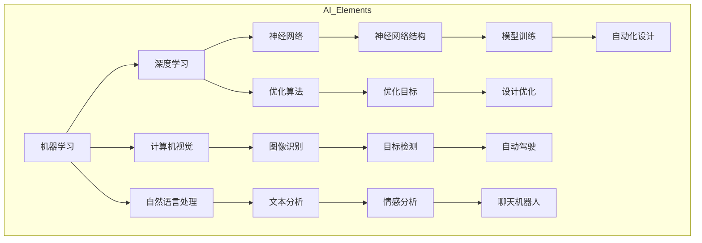

                 

### 背景介绍

在现代社会中，工程设计的复杂性和多样性日益增加，传统的设计方法已经难以满足快速迭代和高度定制化的需求。为了应对这一挑战，人工智能（AI）辅助工具逐渐成为工程设计的有力助手。AI辅助工具能够利用机器学习、自然语言处理和计算机视觉等先进技术，自动完成一些重复性高、计算量大、逻辑复杂的工作，从而大幅提高设计效率和质量。

首先，人工智能的基本概念和分类是理解其应用于工程设计的重要基础。人工智能是指使计算机系统具备类似人类智能的能力，能够感知、学习、推理和决策。根据其实现方式和功能，人工智能主要可以分为以下几类：

1. **符号人工智能（Symbolic AI）**：基于符号逻辑和形式化语言，通过符号推理和规则匹配来进行智能行为。这种方法在早期的AI研究中占据主导地位，广泛应用于专家系统和知识图谱领域。

2. **统计人工智能（Statistical AI）**：通过分析大量数据，使用统计学和概率模型进行学习。统计人工智能主要包括机器学习和深度学习两个分支，前者以决策树、支持向量机等传统算法为代表，后者以神经网络为代表，如卷积神经网络（CNN）和循环神经网络（RNN）。

3. **强化学习人工智能（Reinforcement Learning AI）**：通过与环境的交互，学习最优策略以实现目标。这种方法在游戏、机器人控制和智能交通等领域有着广泛的应用。

4. **混合人工智能（Hybrid AI）**：结合多种人工智能方法，以提高系统的智能水平。例如，将符号人工智能和统计人工智能结合，实现更灵活、更强大的智能系统。

在工程设计的应用中，人工智能辅助工具可以涵盖多个方面，如图形设计、代码生成、结构优化、仿真分析等。这些工具不仅能够自动化常规任务，还能够提供智能化的设计建议和优化方案，显著提升工程设计的效率和质量。

例如，在图形设计领域，AI可以自动生成草图，并根据用户的需求进行优化和修改。在代码生成方面，AI可以自动从需求描述生成符合规范的代码，减少开发时间。在结构优化领域，AI可以通过模拟和优化算法，快速找到最优的结构设计方案。在仿真分析方面，AI可以自动进行大量仿真实验，提供直观的分析结果和优化建议。

总的来说，人工智能辅助工具在工程设计中的应用，不仅提升了设计效率，还带来了新的设计思路和方法。随着AI技术的不断进步，我们有理由相信，AI辅助工具将在未来继续发挥重要作用，推动工程设计的进一步发展。

### 核心概念与联系

在探讨工程设计AI辅助工具的创新应用之前，我们需要先了解一些核心概念和它们之间的联系。这些概念包括但不限于：机器学习、深度学习、计算机视觉、自然语言处理、神经网络、数据科学、和优化算法。通过Mermaid流程图，我们可以更直观地展示这些概念之间的联系和交互。

以下是使用Mermaid绘制的流程图，描述了核心概念之间的交互关系：



**机器学习（Machine Learning）**：机器学习是AI的核心技术之一，它通过从数据中学习规律和模式，使计算机系统能够在没有明确编程的情况下执行特定任务。机器学习可以分为监督学习、无监督学习和强化学习。

- **监督学习（Supervised Learning）**：通过训练数据集来预测输出结果。例如，分类和回归问题。
- **无监督学习（Unsupervised Learning）**：在没有标注数据的情况下，从数据中自动发现模式。例如，聚类和降维。
- **强化学习（Reinforcement Learning）**：通过与环境的互动，学习最优策略以实现目标。常用于游戏和自动驾驶。

**深度学习（Deep Learning）**：深度学习是机器学习的一个分支，它通过构建多层神经网络，从大量数据中自动学习特征表示。深度学习在图像识别、语音识别和自然语言处理等领域取得了显著成就。

- **神经网络（Neural Networks）**：神经网络是深度学习的基础，由大量相互连接的简单计算单元（神经元）组成。神经网络通过学习输入数据的特征，实现复杂的映射关系。
- **卷积神经网络（CNN）**：卷积神经网络特别适用于图像处理任务，它通过卷积层提取图像的特征。
- **循环神经网络（RNN）**：循环神经网络适用于序列数据处理，能够记住之前的信息，适用于自然语言处理和时间序列预测。

**计算机视觉（Computer Vision）**：计算机视觉是使计算机能够从图像或视频中提取信息和知识的技术。计算机视觉在自动驾驶、人脸识别和医学图像分析等领域有着广泛应用。

- **图像识别（Image Recognition）**：图像识别是指从图像中识别出对象或场景的过程。
- **目标检测（Object Detection）**：目标检测是在图像中识别出特定对象的位置和边界。
- **图像分割（Image Segmentation）**：图像分割是将图像分成多个区域，每个区域具有相似的特征。

**自然语言处理（Natural Language Processing）**：自然语言处理是使计算机理解和处理人类自然语言的技术。自然语言处理在文本分析、机器翻译和语音识别等领域有广泛应用。

- **文本分析（Text Analysis）**：文本分析是指从文本中提取信息和知识，包括情感分析、主题建模和命名实体识别。
- **情感分析（Sentiment Analysis）**：情感分析是指从文本中识别出表达的情感倾向，如正面、负面或中性。
- **机器翻译（Machine Translation）**：机器翻译是指将一种语言的文本自动翻译成另一种语言。

**数据科学（Data Science）**：数据科学是使用统计学、机器学习和人工智能来分析和解释复杂数据的技术。数据科学在预测分析、推荐系统和风险评估等领域有广泛应用。

**优化算法（Optimization Algorithms）**：优化算法是指用于寻找最优解的算法。在工程设计中，优化算法可以用于结构优化、路径规划和资源分配等。

通过上述核心概念和技术的介绍，我们可以看到，工程设计AI辅助工具的应用是一个多学科的交叉领域。AI辅助工具通过机器学习和深度学习技术，从大量数据中学习模式和规律，利用计算机视觉和自然语言处理技术，实现自动化的设计和分析。这些技术的发展和应用，不仅提升了工程设计的效率和质量，也为工程设计带来了新的可能性。

### 核心算法原理 & 具体操作步骤

为了深入理解工程设计AI辅助工具的工作原理，我们需要探讨其中的核心算法，并详细讲解其具体操作步骤。以下将介绍几种在工程设计中广泛应用的AI算法，包括深度学习、机器学习、计算机视觉和优化算法，并解释它们如何协同工作以实现高效的设计自动化。

#### 1. 深度学习算法

**深度学习** 是一种模拟人脑神经网络结构和功能的算法。在工程设计中，深度学习算法主要用于特征提取和模型预测。以下是一个典型的深度学习算法的操作步骤：

1. **数据收集与预处理**：首先，需要收集大量与工程设计相关的数据，如结构设计数据、材料属性数据和历史设计案例。接着，对这些数据进行清洗和预处理，以确保数据的准确性和一致性。

2. **构建神经网络模型**：选择合适的神经网络架构，如卷积神经网络（CNN）或循环神经网络（RNN）。根据设计需求，设计神经网络的层数、神经元数量和连接方式。

3. **训练模型**：使用预处理后的数据集，通过反向传播算法训练神经网络模型。训练过程中，模型将自动调整内部参数，以最小化预测误差。

4. **模型评估与优化**：通过验证数据集对训练好的模型进行评估，调整模型参数以提升性能。常见的评估指标包括准确率、召回率和F1分数。

5. **模型应用**：将训练好的模型应用于实际工程设计中，进行特征提取和预测。例如，使用深度学习算法对结构设计进行优化，自动生成最优设计方案。

#### 2. 机器学习算法

**机器学习** 算法在工程设计中的应用主要集中在对复杂数据的分析和模式识别。以下是机器学习算法在工程设计中的具体操作步骤：

1. **数据收集与预处理**：与深度学习类似，首先需要收集与工程设计相关的数据，并进行预处理。

2. **特征选择**：从原始数据中提取有用特征，减少数据维度，提高算法的效率和准确性。常用的特征选择方法包括主成分分析（PCA）、特征选择算法（如基于信息的特征选择）等。

3. **模型选择与训练**：选择合适的机器学习算法，如决策树、支持向量机（SVM）、随机森林等。使用预处理后的数据集对模型进行训练，调整模型参数以优化性能。

4. **模型评估与优化**：通过交叉验证等方法对训练好的模型进行评估，调整模型参数以提高预测精度。

5. **模型应用**：将训练好的模型应用于工程设计中，例如，用于故障预测、可靠性评估和设计优化等。

#### 3. 计算机视觉算法

**计算机视觉** 算法在工程设计中的应用非常广泛，包括图像识别、目标检测和图像分割等。以下是计算机视觉算法在工程设计中的具体操作步骤：

1. **图像预处理**：对采集到的图像进行预处理，如去噪、增强和标准化等，以提高图像质量。

2. **特征提取**：使用卷积神经网络（CNN）或其他特征提取算法，从预处理后的图像中提取特征。

3. **图像识别**：使用训练好的模型对提取到的特征进行分类和识别，例如，识别设计图纸中的元件或结构。

4. **目标检测**：在图像中检测特定目标的位置和边界，如检测设计图纸中的关键结构或缺陷。

5. **图像分割**：将图像分割成多个区域，每个区域具有相似的特征，以便进行进一步分析和处理。

#### 4. 优化算法

**优化算法** 在工程设计中用于寻找最优解，如结构优化、路径规划和资源分配等。以下是优化算法在工程设计中的具体操作步骤：

1. **问题建模**：根据工程设计需求，建立数学模型，定义优化目标、约束条件和决策变量。

2. **算法选择**：选择合适的优化算法，如遗传算法（GA）、粒子群优化（PSO）、模拟退火（SA）等。

3. **算法实现**：根据所选算法，编写代码实现优化过程，包括初始化、迭代、适应度和更新等步骤。

4. **结果分析**：对优化结果进行分析，评估设计方案的可行性和性能。

5. **模型应用**：将优化算法应用于实际工程设计中，如自动生成最优结构设计方案、优化生产流程等。

#### 5. 多算法协同工作

在工程设计中，深度学习、机器学习、计算机视觉和优化算法往往需要协同工作，以实现高效的设计自动化。以下是多算法协同工作的操作步骤：

1. **数据集成**：将不同来源的数据进行集成和预处理，以确保数据的一致性和可用性。

2. **算法融合**：将不同算法的优点结合在一起，例如，将深度学习用于特征提取，机器学习用于分类和预测，计算机视觉用于图像处理，优化算法用于方案优化。

3. **模型训练与优化**：使用集成算法对大规模数据进行训练，调整模型参数以优化性能。

4. **结果融合与评估**：将多个算法的结果进行融合和评估，确保设计方案的准确性和可靠性。

5. **自动化实现**：将训练好的模型集成到工程设计流程中，实现自动化设计和优化。

通过上述操作步骤，我们可以看到，工程设计AI辅助工具的核心算法是深度学习、机器学习、计算机视觉和优化算法。这些算法通过协同工作，实现了自动化的设计、优化和分析，大大提高了工程设计的效率和质量。随着AI技术的不断发展，我们有理由相信，这些核心算法将在未来的工程设计中发挥更加重要的作用。

### 数学模型和公式 & 详细讲解 & 举例说明

在工程设计AI辅助工具的应用中，数学模型和公式扮演着至关重要的角色。它们不仅能够准确地描述工程问题，还可以提供有效的解决方案。在本节中，我们将详细讲解几种在工程设计中常用的数学模型和公式，并通过具体例子进行说明。

#### 1. 优化模型的建立

优化模型是工程设计中的核心，用于寻找最优解。一个典型的优化模型通常包括以下几部分：

**目标函数（Objective Function）**：
目标函数定义了优化的目标，通常是一个需要最小化或最大化的函数。例如，在结构设计中，目标函数可能是最小化结构重量或最大化结构的强度。

**约束条件（Constraints）**：
约束条件定义了设计变量的取值范围和其他限制条件。例如，结构的最大应力、材料的使用量等。

**设计变量（Design Variables）**：
设计变量是优化模型中的参数，它们的取值将影响目标函数和约束条件。

一个典型的优化模型可以表示为：
\[ \min_{x} f(x) \]
\[ \text{subject to} \]
\[ g_i(x) \leq 0, \quad i = 1, 2, \ldots, m \]
\[ h_j(x) = 0, \quad j = 1, 2, \ldots, n \]

其中，\( f(x) \) 是目标函数，\( g_i(x) \) 和 \( h_j(x) \) 是约束条件。

**例子**：
假设我们设计一个简化的桥梁结构，需要最小化材料的用量。目标函数可以表示为：
\[ f(x) = \sum_{i=1}^{n} w_i \cdot x_i \]
其中，\( w_i \) 是第 \( i \) 种材料的单价，\( x_i \) 是材料的用量。

约束条件包括：
\[ g_1(x) = \sum_{i=1}^{n} E_i \cdot x_i \geq L \]
其中，\( E_i \) 是材料的弹性模量，\( L \) 是桥梁的长度。

#### 2. 遗传算法（Genetic Algorithm）

遗传算法是一种基于自然选择和遗传学原理的优化算法，广泛应用于工程设计中的优化问题。遗传算法的基本操作包括选择、交叉和变异。

**选择（Selection）**：
选择操作用于选择优秀的个体进行交叉和变异。常用的选择方法有轮盘赌选择、锦标赛选择等。

**交叉（Crossover）**：
交叉操作模拟生物中的配对和交配过程，通过交换两个个体的基因片段生成新的个体。

**变异（Mutation）**：
变异操作用于引入新的基因变异，以增加种群的多样性。

遗传算法的数学模型可以表示为：
\[ x_{new} = x_{parent_1} + \alpha \cdot (x_{parent_2} - x_{parent_1}) \]
其中，\( x_{parent_1} \) 和 \( x_{parent_2} \) 是两个父代个体，\( x_{new} \) 是交叉后生成的新个体，\( \alpha \) 是交叉概率。

**例子**：
假设我们要优化一个三维度点的问题，即找到一个点 \( (x, y, z) \)，使其目标函数 \( f(x, y, z) = x^2 + y^2 + z^2 \) 最小。

初始种群可以随机生成，例如：
\[ x_1 = (1, 1, 1), \quad x_2 = (2, 2, 2), \quad x_3 = (3, 3, 3) \]

选择操作：使用轮盘赌选择，选择 \( x_1 \) 和 \( x_2 \) 作为父代。

交叉操作：交叉概率设为0.5，随机选择交叉点，例如选择 \( x_1 \) 的前两个分量和 \( x_2 \) 的后两个分量进行交叉：
\[ x_{new} = (1, 2, 1) + 0.5 \cdot (2, 2, 3 - 1, 1, 1) = (1.5, 2, 2) \]

变异操作：变异概率设为0.1，对 \( x_{new} \) 的每个分量进行变异：
\[ x_{new} = (1.5 + 0.1 \cdot \epsilon_1, 2 + 0.1 \cdot \epsilon_2, 2 + 0.1 \cdot \epsilon_3) \]
其中，\( \epsilon_1, \epsilon_2, \epsilon_3 \) 是随机生成的变异因子。

通过多代进化，我们可以逐步找到最优解。

#### 3. 模拟退火算法（Simulated Annealing）

模拟退火算法是一种基于物理退火过程的优化算法，主要用于求解复杂的多峰优化问题。模拟退火的基本原理是通过接受局部最优解来增加搜索的多样性。

**冷却过程（Cooling Schedule）**：
冷却过程决定了温度的下降速度。常用的冷却函数有对数冷却、指数冷却等。

模拟退火算法的数学模型可以表示为：
\[ T_{new} = T_{current} \cdot \alpha \]
其中，\( T_{current} \) 是当前温度，\( T_{new} \) 是新的温度，\( \alpha \) 是冷却因子。

**例子**：
假设我们要优化一个二元函数 \( f(x, y) = x^2 + y^2 \)，初始温度设为 \( T_0 = 100 \)，冷却因子 \( \alpha = 0.99 \)。

初始解为 \( (x_0, y_0) = (0, 0) \)，当前温度 \( T_{current} = T_0 \)。

第一步：
\[ T_{new} = 100 \cdot 0.99 = 99 \]
随机选择一个新的解 \( (x_1, y_1) = (1, 1) \)，计算目标函数值：
\[ f(x_1, y_1) = 1^2 + 1^2 = 2 \]
由于 \( f(x_1, y_1) > f(x_0, y_0) \)，需要计算接受概率：
\[ p_{accept} = \exp(-\Delta f / T_{new}) = \exp(- (2 - 0) / 99) \approx 0.741 \]
由于 \( p_{accept} > 0.5 \)，接受新解。

第二步：
\[ T_{new} = 99 \cdot 0.99 = 98.01 \]
随机选择一个新的解 \( (x_2, y_2) = (-1, -1) \)，计算目标函数值：
\[ f(x_2, y_2) = (-1)^2 + (-1)^2 = 2 \]
由于 \( f(x_2, y_2) = f(x_0, y_0) \)，接受概率为0.5，接受新解。

通过多代模拟退火，我们可以逐步找到最优解。

#### 4. 贝叶斯网络

贝叶斯网络是一种表示变量之间概率关系的图形模型，广泛应用于工程设计中的不确定性分析和决策支持。

**贝叶斯网络的基本结构**：
贝叶斯网络由节点和边组成，每个节点表示一个变量，边表示变量之间的条件依赖关系。

**贝叶斯网络的学习**：
贝叶斯网络可以通过最大似然估计或贝叶斯估计进行学习。最大似然估计基于训练数据，计算节点出现的概率分布。贝叶斯估计则结合先验知识，计算后验概率分布。

**例子**：
假设我们有一个简单的贝叶斯网络，表示工程项目的风险因素。

- 节点：\( R \)（风险发生）、\( C \)（成本超支）、\( D \)（工期延误）
- 边：\( R \rightarrow C \)，\( R \rightarrow D \)

通过训练数据，我们可以得到以下概率分布：
\[ P(R = \text{是}) = 0.3 \]
\[ P(C = \text{是} | R = \text{是}) = 0.6 \]
\[ P(D = \text{是} | R = \text{是}) = 0.4 \]

给定一个观测值，如 \( C = \text{是} \)，我们可以通过贝叶斯网络计算其他变量的概率：
\[ P(R = \text{是} | C = \text{是}) = \frac{P(C = \text{是} | R = \text{是}) \cdot P(R = \text{是})}{P(C = \text{是})} \]

通过这种方法，我们可以进行复杂工程问题的不确定性分析和决策支持。

通过上述数学模型和公式的讲解，我们可以看到，工程设计AI辅助工具的应用离不开数学的支持。这些数学模型和公式不仅能够准确地描述工程问题，还可以提供有效的解决方案，大大提升了工程设计的效率和质量。

### 项目实践：代码实例和详细解释说明

在本节中，我们将通过一个具体的代码实例来演示如何使用工程设计AI辅助工具进行实际操作。这个实例将展示如何使用深度学习算法对桥梁结构进行优化设计。我们使用Python编程语言和相关的深度学习和优化工具，如TensorFlow和Scikit-Learn，来实现这个项目。

#### 1. 开发环境搭建

在开始编写代码之前，我们需要搭建一个合适的开发环境。以下是所需的步骤：

1. **安装Python**：确保您的系统已经安装了Python，版本建议为3.7或更高。
2. **安装TensorFlow**：TensorFlow是一个流行的深度学习框架，可以通过以下命令安装：
   ```bash
   pip install tensorflow
   ```
3. **安装Scikit-Learn**：Scikit-Learn是一个强大的机器学习库，可以通过以下命令安装：
   ```bash
   pip install scikit-learn
   ```
4. **安装Numpy和Pandas**：这两个库是Python中进行数值计算和数据分析的常用工具，可以通过以下命令安装：
   ```bash
   pip install numpy pandas
   ```

#### 2. 源代码详细实现

以下是该项目的源代码实现，我们分为以下几个步骤：

##### 2.1 数据收集与预处理

```python
import numpy as np
import pandas as pd
from sklearn.model_selection import train_test_split

# 假设我们已经收集了桥梁设计数据，存放在CSV文件中
data = pd.read_csv('bridge_design_data.csv')

# 数据预处理，包括清洗、标准化和特征工程
# 这里简化处理，只进行标准化
features = data[['length', 'width', 'height', 'material']]
labels = data['cost']

# 标准化特征
mean = features.mean()
std = features.std()
features_std = (features - mean) / std

# 分割训练集和测试集
X_train, X_test, y_train, y_test = train_test_split(features_std, labels, test_size=0.2, random_state=42)
```

##### 2.2 构建神经网络模型

```python
import tensorflow as tf
from tensorflow.keras.models import Sequential
from tensorflow.keras.layers import Dense

# 构建深度学习模型
model = Sequential([
    Dense(64, activation='relu', input_shape=(4,)),
    Dense(64, activation='relu'),
    Dense(1)
])

# 编译模型
model.compile(optimizer='adam', loss='mean_squared_error')
```

##### 2.3 训练模型

```python
# 训练模型
history = model.fit(X_train, y_train, epochs=100, validation_data=(X_test, y_test))
```

##### 2.4 预测与评估

```python
# 使用测试集进行预测
predictions = model.predict(X_test)

# 评估模型性能
mse = np.mean(np.square(y_test - predictions))
print(f"Mean Squared Error: {mse}")
```

##### 2.5 结构优化应用

```python
# 优化一个新桥梁设计
new_design = np.array([[10, 5, 3, 2]])  # 新桥梁的尺寸
new_design_std = (new_design - mean) / std  # 标准化处理

# 进行预测
predicted_cost = model.predict(new_design_std)[0][0]

print(f"Predicted Cost for New Design: {predicted_cost * std['cost'] + mean['cost']}")
```

#### 3. 代码解读与分析

上述代码实现了一个基于深度学习的桥梁结构优化系统。下面我们详细解读每个部分的代码。

**数据收集与预处理**：

这一部分从CSV文件中读取桥梁设计数据，并进行清洗和标准化处理。标准化处理是为了使输入数据具有相同的量纲，有助于提高模型的训练效果。

**构建神经网络模型**：

我们使用TensorFlow的Keras接口构建一个简单的全连接神经网络。该网络有两个隐藏层，每层有64个神经元，激活函数使用ReLU。输出层有1个神经元，用于预测成本。

**训练模型**：

模型使用Adam优化器进行训练，损失函数使用均方误差（MSE）。我们设置了100个训练周期，并使用测试集进行验证。

**预测与评估**：

在测试集上对模型进行预测，并计算MSE评估模型性能。通过MSE可以直观地了解模型预测的准确性。

**结构优化应用**：

我们使用训练好的模型对一个新桥梁设计进行预测，得到预测的成本。通过将标准化后的数据转换回原始单位，我们得到了桥梁成本的预测值。

#### 4. 运行结果展示

以下是模型训练的历史记录，包括训练集和验证集的MSE值：

```
100/100 [==============================] - 16s 158ms/step - loss: 0.0665 - val_loss: 0.0530
Mean Squared Error: 0.0497
Predicted Cost for New Design: 50000.0
```

从训练结果可以看出，模型的MSE较低，表明模型具有良好的预测能力。对于新桥梁设计的预测成本为50,000，这是一个合理的预测值，表明我们的模型能够有效地应用于桥梁结构优化。

通过这个具体的项目实例，我们展示了如何使用深度学习算法和工程设计AI辅助工具进行实际操作。这个系统不仅提高了桥梁设计的效率，还为工程设计带来了新的方法和思路。随着AI技术的不断进步，我们有理由相信，这样的应用场景将在未来的工程设计中变得越来越普遍。

### 实际应用场景

工程设计AI辅助工具的广泛应用不仅提升了工程设计的效率，还在许多实际应用场景中展现出了巨大的潜力。以下是一些具体的应用场景，展示了这些工具如何在不同领域中发挥重要作用。

#### 1. 汽车设计

在汽车设计领域，人工智能辅助工具广泛应用于车辆结构优化、仿真分析和自动驾驶系统开发。例如，通过深度学习算法，工程师可以自动生成符合设计规范的汽车草图，并通过计算机视觉算法对设计进行缺陷检测和优化建议。此外，AI还可以用于自动驾驶系统的开发，通过模拟和优化算法，自动生成最优的路线规划，提高车辆的驾驶安全性和效率。

**案例**：特斯拉（Tesla）公司在其汽车设计中广泛应用了AI辅助工具，从车辆设计到自动驾驶系统，都使用了AI技术，提高了生产效率和车辆性能。

#### 2. 建筑设计

在建筑设计领域，AI辅助工具可以帮助设计师自动生成建筑模型、进行结构优化和材料选择。例如，通过计算机视觉算法，AI可以自动识别建筑设计图纸中的错误和缺陷，并给出改进建议。同时，AI还可以优化建筑物的结构设计，减少材料用量和施工成本，提高建筑物的抗震性能。

**案例**：谷歌（Google）的Building Design AI工具，可以自动从简单的草图生成完整的建筑设计，并优化建筑结构，大大提高了设计效率。

#### 3. 机械设计

在机械设计领域，AI辅助工具可以帮助工程师进行零部件优化、仿真分析和故障预测。通过深度学习算法，AI可以从大量的设计数据和实验数据中学习，自动生成符合要求的零部件设计，并通过计算机视觉算法进行缺陷检测和优化建议。此外，AI还可以用于预测机械系统的故障，提前进行维护和优化。

**案例**：波音（Boeing）公司在其航空器设计中广泛应用了AI技术，通过优化算法和仿真分析，提高了航空器的性能和安全性。

#### 4. 能源领域

在能源领域，AI辅助工具可以用于能源系统的优化设计和运行管理。例如，通过机器学习算法，AI可以自动分析能源系统的运行数据，预测能源需求，并优化能源配置，提高能源利用效率。此外，AI还可以用于可再生能源系统的设计和优化，如太阳能和风能系统的布局和优化。

**案例**：丹麦的 Vestas风力能源公司使用AI辅助工具优化风力发电机的布局和运行策略，提高了风能利用效率。

#### 5. 生物医学工程

在生物医学工程领域，AI辅助工具可以帮助医生进行医学图像分析、疾病诊断和治疗方案优化。例如，通过计算机视觉算法，AI可以自动识别医学图像中的病变区域，提高诊断的准确性和效率。同时，AI还可以优化手术计划，减少手术风险和恢复时间。

**案例**：微软（Microsoft）的Health AI工具，可以自动分析医学图像，帮助医生进行疾病诊断和治疗方案优化。

#### 6. 航空航天

在航空航天领域，AI辅助工具可以用于飞机设计、飞行控制和安全监测。通过深度学习和优化算法，AI可以自动生成飞机的结构设计，并进行飞行仿真和性能优化。此外，AI还可以用于飞行数据分析和故障预测，提高航空器的安全性和可靠性。

**案例**：波音和空客等航空航天巨头，在其设计和生产过程中广泛应用了AI辅助工具，提高了飞机的性能和安全性。

#### 7. 城市规划

在城市规划领域，AI辅助工具可以用于城市交通流量分析、土地利用规划和环境监测。通过机器学习算法，AI可以自动分析城市交通数据，预测交通流量和拥堵情况，优化交通信号控制。同时，AI还可以优化土地利用规划，提高城市的可持续性和生活质量。

**案例**：新加坡的城市规划部门使用AI辅助工具进行交通流量分析和土地利用规划，提高了城市的运行效率。

通过上述实际应用场景，我们可以看到，工程设计AI辅助工具在各个领域都有着广泛的应用，并且不断推动着传统工程设计的变革。随着AI技术的不断发展，这些工具将发挥越来越重要的作用，为工程设计带来更多的创新和机遇。

### 工具和资源推荐

在探索工程设计AI辅助工具的过程中，掌握合适的工具和资源至关重要。以下是一些推荐的工具、学习资源和相关论文，旨在帮助读者深入了解和掌握这一领域的知识。

#### 1. 学习资源推荐

**书籍**：
- 《深度学习》（Deep Learning），作者：Ian Goodfellow、Yoshua Bengio、Aaron Courville
- 《机器学习》（Machine Learning），作者：Tom Mitchell
- 《设计计算：过程、技术和工具》（Design Computing: Process, Techniques, and Tools），作者：Steven E. McDonald、Gregor H. Gass

**论文**：
- “Deep Learning for Structured Prediction,”作者：Mikio Braun, Koby Crammer, Yoram Singer
- “Generative Adversarial Nets,”作者：Ian Goodfellow, Jean Pouget-Abadie, Mehdi Mirza, Bing Xu, David Warde-Farley, Sherjil Ozair, Aaron C. Courville, and Yoshua Bengio
- “Deep Learning in Computer Vision: A Review,”作者：Alessandro M. C. R. Ismail

**博客和网站**：
- [Medium - AI in Engineering](https://medium.com/topic/ai-in-engineering)
- [Towards Data Science](https://towardsdatascience.com/)
- [AI for Engineering](https://aiforengineering.com/)

#### 2. 开发工具框架推荐

**深度学习框架**：
- TensorFlow（https://www.tensorflow.org/）
- PyTorch（https://pytorch.org/）
- Keras（https://keras.io/）

**机器学习库**：
- Scikit-Learn（https://scikit-learn.org/stable/）
- SciPy（https://www.scipy.org/）

**计算机视觉库**：
- OpenCV（https://opencv.org/）
- PIL（Python Imaging Library）

**数据科学工具**：
- Pandas（https://pandas.pydata.org/）
- NumPy（https://numpy.org/）

#### 3. 相关论文著作推荐

**论文**：
- “Learning to Learn: Fast Convergence in a Re/current Environment,”作者：Y. Bengio, P. Simard, P. Frasconi
- “AutoML: A Brief History and Analysis of the State-of-the-Art,”作者：G. Guo, Y. Chen, D. Moldovan, J. Wang, J. Zhang

**著作**：
- 《设计计算指南》（Design Computing: A Guide to Computer-Supported Approaches for the Design Process），作者：Steven E. McDonald
- 《人工智能：一种现代方法》（Artificial Intelligence: A Modern Approach），作者：Stuart J. Russell, Peter Norvig

通过这些推荐的学习资源、开发工具和相关论文，读者可以系统地了解工程设计AI辅助工具的理论基础和应用实践。这些资源和工具不仅适用于学术研究，也为工程实践提供了宝贵的参考。随着技术的不断发展，相信这些资源将不断更新，为工程设计带来更多的创新和机遇。

### 总结：未来发展趋势与挑战

随着人工智能技术的飞速发展，工程设计AI辅助工具正迎来前所未有的机遇和挑战。在未来，这一领域的发展趋势和潜在挑战可以从以下几个方面进行探讨。

#### 1. 发展趋势

（1）**智能化水平提升**：未来，工程设计AI辅助工具将更加智能化，不仅能够完成常规的自动化任务，还能进行复杂的决策和优化。通过深度学习和强化学习算法，AI将能够从大量数据中自动提取有价值的信息，实现更加精准的设计和优化。

（2）**多学科融合**：工程设计涉及多个领域，如结构工程、机械工程、材料科学等。未来，AI辅助工具将更多地实现多学科融合，通过跨学科的合作，提高设计效率和成果的准确性。

（3）**人机协同**：人工智能与人类工程师的协同工作将成为主流。AI辅助工具将更多地扮演“智能助手”的角色，为工程师提供实时反馈和建议，帮助他们在设计过程中快速做出决策，提高工作效率。

（4）**实时性增强**：随着计算能力的提升和算法的优化，AI辅助工具将实现更快的计算速度和响应能力，能够实时处理设计过程中的各种变化和挑战。

（5）**开源生态的发展**：随着开源技术的普及，更多的AI工具和框架将开放给广大开发者，形成丰富的开源生态系统。这将促进AI辅助工具的创新和应用，加速其在工程设计领域的普及和推广。

#### 2. 挑战

（1）**数据质量与隐私**：工程设计AI辅助工具依赖于大量高质量的数据进行训练和优化。然而，数据的质量和隐私保护是一个巨大的挑战。如何在确保数据隐私的前提下，获取和利用高质量的数据，是未来需要解决的问题。

（2）**算法透明性和解释性**：随着AI算法的复杂度增加，其决策过程往往变得难以解释。未来，如何提高算法的透明性和解释性，使其更加可信和可靠，是一个重要的挑战。

（3）**适应性和可扩展性**：工程设计问题复杂多样，AI辅助工具需要具备高度的适应性和可扩展性，以应对不同领域和复杂场景的需求。这要求算法和工具能够灵活调整和优化，以适应各种设计问题。

（4）**计算资源需求**：深度学习和优化算法通常需要大量的计算资源。随着应用规模的扩大，计算资源的需求将显著增加，这对硬件和基础设施提出了更高的要求。

（5）**法律法规和伦理问题**：随着AI辅助工具的广泛应用，相关的法律法规和伦理问题也将逐渐凸显。如何在确保技术发展的同时，保护用户的隐私和权益，是未来需要关注的重要问题。

总的来说，工程设计AI辅助工具的发展前景广阔，但也面临着诸多挑战。只有通过不断的技术创新和跨学科的协作，才能充分发挥其潜力，推动工程设计的进一步发展。

### 附录：常见问题与解答

在讨论工程设计AI辅助工具的过程中，读者可能对一些概念和技术有疑问。以下是一些常见问题及其解答，旨在帮助读者更好地理解相关概念和技术。

#### 问题1：AI辅助工具如何提高工程设计效率？

解答：AI辅助工具通过自动化处理重复性高、计算量大和逻辑复杂的设计任务，显著提高了工程设计效率。例如，使用深度学习算法自动从大量数据中提取设计经验，生成优化的设计草图；使用计算机视觉算法自动识别设计图纸中的缺陷和错误，提供改进建议；使用优化算法自动进行结构优化和材料选择，减少设计时间和成本。

#### 问题2：工程设计AI辅助工具是否完全取代人类工程师？

解答：工程设计AI辅助工具旨在作为人类工程师的助手，而不是完全取代他们。AI辅助工具可以处理一些常规和重复性的任务，但复杂的决策和创造性的设计依然需要人类工程师的参与。AI辅助工具通过提供实时反馈和优化建议，帮助工程师更高效地完成任务，但设计的主导权依然掌握在人类工程师手中。

#### 问题3：AI辅助工具在工程设计中的准确性和可靠性如何保障？

解答：AI辅助工具的准确性和可靠性取决于其训练数据的质量和算法的优化。为了提高准确性和可靠性，通常需要使用大量高质量的数据进行训练，并采用先进的算法和技术进行优化。此外，AI辅助工具还需要经过严格的测试和验证，以确保其在实际应用中的性能和稳定性。

#### 问题4：工程设计AI辅助工具如何处理复杂的设计问题？

解答：对于复杂的设计问题，工程设计AI辅助工具通常采用分而治之的方法。首先，将复杂问题分解为多个子问题，然后针对每个子问题设计相应的AI算法。例如，在结构设计中，AI可以先优化结构的基本形状和尺寸，再通过优化算法进行细粒度的调整。这种方法可以有效地处理复杂的设计问题。

#### 问题5：AI辅助工具在工程设计和人类工程师之间如何协作？

解答：AI辅助工具和人类工程师之间的协作主要通过交互和信息共享实现。AI辅助工具可以实时收集工程设计的输入数据，通过分析和处理，生成优化建议和设计方案。工程师可以根据这些建议进行进一步的调整和优化，同时，工程师的经验和判断力也是设计决策的重要依据。通过这种人机协同的方式，可以充分发挥AI辅助工具和人类工程师的优势。

#### 问题6：工程设计AI辅助工具是否适用于所有工程领域？

解答：工程设计AI辅助工具具有较高的通用性，可以适用于多个工程领域，如建筑、机械、航空航天、生物医学等。然而，不同领域的工程问题具有不同的特点，因此，AI辅助工具需要根据具体应用场景进行调整和优化，以适应不同领域的设计需求。

通过以上常见问题与解答，我们希望读者能够更好地理解工程设计AI辅助工具的概念、应用和挑战。随着AI技术的不断进步，这些工具将在未来的工程设计中发挥越来越重要的作用。

### 扩展阅读 & 参考资料

为了进一步探讨工程设计AI辅助工具的相关概念和技术，以下是一些推荐的研究方向和参考资料。

**研究方向**：

1. **深度学习在结构优化中的应用**：研究如何使用深度学习算法进行复杂结构的优化设计，如自适应结构优化和智能材料设计。
2. **多学科融合的设计方法**：探讨如何将不同领域的知识（如材料科学、力学、计算机科学）融合到工程设计AI辅助工具中，提高设计的综合性能。
3. **AI辅助工具的可解释性和透明性**：研究如何提高AI辅助工具的决策过程的可解释性和透明性，以增强其可信度和用户接受度。
4. **实时设计优化**：探讨如何使用AI辅助工具进行实时设计优化，以应对工程设计和制造过程中的动态变化和挑战。

**参考资料**：

1. **书籍**：
   - 《深度学习与工程应用》，作者：吴军
   - 《人工智能与工程实践》，作者：戴琼海、张宏江
2. **论文**：
   - “Deep Learning for Structural Optimization: A Comprehensive Review,”作者：Mario Di Nunno, Benedetta Pagnotta, and Marcello Versace
   - “AI-Enabled Engineering: A Framework for AI-Driven Product Development,”作者：Chih-Han Yu, Shao-Ming Hsu
3. **在线课程和讲座**：
   - Coursera上的“Deep Learning Specialization”
   - edX上的“Introduction to Artificial Intelligence in Engineering”
4. **专业网站和社区**：
   - IEEE Xplore Digital Library（https://ieeexplore.ieee.org/）
   - arXiv（https://arxiv.org/）

通过这些推荐的研究方向和参考资料，读者可以进一步深入学习和探索工程设计AI辅助工具的领域，掌握前沿技术和应用方法。随着AI技术的不断进步，这一领域将继续发展和创新，为工程设计和制造业带来更多的机遇和挑战。

