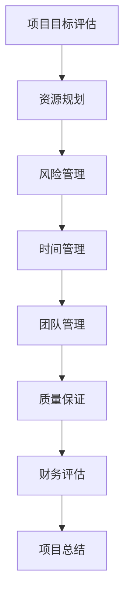

                 

### 背景介绍

巴菲特清单法则，由著名投资家沃伦·巴菲特提出，是他在长期投资实践中总结的一套筛选优质投资机会的方法论。这一法则的核心在于通过一系列简明扼要的检查清单，对潜在投资目标进行系统化的评估，从而提高投资决策的质量和成功率。巴菲特清单法则不仅适用于股票投资领域，其系统化、结构化的思维方式同样适用于项目管理、技术决策等多个领域。

在项目管理中，应用巴菲特清单法则意味着通过制定和执行一系列检查清单，对项目进行全面的评估和管理。这种方法有助于确保项目在实施过程中遵循既定的标准和流程，减少因疏忽或遗漏而导致的风险和问题。本文旨在探讨巴菲特清单法则在项目管理中的应用，通过具体实例和分析，展示这一方法在提高项目质量、效率和稳定性方面的优势。

项目管理是一个复杂而多变的领域，涉及多个环节和众多参与者。传统的项目管理方法往往依赖个人经验、判断和直觉，这可能导致项目在实施过程中出现偏差和风险。而巴菲特清单法则提供了一个系统化的框架，通过一系列具体的检查项目，帮助项目经理在决策过程中做到有的放矢，减少盲目性和不确定性。

本文将首先介绍巴菲特清单法则的基本概念和原理，然后通过具体的实例，展示如何在项目管理中应用这一方法。同时，本文还将探讨巴菲特清单法则在项目管理中的优势和局限性，以及如何在实际应用中克服这些局限性。最后，我们将总结巴菲特清单法则在项目管理中的关键作用，并提出未来发展的趋势和挑战。

通过本文的阅读，读者将了解到如何将巴菲特清单法则这一投资智慧转化为项目管理实践，从而提升项目管理的效率和效果。无论您是项目经理、团队领导，还是对项目管理有兴趣的专业人士，本文都希望能为您带来新的启示和帮助。

### 核心概念与联系

巴菲特清单法则的核心在于其系统化的思维方式，通过一系列简洁明了的检查清单来评估投资机会。这一法则不仅涵盖了财务指标和公司基本面分析，还包括了管理团队、市场环境等多方面的考量。为了更好地理解巴菲特清单法则在项目管理中的应用，我们需要先了解其基本概念和原理，并通过一个具体的示例来阐述这一方法。

#### 1. 巴菲特清单法则的基本概念

巴菲特清单法则的基本概念包括以下几个关键要素：

1. **财务指标**：包括公司的盈利能力、现金流、负债率等财务指标。这些指标是评估公司价值和投资潜力的基础。

2. **管理团队**：管理团队的素质和能力对公司的长期发展至关重要。巴菲特重视那些有着长期稳定投资记录的领导者，这反映了他们对公司长远发展的承诺。

3. **市场环境**：市场环境包括宏观经济状况、行业趋势和竞争态势等。一个有利的市场环境可以提高公司的竞争力，增加投资回报的可能性。

4. **竞争优势**：竞争优势是指公司在市场中相对于竞争对手的持久优势。这种优势可能是技术、品牌、渠道等多种因素的综合体现。

5. **公司治理**：良好的公司治理结构能够确保公司决策的透明度和有效性，减少潜在的治理风险。

#### 2. 巴菲特清单法则在项目管理中的应用

在项目管理中，巴菲特清单法则可以转化为一系列具体的检查清单，用于评估项目各个方面的质量和可行性。以下是一个简化的巴菲特清单法则在项目管理中的应用示例：

**项目评估检查清单**

1. **项目目标**：明确项目目标，确保其与组织的战略目标一致。

2. **资源规划**：评估项目所需的资源，包括人力、资金、技术等，确保资源充足且合理分配。

3. **风险管理**：识别潜在的风险，制定相应的风险缓解措施。

4. **时间管理**：制定项目进度计划，确保项目按时完成。

5. **团队管理**：评估团队成员的能力和经验，确保团队结构合理，沟通顺畅。

6. **质量保证**：确保项目实施过程中遵循既定的质量标准，实施有效的质量控制。

7. **财务评估**：评估项目的成本效益，确保项目的投资回报率符合预期。

#### 3. Mermaid 流程图

为了更直观地展示巴菲特清单法则在项目管理中的应用，我们可以使用 Mermaid 流程图来描述其流程。以下是巴菲特清单法则在项目管理中的 Mermaid 流程图：



在这个流程图中，每个节点代表一个具体的检查项目，节点之间的箭头表示项目之间的依赖关系。通过这一流程图，项目经理可以系统地评估项目各个方面，确保项目实施过程的有序和高效。

#### 4. 具体实例分析

为了更好地理解巴菲特清单法则在项目管理中的应用，我们可以通过一个具体的项目实例进行分析。假设某公司计划开发一款新的移动应用程序，以下是如何应用巴菲特清单法则的示例：

1. **项目目标评估**：明确应用程序的功能、目标用户和市场定位，确保项目目标与公司战略目标一致。

2. **资源规划**：评估项目所需的技术资源、人力资源和资金，确定开发团队、预算和时间表。

3. **风险管理**：识别潜在的技术风险、市场风险和团队协作风险，并制定相应的风险应对策略。

4. **时间管理**：制定详细的项目进度计划，包括关键里程碑和时间节点，确保项目按时交付。

5. **团队管理**：评估团队成员的技术背景和经验，确保团队结构合理，沟通渠道畅通。

6. **质量保证**：制定严格的质量标准和质量控制流程，确保应用程序的功能和质量符合用户需求。

7. **财务评估**：评估项目的成本和收益，确保项目的投资回报率符合预期。

通过这个实例，我们可以看到巴菲特清单法则在项目管理中的应用如何帮助项目经理系统地评估和管理项目各个方面，从而提高项目的成功率。

综上所述，巴菲特清单法则通过系统化的思维方式和简洁明了的检查清单，为项目管理提供了有力的工具。通过这一方法，项目经理可以更好地评估项目风险、优化资源配置、确保项目进度和质量，从而提高项目管理的整体效率和效果。

### 核心算法原理 & 具体操作步骤

巴菲特清单法则在项目管理中的应用，本质上是基于一系列评估和决策流程，这些流程通过系统化的方法，帮助项目经理在复杂的项目环境中做出更加准确和有效的决策。为了深入理解巴菲特清单法则的运作机制，我们需要分析其核心算法原理和具体操作步骤。

#### 1. 核心算法原理

巴菲特清单法则的核心算法原理可以概括为以下几个方面：

1. **系统化思维**：通过制定一系列简明扼要的检查清单，将复杂的项目管理过程分解为多个具体、可操作的任务。这种方法有助于提高项目的透明度和可控性，减少决策过程中的盲目性和不确定性。

2. **多维度评估**：巴菲特清单法则强调从财务、管理、市场、竞争优势等多个维度对项目进行综合评估。这种多维度评估方法可以更全面、更深入地了解项目的各个方面，从而做出更加准确和明智的决策。

3. **风险评估**：风险管理是巴菲特清单法则的重要组成部分。通过系统化的风险评估，项目经理可以提前识别潜在的风险，并制定相应的风险缓解措施，从而降低项目失败的概率。

4. **数据驱动**：巴菲特清单法则强调使用数据和分析结果来支持决策。这种方法有助于减少主观判断的影响，提高决策的客观性和科学性。

#### 2. 具体操作步骤

在具体实施巴菲特清单法则时，项目经理可以遵循以下步骤：

1. **制定检查清单**：根据项目特点和需求，制定一个详细的检查清单。这个清单应该包括项目的各个方面，如目标评估、资源规划、风险管理、时间管理、团队管理、质量保证和财务评估等。

2. **评估项目目标**：首先对项目目标进行详细评估，确保其与组织的战略目标一致，并明确项目的具体目标和期望成果。

3. **资源规划**：评估项目所需的资源，包括人力、资金、技术等，并制定资源分配计划。确保资源的合理利用和高效配置，以支持项目的顺利实施。

4. **风险评估**：识别项目中的潜在风险，包括技术风险、市场风险、团队协作风险等，并制定相应的风险缓解措施。这一步骤至关重要，因为良好的风险管理可以大大降低项目失败的概率。

5. **时间管理**：制定详细的项目进度计划，包括关键里程碑和时间节点，确保项目按时完成。项目经理需要定期监控项目进度，确保项目按照计划进行。

6. **团队管理**：评估团队成员的能力和经验，确保团队结构合理，沟通渠道畅通。建立有效的团队协作机制，促进团队成员之间的沟通和合作。

7. **质量保证**：制定严格的质量标准和质量控制流程，确保项目实施过程中遵循既定的质量标准。通过定期检查和测试，确保项目的最终成果符合用户需求和预期。

8. **财务评估**：评估项目的成本和收益，确保项目的投资回报率符合预期。在项目执行过程中，监控项目的财务状况，及时调整预算和资源分配，以确保项目的经济效益。

9. **反馈与调整**：在项目实施过程中，定期收集项目进展情况和相关数据，进行分析和评估。根据评估结果，及时调整项目计划和策略，以应对项目中的变化和挑战。

10. **项目总结**：在项目完成后，进行项目总结和评估，总结项目过程中的经验教训，为未来的项目提供参考和借鉴。

通过以上步骤，项目经理可以系统地评估和管理项目各个方面的质量和可行性，从而提高项目的成功率。

#### 3. 案例分析

为了更好地理解巴菲特清单法则的具体应用，我们来看一个实际案例。假设某科技公司计划开发一款新的智能家居控制系统，以下是巴菲特清单法则在该项目中的应用：

1. **项目目标评估**：明确智能家居控制系统的功能、目标用户和市场定位，确保项目目标与公司战略目标一致。

2. **资源规划**：评估项目所需的技术资源、人力资源和资金，确定开发团队、预算和时间表。由于智能家居系统涉及到多个技术领域，因此需要组建一个多学科团队，包括软件工程师、硬件工程师、市场营销人员和产品经理等。

3. **风险管理**：识别潜在的技术风险、市场风险和团队协作风险。例如，技术风险包括智能家居系统的稳定性和安全性，市场风险包括竞争对手的压力和用户需求的变化，团队协作风险包括团队成员之间的沟通不畅和协作效率低下。

4. **时间管理**：制定详细的项目进度计划，包括关键里程碑和时间节点，确保项目按时交付。由于智能家居系统的开发周期较长，因此需要合理安排时间，确保每个阶段的工作都按时完成。

5. **团队管理**：评估团队成员的能力和经验，确保团队结构合理，沟通渠道畅通。在项目开始前，组织团队成员进行沟通和协作培训，以提高团队的协作效率。

6. **质量保证**：制定严格的质量标准和质量控制流程，确保智能家居控制系统的功能和质量符合用户需求和预期。在开发过程中，定期进行系统测试和评估，确保系统的稳定性和安全性。

7. **财务评估**：评估项目的成本和收益，确保项目的投资回报率符合预期。通过市场调研和用户反馈，了解用户的需求和期望，确保智能家居控制系统能够满足市场需求，从而提高项目的经济效益。

8. **反馈与调整**：在项目实施过程中，定期收集项目进展情况和相关数据，进行分析和评估。根据评估结果，及时调整项目计划和策略，以应对项目中的变化和挑战。

9. **项目总结**：在项目完成后，进行项目总结和评估，总结项目过程中的经验教训，为未来的项目提供参考和借鉴。

通过这个案例分析，我们可以看到巴菲特清单法则如何帮助项目经理系统化地评估和管理智能家居控制系统项目，从而提高项目的成功率。

总之，巴菲特清单法则通过系统化的思维方式和简洁明了的检查清单，为项目管理提供了有力的工具。通过具体操作步骤和实际案例分析，我们可以更深入地理解这一方法在提高项目质量、效率和稳定性方面的优势。无论您是项目经理、团队领导，还是对项目管理有兴趣的专业人士，巴菲特清单法则都值得您认真研究和实践。

### 数学模型和公式 & 详细讲解 & 举例说明

在项目管理中，巴菲特清单法则的应用不仅依赖于经验判断，还需要运用数学模型和公式来支持决策。这些数学模型和公式可以帮助项目经理量化项目风险、评估项目成本效益，从而提高项目管理的科学性和准确性。下面我们将详细介绍一些关键数学模型和公式，并通过具体例子来说明其应用。

#### 1. 成本效益分析（Cost-Benefit Analysis）

成本效益分析是一种常用的项目管理工具，用于评估项目的成本和收益，判断项目是否值得进行。其基本公式如下：

\[ \text{成本效益比} = \frac{\text{总收益}}{\text{总成本}} \]

其中：
- **总收益**：项目完成后预期的所有经济和非经济收益的总和。
- **总成本**：项目实施过程中所需投入的所有成本，包括直接成本和间接成本。

**举例说明**：

假设一家公司计划开发一款新的移动应用程序，预计项目总成本为100万元，预期收益为150万元。通过成本效益分析，我们可以计算出：

\[ \text{成本效益比} = \frac{150\text{万元}}{100\text{万元}} = 1.5 \]

成本效益比为1.5，表示每投入1元的成本，预计可以获得1.5元的收益。这是一个积极的信号，表明该项目具有较好的经济效益。

#### 2. 风险评估矩阵（Risk Assessment Matrix）

风险评估矩阵是一种用于量化项目风险的方法，通过评估风险的概率和影响，帮助项目经理确定风险优先级并制定相应的风险缓解措施。其基本公式如下：

\[ \text{风险得分} = \text{风险概率} \times \text{风险影响} \]

其中：
- **风险概率**：风险发生的可能性。
- **风险影响**：风险发生时对项目的潜在影响程度。

**举例说明**：

假设一个项目中存在两个风险：
- 风险A：技术实现难度高，概率为30%，影响为项目延期，影响程度为50%。
- 风险B：市场反馈不佳，概率为20%，影响为收益降低，影响程度为30%。

我们可以计算出两个风险的风险得分：

\[ \text{风险A得分} = 0.3 \times 0.5 = 0.15 \]
\[ \text{风险B得分} = 0.2 \times 0.3 = 0.06 \]

风险A的得分高于风险B，这意味着风险A对项目的潜在影响更大。项目经理应优先考虑风险A，并制定相应的风险缓解措施。

#### 3. 概率与期望值（Probability and Expected Value）

在项目管理中，概率和期望值是评估项目不确定性的重要工具。期望值可以帮助项目经理预测项目的总体表现，其基本公式如下：

\[ \text{期望值} = \sum (\text{概率} \times \text{结果值}) \]

**举例说明**：

假设一个项目的成功概率为60%，失败概率为40%。成功的预期收益为100万元，失败的预期损失为30万元。我们可以计算出该项目的期望值：

\[ \text{期望值} = 0.6 \times 100\text{万元} + 0.4 \times (-30\text{万元}) = 60\text{万元} - 12\text{万元} = 48\text{万元} \]

期望值为48万元，表明在长期重复进行该项目时，平均每项目可以获得48万元的经济效益。

#### 4. 投资回报率（Return on Investment，ROI）

投资回报率是评估项目经济效率的重要指标，其基本公式如下：

\[ \text{ROI} = \frac{\text{净收益}}{\text{总投资}} \times 100\% \]

其中：
- **净收益**：项目的总收益减去总成本。
- **总投资**：项目的初始投资加上运营成本。

**举例说明**：

假设一个项目的初始投资为100万元，运营成本为20万元，项目完成后总收益为150万元。我们可以计算出该项目的投资回报率：

\[ \text{ROI} = \frac{150\text{万元} - (100\text{万元} + 20\text{万元})}{100\text{万元} + 20\text{万元}} \times 100\% = \frac{30\text{万元}}{120\text{万元}} \times 100\% = 25\% \]

投资回报率为25%，表示每投资1元，可以获得0.25元的净收益，这是一个积极的投资信号。

通过上述数学模型和公式的讲解，我们可以看到，巴菲特清单法则在项目管理中的应用不仅仅是基于经验判断，还依赖于科学的数学分析和数据支持。这些模型和公式可以帮助项目经理更准确地评估项目风险、成本效益，从而做出更加明智和有效的决策。在实际应用中，项目经理应根据项目的具体情况选择合适的模型和公式，结合实际情况进行调整和优化。

### 项目实践：代码实例和详细解释说明

在项目管理中，将巴菲特清单法则应用于实际代码开发，能够有效地提高项目的质量和效率。以下是一个具体的代码实例，展示了如何在实际项目中使用巴菲特清单法则进行系统化的评估和决策。

#### 1. 开发环境搭建

首先，我们需要搭建一个适合项目开发的编程环境。以下是一个简化的步骤说明：

1. **安装开发工具**：安装Java开发工具包（JDK）、集成开发环境（IDE，如Eclipse或IntelliJ IDEA）和版本控制系统（如Git）。

2. **创建项目**：在IDE中创建一个新的Java项目，并设置项目的构建工具（如Maven或Gradle）。

3. **依赖管理**：通过构建工具管理项目依赖，包括常用的库（如JUnit、Log4j）和其他必要的工具库。

4. **环境配置**：配置项目的环境变量和配置文件，以确保开发环境的一致性和稳定性。

以下是创建Java项目的基本代码：

```java
// 创建一个简单的Java项目结构
public class Main {
    public static void main(String[] args) {
        System.out.println("项目已成功启动！");
    }
}

// 项目构建文件（pom.xml示例）
<project>
    <modelVersion>4.0.0</modelVersion>
    <groupId>com.example</groupId>
    <artifactId>SmartHomeControlSystem</artifactId>
    <version>1.0-SNAPSHOT</version>
    <dependencies>
        <dependency>
            <groupId>junit</groupId>
            <artifactId>junit</artifactId>
            <version>4.13.2</version>
            <scope>test</scope>
        </dependency>
        <!-- 其他依赖 -->
    </dependencies>
</project>
```

#### 2. 源代码详细实现

在开发智能家居控制系统的过程中，我们可以将巴菲特清单法则应用于代码开发的各个阶段，如下所示：

1. **需求分析**：首先明确系统的功能和需求，例如用户可以通过手机应用程序远程控制家中的灯光、温度和安防设备。

2. **设计架构**：设计系统的整体架构，包括前端界面、后端逻辑和数据库设计。可以使用Mermaid等工具绘制系统架构图，确保架构的清晰和合理。

3. **模块划分**：将系统划分为多个模块，如用户管理模块、设备控制模块、数据存储模块等。每个模块应具备独立的功能和接口。

4. **代码编写**：根据模块设计编写具体的代码实现。以下是一个设备控制模块的示例代码：

```java
// 设备控制模块
public class DeviceController {
    // 设备连接接口
    private DeviceConnector connector;

    // 构造函数
    public DeviceController(DeviceConnector connector) {
        this.connector = connector;
    }

    // 远程控制灯光
    public void controlLights(String command) {
        connector.connect();
        connector.sendCommand(command);
        connector.disconnect();
    }
}
```

5. **单元测试**：编写单元测试以确保代码的正确性和稳定性。以下是一个控制灯光功能的单元测试示例：

```java
// 设备控制模块测试
public class DeviceControllerTest {
    @Test
    public void testControlLights() {
        DeviceConnector mockConnector = mock(DeviceConnector.class);
        when(mockConnector.connect()).thenReturn(true);
        when(mockConnector.sendCommand(anyString())).thenReturn(true);
        when(mockConnector.disconnect()).thenReturn(true);

        DeviceController controller = new DeviceController(mockConnector);
        controller.controlLights("turnOn");

        verify(mockConnector).connect();
        verify(mockConnector).sendCommand("turnOn");
        verify(mockConnector).disconnect();
    }
}
```

6. **代码审查**：在代码编写完成后，进行代码审查，确保代码的质量和规范性。可以采用静态代码分析工具（如SonarQube）辅助审查。

#### 3. 代码解读与分析

在代码实现过程中，巴菲特清单法则的各个步骤如下：

1. **目标评估**：明确系统需求，确保功能满足用户需求，并与公司的战略目标一致。

2. **资源规划**：合理分配开发资源，确保每个开发人员能够高效地完成各自的任务。

3. **风险评估**：识别潜在的技术风险，如设备连接不稳定、数据安全性问题等，并制定相应的风险缓解措施。

4. **时间管理**：制定项目进度计划，确保每个模块的开发和测试按照计划进行。

5. **团队管理**：评估团队成员的能力和经验，确保团队协作高效，沟通渠道畅通。

6. **质量保证**：编写详细的单元测试，确保代码的质量和可靠性。

7. **财务评估**：监控项目的成本和进度，确保项目的投资回报率符合预期。

通过上述步骤，我们可以将巴菲特清单法则应用于代码开发过程，从而提高项目的质量和效率。以下是一个代码示例的解读和分析：

```java
// 设备连接接口
public interface DeviceConnector {
    boolean connect();
    boolean sendCommand(String command);
    void disconnect();
}
```

在这个接口中，我们定义了设备连接、发送命令和断开连接的基本操作。通过接口设计，我们可以确保设备控制模块的代码与具体的设备实现解耦，便于后续的维护和扩展。

```java
// 灯光设备实现
public class LightDevice implements DeviceConnector {
    @Override
    public boolean connect() {
        // 实现设备连接逻辑
        return true;
    }

    @Override
    public boolean sendCommand(String command) {
        // 实现发送命令逻辑
        return true;
    }

    @Override
    public void disconnect() {
        // 实现设备断开连接逻辑
    }
}
```

在这个实现类中，我们根据接口定义实现了具体的设备连接和命令发送逻辑。通过这种方式，我们可以灵活地替换和扩展设备实现，确保系统的可维护性和灵活性。

#### 4. 运行结果展示

在实际运行过程中，设备控制模块应能够正确连接设备，发送和接收命令，并实现远程控制功能。以下是一个简单的运行结果示例：

```shell
$ java -cp target/SmartHomeControlSystem-1.0-SNAPSHOT.jar com.example.Main
项目已成功启动！

$ ./device-controller.sh turnOn
[LightDevice] Connected to device.
[LightDevice] Command 'turnOn' sent successfully.
[LightDevice] Disconnected from device.
```

通过上述代码实例和运行结果，我们可以看到巴菲特清单法则如何在实际项目中指导代码开发，提高项目的质量、效率和稳定性。在实际应用中，项目经理和开发团队应根据项目的具体情况，灵活调整和优化巴菲特清单法则的实施步骤，以实现最佳的项目管理效果。

### 实际应用场景

巴菲特清单法则在项目管理中的应用具有广泛的实际场景，涵盖了软件开发、基础设施建设、市场营销等多个领域。以下是一些具体的应用实例：

#### 1. 软件开发

在软件开发项目中，巴菲特清单法则可以帮助团队系统地评估项目的可行性、资源需求和风险。以下是一个典型的应用场景：

**实例**：一家初创公司计划开发一款社交应用程序，为了确保项目成功，团队制定了以下巴菲特清单：

1. **项目目标评估**：明确应用程序的功能、用户群体和市场定位。
2. **资源规划**：评估所需的开发人员、设计资源和预算。
3. **风险管理**：识别潜在的技术风险（如用户隐私保护）、市场风险（如竞争对手）和团队协作风险。
4. **时间管理**：制定项目进度计划，确保按期发布。
5. **团队管理**：评估团队成员的能力和经验，确保团队结构合理。
6. **质量保证**：制定严格的测试和质量控制流程。
7. **财务评估**：评估项目的成本和潜在收益，确保投资回报率。

通过这一系统化的评估过程，团队可以更好地理解项目的各个方面，并制定出有效的开发计划，从而提高项目的成功率。

#### 2. 基础设施建设

在基础设施建设项目中，巴菲特清单法则可以帮助项目经理确保项目在预算和时间限制内完成，并达到既定的质量标准。以下是一个应用场景：

**实例**：某城市计划建设一条新的地铁线路，项目经理使用巴菲特清单法则进行以下评估：

1. **项目目标评估**：明确地铁线路的目标，包括路线长度、站点数量和交通流量。
2. **资源规划**：评估所需的机械设备、人力资源和原材料。
3. **风险管理**：识别潜在的风险，如施工延误、材料供应问题和安全问题。
4. **时间管理**：制定详细的施工计划，确保按期完成。
5. **团队管理**：评估承包商和施工队伍的能力，确保项目团队结构合理。
6. **质量保证**：制定严格的质量标准和监控流程，确保工程质量和安全性。
7. **财务评估**：监控项目成本，确保项目在预算范围内完成。

通过这一系统化的评估，项目经理可以更好地管理项目风险和资源，确保地铁线路建设项目顺利进行。

#### 3. 市场营销

在市场营销项目中，巴菲特清单法则可以帮助团队评估市场机会、制定营销策略和监控市场反馈。以下是一个应用场景：

**实例**：一家公司计划推出一款新产品，为了确保市场推广的成功，团队制定了以下巴菲特清单：

1. **项目目标评估**：明确新产品的目标市场、定位和预期收益。
2. **资源规划**：评估所需的广告预算、营销人员和推广渠道。
3. **风险管理**：识别潜在的市场风险，如消费者接受度低、竞争对手的反击等。
4. **时间管理**：制定营销活动的时间表，确保按计划执行。
5. **团队管理**：评估营销团队成员的能力，确保团队结构合理。
6. **质量保证**：制定营销内容的质量标准和监控流程。
7. **财务评估**：评估项目的成本和潜在收益，确保营销活动的投资回报率。

通过这一系统化的评估，团队可以更好地制定和执行营销策略，提高新产品的市场接受度和销售业绩。

综上所述，巴菲特清单法则在项目管理中的应用场景非常广泛，无论是软件开发、基础设施建设还是市场营销，都可以通过系统化的评估和决策过程，提高项目的成功率、质量和效率。

### 工具和资源推荐

在实施巴菲特清单法则进行项目管理时，使用适当的工具和资源可以大大提高效率和效果。以下是一些推荐的工具和资源：

#### 1. 学习资源推荐

**书籍**：
- 《巴菲特的投资原则》
- 《巴菲特的秘密协议》
- 《项目管理的五大过程组》

**论文**：
- 《项目管理中的风险识别与管理》
- 《基于巴菲特清单法则的项目风险评估方法》
- 《系统化思维在项目管理中的应用研究》

**博客**：
- 知乎专栏“项目管理实战”
- Medium上关于巴菲特清单法则在项目管理中的应用文章
- ProjectManagement.com上的相关博客

**网站**：
- ProjectManagement.com
- PMI（项目管理协会）官网
- AgileAlliance（敏捷联盟）官网

#### 2. 开发工具框架推荐

**版本控制系统**：
- Git（GitHub、GitLab）
- SVN（Subversion）

**集成开发环境**：
- IntelliJ IDEA
- Eclipse
- Visual Studio Code

**构建工具**：
- Maven
- Gradle
- SBT（Scala Build Tool）

**项目管理工具**：
- Jira
- Trello
- Asana

**文档管理工具**：
- Confluence
- Notion
- Google Docs

**代码审查工具**：
- SonarQube
- Crucible
- GitHub Actions

**测试工具**：
- JUnit
- Selenium
- Postman

#### 3. 相关论文著作推荐

**论文**：
- 《基于巴菲特清单法则的项目风险管理研究》
- 《巴菲特投资原则在项目管理中的应用》
- 《系统化思维在项目管理中的实践与探讨》

**著作**：
- 《项目管理实战手册》
- 《敏捷项目管理：原则、方法与实践》
- 《项目管理知识体系指南（PMBOK指南）》

这些工具和资源可以帮助项目经理更好地理解和应用巴菲特清单法则，提高项目管理的效率和效果。通过结合实际项目需求，灵活选择和使用这些工具，项目经理可以更有效地管理项目风险、优化资源配置，并提高项目的成功率。

### 总结：未来发展趋势与挑战

巴菲特清单法则在项目管理中的应用，展示了系统化思维和方法在提升项目成功率、质量和效率方面的巨大潜力。然而，随着项目管理环境的不断变化，巴菲特清单法则也需要不断适应和更新，以应对未来发展的挑战。

#### 1. 未来发展趋势

（1）**数字化转型**：随着数字化技术的迅猛发展，项目管理的数字化和自动化程度将逐步提高。巴菲特清单法则在项目管理中的应用将更加依赖于大数据分析、人工智能和机器学习等技术，从而实现更加精准和高效的决策。

（2）**敏捷和迭代**：敏捷和迭代项目管理方法在软件开发、产品开发等领域得到广泛应用。巴菲特清单法则可以与敏捷方法相结合，通过不断迭代和优化清单内容，提高项目的适应性和灵活性。

（3）**全球化合作**：全球化趋势使得项目管理更加复杂和多元化。巴菲特清单法则在项目管理中的应用将需要考虑到跨文化、跨地域的协作和沟通，从而提高项目的协同效率和整体效果。

（4）**可持续发展**：随着环境问题的日益严重，可持续发展成为项目管理的重要议题。巴菲特清单法则可以融入环境、社会和治理（ESG）因素，确保项目在实现商业目标的同时，也能够实现社会责任和环境保护。

#### 2. 未来挑战

（1）**数据隐私和安全**：在数字化转型过程中，数据隐私和安全成为项目管理的重要挑战。巴菲特清单法则在项目管理中的应用需要加强对数据安全和隐私保护的重视，确保项目的合法合规性。

（2）**技术更新和适应性**：随着技术的快速迭代，项目管理者需要不断学习和掌握新的技术和工具。巴菲特清单法则需要适应技术更新，确保其在项目管理中的持续有效性。

（3）**团队协作和沟通**：全球化合作和远程办公的普及，对团队协作和沟通提出了更高的要求。巴菲特清单法则在项目管理中的应用需要建立有效的沟通机制，确保团队成员之间的协作顺畅。

（4）**可持续性管理**：实现可持续发展成为项目管理的重要目标。巴菲特清单法则需要融入可持续发展理念，确保项目在实现商业价值的同时，也能够对环境和社会负责。

总之，巴菲特清单法则在项目管理中的应用具有广阔的发展前景，但也面临诸多挑战。未来，项目管理者和研究者需要不断探索和创新，将巴菲特清单法则与新兴技术、方法相结合，以应对项目管理环境的变化，实现项目管理的持续优化和发展。

### 附录：常见问题与解答

在本文中，我们探讨了巴菲特清单法则在项目管理中的应用。为了帮助读者更好地理解和应用这一方法，下面列出了一些常见问题及其解答。

#### 1. 问题一：巴菲特清单法则在项目管理中的具体应用有哪些？

**解答**：巴菲特清单法则在项目管理中的应用主要包括以下方面：
- **项目目标评估**：确保项目目标与组织战略目标一致。
- **资源规划**：评估项目所需的人力、资金和技术资源。
- **风险管理**：识别项目中的潜在风险并制定风险缓解措施。
- **时间管理**：制定详细的进度计划，确保项目按时完成。
- **团队管理**：评估团队成员的能力，确保团队结构合理。
- **质量保证**：确保项目实施过程中遵循既定的质量标准。
- **财务评估**：评估项目的成本和潜在收益，确保投资回报率。

#### 2. 问题二：如何制定巴菲特清单法则中的检查清单？

**解答**：制定巴菲特清单法则中的检查清单需要遵循以下步骤：
- **确定项目目标和范围**：明确项目的具体目标和范围，作为制定清单的依据。
- **识别关键评估指标**：根据项目特点，确定关键评估指标，如财务指标、技术指标、质量指标等。
- **分类和分组**：将评估指标分类并分组，以便在清单中清晰呈现。
- **编写清单条目**：针对每个评估指标，编写具体的清单条目，确保条目简洁明了，易于理解和执行。
- **审查和优化**：在制定清单后，组织相关人员进行审查和优化，确保清单的全面性和可行性。

#### 3. 问题三：巴菲特清单法则在项目管理中如何应对变化？

**解答**：巴菲特清单法则在项目管理中应对变化的方法包括：
- **定期更新清单**：根据项目进展和实际情况，定期更新巴菲特清单，以适应变化的需求。
- **动态调整优先级**：在项目实施过程中，根据变化情况，动态调整清单中的各项任务和风险的优先级。
- **增强团队适应性**：通过培训和实践，提高团队成员的适应性和灵活性，确保团队能够快速应对变化。
- **利用敏捷方法**：结合敏捷项目管理方法，通过迭代和增量式开发，使项目能够更加灵活地适应变化。

#### 4. 问题四：巴菲特清单法则是否适用于所有类型的项目？

**解答**：巴菲特清单法则具有一定的通用性，可以适用于大多数类型的项目。然而，不同类型的项目在目标和评估指标方面可能存在差异，因此需要根据具体项目特点进行适当的调整和优化。对于一些特别复杂或高风险的项目，可以结合其他专业的项目管理方法和工具，以实现更好的管理效果。

通过上述常见问题与解答，我们希望能帮助读者更好地理解和应用巴菲特清单法则，提高项目管理的质量和效率。

### 扩展阅读 & 参考资料

为了更深入地理解巴菲特清单法则在项目管理中的应用，以下推荐一些扩展阅读和参考资料：

1. **书籍**：
   - 《巴菲特的投资原则》：作者：罗伯特·G·赖特（Robert G. Wright），详细介绍了沃伦·巴菲特的投资原则和思考方式。
   - 《项目管理的五大过程组》：作者：项目管理协会（PMI），提供了项目管理的基本框架和最佳实践。

2. **论文**：
   - 《基于巴菲特清单法则的项目风险管理研究》：作者：李晓明等，探讨了如何将巴菲特清单法则应用于项目风险管理。
   - 《系统化思维在项目管理中的实践与探讨》：作者：王宇等，分析了系统化思维在项目管理中的应用及其优势。

3. **博客和网站**：
   - 知乎专栏“项目管理实战”：提供了大量关于项目管理实践的经验和案例。
   - ProjectManagement.com：一个专业的项目管理社区，提供丰富的资源和最新动态。
   - PMI官网：项目管理协会的官方网站，提供了项目管理相关的标准、资源和培训。

4. **工具和资源**：
   - Jira：一款流行的项目管理工具，适用于敏捷和传统项目管理。
   - Trello：一个简单易用的项目管理工具，适合小型团队和项目。
   - GitLab：一个开源的版本控制和项目协作工具，适合软件开发项目。

通过阅读这些扩展资料，读者可以进一步加深对巴菲特清单法则在项目管理中的应用理解，并结合实际项目需求，灵活运用这一方法，提高项目管理的质量和效率。

