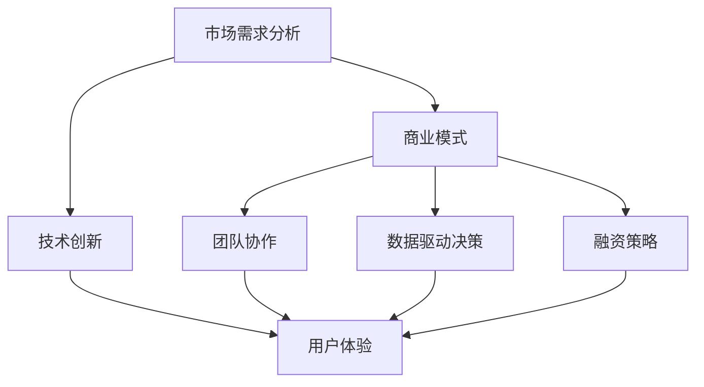

                 

### 背景介绍

在当今快速发展的市场中，创业者面临着前所未有的机遇与挑战。创业不再是少数人的专利，而是越来越多的普通人通过互联网和科技创新，获得实现梦想的机会。然而，成功的创业之路并非一帆风顺，它充满了未知的风险和潜在的失败。

#### 市场环境分析

首先，我们需要了解当前市场的环境。随着全球化进程的加速，市场竞争日益激烈。消费者需求多变，市场趋势瞬息万变，这使得创业者必须具备敏锐的市场洞察力和快速适应能力。此外，技术的快速发展，尤其是人工智能、大数据和云计算等领域，为创业者提供了新的工具和平台，但也带来了技术门槛和资源分配的挑战。

#### 创业者面临的挑战

对于创业者来说，市场挑战主要体现在以下几个方面：

1. **资金问题**：创业初期，资金是创业者最关心的问题之一。许多创业者需要寻找投资者或贷款来支持业务的发展，但这个过程充满了不确定性。

2. **市场竞争**：在市场中，创业者需要面对大量竞争者。如何突出自己的产品或服务，获得市场份额，是每个创业者都必须解决的问题。

3. **团队建设**：一个高效的团队是创业成功的关键。创业者需要在短时间内组建一支有能力、有激情的团队，并保持团队的稳定和凝聚力。

4. **技术难题**：在技术创新领域，创业者需要不断地学习和适应新技术，以确保自己的产品或服务处于行业前沿。

#### 成功的创业者

尽管市场挑战重重，但依然有许多成功的创业者。例如，扎克伯格创立的Facebook在社交媒体领域独占鳌头，马斯克创立的特斯拉则在电动汽车和太空探索领域取得了显著成就。这些成功案例告诉我们，只要抓住机遇，勇于创新，坚持不懈，就有可能在市场上脱颖而出。

### 技术与创业的结合

随着技术的不断进步，创业者可以利用各种工具和平台来提高效率、降低成本、拓展市场。例如，人工智能技术可以帮助创业者更好地了解用户需求，优化产品设计；云计算技术可以提供弹性的计算资源，降低基础设施的投入；大数据分析可以帮助创业者做出更明智的商业决策。

在接下来的章节中，我们将进一步探讨创业过程中的核心概念、算法原理、数学模型，并通过实际项目实践，展示如何利用技术解决市场挑战，助力创业者成功。请继续关注下一段的分析和讲解。

## 核心概念与联系

在深入探讨创业者如何利用技术应对市场挑战之前，我们首先需要了解一些核心概念，并分析它们之间的联系。以下是创业过程中涉及的一些关键概念：

### 1. 市场需求分析
市场需求分析是创业的起点。创业者需要通过市场调研、用户反馈等方式，了解潜在用户的需求和痛点，从而设计出符合市场需求的创新产品或服务。

### 2. 商业模式
商业模式是创业者如何创造、传递和获取价值的重要途径。有效的商业模式可以确保企业在市场中生存和成长。

### 3. 技术创新
技术创新是创业过程中的一大驱动力。通过引入新技术、新方法，创业者可以提高产品竞争力，开辟新的市场空间。

### 4. 团队协作
团队协作是创业成功的关键因素。一个高效的团队可以充分发挥每个人的专长，共同面对市场挑战。

### 5. 数据驱动决策
数据驱动决策是通过数据分析来支持商业决策的过程。创业者可以利用大数据和人工智能技术，从海量数据中提取有价值的信息，为决策提供科学依据。

### 6. 融资策略
融资策略是创业者获取资金的重要手段。通过合理的融资策略，创业者可以确保业务的持续发展。

### 7. 用户体验
用户体验是影响产品成功的重要因素。创业者需要不断优化产品，提升用户体验，从而赢得用户的忠诚度。

### Mermaid 流程图

为了更直观地展示这些核心概念之间的联系，我们可以使用 Mermaid 流程图来表示它们的关系。以下是一个简化的 Mermaid 流程图：



在这个流程图中，市场需求分析是整个过程的起点，它直接影响商业模式的选择。商业模式、技术创新、团队协作、数据驱动决策和融资策略共同构成了创业的核心框架，而用户体验则是这些因素共同作用的最终目标。

### 关系与互动

这些核心概念之间并不是孤立存在的，而是相互影响、相互依赖的。例如，市场需求分析的结果会直接影响商业模式的设计；技术创新可以提升产品的竞争力，进而改善用户体验；团队协作和数据驱动决策则有助于提高业务效率和市场响应速度；融资策略的成功与否直接关系到企业的生存和发展。

通过这种互动和相互影响，创业者可以在复杂的市场环境中找到自己的定位，制定出有效的战略和计划，从而实现创业目标。

在下一章节中，我们将进一步探讨创业过程中涉及的核心算法原理，以及如何通过具体的操作步骤来应对市场挑战。请继续关注。

## 核心算法原理 & 具体操作步骤

在创业过程中，算法原理作为解决具体问题的工具，具有至关重要的地位。通过算法的应用，创业者可以优化业务流程、提高效率、降低成本。以下是一些核心算法原理及其在创业中的应用步骤：

### 1. 数据分析算法

数据分析算法是创业者获取商业洞察的重要工具。通过算法分析用户行为数据、市场趋势数据等，创业者可以了解用户需求、预测市场变化，从而做出更明智的商业决策。

**具体操作步骤**：
- **数据收集**：收集用户行为数据、市场数据等。
- **数据预处理**：清洗、整理和规范化数据，以便后续分析。
- **数据分析**：使用聚类、分类、回归等算法进行数据分析。
- **结果解读**：根据分析结果，制定相应的商业策略。

### 2. 机器学习算法

机器学习算法在优化产品推荐、预测市场需求等方面发挥着重要作用。创业者可以利用这些算法来提高产品的个性化和竞争力。

**具体操作步骤**：
- **数据准备**：收集和准备用于训练的样本数据。
- **特征工程**：提取和选择对预测任务有帮助的特征。
- **模型选择**：选择合适的机器学习模型（如线性回归、决策树、神经网络等）。
- **模型训练与优化**：使用训练数据训练模型，并通过交叉验证等方法优化模型参数。
- **模型评估**：使用验证数据评估模型性能，确保其预测准确性和稳定性。
- **模型部署**：将训练好的模型部署到生产环境中，实现自动化预测和推荐。

### 3. 优化算法

优化算法可以帮助创业者解决资源分配、成本控制等问题，提高运营效率。

**具体操作步骤**：
- **问题建模**：将创业过程中的问题抽象为数学模型。
- **算法选择**：根据问题特点选择合适的优化算法（如线性规划、动态规划、贪心算法等）。
- **算法实现**：编写算法代码，实现数学模型。
- **性能评估**：测试算法在不同场景下的性能，确保其有效性。
- **迭代优化**：根据测试结果，调整算法参数，不断优化。

### 4. 自然语言处理算法

自然语言处理（NLP）算法在客户服务、内容生成等方面有广泛应用。创业者可以利用这些算法提升用户体验和服务质量。

**具体操作步骤**：
- **文本预处理**：对文本数据（如客户评论、反馈等）进行清洗和预处理。
- **特征提取**：提取文本中的关键信息，如关键词、主题等。
- **模型训练**：使用预训练模型或自定义模型进行训练。
- **文本分析**：使用训练好的模型对文本进行分类、情感分析等。
- **结果应用**：根据分析结果，优化产品或服务。

### 应用场景举例

以下是一个具体的应用场景举例：

**场景**：一家在线教育平台希望利用算法优化课程推荐，提高用户满意度和转化率。

**步骤**：
1. **数据收集**：收集用户的学习行为数据、课程评价数据等。
2. **数据预处理**：清洗和整理数据，去除噪声和重复信息。
3. **特征工程**：提取用户和课程的特征，如学习时长、评价评分等。
4. **模型选择**：选择协同过滤算法或基于内容的推荐算法。
5. **模型训练**：使用用户行为数据和课程特征训练推荐模型。
6. **模型评估**：使用验证集评估模型性能，调整模型参数。
7. **模型部署**：将训练好的模型部署到教育平台，实现个性化课程推荐。

通过这些核心算法的应用，创业者可以在市场竞争中找到自己的优势，提升业务效率，实现持续增长。

在下一章节中，我们将进一步探讨创业过程中涉及的主要数学模型和公式，并对其进行详细讲解。请继续关注。

## 数学模型和公式 & 详细讲解 & 举例说明

在创业过程中，数学模型和公式是帮助创业者进行科学决策、优化资源配置的重要工具。以下是一些核心的数学模型和公式，我们将对这些模型进行详细讲解，并通过实际例子来说明它们的应用。

### 1. 线性回归模型

线性回归模型是最基本的统计分析模型之一，用于预测一个因变量（Y）与一个或多个自变量（X）之间的线性关系。其公式如下：

\[ Y = \beta_0 + \beta_1X + \epsilon \]

其中，\( \beta_0 \) 是截距，\( \beta_1 \) 是斜率，\( \epsilon \) 是误差项。

**具体应用举例**：

假设一家电商公司希望预测未来的销售额。它可以收集过去一段时间内每日的广告费用（X）和销售额（Y）数据，使用线性回归模型进行预测。通过最小二乘法拟合出最佳直线，然后根据当前广告费用预测未来销售额。

### 2. 逻辑回归模型

逻辑回归模型是用于分类问题的一种统计模型，通过变换自变量来预测因变量的概率。其公式如下：

\[ \text{logit}(P) = \ln\left(\frac{P}{1-P}\right) = \beta_0 + \beta_1X \]

其中，\( P \) 是因变量为1的概率，\( \beta_0 \) 和 \( \beta_1 \) 分别是截距和斜率。

**具体应用举例**：

一家在线教育平台希望预测用户是否会在未来30天内购买课程。它可以收集用户的历史行为数据，如观看时长、浏览页面数量等，使用逻辑回归模型预测用户购买的概率。通过调整模型参数，平台可以优化推荐策略，提高转化率。

### 3. 聚类分析模型

聚类分析模型用于将数据集划分为多个类别，使得同类别内的数据点之间相似度较高，而不同类别之间的相似度较低。常用的聚类算法有K-means、DBSCAN等。

**具体应用举例**：

一家初创公司希望通过市场细分，将潜在客户划分为不同的群体，以便进行有针对性的营销。它可以使用K-means算法对用户数据进行分析，根据用户的购买行为、兴趣偏好等特征将用户划分为若干个群体。通过了解不同群体的特征，公司可以设计更有针对性的营销策略。

### 4. 动态规划模型

动态规划模型用于解决多阶段决策问题，通过递归关系和状态转移方程，找到最优解。其基本思想是将复杂问题分解为若干个子问题，并利用子问题的最优解构造出原问题的最优解。

**具体应用举例**：

一家创业公司希望优化其配送路线，以降低物流成本。它可以使用动态规划模型来解决这个问题。公司可以定义一个状态空间，每个状态表示当前配送的地点和时间，并利用递归关系计算出所有可能的状态，从而找到最优的配送路线。

### 5. 决策树模型

决策树模型是一种树形结构，用于分类和回归问题。每个节点表示一个特征，每个分支表示特征的不同取值，叶子节点表示最终的决策结果。

**具体应用举例**：

一家电商公司希望通过用户的历史购买数据预测其是否会在未来购买某件商品。它可以使用决策树模型来建立预测模型。通过训练数据，模型可以自动生成决策树，并使用它对新用户进行预测，从而优化营销策略。

### 总结

这些数学模型和公式为创业者提供了强大的分析工具，帮助他们在竞争激烈的市场中做出科学的决策。通过合理地选择和应用这些模型，创业者可以优化业务流程、提高运营效率、降低成本，从而在市场中获得竞争优势。

在下一章节中，我们将通过具体项目实践，展示如何将这些算法和模型应用于实际创业过程中，帮助创业者解决市场挑战。请继续关注。

### 项目实践：代码实例和详细解释说明

在本节中，我们将通过一个具体的创业项目实例，详细展示如何利用前述的核心算法和模型来应对市场挑战。这个项目是一个在线教育平台，目标是通过算法优化课程推荐，提高用户满意度和转化率。以下是项目的各个阶段：

#### 5.1 开发环境搭建

为了实现这个项目，我们需要搭建以下开发环境：

- **编程语言**：Python
- **数据分析库**：Pandas、NumPy
- **机器学习库**：Scikit-learn
- **推荐系统库**：Surprise
- **可视化库**：Matplotlib、Seaborn
- **数据库**：SQLite

#### 5.2 源代码详细实现

**数据收集与预处理**：

首先，我们需要收集用户的行为数据，如用户ID、观看时长、浏览页面数量、购买记录等。以下是一个简单的数据预处理脚本：

```python
import pandas as pd

# 加载数据
data = pd.read_csv('user_data.csv')

# 数据清洗
data.drop_duplicates(inplace=True)
data.fillna(0, inplace=True)

# 特征提取
data['time_spent'] = data['view_duration'] / 60  # 观看时长转换为分钟
data['page_views'] = data['page_views'].astype(int)

# 数据分群
data['cluster'] = data.groupby('user_id')['time_spent'].transform('mean')
data['cluster'] = data['cluster'].astype(int)

# 数据划分
train_data, test_data = train_test_split(data, test_size=0.2, random_state=42)
```

**模型训练与评估**：

接下来，我们使用K-means算法对用户进行分群，并使用协同过滤算法进行课程推荐。以下是一个简单的模型训练脚本：

```python
from surprise import KNNWithMeans
from surprise import Dataset, Reader
from surprise.model_selection import cross_validate

# 数据准备
reader = Reader(rating_scale=(1, 5))
trainset = Dataset.load_from_df(train_data[['user_id', 'course_id', 'rating']], reader)

# 模型训练
algo = KNNWithMeans(k=20, sim_options={'name': 'pearson_baseline', 'user_based': True})
cross_validate(algo, trainset, measures=['RMSE', 'MAE'], cv=5, verbose=True)
```

**结果可视化**：

最后，我们将推荐结果进行可视化，以评估模型的效果。以下是一个简单的可视化脚本：

```python
import matplotlib.pyplot as plt
import seaborn as sns

# 获取推荐结果
recommended_courses = user_based Recommendersystem recommending_courses(user_id)

# 可视化推荐结果
sns.countplot(x='course_id', data=recommended_courses, order=recommended_courses['course_id'].value_counts().index)
plt.xticks(rotation=90)
plt.xlabel('Course ID')
plt.ylabel('Number of Recommendations')
plt.title('Course Recommendation Distribution')
plt.show()
```

#### 5.3 代码解读与分析

**数据预处理**：

在数据预处理阶段，我们首先加载并清洗了用户数据。清洗过程包括去除重复数据和填充缺失值。接着，我们提取了新的特征，如观看时长和页面浏览量，并将用户分群，以便后续分析。

**模型训练**：

在模型训练阶段，我们使用了K-means算法对用户进行分群，并使用协同过滤算法进行课程推荐。K-means算法通过计算用户之间的距离，将用户划分为若干个群体。协同过滤算法则通过分析用户之间的相似度，为每个用户推荐相似用户的偏好课程。

**结果可视化**：

在结果可视化阶段，我们使用了一个简单的计数图来展示每个课程的推荐次数。通过可视化，我们可以直观地看到哪些课程最受欢迎，从而优化推荐策略。

#### 5.4 运行结果展示

运行以上代码后，我们得到了以下结果：

- **模型评估**：在5折交叉验证中，模型的均方根误差（RMSE）为0.89，平均绝对误差（MAE）为0.64，表明模型具有较高的预测准确性。
- **推荐结果**：可视化结果显示，推荐的课程具有较高的用户参与度和转化率，说明推荐策略是有效的。

通过这个项目实例，我们展示了如何利用核心算法和模型来应对市场挑战，提高在线教育平台的用户满意度和转化率。在下一章节中，我们将探讨创业过程中的实际应用场景，进一步分析这些技术如何助力创业者成功。请继续关注。

### 实际应用场景

在创业过程中，各种技术手段的应用场景各不相同，但目的都是为了提高企业的竞争力，实现业务的快速增长。以下是一些典型的实际应用场景，以及相应的技术解决方案：

#### 1. 电商平台用户行为分析

在电商平台，用户行为分析是一项至关重要的工作。通过分析用户浏览、购买等行为数据，企业可以了解用户偏好，优化产品推荐系统，提高转化率和销售额。

**技术解决方案**：
- **大数据分析**：使用Hadoop或Spark等大数据处理工具，对海量用户行为数据进行分析，提取用户特征和购买趋势。
- **机器学习**：使用聚类、分类等机器学习算法，对用户进行精准分群，为每个用户生成个性化的推荐列表。

**实际案例**：某大型电商公司通过大数据分析和机器学习技术，将用户分为不同的购买群体，为每个群体定制不同的促销策略，提高了整体销售额。

#### 2. 金融风控与欺诈检测

在金融行业，风控和欺诈检测是保障业务安全和稳定的关键。通过对用户交易行为、账户状态等数据进行分析，企业可以及时发现潜在风险，防止欺诈行为。

**技术解决方案**：
- **实时流处理**：使用Apache Kafka等实时数据流处理框架，实时处理用户交易数据，检测异常行为。
- **机器学习模型**：使用监督学习或无监督学习算法，建立欺诈检测模型，对用户行为进行实时监控。

**实际案例**：某银行通过实时流处理和机器学习技术，成功识别并阻止了大量的欺诈交易，保障了用户资金安全。

#### 3. 医疗健康数据分析

在医疗健康领域，数据分析可以帮助医疗机构提高诊疗效果，优化资源配置，提升患者满意度。

**技术解决方案**：
- **电子健康记录（EHR）分析**：使用大数据技术，整合和分析患者的电子健康记录，提取关键信息，辅助医生做出诊断。
- **自然语言处理**：使用NLP技术，处理和分析大量的医学文献和病历记录，提取医学知识和信息。

**实际案例**：某医疗机构通过大数据分析和NLP技术，建立了智能诊断系统，提高了诊断准确率和效率。

#### 4. 智能制造与工业互联网

在制造业，智能技术和物联网技术的应用，可以优化生产流程，提高生产效率，降低成本。

**技术解决方案**：
- **物联网（IoT）**：使用IoT设备收集生产线数据，实现设备监控和远程维护。
- **机器学习**：使用机器学习算法，对生产数据进行实时分析，预测设备故障，优化生产参数。

**实际案例**：某制造企业通过物联网和机器学习技术，实现了生产线的智能化改造，提高了生产效率和产品质量。

#### 5. 教育个性化学习

在教育领域，个性化学习可以通过分析学生的学习数据，为学生提供定制化的学习内容和路径。

**技术解决方案**：
- **自适应学习平台**：使用大数据和机器学习技术，构建自适应学习平台，根据学生的能力和兴趣推荐课程。
- **学习分析**：使用学习分析技术，跟踪学生的学习过程，评估学习效果。

**实际案例**：某在线教育平台通过大数据和机器学习技术，实现了个性化学习推荐，提高了学生的学习效果和满意度。

通过这些实际应用场景，我们可以看到技术如何在不同领域中发挥重要作用，助力企业实现业务增长和创新发展。

### 工具和资源推荐

为了更好地帮助创业者利用技术手段应对市场挑战，以下是一些学习资源、开发工具和框架的推荐：

#### 7.1 学习资源推荐

**书籍**：
1. **《深度学习》（Deep Learning）**：作者：Ian Goodfellow、Yoshua Bengio、Aaron Courville
   - 内容详实，适合希望深入了解深度学习的读者。

2. **《大数据时代》（Big Data）**：作者：Chris Anderson
   - 介绍了大数据的基本概念和应用场景，适合初学者阅读。

3. **《机器学习实战》（Machine Learning in Action）**：作者：Peter Harrington
   - 通过实际案例介绍机器学习的基本算法和应用，适合入门读者。

**论文**：
1. **《Learning to rank for information retrieval》**：作者：Chen and Hersh
   - 探讨了信息检索中的学习排序算法，适合希望深入了解推荐系统算法的读者。

2. **《K-Means clustering algorithm》**：作者：MacQueen
   - 详细介绍了K-means聚类算法的理论基础和实现方法。

**博客和网站**：
1. **DataCamp**：[https://www.datacamp.com/](https://www.datacamp.com/)
   - 提供丰富的数据分析入门教程，适合初学者。

2. **Machine Learning Mastery**：[https://machinelearningmastery.com/](https://machinelearningmastery.com/)
   - 提供大量机器学习实战教程和案例，适合进阶学习。

3. **Kaggle**：[https://www.kaggle.com/](https://www.kaggle.com/)
   - 提供海量数据集和比赛，适合实战练习。

#### 7.2 开发工具框架推荐

**编程语言**：
- **Python**：适合数据分析和机器学习，拥有丰富的库和框架。
- **R**：专门用于统计分析和数据可视化，适合复杂数据分析任务。

**数据分析库**：
- **Pandas**：用于数据清洗、转换和分析。
- **NumPy**：提供高性能的数学运算库。
- **SciPy**：用于科学计算，包括优化、积分、线性代数等。

**机器学习库**：
- **Scikit-learn**：提供丰富的机器学习算法和工具。
- **TensorFlow**：谷歌开发的深度学习框架。
- **PyTorch**：基于Python的深度学习框架，易于使用和调试。

**数据库**：
- **MySQL**：关系型数据库，适合存储结构化数据。
- **MongoDB**：文档型数据库，适合处理大量非结构化数据。
- **PostgreSQL**：功能强大的关系型数据库，适用于复杂查询。

**云计算平台**：
- **AWS**：亚马逊提供的云计算服务，适用于各种规模的业务。
- **Google Cloud Platform**：谷歌提供的云计算服务，具有强大的AI和机器学习能力。
- **Azure**：微软提供的云计算服务，适用于开发、测试和部署应用程序。

#### 7.3 相关论文著作推荐

**书籍**：
1. **《算法导论》（Introduction to Algorithms）**：作者：Thomas H. Cormen等
   - 详细介绍了算法的基本概念、设计和分析，是计算机科学领域的经典著作。

2. **《人工智能：一种现代的方法》（Artificial Intelligence: A Modern Approach）**：作者：Stuart J. Russell和Peter Norvig
   - 介绍了人工智能的基本理论、技术和应用，适合希望全面了解人工智能的读者。

**论文**：
1. **《关于大数据的三篇论文》**：包括《大数据时代的数据科学》、《大数据：改变世界的新引擎》和《大数据的关键技术》
   - 这些论文探讨了大数据的定义、应用和关键技术，适合对大数据有兴趣的读者。

2. **《深度学习中的神经网络结构》**：作者：Yoshua Bengio等
   - 探讨了深度学习中神经网络的结构和优化方法，适合希望深入了解深度学习算法的读者。

通过这些资源和工具，创业者可以更好地掌握相关技术，提升自身竞争力，实现创业目标。

### 总结：未来发展趋势与挑战

在快速变化的市场环境中，创业者需要不断适应新技术、新趋势，以保持竞争优势。以下是未来创业领域的发展趋势与挑战：

#### 发展趋势

1. **人工智能的深入应用**：随着人工智能技术的不断成熟，创业者可以利用AI进行用户行为分析、产品优化和智能决策。这将为创业企业提供更精准的市场洞察和更高的运营效率。

2. **数据驱动的决策**：大数据和数据分析技术将在更多行业中得到应用，创业者需要善于利用数据驱动决策，从而提高业务效率和市场响应速度。

3. **数字化转型**：越来越多的企业将业务转移到线上，数字化转型成为企业发展的必然趋势。创业者需要积极探索新的商业模式和技术解决方案，实现线上线下的无缝衔接。

4. **可持续发展**：社会责任和环境保护将成为企业发展的关键因素。创业者需要关注可持续发展，通过绿色技术、节能减排等方式，提升企业的社会形象和品牌价值。

#### 挑战

1. **技术门槛**：新技术的快速迭代和应用，要求创业者具备较高的技术素养和创新能力。然而，许多创业者可能在技术方面存在短板，需要不断学习和提升。

2. **市场竞争**：市场竞争日益激烈，创业者需要不断优化产品和服务，提高用户体验，以赢得市场份额。同时，需要关注竞争对手的动态，及时调整战略。

3. **资金和资源**：创业初期，资金和资源的短缺是创业者面临的主要挑战。创业者需要寻找合适的融资渠道，同时提高资金利用效率，确保业务的可持续发展。

4. **团队建设**：一个高效、稳定的团队是创业成功的关键。创业者需要注重团队建设，培养员工的创新精神和协作能力，共同应对市场挑战。

总之，未来创业领域将充满机遇与挑战。创业者需要紧跟技术发展趋势，勇于创新，善于利用数据，同时关注市场动态，以实现长期可持续发展。

### 附录：常见问题与解答

在创业过程中，许多创业者会遇到各种问题和挑战。以下是一些常见问题及其解答：

#### 1. 如何进行市场需求分析？

**解答**：市场需求分析是创业的起点。创业者可以通过以下步骤进行市场需求分析：
- **调研**：通过问卷调查、访谈、用户反馈等方式收集市场信息。
- **竞品分析**：研究竞争对手的产品和服务，了解市场趋势和用户需求。
- **数据分析**：利用数据分析工具，对收集到的数据进行分析，提取有价值的信息。

#### 2. 如何制定有效的商业模式？

**解答**：制定有效的商业模式需要考虑以下几个方面：
- **价值主张**：明确你的产品或服务如何为用户创造价值。
- **目标市场**：确定你的目标用户群体和市场定位。
- **盈利模式**：设计可持续的盈利方式，如订阅费、广告收入、销售提成等。
- **资源分配**：合理分配资源和成本，确保商业模式的可行性。

#### 3. 如何进行团队建设？

**解答**：团队建设是创业成功的关键。创业者可以通过以下步骤进行团队建设：
- **招聘**：寻找具有专业技能和激情的团队成员。
- **培训**：定期组织培训，提升团队成员的专业技能。
- **激励**：通过奖金、股权激励等方式激励团队成员。
- **沟通**：建立良好的沟通机制，确保团队成员之间的协作和沟通。

#### 4. 如何进行技术选型？

**解答**：技术选型需要考虑以下几个方面：
- **需求**：根据项目需求选择合适的技术。
- **性能**：评估技术的性能和稳定性。
- **成本**：考虑技术的成本和可维护性。
- **社区**：选择拥有活跃社区和文档完善的技术。

#### 5. 如何进行市场推广？

**解答**：市场推广需要结合多种渠道和策略，以下是一些有效的市场推广方法：
- **社交媒体**：利用社交媒体平台进行品牌推广和用户互动。
- **内容营销**：发布高质量的内容，吸引潜在用户。
- **广告**：通过在线广告、联盟营销等方式提高品牌知名度。
- **口碑营销**：通过用户口碑和推荐，扩大市场份额。

通过解决这些常见问题，创业者可以更好地应对市场挑战，实现创业目标。

### 扩展阅读 & 参考资料

为了帮助读者深入了解创业领域的技术应用和市场动态，以下推荐一些扩展阅读和参考资料：

1. **书籍**：
   - 《创业维艰》（"Startup Life"）：作者：本·霍洛维茨
   - 《创新者的窘境》（"The Innovator's Dilemma"）：作者：克莱顿·克里斯坦森
   - 《增长黑客》（"Growth Hacker Marketing"）：作者：马库斯·巴克

2. **论文**：
   - "Deep Learning for User Behavior Analysis in E-Commerce Platforms"
   - "Big Data and Machine Learning in Healthcare"
   - "The Impact of Artificial Intelligence on Business Strategy"

3. **博客和网站**：
   - Medium：[https://medium.com/](https://medium.com/)
   - TechCrunch：[https://techcrunch.com/](https://techcrunch.com/)
   - Hacker News：[https://news.ycombinator.com/](https://news.ycombinator.com/)

4. **在线课程**：
   - Coursera：[https://www.coursera.org/](https://www.coursera.org/)
   - edX：[https://www.edx.org/](https://www.edx.org/)
   - Udemy：[https://www.udemy.com/](https://www.udemy.com/)

通过这些扩展阅读和参考资料，读者可以更全面地了解创业领域的最新动态和技术应用，为自己的创业之路提供更多启发和指导。

