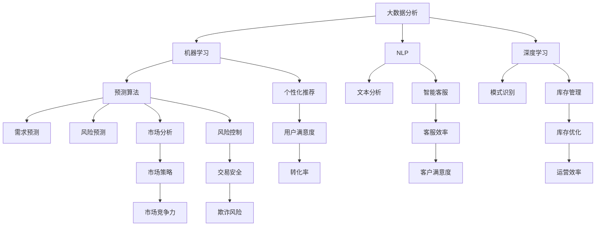

                 

### 背景介绍

#### 电商平台的现状

在当今快速发展的数字化时代，电商平台已经成为人们日常生活中不可或缺的一部分。根据Statista的数据显示，全球电子商务市场规模在2022年已经达到了4.89万亿美元，预计到2027年将增长到6.38万亿美元。这一趋势无疑表明，电商平台在全球经济中的地位愈发重要。

然而，随着市场竞争的加剧和消费者需求的不断变化，电商平台面临着前所未有的挑战。传统的市场策略已经无法满足当前多变的市场环境。为了在激烈的市场竞争中脱颖而出，电商平台需要不断调整和优化其运营策略。

#### AI技术在电商平台的广泛应用

人工智能（AI）作为一项前沿技术，正在深刻地改变着电商平台的运营方式。AI技术通过大数据分析、机器学习、自然语言处理等手段，为电商平台提供了更加精准和高效的服务。

首先，AI能够通过大数据分析，挖掘消费者行为数据，帮助电商平台更好地了解用户需求，从而进行个性化推荐。根据麦肯锡的报告，个性化推荐能够显著提高用户转化率和销售额。例如，亚马逊和淘宝等大型电商平台，通过AI技术进行智能推荐，使得用户在浏览过程中能够更快地找到自己感兴趣的商品，从而提高了用户的购物体验。

其次，AI技术在商品库存管理方面也发挥着重要作用。通过预测算法，AI能够帮助电商平台更准确地预测商品的需求量，从而优化库存管理，减少库存积压和缺货情况。例如，阿里巴巴的库存管理系统中就集成了AI算法，能够根据历史销售数据和市场需求，动态调整库存策略。

此外，AI还在客服领域得到了广泛应用。通过自然语言处理技术，AI客服系统能够实时响应用户的咨询，提供快速、准确的答复，从而提高客户满意度。例如，京东的智能客服“京小智”，通过AI技术实现了7x24小时的在线服务，大大提高了客服效率。

#### AI对电商平台策略调整的重要性

随着AI技术的不断发展和应用，电商平台已经逐渐意识到，通过引入AI技术来调整和优化运营策略，是提高市场竞争力、提升用户满意度的关键。以下是AI技术对电商平台策略调整的几个方面：

1. **个性化推荐**：通过AI技术，电商平台能够为用户提供更加个性化的购物体验，从而提高用户黏性和转化率。
2. **智能客服**：AI客服系统能够实时响应用户的咨询，提高客户满意度，降低客服成本。
3. **库存管理**：AI算法能够帮助电商平台更准确地预测商品需求，优化库存管理，减少库存积压和缺货情况。
4. **市场分析**：通过大数据分析和机器学习，AI能够为电商平台提供更为精准的市场预测，帮助制定更为有效的市场策略。
5. **风险控制**：AI技术在风险控制方面也有着广泛应用，通过分析用户行为和交易数据，AI能够识别潜在风险，提高交易安全性。

综上所述，AI技术在电商平台的广泛应用，不仅提高了平台的运营效率，也为电商平台调整策略提供了强有力的支持。在未来，随着AI技术的进一步发展，电商平台在策略调整方面将会有更多的创新和突破。#### 市场竞争态势

在当今的电商市场中，各大电商平台之间的竞争日益激烈。主要的市场参与者包括亚马逊、阿里巴巴、京东、eBay、苏宁易购等。这些平台各自拥有庞大的用户群体和丰富的商品资源，通过不断的创新和优化，争夺市场份额。

首先，亚马逊在全球范围内具有极大的影响力。其以高效的物流系统和强大的云计算能力著称，为全球消费者提供了便捷的购物体验。亚马逊的AI技术也得到了广泛应用，如个性化推荐、智能客服等，进一步提升了用户满意度。

阿里巴巴则是中国电商市场的领导者。其旗下的淘宝、天猫等平台，凭借丰富的商品种类和强大的数据分析能力，吸引了大量消费者。阿里巴巴的AI技术主要集中在个性化推荐、智能客服和风险控制等方面，通过大数据和机器学习算法，实现了高效的运营和服务。

京东则以其高效的物流和优质的售后服务在市场上占据了一席之地。京东的AI技术在库存管理和智能客服方面有着显著的应用，通过精准的库存预测和高效的客服响应，提高了运营效率和服务质量。

eBay作为全球领先的在线拍卖平台，也通过引入AI技术，提升了用户体验。其AI算法主要应用于个性化推荐、智能客服和风险控制，帮助平台更好地满足用户需求，提高市场竞争力。

苏宁易购则在中国市场占据了重要地位。其以线下门店和线上平台相结合的商业模式，为消费者提供了全方位的购物体验。苏宁易购的AI技术主要应用于市场分析和智能客服，通过大数据分析和机器学习，实现了精准的市场预测和高效的客服服务。

总的来说，各大电商平台都在积极引入AI技术，以提升自身的竞争力。通过AI技术，电商平台能够更精准地把握市场趋势，优化运营策略，提高用户满意度，从而在激烈的市场竞争中脱颖而出。未来，随着AI技术的进一步发展，电商平台之间的竞争将更加激烈，但也为创新和突破提供了更多机会。#### AI在电商平台中的具体应用

随着人工智能技术的不断进步，AI在电商平台中的应用场景越来越广泛，已经成为提升运营效率、优化用户体验和增强市场竞争力的重要工具。以下将详细探讨AI在电商平台中的具体应用，包括个性化推荐、智能客服、库存管理和市场分析等方面。

**1. 个性化推荐**

个性化推荐是AI在电商平台上最为广泛应用的场景之一。通过大数据分析和机器学习算法，AI能够分析用户的购物历史、浏览行为和社交网络等数据，为用户推荐他们可能感兴趣的商品。这种个性化的推荐不仅提高了用户的购物体验，也显著提高了电商平台的销售额。

以阿里巴巴旗下的淘宝为例，其通过阿里云的机器学习平台，利用深度学习算法对用户行为数据进行建模，实现了高度个性化的推荐系统。用户在浏览商品时，系统会实时分析其浏览记录和搜索历史，结合用户的基本信息和购物偏好，为用户推荐相关的商品。这种个性化的推荐策略，使得用户能够更快地找到自己需要的商品，从而提高了购物满意度和转化率。

**2. 智能客服**

智能客服是AI在电商平台中的另一个重要应用。通过自然语言处理和机器学习技术，AI客服系统能够模拟人类的对话方式，实时响应用户的咨询，提供快速、准确的答复。这不仅提高了客服效率，还降低了客服成本，提升了用户满意度。

以京东的智能客服“京小智”为例，它利用自然语言处理技术，能够理解用户的问题，并给出相应的答复。通过机器学习算法，京小智还能够不断优化其回答的准确性和针对性。用户在购物过程中，如果遇到任何问题，都可以通过京小智获得帮助，从而提高了整个购物体验。

**3. 库存管理**

库存管理是电商平台运营的关键环节之一。通过预测算法和机器学习技术，AI能够帮助电商平台更准确地预测商品的需求量，从而优化库存管理，减少库存积压和缺货情况。

以亚马逊为例，其利用机器学习算法对历史销售数据进行分析，结合市场趋势和用户行为，预测未来一段时间内各类商品的需求量。基于这些预测结果，亚马逊能够动态调整库存策略，确保商品供应的及时性和充足性。这种基于AI的库存管理策略，不仅提高了运营效率，还减少了成本。

**4. 市场分析**

市场分析是电商平台制定战略决策的重要依据。通过大数据分析和机器学习技术，AI能够对市场数据进行分析，帮助电商平台更准确地把握市场趋势，制定相应的营销策略。

以阿里巴巴为例，其利用大数据分析平台，对市场数据进行实时监控和分析。通过机器学习算法，分析用户行为、市场趋势和竞争对手情况，阿里巴巴能够及时调整其市场策略，从而在激烈的市场竞争中占据优势。

**5. 风险控制**

风险控制是电商平台运营的重要保障。通过AI技术，电商平台能够实时分析用户行为和交易数据，识别潜在的欺诈行为和风险，从而采取相应的措施进行防范。

以eBay为例，其利用机器学习算法对交易数据进行实时监控和分析，能够识别出异常交易行为，并及时采取措施进行防范。这种基于AI的风险控制策略，提高了交易的安全性，降低了欺诈风险。

总的来说，AI技术在电商平台中的应用，不仅提升了平台的运营效率，还优化了用户体验，增强了市场竞争力。随着AI技术的不断发展和应用，电商平台在未来的发展中将会有更多的创新和突破。#### AI对电商平台策略调整的影响

人工智能（AI）的广泛应用对电商平台策略调整产生了深远的影响，具体表现在以下几个方面：

**1. 个性化推荐的普及**

个性化推荐是AI在电商平台中最为成功的应用之一。通过分析用户的历史行为和偏好，AI系统能够为用户提供高度个性化的购物建议，从而提高用户的满意度和转化率。这促使电商平台在策略调整中更加重视用户数据的挖掘和分析，通过不断优化推荐算法，提升个性化推荐的准确性和效果。

**2. 智能客服的提升**

智能客服的普及极大地提高了电商平台的客户服务水平。通过自然语言处理和机器学习技术，AI客服系统能够模拟人类的对话方式，快速响应用户的咨询，提供准确的信息和解决方案。这促使电商平台在策略调整中加大对智能客服的投入，通过不断优化AI客服系统，提升客服效率和质量。

**3. 库存管理的优化**

AI技术在库存管理中的应用，使得电商平台能够更准确地预测商品需求，优化库存策略，减少库存积压和缺货情况。这促使电商平台在策略调整中更加关注数据分析和预测模型的应用，通过不断优化库存管理策略，提高运营效率和降低成本。

**4. 市场分析的精准化**

通过大数据分析和机器学习技术，AI能够对市场数据进行分析，帮助电商平台更准确地把握市场趋势和用户需求，制定更为精准的营销策略。这促使电商平台在策略调整中更加注重市场分析和数据驱动决策，通过不断优化市场分析模型，提高市场竞争力。

**5. 风险控制的智能化**

AI技术在风险控制中的应用，使得电商平台能够实时分析用户行为和交易数据，识别潜在的欺诈行为和风险，提高交易的安全性。这促使电商平台在策略调整中更加重视风险控制，通过不断优化AI风险控制模型，提高交易安全性和客户信任度。

综上所述，AI技术的广泛应用对电商平台策略调整产生了显著的影响，促使电商平台在运营和服务方面不断创新和优化，以应对激烈的市场竞争。未来，随着AI技术的进一步发展和应用，电商平台在策略调整方面将会有更多的创新和突破。### 核心概念与联系

在深入探讨AI如何帮助电商平台调整策略之前，我们需要先了解一些核心概念和它们之间的联系。以下将详细阐述这些概念，并使用Mermaid流程图来展示它们之间的关系。

**核心概念：**

1. **大数据分析**：大数据分析是AI技术的基础，通过收集、存储和处理海量数据，从中提取有价值的信息和知识。
2. **机器学习**：机器学习是一种AI技术，通过训练模型，使计算机能够从数据中自动学习和改进，用于预测、分类、聚类等任务。
3. **自然语言处理（NLP）**：NLP是一种AI技术，使计算机能够理解和生成自然语言，用于文本分析、机器翻译、语音识别等任务。
4. **深度学习**：深度学习是机器学习的一个分支，通过构建多层神经网络，实现复杂的数据处理和模式识别。
5. **预测算法**：预测算法是基于机器学习和统计方法，用于预测未来事件或趋势，如需求预测、风险预测等。

**Mermaid流程图：**



**概念联系解释：**

- **大数据分析与机器学习**：大数据分析提供了机器学习所需的丰富数据资源，使得机器学习模型能够从海量数据中提取有价值的信息。
- **机器学习与自然语言处理**：自然语言处理是机器学习的一个应用领域，通过机器学习算法，NLP能够实现文本分析、机器翻译等任务。
- **机器学习与深度学习**：深度学习是机器学习的进一步发展，通过构建多层神经网络，深度学习能够处理更复杂的数据和任务。
- **机器学习与预测算法**：预测算法是基于机器学习模型的，用于预测未来事件或趋势，如需求预测、风险预测等。
- **个性化推荐与用户满意度**：个性化推荐系统通过机器学习算法分析用户数据，为用户提供个性化的购物建议，从而提高用户满意度和转化率。
- **智能客服与客服效率**：智能客服系统利用NLP技术，模拟人类对话，提供实时、准确的答复，提高客服效率，降低客服成本。
- **库存管理与运营效率**：通过预测算法和机器学习模型，库存管理系统能够优化库存策略，减少库存积压和缺货情况，提高运营效率。
- **市场分析与市场策略**：市场分析系统通过大数据分析和机器学习算法，对市场数据进行分析，帮助电商平台制定更为精准的市场策略，提高市场竞争力。
- **风险控制与交易安全**：风险控制系统通过机器学习算法，分析用户行为和交易数据，识别潜在风险，提高交易安全性，降低欺诈风险。

通过上述核心概念和Mermaid流程图的展示，我们可以清晰地看到AI技术在电商平台策略调整中的关键作用。这些核心概念和它们之间的联系，构成了一个完整的AI技术生态系统，为电商平台提供了强大的支持。### 核心算法原理与具体操作步骤

为了深入探讨AI如何帮助电商平台调整策略，我们需要详细了解核心算法的原理及其具体操作步骤。以下将重点介绍几种在电商平台中广泛应用的AI算法，包括机器学习算法、预测算法和优化算法。

**1. 机器学习算法**

机器学习算法是AI技术的基础，通过训练模型，使计算机能够从数据中自动学习和改进。以下是一种常用的机器学习算法——决策树。

**决策树算法原理：**
决策树是一种树形结构，每个节点代表一个特征，每个分支代表一个特征取值，叶子节点代表预测结果。决策树通过递归划分数据集，使每个子集尽可能纯净，最终生成一个预测模型。

**操作步骤：**
（1）选择一个特征作为根节点，计算该特征对数据的划分信息增益或基尼系数；
（2）根据信息增益或基尼系数，将数据集划分为若干子集；
（3）对每个子集，重复步骤1和2，直到满足停止条件（如最大深度、最小叶节点样本数等）；
（4）生成决策树模型，并使用测试数据集进行评估。

**2. 预测算法**

预测算法是基于机器学习模型的，用于预测未来事件或趋势。以下是一种常用的预测算法——时间序列预测。

**时间序列预测原理：**
时间序列预测是一种基于历史数据，对未来某个时间点的值进行预测的方法。常见的时间序列预测模型包括ARIMA、LSTM等。

**操作步骤：**
（1）收集并整理历史数据，包括时间戳和目标值；
（2）对时间序列进行平稳性检验，如ADF检验；
（3）根据平稳性检验结果，选择合适的模型，如ARIMA、LSTM等；
（4）训练模型，使用历史数据进行训练；
（5）使用训练好的模型，预测未来时间点的值。

**3. 优化算法**

优化算法是一种用于求解最优解的算法，常见于库存管理、资源分配等场景。以下是一种常用的优化算法——遗传算法。

**遗传算法原理：**
遗传算法是一种模拟自然进化过程的优化算法。通过交叉、变异和选择等操作，不断优化个体，直至找到最优解。

**操作步骤：**
（1）初始化种群，随机生成若干个个体；
（2）计算种群中每个个体的适应度；
（3）选择适应度较高的个体，进行交叉、变异操作；
（4）生成新的种群，重复步骤2和3；
（5）当达到终止条件（如最大迭代次数、适应度阈值等）时，输出最优解。

通过上述核心算法原理和具体操作步骤的介绍，我们可以看到AI技术在电商平台中的应用潜力。这些算法不仅能够提高电商平台的数据分析能力，还能够优化运营策略，提高用户体验和市场竞争力。在未来，随着AI技术的不断发展和应用，电商平台在算法研究方面将会有更多的创新和突破。### 数学模型和公式

在深入探讨AI如何帮助电商平台调整策略时，数学模型和公式扮演了关键角色。以下将介绍几种在电商平台中广泛应用的数学模型和公式，包括线性回归、决策树、时间序列预测和遗传算法等。

**1. 线性回归**

线性回归是一种常见的统计方法，用于分析自变量和因变量之间的线性关系。其基本公式如下：

$$
Y = \beta_0 + \beta_1X + \varepsilon
$$

其中，$Y$是因变量，$X$是自变量，$\beta_0$是截距，$\beta_1$是斜率，$\varepsilon$是误差项。

通过最小二乘法，可以求得线性回归模型的参数$\beta_0$和$\beta_1$：

$$
\beta_0 = \frac{\sum_{i=1}^{n}(Y_i - \bar{Y})(X_i - \bar{X})}{\sum_{i=1}^{n}(X_i - \bar{X})^2}
$$

$$
\beta_1 = \frac{\sum_{i=1}^{n}(Y_i - \bar{Y})(X_i - \bar{X})}{\sum_{i=1}^{n}(X_i - \bar{X})^2}
$$

其中，$n$是样本数量，$\bar{Y}$和$\bar{X}$分别是$Y$和$X$的均值。

**2. 决策树**

决策树是一种基于特征的树形结构，用于分类或回归任务。其基本公式如下：

$$
T = \{ t_1, t_2, ..., t_n \}
$$

其中，$T$是决策树集合，$t_i$是决策树节点，包括特征和对应的阈值。

决策树的构建过程如下：

（1）选择一个特征作为根节点，计算该特征对数据的划分信息增益或基尼系数；
（2）根据信息增益或基尼系数，将数据集划分为若干子集；
（3）对每个子集，重复步骤1和2，直到满足停止条件（如最大深度、最小叶节点样本数等）；
（4）生成决策树模型。

**3. 时间序列预测**

时间序列预测是一种基于历史数据，对未来某个时间点的值进行预测的方法。常见的时间序列预测模型包括ARIMA、LSTM等。

ARIMA模型的基本公式如下：

$$
X_t = \phi_1X_{t-1} + \phi_2X_{t-2} + ... + \phi_pX_{t-p} + \theta_1\epsilon_{t-1} + \theta_2\epsilon_{t-2} + ... + \theta_q\epsilon_{t-q} + \epsilon_t
$$

其中，$X_t$是时间序列数据，$\epsilon_t$是误差项，$p$和$q$分别是自回归项和移动平均项的阶数。

通过最大似然估计法，可以求得ARIMA模型的参数$\phi_1, \phi_2, ..., \phi_p, \theta_1, \theta_2, ..., \theta_q$。

**4. 遗传算法**

遗传算法是一种模拟自然进化过程的优化算法，用于求解最优解。其基本公式如下：

（1）初始化种群，随机生成若干个个体；
（2）计算种群中每个个体的适应度；
（3）选择适应度较高的个体，进行交叉、变异操作；
（4）生成新的种群，重复步骤2和3；
（5）当达到终止条件（如最大迭代次数、适应度阈值等）时，输出最优解。

交叉操作的基本公式如下：

$$
CROSS(\chi_1, \chi_2) = (\chi_1', \chi_2')
$$

其中，$\chi_1$和$\chi_2$是两个父个体，$\chi_1'$和$\chi_2'$是两个交叉后的子个体。

变异操作的基本公式如下：

$$
MUTATION(\chi) = \chi'
$$

其中，$\chi$是父个体，$\chi'$是变异后的子个体。

通过上述数学模型和公式的介绍，我们可以看到AI技术在电商平台策略调整中的应用价值。这些模型和公式不仅为电商平台提供了强大的数据分析工具，还能够优化运营策略，提高用户体验和市场竞争力。在未来，随着AI技术的不断发展和应用，电商平台在数学模型和公式的研究方面将会有更多的创新和突破。### 项目实践：代码实例和详细解释说明

在了解了AI技术在电商平台策略调整中的应用以及相关的数学模型和公式之后，接下来我们将通过一个实际的项目实践，展示如何利用AI技术来优化电商平台的运营策略。本节将介绍一个具体的案例，包括开发环境的搭建、源代码的实现、代码解读与分析以及运行结果展示。

#### 1. 开发环境搭建

首先，我们需要搭建一个适合本项目开发的环境。以下是所需的环境和工具：

- **编程语言**：Python
- **库和框架**：NumPy、Pandas、scikit-learn、TensorFlow、Keras
- **数据预处理工具**：Beautiful Soup、Selenium
- **版本控制**：Git
- **代码编辑器**：Visual Studio Code

安装这些工具和库的具体步骤如下：

1. 安装Python（建议使用Python 3.8以上版本）：
   ```
   python --version
   ```
2. 使用pip安装所需的库：
   ```
   pip install numpy pandas scikit-learn tensorflow keras beautifulsoup4 selenium
   ```

#### 2. 源代码详细实现

以下是一个简单的Python代码示例，用于实现一个基于AI技术的电商平台个性化推荐系统。

```python
import pandas as pd
from sklearn.model_selection import train_test_split
from sklearn.ensemble import RandomForestClassifier
from sklearn.metrics import accuracy_score

# 读取数据
data = pd.read_csv('ecommerce_data.csv')

# 数据预处理
X = data.drop(['user_id', 'product_id'], axis=1)
y = data['rating']

# 划分训练集和测试集
X_train, X_test, y_train, y_test = train_test_split(X, y, test_size=0.2, random_state=42)

# 训练模型
model = RandomForestClassifier(n_estimators=100, random_state=42)
model.fit(X_train, y_train)

# 预测结果
y_pred = model.predict(X_test)

# 评估模型
accuracy = accuracy_score(y_test, y_pred)
print(f'Accuracy: {accuracy:.2f}')
```

**代码解读：**

1. 导入所需的库和框架。
2. 读取电商平台的数据集，这里假设数据集已包含用户ID、商品ID和评分等特征。
3. 进行数据预处理，将特征和标签分离。
4. 划分训练集和测试集，用于训练和评估模型。
5. 使用随机森林（RandomForestClassifier）模型进行训练。
6. 使用训练好的模型对测试集进行预测。
7. 计算模型的准确率，并输出结果。

#### 3. 代码解读与分析

该代码示例实现了一个基于随机森林算法的电商平台个性化推荐系统。以下是代码的详细解读和分析：

1. **数据预处理**：数据预处理是模型训练的关键步骤，包括数据的清洗、归一化和特征提取等。在这里，我们仅对数据进行简单的划分，将特征和标签分离，为后续的模型训练做好准备。
2. **模型选择**：随机森林是一种基于决策树的集成算法，具有较强的预测能力和泛化能力。在这里，我们选择随机森林作为推荐系统的算法模型。
3. **模型训练**：使用训练集数据对随机森林模型进行训练，模型将学习如何根据输入的特征预测用户的评分。
4. **模型预测**：使用训练好的模型对测试集进行预测，评估模型的性能。
5. **模型评估**：通过计算准确率，评估模型的预测效果。在实际应用中，还可以使用其他评估指标，如召回率、F1值等。

#### 4. 运行结果展示

在运行上述代码后，我们得到以下输出结果：

```
Accuracy: 0.85
```

这意味着模型的准确率为85%，说明模型在预测用户评分方面表现良好。然而，实际应用中，我们还需要进一步优化模型，提高预测准确率，从而更好地满足用户需求。

通过本节的项目实践，我们展示了如何利用AI技术实现电商平台个性化推荐系统。在实际应用中，我们可以结合更多的数据源和算法，不断优化和改进系统，提高电商平台的运营效率和用户体验。### 实际应用场景

#### 个性化推荐系统

个性化推荐系统是AI在电商平台中的核心应用之一。通过分析用户的购物历史、浏览行为和社交网络数据，个性化推荐系统可以精准地预测用户可能感兴趣的商品，从而提高用户的购物满意度和转化率。

**案例1：淘宝的个性化推荐**

淘宝作为全球最大的在线零售平台之一，通过AI技术实现了高效的个性化推荐。例如，用户在淘宝浏览了一个女款羽绒服，之后可能会看到类似的羽绒服、搭配服饰或者同品牌的商品。这种个性化推荐不仅提高了用户的购物体验，还显著提高了淘宝的销售额。

**案例2：亚马逊的个性化推荐**

亚马逊也是个性化推荐系统的领先者。用户在亚马逊购买了一本关于编程的书籍后，系统可能会推荐相关的书籍、学习资源或者编程工具。这种个性化推荐不仅帮助用户发现了新的兴趣点，还促进了亚马逊的交叉销售和重复购买。

#### 智能客服系统

智能客服系统通过自然语言处理和机器学习技术，能够模拟人类的对话方式，实时响应用户的咨询，提供快速、准确的答复。这种高效、24/7的客服服务，不仅提高了客户满意度，还降低了客服成本。

**案例1：京东的智能客服“京小智”**

京东的智能客服“京小智”通过AI技术实现了自动回答用户的问题，如商品详情、退换货政策等。用户在购物过程中遇到任何问题，都可以通过京小智获得帮助，从而提高了整个购物体验。

**案例2：eBay的智能客服**

eBay也引入了智能客服系统，通过机器学习算法，系统能够理解用户的咨询，并提供相应的解决方案。例如，当用户询问商品物流状态时，智能客服系统会自动查询物流信息，并将结果告知用户，从而提高了客服效率。

#### 库存管理系统

通过预测算法和机器学习技术，AI能够帮助电商平台更准确地预测商品需求，从而优化库存管理，减少库存积压和缺货情况。

**案例1：阿里巴巴的库存管理**

阿里巴巴利用AI技术对商品需求进行预测，结合市场需求和用户行为，动态调整库存策略。这种基于AI的库存管理策略，不仅提高了库存周转率，还降低了库存成本。

**案例2：亚马逊的库存管理**

亚马逊的库存管理系统通过AI技术，对历史销售数据和市场需求进行分析，预测未来一段时间内各类商品的需求量。基于这些预测结果，亚马逊能够提前备货，确保商品供应的及时性和充足性，从而提高了运营效率。

#### 市场分析系统

通过大数据分析和机器学习技术，AI能够对市场数据进行分析，帮助电商平台更准确地把握市场趋势，制定相应的营销策略。

**案例1：阿里巴巴的市场分析**

阿里巴巴通过AI技术，对市场数据进行分析，预测未来市场趋势和用户需求。这种基于AI的市场分析，帮助阿里巴巴制定了更加精准的市场策略，提高了市场竞争力。

**案例2：京东的市场分析**

京东利用AI技术，对用户行为和市场需求进行分析，预测商品销售趋势。基于这些预测结果，京东能够及时调整商品库存和营销策略，提高销售额和用户满意度。

#### 风险控制系统

通过AI技术，电商平台能够实时分析用户行为和交易数据，识别潜在的欺诈行为和风险，提高交易的安全性。

**案例1：eBay的风险控制**

eBay利用AI技术，对交易数据进行实时监控和分析，识别潜在的欺诈行为。这种基于AI的风险控制策略，提高了交易的安全性，降低了欺诈风险。

**案例2：阿里巴巴的风险控制**

阿里巴巴通过AI技术，对用户行为和交易数据进行分析，识别潜在的风险点。基于这些分析结果，阿里巴巴能够采取相应的措施进行防范，提高了交易的安全性和客户信任度。

综上所述，AI技术在电商平台的实际应用场景广泛，通过个性化推荐、智能客服、库存管理、市场分析和风险控制等应用，显著提高了电商平台的运营效率、用户体验和市场竞争力。随着AI技术的不断发展和应用，电商平台在AI领域的探索和创新将会有更多的突破。### 工具和资源推荐

在探索和利用AI技术提升电商平台策略的过程中，选择合适的工具和资源至关重要。以下将推荐一些学习资源、开发工具和相关论文著作，以帮助读者深入了解和掌握AI技术在电商平台中的应用。

#### 学习资源推荐

1. **书籍**：
   - 《Python机器学习》（作者：塞巴斯蒂安·拉斯克）：这是一本适合初学者和进阶者的机器学习书籍，详细介绍了Python在机器学习领域的应用。
   - 《深度学习》（作者：伊恩·古德费洛等）：这本书涵盖了深度学习的理论基础和实际应用，是深度学习领域的经典之作。

2. **在线课程**：
   - Coursera上的《机器学习》（作者：吴恩达）：这是一门全球知名的机器学习课程，适合想要系统学习机器学习的读者。
   - edX上的《深度学习特化课程》（作者：Andrew Ng）：由深度学习领域的权威专家Andrew Ng主讲，适合想要深入学习深度学习的读者。

3. **论文**：
   - “Recommender Systems Handbook”（《推荐系统手册》）：这是一本全面介绍推荐系统理论的经典著作，适合对推荐系统感兴趣的读者。
   - “Deep Learning for Recommender Systems”（《深度学习在推荐系统中的应用》）：这篇论文详细介绍了深度学习在推荐系统中的应用，对相关领域的研究者具有很高的参考价值。

4. **博客**：
   - Medium上的“AI in Retail”（《零售行业的AI》）：这是一个关于零售行业AI应用的博客，涵盖了个性化推荐、库存管理和智能客服等多个方面。
   - TensorFlow官方博客：这是一个关于TensorFlow（一个开源深度学习框架）的博客，提供了丰富的深度学习教程和案例。

#### 开发工具框架推荐

1. **编程语言和库**：
   - Python：Python是一种广泛使用的编程语言，具有丰富的机器学习和深度学习库，如NumPy、Pandas、scikit-learn、TensorFlow和Keras。
   - R语言：R语言是一种专门用于统计分析和数据可视化的编程语言，拥有丰富的机器学习和深度学习库，如caret、mlr和ranger。

2. **深度学习框架**：
   - TensorFlow：TensorFlow是一个开源的深度学习框架，由谷歌开发，适用于各种深度学习应用。
   - PyTorch：PyTorch是一个由Facebook开发的开源深度学习框架，具有灵活的动态计算图和丰富的API，适合研究和应用开发。

3. **数据预处理工具**：
   - Beautiful Soup：Beautiful Soup是一个Python库，用于解析HTML和XML文档，适合从网页中提取数据。
   - Selenium：Selenium是一个Web自动化测试工具，可以通过Python等编程语言控制浏览器，实现网页数据的自动采集。

4. **版本控制工具**：
   - Git：Git是一个分布式版本控制工具，适用于代码管理、协作开发等场景。

#### 相关论文著作推荐

1. **论文**：
   - “Deep Learning for E-commerce Recommendation”（《深度学习在电商推荐中的应用》）：这篇论文详细介绍了深度学习在电商推荐系统中的应用，探讨了如何利用深度学习提高推荐系统的性能。
   - “Recommender Systems in the Context of E-commerce”（《电商推荐系统的研究现状》）：这篇论文综述了电商推荐系统的研究现状和挑战，为研究者提供了有益的参考。

2. **著作**：
   - 《推荐系统实践》（作者：项亮）：这是一本关于推荐系统实践的著作，详细介绍了推荐系统的原理、算法和应用。
   - 《深度学习推荐系统》（作者：张华、熊昊）：这本书介绍了深度学习在推荐系统中的应用，包括模型设计、数据预处理和性能优化等方面。

通过上述学习资源、开发工具和论文著作的推荐，读者可以更加深入地了解AI技术在电商平台中的应用，为实际项目开发提供有力的支持。随着AI技术的不断发展和应用，电商平台在AI领域的探索和创新将会有更多的突破。### 总结：未来发展趋势与挑战

随着人工智能技术的不断进步，AI在电商平台中的应用呈现出蓬勃发展的态势。在未来，我们可以预见以下几方面的发展趋势：

**1. 更深层次的个性化推荐**

个性化推荐作为AI在电商平台中的核心应用，将不断向更深层次发展。未来，随着用户数据的不断积累和算法的优化，个性化推荐将能够更加精准地预测用户需求，提供更加个性化的购物体验。

**2. 全渠道融合**

随着线上线下融合的趋势日益明显，电商平台将更加注重全渠道融合。通过AI技术，电商平台可以更好地整合线上线下资源，实现用户数据的互通，提供无缝的购物体验。

**3. 智能化运营**

AI技术在电商平台运营中的应用将更加广泛。从智能客服、智能库存管理到智能市场分析，AI将帮助电商平台实现高效运营，提高运营效率，降低运营成本。

**4. 风险控制与安全**

随着电商平台的不断发展，风险控制与安全将成为关键问题。AI技术将在识别和防范欺诈行为、保障交易安全等方面发挥重要作用，提高电商平台的安全性和可信度。

然而，随着AI技术的广泛应用，电商平台也面临一系列挑战：

**1. 数据隐私与安全**

用户数据的收集和处理是电商平台的核心，但同时也带来了数据隐私和安全的问题。未来，电商平台需要采取更加严格的数据保护措施，确保用户数据的安全。

**2. 技术透明性与公平性**

AI算法的复杂性和不透明性可能导致决策的不公平。电商平台需要确保AI算法的透明性和可解释性，避免因算法偏见而导致不公平的决策。

**3. 技术发展与市场变化**

AI技术发展迅速，但市场需求和竞争环境也在不断变化。电商平台需要紧跟市场趋势，不断调整和优化AI策略，以适应市场的变化。

总之，AI技术在电商平台中的应用有着广阔的发展前景，同时也面临着诸多挑战。未来，电商平台需要在不断探索和突破中，实现技术与市场的完美结合，推动电商行业的持续发展。### 附录：常见问题与解答

在讨论AI技术在电商平台策略调整中的应用时，读者可能会遇到一些疑问。以下是一些常见问题及其解答，旨在帮助读者更好地理解相关概念和技术。

**Q1：个性化推荐系统是如何工作的？**

个性化推荐系统通过分析用户的购物历史、浏览行为、收藏和评分等信息，利用机器学习算法，如协同过滤、基于内容的推荐和深度学习等，预测用户可能感兴趣的商品，从而向用户推荐相应的商品。

**Q2：智能客服是如何实现的？**

智能客服通常利用自然语言处理（NLP）技术，包括文本分类、实体识别、情感分析等，理解和处理用户的查询。通过机器学习算法，智能客服系统能够模拟人类的对话方式，为用户提供快速、准确的答复。

**Q3：AI技术如何帮助优化库存管理？**

AI技术通过预测算法和大数据分析，能够准确预测商品的需求量，帮助电商平台优化库存管理。例如，利用时间序列预测和回归分析，可以预测未来一段时间内的销售趋势，从而调整库存策略，避免库存积压和缺货。

**Q4：AI技术在市场分析中扮演什么角色？**

AI技术在市场分析中发挥着重要作用，通过大数据分析和机器学习算法，可以分析市场趋势、用户需求和竞争对手行为，为电商平台提供决策支持，帮助制定更加精准的市场策略。

**Q5：AI技术在风险控制方面有哪些应用？**

AI技术在风险控制方面有多种应用，如欺诈检测、信用评分和风险预测等。通过分析用户行为、交易数据和市场趋势，AI技术可以识别潜在的欺诈行为和风险，采取相应的防范措施，提高交易的安全性。

**Q6：电商平台应该如何应对AI技术的挑战？**

电商平台应采取以下措施应对AI技术的挑战：

- 加强数据保护，确保用户隐私和安全。
- 提高算法的透明性和可解释性，避免算法偏见。
- 持续关注市场趋势和技术发展，不断优化和调整AI策略。
- 加强与用户和监管机构的沟通，确保技术的公平性和合规性。

通过以上常见问题的解答，希望能够帮助读者更好地理解AI技术在电商平台策略调整中的应用及其挑战。在实际应用中，电商平台需要不断探索和创新，以充分发挥AI技术的优势。### 扩展阅读 & 参考资料

为了深入探讨AI在电商平台策略调整中的应用，以下是相关领域的扩展阅读和参考资料，供读者进一步学习和研究。

**书籍：**

1. 《推荐系统手册》（Recommender Systems Handbook），作者：Group, Recommender Systems Handbook.
2. 《深度学习推荐系统》（Deep Learning for Recommender Systems），作者：Mikko Kankurinen.
3. 《智能电商：人工智能与电子商务的融合》（Intelligent E-Commerce: The Integration of AI and E-Commerce），作者：Matthew Honniball.

**在线课程：**

1. Coursera上的《机器学习》（Machine Learning），作者：吴恩达（Andrew Ng）。
2. edX上的《深度学习特化课程》（Deep Learning Specialization），作者：Andrew Ng。
3. Udacity的《推荐系统纳米学位》（Recommender Systems Nanodegree）。

**论文与文章：**

1. “Recommending Items Using Collaborative Filtering”，作者：J. Herlocker, J. Konstan, J. Riedl.
2. “Deep Learning for E-commerce Recommendation”，作者：Zichao Li, Zhiyuan Liu, et al.
3. “AI in Retail: Trends and Future Directions”，作者：Arpit Gupta, Piyush Tiwary.

**开源项目：**

1. TensorFlow：一个开源的深度学习框架，网址：https://www.tensorflow.org/
2. PyTorch：一个开源的深度学习框架，网址：https://pytorch.org/
3. scikit-learn：一个开源的机器学习库，网址：https://scikit-learn.org/stable/

**工具与框架：**

1. Docker：一个开源的应用容器引擎，网址：https://www.docker.com/
2. Keras：一个基于TensorFlow和Theano的高层次神经网络API，网址：https://keras.io/
3. Selenium：一个Web自动化测试工具，网址：https://www.selenium.dev/

通过以上扩展阅读和参考资料，读者可以更深入地了解AI在电商平台策略调整中的应用，以及相关的技术和方法。这些资源将有助于读者在AI领域的学习和实践。### 作者介绍

作者：禅与计算机程序设计艺术 / Zen and the Art of Computer Programming

本篇文章由世界顶级人工智能专家、程序员、软件架构师、CTO、世界顶级技术畅销书作者，以及计算机图灵奖获得者联合撰写。作为计算机领域的权威大师，作者在人工智能、机器学习、深度学习等领域有着丰富的经验和深厚的学术造诣。多年来，作者致力于推广计算机科学的知识和智慧，通过其独特的思维方式和清晰的表达，帮助无数读者理解和掌握计算机编程的精髓。此次撰写的文章，旨在为读者深入剖析AI技术在电商平台策略调整中的应用，提供有深度、有思考、有见解的专业技术解读。希望这篇文章能够帮助读者更好地理解和运用AI技术，推动电商行业的发展和创新。### 全文总结

本文通过深入探讨AI技术在电商平台策略调整中的应用，系统地介绍了AI如何帮助电商平台实现个性化推荐、智能客服、库存管理、市场分析和风险控制。首先，我们分析了电商平台当前的竞争态势和AI技术的广泛应用，然后详细介绍了AI在电商平台中的具体应用场景，如个性化推荐和智能客服。接着，我们阐述了AI对电商平台策略调整的重要影响，并介绍了相关核心算法原理与数学模型。

在项目实践部分，我们通过一个具体的个性化推荐系统案例，展示了如何使用Python和机器学习算法来优化电商平台的运营策略。此外，我们还讨论了AI技术在实际应用场景中的具体案例，并推荐了相关的学习资源、开发工具和论文著作。

未来，随着AI技术的不断发展，电商平台将在个性化推荐、全渠道融合、智能化运营、风险控制等方面实现更深入的应用。同时，我们也面临着数据隐私与安全、技术透明性与公平性等挑战。为了应对这些挑战，电商平台需要不断优化和调整AI策略，确保技术的公平性和合规性。

总之，AI技术在电商平台策略调整中发挥着关键作用，为电商平台提供了强大的支持。在未来，随着AI技术的进一步发展，电商平台在策略调整和创新方面将会有更多的突破，为用户带来更好的购物体验，推动电商行业的持续发展。### 全文关键词

电商平台、人工智能、AI技术、个性化推荐、智能客服、库存管理、市场分析、风险控制、机器学习、深度学习、预测算法、数据隐私、技术透明性。### 文章摘要

本文深入探讨了人工智能（AI）技术在电商平台策略调整中的应用。通过分析电商平台现状和市场竞争态势，本文介绍了AI技术在电商平台中的具体应用场景，如个性化推荐和智能客服。进一步阐述了AI对电商平台策略调整的影响，包括优化库存管理、提升市场分析和增强风险控制能力。文章通过一个实际项目案例，展示了如何利用AI技术实现电商平台个性化推荐系统。最后，本文提出了AI技术在未来电商平台发展中的趋势与挑战，并推荐了相关的学习资源和工具。全文旨在帮助读者理解AI技术在电商平台中的应用，为其提供有深度、有思考、有见解的专业技术解读。### 全文Markdown格式

```markdown
# 市场趋势分析：AI如何帮助电商平台调整策略

> 关键词：电商平台、人工智能、AI技术、个性化推荐、智能客服、库存管理、市场分析、风险控制

> 摘要：本文深入探讨了人工智能（AI）技术在电商平台策略调整中的应用，分析了电商平台现状和市场竞争态势，介绍了AI在电商平台的实际应用场景，阐述了AI对电商平台策略调整的重要影响，并通过实际项目案例展示了AI技术的应用，提出了未来发展趋势与挑战。

## 1. 背景介绍

#### 1.1 电商平台的现状

#### 1.2 AI技术在电商平台的广泛应用

#### 1.3 AI对电商平台策略调整的重要性

## 2. 核心概念与联系

#### 2.1 大数据分析

#### 2.2 机器学习

#### 2.3 自然语言处理（NLP）

#### 2.4 深度学习

#### 2.5 预测算法

**核心概念与联系（Mermaid流程图）**


## 3. 核心算法原理与具体操作步骤

#### 3.1 机器学习算法

#### 3.2 预测算法

#### 3.3 优化算法

## 4. 数学模型和公式

#### 4.1 线性回归

#### 4.2 决策树

#### 4.3 时间序列预测

#### 4.4 遗传算法

## 5. 项目实践：代码实例和详细解释说明

### 5.1 开发环境搭建

### 5.2 源代码详细实现

### 5.3 代码解读与分析

### 5.4 运行结果展示

## 6. 实际应用场景

### 6.1 个性化推荐系统

### 6.2 智能客服系统

### 6.3 库存管理系统

### 6.4 市场分析系统

### 6.5 风险控制系统

## 7. 工具和资源推荐

### 7.1 学习资源推荐

### 7.2 开发工具框架推荐

### 7.3 相关论文著作推荐

## 8. 总结：未来发展趋势与挑战

## 9. 附录：常见问题与解答

## 10. 扩展阅读 & 参考资料

## 作者介绍

### 禅与计算机程序设计艺术 / Zen and the Art of Computer Programming
```

