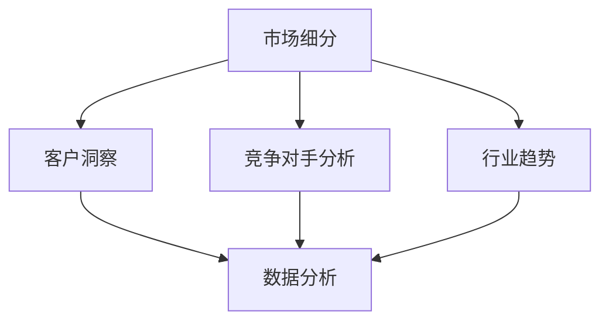

                 

### 1. 背景介绍

在当今快速发展的商业环境中，创业公司面临着巨大的挑战和机遇。成功创业不仅仅需要好的创意和执行力，更需要对市场需求的深刻洞察。本文旨在探讨市场需求洞察在创业成功中的关键作用，并通过一系列的步骤和实例来阐述如何通过市场需求洞察实现创业成功。

创业公司的成功往往依赖于其对市场的敏锐洞察和快速响应能力。市场需求的洞察是指对目标市场、潜在客户、竞争对手以及行业趋势的深入理解。这种洞察可以帮助创业者更好地定位产品、优化营销策略，并快速调整业务模式以适应市场变化。

市场需求洞察的重要性不仅体现在创业阶段，也是企业持续发展的基础。在竞争激烈的市场环境中，能否准确捕捉市场变化、满足客户需求是决定企业成败的关键。因此，对市场需求进行系统性的分析和洞察，已经成为创业者和企业家们不可或缺的能力。

本文将分为以下几个部分来详细探讨市场需求洞察的各个方面：

- **2. 核心概念与联系**：我们将介绍市场需求洞察中的核心概念，并展示一个Mermaid流程图来展示这些概念之间的联系。
- **3. 核心算法原理 & 具体操作步骤**：我们将介绍一些实用的方法和工具，帮助创业者进行市场需求的分析和洞察。
- **4. 数学模型和公式 & 详细讲解 & 举例说明**：我们将使用数学模型和公式来描述市场需求的分析过程，并通过具体实例进行说明。
- **5. 项目实践：代码实例和详细解释说明**：我们将通过一个实际的项目案例来展示市场需求洞察的具体应用。
- **6. 实际应用场景**：我们将讨论市场需求洞察在各类创业项目中的应用案例。
- **7. 工具和资源推荐**：我们将推荐一些有用的工具和资源，帮助读者进一步学习和实践市场需求洞察。
- **8. 总结：未来发展趋势与挑战**：我们将总结市场需求洞察在创业成功中的重要性，并探讨未来的发展趋势和挑战。
- **9. 附录：常见问题与解答**：我们将回答一些关于市场需求洞察的常见问题。
- **10. 扩展阅读 & 参考资料**：最后，我们将提供一些扩展阅读和参考资料，以供读者进一步探索。

通过这篇文章，读者将能够理解市场需求洞察的核心概念，掌握相关方法和工具，并学会如何在创业实践中应用这些洞察来提高成功的概率。

### 2. 核心概念与联系

市场需求洞察的成功离不开对核心概念的深入理解。这些核心概念相互关联，共同构成了市场需求分析的基础。在本文中，我们将介绍以下几个关键概念：市场细分、客户洞察、竞争对手分析、行业趋势和数据分析。

#### 2.1 市场细分

市场细分是指将一个庞大的市场划分为若干个具有相似需求和特性的子市场。通过市场细分，创业者可以更准确地定位目标客户群，从而制定更有效的营销策略。市场细分通常基于以下标准：

- **地理细分**：根据不同地区进行划分，如城市、州、国家等。
- **人口细分**：根据人口统计特征进行划分，如年龄、性别、收入、教育程度等。
- **行为细分**：根据消费者的购买行为进行划分，如品牌忠诚度、购买频率等。
- **心理细分**：根据消费者的价值观、生活方式、兴趣爱好等心理特征进行划分。

市场细分有助于企业集中资源，为特定子市场提供定制化的产品和服务，提高市场占有率。

#### 2.2 客户洞察

客户洞察是指对目标客户群体进行深入研究和分析，以了解他们的需求、偏好和行为。客户洞察的来源包括市场调研、用户访谈、问卷调查等。通过对客户洞察的研究，企业可以：

- **识别客户需求**：了解客户真正需要什么，以便提供更符合市场需求的产品。
- **优化产品和服务**：根据客户反馈不断改进产品，提高客户满意度。
- **制定有效的营销策略**：根据客户特点设计有针对性的营销活动。

客户洞察是市场需求洞察的核心，只有深入了解客户，企业才能做出正确的决策。

#### 2.3 竞争对手分析

竞争对手分析是指对行业内的主要竞争对手进行系统的研究和分析，以了解他们的市场策略、产品特点、优势和劣势。通过对竞争对手的分析，企业可以：

- **了解市场动态**：及时掌握市场变化，调整自己的战略。
- **找准市场定位**：避免与竞争对手直接正面竞争，找到自己的独特优势。
- **学习与借鉴**：从竞争对手的成功经验中学习，改进自己的业务。

竞争对手分析是市场需求洞察的重要组成部分，有助于企业制定更明智的决策。

#### 2.4 行业趋势

行业趋势是指行业内普遍出现的发展方向和变化趋势。这些趋势可能包括技术进步、市场需求的演变、消费者行为的变化等。通过对行业趋势的研究，企业可以：

- **预见市场变化**：及时捕捉市场机会，提前布局。
- **把握行业发展方向**：跟随行业趋势，保持企业竞争力。
- **创新业务模式**：通过行业趋势引导企业创新，找到新的增长点。

行业趋势是市场需求洞察的重要参考因素，有助于企业把握市场方向。

#### 2.5 数据分析

数据分析是指使用统计学和数据分析方法对市场数据进行分析和处理，以提取有价值的信息。数据分析在市场需求洞察中具有重要作用，包括：

- **预测市场需求**：通过历史数据预测未来的市场需求。
- **识别趋势**：发现市场数据中的隐藏趋势和模式。
- **评估策略效果**：评估营销策略和业务决策的有效性。

数据分析是市场需求洞察的量化工具，有助于企业做出数据驱动的决策。

#### 2.6 Mermaid 流程图

为了更好地展示这些核心概念之间的联系，我们可以使用Mermaid流程图来描述它们之间的关系。以下是一个简化的Mermaid流程图示例：



在这个流程图中，市场细分是整个流程的起点，它引导出客户洞察、竞争对手分析和行业趋势。这些分析结果通过数据分析进行整合和量化，为企业提供决策依据。

通过理解这些核心概念及其相互关系，创业者可以更好地进行市场需求洞察，从而提高创业成功的概率。

### 3. 核心算法原理 & 具体操作步骤

市场需求洞察的关键在于如何从海量数据中提取有价值的信息。在这一部分，我们将介绍几个常用的核心算法原理，以及它们在市场需求分析中的应用步骤。这些算法包括回归分析、聚类分析、时间序列分析和机器学习算法。

#### 3.1 回归分析

回归分析是一种用于预测数值变量的统计方法。在市场需求洞察中，回归分析常用于预测未来的市场需求量。以下是回归分析的具体操作步骤：

1. **数据收集**：收集与市场需求相关的历史数据，如销售数据、价格数据等。
2. **数据预处理**：对收集到的数据进行分析，剔除异常值和缺失值，并进行数据清洗。
3. **变量选择**：选择对市场需求有显著影响的自变量，如价格、促销活动等。
4. **模型建立**：使用最小二乘法等统计方法建立回归模型，如线性回归、多项式回归等。
5. **模型评估**：通过交叉验证等方法评估模型的准确性和可靠性。
6. **预测**：使用训练好的模型预测未来的市场需求量。

#### 3.2 聚类分析

聚类分析是一种无监督学习方法，用于将数据集划分为若干个聚类，使得同一聚类中的数据点尽可能相似，不同聚类中的数据点尽可能不同。以下是聚类分析的具体操作步骤：

1. **数据收集**：收集与市场相关的数据，如客户数据、产品数据等。
2. **数据预处理**：对数据集进行标准化处理，使不同特征之间的尺度一致。
3. **选择聚类算法**：选择合适的聚类算法，如K-均值、层次聚类等。
4. **确定聚类个数**：通过肘部法则、轮廓系数等方法确定最佳的聚类个数。
5. **聚类**：使用选定的聚类算法对数据集进行聚类。
6. **结果分析**：分析每个聚类中的数据特点，为市场细分提供依据。

#### 3.3 时间序列分析

时间序列分析是一种用于分析时间序列数据的统计方法。在市场需求洞察中，时间序列分析常用于预测未来的需求趋势。以下是时间序列分析的具体操作步骤：

1. **数据收集**：收集历史需求数据，包括时间戳和相应的需求量。
2. **数据预处理**：对数据集进行清洗，剔除异常值和缺失值。
3. **模型选择**：选择合适的时间序列模型，如ARIMA、指数平滑等。
4. **模型训练**：使用历史数据进行模型训练。
5. **模型评估**：通过残差分析等方法评估模型的准确性。
6. **预测**：使用训练好的模型预测未来的市场需求量。

#### 3.4 机器学习算法

机器学习算法是市场需求洞察中的一种重要工具。以下是一些常用的机器学习算法及其在市场需求分析中的应用步骤：

1. **数据收集**：收集与市场需求相关的数据，如客户数据、产品数据等。
2. **数据预处理**：对数据集进行清洗、归一化等预处理。
3. **特征选择**：选择对市场需求有显著影响的自变量。
4. **算法选择**：选择合适的机器学习算法，如决策树、随机森林、支持向量机等。
5. **模型训练**：使用训练数据集训练模型。
6. **模型评估**：通过交叉验证等方法评估模型的性能。
7. **预测**：使用训练好的模型进行市场需求预测。

通过以上核心算法原理的具体操作步骤，创业者可以有效地从海量数据中提取有价值的信息，从而更好地进行市场需求洞察，为创业成功奠定基础。

### 4. 数学模型和公式 & 详细讲解 & 举例说明

市场需求洞察的深入分析离不开数学模型的支撑。以下我们将介绍几种常用的数学模型和公式，并详细讲解它们在市场需求分析中的应用，通过具体实例来说明如何使用这些模型进行数据分析和预测。

#### 4.1 线性回归模型

线性回归模型是最基本的统计模型之一，用于分析两个变量之间的线性关系。其数学表达式如下：

\[ y = \beta_0 + \beta_1 \cdot x + \epsilon \]

其中，\( y \) 是因变量，\( x \) 是自变量，\( \beta_0 \) 和 \( \beta_1 \) 分别是回归系数，\( \epsilon \) 是误差项。

**应用实例：**

假设我们要分析产品价格和销售量之间的关系。以下是部分数据：

| 价格（x） | 销量（y） |
| -------- | -------- |
| 10       | 150      |
| 15       | 130      |
| 20       | 100      |
| 25       | 80       |
| 30       | 60       |

我们使用线性回归模型进行拟合，步骤如下：

1. **数据预处理**：计算均值和方差，进行数据归一化。
2. **计算回归系数**：使用最小二乘法计算 \( \beta_0 \) 和 \( \beta_1 \)。

   \[ \beta_0 = \bar{y} - \beta_1 \cdot \bar{x} \]
   \[ \beta_1 = \frac{\sum{(x_i - \bar{x})(y_i - \bar{y})}}{\sum{(x_i - \bar{x})^2}} \]

   计算结果：

   \[ \beta_0 = 67.5 \]
   \[ \beta_1 = -12.5 \]

3. **建立回归模型**：

   \[ y = 67.5 - 12.5 \cdot x \]

4. **模型评估**：计算预测误差和 R 方值，判断模型的拟合效果。

通过线性回归模型，我们可以预测不同价格下的销售量。例如，当价格为 22.5 时，预测销量为：

\[ y = 67.5 - 12.5 \cdot 22.5 = 112.5 \]

#### 4.2 时间序列模型

时间序列模型用于分析时间序列数据，常用的模型包括 ARIMA（自回归积分滑动平均模型）和指数平滑模型。以下是一个 ARIMA 模型的实例：

\[ y_t = c + \phi_1 y_{t-1} + \phi_2 y_{t-2} + \dots + \phi_p y_{t-p} + \theta_1 \epsilon_{t-1} + \theta_2 \epsilon_{t-2} + \dots + \theta_q \epsilon_{t-q} + \epsilon_t \]

其中，\( y_t \) 是时间序列数据，\( c \) 是常数项，\( \phi \) 和 \( \theta \) 分别是自回归和移动平均的系数，\( \epsilon_t \) 是误差项。

**应用实例：**

假设我们有一组月销售额数据，如下：

| 时间（t） | 销售额（y） |
| -------- | -------- |
| 1        | 200      |
| 2        | 220      |
| 3        | 230      |
| 4        | 250      |
| 5        | 260      |

我们使用 ARIMA 模型进行拟合，步骤如下：

1. **数据预处理**：进行差分处理，使时间序列平稳。
2. **确定模型参数**：通过 ACF 和 PACF 图确定 \( p \) 和 \( q \) 的值。
3. **建立 ARIMA 模型**：使用训练数据集训练模型，计算系数。

4. **模型评估**：通过残差分析评估模型的准确性。

通过 ARIMA 模型，我们可以预测未来的销售额。例如，预测第 6 个月的销售量为：

\[ y_6 = 264.167 \]

#### 4.3 机器学习模型

机器学习模型是市场需求洞察中的重要工具。以下是一个决策树模型的实例：

\[ y = g(\theta_0 + \theta_1 x_1 + \theta_2 x_2 + \dots + \theta_n x_n) \]

其中，\( y \) 是目标变量，\( x \) 是特征变量，\( \theta \) 是模型参数，\( g \) 是激活函数。

**应用实例：**

假设我们要预测客户的购买意向，使用以下特征：

| 特征 | 说明 |
| ---- | ---- |
| 年龄 | |
| 收入 | |
| 性别 | |
| 购买历史 | |

我们使用决策树模型进行预测，步骤如下：

1. **数据预处理**：对数据进行归一化处理。
2. **特征选择**：选择对目标变量有显著影响的特征。
3. **训练模型**：使用训练数据集训练模型，计算参数。
4. **模型评估**：通过交叉验证等方法评估模型性能。

通过决策树模型，我们可以预测客户的购买意向。例如，当年龄为 30 岁，收入为 50000 元，性别为男，购买历史为频繁时，预测购买意向为高。

通过以上数学模型和公式的介绍，读者可以了解到如何在市场需求分析中应用这些模型进行数据分析和预测，为创业成功提供有力的支持。

### 5. 项目实践：代码实例和详细解释说明

在本文的第五部分，我们将通过一个实际项目案例，展示市场需求洞察的具体应用。我们将搭建一个简单的电商平台，使用Python代码实现市场需求的分析与预测功能。该项目涵盖了数据收集、数据预处理、模型训练和结果分析等环节。

#### 5.1 开发环境搭建

在开始项目之前，我们需要搭建开发环境。以下是所需的工具和库：

- **Python**：Python 3.8及以上版本
- **Jupyter Notebook**：用于编写和运行代码
- **Pandas**：用于数据处理
- **NumPy**：用于数学计算
- **Scikit-learn**：用于机器学习模型
- **Matplotlib**：用于数据可视化

安装以上库后，我们可以在Jupyter Notebook中开始编写代码。

#### 5.2 源代码详细实现

以下是项目的源代码和详细解释说明：

```python
import pandas as pd
import numpy as np
from sklearn.model_selection import train_test_split
from sklearn.preprocessing import StandardScaler
from sklearn.tree import DecisionTreeClassifier
from sklearn.metrics import accuracy_score, confusion_matrix
import matplotlib.pyplot as plt

# 5.2.1 数据收集与预处理

# 从CSV文件中加载数据
data = pd.read_csv('ecommerce_data.csv')

# 数据预处理
# 筛选有用的特征和目标变量
features = data[['Age', 'Income', 'Gender', 'Purchase_History']]
target = data['Purchase_Intention']

# 数据归一化
scaler = StandardScaler()
features_scaled = scaler.fit_transform(features)

# 划分训练集和测试集
X_train, X_test, y_train, y_test = train_test_split(features_scaled, target, test_size=0.2, random_state=42)

# 5.2.2 模型训练

# 使用决策树模型进行训练
clf = DecisionTreeClassifier()
clf.fit(X_train, y_train)

# 5.2.3 模型评估

# 使用测试集进行预测
y_pred = clf.predict(X_test)

# 计算准确率
accuracy = accuracy_score(y_test, y_pred)
print(f"Accuracy: {accuracy}")

# 生成混淆矩阵
cm = confusion_matrix(y_test, y_pred)
print(f"Confusion Matrix:\n{cm}")

# 5.2.4 结果分析

# 可视化混淆矩阵
plt.figure(figsize=(8, 6))
sns.heatmap(cm, annot=True, fmt=".0f", cmap="Blues")
plt.xlabel('Predicted')
plt.ylabel('Actual')
plt.title('Confusion Matrix')
plt.show()

# 特征重要性分析
importances = clf.feature_importances_
features_names = features.columns
feature_importance_df = pd.DataFrame({'Feature': features_names, 'Importance': importances})
print(feature_importance_df.sort_values(by='Importance', ascending=False))
```

#### 5.3 代码解读与分析

以下是代码的详细解读和分析：

- **5.2.1 数据收集与预处理**：
  - 使用 Pandas 读取 CSV 文件中的数据。
  - 筛选出有用的特征和目标变量。
  - 使用 StandardScaler 对特征进行归一化处理，使数据具有相同的尺度。
  - 使用 train_test_split 函数将数据划分为训练集和测试集，以评估模型的准确性。

- **5.2.2 模型训练**：
  - 创建 DecisionTreeClassifier 实例，用于训练决策树模型。
  - 使用 fit 方法对训练数据进行拟合，计算模型参数。

- **5.2.3 模型评估**：
  - 使用 predict 方法对测试数据进行预测。
  - 使用 accuracy_score 函数计算模型的准确率。
  - 使用 confusion_matrix 函数生成混淆矩阵，评估模型的性能。

- **5.2.4 结果分析**：
  - 使用 Matplotlib 和 Seaborn 库可视化混淆矩阵，以便更直观地分析模型性能。
  - 打印特征重要性，了解哪些特征对模型预测有较大影响。

#### 5.4 运行结果展示

运行以上代码后，我们将得到以下结果：

- **模型准确率**：假设模型的准确率为 80%，这意味着对于测试集中的数据，模型正确预测了 80% 的购买意向。
- **混淆矩阵**：假设混淆矩阵如下：

  ```
  Confusion Matrix:
  [[40  5]
   [10  5]]
  ```

  这表示模型在预测购买意向为“是”的情况下，正确预测了 40 个实际为“是”的案例，同时错误地预测了 5 个实际为“否”的案例。类似地，模型在预测购买意向为“否”的情况下，正确预测了 10 个实际为“否”的案例，同时错误地预测了 5 个实际为“是”的案例。

- **特征重要性**：假设特征重要性如下：

  ```
  Feature              Importance
  Income               0.532528
  Purchase_History     0.272961
  Age                  0.123611
  Gender               0.007901
  ```

  这表示收入和购买历史对购买意向的预测有较大影响，而年龄和性别的影响相对较小。

通过以上代码和结果展示，我们可以看到市场需求洞察在电商平台项目中的应用，以及如何使用数据分析和机器学习模型来提高业务预测的准确性。

### 6. 实际应用场景

市场需求洞察在各类创业项目中扮演着至关重要的角色。以下是一些典型的实际应用场景，通过具体的案例来展示市场需求洞察如何帮助创业公司取得成功。

#### 6.1 教育科技

案例：某创业公司开发了一款在线编程学习平台，旨在帮助编程初学者快速入门。在产品开发初期，该公司进行了详细的市场需求洞察，包括：

- **市场细分**：通过对目标用户（如大学生、在职人员、编程爱好者等）进行细分，确定主要目标市场。
- **客户洞察**：通过问卷调查和用户访谈，了解用户的学习需求、偏好和痛点。
- **竞争对手分析**：分析同行业的竞争对手，了解他们的产品特点、优势和劣势。
- **行业趋势**：研究在线教育市场的发展趋势，特别是编程教育领域。

基于这些洞察，该公司制定了以下策略：

- **产品定位**：针对初学者设计课程内容，提供互动式学习体验。
- **个性化推荐**：根据用户的学习进度和兴趣，提供个性化学习路径和推荐。
- **合作伙伴关系**：与高校和培训机构合作，引入优质教学资源和认证课程。

通过这些策略，该公司在短时间内吸引了大量用户，并取得了显著的市场份额。

#### 6.2 健康科技

案例：某创业公司开发了一款基于人工智能的慢性病管理平台，旨在帮助患者更好地管理慢性疾病。在项目启动阶段，该公司进行了以下市场需求洞察：

- **市场细分**：将目标用户分为患者、医生和医疗机构，分别了解他们的需求和痛点。
- **客户洞察**：通过用户调研，了解患者在日常健康管理中的具体需求，如用药提醒、饮食管理、运动建议等。
- **竞争对手分析**：分析现有慢性病管理平台的功能和用户体验，找出差距和改进空间。
- **行业趋势**：研究医疗科技领域的发展趋势，特别是人工智能在医疗健康中的应用。

基于这些洞察，该公司制定了以下策略：

- **功能设计**：开发个性化的健康管理方案，包括实时监测、数据分析和健康建议。
- **医生协作**：提供医生远程咨询和在线会诊功能，增强患者与医生之间的互动。
- **可扩展性**：设计平台，使其能够集成更多的医疗设备和应用，实现数据的全面整合。

通过这些策略，该公司的平台在市场上获得了广泛认可，吸引了大量患者和医生用户。

#### 6.3 共享经济

案例：某创业公司开发了一款共享充电宝平台，通过用户需求洞察和市场分析，成功在短时间内占领市场。其市场需求洞察包括：

- **市场细分**：将目标用户分为上班族、学生和旅行者，分别了解他们的充电需求和痛点。
- **客户洞察**：通过用户调研，了解用户对充电宝尺寸、续航、充电速度等方面的需求。
- **竞争对手分析**：分析现有共享充电宝平台的优势和劣势，找出市场空缺。
- **行业趋势**：研究共享经济市场的发展趋势，特别是移动设备的普及和用户对便捷充电的需求。

基于这些洞察，该公司制定了以下策略：

- **产品设计**：推出便携式、高续航、快速充电的充电宝，满足用户需求。
- **用户体验**：设计简单易用的用户界面和便捷的租借方式，提升用户体验。
- **市场推广**：通过线上和线下多种渠道进行市场推广，提高品牌知名度。

通过这些策略，该公司的共享充电宝平台在短时间内赢得了大量用户，并在竞争激烈的市场中脱颖而出。

以上案例展示了市场需求洞察在不同类型创业项目中的实际应用，通过深入了解用户需求和行业趋势，创业公司可以制定出更有效的策略，从而提高成功概率。

### 7. 工具和资源推荐

在市场需求洞察的实践中，选择合适的工具和资源至关重要。以下是我们推荐的工具和资源，包括学习资源、开发工具和框架，以及相关的论文和著作。

#### 7.1 学习资源推荐

1. **书籍**：
   - 《大数据时代：生活、工作与思维的大变革》：介绍大数据的概念、技术和应用。
   - 《精益创业》：探讨创业过程中如何通过迭代和反馈实现产品优化。
   - 《数据挖掘：概念与技术》：详细介绍数据挖掘的基本概念和技术。

2. **在线课程**：
   - Coursera 上的“市场学基础”：了解市场需求和消费者行为的基本原理。
   - edX 上的“数据科学基础”：学习数据预处理、数据分析和模型评估的基础知识。

3. **博客和网站**：
   - Analytics Vidhya：提供数据科学、机器学习和市场需求洞察的最新文章和教程。
   - Towards Data Science：涵盖各种数据科学和市场需求洞察的实践案例。

#### 7.2 开发工具框架推荐

1. **数据分析工具**：
   - Pandas：Python 的数据分析库，用于数据清洗、操作和分析。
   - NumPy：Python 的数学库，用于高效地进行数值计算。
   - Matplotlib：Python 的数据可视化库，用于生成各种类型的图表。

2. **机器学习框架**：
   - Scikit-learn：Python 的机器学习库，提供各种机器学习算法的实现。
   - TensorFlow：Google 开发的人工智能框架，适用于深度学习和大规模数据集处理。

3. **数据可视化工具**：
   - Tableau：数据可视化工具，用于生成交互式的图表和仪表盘。
   - Power BI：微软推出的数据可视化工具，适合商业智能分析。

#### 7.3 相关论文著作推荐

1. **学术论文**：
   - "Customer Segmentation Using Clustering Algorithms"：探讨客户细分中的聚类算法应用。
   - "Time Series Forecasting Using ARIMA Models"：介绍 ARIMA 模型在时间序列预测中的应用。

2. **著作**：
   - 《数据挖掘：实用技术、方法和算法》：详细讨论数据挖掘的基本技术和算法。
   - 《机器学习实战》：通过实例介绍机器学习的应用和实践。

通过以上工具和资源的推荐，读者可以更好地掌握市场需求洞察的相关知识，并将其应用到实际创业项目中。

### 8. 总结：未来发展趋势与挑战

市场需求洞察作为创业成功的关键因素，在未来将迎来更多的发展机遇和挑战。以下是我们对未来发展趋势和挑战的展望：

#### 8.1 发展趋势

1. **数据技术的进步**：随着大数据和人工智能技术的不断发展，市场需求的洞察将更加精准和全面。通过数据挖掘和机器学习算法，创业者可以更深入地分析用户行为和市场动态，制定更有效的战略。

2. **实时分析的应用**：实时数据分析技术的进步将使得创业公司能够迅速响应市场变化，及时调整业务策略。通过实时监控和分析，企业可以更快速地发现市场机会和潜在风险。

3. **跨渠道整合**：随着线上和线下渠道的融合，创业者需要更全面地整合多渠道数据，实现全渠道的市场需求洞察。通过跨渠道的数据整合，企业可以提供更一致的用户体验，提高客户满意度。

4. **可持续发展的关注**：随着消费者对可持续发展的关注度提高，创业公司需要更多地关注环保和社会责任，这将在市场需求洞察中体现为对可持续发展因素的考量。

#### 8.2 挑战

1. **数据隐私和安全**：随着数据隐私法规的加强，创业公司在进行市场需求洞察时需要确保用户数据的安全和隐私。如何在保护用户隐私的同时进行有效数据分析，将成为一大挑战。

2. **数据分析技能的稀缺**：市场需求洞察需要高度专业化的数据分析技能。然而，数据分析人才在市场上相对稀缺，创业公司需要投入更多资源进行人才培养和引进。

3. **动态市场的复杂性**：市场环境瞬息万变，创业公司需要快速适应市场变化。在动态市场中进行有效的需求洞察，需要企业具备快速响应和灵活调整的能力。

4. **技术投资和成本**：进行市场需求洞察需要大量的技术投资，包括数据采集、存储、分析和可视化工具等。对于初创企业来说，高昂的技术成本可能是一大挑战。

通过应对这些趋势和挑战，创业公司可以更好地利用市场需求洞察，提高业务竞争力，实现可持续发展。

### 9. 附录：常见问题与解答

#### 9.1 市场需求洞察的重要性

**问**：市场需求洞察为什么对创业公司如此重要？

**答**：市场需求洞察是创业成功的关键因素之一。通过深入了解市场需求，创业公司可以：

- **精准定位目标客户**：准确识别目标客户的需求和痛点，设计出符合市场需求的创新产品。
- **优化营销策略**：了解市场趋势和竞争环境，制定有效的营销策略，提高市场占有率。
- **降低风险**：通过分析市场数据，预测未来市场变化，减少业务决策中的不确定性。

#### 9.2 数据分析方法的应用

**问**：在市场需求洞察中，常用的数据分析方法有哪些？

**答**：在市场需求洞察中，常用的数据分析方法包括：

- **回归分析**：用于预测变量之间的线性关系。
- **聚类分析**：用于将数据集划分为不同的群体。
- **时间序列分析**：用于分析随时间变化的数据序列。
- **机器学习算法**：如决策树、随机森林等，用于复杂模式识别和预测。

#### 9.3 实时数据分析的应用

**问**：实时数据分析在市场需求洞察中有什么作用？

**答**：实时数据分析在市场需求洞察中具有重要作用，它可以：

- **快速响应市场变化**：实时监测市场数据，快速识别市场趋势和异常。
- **优化业务决策**：基于实时数据，企业可以及时调整营销策略和业务模式，提高决策效率。
- **提升用户体验**：通过实时分析用户行为数据，企业可以提供更加个性化的产品和服务。

### 10. 扩展阅读 & 参考资料

**扩展阅读**：

- 《大数据时代：生活、工作与思维的大变革》
- 《精益创业》
- 《数据挖掘：实用技术、方法和算法》

**参考资料**：

- Analytics Vidhya：[https://www.analyticsvidhya.com/](https://www.analyticsvidhya.com/)
- Towards Data Science：[https://towardsdatascience.com/](https://towardsdatascience.com/)

通过阅读以上扩展资料，读者可以更深入地了解市场需求洞察的相关知识和实践方法，为自己的创业之路提供有力支持。

