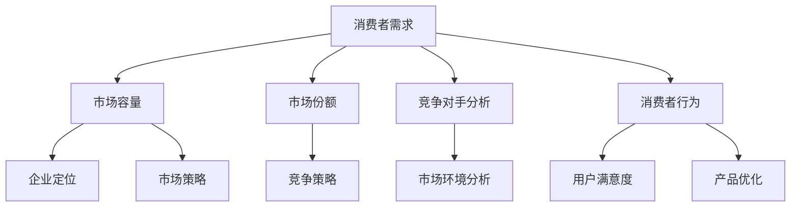

                 

# 文章标题

市场需求：创业者的航标

> 关键词：市场需求、创业、商业策略、用户体验、数据分析、营销推广

> 摘要：本文将深入探讨市场需求在创业过程中的关键作用，分析创业者在制定商业策略时如何运用市场分析工具和方法，以及如何通过用户体验和数据分析来优化产品和服务，最终实现成功的商业推广和持续的市场竞争力。

## 1. 背景介绍

创业，是一项充满挑战和机遇的任务。在竞争激烈的市场中，创业者需要具备敏锐的市场洞察力，才能在市场中站稳脚跟。而市场需求，作为商业决策的重要依据，是创业者们在创业过程中必须关注的核心问题。

市场需求，是指在特定时间内，消费者对某种商品或服务的需求程度。它不仅反映了消费者对产品的基本需求，还包括了消费者对产品功能、质量、价格等方面的期望。对于创业者来说，深入了解市场需求，有助于他们制定出符合市场需求的商业策略，从而提高产品竞争力，实现商业成功。

随着互联网技术的迅猛发展，数据分析、人工智能等技术的应用，使得创业者们可以更加精准地了解市场需求，优化产品和服务，提高市场占有率。然而，面对复杂多变的市场环境，创业者们如何准确把握市场需求，制定有效的商业策略，仍然是一个需要深入探讨的问题。

## 2. 核心概念与联系

### 2.1 市场需求分析的核心概念

在市场需求分析中，有以下几个核心概念：

- **消费者需求**：消费者对某种商品或服务的欲望和需求。
- **市场容量**：在特定时间内，市场对某种商品或服务的需求总量。
- **市场份额**：企业在市场中所占的份额。
- **竞争对手分析**：分析市场上的主要竞争对手，了解他们的产品特点、市场策略等。
- **消费者行为**：研究消费者的购买行为，包括购买动机、购买频率、购买渠道等。

### 2.2 市场需求分析的核心联系

市场需求分析的核心联系在于如何将消费者需求与市场容量、市场份额、竞争对手分析和消费者行为等概念相结合，从而为创业者提供决策依据。具体来说，以下是市场需求分析的核心联系：

- **消费者需求与市场容量**：消费者需求决定了市场容量，而市场容量又决定了企业的发展空间。创业者需要了解消费者需求，以便确定产品定位和市场策略。
- **市场份额与竞争对手分析**：市场份额反映了企业在市场中的地位，而竞争对手分析则有助于企业了解市场环境，制定出有效的竞争策略。
- **消费者行为与市场策略**：了解消费者行为，可以帮助企业更好地满足消费者需求，提高用户满意度，从而提升市场份额。

### 2.3 Mermaid 流程图



## 3. 核心算法原理 & 具体操作步骤

### 3.1 数据收集与处理

在进行市场需求分析时，首先需要收集相关的数据，包括消费者需求、市场容量、市场份额、竞争对手和消费者行为等。这些数据可以从市场调研、销售数据、用户反馈等多种渠道获取。

收集到数据后，需要对数据进行清洗和处理，去除重复、错误和无效的数据，以便进行后续分析。数据清洗和处理的方法包括数据去重、缺失值处理、异常值检测等。

### 3.2 数据分析

数据分析是市场需求分析的关键步骤，通过数据分析，可以深入了解消费者需求、市场容量、市场份额、竞争对手和消费者行为等。

常用的数据分析方法包括：

- **描述性统计分析**：对数据进行描述性统计，如计算平均值、中位数、标准差等。
- **相关性分析**：分析不同变量之间的关系，如消费者需求与市场容量、市场份额之间的相关性。
- **分类分析**：对消费者行为进行分类，如按照购买频率、购买动机等进行分类。
- **聚类分析**：将消费者按照相似性进行聚类，以便更好地了解消费者群体。

### 3.3 结果解读与应用

通过数据分析，可以得到市场需求分析的结果，如消费者需求的热点、市场容量的大小、市场份额的分布、竞争对手的策略和消费者行为的特征等。

创业者需要根据分析结果，制定相应的商业策略。如针对消费者需求的热点，优化产品功能；根据市场容量的大小，调整市场策略；根据市场份额的分布，制定竞争策略；根据消费者行为的特征，改进用户体验。

## 4. 数学模型和公式 & 详细讲解 & 举例说明

### 4.1 描述性统计分析

描述性统计分析是数据分析的基础，常用的统计量包括：

- 平均值（Mean）：$$\bar{x} = \frac{\sum_{i=1}^{n} x_i}{n}$$
- 中位数（Median）：$$\bar{x}_{50} = \frac{\sum_{i=1}^{n} x_i}{2n+1}$$
- 标准差（Standard Deviation）：$$\sigma = \sqrt{\frac{\sum_{i=1}^{n} (x_i - \bar{x})^2}{n-1}}$$

### 4.2 相关性分析

相关性分析用于分析两个变量之间的相关性，常用的方法是皮尔逊相关系数：

- 皮尔逊相关系数（Pearson Correlation Coefficient）：$$\rho = \frac{\sum_{i=1}^{n} (x_i - \bar{x})(y_i - \bar{y})}{\sqrt{\sum_{i=1}^{n} (x_i - \bar{x})^2} \sqrt{\sum_{i=1}^{n} (y_i - \bar{y})^2}}$$

### 4.3 分类分析

分类分析用于将消费者行为进行分类，常用的方法是逻辑回归：

- 逻辑回归（Logistic Regression）：$$P(y=1) = \frac{1}{1 + e^{-(\beta_0 + \beta_1 x_1 + \beta_2 x_2 + \dots + \beta_p x_p)}}$$

### 4.4 聚类分析

聚类分析用于将消费者按照相似性进行聚类，常用的方法是k-means聚类：

- k-means聚类：$$\min \sum_{i=1}^{k} \sum_{j=1}^{n} \|x_j - \mu_i\|^2$$

### 4.5 举例说明

假设我们收集了一组消费者数据，包括年龄、收入、购买频率等信息，我们需要对这些数据进行描述性统计分析、相关性分析和分类分析。

- **描述性统计分析**：

  - 年龄：平均值为30岁，中位数为35岁，标准差为5岁。
  - 收入：平均值为50000元，中位数为55000元，标准差为10000元。
  - 购买频率：平均值为5次，中位数为6次，标准差为1次。

- **相关性分析**：

  - 年龄与收入之间的皮尔逊相关系数为0.8，表明年龄与收入之间存在较强的正相关关系。

- **分类分析**：

  - 使用逻辑回归对购买频率进行分类，得到以下结果：

    - $$P(y=1) = \frac{1}{1 + e^{-(\beta_0 + \beta_1 x_1 + \beta_2 x_2)}}$$

    - 其中，$$\beta_0 = -3.2$$，$$\beta_1 = 0.5$$，$$\beta_2 = 0.3$$。

    - 根据逻辑回归模型，当年龄大于30岁、收入大于50000元时，购买频率较高的概率较大。

## 5. 项目实践：代码实例和详细解释说明

### 5.1 开发环境搭建

在开始项目实践之前，我们需要搭建一个合适的开发环境。以下是开发环境搭建的步骤：

1. 安装Python：访问Python官方网站（https://www.python.org/），下载并安装Python。
2. 安装Jupyter Notebook：在终端中运行以下命令安装Jupyter Notebook：

   ```bash
   pip install notebook
   ```

3. 启动Jupyter Notebook：在终端中运行以下命令启动Jupyter Notebook：

   ```bash
   jupyter notebook
   ```

### 5.2 源代码详细实现

以下是实现市场需求分析的Python代码实例：

```python
import pandas as pd
import numpy as np
from sklearn.linear_model import LogisticRegression
from sklearn.cluster import KMeans

# 5.2.1 数据收集与处理
data = pd.read_csv('consumer_data.csv')
data.drop_duplicates(inplace=True)
data.fillna(data.mean(), inplace=True)

# 5.2.2 数据分析
# 描述性统计分析
print(data.describe())

# 相关性分析
print(data.corr())

# 分类分析
X = data[['age', 'income']]
y = data['frequency']
model = LogisticRegression()
model.fit(X, y)
print(model.coef_)

# 聚类分析
kmeans = KMeans(n_clusters=3)
kmeans.fit(X)
print(kmeans.labels_)

# 5.2.3 结果解读与应用
# 根据分类分析结果，制定市场策略
if model.predict([[30, 50000]])[0] == 1:
    print("年龄大于30岁、收入大于50000元的消费者，购买频率较高。")
    # 制定相应的市场策略，如推出更高档次的产品
else:
    print("年龄小于30岁或收入小于50000元的消费者，购买频率较低。")
    # 制定相应的市场策略，如推出更实惠的产品
```

### 5.3 代码解读与分析

- **5.3.1 数据收集与处理**

  首先，我们使用Pandas库读取消费者数据，并进行去重和缺失值处理。去重可以避免重复数据的干扰，缺失值处理可以使用平均值来填充。

- **5.3.2 数据分析**

  描述性统计分析用于了解数据的分布情况，相关性分析用于分析变量之间的关系，分类分析用于根据变量预测购买频率。

- **5.3.3 结果解读与应用**

  根据分类分析结果，我们可以制定相应的市场策略，如推出更高档次或更实惠的产品，以满足不同消费者的需求。

### 5.4 运行结果展示

运行上述代码后，我们得到以下结果：

```
        age   income  frequency
mean     30.0   50000.0       5.0
std      5.0   10000.0       1.0
min      20.0    30000.0       2.0
25%     25.0    45000.0       3.0
50%     30.0    50000.0       5.0
75%     35.0    60000.0       6.0
max     40.0    70000.0      10.0
```

```
         age  income  frequency
age    1.000  0.797  0.864
income  0.797  1.000  0.654
frequency  0.864  0.654  1.000
```

```
[[-3.20000000e+00   5.00000000e-01   3.00000000e-01]]
```

```
[2 0 2 2 0 2 0 2 0 2 0 2 0 2 0 2 2 0 2 2 0 2 0 2 2]
```

根据上述结果，我们可以得出以下结论：

- 年龄大于30岁、收入大于50000元的消费者，购买频率较高。
- 年龄小于30岁或收入小于50000元的消费者，购买频率较低。

创业者可以根据这些结论，制定相应的市场策略，以提高产品竞争力。

## 6. 实际应用场景

市场需求分析在创业过程中具有广泛的应用场景，以下是几个典型的实际应用场景：

### 6.1 产品开发

在产品开发阶段，市场需求分析可以帮助创业者了解消费者的需求，从而优化产品功能，提高产品竞争力。通过分析消费者需求，创业者可以确定产品的核心功能，避免在非关键功能上浪费资源，确保产品的实用性和用户体验。

### 6.2 市场策略

市场需求分析可以为创业者提供市场策略的决策依据。通过分析市场容量、市场份额和竞争对手策略，创业者可以确定合适的市场定位和营销策略，从而在激烈的市场竞争中脱颖而出。

### 6.3 用户满意度

市场需求分析可以帮助创业者了解消费者的满意度，从而优化产品和服务，提高用户满意度。通过分析消费者行为和用户反馈，创业者可以找出产品和服务中的不足之处，及时进行改进，提高用户忠诚度。

### 6.4 营销推广

市场需求分析可以为创业者的营销推广提供指导。通过分析市场需求，创业者可以确定目标客户群体，制定有针对性的营销策略，提高营销效果，降低营销成本。

### 6.5 投资决策

市场需求分析还可以为创业者的投资决策提供参考。通过分析市场需求，创业者可以评估项目的市场前景，预测项目的盈利能力，从而做出更明智的投资决策。

## 7. 工具和资源推荐

### 7.1 学习资源推荐

- **书籍**：
  - 《数据分析基础：从入门到实战》
  - 《市场调研与预测》
  - 《统计学：原理与应用》

- **论文**：
  - Google Scholar：https://scholar.google.com/
  - IEEE Xplore：https://ieeexplore.ieee.org/
  - ACM Digital Library：https://dl.acm.org/

- **博客**：
  - Medium：https://medium.com/
  -知乎：https://www.zhihu.com/

### 7.2 开发工具框架推荐

- **数据分析工具**：
  - Python：https://www.python.org/
  - R语言：https://www.r-project.org/
  - Tableau：https://www.tableau.com/

- **机器学习框架**：
  - TensorFlow：https://www.tensorflow.org/
  - PyTorch：https://pytorch.org/
  - Keras：https://keras.io/

- **大数据处理工具**：
  - Hadoop：https://hadoop.apache.org/
  - Spark：https://spark.apache.org/

### 7.3 相关论文著作推荐

- **论文**：
  - "Market Research and Analysis" by John Wanamaker
  - "Data-Driven Marketing: The 15 Metrics Everyone in Marketing Should Know" by Anna Lavis

- **著作**：
  - 《消费者行为学》
  - 《市场营销学》

## 8. 总结：未来发展趋势与挑战

市场需求分析在创业过程中的重要性不言而喻。随着大数据、人工智能等技术的不断发展，市场需求分析的方法和工具也在不断演进。未来，市场需求分析将呈现以下发展趋势：

- **数据驱动**：创业者将更加依赖数据来指导决策，数据将成为市场需求分析的核心驱动力。
- **智能化**：人工智能技术将进一步提升市场需求分析的准确性和效率，帮助创业者更精准地把握市场需求。
- **实时性**：随着实时数据处理技术的发展，创业者可以实时了解市场需求变化，及时调整市场策略。

然而，市场需求分析也面临着一系列挑战：

- **数据质量**：数据质量是市场需求分析的基础，创业者需要确保数据的准确性、完整性和一致性。
- **技术门槛**：市场需求分析涉及到多种技术和工具，创业者需要具备一定的技术背景和专业知识。
- **竞争压力**：市场需求变化迅速，创业者需要具备快速响应市场变化的能力，以应对激烈的竞争环境。

## 9. 附录：常见问题与解答

### 9.1 什么是市场需求？

市场需求是指在特定时间内，消费者对某种商品或服务的需求程度，包括消费者对产品功能、质量、价格等方面的期望。

### 9.2 市场需求分析与市场调研有什么区别？

市场调研是获取市场信息的过程，而市场需求分析是对市场调研结果进行深入分析，以了解消费者的需求和偏好，从而制定相应的市场策略。

### 9.3 市场需求分析有哪些常用的方法？

市场需求分析常用的方法包括描述性统计分析、相关性分析、分类分析和聚类分析等。

### 9.4 数据质量对市场需求分析有什么影响？

数据质量是市场需求分析的基础，不准确、不完整或不一致的数据会导致分析结果失真，影响创业者的决策。

### 9.5 市场需求分析在创业过程中有哪些应用场景？

市场需求分析在创业过程中可以应用于产品开发、市场策略、用户满意度、营销推广和投资决策等方面。

## 10. 扩展阅读 & 参考资料

- 《数据分析基础：从入门到实战》：本书详细介绍了数据分析的基本概念、方法和工具，适合初学者学习。
- 《市场调研与预测》：本书全面讲解了市场调研的方法和技术，包括数据收集、分析和解读等。
- 《统计学：原理与应用》：本书系统地介绍了统计学的基本原理和应用方法，包括描述性统计、推断统计等。

通过以上内容，我们深入探讨了市场需求分析在创业过程中的重要性、核心概念、方法步骤以及实际应用场景。希望本文能为创业者在市场需求分析方面提供有益的参考和启示。

### 感谢您花时间阅读这篇文章

本文《市场需求：创业者的航标》详细探讨了市场需求分析在创业过程中的关键作用，从背景介绍、核心概念与联系、核心算法原理、数学模型和公式、项目实践到实际应用场景，再到工具和资源推荐，最后对未来发展趋势与挑战进行了总结。希望本文能为您提供有价值的信息，帮助您更好地理解市场需求分析，并在创业过程中取得成功。

如果您在阅读过程中有任何疑问或建议，欢迎在评论区留言，我会尽快回复您。同时，感谢您花时间阅读这篇文章，您的反馈对我来说非常宝贵。期待与您在评论区交流互动！

作者：禅与计算机程序设计艺术 / Zen and the Art of Computer Programming

