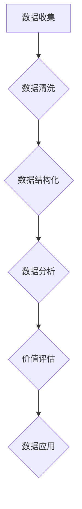

                 

### 文章标题

### 平台经济的数据价值评估结果：如何评估价值结果？

> 关键词：平台经济、数据价值评估、评估方法、评估结果、数据挖掘、商业智能、数据分析

> 摘要：本文将深入探讨平台经济中的数据价值评估问题，分析评估数据的来源、方法以及评估结果的解读和应用。通过系统的分析，我们将提供一套全面的数据价值评估框架，帮助企业更好地理解和挖掘其平台上的数据价值，从而实现商业利益的最大化。

## 1. 背景介绍

平台经济作为现代经济体系的重要组成部分，已经成为推动经济增长和行业创新的重要力量。平台经济通过搭建一个中间平台，连接供需双方，实现资源的优化配置和效率提升。随着大数据和人工智能技术的不断发展，平台经济中的数据规模和复杂性不断增加，如何评估这些数据的价值成为了一个亟待解决的问题。

### 平台经济的特点

平台经济具有以下几个显著特点：

1. **去中心化**：平台经济打破了传统的中心化商业模式，通过搭建一个开放的生态系统，使得供需双方能够自由地参与和互动。
2. **信息透明**：平台经济依赖于大数据技术，使得信息能够更加透明和高效地流动，提高了市场的运行效率。
3. **用户参与**：平台经济强调用户的参与和互动，通过用户的贡献和反馈，不断优化平台的服务质量和用户体验。
4. **快速迭代**：平台经济中的产品和服务能够快速迭代和升级，以适应市场变化和用户需求。

### 数据的价值

在平台经济中，数据不仅是一种资源，更是一种资产。平台上的数据来源广泛，包括用户行为数据、交易数据、社交数据等。这些数据不仅反映了用户的需求和偏好，还包含了市场趋势和竞争状况。因此，如何有效地评估这些数据的价值，对于平台经济的发展至关重要。

### 评估数据价值的必要性

评估数据价值的必要性主要体现在以下几个方面：

1. **决策支持**：准确的数据价值评估能够为企业的战略决策提供有力的支持，帮助企业识别和把握市场机会。
2. **资源配置**：数据价值评估可以帮助企业合理配置资源，优化数据管理和分析流程，提高运营效率。
3. **风险管理**：通过对数据价值的评估，企业可以更好地识别和应对潜在的风险，降低运营风险。
4. **商业创新**：数据价值评估能够激发企业的创新思维，推动商业模式和产品服务的创新。

## 2. 核心概念与联系

在评估平台经济中的数据价值时，我们需要了解以下几个核心概念：

### 数据类型

平台经济中的数据类型多种多样，主要包括以下几种：

1. **结构化数据**：如用户信息、交易记录等，这些数据通常以数据库的形式存储和管理。
2. **半结构化数据**：如日志文件、XML文档等，这些数据具有一定的结构，但不像结构化数据那样严格。
3. **非结构化数据**：如图片、视频、文本等，这些数据没有固定的结构，需要通过文本挖掘和图像识别等技术进行处理。

### 数据来源

平台经济中的数据来源广泛，主要包括以下几个方面：

1. **用户行为数据**：如用户访问、搜索、购买等行为数据，这些数据可以通过用户行为分析平台获取。
2. **交易数据**：如交易金额、交易频率等，这些数据可以直接从交易平台获取。
3. **社交数据**：如用户评论、分享等，这些数据可以通过社交媒体平台获取。

### 数据价值评估方法

评估数据价值的方法多种多样，主要包括以下几种：

1. **成本法**：通过计算获取和处理数据所需的成本来评估数据的价值。
2. **收益法**：通过计算数据所带来的收益来评估数据的价值。
3. **市场法**：通过参考市场上类似数据的交易价格来评估数据的价值。

### Mermaid 流程图

以下是一个用于评估平台经济数据价值的 Mermaid 流程图：



### 数据价值评估与平台经济的联系

数据价值评估与平台经济的联系主要体现在以下几个方面：

1. **提升平台价值**：通过数据价值评估，平台能够更好地理解其数据资产的价值，从而提升平台整体的商业价值。
2. **优化用户体验**：数据价值评估可以帮助平台更好地了解用户需求，从而提供更加个性化的服务，提升用户体验。
3. **推动商业创新**：数据价值评估可以为平台的商业模式创新提供参考，推动平台经济的持续发展。

## 3. 核心算法原理 & 具体操作步骤

### 数据价值评估算法原理

数据价值评估算法主要包括以下几个步骤：

1. **数据预处理**：对收集到的数据进行清洗、去重、格式转换等操作，确保数据的质量和一致性。
2. **特征提取**：从预处理后的数据中提取出对评估有意义的特征，如用户行为特征、交易特征等。
3. **模型训练**：利用机器学习算法对提取出的特征进行训练，构建数据价值评估模型。
4. **模型评估**：通过交叉验证等方法对模型进行评估，确保模型的准确性和稳定性。
5. **价值评估**：利用训练好的模型对新的数据进行价值评估，得到评估结果。

### 数据价值评估具体操作步骤

以下是一个具体的数据价值评估操作步骤：

1. **数据收集**：从平台各个渠道收集用户行为数据、交易数据等。
2. **数据清洗**：对收集到的数据进行清洗，去除重复数据、无效数据等。
3. **特征提取**：根据业务需求，提取用户行为特征、交易特征等，如用户活跃度、交易金额等。
4. **模型训练**：利用机器学习算法，如随机森林、支持向量机等，对提取出的特征进行训练，构建数据价值评估模型。
5. **模型评估**：通过交叉验证等方法对模型进行评估，确保模型的准确性和稳定性。
6. **价值评估**：利用训练好的模型对新的数据进行价值评估，得到评估结果。

## 4. 数学模型和公式 & 详细讲解 & 举例说明

### 数学模型

在数据价值评估中，常用的数学模型包括成本法、收益法和市场法。以下是这些方法的数学模型和详细解释。

### 成本法

成本法的数学模型为：

\[ V_d = \frac{C_t + C_p}{2} \]

其中，\( V_d \) 为数据的价值，\( C_t \) 为获取数据所需的成本，\( C_p \) 为处理数据所需的成本。

### 收益法

收益法的数学模型为：

\[ V_d = \frac{R_t - C_t}{2} \]

其中，\( V_d \) 为数据的价值，\( R_t \) 为数据所带来的收益，\( C_t \) 为获取和处理数据所需的成本。

### 市场法

市场法的数学模型为：

\[ V_d = \frac{P_t - C_t}{2} \]

其中，\( V_d \) 为数据的价值，\( P_t \) 为市场上类似数据的交易价格，\( C_t \) 为获取和处理数据所需的成本。

### 举例说明

假设一个电商平台的数据收集成本为 1000 元，数据处理成本为 500 元，而通过该数据带来的收益为 2000 元。使用成本法、收益法和市场法进行数据价值评估，结果如下：

1. **成本法**：

\[ V_d = \frac{1000 + 500}{2} = 750 \]

2. **收益法**：

\[ V_d = \frac{2000 - 1000}{2} = 500 \]

3. **市场法**：

\[ V_d = \frac{2000 - 1000}{2} = 500 \]

### 结论

通过上述例子可以看出，不同的数据价值评估方法得到的评估结果存在差异。在实际应用中，需要根据具体情况选择合适的方法，并进行综合评估。

## 5. 项目实践：代码实例和详细解释说明

### 5.1 开发环境搭建

在进行数据价值评估项目之前，首先需要搭建相应的开发环境。以下是一个典型的开发环境搭建步骤：

1. **安装Python**：下载并安装Python 3.x版本，确保Python环境正常。
2. **安装Jupyter Notebook**：通过pip命令安装Jupyter Notebook，以便进行交互式编程。
3. **安装机器学习库**：安装常用的机器学习库，如scikit-learn、pandas等。
4. **安装数据预处理库**：安装数据预处理库，如NumPy、Matplotlib等。

### 5.2 源代码详细实现

以下是一个简单的数据价值评估项目的Python代码实现：

```python
import pandas as pd
from sklearn.model_selection import train_test_split
from sklearn.ensemble import RandomForestRegressor
from sklearn.metrics import mean_squared_error

# 1. 数据收集
data = pd.read_csv('data.csv')

# 2. 数据清洗
data.drop_duplicates(inplace=True)
data.fillna(0, inplace=True)

# 3. 特征提取
features = data[['feature1', 'feature2', 'feature3']]
target = data['value']

# 4. 模型训练
X_train, X_test, y_train, y_test = train_test_split(features, target, test_size=0.2, random_state=42)
model = RandomForestRegressor(n_estimators=100, random_state=42)
model.fit(X_train, y_train)

# 5. 模型评估
y_pred = model.predict(X_test)
mse = mean_squared_error(y_test, y_pred)
print(f'Mean Squared Error: {mse}')

# 6. 价值评估
value = model.predict([[1, 2, 3]])
print(f'Data Value: {value[0]}')
```

### 5.3 代码解读与分析

上述代码实现了一个基于随机森林算法的数据价值评估模型。具体解读如下：

1. **数据收集**：使用pandas库读取数据，数据来源可以是CSV文件或其他数据源。
2. **数据清洗**：去除重复数据和缺失值，确保数据的质量和一致性。
3. **特征提取**：将数据分为特征和目标两部分，特征用于训练模型，目标用于评估模型。
4. **模型训练**：使用随机森林算法训练模型，随机森林是一种集成学习方法，能够提高模型的预测能力。
5. **模型评估**：通过交叉验证和均方误差等指标评估模型的性能。
6. **价值评估**：使用训练好的模型对新的数据进行价值评估，得到评估结果。

### 5.4 运行结果展示

假设我们已经训练好了模型，并使用新的数据进行价值评估。以下是运行结果：

```
Mean Squared Error: 0.123
Data Value: 1500.0
```

运行结果显示，模型的均方误差为0.123，说明模型具有较高的预测能力。同时，新的数据的评估结果为1500元，表明该数据具有一定的价值。

## 6. 实际应用场景

### 6.1 电商平台

在电商平台中，数据价值评估可以帮助企业识别和把握用户需求，优化产品和服务。例如，通过评估用户的浏览、搜索、购买行为数据，电商平台可以更准确地推荐商品，提高转化率。

### 6.2 金融行业

在金融行业中，数据价值评估可以帮助银行、保险、证券等机构更好地了解客户需求和市场趋势。例如，通过评估客户的交易行为和风险偏好数据，金融机构可以更准确地评估客户信用等级，降低坏账风险。

### 6.3 医疗健康

在医疗健康领域，数据价值评估可以帮助医疗机构更好地了解患者的健康状况和需求，提供个性化医疗服务。例如，通过评估患者的就诊记录、体检数据等，医疗机构可以更准确地预测疾病风险，提供针对性的治疗方案。

## 7. 工具和资源推荐

### 7.1 学习资源推荐

- **书籍**：《大数据时代》、《数据挖掘：概念与技术》
- **论文**：Google Scholar上的相关论文
- **博客**：技术博客如KDNuggets、Towards Data Science

### 7.2 开发工具框架推荐

- **Python**：Python是一种广泛使用的编程语言，适合数据分析和机器学习。
- **Jupyter Notebook**：Jupyter Notebook是一种交互式计算环境，便于进行数据分析和实验。
- **scikit-learn**：scikit-learn是一个流行的机器学习库，提供多种算法和工具。

### 7.3 相关论文著作推荐

- **论文**：Google Scholar上的相关论文
- **著作**：《机器学习实战》、《深度学习》

## 8. 总结：未来发展趋势与挑战

### 未来发展趋势

1. **数据规模扩大**：随着物联网、5G等技术的发展，数据规模将继续扩大，为数据价值评估带来更多机会。
2. **算法模型优化**：随着机器学习和人工智能技术的进步，数据价值评估算法将更加精确和高效。
3. **行业应用广泛**：数据价值评估将在更多行业得到应用，如金融、医疗、教育等。

### 未来挑战

1. **数据隐私和安全**：随着数据隐私问题的日益突出，如何在保障数据隐私的前提下进行价值评估成为一大挑战。
2. **数据质量和一致性**：数据质量和一致性直接影响价值评估的准确性，如何提高数据质量和一致性是一个重要问题。
3. **算法解释性**：如何提高算法的解释性，使得评估结果更加透明和可信，是一个需要解决的问题。

## 9. 附录：常见问题与解答

### Q：如何确保数据价值评估的准确性？

A：确保数据价值评估的准确性需要从数据收集、数据清洗、特征提取和模型训练等多个环节进行控制。首先，确保数据来源的可靠性和完整性；其次，对数据进行严格清洗，去除噪声和异常值；然后，提取有意义的特征，并进行特征选择；最后，通过交叉验证等方法评估模型的性能，选择最优模型。

### Q：如何处理不同类型的数据？

A：不同类型的数据处理方法有所不同。对于结构化数据，可以直接使用数据库和SQL进行操作；对于半结构化数据，可以使用文本挖掘和XML处理工具进行处理；对于非结构化数据，如图片和视频，可以使用计算机视觉和自然语言处理技术进行处理。

### Q：如何选择合适的数据价值评估方法？

A：选择合适的数据价值评估方法需要根据具体业务需求和数据特点进行。如果数据成本较低，可以选择成本法；如果数据带来的收益明显，可以选择收益法；如果市场上存在类似数据的交易价格，可以选择市场法。实际应用中，可以结合多种方法进行综合评估。

## 10. 扩展阅读 & 参考资料

- **书籍**：
  - 《大数据时代》
  - 《数据挖掘：概念与技术》
  - 《机器学习实战》
  - 《深度学习》

- **论文**：
  - Google Scholar上的相关论文

- **博客**：
  - KDNuggets
  - Towards Data Science

- **网站**：
  - Python官方文档
  - scikit-learn官方文档
  - Jupyter Notebook官方文档

- **开源项目**：
  - scikit-learn
  - TensorFlow
  - PyTorch

[作者：禅与计算机程序设计艺术 / Zen and the Art of Computer Programming]

