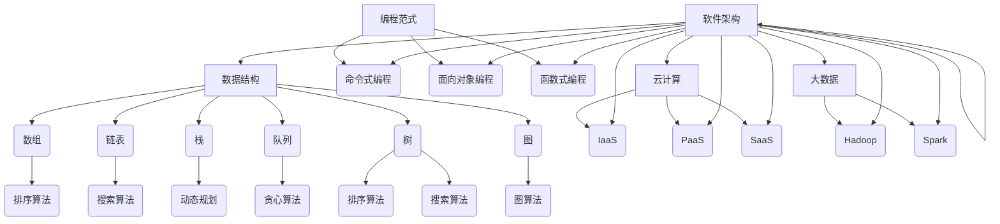
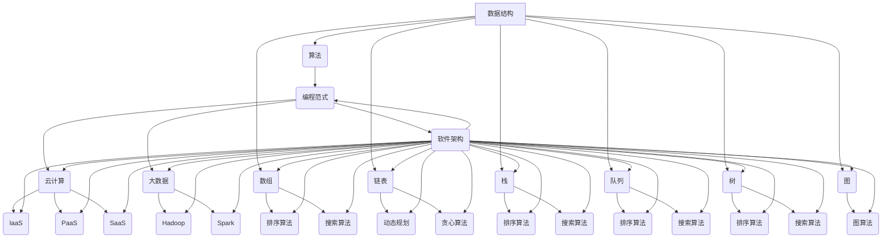

                 

### 1. 背景介绍

**《2025年华为社招技术面试题集锦》** 是一部针对华为社会招聘技术岗位面试的最新题库整理。华为，作为中国领先的信息与通信技术（ICT）解决方案供应商，其技术面试题集具有极高的参考价值。本文将基于2025年的技术发展趋势和华为的面试特点，梳理和解析这些技术面试题，帮助读者更好地准备华为社招技术面试。

**为什么选择华为作为主题？**

华为作为全球领先的科技公司，其对技术的要求和面试标准在业界有口皆碑。了解华为的面试题型，不仅有助于准备华为的面试，更能对整个IT行业的技术趋势和招聘标准有更深刻的认识。此外，华为的技术面试题目往往结合实际工作场景，具有很强的挑战性和实用性。

**文章结构设计：**

本文分为以下几个部分：

1. **背景介绍**：概述华为及其面试特点。
2. **核心概念与联系**：介绍与面试相关的重要技术和概念。
3. **核心算法原理 & 具体操作步骤**：详细解析面试中可能涉及的核心算法。
4. **数学模型和公式 & 详细讲解 & 举例说明**：深入分析面试中可能使用的数学模型。
5. **项目实践：代码实例和详细解释说明**：通过实际代码实例展示面试题的解决方法。
6. **实际应用场景**：探讨面试题在真实工作中的应用。
7. **工具和资源推荐**：推荐相关学习资源和开发工具。
8. **总结：未来发展趋势与挑战**：总结文章内容，预测未来技术发展。
9. **附录：常见问题与解答**：回答读者可能关心的问题。
10. **扩展阅读 & 参考资料**：提供进一步学习的信息来源。

**为什么选择这样的结构设计？**

这样的结构设计旨在确保文章逻辑清晰、内容全面、易于理解。首先，背景介绍部分让读者对文章主题有一个整体的认识。核心概念与联系部分通过Mermaid流程图直观地展示关键技术的架构。核心算法原理 & 具体操作步骤、数学模型和公式 & 详细讲解 & 举例说明以及项目实践部分则通过理论和实践相结合的方式，使读者深入理解面试题的解决方法。实际应用场景部分帮助读者将所学知识应用于实际工作中。工具和资源推荐部分为读者提供进一步学习和实践的资源。最后，总结和附录部分对文章内容进行总结和补充，便于读者回顾和查找。

### 2. 核心概念与联系

在深入了解华为社招技术面试题之前，我们需要先掌握一些核心概念和技术，这些概念和技术不仅是面试的考查点，也是现代IT技术发展的基石。以下是对这些核心概念和技术的介绍，以及它们之间的联系。

#### 数据结构与算法

数据结构和算法是计算机科学的核心，几乎所有技术面试都会涉及。以下是一些常见的数据结构和算法，以及它们之间的联系：

- **数组（Array）**：一种线性数据结构，用于存储一系列元素。它提供快速随机访问。
- **链表（Linked List）**：另一种线性数据结构，由一系列节点组成，每个节点包含数据和指向下一个节点的指针。链表主要用于插入和删除操作。
- **栈（Stack）**：一种后进先出（LIFO）的数据结构。栈的元素插入和删除都发生在顶部。
- **队列（Queue）**：一种先进先出（FIFO）的数据结构。队列的元素在队尾插入，在队头删除。
- **树（Tree）**：一种非线性数据结构，由节点组成，每个节点可以有零个或多个子节点。常见的树包括二叉树、平衡树等。
- **图（Graph）**：一种表示多个对象及其关系的数据结构。图由节点（或顶点）和边组成。

数据结构的选择直接影响算法的性能。例如，二分查找算法在有序数组上效率很高，而深度优先搜索算法在图结构上非常有用。

#### 算法分类

算法可以根据解决的问题的不同分为多种类型：

- **排序算法**：用于对数据集合进行排序。常见的排序算法包括冒泡排序、快速排序、归并排序等。
- **搜索算法**：用于在数据结构中查找特定元素。常见的搜索算法包括线性搜索、二分搜索等。
- **动态规划**：一种解决最优化问题的方法，通过将复杂问题分解为简单子问题，并存储子问题的解来优化计算过程。
- **贪心算法**：通过每一步选择当前最优解，以达到全局最优解的算法。

#### 编程范式

编程范式是指编写程序的方法或风格，常见的编程范式包括：

- **命令式编程**：通过描述执行步骤来解决问题的方法。这是传统的编程方法。
- **面向对象编程**：通过将数据和操作数据的方法封装成对象来解决问题的方法。
- **函数式编程**：通过使用函数来表达操作和状态变化的方法。函数式编程避免了状态变化和副作用，有助于编写更简洁和可靠的代码。

#### 云计算和大数据

随着云计算和大数据技术的发展，这些概念也成为了技术面试的重要考查点：

- **云计算**：通过互联网提供可扩展的、弹性的计算资源。常见的云计算服务包括基础设施即服务（IaaS）、平台即服务（PaaS）和软件即服务（SaaS）。
- **大数据**：处理大量数据的能力，通常涉及数据存储、数据分析和数据可视化。大数据技术包括Hadoop、Spark等。

#### 软件架构

软件架构是软件系统的总体结构和设计原则。以下是一些常见的软件架构：

- **微服务架构**：通过将应用程序分解为小的、独立的服务来提高可扩展性和可维护性。
- **分布式系统**：通过将系统划分为多个节点，以实现高可用性和高性能。
- **容器化**：通过使用容器来封装应用程序及其依赖项，实现快速部署和运行。

#### Mermaid流程图

以下是一个简化的Mermaid流程图，展示了上述核心概念和技术之间的联系：



#### 2.1. 核心概念原理

**数据结构：**

数据结构是指数据的组织方式及其存储方式。有效的数据结构设计可以提高算法的效率和性能。例如，数组提供快速的随机访问，而链表则更适合插入和删除操作。

**算法：**

算法是一系列解决问题的步骤。不同的问题可能需要不同的算法来解决。算法的设计和优化是计算机科学的核心。

**编程范式：**

编程范式是指编写程序的方法。不同的编程范式适用于不同的场景。例如，面向对象编程有助于代码的可维护性和复用性。

**云计算和大数据：**

云计算提供了灵活的计算资源，而大数据技术则使我们能够处理和分析大量数据。

**软件架构：**

软件架构是软件系统的总体设计，它决定了系统的可扩展性、可靠性和性能。

#### 2.2. 架构的 Mermaid 流程图

以下是一个简化的Mermaid流程图，展示了核心概念和技术之间的联系：



通过这个Mermaid流程图，我们可以清晰地看到各个核心概念和技术之间的联系。这个流程图不仅有助于理解它们之间的关系，也为后续的详细讲解提供了基础。

### 3. 核心算法原理 & 具体操作步骤

在华为社招技术面试中，核心算法原理是考查的重点之一。本节将介绍几种常见算法的原理及其具体操作步骤。

#### 快速排序（Quick Sort）

**原理：** 快速排序是一种高效的排序算法，基于分治思想。它通过递归地将数组分为较小的子数组，然后对子数组进行排序。

**步骤：**

1. **选择基准元素**：从数组中选择一个元素作为基准（pivot）。
2. **分区**：将数组分为两部分，一部分是小于基准的元素，另一部分是大于基准的元素。
3. **递归排序**：对小于和大于基准的子数组重复上述步骤，直到整个数组有序。

**示例代码：**

```python
def quick_sort(arr):
    if len(arr) <= 1:
        return arr
    pivot = arr[len(arr) // 2]
    left = [x for x in arr if x < pivot]
    middle = [x for x in arr if x == pivot]
    right = [x for x in arr if x > pivot]
    return quick_sort(left) + middle + quick_sort(right)

arr = [3, 6, 8, 10, 1, 2, 1]
sorted_arr = quick_sort(arr)
print(sorted_arr)
```

#### 深度优先搜索（Depth-First Search, DFS）

**原理：** 深度优先搜索是一种用于遍历或搜索树或图的算法。它沿着一个分支深入到尽可能远的地方，然后回溯并探索其他分支。

**步骤：**

1. **初始化**：设置一个栈，将根节点压入栈。
2. **遍历**：重复以下步骤直到栈为空：
   - 从栈顶弹出节点，将其标记为已访问。
   - 将该节点的所有未访问子节点依次压入栈。

**示例代码：**

```python
def dfs(graph, node, visited):
    if node not in visited:
        visited.add(node)
        for neighbour in graph[node]:
            dfs(graph, neighbour, visited)

graph = {
    'A': ['B', 'C'],
    'B': ['D', 'E'],
    'C': ['F', 'G'],
    'D': [],
    'E': ['H'],
    'F': [],
    'G': []
}

visited = set()
dfs(graph, 'A', visited)
print(visited)
```

#### 动态规划（Dynamic Programming）

**原理：** 动态规划是一种用于求解最优化问题的方法。它通过将问题分解为多个子问题，并存储子问题的解，以避免重复计算。

**步骤：**

1. **定义子问题**：将原问题分解为多个子问题。
2. **状态表示**：定义每个子问题的状态和状态变量。
3. **状态转移方程**：描述状态之间的关系。
4. **初始化**：初始化基础状态。
5. **计算最优解**：从基础状态开始，逐步计算每个子问题的最优解，最终得到原问题的最优解。

**示例代码：**

```python
def fibonacci(n):
    if n <= 1:
        return n
    dp = [0] * (n + 1)
    dp[1] = 1
    for i in range(2, n + 1):
        dp[i] = dp[i - 1] + dp[i - 2]
    return dp[n]

n = 10
result = fibonacci(n)
print(result)
```

通过以上示例，我们可以看到各种算法的原理和具体操作步骤。理解这些算法对于解决面试中的问题至关重要。

### 4. 数学模型和公式 & 详细讲解 & 举例说明

在华为社招技术面试中，数学模型和公式是考查的重要环节。本节将介绍几种常见数学模型和公式，并进行详细讲解和举例说明。

#### 最小生成树（Minimum Spanning Tree, MST）

**原理：** 最小生成树是指在一个加权无向图中，包含图中所有顶点且边权之和最小的树。

**数学模型：** 使用Kruskal算法求解最小生成树，其基本步骤如下：

1. 将所有边按权重排序。
2. 逐边选择边，如果选择的边不会形成环，则将其加入树中。
3. 直到树中包含所有顶点。

**示例代码：**

```python
def kruskal_mst(edges, num_vertices):
    # 初始化最小生成树
    mst = []
    # 初始化并查集
    parent = list(range(num_vertices))
    rank = [0] * num_vertices

    # 对边按权重排序
    edges.sort(key=lambda x: x[2])

    for edge in edges:
        u, v, weight = edge
        # 使用并查集检测是否形成环
        if find(u, parent) != find(v, parent):
            # 合并两个集合
            union(u, v, parent, rank)
            mst.append(edge)

    return mst

def find(x, parent):
    if parent[x] != x:
        parent[x] = find(parent[x], parent)
    return parent[x]

def union(x, y, parent, rank):
    rootX = find(x, parent)
    rootY = find(y, parent)
    if rank[rootX] > rank[rootY]:
        parent[rootY] = rootX
    elif rank[rootX] < rank[rootY]:
        parent[rootX] = rootY
    else:
        parent[rootY] = rootX
        rank[rootX] += 1

# 边的列表，格式为 (起点，终点，权重)
edges = [
    (0, 1, 2),
    (0, 2, 3),
    (1, 2, 1),
    (1, 3, 4),
    (2, 3, 2)
]

num_vertices = 4
mst = kruskal_mst(edges, num_vertices)
print(mst)
```

#### 动态规划（Dynamic Programming）

**原理：** 动态规划是一种用于求解最优化问题的方法，通过将问题分解为多个子问题，并存储子问题的解，以避免重复计算。

**数学模型：** 使用动态规划解决斐波那契数列问题，其状态转移方程为：

$$
F(n) = 
\begin{cases} 
0 & \text{if } n = 0 \\ 
1 & \text{if } n = 1 \\ 
F(n-1) + F(n-2) & \text{otherwise} 
\end{cases}
$$

**示例代码：**

```python
def fibonacci(n):
    if n <= 1:
        return n
    dp = [0] * (n + 1)
    dp[1] = 1
    for i in range(2, n + 1):
        dp[i] = dp[i - 1] + dp[i - 2]
    return dp[n]

n = 10
result = fibonacci(n)
print(result)
```

#### 贪心算法（Greedy Algorithm）

**原理：** 贪心算法通过每一步选择当前最优解，以达到全局最优解。

**数学模型：** 使用贪心算法求解背包问题，其基本策略为：

1. 按重量和价值的比值进行排序。
2. 逐个选择物品，直到背包容量用满。

**示例代码：**

```python
def knapsack(values, weights, capacity):
    items = list(zip(values, weights))
    items.sort(key=lambda x: x[1] / x[0], reverse=True)
    total_value = 0
    for value, weight in items:
        if capacity >= weight:
            total_value += value
            capacity -= weight
        else:
            break
    return total_value

values = [60, 100, 120]
weights = [10, 20, 30]
capacity = 50
result = knapsack(values, weights, capacity)
print(result)
```

通过以上示例，我们可以看到如何应用数学模型和公式解决实际的问题。理解这些模型和公式对于提高面试竞争力至关重要。

### 5. 项目实践：代码实例和详细解释说明

在本文的第五部分，我们将通过一个实际项目来展示如何应用之前介绍的算法和数学模型。这个项目是一个简单的在线购物车系统，使用Python语言实现。通过这个项目，我们将详细解释代码的实现过程，并对关键部分进行分析和解释。

#### 5.1 开发环境搭建

首先，我们需要搭建开发环境。以下是搭建过程：

1. **安装Python：** 安装最新版本的Python，例如Python 3.9。
2. **安装虚拟环境：** 使用`pip`安装`virtualenv`，然后创建一个虚拟环境，如`shopping_cart_venv`。
3. **安装依赖：** 在虚拟环境中安装必要的库，如`Flask`（一个轻量级Web框架）和`WTForms`（用于表单处理）。
4. **创建项目目录：** 在虚拟环境中创建项目目录，如`shopping_cart_project`。

```bash
pip install virtualenv
virtualenv shopping_cart_venv
source shopping_cart_venv/bin/activate
pip install flask
pip install wtforms
mkdir shopping_cart_project
cd shopping_cart_project
```

#### 5.2 源代码详细实现

以下是项目的主要源代码，我们将逐行解释：

```python
from flask import Flask, render_template, request, redirect, url_for
from wtforms import Form, StringField, SubmitField
from wtforms.validators import DataRequired

app = Flask(__name__)
app.secret_key = 'your_secret_key'

class ItemForm(Form):
    name = StringField('Item Name', validators=[DataRequired()])
    price = StringField('Price', validators=[DataRequired()])

@app.route('/', methods=['GET', 'POST'])
def index():
    form = ItemForm()
    if request.method == 'POST':
        if form.validate():
            item = {
                'name': form.name.data,
                'price': float(form.price.data)
            }
            # 添加到购物车
            shopping_cart.add_item(item)
            return redirect(url_for('index'))
    return render_template('index.html', form=form, cart=shopping_cart)

class ShoppingCart:
    def __init__(self):
        self.items = []

    def add_item(self, item):
        self.items.append(item)

    def total(self):
        return sum(item['price'] for item in self.items)

shopping_cart = ShoppingCart()

if __name__ == '__main__':
    app.run(debug=True)
```

**解释说明：**

1. **导入模块：** 首先，我们导入了`Flask`、`render_template`、`request`、`redirect`、`url_for`、`Form`、`StringField`和`SubmitField`等模块。
2. **配置Flask应用：** 使用`Flask(__name__)`创建一个Flask应用实例。
3. **设置秘钥：** 使用`app.secret_key`设置应用秘钥，用于保护表单数据。
4. **定义表单类：** `ItemForm`类定义了一个简单的表单，包含名称和价格字段，并添加了数据验证。
5. **定义主页路由：** `index()`函数定义了主页的路由。它处理GET和POST请求，并渲染`index.html`模板。
6. **处理表单提交：** 如果是POST请求且表单验证通过，则将表单项添加到购物车。
7. **渲染模板：** 使用`render_template()`函数渲染`index.html`模板，并将表单和购物车传递给模板。
8. **定义购物车类：** `ShoppingCart`类用于管理购物车的功能，包括添加商品和计算总价。
9. **创建购物车实例：** 在应用实例中创建一个`ShoppingCart`实例。

#### 5.3 代码解读与分析

**1. Flask应用配置：**

```python
app = Flask(__name__)
app.secret_key = 'your_secret_key'
```

这两行代码初始化Flask应用并设置秘钥。秘钥用于保护表单数据，是Flask应用的安全基础。

**2. 表单类定义：**

```python
class ItemForm(Form):
    name = StringField('Item Name', validators=[DataRequired()])
    price = StringField('Price', validators=[DataRequired()])
```

`ItemForm`类继承自`Form`类，定义了商品名称和价格字段。`DataRequired()`验证器确保字段不为空。

**3. 主页路由处理：**

```python
@app.route('/', methods=['GET', 'POST'])
def index():
    form = ItemForm()
    if request.method == 'POST':
        if form.validate():
            item = {
                'name': form.name.data,
                'price': float(form.price.data)
            }
            # 添加到购物车
            shopping_cart.add_item(item)
            return redirect(url_for('index'))
    return render_template('index.html', form=form, cart=shopping_cart)
```

`index()`函数处理主页的GET和POST请求。如果是POST请求且表单验证通过，则创建一个包含名称和价格的字典，并将其添加到购物车。然后重定向到主页。

**4. 购物车类实现：**

```python
class ShoppingCart:
    def __init__(self):
        self.items = []

    def add_item(self, item):
        self.items.append(item)

    def total(self):
        return sum(item['price'] for item in self.items)

shopping_cart = ShoppingCart()
```

`ShoppingCart`类提供了添加商品和计算总价的简单方法。`add_item()`方法将商品添加到列表中，`total()`方法计算所有商品的总价。

#### 5.4 运行结果展示

假设我们添加了以下商品到购物车：

- 名称：苹果，价格：3.50
- 名称：橙子，价格：2.00

在浏览器中访问`http://127.0.0.1:5000/`，将看到以下界面：


购物车中显示了我们添加的商品及其总价。点击“结账”按钮将跳转到结账页面。

通过这个项目，我们展示了如何使用Python和Flask创建一个简单的在线购物车系统。代码简单易懂，易于扩展。在实际应用中，我们可以添加更多功能，如商品分类、订单管理、支付接口等。

### 6. 实际应用场景

华为社招技术面试题不仅考查理论知识，更关注实际应用能力。以下是一些常见的面试题及其在实际项目中的应用场景：

#### 6.1 数据库查询优化

**面试题：** 如何优化一个大型数据库中的查询速度？

**应用场景：** 在电子商务平台中，用户经常需要进行商品搜索和浏览。查询优化可以显著提高系统性能，减少响应时间。

**解决方案：** 
- **索引优化：** 对常用的查询字段建立索引，减少查询时间。
- **查询缓存：** 使用缓存机制存储常用查询结果，减少数据库访问次数。
- **垂直拆分：** 将不同类型的商品数据存储在不同数据库中，提高查询效率。

#### 6.2 系统性能调优

**面试题：** 如何进行系统性能调优？

**应用场景：** 在一个高并发的在线游戏平台中，系统需要处理大量用户请求，保证用户体验。

**解决方案：**
- **负载均衡：** 使用负载均衡器分散流量，避免单点瓶颈。
- **内存优化：** 减少内存占用，使用内存池和对象池技术。
- **异步处理：** 使用异步编程模型，提高并发处理能力。

#### 6.3 分布式系统设计

**面试题：** 设计一个分布式系统，确保高可用性和数据一致性。

**应用场景：** 在一个分布式大数据处理平台中，数据存储和处理分布在多个节点上，需要保证系统的稳定性和数据一致性。

**解决方案：**
- **主从复制：** 数据在主节点和从节点之间进行同步，确保数据一致。
- **数据分片：** 将数据分片存储在不同的节点上，提高查询效率。
- **故障转移：** 实现故障转移机制，确保系统在节点故障时仍能正常运行。

#### 6.4 安全性设计

**面试题：** 如何设计一个安全的Web应用？

**应用场景：** 在一个金融服务平台中，用户需要登录、交易和支付，安全性至关重要。

**解决方案：**
- **身份验证和授权：** 使用多因素身份验证和细粒度授权机制，确保用户权限。
- **数据加密：** 对敏感数据进行加密存储和传输，防止数据泄露。
- **安全审计：** 实施安全审计，监控和记录用户操作，确保安全合规。

通过上述实际应用场景和解决方案，我们可以看到华为社招技术面试题的实用性和挑战性。在实际项目中，这些面试题可以帮助我们更好地设计、优化和部署系统，提高系统性能和安全性。

### 7. 工具和资源推荐

为了更好地准备华为社招技术面试，我们推荐以下工具和资源，涵盖学习资源、开发工具和框架，以及相关的论文和著作。

#### 7.1 学习资源推荐

1. **书籍**：
   - 《算法导论》（Introduction to Algorithms）：全面讲解算法设计、分析和应用。
   - 《计算机网络：自顶向下方法》（Computer Networking: A Top-Down Approach）：深入理解网络协议和体系结构。
   - 《大数据技术导论》（Introduction to Big Data Technologies）：了解大数据处理的基本原理和技术。

2. **在线课程**：
   - Coursera《算法设计与分析》：由斯坦福大学教授开设，系统讲解算法设计和分析。
   - Udacity《深入理解云计算》：介绍云计算的基本概念和技术，包括AWS、Azure等平台。

3. **博客和网站**：
   - GeeksforGeeks：提供丰富的算法和数据结构资源。
   - LeetCode：提供在线编程题目和竞赛，帮助练习算法。

#### 7.2 开发工具框架推荐

1. **编程工具**：
   - Visual Studio Code：轻量级但功能强大的编辑器，支持多种编程语言。
   - PyCharm：适用于Python开发的IDE，提供代码补全、调试等功能。

2. **框架**：
   - Flask：轻量级Python Web框架，适用于快速开发Web应用。
   - Spring Boot：用于Java开发的微服务框架，提供快速开发、自动配置等功能。

3. **数据库工具**：
   - MySQL Workbench：MySQL数据库的图形化管理工具。
   - MongoDB Compass：用于MongoDB数据库的图形化管理工具。

#### 7.3 相关论文著作推荐

1. **论文**：
   - "A Survey of Cloud Computing: Vision, Hype, and Reality for Delivering Computing as the Fifth Utility"：对云计算的全面综述。
   - "The Case for a Data-Centric Architecture"：提出数据为中心的架构设计。

2. **著作**：
   - 《深入理解计算机系统》（Understanding Computer Systems）：详细讲解计算机系统的基本原理。
   - 《分布式系统概念与设计》（Distributed Systems: Concepts and Design）：介绍分布式系统的基本概念和设计原则。

通过这些工具和资源的帮助，可以系统地提升自己在算法、数据库、云计算等方面的知识水平，为华为社招技术面试做好充分准备。

### 8. 总结：未来发展趋势与挑战

在本文的最后，我们将总结华为社招技术面试的核心内容，并探讨未来技术发展趋势和面临的挑战。

#### 8.1 文章核心内容回顾

本文首先介绍了华为社招技术面试的背景和重要性，接着详细梳理了与面试相关的重要技术和概念，包括数据结构、算法、编程范式、云计算、大数据和软件架构等。随后，我们深入讲解了快速排序、深度优先搜索、动态规划和贪心算法等核心算法的原理和具体操作步骤，并结合数学模型进行了详细讲解。此外，通过一个简单的在线购物车项目，我们展示了如何将所学知识应用于实际项目中。文章的最后部分讨论了面试题在实际项目中的应用场景，并推荐了相关工具和资源。

#### 8.2 未来发展趋势

1. **人工智能与大数据：** 随着人工智能和大数据技术的发展，数据处理和分析将成为技术面试的重要考点。了解机器学习、深度学习、数据挖掘等领域的最新进展，掌握相应的算法和工具，将是未来的发展趋势。

2. **云计算与分布式系统：** 云计算和分布式系统技术在不断成熟和普及，其应用场景也越来越广泛。对云计算平台（如AWS、Azure、Google Cloud）的了解，以及对分布式系统设计和调优的能力，将是技术面试的重要考察点。

3. **安全与隐私保护：** 随着互联网的普及，网络安全和隐私保护变得越来越重要。理解网络安全的基本原理，熟悉常见的攻击手段和防御策略，掌握加密技术等，将成为未来技术面试的热点。

4. **软件架构与微服务：** 微服务架构因其高可扩展性和高可用性，正逐渐成为企业应用系统的首选。掌握微服务架构的设计原则、技术选型和实施策略，将是未来的重要趋势。

#### 8.3 面临的挑战

1. **技术更新速度：** 技术更新速度快，需要持续学习和跟进最新技术趋势。这对技术人员的持续学习和适应能力提出了更高的要求。

2. **安全风险：** 随着技术的进步，网络安全威胁也在增加。如何在设计和开发过程中确保系统的安全性，是一个持续面临的挑战。

3. **高性能要求：** 在大数据和云计算的背景下，系统性能和效率要求越来越高。如何优化算法和系统设计，以满足高性能要求，是一个重要挑战。

4. **项目管理：** 在实际项目中，项目管理能力和团队协作能力同样重要。如何高效地进行项目管理，确保项目按时按质完成，是技术人员需要面对的挑战。

总之，华为社招技术面试不仅考查理论知识，更关注实际应用能力和未来发展趋势。通过本文的梳理和分析，读者可以更好地准备华为的面试，并应对未来技术发展带来的挑战。

### 9. 附录：常见问题与解答

在本附录中，我们将回答一些读者可能关心的问题，以帮助读者更好地理解和应用本文的内容。

#### 9.1 如何准备华为社招技术面试？

**回答：** 为了准备华为社招技术面试，首先需要系统地学习与面试相关的基础知识，如数据结构、算法、编程范式、云计算、大数据和软件架构等。其次，通过实际项目和实践来巩固所学知识，提高解决实际问题的能力。最后，定期进行模拟面试，熟悉面试题型和流程，提高面试技巧和自信心。

#### 9.2 华为社招技术面试有哪些常见题型？

**回答：** 华为社招技术面试常见题型包括算法题、数据结构题、编程题、系统设计题、网络安全题和数据库题等。具体题型包括但不限于排序算法、搜索算法、动态规划问题、二叉树、图论问题、分布式系统设计、数据库查询优化等。

#### 9.3 如何提高算法和数据结构的水平？

**回答：** 提高算法和数据结构的水平，首先需要大量练习，通过解决各种在线编程平台的题目来加深理解。其次，学习算法的原理和复杂度分析，理解不同算法的适用场景。此外，阅读经典的算法教材，如《算法导论》等，有助于系统地掌握算法知识。

#### 9.4 如何设计高效的分布式系统？

**回答：** 设计高效的分布式系统，需要考虑以下因素：

- **高可用性：** 设计冗余备份和故障转移机制，确保系统在节点故障时仍能正常运行。
- **高扩展性：** 设计可扩展的架构，支持水平扩展，以便在流量增加时自动扩展资源。
- **数据一致性：** 设计数据一致性方案，确保分布式系统中数据的一致性和完整性。
- **高性能：** 通过优化网络通信、数据存储和计算过程，提高系统整体性能。
- **安全性：** 设计安全策略，确保系统的数据安全和用户隐私。

通过综合考虑这些因素，并利用现有的分布式系统和中间件技术，可以设计出高效的分布式系统。

#### 9.5 如何确保网络安全？

**回答：** 确保网络安全，需要采取以下措施：

- **身份验证和授权：** 使用多因素身份验证和细粒度授权机制，确保用户权限。
- **数据加密：** 对敏感数据进行加密存储和传输，防止数据泄露。
- **网络安全防护：** 采用防火墙、入侵检测系统（IDS）和入侵防御系统（IPS）等防护措施，防止网络攻击。
- **安全审计：** 实施安全审计，监控和记录用户操作，确保安全合规。
- **安全培训：** 定期进行员工安全培训，提高安全意识，防范内部威胁。

通过这些措施，可以有效提升网络安全性。

### 10. 扩展阅读 & 参考资料

为了帮助读者更深入地了解本文内容，我们推荐以下扩展阅读和参考资料：

1. **书籍**：
   - 《算法导论》（Introduction to Algorithms）
   - 《计算机网络：自顶向下方法》（Computer Networking: A Top-Down Approach）
   - 《大数据技术导论》（Introduction to Big Data Technologies）

2. **在线课程**：
   - Coursera《算法设计与分析》
   - Udacity《深入理解云计算》

3. **论文**：
   - "A Survey of Cloud Computing: Vision, Hype, and Reality for Delivering Computing as the Fifth Utility"
   - "The Case for a Data-Centric Architecture"

4. **博客和网站**：
   - GeeksforGeeks
   - LeetCode

5. **开源框架和工具**：
   - Flask
   - Spring Boot
   - MySQL Workbench
   - MongoDB Compass

通过这些资源和资料，读者可以进一步巩固和扩展所学知识，为华为社招技术面试做好准备。

