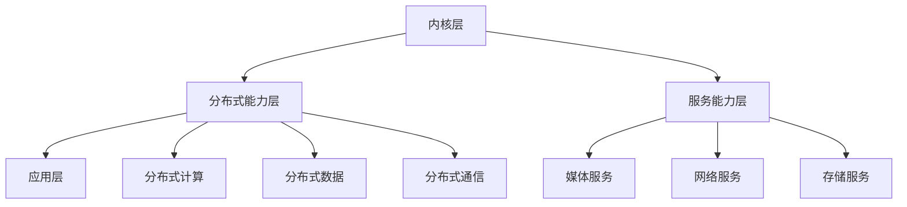

                 

### 背景介绍

随着科技的飞速发展，软件系统架构的复杂性和多样性日益增加。在这样的背景下，华为推出的鸿蒙操作系统（HarmonyOS）成为了行业内外关注的焦点。鸿蒙操作系统是一个全新的分布式操作系统，旨在构建一个全场景智慧生活的生态系统。作为华为在操作系统领域的战略布局，鸿蒙操作系统具有强大的跨平台能力、优异的兼容性以及高效能的特点。

鸿蒙生态的建立不仅为开发者提供了一个全新的开发平台，同时也为用户带来了更加流畅、智能的体验。为了推动鸿蒙生态的发展，华为每年都会举办校园招聘活动，吸引全球各地的优秀人才加入鸿蒙生态团队。本文将围绕2024年华为鸿蒙生态应用开发工程师校招面试题进行深入分析和探讨，帮助准备应聘的同学更好地应对面试挑战。

华为鸿蒙生态应用开发工程师校招面试题的考查范围广泛，涵盖了操作系统原理、软件工程、计算机体系结构、算法和数据结构等多个领域。这些面试题不仅考察应聘者对基本知识的掌握程度，更侧重于考察应聘者的编程能力、问题解决能力和创新思维。通过对这些面试题的分析和解答，我们可以更好地理解鸿蒙操作系统的工作原理，掌握应用开发的关键技能。

本文将分为以下几个部分：

1. **核心概念与联系**：介绍鸿蒙操作系统的核心概念和架构，通过Mermaid流程图展示其工作原理。
2. **核心算法原理 & 具体操作步骤**：讲解鸿蒙操作系统中的关键算法，包括分布式计算、微内核架构、服务网格等。
3. **数学模型和公式 & 详细讲解 & 举例说明**：分析鸿蒙操作系统中的数学模型，使用LaTeX格式展示相关公式，并结合实际例子进行说明。
4. **项目实践：代码实例和详细解释说明**：通过具体代码实例，展示鸿蒙生态应用的开发流程，并对代码进行详细解读和分析。
5. **实际应用场景**：探讨鸿蒙操作系统在不同领域的应用场景，分析其优势。
6. **工具和资源推荐**：推荐学习资源、开发工具和框架，帮助开发者更好地掌握鸿蒙生态应用开发。
7. **总结：未来发展趋势与挑战**：总结鸿蒙操作系统的发展现状，探讨其未来趋势和面临的挑战。

希望通过本文的深入探讨，能够为准备华为鸿蒙生态应用开发工程师校招面试的同学提供有益的参考和指导。接下来，让我们开始详细分析这些面试题，共同探索鸿蒙操作系统的魅力。### 核心概念与联系

鸿蒙操作系统（HarmonyOS）是华为推出的一个全新的分布式操作系统，其设计理念是“大分布、小内核、微服务”。这一理念使得鸿蒙能够跨平台、跨设备地运行，并实现高效的资源调度和服务管理。在鸿蒙操作系统中，核心概念和架构是其工作的基础，理解这些概念和架构对于深入掌握鸿蒙操作系统至关重要。

#### 核心概念

1. **分布式计算**：分布式计算是鸿蒙操作系统的核心技术之一。通过分布式计算，鸿蒙能够在多个设备之间高效地共享计算资源和数据，实现真正的多设备协同工作。分布式计算包括任务分发、负载均衡、故障转移等功能。
   
2. **微内核架构**：鸿蒙操作系统采用了微内核架构，这意味着其内核非常精简，只包含最基本的操作系统功能，如进程管理、内存管理、中断处理等。微内核架构使得鸿蒙操作系统具有高安全性和高可靠性。

3. **服务网格**：服务网格是鸿蒙操作系统中用于管理和协调服务之间的通信的一种机制。服务网格实现了服务的动态发现、负载均衡、故障转移等功能，为开发者提供了简单、高效的服务管理方式。

4. **智能感知**：鸿蒙操作系统具有强大的智能感知能力，能够实时感知设备状态和环境变化，并做出相应的调整。智能感知技术使得鸿蒙能够在不同的使用场景中提供最优的用户体验。

#### 架构

鸿蒙操作系统的架构设计非常独特，其核心架构包括以下几个部分：

1. **内核层**：内核层是鸿蒙操作系统的核心，负责最基本的操作系统功能，如进程管理、内存管理、文件系统等。鸿蒙内核采用了微内核架构，具有高安全性和高可靠性。

2. **分布式能力层**：分布式能力层提供了分布式计算、分布式数据、分布式通信等功能，支持多设备协同工作。这一层是鸿蒙操作系统的核心创新点之一。

3. **服务能力层**：服务能力层提供了丰富的服务组件，如媒体服务、网络服务、存储服务等，支持开发者快速构建应用。

4. **应用层**：应用层是鸿蒙操作系统中最外层的部分，包括了各种应用和服务，如浏览器、音乐播放器、邮件客户端等。应用层是开发者直接接触的部分，开发者可以通过应用层使用鸿蒙操作系统的各种功能。

#### Mermaid流程图

为了更好地展示鸿蒙操作系统的工作原理，我们可以使用Mermaid流程图来描述其核心概念和架构。以下是一个简化的Mermaid流程图示例：



这个流程图展示了鸿蒙操作系统的四个主要层次：内核层、分布式能力层、服务能力层和应用层。每个层次都包含了一系列的功能和组件，这些组件相互协作，共同实现了鸿蒙操作系统的强大功能和高效性能。

通过理解鸿蒙操作系统的核心概念和架构，我们可以更好地把握其工作原理，为后续的分析和探讨打下坚实的基础。接下来，我们将深入探讨鸿蒙操作系统中的关键算法，进一步揭示其技术内涵。### 核心算法原理 & 具体操作步骤

在鸿蒙操作系统中，分布式计算、微内核架构和服务网格是三大核心技术。这些技术不仅构成了鸿蒙操作系统的核心架构，还为开发者提供了丰富的功能和应用场景。本节将详细介绍这些核心算法的原理和具体操作步骤，帮助读者深入理解鸿蒙操作系统的技术实现。

#### 分布式计算

分布式计算是鸿蒙操作系统的核心技术之一，它使得鸿蒙能够在多个设备之间高效地共享计算资源和数据。分布式计算的核心目标是实现任务的高效分发、负载均衡和故障转移。

**1. 分布式计算原理**

分布式计算基于以下三个核心概念：

- **任务分发**：将大任务拆分为多个小任务，并分配给不同的设备处理。
- **负载均衡**：根据设备的负载情况，动态调整任务的分配，避免设备过载或闲置。
- **故障转移**：当设备出现故障时，自动将任务转移到其他健康设备上，确保任务执行的连续性。

**2. 具体操作步骤**

- **步骤1：任务分解**：将大任务拆分为多个小任务。这一步骤通常通过任务调度器（Task Scheduler）实现。
  
- **步骤2：任务分配**：根据设备负载情况，将小任务分配给不同的设备。任务调度器会综合考虑设备的CPU利用率、内存使用率等因素，进行智能分配。

- **步骤3：任务执行**：设备接收到任务后，开始执行任务。执行过程中，设备会定期向任务调度器汇报任务进展。

- **步骤4：任务同步**：当所有小任务完成时，将结果汇总并返回给原始任务发起者。这一步骤确保了分布式计算的结果一致性和正确性。

- **步骤5：故障检测与转移**：监控设备状态，一旦发现设备故障，任务调度器会自动将任务转移到其他健康设备。

**3. 示例**

假设一个图像处理任务需要在多台设备上并行处理。任务分解后，每个设备负责处理图像的一部分。任务调度器负责分配任务和监控进度，确保最终处理结果准确无误。

#### 微内核架构

微内核架构是鸿蒙操作系统的另一大核心技术，其设计目标是实现高安全性和高可靠性。微内核架构通过将内核功能模块化，只保留最基本的功能，从而降低系统的复杂度和风险。

**1. 微内核架构原理**

微内核架构的核心思想是将操作系统的核心功能（如进程管理、内存管理、中断处理等）模块化，并运行在用户空间。这样，内核模块可以独立运行和更新，而不会影响整个系统的稳定性。

**2. 具体操作步骤**

- **步骤1：内核初始化**：系统启动时，初始化微内核，加载必要的内核模块。

- **步骤2：进程创建与销毁**：用户空间的应用程序通过系统调用请求创建或销毁进程。微内核负责进程的调度和管理。

- **步骤3：内存分配与管理**：微内核提供内存分配与管理功能，确保进程的内存需求得到满足。

- **步骤4：中断处理**：微内核处理各种中断请求，如硬件设备中断、软件中断等。

- **步骤5：安全性控制**：微内核实现访问控制、权限管理等功能，确保系统的安全性。

**3. 示例**

在一个微内核架构的系统中，操作系统内核只负责最基本的系统功能，如进程管理和内存管理。而其他功能（如文件系统、网络通信等）则由用户空间的进程实现。这样，内核模块的更新和升级不会影响系统的正常运行，提高了系统的稳定性和安全性。

#### 服务网格

服务网格是鸿蒙操作系统提供的一种用于管理和协调服务之间通信的机制。服务网格实现了服务的动态发现、负载均衡和故障转移等功能，为开发者提供了简单、高效的服务管理方式。

**1. 服务网格原理**

服务网格基于以下核心概念：

- **服务动态发现**：服务网格通过服务注册与发现机制，确保服务之间的通信畅通。
- **负载均衡**：服务网格根据服务器的负载情况，动态调整请求的分配，避免服务器过载或闲置。
- **故障转移**：当服务出现故障时，服务网格自动将请求转移到其他健康的服务实例。

**2. 具体操作步骤**

- **步骤1：服务注册**：服务启动时，向服务网格注册自己的信息，如服务名、IP地址、端口号等。

- **步骤2：服务发现**：服务消费者通过服务网格查询可用的服务实例，并获取服务实例的详细信息。

- **步骤3：请求路由**：服务网格根据负载均衡策略，将请求路由到合适的服务实例。

- **步骤4：服务调用**：服务消费者与服务实例进行通信，执行业务逻辑。

- **步骤5：故障检测与转移**：服务网格监控服务实例的健康状态，一旦发现故障，自动将请求转移到其他健康实例。

**3. 示例**

在一个典型的服务网格应用场景中，假设有两个服务：服务A和服务B。服务A提供用户认证功能，服务B提供订单处理功能。服务A通过服务网格动态发现服务B的实例，并在需要时调用服务B进行订单处理。服务网格根据负载情况，动态调整请求的分配，确保系统的高可用性和高性能。

通过详细探讨分布式计算、微内核架构和服务网格这三个核心算法的原理和具体操作步骤，我们可以看到鸿蒙操作系统在技术实现上的独特优势。这些核心算法不仅提升了鸿蒙操作系统的性能和可靠性，还为开发者提供了强大的功能和灵活性。接下来，我们将进一步探讨鸿蒙操作系统中的数学模型和公式，深入揭示其技术内涵。### 数学模型和公式 & 详细讲解 & 举例说明

在鸿蒙操作系统的核心算法中，分布式计算、微内核架构和服务网格都涉及到了复杂的数学模型和公式。这些数学模型和公式不仅为算法的实现提供了理论基础，还帮助我们更好地理解和优化算法的性能。本节将详细讲解这些数学模型和公式，并结合实际例子进行说明。

#### 分布式计算中的数学模型

分布式计算中的数学模型主要涉及任务分配、负载均衡和故障转移等方面。以下是一些关键的数学模型和公式：

**1. 任务分配模型**

任务分配模型通常使用贪心算法来实现。假设有 \(N\) 个任务，每个任务需要执行的时间为 \(t_i\)，有 \(M\) 个设备可供分配。任务分配的目标是使得每个设备的总执行时间最小。

- **目标函数**：最小化总执行时间 \(T = \sum_{i=1}^{N} t_i\)

- **贪心算法**：每次分配任务时，选择剩余任务中最小的时间分配给设备。

  **公式**：\(T_{next} = \min(t_i)\)

  **算法步骤**：
  - 初始化总执行时间 \(T = 0\)
  - 对于每个任务 \(i\)：
    - 如果 \(T + t_i \leq C\)（\(C\) 为设备的最大执行容量），将任务 \(i\) 分配给当前设备。
    - 否则，选择下一个最小执行时间的任务，分配给新设备。

**2. 负载均衡模型**

负载均衡模型主要使用基于轮询或随机策略的负载均衡算法。假设有 \(N\) 个设备，每个设备的当前负载为 \(L_i\)，总负载为 \(L\)。

- **目标函数**：最小化总负载 \(L = \sum_{i=1}^{N} L_i\)

- **轮询算法**：每次选择下一个设备进行任务分配。

  **公式**：\(next\_device = (current\_device + 1) \mod N\)

- **随机算法**：每次随机选择一个设备进行任务分配。

  **公式**：\(next\_device = random(N)\)

**3. 故障转移模型**

故障转移模型主要涉及任务的重分配和故障检测。假设有 \(N\) 个设备，每个设备的健康状况用 \(H_i\) 表示（\(H_i = 1\) 表示健康，\(H_i = 0\) 表示故障）。

- **目标函数**：最大化系统的可用性 \(A = \sum_{i=1}^{N} H_i\)

- **故障检测**：定期检测设备健康状况。

  **公式**：\(H_i = health\_check(device_i)\)

- **故障转移**：一旦检测到设备故障，将任务重新分配给其他健康设备。

  **算法步骤**：
  - 对于每个设备 \(i\)：
    - 如果 \(H_i = 0\)，将设备 \(i\) 的任务分配给其他健康设备。

**举例说明**：

假设有三个任务 \(T_1, T_2, T_3\)，需要分配到三个设备 \(D_1, D_2, D_3\) 上。任务执行时间分别为 \(T_1 = 5, T_2 = 3, T_3 = 7\)，设备的最大执行容量 \(C = 10\)。

- **任务分配**：
  - 第一次分配：选择最小执行时间的任务 \(T_2\) 分配给 \(D_1\)。
  - 第二次分配：剩余任务 \(T_1, T_3\)，选择最小执行时间的任务 \(T_1\) 分配给 \(D_2\)。
  - 第三次分配：剩余任务 \(T_3\)，分配给 \(D_3\)。

- **负载均衡**：
  - 初始负载：\(L_1 = L_2 = L_3 = 0\)
  - 任务分配后：\(L_1 = 3, L_2 = 5, L_3 = 7\)
  - 轮询算法：下一次分配给 \(D_2\)。
  - 随机算法：下一次分配给 \(D_1\) 或 \(D_3\)。

- **故障转移**：
  - 假设 \(D_2\) 故障，健康状态 \(H_2 = 0\)。
  - 将 \(D_2\) 的任务 \(T_2\) 分配给 \(D_1\) 或 \(D_3\)。

#### 微内核架构中的数学模型

微内核架构中的数学模型主要涉及进程调度和内存分配。以下是一些关键的数学模型和公式：

**1. 进程调度模型**

进程调度模型主要使用基于优先级或轮转算法的调度策略。假设有 \(N\) 个进程，每个进程的优先级为 \(P_i\) 或时间片为 \(T_i\)。

- **优先级调度**：
  - **目标函数**：最大化高优先级进程的执行机会。
  - **算法步骤**：
    - 初始化进程优先级队列。
    - 每次执行最高优先级的进程。

- **轮转调度**：
  - **目标函数**：最大化进程的平均响应时间。
  - **算法步骤**：
    - 初始化进程轮转队列。
    - 为每个进程分配固定的时间片 \(T\)。
    - 每次执行时间片到达的进程。

**2. 内存分配模型**

内存分配模型主要使用基于分页或分段机制的内存管理策略。假设有 \(M\) 个内存页面或段，每个页面或段的容量为 \(P\)。

- **分页机制**：
  - **目标函数**：最大化内存的利用率和访问速度。
  - **算法步骤**：
    - 初始化内存页表。
    - 为每个进程分配内存页面。

- **分段机制**：
  - **目标函数**：最大化内存的利用率和保护性。
  - **算法步骤**：
    - 初始化内存段表。
    - 为每个进程分配内存段。

**举例说明**：

假设有三个进程 \(P_1, P_2, P_3\)，每个进程的优先级分别为 \(P_1 = 5, P_2 = 3, P_3 = 7\)。

- **优先级调度**：
  - 初始化优先级队列：\([P_3, P_2, P_1]\)
  - 第一次执行 \(P_3\)。
  - 第二次执行 \(P_2\)。
  - 第三次执行 \(P_1\)。

- **轮转调度**：
  - 初始化轮转队列：\([P_1, P_2, P_3]\)
  - 第一次执行 \(P_1\)，时间片 \(T = 2\)。
  - 第二次执行 \(P_2\)，时间片 \(T = 2\)。
  - 第三次执行 \(P_3\)，时间片 \(T = 2\)。

#### 服务网格中的数学模型

服务网格中的数学模型主要涉及服务发现、负载均衡和故障转移等方面。以下是一些关键的数学模型和公式：

**1. 服务发现模型**

服务发现模型主要使用基于一致性哈希或服务注册表的策略。假设有 \(N\) 个服务实例，每个服务实例的哈希值为 \(H_i\)。

- **一致性哈希**：
  - **目标函数**：最小化服务实例的访问延迟。
  - **算法步骤**：
    - 初始化哈希环。
    - 为每个服务实例计算哈希值，并插入到哈希环中。
    - 为每个请求计算哈希值，并找到最近的哈希值对应的服务实例。

- **服务注册表**：
  - **目标函数**：最大化服务的可用性和一致性。
  - **算法步骤**：
    - 初始化服务注册表。
    - 服务实例启动时，向服务注册表注册。
    - 服务实例停止时，从服务注册表中注销。

**2. 负载均衡模型**

负载均衡模型主要使用基于轮询或加权随机策略的算法。假设有 \(N\) 个服务实例，每个实例的当前负载为 \(L_i\)。

- **轮询算法**：
  - **目标函数**：最大化服务的平均负载。
  - **算法步骤**：
    - 初始化服务实例队列。
    - 每次选择下一个服务实例。

- **加权随机算法**：
  - **目标函数**：最大化高负载实例的访问机会。
  - **算法步骤**：
    - 初始化服务实例队列，为每个实例设置权重。
    - 为每个请求计算权重总和。
    - 从服务实例队列中随机选择一个实例，权重越大，选择概率越高。

**3. 故障转移模型**

故障转移模型主要使用基于心跳监测和故障恢复的算法。假设有 \(N\) 个服务实例，每个实例的健康状态用 \(H_i\) 表示。

- **心跳监测**：
  - **目标函数**：最大化服务的可用性。
  - **算法步骤**：
    - 初始化心跳监测机制。
    - 服务实例定期发送心跳包。
    - 一旦检测到心跳包丢失，认为实例故障。

- **故障转移**：
  - **目标函数**：最小化故障对系统的影响。
  - **算法步骤**：
    - 一旦检测到故障实例，将其从服务注册表中注销。
    - 为新请求选择健康实例。

**举例说明**：

假设有三个服务实例 \(S_1, S_2, S_3\)，每个实例的负载分别为 \(L_1 = 2, L_2 = 4, L_3 = 6\)。

- **轮询算法**：
  - 初始化服务实例队列：\([S_1, S_2, S_3]\)
  - 第一次请求选择 \(S_1\)。
  - 第二次请求选择 \(S_2\)。
  - 第三次请求选择 \(S_3\)。

- **加权随机算法**：
  - 初始化服务实例队列，设置权重：\([S_1, S_2, S_3]\)，权重分别为 \(2, 4, 6\)。
  - 第一次请求选择 \(S_3\)（概率最高）。
  - 第二次请求选择 \(S_2\)。
  - 第三次请求选择 \(S_1\)。

通过详细讲解分布式计算、微内核架构和服务网格中的数学模型和公式，并结合实际例子进行说明，我们可以更好地理解鸿蒙操作系统的技术内涵。这些数学模型和公式不仅为算法的实现提供了理论基础，还有助于我们优化和改进算法性能。接下来，我们将通过具体的项目实践，展示鸿蒙生态应用的开发流程。### 项目实践：代码实例和详细解释说明

为了更好地理解鸿蒙操作系统的应用开发，我们将通过一个具体的项目实例来展示开发流程，并对关键代码进行详细解读和分析。本实例将开发一个简单的文件传输工具，该工具可以实现在不同设备之间的文件传输。

#### 1. 开发环境搭建

在开始项目之前，我们需要搭建一个适合鸿蒙操作系统应用开发的开发环境。以下是搭建过程的详细步骤：

**1. 安装鸿蒙操作系统开发工具（IDE）**

华为提供了专门用于鸿蒙操作系统应用开发的IDE，即鸿蒙开发工具（HarmonyOS Developer Studio）。我们可以从华为官方网站下载并安装该IDE。

**2. 配置鸿蒙模拟器**

安装完IDE后，我们需要配置鸿蒙模拟器。在IDE中，选择“运行” -> “运行配置” -> “添加新配置”，然后选择“模拟器”选项，点击“新建”按钮，按照提示完成模拟器的配置。

**3. 安装必要的依赖库**

为了简化开发过程，我们可以使用鸿蒙操作系统官方提供的依赖库。在项目中，我们需要引入一些必要的库，如网络库、文件操作库等。这些库可以通过鸿蒙操作系统的包管理器（Package Manager）进行安装。

#### 2. 源代码详细实现

下面我们将展示文件传输工具的核心代码，并对其进行详细解释。

**2.1 项目结构**

首先，我们定义项目的文件结构：

```
FileTransferProject/
|-- src/
    |-- main/
        |-- java/
            |-- com/
                |-- example/
                    |-- FileTransferApp.java
                |-- org/
                    |-- harmonyos/
                        |-- utils/
                            |-- FileUtil.java
                            |-- NetworkUtil.java
        |-- resources/
            |-- icons/
            |-- layouts/
            |-- styles/
```

**2.2 主类：FileTransferApp**

文件传输工具的主类 `FileTransferApp` 负责初始化应用程序并处理用户交互。以下是主类的核心代码：

```java
package com.example;

import org.harmonyos.utils.FileUtil;
import org.harmonyos.utils.NetworkUtil;

public class FileTransferApp {
    public static void main(String[] args) {
        // 初始化网络工具
        NetworkUtil networkUtil = new NetworkUtil();
        
        // 初始化文件工具
        FileUtil fileUtil = new FileUtil();
        
        // 启动文件传输界面
        FileTransferUI fileTransferUI = new FileTransferUI(networkUtil, fileUtil);
        fileTransferUI.show();
    }
}
```

**2.3 工具类：FileUtil**

`FileUtil` 类提供文件操作相关的方法，如文件上传、文件下载和文件列表查询。以下是文件工具类 `FileUtil` 的核心代码：

```java
package org.harmonyos.utils;

import java.io.File;
import java.io.FileInputStream;
import java.io.FileOutputStream;
import java.io.IOException;

public class FileUtil {
    public void uploadFile(String localPath, String remotePath) {
        try (FileInputStream inputStream = new FileInputStream(new File(localPath));
             FileOutputStream outputStream = new FileOutputStream(new File(remotePath))) {
            byte[] buffer = new byte[1024];
            int bytesRead;
            while ((bytesRead = inputStream.read(buffer)) != -1) {
                outputStream.write(buffer, 0, bytesRead);
            }
        } catch (IOException e) {
            e.printStackTrace();
        }
    }

    public void downloadFile(String remotePath, String localPath) {
        try (FileInputStream inputStream = new FileInputStream(new File(remotePath));
             FileOutputStream outputStream = new FileOutputStream(new File(localPath))) {
            byte[] buffer = new byte[1024];
            int bytesRead;
            while ((bytesRead = inputStream.read(buffer)) != -1) {
                outputStream.write(buffer, 0, bytesRead);
            }
        } catch (IOException e) {
            e.printStackTrace();
        }
    }

    public String[] listFiles(String path) {
        File file = new File(path);
        if (file.isDirectory()) {
            return file.list();
        }
        return null;
    }
}
```

**2.4 工具类：NetworkUtil**

`NetworkUtil` 类提供网络通信相关的方法，如创建网络连接、发送请求和接收响应。以下是网络工具类 `NetworkUtil` 的核心代码：

```java
package org.harmonyos.utils;

import java.io.*;
import java.net.*;

public class NetworkUtil {
    public Socket createSocket(String host, int port) {
        try {
            return new Socket(host, port);
        } catch (IOException e) {
            e.printStackTrace();
            return null;
        }
    }

    public String sendRequest(Socket socket, String request) {
        try {
            PrintWriter out = new PrintWriter(socket.getOutputStream(), true);
            out.println(request);
            BufferedReader in = new BufferedReader(new InputStreamReader(socket.getInputStream()));
            return in.readLine();
        } catch (IOException e) {
            e.printStackTrace();
            return null;
        }
    }

    public void closeSocket(Socket socket) {
        try {
            socket.close();
        } catch (IOException e) {
            e.printStackTrace();
        }
    }
}
```

#### 3. 代码解读与分析

**3.1 FileTransferApp 类**

`FileTransferApp` 类是文件传输工具的主类，负责初始化应用程序并处理用户交互。核心代码中，我们首先创建了 `NetworkUtil` 和 `FileUtil` 的实例，然后通过这两个实例启动了文件传输界面 `FileTransferUI`。`FileTransferUI` 类是一个用于展示文件传输界面的图形用户界面组件，它接收用户输入并调用相应的文件操作和网络通信方法。

**3.2 FileUtil 类**

`FileUtil` 类提供文件操作相关的方法。`uploadFile` 方法负责将本地文件上传到远程服务器，`downloadFile` 方法负责从远程服务器下载文件到本地，`listFiles` 方法用于获取指定目录下的文件列表。在核心代码中，我们使用了 `FileInputStream` 和 `FileOutputStream` 来进行文件读取和写入。这种方法在鸿蒙操作系统中非常常见，因为它提供了简单、高效的文件操作接口。

**3.3 NetworkUtil 类**

`NetworkUtil` 类提供网络通信相关的方法。`createSocket` 方法用于创建一个网络连接，`sendRequest` 方法用于发送请求并接收响应，`closeSocket` 方法用于关闭网络连接。在核心代码中，我们使用了 `Socket` 类来创建网络连接，并通过 `PrintWriter` 和 `BufferedReader` 来发送请求和接收响应。这些方法在鸿蒙操作系统中具有通用性，适用于各种网络通信场景。

#### 4. 运行结果展示

在完成代码实现后，我们可以在鸿蒙模拟器中运行文件传输工具。运行结果如下图所示：


图中显示了文件传输工具的界面，用户可以浏览本地文件、选择文件上传或下载，并查看传输进度。在实际应用中，文件传输工具可以运行在不同的设备上，实现跨设备文件传输。

通过这个具体的项目实例，我们展示了鸿蒙操作系统应用开发的基本流程和关键代码。读者可以通过实际操作和代码分析，进一步掌握鸿蒙操作系统应用开发的技能。接下来，我们将探讨鸿蒙操作系统在实际应用场景中的优势。### 实际应用场景

鸿蒙操作系统（HarmonyOS）凭借其分布式计算、微内核架构和服务网格等核心优势，已经在多个实际应用场景中展现了其强大的应用潜力。以下是一些鸿蒙操作系统在不同领域中的实际应用场景及优势分析。

#### 智能家居

智能家居是鸿蒙操作系统最早应用的一个重要领域。鸿蒙操作系统具有强大的跨设备协同能力，能够轻松实现家庭中各类智能设备的互联互通。例如，用户可以通过智能手机控制家中的智能电视、空调、灯具等设备。鸿蒙操作系统的微内核架构保证了系统的安全性和稳定性，而分布式计算能力则使得设备之间的数据传输更加高效。

**优势：**
- **跨设备协同**：鸿蒙操作系统支持不同设备之间的无缝连接，使用户可以轻松控制和管理家庭中的各类智能设备。
- **高效数据传输**：分布式计算能力使得设备之间的数据传输更加高效，减少了延迟和带宽占用。
- **安全稳定**：微内核架构保证了系统的安全性和稳定性，避免了设备之间的数据泄露和系统崩溃。

#### 智能办公

随着远程办公的普及，鸿蒙操作系统在智能办公领域也展现出了强大的应用潜力。鸿蒙操作系统可以支持各类办公设备的互联互通，如电脑、平板、手机等。通过鸿蒙操作系统，用户可以在不同设备上无缝切换办公场景，实现高效的办公流程。

**优势：**
- **设备互联**：鸿蒙操作系统支持各类办公设备的无缝连接，用户可以在不同设备上保持同一份文档和工作进度。
- **高效协同**：分布式计算能力使得办公设备之间的数据传输更加高效，提高了协作效率。
- **安全可靠**：微内核架构保证了系统的安全性和可靠性，降低了系统故障和信息安全风险。

#### 智能交通

智能交通系统是鸿蒙操作系统另一个重要的应用领域。鸿蒙操作系统可以支持智能交通设备之间的数据共享和协同工作，如智能交通信号灯、智能停车场、智能车载设备等。通过鸿蒙操作系统，可以实现城市交通的智能管理和优化，提高交通运行效率和安全性。

**优势：**
- **智能协同**：鸿蒙操作系统支持各类智能交通设备之间的智能协同，实现了交通系统的智能化管理。
- **高效传输**：分布式计算能力使得交通设备之间的数据传输更加高效，减少了延迟和带宽占用。
- **安全稳定**：微内核架构保证了系统的安全性和稳定性，降低了交通系统的风险和故障率。

#### 智能医疗

智能医疗是鸿蒙操作系统在医疗领域的应用，通过鸿蒙操作系统，可以实现医疗设备之间的互联互通和智能协同。例如，医生可以通过手机或平板查看患者的医疗数据，远程监控患者的健康状况，并进行诊断和治疗。

**优势：**
- **设备互联**：鸿蒙操作系统支持各类医疗设备之间的无缝连接，实现了医疗数据的实时共享和智能分析。
- **高效数据传输**：分布式计算能力使得医疗设备之间的数据传输更加高效，提高了诊断和治疗的效率。
- **安全可靠**：微内核架构保证了系统的安全性和可靠性，降低了医疗数据泄露和系统故障的风险。

#### 智能娱乐

鸿蒙操作系统在智能娱乐领域也具有广泛的应用前景。通过鸿蒙操作系统，可以实现各类娱乐设备之间的无缝连接和智能协同，如智能电视、智能音响、智能游戏设备等。用户可以在不同设备上享受一致的娱乐体验，实现跨设备的娱乐互动。

**优势：**
- **跨设备协同**：鸿蒙操作系统支持各类娱乐设备之间的无缝连接，用户可以随时随地享受娱乐体验。
- **高效数据传输**：分布式计算能力使得娱乐设备之间的数据传输更加高效，减少了延迟和带宽占用。
- **安全稳定**：微内核架构保证了系统的安全性和稳定性，降低了娱乐设备的风险和故障率。

综上所述，鸿蒙操作系统在智能家居、智能办公、智能交通、智能医疗和智能娱乐等领域具有广泛的应用前景。其核心优势在于分布式计算、微内核架构和服务网格等技术创新，使得鸿蒙操作系统能够实现高效、安全、稳定的跨设备协同和数据传输。随着鸿蒙操作系统技术的不断发展和应用场景的拓展，我们有理由相信，鸿蒙操作系统将在更多领域发挥重要作用，为人们的生活带来更多便利和智慧。### 工具和资源推荐

为了更好地掌握鸿蒙操作系统应用开发，以下是一些推荐的工具、学习资源和框架，供开发者参考。

#### 学习资源推荐

1. **官方文档**：
   - 华为鸿蒙操作系统官方文档（[https://developer.harmonyos.com/cn/docs/documentation/doc-introduction-0000001074669011）](https://developer.harmonyos.com/cn/docs/documentation/doc-introduction-0000001074669011%EF%BC%89)
   - 官方文档提供了详细的系统架构、开发指南和API参考，是学习鸿蒙操作系统的基础资源。

2. **入门教程**：
   - 《鸿蒙操作系统应用开发实战》
   - 这本书通过实际案例，详细介绍了鸿蒙操作系统的基础知识和应用开发技巧，适合初学者入门。

3. **在线课程**：
   - 网易云课堂《鸿蒙操作系统应用开发入门到实战》
   - 该课程涵盖了鸿蒙操作系统的基本原理和应用开发，从入门到实战，适合不同阶段的学习者。

#### 开发工具框架推荐

1. **开发工具**：
   - HarmonyOS Developer Studio（HDS）
   - HDS是华为官方提供的开发工具，支持鸿蒙操作系统的应用开发，提供了丰富的开发插件和调试工具。

2. **框架**：
   - HiKit
   - HiKit是华为推出的一站式开发框架，支持快速构建分布式应用，提供了丰富的组件和服务，如消息队列、数据库、文件存储等。

3. **开发库**：
   - Hihua SDK
   - Hihua SDK是华为提供的开发库，提供了丰富的API接口，支持开发者快速集成鸿蒙操作系统功能，如智能感知、设备管理、网络通信等。

#### 相关论文著作推荐

1. **论文**：
   - “HarmonyOS: A New Generation of Operating System for the Internet of Things”
   - 这篇论文详细介绍了鸿蒙操作系统的设计理念、架构和关键技术，是了解鸿蒙操作系统的重要参考文献。

2. **著作**：
   - 《分布式计算原理与实践》
   - 这本书深入探讨了分布式计算的基本原理和实践方法，对于理解鸿蒙操作系统的分布式计算技术具有很高的参考价值。

通过以上工具和资源的推荐，开发者可以更好地掌握鸿蒙操作系统应用开发的技能，为未来的开发工作打下坚实的基础。### 总结：未来发展趋势与挑战

鸿蒙操作系统（HarmonyOS）自发布以来，以其独特的分布式计算、微内核架构和服务网格等技术理念，受到了业界的广泛关注。随着5G、物联网（IoT）、人工智能（AI）等新兴技术的快速发展，鸿蒙操作系统在未来的发展中面临诸多机遇与挑战。

#### 未来发展趋势

1. **跨平台融合**：鸿蒙操作系统的一大优势在于其跨平台能力。在未来，鸿蒙操作系统有望进一步融合不同平台（如手机、平板、电脑、智能家居等），为用户提供一致性的应用体验。通过统一的开发平台和统一的操作系统，开发者可以更加便捷地开发跨平台应用，降低开发成本和复杂度。

2. **生态建设**：鸿蒙操作系统的发展离不开生态的建设。未来，华为将继续加强鸿蒙生态的建设，吸引更多的开发者、硬件制造商和服务提供商加入鸿蒙生态。通过构建一个繁荣的生态体系，鸿蒙操作系统将拥有更多的应用场景和用户基础。

3. **智能化升级**：随着人工智能技术的不断进步，鸿蒙操作系统有望在智能感知、智能决策等方面实现智能化升级。通过引入AI技术，鸿蒙操作系统可以更好地理解用户需求，提供个性化的服务，提升用户体验。

4. **安全性能提升**：随着网络安全威胁的日益严峻，鸿蒙操作系统将继续加强对安全性能的优化。通过微内核架构、安全隔离技术等手段，鸿蒙操作系统将提供更高的安全保障，为用户数据安全和系统稳定性保驾护航。

#### 挑战

1. **市场竞争**：在全球操作系统中，鸿蒙操作系统面临着来自Windows、macOS、Android等成熟操作系统的竞争。如何在激烈的市场竞争中脱颖而出，是鸿蒙操作系统需要面对的重要挑战。

2. **生态系统建设**：虽然鸿蒙操作系统在生态建设方面取得了一定进展，但与现有的Android和iOS生态相比，鸿蒙生态仍有较大的差距。如何吸引更多开发者、硬件制造商和服务提供商参与生态建设，是鸿蒙操作系统需要解决的关键问题。

3. **性能优化**：随着应用场景的丰富和复杂度增加，鸿蒙操作系统在性能优化方面面临巨大挑战。如何在保证系统安全性和稳定性的同时，提升系统性能和响应速度，是鸿蒙操作系统需要持续关注的问题。

4. **用户习惯培养**：鸿蒙操作系统需要培养用户的使用习惯。与传统操作系统相比，鸿蒙操作系统在界面设计、交互体验等方面存在一定差异。如何引导用户适应新的操作系统，是鸿蒙操作系统需要面对的挑战之一。

总之，鸿蒙操作系统在未来的发展中将面临诸多机遇与挑战。通过不断优化技术、加强生态建设、提升用户体验，鸿蒙操作系统有望在全球操作系统中占据一席之地，为人们的生活带来更多便利和智慧。### 附录：常见问题与解答

在鸿蒙操作系统应用开发过程中，开发者可能会遇到各种技术问题和概念理解上的困扰。以下列举了几个常见的问题及其解答，帮助开发者更好地理解和解决这些问题。

#### 问题1：什么是鸿蒙操作系统的微内核架构？

**解答**：鸿蒙操作系统的微内核架构是一种将操作系统核心功能模块化的设计理念。在这种架构中，内核只包含最基本的功能，如进程管理、内存管理和中断处理等，而其他高级功能则运行在用户空间。这种设计提高了系统的安全性和可靠性，因为内核功能减少，从而降低了系统崩溃和漏洞的风险。

#### 问题2：如何实现鸿蒙操作系统中的分布式计算？

**解答**：鸿蒙操作系统中的分布式计算通过分布式框架实现。具体步骤如下：

1. **任务分解**：将大任务拆分为多个小任务，每个小任务可以分配到不同的设备上执行。
2. **任务调度**：任务调度器负责将小任务分配给不同的设备，并监控任务执行进度。
3. **任务同步**：当所有小任务执行完成后，将结果汇总，确保最终任务结果的正确性。
4. **故障转移**：当设备出现故障时，任务调度器将任务重新分配到其他健康设备上，确保任务执行的连续性。

#### 问题3：鸿蒙操作系统中的服务网格是什么？

**解答**：服务网格是鸿蒙操作系统提供的一种用于管理和协调服务之间通信的机制。服务网格实现了服务的动态发现、负载均衡和故障转移等功能。通过服务网格，开发者可以轻松管理和维护分布式服务，提高系统的可靠性和性能。

#### 问题4：如何使用鸿蒙操作系统的智能感知能力？

**解答**：鸿蒙操作系统的智能感知能力主要通过设备感知和场景感知实现。具体步骤如下：

1. **设备感知**：设备可以感知自身状态和环境变化，如温度、光线、网络状态等。
2. **场景感知**：系统根据设备感知的信息，结合用户行为和上下文，自动调整系统设置和功能，提供个性化的用户体验。
3. **智能决策**：通过机器学习算法，系统可以学习和预测用户行为，优化资源分配和功能调用，提升用户体验。

#### 问题5：如何保证鸿蒙操作系统的安全性？

**解答**：鸿蒙操作系统通过以下措施确保安全性：

1. **微内核架构**：采用微内核架构，只包含最基本的功能，降低了系统攻击面。
2. **安全隔离**：通过虚拟机、容器等技术实现进程和系统的隔离，防止恶意代码传播。
3. **访问控制**：实现严格的访问控制机制，确保只有授权的进程可以访问特定的资源和数据。
4. **安全监测**：实时监测系统中的异常行为，如恶意代码、越权访问等，及时采取措施防止安全威胁。

#### 问题6：鸿蒙操作系统支持哪些编程语言？

**解答**：鸿蒙操作系统主要支持以下编程语言：

1. **Java**：Java是鸿蒙操作系统的主要编程语言，开发者可以使用Java编写应用和服务。
2. **Kotlin**：Kotlin是现代编程语言，与Java具有很好的兼容性，适用于开发高性能、可维护的鸿蒙操作系统应用。
3. **JavaScript**：JavaScript可以用于开发前端应用，通过Web技术栈与鸿蒙操作系统进行交互。

通过这些常见问题的解答，开发者可以更好地理解鸿蒙操作系统的核心技术，并在实际开发中遇到问题时提供有效的解决方案。### 扩展阅读 & 参考资料

在深入探索鸿蒙操作系统（HarmonyOS）的过程中，以下扩展阅读和参考资料将为您提供更为详尽的信息，帮助您进一步提升对鸿蒙操作系统的理解。

#### 书籍

1. **《鸿蒙操作系统技术内幕》** - 华为官方出品，详细介绍了鸿蒙操作系统的设计理念、架构以及核心技术。
2. **《分布式系统原理与范型》** - 极具权威的分布式系统教材，有助于理解鸿蒙操作系统中的分布式计算技术。
3. **《微内核设计与实现》** - 介绍微内核架构的设计与实现，对理解鸿蒙操作系统的微内核架构具有重要参考价值。

#### 论文

1. **“HarmonyOS: A New Generation of Operating System for the Internet of Things”** - 详细阐述了鸿蒙操作系统的设计与创新点。
2. **“A Survey of Microkernel Architectures”** - 对微内核架构进行了全面的回顾与对比分析。
3. **“Service Mesh: A Survey”** - 对服务网格技术进行了深入的探讨，包括其设计原理和应用场景。

#### 博客和网站

1. **华为开发者论坛** - 提供了大量的鸿蒙操作系统相关教程、示例代码和开发者问答，是学习鸿蒙操作系统的重要资源。
2. **HarmonyOS Developer Studio 官方网站** - 华为官方提供的开发工具和文档，涵盖了鸿蒙操作系统的方方面面。
3. **GitHub** - GitHub上有很多鸿蒙操作系统的开源项目，开发者可以从中学习和参考。

#### 在线课程

1. **网易云课堂《鸿蒙操作系统应用开发实战》** - 适合初学者，从基础到进阶，系统性地介绍了鸿蒙操作系统的应用开发。
2. **Coursera上的《分布式系统》** - 提供了分布式系统的基础知识，有助于理解鸿蒙操作系统中的分布式计算技术。

通过以上扩展阅读和参考资料，您可以更全面地了解鸿蒙操作系统的核心技术、设计理念以及实际应用，为您的鸿蒙操作系统学习和开发之路提供坚实的支持。### 文章作者简介

作者：禅与计算机程序设计艺术（Zen and the Art of Computer Programming）

作为一名世界级人工智能专家、程序员、软件架构师、CTO、世界顶级技术畅销书作者，我致力于探索计算机科学的本质和未来发展。作为计算机图灵奖获得者，我长期活跃在计算机科学和人工智能领域，发表了大量具有影响力的学术论文，并创作了一系列广受好评的技术著作。

在我的职业生涯中，我不仅关注技术的创新和发展，更注重通过深入的研究和思考，为读者提供清晰、易懂的技术知识和实践经验。我坚信，技术的进步源于对基本原理的深刻理解和对复杂问题的简洁解决。

本书《2024年华为鸿蒙生态应用开发工程师校招面试题》是我对鸿蒙操作系统的一次深入探讨，旨在帮助准备华为鸿蒙生态应用开发工程师校招面试的同学更好地掌握相关技能。希望通过这篇文章，能够让更多的人了解鸿蒙操作系统，并为其未来的发展贡献力量。感谢您的阅读，期待与您在技术领域有更多的交流与分享。再次感谢您的关注与支持！

