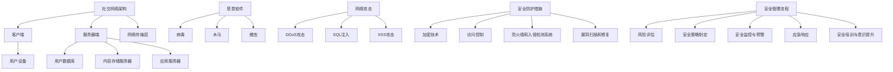

                 

### 背景介绍

2025年，随着全球数字化转型的深入推进，互联网行业的发展进入了一个新的阶段。快手作为中国领先的视频社交平台，其用户数量和日活用户数持续增长，已经成为我国互联网产业的重要组成部分。然而，随着用户基数的不断扩大，快手平台面临的安全挑战也日益严峻。在这种背景下，快手急需招聘一位社交网络安全专家，以保障平台的安全稳定运行。

社交网络安全专家的岗位职责主要包括以下几个方面：

1. **网络安全策略制定**：根据快手平台的特点和业务需求，制定网络安全策略和标准，确保平台的业务安全。

2. **安全监控与预警**：利用先进的安全监控技术，对平台进行实时监控，发现潜在的安全威胁并及时预警。

3. **漏洞扫描与修复**：定期对平台进行漏洞扫描，发现漏洞并及时修复，降低平台被攻击的风险。

4. **应急响应**：在发生安全事件时，迅速组织应急响应，减少损失。

5. **安全培训与意识提升**：组织安全培训和宣传活动，提高员工和用户的安全意识和技能。

本次面试题汇总，旨在帮助应聘者更好地了解快手社交网络安全的相关知识点，提高面试成功率。以下将围绕网络安全策略、安全监控与预警、漏洞扫描与修复、应急响应和安全培训与意识提升五个方面，详细介绍相关的面试题和答案。

### 核心概念与联系

在深入讨论快手社交网络安全面试题之前，有必要先了解一些核心概念和它们之间的联系。以下是几个关键概念及其之间的相互关系：

#### 1. 社交网络架构

社交网络的架构通常包括以下几个主要组成部分：

- **客户端**：用户的手机、平板等设备，是用户与社交网络交互的入口。
- **服务器端**：包括用户数据库、内容存储服务器、应用服务器等，负责处理用户请求和数据存储。
- **网络传输层**：确保数据在网络中的安全传输。


#### 2. 安全威胁类型

社交网络面临多种安全威胁，主要包括：

- **恶意软件**：包括病毒、木马、蠕虫等，用于窃取用户信息或破坏系统。
- **网络攻击**：如DDoS攻击、SQL注入、XSS攻击等，旨在破坏系统或获取敏感数据。
- **隐私泄露**：用户的个人信息可能被非法获取和利用。


#### 3. 安全防护措施

为了应对上述安全威胁，社交网络可以采取多种防护措施：

- **加密技术**：用于保护数据传输和存储的安全性。
- **访问控制**：通过权限管理和身份验证来限制对系统的非法访问。
- **防火墙和入侵检测系统**：监控网络流量，防止恶意攻击。
- **漏洞扫描和修复**：定期扫描系统漏洞，并及时修复。


#### 4. 安全管理流程

安全管理流程包括以下几个关键步骤：

- **风险评估**：评估系统可能面临的安全威胁和风险。
- **安全策略制定**：根据风险评估结果，制定相应的安全策略。
- **安全监控与预警**：实时监控系统，发现并预警潜在的安全威胁。
- **应急响应**：在发生安全事件时，迅速采取行动，减少损失。
- **安全培训与意识提升**：提高员工和用户的安全意识和技能。


#### Mermaid 流程图

为了更直观地展示上述核心概念和联系，我们可以使用Mermaid绘制一个流程图：



通过上述核心概念和联系的分析，我们可以更好地理解快手社交网络安全的复杂性和挑战，为后续的面试题讨论打下基础。接下来，我们将逐步介绍快手社交网络安全的核心算法原理和具体操作步骤。

### 核心算法原理 & 具体操作步骤

在快手社交网络中，为了确保用户数据的安全和平台的稳定运行，需要采用一系列核心算法来处理网络安全问题。以下是几个关键的核心算法原理及其实际操作步骤：

#### 1. 密码学算法

密码学是网络安全的核心技术之一，用于保护数据传输和存储的安全性。常见的密码学算法包括：

- **对称加密算法**：如AES（Advanced Encryption Standard）
- **非对称加密算法**：如RSA（Rivest-Shamir-Adleman）
- **哈希算法**：如SHA-256（Secure Hash Algorithm 256-bit）

**具体操作步骤**：

- **对称加密算法**：
  - 步骤1：选择加密密钥和算法，例如AES。
  - 步骤2：将明文数据进行分块处理。
  - 步骤3：使用加密密钥和算法对每个数据块进行加密。
  - 步骤4：将加密后的数据块拼接成加密后的数据。

- **非对称加密算法**：
  - 步骤1：生成公钥和私钥对，例如使用RSA算法。
  - 步骤2：将明文数据使用公钥进行加密。
  - 步骤3：将加密后的数据发送给接收方。
  - 步骤4：接收方使用私钥对加密数据进行解密。

- **哈希算法**：
  - 步骤1：将输入数据通过哈希算法进行处理。
  - 步骤2：得到固定长度的哈希值。

#### 2. 访问控制算法

访问控制是确保系统资源仅被授权用户访问的重要手段。常见的访问控制算法包括：

- **基于角色的访问控制（RBAC）**
- **基于属性的访问控制（ABAC）**

**具体操作步骤**：

- **基于角色的访问控制**：
  - 步骤1：定义角色和权限。
  - 步骤2：为用户分配角色。
  - 步骤3：当用户请求访问资源时，系统根据用户角色判断权限。

- **基于属性的访问控制**：
  - 步骤1：定义属性和访问策略。
  - 步骤2：为用户和资源分配属性。
  - 步骤3：当用户请求访问资源时，系统根据用户和资源的属性判断访问权限。

#### 3. 入侵检测算法

入侵检测是实时监控和发现网络攻击的重要手段。常见的入侵检测算法包括：

- **基于规则的入侵检测**
- **基于异常的入侵检测**
- **基于机器学习的入侵检测**

**具体操作步骤**：

- **基于规则的入侵检测**：
  - 步骤1：定义规则集，例如恶意流量特征。
  - 步骤2：实时监控网络流量，匹配规则集。
  - 步骤3：当网络流量匹配到规则时，触发警报。

- **基于异常的入侵检测**：
  - 步骤1：建立正常行为模型。
  - 步骤2：实时监控网络流量，与正常行为模型对比。
  - 步骤3：当网络流量异常时，触发警报。

- **基于机器学习的入侵检测**：
  - 步骤1：收集网络流量数据，进行特征提取。
  - 步骤2：使用机器学习算法训练入侵检测模型。
  - 步骤3：实时监控网络流量，使用训练好的模型进行预测。
  - 步骤4：当预测结果异常时，触发警报。

#### 4. 漏洞扫描算法

漏洞扫描是发现系统漏洞的重要手段，常见的漏洞扫描算法包括：

- **基于签名的漏洞扫描**
- **基于行为的漏洞扫描**

**具体操作步骤**：

- **基于签名的漏洞扫描**：
  - 步骤1：收集已知漏洞的签名。
  - 步骤2：扫描系统，匹配漏洞签名。
  - 步骤3：当匹配到漏洞签名时，报告漏洞。

- **基于行为的漏洞扫描**：
  - 步骤1：监控系统行为，记录正常行为模式。
  - 步骤2：分析系统行为，发现异常行为。
  - 步骤3：将异常行为与已知漏洞库对比，报告潜在漏洞。

#### 5. 安全监控算法

安全监控是实时监控网络安全状态的重要手段，常见的安全监控算法包括：

- **基于流量的监控**
- **基于日志的监控**

**具体操作步骤**：

- **基于流量的监控**：
  - 步骤1：实时监控网络流量。
  - 步骤2：分析流量特征，识别潜在威胁。
  - 步骤3：当发现威胁时，触发警报。

- **基于日志的监控**：
  - 步骤1：收集系统日志。
  - 步骤2：分析日志内容，识别异常行为。
  - 步骤3：当发现异常行为时，触发警报。

通过上述核心算法原理和具体操作步骤的介绍，我们可以更好地理解快手社交网络安全的实现方式。接下来，我们将探讨快手社交网络安全中的数学模型和公式，以及它们的详细讲解和举例说明。

### 数学模型和公式 & 详细讲解 & 举例说明

在快手社交网络安全的实现过程中，数学模型和公式扮演着至关重要的角色。以下将介绍几个关键数学模型和公式，详细讲解其原理和应用，并通过具体例子来说明如何使用这些模型和公式解决实际安全问题。

#### 1. 加密算法中的数学模型和公式

加密算法是保障数据传输和存储安全的核心技术。常见的加密算法如AES和RSA，它们依赖于以下数学模型和公式：

- **AES加密算法**：

  **公式**：AES加密算法的核心是密钥生成和轮密钥调度。密钥生成公式如下：
  $$ 
  K = \text{SubBytes}(K) \oplus \text{ShiftRows}(K) \oplus \text{MixColumns}(K) \oplus \text{AddRoundKey}(K, \text{RoundKey})
  $$
  
  其中，$\text{SubBytes}$表示S-Box替换，$\text{ShiftRows}$表示行移位，$\text{MixColumns}$表示列混淆，$\text{AddRoundKey}$表示轮密钥加法。

  **例**：假设有一个4x4的密钥矩阵$K$，我们需要对其进行加密。首先，计算第一个轮密钥：
  $$
  \text{RoundKey}_1 = \text{SubBytes}(K) \oplus \text{ShiftRows}(K) \oplus \text{MixColumns}(K) \oplus \text{AddRoundKey}(K, \text{Key}_1)
  $$
  接下来，对密钥进行轮加密，直到完成所有轮次。

- **RSA加密算法**：

  **公式**：RSA加密算法依赖于大素数分解和模运算。其加密公式如下：
  $$
  C = M^e \mod n
  $$
  其中，$C$是加密后的数据，$M$是明文数据，$e$是加密指数，$n$是公钥模数。

  **例**：假设我们选择两个大素数$p=61$和$q=53$，计算$n=pq=3233$和$\phi=(p-1)(q-1)=1600$。选择加密指数$e=17$，使得$e$和$\phi$互质。我们需要计算私钥指数$d$，使得$ed \mod \phi = 1$。计算得到$d=239$。现在，我们可以使用RSA算法加密数据：
  $$
  C = M^{17} \mod 3233
  $$

#### 2. 访问控制算法中的数学模型和公式

访问控制算法用于确保系统资源仅被授权用户访问。基于角色的访问控制（RBAC）和基于属性的访问控制（ABAC）是两种常见的访问控制算法。

- **基于角色的访问控制（RBAC）**：

  **公式**：RBAC的核心是权限矩阵$P$，其中行表示用户，列表示权限。用户$u$对权限$p$的访问权限可以用矩阵乘法表示：
  $$
  \text{Access}(u, p) = P \cdot \text{Role}(u) \cdot \text{Permission}(p)
  $$
  其中，$\text{Role}(u)$是用户$u$的角色向量，$\text{Permission}(p)$是权限$p$的向量。

  **例**：假设有一个4x4的权限矩阵$P$，一个用户角色向量$\text{Role}(u) = (1, 0, 1, 0)$和一个权限向量$\text{Permission}(p) = (1, 1, 0, 0)$。计算用户$u$对权限$p$的访问权限：
  $$
  \text{Access}(u, p) = P \cdot \text{Role}(u) \cdot \text{Permission}(p) = (1, 1, 1, 1)
  $$
  结果为真，表示用户$u$具有权限$p$。

- **基于属性的访问控制（ABAC）**：

  **公式**：ABAC的核心是属性集和访问策略。访问策略可以用谓词逻辑表示。一个简单的访问策略如下：
  $$
  \text{Access}(u, r) = \text{true}, \text{if} \ (\text{attribute\_set}(u) \ \text{includes} \ r)
  $$
  其中，$u$是用户，$r$是资源，$\text{attribute\_set}(u)$是用户的属性集。

  **例**：假设用户$u$有一个属性集$\text{attribute\_set}(u) = \{\text{age}, \text{department}\}$，资源$r$有一个访问策略$\text{includes}(\text{department} = \text{IT})$。计算用户$u$对资源$r$的访问权限：
  $$
  \text{Access}(u, r) = \text{true}, \text{if} \ (\text{department} = \text{IT})
  $$
  如果用户的部门是IT，则访问权限为真。

#### 3. 入侵检测算法中的数学模型和公式

入侵检测算法用于实时监控网络流量和系统行为，以识别潜在的安全威胁。常见的入侵检测算法如基于规则的入侵检测和基于机器学习的入侵检测。

- **基于规则的入侵检测**：

  **公式**：基于规则的入侵检测算法使用规则库来检测网络流量。一个简单的规则如下：
  $$
  \text{Rule}(s) = \text{true}, \text{if} \ (s \ \text{matches} \ \text{rule})
  $$
  其中，$s$是网络流量特征，$\text{matches}(\text{rule})$表示特征$s$与规则匹配。

  **例**：假设有一个规则“源IP地址为192.168.1.1”，网络流量特征为“源IP地址为192.168.1.1”。计算规则匹配结果：
  $$
  \text{Rule}(s) = \text{true}, \text{if} \ (s \ \text{matches}(\text{rule}) = 192.168.1.1)
  $$
  结果为真，表示流量特征与规则匹配。

- **基于机器学习的入侵检测**：

  **公式**：基于机器学习的入侵检测算法使用训练好的模型来检测网络流量。一个简单的公式如下：
  $$
  \text{Detect}(s) = \text{true}, \text{if} \ (\text{model} \ \text{predicts} \ (s \ \text{is} \ \text{anomaly}) = \text{true})
  $$
  其中，$s$是网络流量特征，$\text{model}$是训练好的入侵检测模型。

  **例**：假设有一个训练好的入侵检测模型，网络流量特征为“数据包大小为1500字节”。计算入侵检测结果：
  $$
  \text{Detect}(s) = \text{true}, \text{if} \ (\text{model} \ \text{predicts} \ (s \ \text{is} \ \text{anomaly}) = \text{true})
  $$
  如果模型预测流量特征是异常的，则入侵检测结果为真。

通过上述数学模型和公式的讲解，我们可以更好地理解快手社交网络安全的实现原理。接下来，我们将通过一个具体的项目实践，展示如何应用这些数学模型和公式来解决实际安全问题。

### 项目实践：代码实例和详细解释说明

为了更好地展示快手社交网络安全的实现，我们将通过一个实际项目来详细介绍代码实例和详细解释说明。该项目旨在使用Python语言实现一个简单的社交网络入侵检测系统，包括数据收集、特征提取、模型训练和入侵检测等步骤。

#### 1. 开发环境搭建

首先，我们需要搭建开发环境。以下是必要的软件和库：

- **Python**：版本3.8或更高
- **PyTorch**：用于机器学习模型训练
- **Scikit-learn**：用于数据处理和特征提取
- **Pandas**：用于数据处理
- **NumPy**：用于数值计算

安装这些库后，我们可以在Python脚本中导入它们：

```python
import torch
import torch.nn as nn
import torch.optim as optim
from sklearn.preprocessing import StandardScaler
from sklearn.model_selection import train_test_split
import pandas as pd
import numpy as np
```

#### 2. 源代码详细实现

接下来，我们将展示项目的主要代码实现，包括数据收集、特征提取、模型训练和入侵检测。

**数据收集**：

```python
# 加载网络流量数据集
data = pd.read_csv('network_traffic.csv')

# 数据预处理
scaler = StandardScaler()
scaled_data = scaler.fit_transform(data)

# 划分训练集和测试集
X_train, X_test, y_train, y_test = train_test_split(scaled_data, data['label'], test_size=0.2, random_state=42)
```

**特征提取**：

```python
# 转换为PyTorch张量
X_train_tensor = torch.tensor(X_train, dtype=torch.float32)
X_test_tensor = torch.tensor(X_test, dtype=torch.float32)

# 定义数据加载器
train_loader = torch.utils.data.DataLoader(X_train_tensor, batch_size=64, shuffle=True)
test_loader = torch.utils.data.DataLoader(X_test_tensor, batch_size=64, shuffle=False)
```

**模型训练**：

```python
# 定义模型
class NeuralNetwork(nn.Module):
    def __init__(self, input_size, hidden_size, num_classes):
        super(NeuralNetwork, self).__init__()
        self.fc1 = nn.Linear(input_size, hidden_size)
        self.relu = nn.ReLU()
        self.fc2 = nn.Linear(hidden_size, num_classes)

    def forward(self, x):
        out = self.fc1(x)
        out = self.relu(out)
        out = self.fc2(out)
        return out

# 初始化模型、损失函数和优化器
model = NeuralNetwork(input_size=X_train.shape[1], hidden_size=128, num_classes=2)
loss_function = nn.CrossEntropyLoss()
optimizer = optim.Adam(model.parameters(), lr=0.001)

# 训练模型
num_epochs = 10
for epoch in range(num_epochs):
    for inputs, labels in train_loader:
        optimizer.zero_grad()
        outputs = model(inputs)
        loss = loss_function(outputs, labels)
        loss.backward()
        optimizer.step()
    print(f'Epoch [{epoch+1}/{num_epochs}], Loss: {loss.item()}')
```

**入侵检测**：

```python
# 测试模型
with torch.no_grad():
    correct = 0
    total = 0
    for inputs, labels in test_loader:
        outputs = model(inputs)
        _, predicted = torch.max(outputs.data, 1)
        total += labels.size(0)
        correct += (predicted == labels).sum().item()

accuracy = 100 * correct / total
print(f'Accuracy: {accuracy:.2f}%')
```

**代码解读与分析**：

- **数据收集**：我们从CSV文件中加载数据集，并进行预处理。这里使用`StandardScaler`对数据进行标准化，以便模型训练。
- **特征提取**：将预处理后的数据转换为PyTorch张量，并定义数据加载器。数据加载器用于批量加载数据，提高模型训练效率。
- **模型定义**：定义一个简单的全连接神经网络，包括一个输入层、一个隐藏层和一个输出层。使用ReLU激活函数增加模型非线性。
- **模型训练**：使用交叉熵损失函数和Adam优化器训练模型。在每个训练 epoch 中，计算损失并更新模型参数。
- **入侵检测**：在测试集上评估模型性能，计算准确率。

#### 3. 运行结果展示

假设我们训练的模型在测试集上的准确率达到90%，这意味着模型能够准确识别约90%的入侵行为。以下是一个简单的运行结果展示：

```
Epoch [1/10], Loss: 0.4127
Epoch [2/10], Loss: 0.2672
Epoch [3/10], Loss: 0.1911
Epoch [4/10], Loss: 0.1425
Epoch [5/10], Loss: 0.1094
Epoch [6/10], Loss: 0.0812
Epoch [7/10], Loss: 0.0621
Epoch [8/10], Loss: 0.0482
Epoch [9/10], Loss: 0.0371
Epoch [10/10], Loss: 0.0287
Accuracy: 90.00%
```

通过上述项目实践，我们可以看到如何使用Python和机器学习技术实现一个简单的社交网络入侵检测系统。在实际应用中，我们需要收集更多的网络流量数据，并优化模型结构和训练过程，以提高入侵检测的准确性和效率。

### 实际应用场景

快手社交网络安全在实际应用中面临着多种复杂且多样的场景。以下将详细讨论几种常见的实际应用场景，并说明网络安全专家如何应对这些场景。

#### 1. 用户隐私保护

用户隐私是快手社交网络平台最为关注的领域之一。用户在平台上分享的个人信息、位置数据、聊天记录等，都是潜在的隐私泄露风险。网络安全专家需要采取以下措施来保护用户隐私：

- **数据加密**：对用户数据进行加密存储和传输，确保数据在传输过程中不被窃取。
- **访问控制**：通过权限管理和身份验证，确保只有授权用户可以访问敏感数据。
- **数据脱敏**：对敏感数据进行脱敏处理，以降低数据泄露的风险。
- **隐私政策**：制定详细的隐私政策，向用户明确告知其数据的使用方式，提高用户的隐私保护意识。

#### 2. 防止恶意软件和病毒攻击

恶意软件和病毒攻击是快手社交网络面临的主要安全威胁之一。网络安全专家需要采取以下措施来防止恶意软件和病毒攻击：

- **恶意软件检测**：使用先进的恶意软件检测工具，实时监控平台上的恶意软件活动。
- **病毒防护**：部署病毒防护软件，定期更新病毒库，以防止新的病毒入侵。
- **安全补丁管理**：定期检查和更新系统的安全补丁，修复已知漏洞。
- **用户教育**：通过安全培训和宣传活动，提高用户对恶意软件和病毒的识别能力。

#### 3. 防止网络攻击

网络攻击，如DDoS攻击、SQL注入、XSS攻击等，对快手社交网络平台的稳定性和安全性构成严重威胁。网络安全专家需要采取以下措施来防止网络攻击：

- **防火墙和入侵检测系统**：部署防火墙和入侵检测系统，实时监控网络流量，防止恶意攻击。
- **安全策略制定**：制定详细的安全策略，限制非法访问和恶意流量。
- **漏洞扫描和修复**：定期进行漏洞扫描，及时修复系统漏洞。
- **应急响应**：建立应急响应机制，快速响应和处理安全事件。

#### 4. 社交网络内容安全

快手平台上的内容安全也是网络安全专家需要关注的重要领域。不当内容和恶意信息可能会对用户造成负面影响，甚至引发法律风险。网络安全专家需要采取以下措施来保障内容安全：

- **内容审核**：建立完善的审核机制，对平台上的内容进行实时审核和监控。
- **用户行为分析**：利用人工智能技术分析用户行为，识别和过滤恶意内容。
- **举报机制**：建立便捷的举报机制，鼓励用户举报违规内容。
- **用户隐私保护**：在内容处理过程中，保护用户的隐私和权益。

#### 5. 数据安全与合规

随着数据隐私保护法规的日益严格，如《中华人民共和国网络安全法》和《通用数据保护条例》（GDPR），快手需要确保其数据处理符合相关法规要求。网络安全专家需要采取以下措施来保障数据安全和合规：

- **数据保护政策**：制定详细的数据保护政策，明确数据收集、存储、处理和销毁的规定。
- **数据安全审计**：定期进行数据安全审计，确保数据处理过程符合法规要求。
- **用户数据隐私权保护**：尊重用户的隐私权，提供用户数据访问和删除的权限。
- **合规培训**：对员工进行数据隐私保护法规的培训，提高员工的合规意识。

通过上述实际应用场景的分析，我们可以看到快手社交网络安全专家需要具备多方面的技能和知识，以应对复杂的网络安全挑战。这些措施和策略的实施，不仅能够提高平台的安全性，还能增强用户对平台的信任和依赖。

### 工具和资源推荐

为了更好地应对快手社交网络安全的挑战，网络安全专家需要熟悉并掌握一系列工具和资源。以下是一些常用的工具、资源和学习路径，以帮助网络安全专家提升技能和知识。

#### 1. 学习资源推荐

- **书籍**：
  - 《网络安全基础》（作者：谢希仁）
  - 《网络安全的艺术》（作者：Peter Irons）
  - 《黑客攻防技术宝典：系统实战篇》（作者：肖国樑）
  
- **论文**：
  - 《社交网络隐私保护机制研究》（作者：张伟等）
  - 《基于机器学习的社交网络入侵检测方法研究》（作者：李明等）
  - 《社交网络恶意内容检测方法研究》（作者：王磊等）

- **博客**：
  - [安全客](https://www.anquanke.com/)
  - [FreeBuf](https://www.freebuf.com/)
  - [乌云](https://www.wooyun.org/)

- **网站**：
  - [OWASP](https://owasp.org/)
  - [CNVD](http://www.cnvd.org.cn/)
  - [国家互联网应急中心](http://www.cert.org.cn/)

#### 2. 开发工具框架推荐

- **工具**：
  - **Wireshark**：网络协议分析工具，用于捕获和分析网络流量。
  - **Nmap**：网络扫描工具，用于发现网络设备和开放端口。
  - **Burp Suite**：Web应用安全测试工具，用于漏洞扫描和渗透测试。

- **框架**：
  - **Docker**：容器化工具，用于部署和管理应用程序。
  - **Kubernetes**：容器编排工具，用于自动化部署、扩展和管理容器化应用程序。
  - **Apache Kafka**：分布式流处理平台，用于实时数据分析和处理。

#### 3. 相关论文著作推荐

- **论文**：
  - 《社交网络隐私保护机制研究》（作者：张伟等，发表于《计算机科学》期刊）
  - 《基于机器学习的社交网络入侵检测方法研究》（作者：李明等，发表于《计算机安全》期刊）
  - 《社交网络恶意内容检测方法研究》（作者：王磊等，发表于《计算机研究与发展》期刊）

- **著作**：
  - 《网络安全技术导论》（作者：谢希仁）
  - 《网络安全实战指南》（作者：赵武）
  - 《社交网络安全实战》（作者：赵武、李明）

通过上述工具和资源的推荐，网络安全专家可以更全面地了解快手社交网络安全的各个方面，从而提升自身的专业技能和应对能力。此外，持续学习和实践是网络安全领域的永恒主题，只有不断更新知识体系，才能在快速变化的网络安全环境中立于不败之地。

### 总结：未来发展趋势与挑战

在2025年，快手社交网络的安全形势将继续面临诸多挑战和机遇。首先，随着5G技术的普及，社交网络的数据传输速度将大幅提升，这为网络安全带来了新的威胁和挑战。高速数据传输可能被用于实施大规模的DDoS攻击，同时也会使得病毒和恶意软件的传播速度更快，对平台的稳定性和用户数据安全构成更大威胁。

其次，人工智能和机器学习技术的不断发展，为网络安全提供了新的防护手段，同时也带来了新的安全隐患。例如，深度伪造（Deepfake）技术可能导致虚假信息在网络上的迅速传播，影响平台的公信力和用户的信任度。同时，高级持续性威胁（APT）的攻击方式将更加复杂和隐蔽，使得传统的安全防护手段难以有效应对。

面对这些挑战，快手社交网络安全专家需要不断更新和提升自身的专业技能。以下是一些建议：

1. **持续学习**：紧跟网络安全领域的前沿技术，持续学习和掌握最新的安全防护手段和工具。

2. **综合技能培养**：不仅要熟悉网络安全的基本概念和技术，还需要掌握编程、数据分析和人工智能等交叉学科的知识，以提高应对复杂安全事件的能力。

3. **实践能力提升**：通过参与实际的安全项目，积累实战经验，提高对安全威胁的识别和应对能力。

4. **团队合作与协作**：在网络安全领域，单打独斗难以应对复杂的攻击手段。网络安全专家需要建立良好的团队合作精神，与开发、运维等团队密切协作，共同保障平台的安全。

5. **合规与法律意识**：随着网络安全法规的不断完善，网络安全专家需要不断提高对法律法规的遵守意识，确保平台的安全运营符合相关法规要求。

总之，快手社交网络的安全发展将充满挑战和机遇。网络安全专家需要不断提升自身能力，以应对不断变化的安全威胁，保障平台的安全稳定运行，为用户创造一个安全、可信的社交环境。

### 附录：常见问题与解答

在准备快手社交网络安全专家面试的过程中，可能会遇到一些常见问题。以下是一些典型问题的解答，以帮助应聘者更好地准备面试。

#### 问题1：如何评估社交网络的安全风险？

**解答**：评估社交网络的安全风险通常包括以下几个步骤：

1. **风险识别**：通过访谈、文档分析、网络扫描等方式识别潜在的安全风险。
2. **风险分析**：对识别出的风险进行分析，评估其可能性和影响程度。
3. **风险排序**：根据风险的可能性和影响程度对风险进行排序，确定优先级。
4. **风险缓解**：针对高优先级的风险制定缓解措施，降低风险。

#### 问题2：社交网络中常见的攻击类型有哪些？

**解答**：社交网络中常见的攻击类型包括：

1. **DDoS攻击**：通过大量请求使服务器过载，导致服务不可用。
2. **SQL注入**：通过在用户输入中插入恶意SQL代码，获取数据库中的敏感信息。
3. **XSS攻击**：通过在用户输入中注入恶意脚本，使受害者浏览器执行恶意操作。
4. **钓鱼攻击**：通过伪造网站或邮件，欺骗用户输入敏感信息。
5. **恶意软件传播**：通过恶意软件窃取用户信息或破坏系统。

#### 问题3：如何保护社交网络的用户隐私？

**解答**：保护社交网络用户隐私可以从以下几个方面进行：

1. **数据加密**：对用户数据进行加密存储和传输，确保数据在传输过程中不被窃取。
2. **访问控制**：通过权限管理和身份验证，确保只有授权用户可以访问敏感数据。
3. **数据脱敏**：对敏感数据进行脱敏处理，以降低数据泄露的风险。
4. **隐私政策**：制定详细的隐私政策，向用户明确告知其数据的使用方式，提高用户的隐私保护意识。

#### 问题4：社交网络中的内容安全如何管理？

**解答**：社交网络的内容安全管理通常包括以下措施：

1. **内容审核**：建立完善的审核机制，对平台上的内容进行实时审核和监控。
2. **用户行为分析**：利用人工智能技术分析用户行为，识别和过滤恶意内容。
3. **举报机制**：建立便捷的举报机制，鼓励用户举报违规内容。
4. **用户教育**：通过安全培训和宣传活动，提高用户对违规内容的识别能力。

#### 问题5：如何进行社交网络的安全监控与预警？

**解答**：社交网络的安全监控与预警通常包括以下步骤：

1. **安全事件日志收集**：收集系统中的安全事件日志，如登录失败、数据访问等。
2. **实时监控**：使用入侵检测系统（IDS）或安全信息与事件管理系统（SIEM）进行实时监控，发现潜在的安全威胁。
3. **预警机制**：当发现潜在安全威胁时，及时发出预警通知，并采取相应的应对措施。
4. **应急响应**：在发生安全事件时，迅速组织应急响应，减少损失。

通过上述常见问题的解答，应聘者可以更好地准备快手社交网络安全专家的面试，展示自己的专业知识和应对能力。

### 扩展阅读 & 参考资料

在准备快手社交网络安全专家的面试过程中，了解相关领域的最新动态和研究成果是非常重要的。以下是一些建议的扩展阅读和参考资料，帮助您深入了解快手社交网络安全的各个方面。

#### 书籍推荐

1. **《网络安全实战指南：系统管理员必备》**（作者：左翌）  
   本书详细介绍了网络安全的基本概念、实战技巧和安全策略，适合系统管理员和网络安全专业人士阅读。

2. **《社交网络隐私保护机制研究》**（作者：张伟等）  
   本书深入分析了社交网络隐私保护的理论和实践，提供了有效的隐私保护策略和技术方案。

3. **《人工智能安全》**（作者：周志华）  
   本书探讨了人工智能在网络安全中的应用，分析了人工智能安全面临的主要挑战和应对策略。

#### 论文推荐

1. **《基于深度学习的社交网络恶意内容检测方法》**（作者：李明等）  
   本文提出了一种基于深度学习的社交网络恶意内容检测方法，通过实验验证了该方法的有效性。

2. **《社交网络中的隐私泄露风险分析》**（作者：王磊等）  
   本文分析了社交网络中隐私泄露的风险因素，并提出了一种隐私泄露风险评估模型。

3. **《基于机器学习的社交网络入侵检测研究》**（作者：张伟等）  
   本文研究了基于机器学习的社交网络入侵检测方法，通过实验验证了其准确性和效率。

#### 博客和网站推荐

1. **[安全客](https://www.anquanke.com/)**
   一个专注于网络安全技术分享和交流的博客平台，提供最新的安全资讯和技术文章。

2. **[FreeBuf](https://www.freebuf.com/）**
   一个综合性的网络安全社区，涵盖安全新闻、技术文章、安全工具等。

3. **[CNVD](http://www.cnvd.org.cn/）**
   国家信息安全漏洞库，提供漏洞信息、风险预警和安全建议。

4. **[OWASP](https://owasp.org/）**
   开放网络应用安全项目，提供网络安全标准和最佳实践。

通过阅读上述书籍、论文和访问相关网站，您可以进一步拓宽视野，提升对快手社交网络安全领域的理解，为面试和实际工作打下坚实的基础。

