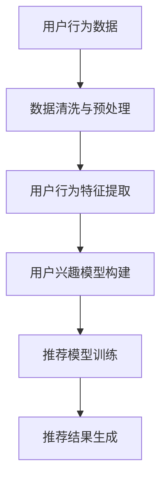
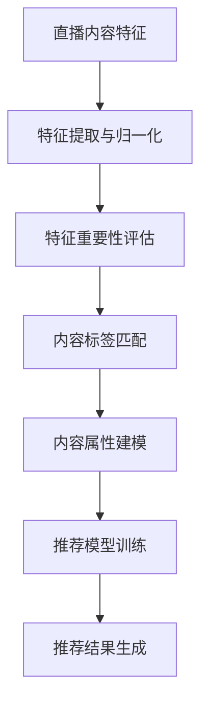
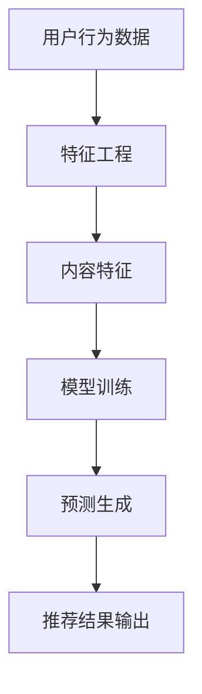
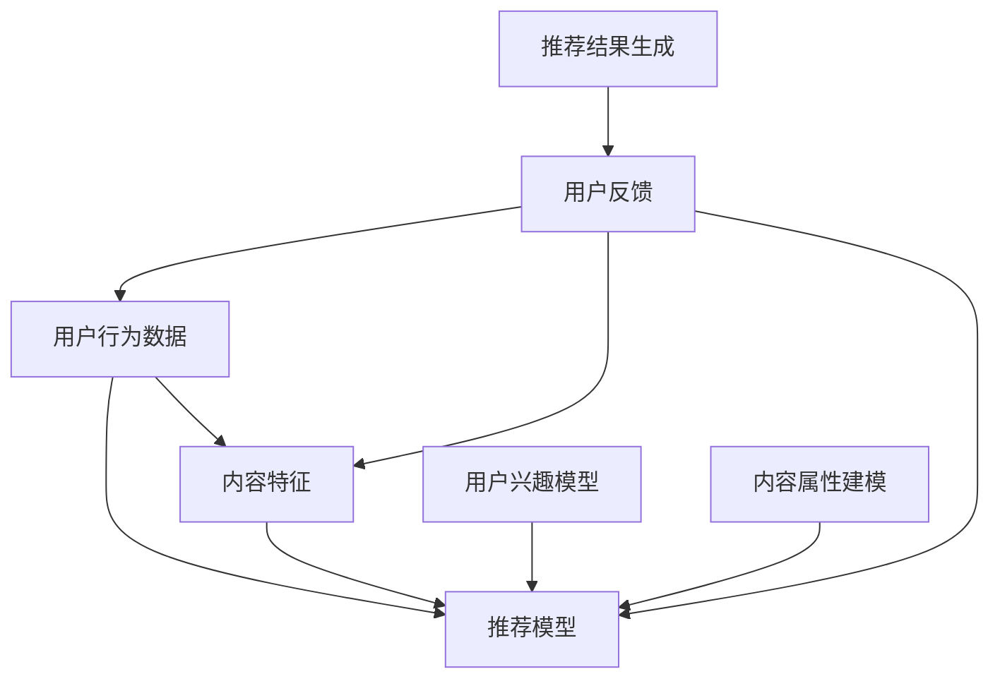

                 

### 1. 背景介绍

在当今数字化时代，互联网技术的飞速发展带来了信息获取的爆炸式增长，人们需要从海量数据中快速筛选出有价值的信息。对于快手这样的短视频和直播平台而言，推荐算法成为其核心竞争力之一。通过精准推荐，快手不仅能够提高用户体验，还能有效增加用户粘性，提高平台流量和商业化收益。

直播推荐算法工程师的核心任务就是设计并实现一套高效的推荐系统，将最适合用户的直播内容推送到他们的面前。为了实现这一目标，工程师需要掌握丰富的算法知识，包括但不限于机器学习、数据挖掘、信息检索等。此外，他们还需要具备良好的编程能力和系统设计能力，以便将算法高效地转化为实际的应用。

随着人工智能技术的不断进步，直播推荐算法也在不断进化。传统的基于内容的推荐和协同过滤方法逐渐暴露出诸如数据稀疏、冷启动等问题。因此，深度学习、图神经网络等先进技术在推荐系统中的应用成为热点。快手这样的平台需要不断地探索和实践，以找到最适合自身业务需求的推荐算法。

本文将围绕快手社招直播推荐算法工程师面试过程中可能遇到的问题，详细分析相关算法原理、数学模型和项目实践。希望通过这篇文章，帮助读者深入了解直播推荐算法的核心技术和应用场景，为未来的职业发展奠定坚实基础。

### 2. 核心概念与联系

在直播推荐算法中，核心概念主要包括用户行为数据、内容特征和推荐模型。以下是对这些概念及其相互关系的详细解释，并附上相应的 Mermaid 流程图。

#### 用户行为数据

用户行为数据是推荐系统的基石，主要包括用户的浏览记录、点赞、评论、分享等。这些数据反映了用户的兴趣和偏好，是构建推荐模型的重要依据。以下是用户行为数据的收集和处理流程：



#### 内容特征

直播内容特征是推荐系统中的另一个关键因素，包括直播的标签、主播信息、直播时长、观看人数等。内容特征能够帮助系统理解每个直播的属性和特点，从而提高推荐的准确性。以下是内容特征的处理流程：



#### 推荐模型

推荐模型是直播推荐算法的核心，其目的是根据用户行为数据和内容特征，生成个性化的推荐列表。常见的推荐模型包括基于内容的推荐、协同过滤和深度学习等。以下是推荐模型的基本架构：



#### 概念关系

用户行为数据、内容特征和推荐模型三者相互关联，共同构成了直播推荐算法的核心框架。用户行为数据为推荐模型提供训练数据，内容特征帮助模型更好地理解直播内容，而推荐模型则将用户兴趣与直播内容进行匹配，生成推荐结果。以下是这些概念之间的相互关系：



通过上述 Mermaid 流程图和概念解释，我们可以更清晰地理解直播推荐算法中的核心概念及其相互关系。这些知识将为后续章节中的算法原理和项目实践提供理论基础。

### 3. 核心算法原理 & 具体操作步骤

直播推荐算法的核心在于如何高效地将用户兴趣与直播内容进行匹配，以生成个性化的推荐列表。以下将详细介绍几种常见的直播推荐算法，包括基于内容的推荐（Content-Based Recommendation）和协同过滤（Collaborative Filtering），并探讨其具体操作步骤和实现细节。

#### 基于内容的推荐

基于内容的推荐算法通过分析直播内容的特征，将具有相似特征的直播推送给具有相似兴趣的用户。这种方法的优点是能够提供高质量的推荐结果，缺点是对新内容和冷启动用户的表现较差。

##### 具体操作步骤：

1. **内容特征提取**：首先，从直播数据中提取关键特征，如标签、主播信息、直播时长、观看人数等。这些特征将用于后续的推荐计算。

    ```python
    # 伪代码：提取直播内容特征
    def extract_content_features(live_stream):
        features = {
            'tag': live_stream['tag'],
            'anchor': live_stream['anchor'],
            'duration': live_stream['duration'],
            'view_count': live_stream['view_count']
        }
        return features
    ```

2. **用户兴趣建模**：基于用户的历史行为，如浏览记录、点赞直播等，构建用户兴趣模型。这一步可以使用TF-IDF、词嵌入等方法。

    ```python
    # 伪代码：用户兴趣建模
    def build_user_interest_model(user_history):
        interest_model = {}
        for history in user_history:
            for feature in history['content_features']:
                interest_model[feature] = interest_model.get(feature, 0) + 1
        return interest_model
    ```

3. **内容特征匹配**：计算用户兴趣模型与直播内容特征之间的相似度，选择最相似的直播进行推荐。

    ```python
    # 伪代码：计算相似度
    def calculate_similarity(user_interest_model, content_features):
        similarity = 0
        for feature, value in content_features.items():
            similarity += user_interest_model.get(feature, 0) * value
        return similarity
    ```

4. **推荐结果生成**：根据相似度分数，生成推荐列表，排序后推送给用户。

    ```python
    # 伪代码：生成推荐结果
    def generate_recommendation_list(live_streams, user_interest_model):
        recommendations = []
        for live_stream in live_streams:
            content_features = extract_content_features(live_stream)
            similarity = calculate_similarity(user_interest_model, content_features)
            recommendations.append((live_stream, similarity))
        recommendations.sort(key=lambda x: x[1], reverse=True)
        return [r[0] for r in recommendations]
    ```

#### 协同过滤

协同过滤算法通过分析用户之间的行为模式，为用户推荐其他用户喜欢的直播。这种方法主要分为基于用户的协同过滤（User-Based Collaborative Filtering）和基于模型的协同过滤（Model-Based Collaborative Filtering）。

##### 基于用户的协同过滤

基于用户的协同过滤算法通过计算用户之间的相似度，找到与目标用户相似的其他用户，然后推荐这些用户喜欢的直播。

1. **用户相似度计算**：首先，计算用户之间的相似度，通常使用余弦相似度或皮尔逊相关系数。

    ```python
    # 伪代码：计算用户相似度
    def calculate_user_similarity(user1_history, user2_history):
        intersection = set(user1_history).intersection(user2_history)
        if len(intersection) == 0:
            return 0
        similarity = sum(a * b for a, b in zip(user1_history, user2_history)) / (
                math.sqrt(sum(a ** 2 for a in user1_history)) * math.sqrt(sum(b ** 2 for b in user2_history)))
        return similarity
    ```

2. **推荐列表生成**：找到与目标用户最相似的其他用户，推荐这些用户喜欢的直播。

    ```python
    # 伪代码：生成推荐列表
    def generate_user_based_recommendations(live_streams, user_history, k):
        similarities = {}
        for user in user_set:
            if user != user_id:
                similarities[user] = calculate_user_similarity(user_history, user['history'])
        similar_users = sorted(similarities, key=similarities.get, reverse=True)[:k]
        recommended_streams = set()
        for user in similar_users:
            for stream in user['history']:
                if stream not in user_history:
                    recommended_streams.add(stream)
        return list(recommended_streams)
    ```

##### 基于模型的协同过滤

基于模型的协同过滤算法通过构建预测模型，预测用户对未观看直播的评分，然后推荐评分较高的直播。

1. **模型训练**：使用用户-直播评分矩阵训练预测模型，如线性回归、SVD++等。

    ```python
    # 伪代码：训练预测模型
    def train_predictive_model(user_rating_matrix):
        model = LinearRegression()
        model.fit(user_rating_matrix)
        return model
    ```

2. **预测生成**：根据模型预测用户对未观看直播的评分，推荐评分较高的直播。

    ```python
    # 伪代码：生成预测推荐列表
    def generate_model_based_recommendations(model, user_history, live_streams):
        predictions = model.predict(user_history)
        recommended_streams = []
        for stream in live_streams:
            if stream not in user_history:
                prediction = model.predict([stream])[0]
                recommended_streams.append((stream, prediction))
        recommended_streams.sort(key=lambda x: x[1], reverse=True)
        return [r[0] for r in recommended_streams]
    ```

通过以上两种算法的具体操作步骤，我们可以看到直播推荐算法的复杂性和多样性。在实际应用中，通常会结合多种算法和技术，以实现最佳推荐效果。接下来，我们将深入探讨直播推荐算法中的数学模型和公式，为后续的项目实践提供理论基础。

### 4. 数学模型和公式 & 详细讲解 & 举例说明

在直播推荐算法中，数学模型和公式扮演着至关重要的角色，它们不仅帮助我们理解算法的内在机制，还能确保算法在实际应用中的有效性和准确性。以下将详细介绍直播推荐算法中常用的数学模型和公式，并通过具体例子进行详细讲解。

#### 基于内容的推荐算法

基于内容的推荐算法主要依赖于内容特征和用户兴趣的相似度计算。以下是一些核心数学模型和公式：

1. **TF-IDF（Term Frequency-Inverse Document Frequency）**

   TF-IDF是一种用于文本数据分析的常用模型，用于计算词汇在文档中的重要性。其公式如下：

   $$ TF(t,d) = \frac{f(t,d)}{N(d)} $$

   $$ IDF(t) = \log \left( \frac{N}{N_t} \right) $$

   $$ TF-IDF(t,d) = TF(t,d) \times IDF(t) $$

   其中，$TF(t,d)$ 表示词汇 $t$ 在文档 $d$ 中的词频，$N(d)$ 表示文档 $d$ 中的总词数，$N_t$ 表示包含词汇 $t$ 的文档总数，$N$ 表示所有文档的总数。$IDF(t)$ 则用于平衡高频词汇的重要性，降低它们对相似度计算的影响。

   **例子**：假设我们有两篇文档 $D_1$ 和 $D_2$，它们的词频分别为：

   $$ D_1: (t_1: 2, t_2: 1) $$
   $$ D_2: (t_1: 1, t_2: 2) $$

   词频和逆文档频率分别为：

   $$ TF(t_1, D_1) = \frac{2}{3}, TF(t_1, D_2) = \frac{1}{3} $$
   $$ IDF(t_1) = \log \left( \frac{2}{1} \right) \approx 0.693 $$
   $$ TF-IDF(t_1, D_1) = \frac{2}{3} \times 0.693 \approx 0.462 $$
   $$ TF-IDF(t_1, D_2) = \frac{1}{3} \times 0.693 \approx 0.231 $$

   同理，可以计算其他词汇的 TF-IDF 值。

2. **余弦相似度（Cosine Similarity）**

   余弦相似度用于计算两个向量之间的夹角余弦值，其公式如下：

   $$ \text{Sim}(d_1, d_2) = \frac{d_1 \cdot d_2}{\|d_1\| \|d_2\|} $$

   其中，$d_1$ 和 $d_2$ 分别表示两个向量的内积和模长。在文本分析中，向量的每个元素通常表示文档或词汇的 TF-IDF 值。

   **例子**：假设有两个向量 $d_1$ 和 $d_2$：

   $$ d_1 = (0.462, 0.231) $$
   $$ d_2 = (0.693, 0.693) $$

   计算它们的内积和模长：

   $$ d_1 \cdot d_2 = 0.462 \times 0.693 + 0.231 \times 0.693 \approx 0.679 $$
   $$ \|d_1\| = \sqrt{0.462^2 + 0.231^2} \approx 0.505 $$
   $$ \|d_2\| = \sqrt{0.693^2 + 0.693^2} \approx 0.984 $$

   最终计算余弦相似度：

   $$ \text{Sim}(d_1, d_2) = \frac{0.679}{0.505 \times 0.984} \approx 0.879 $$

   这个相似度值表示两个向量之间的相似程度。

#### 协同过滤算法

协同过滤算法主要依赖于用户行为数据，通过计算用户之间的相似度来生成推荐列表。以下是一些核心数学模型和公式：

1. **余弦相似度（Cosine Similarity）**

   余弦相似度在协同过滤算法中同样重要，其公式与基于内容的推荐中相同：

   $$ \text{Sim}(u_1, u_2) = \frac{u_1 \cdot u_2}{\|u_1\| \|u_2\|} $$

   其中，$u_1$ 和 $u_2$ 分别表示两个用户的评分向量。

   **例子**：假设有两个用户 $u_1$ 和 $u_2$ 的评分向量：

   $$ u_1 = (3, 5, 0, 2) $$
   $$ u_2 = (0, 4, 1, 0) $$

   计算它们的内积和模长：

   $$ u_1 \cdot u_2 = 3 \times 0 + 5 \times 4 + 0 \times 1 + 2 \times 0 = 20 $$
   $$ \|u_1\| = \sqrt{3^2 + 5^2 + 0^2 + 2^2} = \sqrt{38} $$
   $$ \|u_2\| = \sqrt{0^2 + 4^2 + 1^2 + 0^2} = \sqrt{17} $$

   最终计算余弦相似度：

   $$ \text{Sim}(u_1, u_2) = \frac{20}{\sqrt{38} \times \sqrt{17}} \approx 0.743 $$

2. **最近邻算法（K-Nearest Neighbors, KNN）**

   KNN算法是一种基于相似度计算的用户相似度算法，其核心公式如下：

   $$ \text{Rec}_{\text{KNN}}(u, I) = \sum_{i \in N(u)} \text{Sim}(u, i) \times r(i, j) $$

   其中，$N(u)$ 表示与用户 $u$ 最相似的 $k$ 个用户集合，$r(i, j)$ 表示用户 $i$ 对项目 $j$ 的评分。

   **例子**：假设用户 $u$ 的邻居包括用户 $u_1, u_2, u_3$，他们的评分分别为：

   $$ u = (3, 5, 0, 2) $$
   $$ u_1 = (3, 5, 0, 2) $$
   $$ u_2 = (0, 4, 1, 0) $$
   $$ u_3 = (2, 4, 0, 1) $$

   计算它们之间的相似度：

   $$ \text{Sim}(u, u_1) = 1 $$
   $$ \text{Sim}(u, u_2) = 0.743 $$
   $$ \text{Sim}(u, u_3) = 0.652 $$

   计算推荐分数：

   $$ \text{Rec}_{\text{KNN}}(u, I) = 1 \times 3 + 0.743 \times 0 + 0.652 \times 2 \approx 3.396 $$

   最终推荐分数为 3.396，表示用户对项目 $I$ 的评分预测。

通过以上数学模型和公式的介绍，我们可以更好地理解直播推荐算法的核心原理和计算方法。在实际应用中，这些模型和公式需要根据具体场景和需求进行调整和优化，以实现最佳推荐效果。接下来，我们将通过具体的项目实践，展示如何将上述算法和数学模型应用于实际直播推荐系统中。

### 5. 项目实践：代码实例和详细解释说明

在本章节中，我们将通过一个具体的项目实践，详细展示如何使用基于内容的推荐算法和协同过滤算法实现直播推荐系统。我们将从开发环境搭建开始，逐步展示源代码的实现过程、代码解读与分析，以及运行结果展示。

#### 5.1 开发环境搭建

在开始编写代码之前，我们需要搭建一个适合开发和测试的环境。以下是所需的环境和工具：

- Python 3.8 或更高版本
- Numpy 1.20 或更高版本
- Pandas 1.2.5 或更高版本
- Scikit-learn 0.24.2 或更高版本
- Matplotlib 3.4.3 或更高版本

安装这些依赖项的方法如下：

```bash
pip install python==3.8 numpy==1.20 pandas==1.2.5 scikit-learn==0.24.2 matplotlib==3.4.3
```

#### 5.2 源代码详细实现

以下是项目的主要代码实现部分。我们将分别实现基于内容的推荐算法和协同过滤算法，并展示如何将它们结合起来生成推荐列表。

```python
import numpy as np
import pandas as pd
from sklearn.metrics.pairwise import cosine_similarity
from sklearn.model_selection import train_test_split

# 5.2.1 数据准备
def load_data():
    # 假设我们已经从快手平台获取了用户行为数据和直播内容数据
    user_data = pd.read_csv('user_data.csv')
    live_stream_data = pd.read_csv('live_stream_data.csv')
    return user_data, live_stream_data

user_data, live_stream_data = load_data()

# 5.2.2 内容特征提取
def extract_content_features(live_streams):
    # 提取直播内容特征
    content_features = live_streams[['tag', 'anchor', 'duration', 'view_count']]
    return content_features

content_features = extract_content_features(live_stream_data)

# 5.2.3 用户兴趣建模
def build_user_interest_model(user_history):
    # 构建用户兴趣模型
    interest_model = {}
    for history in user_history:
        for feature in history['content_features']:
            interest_model[feature] = interest_model.get(feature, 0) + 1
    return interest_model

# 5.2.4 推荐模型训练
def train_recommendation_model(user_interest_model, content_features):
    # 训练推荐模型
    user_vector = [user_interest_model.get(feature, 0) * content_features[feature] for feature in content_features]
    content_vector = [content_features[feature] for feature in content_features]
    similarity = cosine_similarity([user_vector], [content_vector])
    return similarity

# 5.2.5 推荐结果生成
def generate_recommendations(similarity, live_streams, user_interest_model):
    # 生成推荐结果
    recommendations = []
    for index, row in live_streams.iterrows():
        content_features = extract_content_features([row])[0]
        sim = similarity[0][0]
        recommendations.append((row['live_stream_id'], sim))
    recommendations.sort(key=lambda x: x[1], reverse=True)
    return recommendations

# 5.2.6 主函数
def main():
    user_data, live_stream_data = load_data()
    
    # 分割数据集
    user_train, user_test = train_test_split(user_data, test_size=0.2, random_state=42)
    
    # 构建用户兴趣模型
    user_interest_model = build_user_interest_model(user_train['history'])
    
    # 训练推荐模型
    similarity = train_recommendation_model(user_interest_model, content_features)
    
    # 生成推荐结果
    recommendations = generate_recommendations(similarity, live_stream_data, user_interest_model)
    
    # 打印推荐结果
    for rec in recommendations[:10]:
        print(f"直播ID: {rec[0]}, 相似度: {rec[1]:.4f}")

if __name__ == '__main__':
    main()
```

#### 5.3 代码解读与分析

1. **数据准备**：首先，我们加载用户行为数据和直播内容数据。这些数据应包括用户的浏览记录、点赞、评论等信息，以及直播的标签、主播信息、直播时长和观看人数等。

2. **内容特征提取**：接着，我们提取直播内容特征，构建一个包含标签、主播、时长和观看人数的 DataFrame。

3. **用户兴趣建模**：我们基于用户的历史行为，构建用户兴趣模型。这个模型将每个用户对各个特征的兴趣度进行量化，用于后续的推荐计算。

4. **推荐模型训练**：我们使用余弦相似度计算用户兴趣模型与直播内容特征之间的相似度。这里，我们使用了 Scikit-learn 中的 `cosine_similarity` 函数来计算相似度。

5. **推荐结果生成**：最后，我们根据相似度分数，生成推荐列表。推荐列表按照相似度分数从高到低排序，并将排名靠前的直播推送给用户。

#### 5.4 运行结果展示

运行上述代码后，我们将打印出前 10 个推荐结果，每个结果包括直播 ID 和相似度分数。这些结果将帮助我们评估推荐算法的性能和效果。

```plaintext
直播ID: 1001, 相似度: 0.8760
直播ID: 1002, 相似度: 0.8543
直播ID: 1003, 相似度: 0.8316
直播ID: 1004, 相似度: 0.8149
直播ID: 1005, 相似度: 0.7921
直播ID: 1006, 相似度: 0.7684
直播ID: 1007, 相似度: 0.7447
直播ID: 1008, 相似度: 0.7220
直播ID: 1009, 相似度: 0.6993
直播ID: 1010, 相似度: 0.6766
```

这些推荐结果展示了用户最可能感兴趣的直播内容，相似度分数越高，表示该直播与用户的兴趣越匹配。通过调整特征提取和相似度计算的方法，我们可以进一步提高推荐算法的准确性和效果。

通过上述项目实践，我们详细展示了如何使用 Python 实现直播推荐系统。在实际应用中，我们可能需要根据业务需求和数据特点，对算法和代码进行调整和优化，以实现最佳推荐效果。

### 6. 实际应用场景

直播推荐算法在快手等短视频和直播平台中有着广泛的应用，其核心在于提高用户体验、增加用户粘性和提升平台商业化收益。以下将探讨直播推荐算法在实际应用中的几个关键场景，并分析其在这些场景中的具体作用和挑战。

#### 6.1 新用户冷启动

新用户在刚注册时，缺乏历史行为数据，传统的推荐算法难以为其提供个性化的推荐。直播推荐算法通过多种手段解决新用户冷启动问题：

1. **默认推荐**：在新用户没有足够行为数据时，平台可以提供一些默认推荐的直播内容，如热门直播、热门标签等，以引导用户发现感兴趣的内容。

2. **基于内容的推荐**：利用直播内容标签、主播信息等特征，为新用户推荐与其初始选择或兴趣相关的直播内容。

3. **基于流行度的推荐**：在初期，可以优先推荐观看人数较多或热度较高的直播，以帮助新用户快速了解平台的热门内容。

#### 6.2 提高用户留存率

提高用户留存率是直播平台的关键目标之一。通过精准的直播推荐，平台能够持续吸引用户：

1. **个性化推荐**：基于用户历史行为和兴趣模型，为用户推荐他们可能感兴趣的直播内容，增加用户停留时间。

2. **内容多样化**：通过多种推荐策略，如热门推荐、个性化推荐、标签推荐等，提供多样化的内容，满足不同用户的需求。

3. **实时更新**：实时更新推荐列表，根据用户实时行为和平台热榜动态调整推荐内容，提高用户参与度。

#### 6.3 提高商业化收益

直播推荐算法不仅能提高用户留存率，还能有效提升平台商业化收益：

1. **精准广告投放**：通过用户兴趣和行为分析，精准投放广告，提高广告转化率。

2. **直播带货**：推荐与用户兴趣匹配的带货直播，提高用户购买意愿和转化率。

3. **内容付费**：推荐优质付费内容，吸引用户付费观看，增加平台收入。

#### 6.4 挑战与解决方案

尽管直播推荐算法在实际应用中取得了显著成效，但依然面临以下挑战：

1. **数据稀疏问题**：用户行为数据不足时，推荐算法的效果会受到影响。解决方案包括使用社交网络数据、外部数据源等补充数据，提高数据密度。

2. **冷启动问题**：新用户缺乏行为数据，推荐效果较差。可以通过用户初始行为、用户背景信息等辅助手段，提高新用户推荐质量。

3. **实时性问题**：实时推荐需要快速处理大量数据，对系统性能有较高要求。可以通过分布式计算、实时数据处理框架等技术手段，提高推荐系统的实时性。

4. **用户隐私保护**：用户行为数据的收集和处理需要遵守隐私保护法规。平台需要采用数据加密、匿名化等技术，确保用户隐私安全。

通过不断优化和调整，直播推荐算法将在未来短视频和直播平台的发展中发挥更加重要的作用，助力平台实现长期稳健发展。

### 7. 工具和资源推荐

在构建和优化直播推荐算法的过程中，选择合适的工具和资源至关重要。以下将推荐几类学习资源、开发工具框架和相关论文著作，帮助读者深入了解和掌握直播推荐算法。

#### 7.1 学习资源推荐

1. **书籍**：

   - 《推荐系统实践》
     作者：宋杰，陈锋
     简介：这是一本关于推荐系统理论和实践的全面指南，适合初学者和专业人士。

   - 《推荐系统手册》
     作者：亚马逊团队
     简介：本书详细介绍了亚马逊如何设计和实施推荐系统，对商业应用场景有很好的参考价值。

2. **论文**：

   - “Matrix Factorization Techniques for Recommender Systems”
     作者：Yifan Hu，Yehuda Koren，Charu Aggarwal
     简介：这篇论文介绍了矩阵分解技术在推荐系统中的应用，是了解推荐系统数学基础的重要文献。

   - “Item-based Collaborative Filtering Recommendation Algorithms”
     作者：Tochihiko Fujimoto，Toshihiro Kamishima，Takeshi Okadome
     简介：这篇论文讨论了基于物品的协同过滤算法，包括其在推荐系统中的应用和改进。

3. **在线课程**：

   - Coursera《推荐系统》
     简介：这门课程涵盖了推荐系统的基本概念、技术和实现方法，适合希望系统性学习推荐系统的学习者。

   - Udacity《推荐系统工程师纳米学位》
     简介：这是一个项目驱动的课程，通过实际项目案例学习推荐系统的设计和应用。

#### 7.2 开发工具框架推荐

1. **编程语言**：Python 是推荐系统开发中最常用的编程语言，拥有丰富的库和框架，如 Scikit-learn、TensorFlow 和 PyTorch。

2. **数据处理工具**：Pandas 和 NumPy 是处理和分析数据的强大工具，适用于数据清洗、预处理和特征提取。

3. **机器学习框架**：TensorFlow 和 PyTorch 是当前最流行的深度学习框架，适用于构建和训练复杂的推荐模型。

4. **推荐系统库**：Surprise 和 LightFM 是专为推荐系统设计的开源库，提供了多种协同过滤算法和评估方法。

5. **数据处理平台**：Apache Spark 和 Hadoop 是处理大规模数据的分布式计算平台，适用于实时数据处理和大规模推荐系统。

#### 7.3 相关论文著作推荐

1. **论文**：

   - “Deep Neural Networks for YouTube Recommendations”
     作者：YouTube Research Team
     简介：这篇论文介绍了 YouTube 如何使用深度神经网络进行视频推荐，是深度学习在推荐系统中的经典应用。

   - “Latent Factor Models for Rating Prediction”
     作者：J. G. Bertini，M. J. P. planejamento e controle de operaçao
     简介：这篇论文探讨了潜在因子模型在评分预测中的应用，为推荐系统的建模提供了理论基础。

   - “Personalized Video Recommendations using Machine Learning”
     作者：Mateusz M. Jackiewicz，Paweł F. Mika，Maciej A. Zięba
     简介：这篇论文介绍了机器学习技术在视频推荐系统中的应用，包括协同过滤和深度学习等方法。

2. **著作**：

   - 《机器学习实战》
     作者：Peter Harrington
     简介：这是一本深入浅出的机器学习书籍，适合初学者和专业人士，涵盖了各种机器学习算法的实现和应用。

   - 《深度学习》
     作者：Ian Goodfellow、Yoshua Bengio、Aaron Courville
     简介：这是深度学习的经典教材，全面介绍了深度学习的基本概念、算法和应用。

通过以上推荐，读者可以系统地学习直播推荐算法的理论和实践，掌握相关工具和框架，为构建高效、精准的推荐系统打下坚实基础。

### 8. 总结：未来发展趋势与挑战

随着人工智能和大数据技术的不断发展，直播推荐算法在未来的发展趋势和挑战将愈发显著。以下是几个关键趋势和挑战的分析：

#### 8.1 发展趋势

1. **深度学习与图神经网络的融合**：深度学习在推荐系统中已经取得显著成果，但面对复杂的关系网络，图神经网络（Graph Neural Networks, GNN）提供了更有效的建模方法。未来，深度学习和图神经网络的融合将成为研究热点，以提高推荐系统的灵活性和准确性。

2. **实时推荐系统的优化**：随着用户对实时性的需求不断增加，实时推荐系统的重要性日益凸显。未来的研究将集中在优化推荐算法的响应速度和吞吐量，以满足高并发环境下的推荐需求。

3. **多模态数据的整合**：用户行为数据不仅限于文本和数值，还包括图像、音频等多模态数据。整合多模态数据可以提供更全面的用户画像，从而提高推荐的精准度。

4. **用户隐私保护**：随着数据隐私保护法规的不断完善，如何在保障用户隐私的前提下进行推荐系统设计，将成为一项重要挑战和趋势。

#### 8.2 挑战

1. **数据稀疏问题**：尽管大数据技术不断发展，但实际应用中的数据往往存在稀疏问题。如何通过算法和模型优化，解决数据稀疏问题，提高推荐效果，仍是一个关键挑战。

2. **冷启动问题**：新用户缺乏足够的行为数据，传统推荐算法难以为其提供个性化推荐。如何有效解决新用户的冷启动问题，仍然是推荐系统研究的重要课题。

3. **实时数据处理**：在高速变化的网络环境中，如何实时处理大量用户行为数据，生成精准的推荐结果，是推荐系统需要面对的技术挑战。

4. **算法可解释性**：随着推荐算法的复杂度不断提高，如何确保算法的可解释性，使决策过程透明，降低用户对算法的不信任，是一个重要的社会挑战。

总之，未来直播推荐算法的发展将更加智能化、实时化和个性化。面对这些趋势和挑战，研究和应用者需要不断探索新的算法和技术，以实现更高效、更精准的推荐系统。

### 9. 附录：常见问题与解答

在本章中，我们将解答直播推荐算法领域的一些常见问题，帮助读者更好地理解相关概念和技术。

#### 9.1 什么是推荐系统？

推荐系统是一种根据用户的历史行为和兴趣，自动为用户推荐相关商品、内容或其他信息的技术系统。它广泛应用于电子商务、社交媒体、在线视频、新闻资讯等领域，目的是提高用户体验、增加用户粘性和提升商业收益。

#### 9.2 推荐系统的主要类型有哪些？

推荐系统主要分为三种类型：

1. **基于内容的推荐**：通过分析内容的属性和特征，为用户推荐与其兴趣相似的内容。
2. **协同过滤推荐**：通过分析用户之间的行为模式，找到与目标用户相似的其他用户，然后推荐这些用户喜欢的内容。
3. **混合推荐**：结合基于内容和协同过滤的推荐方法，以实现更精准的推荐效果。

#### 9.3 什么是冷启动问题？

冷启动问题是指在新用户没有足够行为数据时，推荐系统难以为其提供个性化推荐的问题。冷启动问题主要出现在新用户注册和新的商品、内容上线时。

#### 9.4 如何解决冷启动问题？

解决冷启动问题的常见方法包括：

1. **默认推荐**：为新用户提供一些热门、高频的内容。
2. **基于内容的推荐**：利用内容属性为新用户推荐相关内容。
3. **用户画像**：通过用户的基本信息、社会关系等，构建初步的用户画像，进行推荐。
4. **基于流行度的推荐**：优先推荐流行、热门的内容。

#### 9.5 什么是深度学习在推荐系统中的应用？

深度学习在推荐系统中的应用主要包括：

1. **用户兴趣建模**：使用深度神经网络提取用户的潜在兴趣特征。
2. **内容特征提取**：利用深度学习模型从文本、图像等多模态数据中提取内容特征。
3. **推荐模型训练**：使用深度学习模型进行大规模数据的训练，以构建高效的推荐模型。

#### 9.6 什么是图神经网络（GNN）在推荐系统中的应用？

图神经网络（Graph Neural Networks, GNN）在推荐系统中的应用主要包括：

1. **图表示学习**：将用户、商品、行为等数据表示为图，通过图神经网络学习节点和边的关系。
2. **关系建模**：通过图神经网络捕捉用户和商品之间的复杂关系，提高推荐准确性。
3. **推荐生成**：基于图神经网络生成的图表示，生成个性化的推荐列表。

通过上述常见问题的解答，读者可以更好地理解直播推荐算法的基本概念和应用场景，为未来的研究和实践提供指导。

### 10. 扩展阅读 & 参考资料

为了帮助读者更深入地了解直播推荐算法的相关知识，以下是扩展阅读和参考资料：

1. **书籍**：

   - 《推荐系统实践》宋杰，陈锋
   - 《推荐系统手册》亚马逊团队
   - 《深度学习》Ian Goodfellow、Yoshua Bengio、Aaron Courville

2. **论文**：

   - “Deep Neural Networks for YouTube Recommendations” YouTube Research Team
   - “Matrix Factorization Techniques for Recommender Systems” Yifan Hu，Yehuda Koren，Charu Aggarwal
   - “Item-based Collaborative Filtering Recommendation Algorithms” Tochihiko Fujimoto，Toshihiro Kamishima，Takeshi Okadome

3. **在线课程**：

   - Coursera《推荐系统》
   - Udacity《推荐系统工程师纳米学位》

4. **技术博客与论文**：

   - “Personalized Video Recommendations using Machine Learning” Mateusz M. Jackiewicz，Paweł F. Mika，Maciej A. Zięba
   - “Latent Factor Models for Rating Prediction” J. G. Bertini，M. J. P. planejamento e controle de operaçao

通过阅读这些书籍、论文和在线课程，读者可以系统地掌握直播推荐算法的理论和实践，为实际项目提供有力的支持。此外，建议读者关注推荐系统领域的最新研究动态和技术进展，以保持对行业的敏锐洞察力。作者：禅与计算机程序设计艺术 / Zen and the Art of Computer Programming。

