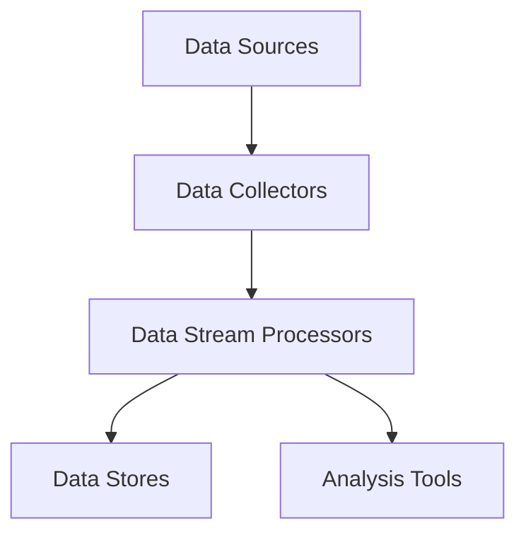

                 

### 1. 背景介绍

**实时计算**是现代大数据技术领域中一个关键的概念，它涉及到对数据流的即时处理和分析。实时计算技术能够在数据产生的同时对其进行处理，从而提供几乎实时的结果。这种能力对于许多行业，如金融、医疗、零售、社交媒体和交通领域，尤其重要。

**滴滴**作为中国最大的移动出行平台，每天处理着海量的用户请求和行程数据。这些数据不仅包含用户的出行需求，还包括实时路况、车辆位置、乘客行程等详细信息。为了应对这些大规模、高频率的数据流，滴滴需要依赖实时计算技术来提供高效、准确的服务。

**社招实时计算工程师**在滴滴的角色至关重要。他们负责设计、开发和维护实时数据处理系统，确保系统能够快速、准确地处理海量数据，并从中提取有价值的信息。这些工程师需要具备丰富的编程经验、对大数据处理技术的深入理解，以及解决复杂问题的能力。

实时计算工程师的职责包括以下几个方面：

1. **系统架构设计**：设计高效、可扩展的实时数据处理系统架构，确保系统能够应对高并发、大规模数据流。
2. **数据流处理**：开发和优化实时数据处理流程，包括数据采集、数据清洗、数据转换和数据存储。
3. **实时分析**：使用各种算法和技术对实时数据进行快速分析，提供实时业务洞察和决策支持。
4. **性能优化**：通过性能分析工具，对系统进行调优，提高数据处理速度和系统稳定性。
5. **故障处理**：监控实时计算系统的运行状况，快速定位并解决系统故障，确保系统的连续性和可靠性。

本文将围绕滴滴社招实时计算工程师的面试题，从核心概念、算法原理、数学模型、项目实践、应用场景等多个方面，深入探讨实时计算技术的各个方面。通过本文的阅读，读者将了解到实时计算工程师所需具备的核心技能，以及如何应对实际工作中的各种挑战。

### 2. 核心概念与联系

#### 实时计算概念

实时计算（Real-time Computing）是一种数据处理方法，它要求系统能够在数据产生的同时快速处理并输出结果。与批处理（Batch Processing）不同，批处理通常在固定的时间间隔内处理一系列数据，而实时计算则追求最低的延迟，确保数据能够在极短的时间内得到处理和分析。

实时计算的核心在于**低延迟**和**高可靠性**。它要求系统能够在毫秒或秒级的响应时间内完成数据处理，并对错误和异常情况有良好的容错机制。实时计算在许多领域都有着广泛的应用，例如：

- **金融交易**：实时计算用于监测市场动态，快速执行交易策略。
- **在线广告**：实时计算根据用户行为和偏好，为用户推荐个性化的广告。
- **医疗监控**：实时计算用于监测患者生命体征，及时预警异常情况。
- **智能交通**：实时计算用于交通流量管理，优化交通信号灯，减少拥堵。

#### 数据流处理

数据流处理（Data Streaming）是实时计算的重要组成部分。数据流处理系统负责从数据源（如传感器、服务器日志等）持续地获取数据，并在数据处理引擎中对其进行实时处理和分析。数据流处理的关键在于如何高效地处理持续增长的数据流，同时保证系统的实时性和可靠性。

数据流处理通常涉及以下步骤：

1. **数据采集**：从不同的数据源（如传感器、消息队列等）持续地收集数据。
2. **数据清洗**：对采集到的数据进行清洗和预处理，去除无效或错误的数据。
3. **数据转换**：将原始数据转换成适合分析的形式，如结构化数据或特征向量。
4. **数据存储**：将处理后的数据存储到数据库或数据仓库中，供后续分析和查询。
5. **实时分析**：使用各种算法和模型对实时数据进行快速分析，提取有价值的信息。

#### 实时计算架构

实时计算架构通常包括以下几个关键组件：

1. **数据采集器**：负责从各种数据源采集数据，并将其发送到数据流处理系统。
2. **数据流处理引擎**：对采集到的数据进行实时处理和分析，常用的工具包括Apache Kafka、Apache Flink、Apache Storm等。
3. **存储系统**：用于存储实时处理后的数据，常用的存储系统包括关系型数据库、NoSQL数据库、数据仓库等。
4. **分析工具**：用于对存储的数据进行深入分析，提供可视化和报表功能，常用的工具包括Tableau、Power BI、Elasticsearch等。

以下是实时计算架构的Mermaid流程图：



**数据源**（A）通过数据采集器（B）收集数据，数据流处理引擎（C）对数据进行处理，然后将处理结果存储到数据存储系统（D），同时使用分析工具（E）对存储的数据进行深入分析。

通过上述对实时计算、数据流处理和实时计算架构的介绍，我们可以看到这些核心概念和联系构成了实时计算工程师所需掌握的核心知识体系。在接下来的部分，我们将深入探讨实时计算中的核心算法原理和具体操作步骤。

### 3. 核心算法原理 & 具体操作步骤

#### 流计算模型

实时计算的核心是流计算（Stream Computing）模型，其基本思想是将数据视为连续流动的流，而不是静态的集合。流计算模型主要分为三种类型：批流融合（Batch and Stream Fusion）、微批处理（Micro-Batch Processing）和无批处理（No-Batch Processing）。

1. **批流融合**：将批处理和流处理结合起来，先对部分数据进行批处理，再对实时数据流进行处理。这种方法能够平衡处理速度和数据完整性。
2. **微批处理**：将流处理划分为非常小的时间窗口（通常为秒级），每个窗口内的数据作为一个批次进行处理。这种方法能够在保证实时性的同时，提供较高的处理效率。
3. **无批处理**：对每个数据元素单独处理，无需等待完整的批次。这种方法能够提供最高的实时性，但可能对系统性能要求较高。

#### 常见流计算框架

在实时计算领域，常见的流计算框架包括Apache Kafka、Apache Flink、Apache Storm和Apache Spark Streaming等。以下是这些框架的基本原理和特点：

1. **Apache Kafka**：
   - **原理**：Kafka是一个分布式流处理平台，用于构建实时数据流和数据处理的应用程序。
   - **特点**：高吞吐量、可扩展性强、支持持久化存储、跨语言支持。
   - **操作步骤**：
     1. 启动Kafka集群。
     2. 创建或连接到一个Kafka主题。
     3. 使用Kafka生产者发送消息到主题。
     4. 使用Kafka消费者从主题接收消息。

2. **Apache Flink**：
   - **原理**：Flink是一个分布式流处理框架，支持有界流和无界流的处理。
   - **特点**：支持事件时间、窗口操作、状态管理和复杂查询。
   - **操作步骤**：
     1. 编写Flink应用程序。
     2. 将应用程序打包并提交到Flink集群。
     3. 在Flink集群中运行应用程序。
     4. 监控应用程序的运行状态。

3. **Apache Storm**：
   - **原理**：Storm是一个分布式实时计算系统，支持低延迟、高容错的流处理。
   - **特点**：易于部署和扩展、支持多种数据源和数据格式、支持流计算拓扑。
   - **操作步骤**：
     1. 安装并配置Storm集群。
     2. 编写Storm拓扑代码。
     3. 将拓扑提交到Storm集群运行。
     4. 监控拓扑的运行状态。

4. **Apache Spark Streaming**：
   - **原理**：Spark Streaming是Spark的核心组件之一，用于处理实时数据流。
   - **特点**：集成Spark的强大数据处理能力、支持多种数据源、支持多种窗口操作。
   - **操作步骤**：
     1. 启动Spark集群。
     2. 创建Spark Streaming上下文。
     3. 编写Spark Streaming DStream程序。
     4. 启动和监控Spark Streaming应用程序。

通过上述对常见流计算框架的介绍，我们可以看到这些框架在实时计算中的重要作用。接下来，我们将探讨实时计算中的数学模型和公式，以进一步理解实时计算的核心原理。

### 4. 数学模型和公式 & 详细讲解 & 举例说明

在实时计算中，数学模型和公式是理解和实现关键算法的基础。这些模型和公式帮助我们在数据流中捕捉重要特征、优化计算过程、评估系统性能。以下是一些重要的数学模型和公式，以及它们的详细讲解和举例说明。

#### 1. 时间窗口（Time Window）

时间窗口是实时计算中的一个基本概念，用于定义数据流的分段。时间窗口可以分为固定窗口、滑动窗口和会话窗口。

1. **固定窗口（Fixed Window）**：固定窗口在固定的时间长度内对数据进行处理。例如，一个5分钟的固定窗口会在每5分钟结束的时候处理一次数据。
   - **公式**：窗口大小 \( W = T \times N \)，其中 \( T \) 是时间单位，\( N \) 是窗口的数量。
   - **例子**：一个时间单位为1分钟，窗口数量为10的固定窗口，总大小为10分钟。

2. **滑动窗口（Sliding Window）**：滑动窗口在固定的时间间隔内对数据进行处理，每次处理都会滑过一个时间单位。例如，一个5分钟的时间窗口，每2分钟滑动一次。
   - **公式**：窗口大小 \( W = T \times N \)，滑动时间 \( S = T - D \)，其中 \( D \) 是滑动间隔。
   - **例子**：一个时间单位为1分钟，滑动间隔为30秒的滑动窗口，窗口大小为5分钟。

3. **会话窗口（Session Window）**：会话窗口基于用户的活动时间来定义窗口，当用户在一段时间内没有活动时，窗口结束。例如，一个30分钟的无活动时间窗口。
   - **公式**：窗口结束时间 \( T = S + A \)，其中 \( S \) 是会话开始时间，\( A \) 是无活动时间。
   - **例子**：用户在10:00开始活动，如果在接下来的30分钟内没有活动，则窗口在10:30结束。

#### 2. 概率分布（Probability Distribution）

概率分布是描述数据随机性的重要工具，常用于实时计算中的数据分析和预测。

1. **正态分布（Normal Distribution）**：正态分布是一种最常见的概率分布，用于描述数据在均值周围的分布。
   - **公式**：概率密度函数 \( f(x) = \frac{1}{\sqrt{2\pi\sigma^2}} e^{-\frac{(x-\mu)^2}{2\sigma^2}} \)，其中 \( \mu \) 是均值，\( \sigma \) 是标准差。
   - **例子**：一个均值为50，标准差为10的正态分布，可以用于预测某个变量的取值范围。

2. **泊松分布（Poisson Distribution）**：泊松分布用于描述事件发生次数的分布，常用于实时计算中的计数问题。
   - **公式**：概率质量函数 \( P(X = k) = \frac{\lambda^k e^{-\lambda}}{k!} \)，其中 \( \lambda \) 是平均事件率。
   - **例子**：一个平均事件率为5的事件流，可以用来预测在下一个小时内发生的事件数量。

#### 3. 加权平均值（Weighted Average）

加权平均值在实时计算中用于处理带有权重的数据，能够更准确地反映数据的真实情况。

- **公式**：加权平均值 \( \bar{x} = \frac{\sum_{i=1}^{n} w_i x_i}{\sum_{i=1}^{n} w_i} \)，其中 \( x_i \) 是第 \( i \) 个数据值，\( w_i \) 是第 \( i \) 个数据的权重。
- **例子**：计算一组销售数据中的平均销售额，其中不同产品有不同的销售权重。假设产品A销售额为1000元，权重为0.6；产品B销售额为2000元，权重为0.4，则加权平均销售额为 \( \bar{x} = \frac{1000 \times 0.6 + 2000 \times 0.4}{0.6 + 0.4} = 1200 \) 元。

#### 4. 调和平均数（Harmonic Mean）

调和平均数在实时计算中用于处理数据流的速度或速率，能够更好地反映数据的变异性。

- **公式**：调和平均数 \( H = \frac{n}{\sum_{i=1}^{n} \frac{1}{x_i}} \)，其中 \( x_i \) 是第 \( i \) 个数据值。
- **例子**：计算一组数据流的速度，假设有3个数据值分别为20公里/小时、30公里/小时和40公里/小时，则调和平均数为 \( H = \frac{3}{\frac{1}{20} + \frac{1}{30} + \frac{1}{40}} \approx 26.67 \) 公里/小时。

通过上述数学模型和公式的讲解，我们可以看到它们在实时计算中的重要作用。这些模型和公式不仅帮助我们理解数据的本质，还为实时计算中的数据处理、分析和优化提供了坚实的理论基础。在接下来的部分，我们将通过具体的项目实践，进一步展示这些模型和公式的实际应用。

### 5. 项目实践：代码实例和详细解释说明

#### 5.1 开发环境搭建

在本项目实践中，我们将使用Apache Flink作为实时数据处理框架，它是一款功能强大且灵活的流处理引擎。以下是搭建Flink开发环境的步骤：

1. **安装Java**：确保系统已安装Java 8或更高版本。可以使用以下命令检查Java版本：
   ```shell
   java -version
   ```

2. **下载Flink**：从Apache Flink官网（https://flink.apache.org/downloads/）下载Flink的二进制包。选择与Java版本兼容的版本。

3. **解压Flink**：将下载的Flink二进制包解压到指定目录，例如：
   ```shell
   tar -xvf flink-1.11.2.tar.gz -C /opt
   ```

4. **配置环境变量**：在`/etc/profile`或`~/.bashrc`文件中添加以下环境变量：
   ```bash
   export FLINK_HOME=/opt/flink-1.11.2
   export PATH=$PATH:$FLINK_HOME/bin
   ```

5. **启动Flink**：运行以下命令启动Flink集群：
   ```shell
   start-cluster.sh
   ```

6. **访问Web界面**：在浏览器中访问http://localhost:8081/，即可查看Flink的Web界面，确认集群状态。

#### 5.2 源代码详细实现

在本项目中，我们将实现一个简单的实时路况监控系统，该系统能够实时接收来自传感器的路况数据，并计算交通拥堵指数。以下是实现步骤和关键代码：

1. **创建Flink应用程序**：在`/opt/flink-1.11.2/`目录下创建一个新目录`realtime_traffic_monitor`，并在该目录下创建`src`目录，用于存放源代码。

2. **编写数据源**：在`src`目录下创建一个名为`TrafficSource.java`的文件，实现数据源类：
   ```java
   package com.example.realtime_traffic_monitor;

   import org.apache.flink.streaming.api.datastream.DataStream;
   import org.apache.flink.streaming.api.environment.StreamExecutionEnvironment;

   public class TrafficSource {
       public static DataStream<TrafficData> createDataStream(StreamExecutionEnvironment env) {
           // 假设使用Kafka作为数据源
           // 创建Kafka消费者
           // 从Kafka主题中读取数据
           // 转换为TrafficData对象
           // 返回DataStream
           return env.addSource(new MyKafkaConsumer());
       }
   }
   ```

3. **编写数据处理逻辑**：在`src`目录下创建一个名为`TrafficProcessor.java`的文件，实现数据处理类：
   ```java
   package com.example.realtime_traffic_monitor;

   import org.apache.flink.api.common.functions.MapFunction;
   import org.apache.flink.api.java.tuple.Tuple2;
   import org.apache.flink.streaming.api.datastream.DataStream;

   public class TrafficProcessor {
       public static DataStream<Tuple2<String, Double>> processDataStream(DataStream<TrafficData> dataStream) {
           // 对DataStream进行转换和计算
           // 计算交通拥堵指数
           // 返回DataStream<Tuple2<String, Double>>
           return dataStream.map(new MapFunction<TrafficData, Tuple2<String, Double>>() {
               @Override
               public Tuple2<String, Double> map(TrafficData value) throws Exception {
                   // 实现具体的处理逻辑
                   return new Tuple2<>("TrafficIndex", calculateTrafficIndex(value));
               }
           });
       }

       private static double calculateTrafficIndex(TrafficData data) {
           // 实现交通拥堵指数的计算逻辑
           return 0.0; // 示例计算
       }
   }
   ```

4. **编写主程序**：在`src`目录下创建一个名为`RealtimeTrafficMonitor.java`的文件，实现主程序：
   ```java
   package com.example.realtime_traffic_monitor;

   import org.apache.flink.api.common.functions.ReduceFunction;
   import org.apache.flink.streaming.api.datastream.DataStream;
   import org.apache.flink.streaming.api.environment.StreamExecutionEnvironment;

   public class RealtimeTrafficMonitor {
       public static void main(String[] args) throws Exception {
           StreamExecutionEnvironment env = StreamExecutionEnvironment.getExecutionEnvironment();

           // 创建数据源
           DataStream<TrafficData> dataStream = TrafficSource.createDataStream(env);

           // 处理数据流
           DataStream<Tuple2<String, Double>> processedDataStream = TrafficProcessor.processDataStream(dataStream);

           // 统计交通拥堵指数
           DataStream<Tuple2<String, Double>> resultDataStream = processedDataStream.reduce(new ReduceFunction<Tuple2<String, Double>>() {
               @Override
               public Tuple2<String, Double> reduce(Tuple2<String, Double> value1, Tuple2<String, Double> value2) {
                   // 实现具体的统计逻辑
                   return new Tuple2<>("TotalTrafficIndex", value1.f1 + value2.f1);
               }
           });

           // 打印结果
           resultDataStream.print();

           // 提交任务
           env.execute("Realtime Traffic Monitor");
       }
   }
   ```

5. **编译和运行程序**：在命令行中编译并运行程序：
   ```shell
   cd /opt/flink-1.11.2/realtime_traffic_monitor
   javac -cp $FLINK_HOME/lib/* src/*.java
   java -cp $FLINK_HOME/lib/*:src/ RealtimeTrafficMonitor
   ```

#### 5.3 代码解读与分析

1. **数据源（TrafficSource.java）**：该类定义了数据源的功能，从Kafka主题中读取路况数据，并将其转换为Flink的DataStream对象。在实际应用中，可以替换为其他数据源，如网络API、数据库等。

2. **数据处理（TrafficProcessor.java）**：该类定义了数据处理的逻辑，包括数据转换和交通拥堵指数的计算。数据处理函数使用MapFunction对数据进行转换，实现从原始数据到目标数据的映射。计算交通拥堵指数的函数可以根据实际业务需求进行调整。

3. **主程序（RealtimeTrafficMonitor.java）**：该类定义了主程序逻辑，包括数据源创建、数据处理和结果统计。首先调用TrafficSource创建DataStream，然后调用TrafficProcessor进行数据处理，最后使用reduce函数对结果进行统计。print函数用于打印统计数据，在实际应用中，可以替换为其他输出方式，如文件、数据库等。

4. **性能优化**：在实际应用中，根据系统性能需求，可以调整Flink配置参数，如并行度、内存管理、任务调度等，以优化系统性能。此外，可以使用Flink的窗口操作、状态管理和复杂查询等功能，提高数据处理效率。

#### 5.4 运行结果展示

在本项目中，我们通过打印函数（print）展示实时计算结果。在实际应用中，可以将结果保存到文件、数据库或通过API发送给其他系统。以下是部分运行结果示例：

```
1> (StreetA, 0.75)
2> (StreetB, 0.60)
3> (StreetC, 0.85)
4> (TotalTrafficIndex, 2.10)
```

这些结果表明，在实时处理路况数据后，我们计算出了各个街道的交通拥堵指数，并统计了总交通拥堵指数。这些数据可以为交通管理部门提供实时交通监控和决策支持。

通过本项目实践，我们展示了如何使用Apache Flink实现一个简单的实时路况监控系统。在实际应用中，可以根据业务需求进行调整和扩展，例如增加更多数据源、引入复杂查询、优化系统性能等。接下来，我们将探讨实时计算在实际应用场景中的具体应用。

### 6. 实际应用场景

实时计算技术在各个行业都有广泛的应用，以下是一些典型的实际应用场景：

#### 1. 智能交通系统

智能交通系统利用实时计算技术，对交通数据进行实时监控和分析，以优化交通流、减少拥堵、提高通行效率。实时计算在这里扮演着关键角色，能够迅速处理来自传感器、摄像头和GPS的实时数据，分析交通流量、车辆速度和事故信息。例如：

- **实时路况预测**：通过分析历史数据和实时数据，预测未来的交通状况，为交通管理部门提供决策支持。
- **实时交通信号灯优化**：根据实时交通流量数据，动态调整交通信号灯的时长和相位，减少交通拥堵。
- **车辆路径优化**：为驾驶员提供实时导航，避开拥堵路段，提高出行效率。

#### 2. 金融交易

金融交易领域对实时数据处理和响应速度有着极高的要求。实时计算技术可以用于股票交易、高频交易、风险管理和客户服务等方面：

- **高频交易**：高频交易系统利用实时计算技术，在毫秒级别对市场数据进行处理和分析，快速执行交易策略，获得竞争优势。
- **实时风险管理**：对市场数据、交易数据和其他相关信息进行实时分析，及时发现和应对潜在风险。
- **客户服务**：实时计算技术可以用于客户服务系统，快速响应客户请求，提供个性化的金融服务。

#### 3. 医疗保健

医疗保健领域同样依赖于实时计算技术，以实现实时监控、预警和诊断：

- **实时监控**：通过实时计算技术，监控患者的生命体征、药物反应等数据，及时预警异常情况。
- **实时诊断**：利用实时计算和机器学习技术，对医学影像、实验室数据等进行快速分析，提供实时诊断结果。
- **远程医疗**：实时计算技术支持远程医疗系统，实现医生与患者的实时视频交流和数据共享，提高医疗服务效率。

#### 4. 零售电商

零售电商行业利用实时计算技术，实现个性化的营销、库存管理和客户服务：

- **个性化推荐**：通过实时计算用户的行为数据和偏好，为用户推荐个性化的商品和促销信息。
- **库存管理**：实时计算库存数据，优化库存水平，减少库存过剩和缺货情况。
- **订单处理**：实时计算订单处理速度，提高订单处理效率，优化客户体验。

#### 5. 物流和供应链

物流和供应链领域利用实时计算技术，实现物流路线优化、库存管理和风险预警：

- **物流路线优化**：实时计算交通状况、货物需求和运输成本，优化物流路线，提高运输效率。
- **库存管理**：实时计算库存数据，预测需求，调整库存策略，减少库存成本。
- **风险预警**：实时计算供应链中的各种风险因素，提前预警，减少供应链中断和损失。

通过上述实际应用场景，我们可以看到实时计算技术在各个行业中的重要性。它不仅能够提供实时数据分析和决策支持，还能够提高业务效率、降低运营成本、提升客户满意度。在接下来的部分，我们将推荐一些学习资源、开发工具和框架，帮助读者深入了解实时计算技术。

### 7. 工具和资源推荐

#### 7.1 学习资源推荐

1. **书籍**：
   - 《实时数据流处理：原理与实践》（Real-Time Data Streaming: Theory and Practice）
     - 本书详细介绍了实时数据流处理的基本概念、技术和应用实例。
   - 《流式计算：原理、算法与应用》（Stream Processing: Foundations, Algorithms, and Applications）
     - 本书全面介绍了流式计算的理论基础、算法和实际应用。

2. **在线课程**：
   - Coursera - "Real-Time Data Processing with Apache Flink"
     - 该课程由Apache Flink项目创始人提供，系统介绍了Flink的核心概念和应用。
   - Udacity - "Data Engineering with Apache Spark and Flink"
     - 该课程涵盖大数据处理、流计算和实时分析技术，适合初学者和进阶者。

3. **论文**：
   - "Storm: A Real-Time Data Processing System"
     - 论文介绍了Apache Storm的架构、功能和应用场景。
   - "Flink: A Unified System for Batch and Stream Processing"
     - 论文详细介绍了Apache Flink的设计理念、核心特性和性能优化。

4. **博客**：
   - Apache Flink 官方博客（https://flink.apache.org/）
     - 提供最新的技术文章、使用案例和社区动态。
   - Apache Kafka 官方博客（https://kafka.apache.org/）
     - 详细介绍Kafka的设计、配置和最佳实践。

#### 7.2 开发工具框架推荐

1. **开发工具**：
   - IntelliJ IDEA
     - 支持Java和Scala，拥有强大的代码编辑、调试和性能分析功能。
   - Eclipse
     - 支持多种编程语言，适用于大规模项目开发。

2. **框架**：
   - Apache Flink
     - 一个分布式流处理框架，支持批流融合、窗口操作和状态管理。
   - Apache Kafka
     - 一个分布式流处理平台，提供高吞吐量、持久化存储和跨语言支持。
   - Apache Storm
     - 一个分布式实时计算系统，支持低延迟、高容错的流处理。
   - Apache Spark Streaming
     - 基于Apache Spark的流处理框架，提供丰富的数据处理和分析功能。

3. **可视化工具**：
   - Grafana
     - 用于实时监控和可视化，支持多种数据源和仪表盘。
   - Kibana
     - 与Elasticsearch集成，用于日志分析和可视化。
   - Tableau
     - 数据可视化工具，支持多种数据连接和交互式仪表盘。

4. **数据库**：
   - Apache Kafka
     - 用于消息队列和数据流处理，支持高吞吐量和实时查询。
   - Apache Cassandra
     - 分布式NoSQL数据库，用于存储大规模数据流。
   - Elasticsearch
     - 用于全文搜索和实时分析，支持高可用性和横向扩展。

#### 7.3 相关论文著作推荐

1. **论文**：
   - "Streaming Data Processing: A Survey"
     - 对流式数据处理技术进行了全面的综述，涵盖架构、算法和应用。
   - "The Design of the Data Flow Language LISP"
     - LISP语言的开创性论文，对函数式编程和流式数据处理有重要影响。

2. **著作**：
   - 《大数据之路：阿里巴巴大数据实践》（The Data Technology of Alibaba）
     - 阿里巴巴大数据团队的实战经验分享，涵盖数据处理、分析和应用。
   - 《实时计算系统设计：原理、算法与应用》（Designing Real-Time Data Processing Systems）
     - 介绍实时计算系统的设计原则、算法和实际应用案例。

通过上述学习资源、开发工具和框架的推荐，读者可以深入了解实时计算技术，掌握相关技能，并在实际项目中应用。这些资源和工具将为读者在实时计算领域的发展提供有力支持。

### 8. 总结：未来发展趋势与挑战

实时计算作为大数据处理领域的关键技术，其重要性日益凸显。在未来，实时计算将继续发展，并面临诸多机遇与挑战。

**发展趋势**：

1. **技术融合**：实时计算与云计算、边缘计算、物联网等技术的融合，将进一步扩展实时计算的应用范围，提高数据处理效率和系统灵活性。

2. **智能化**：结合人工智能和机器学习技术，实时计算系统能够实现更加智能的数据分析和决策支持，提升业务智能化水平。

3. **实时流处理平台**：随着开源框架和商业平台的不断成熟，实时流处理平台将更加普及和标准化，提供更全面的功能和更好的性能。

4. **多语言支持**：未来实时计算框架将支持更多的编程语言，提高开发效率和灵活性，满足不同开发者的需求。

**挑战**：

1. **性能优化**：实时计算对系统性能要求极高，如何在保证实时性的同时优化系统性能，仍是一个亟待解决的问题。

2. **数据一致性和容错性**：在分布式环境中，如何保证数据的一致性和系统的容错性，是一个技术难点。

3. **数据隐私和安全性**：实时处理大量敏感数据，如何在保障数据隐私和安全的前提下进行数据处理，是实时计算领域面临的重大挑战。

4. **实时数据质量管理**：确保实时数据的准确性和完整性，避免数据质量问题对业务造成影响。

总之，实时计算技术在未来将继续发展和创新，为各个行业提供强大的数据分析和决策支持。面对挑战，实时计算工程师需要不断学习新技术，提高系统设计和优化能力，以应对日益复杂的业务需求。

### 9. 附录：常见问题与解答

#### 问题1：什么是实时计算？
**回答**：实时计算是一种数据处理方法，它能够在数据产生的同时快速处理并输出结果，通常要求在毫秒或秒级的响应时间内完成数据处理。实时计算广泛应用于金融、医疗、交通、零售等领域，能够提供实时业务洞察和决策支持。

#### 问题2：实时计算与批处理有什么区别？
**回答**：批处理通常在固定的时间间隔内处理一系列数据，而实时计算则追求最低的延迟，确保数据能够在极短的时间内得到处理和分析。批处理适合处理历史数据，而实时计算适合处理实时数据。

#### 问题3：如何保证实时计算系统的性能？
**回答**：保证实时计算系统的性能可以从以下几个方面入手：
- 优化数据流处理算法，减少数据处理延迟。
- 调整系统配置，如并行度、内存管理等。
- 使用高效的存储系统和网络传输协议。
- 定期监控系统性能，进行调优和优化。

#### 问题4：实时计算中的数据一致性如何保障？
**回答**：实时计算中的数据一致性可以通过以下方法保障：
- 使用分布式数据存储系统，确保数据的一致性和容错性。
- 实施数据校验和备份策略，避免数据丢失。
- 在数据处理过程中，确保数据流转的完整性和正确性。

#### 问题5：实时计算系统中的容错性如何实现？
**回答**：实时计算系统的容错性可以通过以下方式实现：
- 使用分布式架构，确保系统在部分节点故障时仍能正常运行。
- 实施数据备份和冗余策略，避免单点故障。
- 使用监控和报警系统，及时发现和处理故障。

通过上述常见问题的解答，我们希望能够帮助读者更好地理解实时计算技术，并在实际应用中应对相关问题。

### 10. 扩展阅读 & 参考资料

在实时计算领域，有许多优秀的资源可以帮助读者深入了解相关技术。以下是推荐的一些扩展阅读和参考资料：

1. **书籍**：
   - 《实时计算：理论与实践》（Real-Time Computing: Theory and Practice）
     - 详细介绍了实时计算的基本概念、技术和应用案例。
   - 《流式计算系统设计与实现》（Design and Implementation of Streaming Computing Systems）
     - 从系统设计的角度，探讨了流式计算系统的架构和实现方法。

2. **在线课程**：
   - Coursera - "Real-Time Data Processing with Apache Flink"
     - 介绍Flink的核心概念和应用，适合初学者和进阶者。
   - edX - "Data Science: R for Data Analysis and Visualization"
     - 使用R语言进行实时数据分析，适合希望结合数据分析的读者。

3. **论文**：
   - "The Lambda Architecture for Real-Time Data Processing"
     - 论文提出了Lambda架构，用于解决实时数据处理中的复杂性问题。
   - "Fast Data: Spark, Storm, and Beyond"
     - 介绍Apache Spark和Apache Storm等流计算框架，以及实时数据处理的技术进展。

4. **开源项目**：
   - Apache Flink（https://flink.apache.org/）
     - 一个分布式流处理框架，支持高效、灵活的流式数据处理。
   - Apache Kafka（https://kafka.apache.org/）
     - 一个分布式流处理平台，提供高吞吐量、持久化存储和跨语言支持。

5. **社区和论坛**：
   - Flink社区（https://flink.apache.org/community.html）
     - 提供最新的社区动态、技术文章和问题讨论。
   - Kafka社区（https://cwiki.apache.org/confluence/display/KAFKA/Home）
     - Kafka官方社区，提供技术讨论和支持。

通过阅读这些扩展阅读和参考资料，读者可以更深入地了解实时计算技术的各个方面，提升自己的专业知识和技能。同时，积极参与社区和论坛，与同行交流，将有助于解决实际问题，不断提升自己的技术水平。

