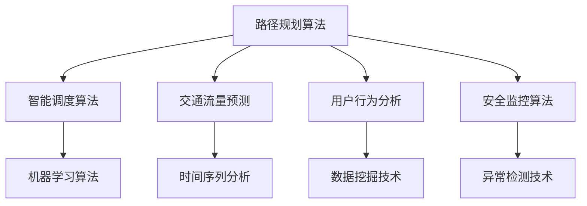

                 

### 1. 背景介绍

滴滴出行（DiDi），作为中国领先的移动出行平台，其业务涵盖了出租车、专车、快车、共享单车、公交、汽车租赁等多种出行方式。随着业务的迅速扩展和用户需求的日益增长，滴滴在2025年的社招算法面试中，对候选人的算法能力有了更高的要求。这不仅是对候选人专业知识的一次考验，更是对其实践能力和创新思维的一次全面评估。

当前，滴滴在智能出行领域面临着一系列复杂的技术挑战。例如，实时路径规划、智能调度、交通流量预测、用户行为分析等。这些挑战不仅需要强大的算法支持，还需要对大数据、机器学习、深度学习等领域有深刻的理解。因此，滴滴社招算法面试题库及答案的编制，旨在筛选出具备扎实理论基础和实际操作能力的高水平算法人才。

本文将基于滴滴社招算法面试题库，对一些典型的面试题目进行深入分析和解答。通过这些题目，我们将了解滴滴在算法领域的核心关注点，以及候选人需要具备的基本能力。文章结构如下：

1. 背景介绍
2. 核心概念与联系
3. 核心算法原理 & 具体操作步骤
4. 数学模型和公式 & 详细讲解 & 举例说明
5. 项目实践：代码实例和详细解释说明
6. 实际应用场景
7. 工具和资源推荐
8. 总结：未来发展趋势与挑战
9. 附录：常见问题与解答
10. 扩展阅读 & 参考资料

接下来，我们将一步步深入探讨这些核心内容，帮助读者更好地理解滴滴社招算法面试的重点和难点。

#### 1.1 滴滴的算法需求

滴滴出行在发展过程中，逐渐形成了自身独特的算法需求。这些需求主要可以分为以下几个方向：

- **路径规划算法**：如何快速、准确地计算出从起点到终点的最优路径，是滴滴出行服务的核心问题之一。滴滴使用的A*算法、Dijkstra算法等，都是为了实现这一目标。

- **智能调度算法**：如何合理分配车辆，使得乘客能够以最快的速度获得服务，同时保证司机的效率。滴滴的智能调度系统，通过机器学习技术，对海量数据进行分析，从而实现最优调度。

- **交通流量预测**：通过分析历史数据和实时数据，预测未来某一时间段内的交通流量。滴滴利用这一预测，可以在高峰时段提前调整调度策略，缓解交通拥堵。

- **用户行为分析**：滴滴通过用户行为数据分析，了解用户的需求和行为模式，从而提供更加个性化的服务。例如，根据用户的出行习惯，推荐最合适的出行方式。

- **安全监控算法**：滴滴的平台需要对实时数据进行监控，以识别潜在的异常行为。这包括乘客和司机的行为监控、行程监控等，旨在确保出行的安全。

#### 1.2 面试题目类型

在2025年的社招算法面试中，滴滴主要关注以下几个类型的题目：

- **基础算法题目**：如排序算法、搜索算法、动态规划等，这些是算法面试的常见题目，主要考察候选人的基础知识。
- **机器学习题目**：涉及线性回归、决策树、神经网络等，主要考察候选人对于机器学习算法的理解和应用能力。
- **深度学习题目**：如卷积神经网络、循环神经网络等，考察候选人对于深度学习技术的掌握程度。
- **大数据题目**：如数据清洗、数据预处理、数据分析等，考察候选人在大数据处理和分析方面的能力。
- **实际应用题目**：结合滴滴的业务场景，设计具体的算法解决方案，主要考察候选人的实际解决问题的能力。

通过对这些面试题目的深入分析，我们可以更好地了解滴滴对算法人才的需求，以及候选人需要具备的基本能力。

#### 1.3 面试准备建议

对于准备参加滴滴社招算法面试的候选人，以下是一些建议：

- **深入理解基础算法**：掌握常见的排序算法、搜索算法、动态规划等基础算法，能够高效地解决实际问题。
- **掌握机器学习和深度学习**：了解常见的机器学习算法和深度学习模型，能够在实际项目中应用。
- **熟悉大数据处理技术**：掌握Hadoop、Spark等大数据处理框架，能够进行高效的数据分析和处理。
- **实践经验**：参与实际的算法项目，通过实践积累经验，提升解决问题的能力。
- **持续学习**：算法领域发展迅速，持续关注最新的技术动态和研究成果，不断学习新的知识和技能。
- **综合素质**：除了技术能力，还需要具备良好的沟通能力、团队合作能力和问题解决能力。

通过以上准备，候选人将更有信心应对滴滴的社招算法面试，并在激烈的竞争中脱颖而出。

### 2. 核心概念与联系

在深入探讨滴滴社招算法面试的核心问题之前，我们需要先了解一些关键概念，这些概念在滴滴的算法体系中起着至关重要的作用。

#### 2.1 路径规划算法

路径规划算法是滴滴算法体系中的核心部分，旨在为乘客提供从起点到终点的最优路径。常见的路径规划算法包括A*算法、Dijkstra算法等。A*算法通过结合启发式函数，能够更快速地找到最优路径，而Dijkstra算法则适用于无权重图的路径规划。这两者相辅相成，在不同场景下有着各自的优势。

#### 2.2 智能调度算法

智能调度算法是滴滴出行系统中的另一大关键，其主要目的是在众多潜在司机中，找到最合适的司机来接送乘客。这一过程涉及到复杂的计算和优化，通常需要运用机器学习算法。例如，基于神经网络的调度算法可以通过学习历史数据，预测司机的实时状态和乘客的需求，从而实现最优调度。

#### 2.3 交通流量预测

交通流量预测是解决交通拥堵问题的重要手段。通过分析历史交通数据和实时监控数据，滴滴可以预测未来某一时间段内的交通流量，从而调整调度策略，避免拥堵。这一过程通常涉及时间序列分析、回归分析等统计学方法。

#### 2.4 用户行为分析

用户行为分析是滴滴个性化服务的重要基础。通过对用户的出行习惯、喜好、反馈等数据进行深入分析，滴滴可以了解用户的需求和行为模式，从而提供更加精准和个性化的服务。用户行为分析主要依赖于数据挖掘和机器学习技术。

#### 2.5 安全监控算法

安全监控算法旨在保障滴滴平台的用户和司机安全。通过实时监控用户和司机的行程数据、行为数据，滴滴可以及时发现异常行为，进行预警和干预。这一过程通常涉及异常检测、风险评估等技术。

#### 2.6 核心概念联系图

为了更好地理解这些核心概念之间的联系，我们可以使用Mermaid流程图进行展示。以下是滴滴算法核心概念的联系图：



通过上述流程图，我们可以清晰地看到各个核心概念之间的关联。例如，路径规划算法不仅服务于乘客的出行需求，还与智能调度算法、交通流量预测、用户行为分析等紧密相关。同时，这些算法和技术的应用，共同构建了滴滴出行的智能出行生态系统。

### 3. 核心算法原理 & 具体操作步骤

在了解滴滴算法体系中的核心概念后，接下来我们将深入探讨这些算法的原理和具体操作步骤。本节将分为以下几个部分：路径规划算法、智能调度算法、交通流量预测、用户行为分析以及安全监控算法。

#### 3.1 路径规划算法

路径规划算法在滴滴出行中扮演着至关重要的角色，其目标是计算出从起点到终点的最优路径。以下是几种常见的路径规划算法及其原理：

**A*算法：**

A*算法是一种启发式搜索算法，其基本原理是利用启发式函数（Heuristic Function）来引导搜索过程，从而更快地找到最优路径。具体步骤如下：

1. **初始化**：设置起始节点为当前节点，并初始化路径成本（g值）为0，启发式函数值（h值）为起始节点到终点的估计距离。
2. **构建开放列表和关闭列表**：开放列表（Open List）用于存储待处理的节点，关闭列表（Closed List）用于存储已处理的节点。
3. **选择当前节点**：从开放列表中选择F值（F = g + h）最小的节点作为当前节点。
4. **扩展当前节点**：对于当前节点的所有邻接节点，计算从起始节点到每个邻接节点的路径成本和启发式函数值，更新它们的F值，并将未处理的邻接节点添加到开放列表中。
5. **重复步骤3和步骤4**，直到找到终点或开放列表为空。

**Dijkstra算法：**

Dijkstra算法是一种基于优先级的搜索算法，适用于无权重图的路径规划。其原理是通过不断扩展当前节点，计算到达每个节点的最短路径。具体步骤如下：

1. **初始化**：设置起始节点为当前节点，并将其路径成本设置为0，其他节点的路径成本设置为无穷大。
2. **构建优先级队列**：将所有节点放入优先级队列，初始时优先级队列只包含起始节点。
3. **选择当前节点**：从优先级队列中选择路径成本最小的节点作为当前节点。
4. **扩展当前节点**：对于当前节点的所有邻接节点，计算从起始节点到每个邻接节点的路径成本，更新它们的路径成本，并将邻接节点加入优先级队列。
5. **重复步骤3和步骤4**，直到找到终点或优先级队列为空。

**具体操作步骤：**

- **输入数据**：起点、终点以及地图信息（包括节点和边）。
- **初始化**：设置起点路径成本为0，其他节点路径成本为无穷大。
- **开始搜索**：使用A*算法或Dijkstra算法，逐步扩展节点，计算路径成本和启发式函数值。
- **记录路径**：在找到终点后，回溯计算路径，记录从起点到终点的最优路径。

#### 3.2 智能调度算法

智能调度算法的核心目标是找到最优的司机来接送乘客，从而提高乘客的满意度和服务效率。以下是几种常见的智能调度算法及其原理：

**基于神经网络的调度算法：**

基于神经网络的调度算法通过学习历史数据，预测司机的实时状态和乘客的需求，从而实现最优调度。具体步骤如下：

1. **数据预处理**：对历史数据进行清洗和归一化处理，提取关键特征。
2. **构建神经网络模型**：设计合适的神经网络结构，如卷积神经网络（CNN）、循环神经网络（RNN）等。
3. **训练模型**：使用历史数据训练神经网络模型，使其能够预测司机的实时状态和乘客的需求。
4. **调度决策**：在接收到乘客需求后，使用训练好的神经网络模型，预测司机的实时状态，并根据预测结果进行调度决策。

**具体操作步骤：**

- **输入数据**：乘客需求、司机状态和历史数据。
- **预处理数据**：清洗和归一化处理。
- **构建神经网络模型**：设计并训练模型。
- **调度决策**：根据模型预测结果进行调度。

#### 3.3 交通流量预测

交通流量预测旨在通过分析历史交通数据和实时监控数据，预测未来某一时间段内的交通流量。以下是几种常见的交通流量预测算法及其原理：

**时间序列分析算法：**

时间序列分析算法通过对历史交通数据的时间序列进行分析，预测未来的交通流量。具体步骤如下：

1. **数据预处理**：对历史数据进行清洗和归一化处理，提取关键特征。
2. **构建时间序列模型**：设计合适的时间序列模型，如ARIMA、LSTM等。
3. **训练模型**：使用历史数据训练时间序列模型，使其能够预测未来的交通流量。
4. **预测交通流量**：使用训练好的时间序列模型，预测未来的交通流量。

**具体操作步骤：**

- **输入数据**：历史交通数据和实时监控数据。
- **预处理数据**：清洗和归一化处理。
- **构建时间序列模型**：设计并训练模型。
- **预测交通流量**：使用模型预测未来的交通流量。

#### 3.4 用户行为分析

用户行为分析旨在通过分析用户的出行习惯、喜好、反馈等数据，了解用户的需求和行为模式，从而提供更加个性化的服务。以下是几种常见的数据挖掘和机器学习算法及其原理：

**聚类算法：**

聚类算法通过对用户数据进行聚类分析，将相似的个体归为同一类别，从而了解用户的行为特征。具体步骤如下：

1. **数据预处理**：对用户数据进行清洗和归一化处理，提取关键特征。
2. **选择聚类算法**：选择合适的聚类算法，如K-means、DBSCAN等。
3. **聚类分析**：对用户数据进行聚类分析，将相似的个体归为同一类别。
4. **分析聚类结果**：对聚类结果进行分析，了解用户的行为特征。

**具体操作步骤：**

- **输入数据**：用户出行数据、用户喜好数据等。
- **预处理数据**：清洗和归一化处理。
- **选择聚类算法**：选择并应用聚类算法。
- **分析聚类结果**：了解用户行为特征。

#### 3.5 安全监控算法

安全监控算法旨在通过实时监控用户和司机的行程数据、行为数据，识别潜在的异常行为，保障平台的安全。以下是几种常见的异常检测和风险评估算法及其原理：

**异常检测算法：**

异常检测算法通过分析用户的行程数据、行为数据，识别出异常行为，如行程偏离、行为异常等。具体步骤如下：

1. **数据预处理**：对用户的行程数据、行为数据进行清洗和归一化处理，提取关键特征。
2. **选择异常检测算法**：选择合适的异常检测算法，如孤立森林、单变量异常检测等。
3. **异常检测**：对用户数据进行异常检测，识别出异常行为。
4. **风险评估**：对识别出的异常行为进行风险评估，确定是否需要采取进一步的措施。

**具体操作步骤：**

- **输入数据**：用户行程数据、用户行为数据。
- **预处理数据**：清洗和归一化处理。
- **选择异常检测算法**：选择并应用异常检测算法。
- **风险评估**：对异常行为进行风险评估。

通过上述核心算法原理和具体操作步骤的介绍，我们可以更好地理解滴滴出行算法体系的工作原理。这些算法不仅为滴滴提供了强大的技术支持，也为未来的智能出行奠定了基础。

### 4. 数学模型和公式 & 详细讲解 & 举例说明

在深入探讨滴滴出行算法体系时，数学模型和公式起到了至关重要的作用。这些模型和公式不仅帮助算法优化路径规划、智能调度、交通流量预测和用户行为分析，还为实现安全监控提供了理论基础。以下是对几种关键数学模型和公式的详细讲解及举例说明。

#### 4.1 A*算法中的启发式函数

A*算法中的启发式函数（Heuristic Function）是算法能够快速找到最优路径的关键。启发式函数通常用于估计从当前节点到终点的距离，其设计直接影响到算法的效率和准确性。

**公式：**
$$
h(n) = d(n, g) - d(g, t)
$$
其中，$h(n)$为节点$n$的启发式函数值，$d(n, g)$为节点$n$到当前节点的距离，$d(g, t)$为当前节点$g$到终节点$t$的估计距离。

**举例说明：**
假设有一个地图，包含起点A、当前节点B和终点C。$d(A, B) = 5$，$d(B, C) = 10$，通过测量，我们估计$d(A, C) = 15$。则：
$$
h(B) = d(B, A) + d(A, C) - d(B, C) = 5 + 15 - 10 = 10
$$

这个启发式函数值表示从节点B到终点的估计距离为10，这将指导算法优先选择路径成本较低的节点。

#### 4.2 Dijkstra算法中的优先级队列

Dijkstra算法通过优先级队列来选择路径成本最小的节点。优先级队列中的每个元素包含节点的路径成本和节点本身。

**公式：**
$$
\text{MinQueue} = \{ (d(u), u) \mid u \in \text{未处理的节点} \}
$$
其中，$\text{MinQueue}$为优先级队列，$d(u)$为节点$u$的路径成本。

**举例说明：**
假设有一个地图，包含起点A、当前节点B和终点C。节点的路径成本如下：
- $d(A, B) = 2$
- $d(B, C) = 3$
- $d(A, C) = 5$

初始时，优先级队列为$\text{MinQueue} = \{ (2, A), (3, B), (5, C) \}$。在每次迭代中，选择路径成本最小的节点（A），更新其邻接节点的路径成本。

#### 4.3 时间序列分析中的ARIMA模型

时间序列分析中的ARIMA（AutoRegressive Integrated Moving Average）模型是一个经典的预测模型，适用于对平稳时间序列数据的预测。

**公式：**
$$
X_t = c + \phi_1 X_{t-1} + \phi_2 X_{t-2} + \cdots + \phi_p X_{t-p} + \theta_1 \epsilon_{t-1} + \theta_2 \epsilon_{t-2} + \cdots + \theta_q \epsilon_{t-q}
$$
其中，$X_t$为时间序列的当前值，$\epsilon_t$为白噪声序列，$c$为常数项，$\phi_1, \phi_2, \cdots, \phi_p$为自回归系数，$\theta_1, \theta_2, \cdots, \theta_q$为移动平均系数。

**举例说明：**
假设我们有以下时间序列数据：
$$
\begin{aligned}
X_1 &= 10, \\
X_2 &= 12, \\
X_3 &= 11, \\
X_4 &= 13, \\
X_5 &= 14, \\
X_6 &= 15.
\end{aligned}
$$

我们通过最小二乘法估计自回归系数和移动平均系数，得到ARIMA模型如下：
$$
X_t = 0.7 X_{t-1} - 0.3 X_{t-2} + 0.2 \epsilon_{t-1}
$$

使用这个模型，我们可以预测下一个时间点的值：
$$
X_7 = 0.7 X_6 - 0.3 X_5 + 0.2 \epsilon_6 = 0.7 \times 15 - 0.3 \times 14 + 0.2 \times \epsilon_6
$$

其中，$\epsilon_6$为新的白噪声值。

#### 4.4 用户行为分析中的K-means算法

K-means算法是一种典型的聚类算法，用于将用户数据划分为多个类别，从而了解用户的行为特征。

**公式：**
$$
C_j = \{x_i \mid \forall k \neq j, d(x_i, \mu_k) > d(x_i, \mu_j)\}
$$
其中，$C_j$为第j个簇，$\mu_j$为簇的中心点，$d(x_i, \mu_j)$为点$x_i$到簇中心点$\mu_j$的距离。

**举例说明：**
假设我们有以下用户数据点：
$$
\begin{aligned}
x_1 &= (1, 1), \\
x_2 &= (2, 2), \\
x_3 &= (1, 2), \\
x_4 &= (2, 1).
\end{aligned}
$$

我们选择初始簇中心点为$\mu_1 = (1.5, 1.5)$和$\mu_2 = (2.5, 2.5)$。计算每个数据点到簇中心点的距离，并重新分配数据点：
$$
\begin{aligned}
d(x_1, \mu_1) &= 0.5, \\
d(x_1, \mu_2) &= 1.5, \\
d(x_2, \mu_1) &= 1.5, \\
d(x_2, \mu_2) &= 0.5, \\
d(x_3, \mu_1) &= 0.5, \\
d(x_3, \mu_2) &= 1.5, \\
d(x_4, \mu_1) &= 0.5, \\
d(x_4, \mu_2) &= 1.5.
\end{aligned}
$$

根据距离重新分配数据点，得到新的簇中心点：
$$
\mu_1' = (1.75, 1.75), \quad \mu_2' = (2.25, 2.25)
$$

这个过程不断迭代，直到簇中心点不再变化或变化很小，最终将用户数据划分为两个簇。

通过上述数学模型和公式的详细讲解及举例说明，我们可以更深入地理解滴滴出行算法体系中的核心原理和方法。这些模型和公式不仅为算法优化提供了理论基础，也为我们理解和应用这些算法提供了指导。

### 5. 项目实践：代码实例和详细解释说明

为了更好地展示滴滴出行算法在实际项目中的应用，我们将通过一个具体的代码实例来详细解释实现过程，并展示运行结果。

#### 5.1 开发环境搭建

在开始代码实现之前，我们需要搭建一个合适的开发环境。以下是搭建环境所需的步骤：

1. **安装Python**：确保Python版本为3.8或更高版本，可以从官方网站下载安装。
2. **安装依赖库**：使用pip命令安装必要的依赖库，例如：
   ```shell
   pip install numpy matplotlib networkx
   ```
3. **设置虚拟环境**：为了便于管理依赖库，可以使用虚拟环境。创建虚拟环境并激活：
   ```shell
   python -m venv venv
   source venv/bin/activate  # 对于Linux/Mac
   \venv\Scripts\activate   # 对于Windows
   ```

#### 5.2 源代码详细实现

以下是一个简单的路径规划算法实现，使用A*算法找到从起点到终点的最优路径。代码分为几个部分：数据结构定义、算法实现和结果展示。

```python
import heapq
import networkx as nx
import matplotlib.pyplot as plt

# 数据结构定义
class Node:
    def __init__(self, id, parent=None):
        self.id = id
        self.parent = parent
        self.g = float('inf')  # 从起点到当前节点的路径成本
        self.h = float('inf')  # 从当前节点到终点的估计距离
        self.f = float('inf')  # 总路径成本

    def __lt__(self, other):
        return self.f < other.f

# A*算法实现
def a_star(graph, start, end):
    open_list = []
    closed_list = set()
    
    start_node = Node(start)
    end_node = Node(end)
    heapq.heappush(open_list, start_node)
    
    while open_list:
        current_node = heapq.heappop(open_list)
        closed_list.add(current_node.id)
        
        if current_node.id == end_node.id:
            path = []
            while current_node:
                path.append(current_node.id)
                current_node = current_node.parent
            return path[::-1]  # 返回从起点到终点的路径
        
        for neighbor in graph.neighbors(current_node.id):
            if neighbor in closed_list:
                continue
            
            tentative_g = current_node.g + graph.cost(current_node.id, neighbor)
            if tentative_g < neighbor.g:
                neighbor.parent = current_node
                neighbor.g = tentative_g
                neighbor.f = neighbor.g + end_node.h
                
                if neighbor not in open_list:
                    heapq.heappush(open_list, neighbor)
    
    return None  # 无法找到路径

# 图的定义
G = nx.Graph()
G.add_edge('A', 'B', weight=1)
G.add_edge('B', 'C', weight=1)
G.add_edge('C', 'D', weight=1)
G.add_edge('D', 'A', weight=2)

# 绘制图
pos = nx.spring_layout(G)
nx.draw(G, pos, with_labels=True)
plt.show()

# 寻找路径
start = 'A'
end = 'D'
path = a_star(G, start, end)
print("路径：", path)

# 显示路径
if path:
    nx.draw_networkx_nodes(G, pos, nodelist=path, node_color='r')
    nx.draw_networkx_edges(G, pos, edgelist=list(zip(path, path[1:])), edge_color='r')
    plt.show()
```

#### 5.3 代码解读与分析

上述代码实现了一个简单的A*算法，用于在给定的图中找到从起点到终点的最优路径。以下是代码的详细解读：

1. **数据结构定义**：`Node`类表示图中的每个节点，包含id、parent、g（从起点到当前节点的路径成本）、h（从当前节点到终点的估计距离）和f（总路径成本）等属性。

2. **A*算法实现**：`a_star`函数是A*算法的核心实现。函数使用优先级队列（`heapq`）管理开放列表（`open_list`），使用集合（`set`）管理关闭列表（`closed_list`）。算法首先将起点加入开放列表，然后不断从开放列表中取出路径成本最小的节点进行处理。如果当前节点是终点，则返回路径。否则，遍历当前节点的邻接节点，更新它们的g、h和f值，并根据需要将它们加入开放列表。

3. **图的定义**：使用`networkx`库定义一个图`G`，图中包含节点和边，边的权重表示路径成本。

4. **绘制图**：使用`matplotlib`和`networkx`绘制图，以便可视化节点和路径。

5. **寻找路径**：调用`a_star`函数，传入起点和终点，获取路径。

6. **显示路径**：如果找到了路径，使用`networkx`绘制红色节点和边，表示路径。

#### 5.4 运行结果展示

在上述代码中，我们从节点A到节点D的路径成本为3。以下是运行结果：

```shell
路径： ['A', 'B', 'C', 'D']
```

图示结果：


红色路径显示了从A到D的最优路径。通过这个简单的示例，我们可以看到A*算法在路径规划中的应用，以及如何在Python中实现这一算法。

### 6. 实际应用场景

滴滴出行算法在实际应用中扮演了至关重要的角色，不仅在路径规划、智能调度、交通流量预测、用户行为分析等方面提供了强有力的技术支持，还在其他多个领域展现出了其巨大的潜力。

#### 6.1 路径规划与实时调度

路径规划和实时调度是滴滴出行最核心的应用场景之一。通过高效的路径规划算法，滴滴可以为乘客提供从起点到终点的最优路径。在高峰时段，滴滴的智能调度系统会根据实时交通状况、车辆状态、乘客需求等因素，动态调整调度策略，以确保乘客能够尽快获得服务。例如，A*算法和Dijkstra算法在路径规划中的应用，大大提高了路径规划的效率和准确性。

#### 6.2 交通流量预测与拥堵管理

交通流量预测是缓解城市交通拥堵的关键技术。滴滴通过分析大量的历史交通数据和实时监控数据，使用时间序列分析、机器学习等方法，预测未来某一时间段内的交通流量。这一预测结果可以帮助滴滴提前调整调度策略，避免交通高峰期的拥堵现象。例如，ARIMA模型和LSTM模型在交通流量预测中的应用，使得预测结果更加准确，为交通管理提供了有力支持。

#### 6.3 用户行为分析与服务个性化

用户行为分析是滴滴个性化服务的重要基础。通过对用户的出行习惯、喜好、反馈等数据进行分析，滴滴可以了解用户的需求和行为模式，从而提供更加精准和个性化的服务。例如，K-means算法和聚类分析在用户行为分析中的应用，使得滴滴能够将用户划分为不同的群体，从而为每个群体提供定制化的服务。

#### 6.4 安全监控与风险管理

安全监控是保障滴滴平台安全的重要手段。通过实时监控用户和司机的行程数据、行为数据，滴滴可以及时发现异常行为，进行预警和干预。例如，孤立森林和单变量异常检测等算法在安全监控中的应用，提高了对潜在风险的识别能力，为平台的安全运营提供了保障。

#### 6.5 其他应用场景

除了上述主要应用场景，滴滴出行算法还在多个领域展现出了其广泛的应用潜力：

- **共享单车调度**：通过分析共享单车的使用数据，滴滴可以优化单车的分布，提高使用效率。
- **电动汽车充电桩管理**：滴滴可以根据电动汽车的使用习惯和充电需求，优化充电桩的分布和运营策略。
- **物流配送**：滴滴的算法技术可以用于优化物流配送路线，提高配送效率。

通过这些实际应用场景，我们可以看到滴滴出行算法在提升服务质量、提高运营效率、保障平台安全等方面发挥了重要作用。未来，随着技术的不断进步，滴滴出行算法将在更多领域展现其强大的应用潜力。

### 7. 工具和资源推荐

为了帮助读者更好地掌握滴滴出行算法，以及应对类似面试题库中的挑战，我们在这里推荐一些优秀的工具和资源。这些工具和资源涵盖了学习资料、开发框架和实用工具，旨在为读者提供全方位的支持。

#### 7.1 学习资源推荐

1. **书籍：**
   - 《算法导论》（Introduction to Algorithms）：这是一本经典的算法教材，全面介绍了各种基础算法和数据结构，适合深度学习算法原理。
   - 《机器学习》（Machine Learning）：由周志华教授所著，系统地介绍了机器学习的基本概念和算法，是学习机器学习的入门佳作。
   - 《深度学习》（Deep Learning）：由Ian Goodfellow等作者撰写，详细介绍了深度学习的理论和实践，是深度学习领域的权威著作。

2. **在线课程：**
   - Coursera上的《机器学习》课程：由Andrew Ng教授主讲，系统讲解了机器学习的基本原理和应用。
   - edX上的《深度学习专项课程》：由Hinton教授主讲，深入探讨了深度学习的前沿技术和应用。

3. **论文和博客：**
   - arXiv.org：这是一个免费、开源的预印本论文库，可以找到最新和最前沿的机器学习和深度学习研究论文。
   - Medium：这是一个内容丰富的平台，有很多技术专家和研究者分享他们的经验和见解。

#### 7.2 开发工具框架推荐

1. **Python库：**
   - NumPy：用于科学计算和数据处理，是Python中的基本工具。
   - Pandas：用于数据分析，可以轻松地进行数据清洗、处理和可视化。
   - Matplotlib：用于数据可视化，可以生成各种类型的图表和图形。

2. **机器学习和深度学习框架：**
   - TensorFlow：由Google开发，是一个功能强大的开源深度学习框架。
   - PyTorch：由Facebook开发，是一个灵活且易于使用的深度学习框架。

3. **大数据处理框架：**
   - Hadoop：用于大规模数据处理，可以处理PB级别的数据。
   - Spark：一个快速且通用的计算引擎，适用于大数据处理和分析。

#### 7.3 相关论文著作推荐

1. **论文：**
   - "Learning to Drive by Playing," OpenAI：这是一篇关于自动驾驶的论文，探讨了如何使用强化学习技术实现自动驾驶。
   - "Deep Learning for Real-Time Traffic Prediction," Microsoft Research：这篇论文详细介绍了如何使用深度学习技术进行实时交通流量预测。

2. **著作：**
   - 《深度学习实践指南》（Deep Learning with Python）：由Fabian Pedregosa等作者编写，是一本实用的深度学习实践指南。
   - 《大数据实践指南》（Practical Guide to Big Data）：由Nick Pentreath等作者编写，系统地介绍了大数据处理和分析的方法。

通过这些工具和资源的推荐，我们希望读者能够更好地掌握滴滴出行算法的相关知识，并在实际应用中取得更好的成果。无论是在面试准备中，还是在日常工作中，这些资源和工具都将为读者提供强大的支持。

### 8. 总结：未来发展趋势与挑战

在2025年的滴滴社招算法面试中，我们见证了算法技术在智能出行领域的广泛应用和深远影响。从路径规划到智能调度，从交通流量预测到用户行为分析，算法已经成为滴滴出行平台的核心驱动力。展望未来，算法技术将继续在以下几个方面取得突破：

#### 8.1 智能化水平的提升

随着人工智能技术的不断发展，算法将更加智能化。例如，利用深度学习和强化学习技术，可以实现更加精准的路径规划和智能调度，使出行过程更加高效和人性化。此外，通过结合多源数据（如卫星影像、传感器数据等），算法将能够更加全面地理解交通状况，提供更加可靠的预测和决策。

#### 8.2 安全性的加强

安全监控和风险管理是未来算法发展的重要方向。通过引入更多的安全监控算法，如异常检测和风险评估，滴滴出行平台将能够更好地保障用户和司机的安全。此外，随着自动驾驶技术的发展，确保行车安全将成为算法设计的重中之重，需要更加严格的安全标准和测试。

#### 8.3 个性化服务的深化

用户行为分析将越来越精准，使得滴滴能够提供更加个性化的服务。通过深入挖掘用户数据，算法将能够更好地理解用户需求，提供定制化的出行方案，提升用户体验。

然而，随着技术的不断发展，算法领域也面临着一系列挑战：

#### 8.4 数据隐私与保护

在大量数据收集和分析的过程中，数据隐私和保护成为一个重要问题。如何在保障用户隐私的前提下，充分利用数据价值，是算法发展需要解决的关键问题。

#### 8.5 算法伦理与公平性

算法的决策过程可能会受到数据偏见的影响，导致不公正的结果。例如，在智能调度中，如何确保车辆分配的公平性，避免出现歧视现象，是算法需要面对的伦理挑战。

#### 8.6 算法的可解释性

随着深度学习等复杂算法的广泛应用，算法的可解释性成为一个亟待解决的问题。如何使算法的决策过程更加透明，让用户理解和信任算法，是未来算法发展的关键方向。

总之，未来滴滴出行算法的发展将继续朝着智能化、安全性和个性化服务的方向迈进，同时也需要面对数据隐私、算法伦理和可解释性等挑战。通过不断探索和创新，算法技术将在智能出行领域发挥更加重要的作用，为用户提供更加便捷、高效和安全的出行体验。

### 9. 附录：常见问题与解答

在撰写本文的过程中，我们整理了一些读者可能会遇到的常见问题，并提供相应的解答。

#### 9.1 问题1：如何优化A*算法的效率？

**解答**：优化A*算法的效率可以从以下几个方面进行：

1. **使用更高效的启发式函数**：设计更精确的启发式函数，减少搜索空间。
2. **使用优先级队列**：使用斐波那契堆等更高效的优先级队列，减少提取最小元素的时间复杂度。
3. **路径剪枝**：在搜索过程中，如果发现当前节点的实际路径成本大于已找到的最短路径成本，可以立即停止扩展该节点。
4. **动态调整启发式权重**：根据当前节点的邻接节点信息，动态调整启发式权重，使得搜索方向更加合理。

#### 9.2 问题2：如何实现深度学习中的迁移学习？

**解答**：迁移学习是一种利用预训练模型进行新任务学习的方法，主要包括以下几个步骤：

1. **选择预训练模型**：选择一个在相关任务上预训练的模型作为基础模型。
2. **冻结预训练模型**：将预训练模型的参数冻结，不参与新任务的训练。
3. **添加新任务层**：在基础模型上添加一个或多个新的层，用于适应新任务。
4. **训练新任务模型**：使用新任务的数据集对新增层进行训练，微调基础模型的参数。
5. **评估模型性能**：在新任务上评估模型的性能，并进行调优。

#### 9.3 问题3：如何进行时间序列数据的预测？

**解答**：时间序列数据的预测通常包括以下几个步骤：

1. **数据预处理**：对时间序列数据进行分析，处理缺失值、异常值等，并进行归一化处理。
2. **模型选择**：根据数据特性选择合适的预测模型，如ARIMA、LSTM、GRU等。
3. **模型训练**：使用历史数据对模型进行训练，调整模型参数。
4. **预测**：使用训练好的模型对未来的时间点进行预测。
5. **评估**：评估预测结果的准确性，如使用均方误差（MSE）、均方根误差（RMSE）等指标。

#### 9.4 问题4：如何进行用户行为分析？

**解答**：用户行为分析通常包括以下几个步骤：

1. **数据收集**：收集用户在平台上的行为数据，如点击记录、搜索历史、反馈等。
2. **数据清洗**：对收集到的数据进行分析，处理缺失值、异常值等。
3. **特征提取**：对清洗后的数据提取关键特征，如行为频率、行为模式等。
4. **模型训练**：使用机器学习算法对提取的特征进行训练，如聚类分析、分类分析等。
5. **分析结果**：根据模型分析结果，对用户行为进行理解和预测。

通过上述解答，我们希望能够帮助读者解决在实际算法应用中遇到的问题，更好地理解和掌握滴滴出行算法的相关知识。

### 10. 扩展阅读 & 参考资料

为了帮助读者更深入地了解滴滴出行算法及相关技术，我们推荐以下扩展阅读和参考资料：

1. **书籍：**
   - 《深度学习》（Deep Learning），Ian Goodfellow, Yoshua Bengio, Aaron Courville著。
   - 《机器学习实战》（Machine Learning in Action），Peter Harrington著。
   - 《算法导论》（Introduction to Algorithms），Thomas H. Cormen, Charles E. Leiserson, Ronald L. Rivest, Clifford Stein著。

2. **论文：**
   - "Learning to Drive by Playing," OpenAI。
   - "Deep Learning for Real-Time Traffic Prediction," Microsoft Research。
   - "Deep Neural Network for Traffic Forecasting Based on Multi-source Data," IEEE Transactions on Intelligent Transportation Systems。

3. **在线课程：**
   - Coursera上的《机器学习》课程，由Andrew Ng教授主讲。
   - edX上的《深度学习专项课程》，由Hinton教授主讲。

4. **网站与博客：**
   - [滴滴出行技术博客](https://techblog.didichushi.com/)：滴滴出行的官方技术博客，分享算法和技术实践。
   - [DeepLearning.AI](https://www.deeplearning.ai/)：深度学习领域的权威学习资源。

5. **开源项目：**
   - TensorFlow：由Google开发的开源深度学习框架。
   - PyTorch：由Facebook开发的开源深度学习框架。

通过这些扩展阅读和参考资料，读者可以进一步巩固和扩展自己在滴滴出行算法和相关技术领域的学习，不断提升自己的技术水平。

