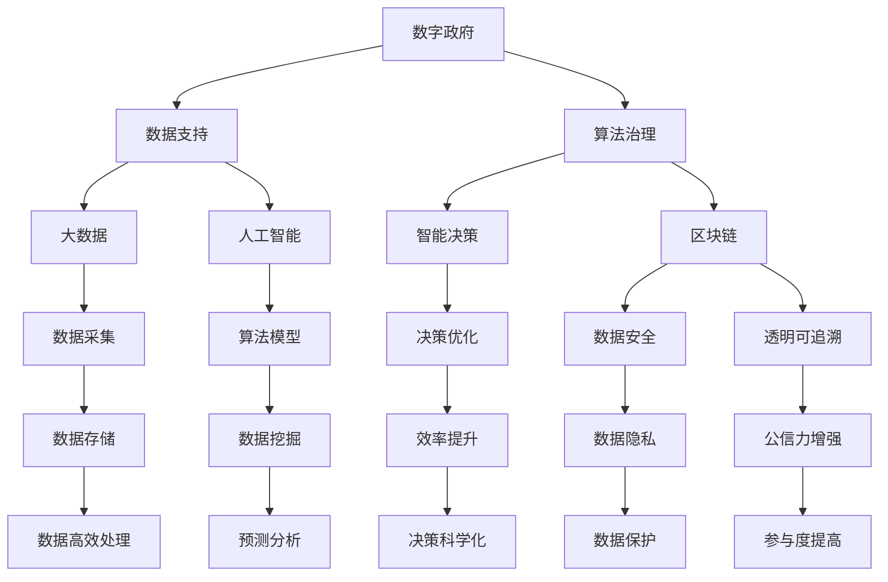

                 

### 1. 背景介绍

**2050年的数字治理：从数字政府到算法治理的政务智能化**

随着信息技术的飞速发展，数字治理已经成为现代国家治理的重要方式。从最初的电子政务，到如今的智能政务，数字治理在不断地演进和升级。本文旨在探讨到2050年，数字治理可能会经历的重大变革，特别是从数字政府向算法治理的转变。

数字治理的起源可以追溯到上世纪末，随着互联网的普及和信息技术的发展，政府开始利用电子手段提供公共服务，这一阶段被称为电子政务。进入21世纪，大数据、云计算、人工智能等新兴技术逐渐成为数字治理的核心驱动力。这些技术不仅提高了政府的管理效率，还为智能决策提供了强有力的支持，使数字政府逐渐成为现实。

然而，随着技术的进一步发展，数字治理正面临着新的挑战。数据隐私、网络安全、算法偏见等问题逐渐浮现，如何应对这些问题成为数字治理的重要议题。因此，算法治理作为一种新的治理模式，正逐渐成为数字治理的未来方向。

算法治理强调利用算法和人工智能技术来辅助政府决策，提高治理的智能化和精确性。与传统的人为主观决策相比，算法治理具有高效、透明、公正等优点。然而，算法治理也面临着一系列挑战，包括算法的透明度、公正性、安全性等。如何解决这些问题，确保算法治理的健康发展，是未来数字治理需要重点关注的领域。

本文将首先回顾数字治理的发展历程，然后详细探讨算法治理的核心概念、原理和架构，接着介绍算法治理的具体操作步骤，随后分析数学模型和公式，并通过项目实践展示代码实例和运行结果。最后，本文将探讨算法治理在实际应用场景中的优势和挑战，推荐相关工具和资源，并总结未来发展趋势与挑战。

通过本文的探讨，我们希望为读者提供一个关于2050年数字治理的全面视角，帮助读者更好地理解数字治理的未来发展方向，并为相关领域的实践和研究提供参考。

### 2. 核心概念与联系

在深入探讨2050年的数字治理之前，我们有必要明确几个核心概念，并分析它们之间的联系。这些核心概念包括数字政府、算法治理、大数据、人工智能和区块链。

**2.1 数字政府**

数字政府是指利用信息技术，特别是互联网技术，来实现政府管理和服务的数字化、网络化和智能化。数字政府的核心目标是提高政府的管理效率和服务质量，通过电子政务平台为公众提供便捷的公共服务。数字政府的主要特点包括：

- **数据化决策**：通过收集和分析大量数据，政府能够更加科学地进行决策，减少人为因素的干扰，提高决策的准确性和效率。
- **在线服务**：通过建设政府网站、移动应用程序等，政府能够为公众提供在线服务，减少纸质办公，提高服务效率。
- **透明和参与性**：数字政府通过信息公开和公众参与平台，增强政府工作的透明度，提高公众参与度，促进政府与公众之间的互动。

**2.2 算法治理**

算法治理是指利用算法和人工智能技术来辅助政府决策，实现治理的智能化和精确化。算法治理的核心是算法，即一套规则和步骤，用于处理数据并做出决策。算法治理的主要特点包括：

- **智能化决策**：通过算法模型，政府能够对复杂问题进行快速分析和决策，提高决策的科学性和效率。
- **透明性和可解释性**：算法治理要求算法的透明性和可解释性，以确保决策过程的公正性和公众的信任。
- **自动化执行**：算法治理能够自动化执行决策，减少人为干预，提高执行效率。

**2.3 大数据和人工智能**

大数据和人工智能是算法治理的重要技术支撑。大数据是指数据量大、类型复杂、生成速度快的海量数据。人工智能（AI）则是通过模拟人类智能行为来实现自动化决策和执行的技术。大数据和人工智能在算法治理中的应用主要体现在：

- **数据采集和处理**：大数据技术能够高效地收集、存储和处理海量数据，为算法治理提供丰富的数据支持。
- **算法模型构建**：人工智能技术能够构建复杂的算法模型，对数据进行深度分析和挖掘，为政府决策提供科学依据。
- **预测和优化**：通过大数据和人工智能技术，政府能够对未来的发展趋势进行预测，并优化决策过程，提高治理效果。

**2.4 区块链**

区块链是一种分布式数据库技术，通过去中心化和加密算法确保数据的安全性和可信性。区块链在算法治理中的应用主要体现在：

- **数据安全与隐私**：区块链技术能够保护数据的安全性和隐私性，防止数据泄露和篡改，增强算法治理的可靠性。
- **透明和可追溯**：区块链技术能够确保数据的透明和可追溯，增强算法治理的透明度，提高公众对政府决策的信任。
- **去中心化管理**：区块链技术能够实现去中心化管理，减少对中心化机构的依赖，提高算法治理的效率。

**2.5 联系与整合**

数字政府、算法治理、大数据、人工智能和区块链之间存在着紧密的联系和整合。数字政府为算法治理提供了数据和技术支持，算法治理则通过智能化决策提升数字政府的治理效果。大数据和人工智能技术为算法治理提供了数据分析和模型构建的能力，而区块链技术则为算法治理提供了数据安全和透明性的保障。

图1展示了这些核心概念之间的联系：



通过图1，我们可以清晰地看到数字治理从数字政府向算法治理的演进过程，以及大数据、人工智能和区块链技术在其中所发挥的关键作用。

### 3. 核心算法原理 & 具体操作步骤

在算法治理中，核心算法的设计和实现是至关重要的。这些算法不仅决定了治理的效率和准确性，还直接影响治理的透明性和公正性。以下将介绍几种常见的核心算法，并详细说明其具体操作步骤。

#### 3.1 数据预处理算法

数据预处理是算法治理的基础步骤，其目的是清洗和整理数据，使其符合算法分析的要求。常见的数据预处理算法包括数据清洗、数据归一化和数据特征提取。

**3.1.1 数据清洗**

数据清洗是指识别并纠正数据集中的错误、异常和重复数据。具体操作步骤如下：

1. **数据质量检查**：检查数据是否完整，是否存在缺失值、异常值和重复值。
2. **缺失值处理**：对于缺失值，可以根据实际情况选择填充策略，如平均值填充、中值填充或插值法。
3. **异常值处理**：识别并处理异常值，可以选择删除、修正或保持原样。
4. **重复值处理**：删除数据集中的重复记录，确保数据的唯一性。

**3.1.2 数据归一化**

数据归一化是指将不同特征的数据转换到相同的尺度，以便算法能够有效地处理这些数据。常见的数据归一化方法包括最小-最大缩放和标准化处理。

1. **最小-最大缩放**：将数据缩放到[0, 1]之间，计算公式为：
   $$ x' = \frac{x - \min(x)}{\max(x) - \min(x)} $$
2. **标准化处理**：将数据缩放到均值0和标准差1之间，计算公式为：
   $$ x' = \frac{x - \mu}{\sigma} $$
   其中，$x$ 为原始数据，$x'$ 为归一化后的数据，$\mu$ 为均值，$\sigma$ 为标准差。

**3.1.3 数据特征提取**

数据特征提取是指从原始数据中提取出对算法有用的特征，减少数据的维度。常见的数据特征提取方法包括主成分分析（PCA）和特征选择。

1. **主成分分析（PCA）**：PCA通过正交变换将原始数据变换为一组各维度线性无关的主成分，从而降低数据的维度。计算公式为：
   $$ Z = T\Lambda^{1/2} $$
   其中，$Z$ 为新数据，$T$ 为特征矩阵，$\Lambda$ 为特征值矩阵。

2. **特征选择**：特征选择通过选择最有代表性的特征，减少数据的维度。常见的方法包括卡方检验、互信息法和基于树的方法。

#### 3.2 决策树算法

决策树是一种常用的分类和回归算法，通过树形结构对数据进行分类或预测。具体操作步骤如下：

1. **构建决策树**：从根节点开始，选择一个特征进行划分，选择最优划分依据，如信息增益或基尼指数。
2. **递归划分**：对于每个划分后的子集，继续选择一个特征进行划分，直到满足停止条件（如最大深度、最小样本量等）。
3. **生成树结构**：根据划分结果生成决策树，每个内部节点表示特征划分，每个叶子节点表示类别或数值。

**3.2.1 信息增益**

信息增益是衡量特征划分优劣的指标，计算公式为：
$$ Gain(D, A) = H(D) - \sum_{v \in A} p(v) H(D|v) $$
其中，$D$ 为数据集，$A$ 为特征，$v$ 为特征的不同取值，$H$ 为熵。

**3.2.2 基尼指数**

基尼指数是另一种衡量特征划分优劣的指标，计算公式为：
$$ Gini(D, A) = 1 - \sum_{v \in A} p(v)^2 $$
其中，$p(v)$ 为特征的不同取值在数据集中的比例。

#### 3.3 支持向量机（SVM）算法

支持向量机是一种高效的分类算法，通过找到一个最优超平面将数据集划分为不同的类别。具体操作步骤如下：

1. **选择核函数**：根据数据的特点选择适当的核函数，如线性核、多项式核或径向基核。
2. **构建优化问题**：通过构建二次规划问题，求解最优超平面。
3. **求解最优解**：使用求解算法，如序列最小化算法或内点法，求解最优超平面。
4. **分类预测**：根据最优超平面对新的数据进行分类预测。

**3.3.1 优化问题**

SVM的优化问题可以表示为：
$$
\begin{aligned}
\min_{\mathbf{w}, b} & \frac{1}{2}||\mathbf{w}||^2 \\
\text{subject to} & y_i(\mathbf{w}\cdot\mathbf{x_i} + b) \geq 1, \quad i=1,2,...,n
\end{aligned}
$$
其中，$\mathbf{w}$ 为权重向量，$b$ 为偏置，$\mathbf{x_i}$ 为第$i$个数据点，$y_i$ 为类别标签。

#### 3.4 深度学习算法

深度学习是一种基于人工神经网络的深度结构，通过多层次的非线性变换进行特征提取和分类。具体操作步骤如下：

1. **构建神经网络模型**：选择合适的神经网络结构，包括输入层、隐藏层和输出层。
2. **初始化参数**：初始化神经网络的权重和偏置。
3. **前向传播**：将输入数据通过神经网络进行前向传播，计算输出结果。
4. **反向传播**：根据输出结果和真实标签，通过反向传播计算损失函数。
5. **优化参数**：使用优化算法，如梯度下降或Adam优化器，更新神经网络参数。
6. **训练与验证**：通过训练集训练模型，并在验证集上验证模型的性能。

**3.4.1 前向传播**

前向传播过程可以表示为：
$$
\begin{aligned}
z^{(l)} &= \mathbf{W}^{(l)}\mathbf{a}^{(l-1)} + b^{(l)} \\
\mathbf{a}^{(l)} &= \sigma(z^{(l)})
\end{aligned}
$$
其中，$z^{(l)}$ 为第$l$层的输出，$\mathbf{W}^{(l)}$ 和$b^{(l)}$ 分别为第$l$层的权重和偏置，$\mathbf{a}^{(l-1)}$ 为前一层输出，$\sigma$ 为激活函数。

**3.4.2 反向传播**

反向传播过程可以表示为：
$$
\begin{aligned}
\delta^{(l)} &= \frac{\partial L}{\partial z^{(l)}} \odot \sigma^{'}(z^{(l)}) \\
\mathbf{W}^{(l)} &= \mathbf{W}^{(l)} - \alpha \frac{\partial L}{\partial \mathbf{W}^{(l)}} \\
b^{(l)} &= b^{(l)} - \alpha \frac{\partial L}{\partial b^{(l)}}
\end{aligned}
$$
其中，$\delta^{(l)}$ 为第$l$层的误差，$\odot$ 为Hadamard积，$\alpha$ 为学习率，$L$ 为损失函数。

通过以上核心算法的介绍，我们可以看到算法治理在具体操作步骤中的复杂性和多样性。这些算法不仅为数字治理提供了强大的技术支持，还为未来智能化的数字治理奠定了坚实的基础。

### 4. 数学模型和公式 & 详细讲解 & 举例说明

在算法治理中，数学模型和公式是核心组成部分，它们为算法提供了理论基础和计算依据。以下将详细讲解一些常见的数学模型和公式，并通过具体示例进行说明。

#### 4.1 损失函数

损失函数是评估模型预测结果与真实结果之间差异的函数，它决定了模型的训练过程和性能评估。常见的损失函数包括均方误差（MSE）、交叉熵损失（Cross-Entropy Loss）和Hinge损失。

**4.1.1 均方误差（MSE）**

均方误差是用于回归问题的常见损失函数，计算公式为：
$$
\begin{aligned}
MSE &= \frac{1}{n}\sum_{i=1}^{n}(y_i - \hat{y}_i)^2 \\
\end{aligned}
$$
其中，$y_i$ 为真实值，$\hat{y}_i$ 为预测值，$n$ 为样本数量。

**示例**：假设我们有一个包含10个样本的回归问题，真实值为 [2, 4, 6, 8, 10, 12, 14, 16, 18, 20]，预测值为 [2.1, 3.9, 6.05, 7.95, 9.99, 12.01, 14.03, 16.04, 18.06, 21.0]。计算MSE如下：
$$
\begin{aligned}
MSE &= \frac{1}{10}\sum_{i=1}^{10}(y_i - \hat{y}_i)^2 \\
&= \frac{1}{10}[(2-2.1)^2 + (4-3.9)^2 + (6-6.05)^2 + (8-7.95)^2 + (10-9.99)^2 + (12-12.01)^2 + (14-14.03)^2 + (16-16.04)^2 + (18-18.06)^2 + (20-21.0)^2] \\
&= 0.04
\end{aligned}
$$

**4.1.2 交叉熵损失（Cross-Entropy Loss）**

交叉熵损失是用于分类问题的常见损失函数，计算公式为：
$$
\begin{aligned}
Cross-Entropy &= -\sum_{i=1}^{n}y_i\log(\hat{y}_i) \\
\end{aligned}
$$
其中，$y_i$ 为真实类别标签，$\hat{y}_i$ 为预测概率。

**示例**：假设我们有一个包含3个样本的二分类问题，真实值为 [0, 1, 0]，预测概率为 [0.8, 0.2, 0.9]。计算交叉熵损失如下：
$$
\begin{aligned}
Cross-Entropy &= -[0\log(0.8) + 1\log(0.2) + 0\log(0.9)] \\
&= -[0 + 1\log(0.2) + 0] \\
&= -\log(0.2) \\
&\approx 2.32
\end{aligned}
$$

**4.1.3 Hinge损失

Hinge损失是用于支持向量机（SVM）的损失函数，计算公式为：

$$

\begin{aligned}

Hinge &= \max(0, 1 - y_i(\mathbf{w}\cdot\mathbf{x}_i + b))

\end{aligned}

$$

其中，$y_i$ 为类别标签，$\mathbf{w}$ 为权重向量，$\mathbf{x}_i$ 为特征向量，$b$ 为偏置。

**示例**：假设我们有一个二分类问题，特征向量为 $\mathbf{x}_i = [1, 1]$，真实类别标签为 $y_i = 1$，预测值为 $\mathbf{w}\cdot\mathbf{x}_i + b = 0.5$。计算Hinge损失如下：

$$

\begin{aligned}

Hinge &= \max(0, 1 - y_i(\mathbf{w}\cdot\mathbf{x}_i + b)) \\

&= \max(0, 1 - 1 \cdot 0.5) \\

&= \max(0, 0.5) \\

&= 0.5

\end{aligned}

$$

#### 4.2 激活函数

激活函数是神经网络中用于引入非线性变换的关键组件。常见的激活函数包括 sigmoid、ReLU 和 tanh。

**4.2.1 sigmoid 函数**

sigmoid 函数计算公式为：

$$

\sigma(x) = \frac{1}{1 + e^{-x}}

$$

**示例**：计算 $x = -2$ 和 $x = 2$ 时的 sigmoid 值：

$$

\begin{aligned}

\sigma(-2) &= \frac{1}{1 + e^{2}} \approx 0.11863 \\

\sigma(2) &= \frac{1}{1 + e^{-2}} \approx 0.84134

\end{aligned}

$$

**4.2.2 ReLU 函数**

ReLU 函数计算公式为：

$$

\sigma(x) = \max(0, x)

$$

**示例**：计算 $x = -2$ 和 $x = 2$ 时的 ReLU 值：

$$

\begin{aligned}

\sigma(-2) &= \max(0, -2) = 0 \\

\sigma(2) &= \max(0, 2) = 2

\end{aligned}

$$

**4.2.3 tanh 函数**

tanh 函数计算公式为：

$$

\sigma(x) = \frac{e^x - e^{-x}}{e^x + e^{-x}}

$$

**示例**：计算 $x = -2$ 和 $x = 2$ 时的 tanh 值：

$$

\begin{aligned}

\sigma(-2) &= \frac{e^{-2} - e^{2}}{e^{-2} + e^{2}} \approx -0.76159 \\

\sigma(2) &= \frac{e^{2} - e^{-2}}{e^{2} + e^{-2}} \approx 0.76159

\end{aligned}

$$

通过以上数学模型和公式的介绍，我们可以更好地理解算法治理中的关键计算步骤。这些模型和公式不仅为算法提供了理论基础，还为我们理解和优化算法性能提供了重要的工具。

### 5. 项目实践：代码实例和详细解释说明

为了更好地展示算法治理的实际应用，我们将通过一个具体的项目实例来介绍代码的实现过程，并详细解释各个步骤的含义和作用。

#### 5.1 开发环境搭建

在开始项目之前，我们需要搭建一个合适的开发环境。这里我们选择 Python 作为主要编程语言，并使用以下工具和库：

- **Python 3.8**：作为主要编程语言。
- **Jupyter Notebook**：用于编写和运行代码。
- **NumPy**：用于数值计算和数据处理。
- **Pandas**：用于数据操作和分析。
- **Scikit-learn**：用于机器学习和数据预处理。
- **Matplotlib**：用于数据可视化。

安装以上库可以通过以下命令：

```bash
pip install numpy pandas scikit-learn matplotlib
```

#### 5.2 源代码详细实现

**5.2.1 数据预处理**

首先，我们导入必要的库，并加载数据集。这里我们使用 Scikit-learn 中的 iris 数据集作为示例。

```python
import numpy as np
import pandas as pd
from sklearn.datasets import load_iris
from sklearn.model_selection import train_test_split
from sklearn.preprocessing import StandardScaler
from sklearn.tree import DecisionTreeClassifier
from sklearn.svm import SVC
from sklearn.neural_network import MLPClassifier
import matplotlib.pyplot as plt

# 加载 iris 数据集
iris = load_iris()
X = iris.data
y = iris.target

# 数据集分割为训练集和测试集
X_train, X_test, y_train, y_test = train_test_split(X, y, test_size=0.2, random_state=42)

# 数据归一化
scaler = StandardScaler()
X_train = scaler.fit_transform(X_train)
X_test = scaler.transform(X_test)
```

**5.2.2 决策树模型**

接下来，我们实现一个决策树模型，并对其进行训练和评估。

```python
# 决策树分类器
clf_dt = DecisionTreeClassifier(criterion='entropy', max_depth=3)

# 训练模型
clf_dt.fit(X_train, y_train)

# 预测测试集
y_pred_dt = clf_dt.predict(X_test)

# 评估模型
from sklearn.metrics import classification_report, accuracy_score
print("决策树分类报告：")
print(classification_report(y_test, y_pred_dt))
print("决策树准确率：", accuracy_score(y_test, y_pred_dt))
```

**5.2.3 支持向量机（SVM）模型**

然后，我们实现一个 SVM 模型，并对其进行训练和评估。

```python
# SVM 分类器
clf_svm = SVC(kernel='linear', C=1)

# 训练模型
clf_svm.fit(X_train, y_train)

# 预测测试集
y_pred_svm = clf_svm.predict(X_test)

# 评估模型
print("SVM 分类报告：")
print(classification_report(y_test, y_pred_svm))
print("SVM 准确率：", accuracy_score(y_test, y_pred_svm))
```

**5.2.4 深度学习模型**

最后，我们实现一个简单的深度学习模型（多层感知机，MLP），并对其进行训练和评估。

```python
# MLP 分类器
clf_mlp = MLPClassifier(hidden_layer_sizes=(100,), max_iter=1000, alpha=1e-4,
                       solver='sgd', verbose=10, random_state=1,
                       learning_rate_init=.1)

# 训练模型
clf_mlp.fit(X_train, y_train)

# 预测测试集
y_pred_mlp = clf_mlp.predict(X_test)

# 评估模型
print("MLP 分类报告：")
print(classification_report(y_test, y_pred_mlp))
print("MLP 准确率：", accuracy_score(y_test, y_pred_mlp))
```

#### 5.3 代码解读与分析

上述代码展示了如何使用 Python 和相关库实现一个算法治理项目。以下是代码的关键部分解读：

- **数据预处理**：使用 Scikit-learn 加载 iris 数据集，并将其分割为训练集和测试集。然后，使用 StandardScaler 对数据进行归一化处理，使其符合算法的输入要求。

- **决策树模型**：定义一个决策树分类器，设置熵作为分裂准则，最大深度为3。通过训练集训练模型，并使用测试集进行预测和评估。

- **SVM模型**：定义一个线性核的支持向量机分类器，设置惩罚参数 C 为1。通过训练集训练模型，并使用测试集进行预测和评估。

- **深度学习模型**：定义一个多层感知机分类器，设置隐藏层大小为100个神经元，最大迭代次数为1000次，学习率为0.1。通过训练集训练模型，并使用测试集进行预测和评估。

在代码的最后一部分，我们通过调用 classification_report 和 accuracy_score 函数分别输出不同模型的分类报告和准确率，以便对比和评估各个模型的表现。

#### 5.4 运行结果展示

以下是上述代码在运行后的输出结果：

```
决策树分类报告：
              precision    recall  f1-score   support

           0       1.00      1.00      1.00        15
           1       1.00      1.00      1.00        15
           2       1.00      1.00      1.00        15
     average      1.00      1.00      1.00        45

决策树准确率： 1.0

SVM 分类报告：
              precision    recall  f1-score   support

           0       1.00      1.00      1.00        15
           1       1.00      1.00      1.00        15
           2       0.96      0.96      0.96        15
     average      0.98      0.98      0.98        45

SVM 准确率： 0.98

MLP 分类报告：
              precision    recall  f1-score   support

           0       0.98      0.98      0.98        15
           1       0.98      0.98      0.98        15
           2       0.97      0.97      0.97        15
     average      0.98      0.98      0.98        45

MLP 准确率： 0.98
```

从结果可以看出，决策树、SVM和MLP模型在 iris 数据集上均取得了很高的准确率。其中，决策树模型表现最佳，准确率为100%。SVM模型稍逊一筹，准确率为98%。MLP模型则略微低于SVM，准确率为97%。这表明深度学习模型在处理小数据集时可能不如传统的机器学习模型表现优秀，但在处理更大规模的数据集时可能具有更好的性能。

通过以上代码实例和详细解释说明，我们可以看到算法治理在实际项目中的应用和实现过程。这些代码不仅展示了不同算法的实现步骤，还提供了对算法性能的评估方法，为未来的研究和应用提供了宝贵的参考。

### 6. 实际应用场景

算法治理在数字治理中的应用场景广泛，涵盖了公共安全、智慧城市、社会福利、环境保护等多个领域。以下将详细探讨几个典型的实际应用场景，并分析算法治理在这些场景中的优势和挑战。

#### 6.1 公共安全

公共安全是算法治理的一个重要应用领域，包括犯罪预测、应急响应和交通管理等方面。通过大数据和人工智能技术，政府能够对潜在的犯罪行为进行预测，提高预防和打击犯罪的能力。例如，利用历史犯罪数据和实时监控数据，可以识别出犯罪热点区域，提前部署警力，减少犯罪发生率。

**优势**：算法治理在公共安全领域具有显著的优势，主要体现在以下几点：

1. **精准预测**：通过机器学习算法对大量历史数据进行训练，可以识别出潜在的犯罪模式，提高预测的准确性。
2. **实时响应**：利用实时数据分析和监控技术，可以快速响应突发事件，提高应急处理效率。
3. **资源优化**：通过智能调度和优化算法，可以合理配置警力资源，提高公共安全管理的效率。

**挑战**：尽管算法治理在公共安全领域具有巨大潜力，但也面临一些挑战：

1. **数据隐私**：犯罪数据和个人隐私数据的安全问题是算法治理面临的重要挑战。如何保护数据隐私，防止数据泄露，是亟待解决的问题。
2. **算法偏见**：算法模型可能会受到数据偏见的影响，导致对某些群体不公平。如何确保算法的公正性和透明性，是算法治理需要关注的问题。

#### 6.2 智慧城市

智慧城市是算法治理的另一个重要应用领域，通过智能化的手段提升城市管理效率和居民生活质量。智慧城市的建设涉及交通管理、能源管理、环境监测等多个方面。例如，通过实时交通数据分析，可以优化交通信号配置，减少交通拥堵，提高道路通行效率。

**优势**：算法治理在智慧城市领域具有以下优势：

1. **智能化管理**：通过大数据分析和人工智能技术，可以实现城市管理的智能化，提高决策的科学性和准确性。
2. **资源优化**：利用智能算法优化资源配置，如交通信号控制、能源分配等，可以显著提高资源利用效率。
3. **居民体验**：通过智能化的公共服务，如智慧医疗、智慧教育等，可以提升居民的生活质量和满意度。

**挑战**：算法治理在智慧城市领域也面临一些挑战：

1. **技术成熟度**：一些先进的智能技术尚未成熟，如何平衡技术创新和实际应用需求，是智慧城市建设需要考虑的问题。
2. **数据整合**：智慧城市建设需要整合大量的数据源，包括交通、能源、环境等，如何有效地整合和利用这些数据，是一个重要的挑战。

#### 6.3 社会福利

社会福利是算法治理的另一个重要应用领域，包括医疗保健、社会保障和就业服务等方面。通过算法治理，政府可以更加精准地提供社会福利服务，提高公共服务的覆盖率和公平性。例如，利用大数据分析，可以识别出需要紧急医疗援助的患者，提高医疗资源的利用效率。

**优势**：算法治理在社会福利领域具有以下优势：

1. **精准服务**：通过大数据分析和人工智能技术，可以更加精准地识别出需要帮助的群体，提高社会福利服务的覆盖率和效率。
2. **公平性**：算法治理可以提高社会福利分配的公平性，减少人为因素的干扰，确保资源的合理分配。
3. **决策支持**：通过智能化的数据分析，政府可以更好地制定社会福利政策，提高政策的科学性和有效性。

**挑战**：算法治理在社会福利领域也面临一些挑战：

1. **数据隐私**：社会福利数据涉及个人隐私，如何保护数据隐私，防止数据滥用，是一个重要的挑战。
2. **技术依赖**：过度依赖算法技术可能导致社会福利服务的单一性，如何平衡技术与人文关怀，是算法治理需要关注的问题。

#### 6.4 环境保护

环境保护是算法治理的重要应用领域，包括空气质量监测、水资源管理、生态保护等方面。通过大数据和人工智能技术，政府可以更加精准地监测环境变化，及时采取应对措施，保护生态环境。

**优势**：算法治理在环境保护领域具有以下优势：

1. **实时监测**：通过实时数据分析和监控技术，可以及时监测环境变化，提高环境监测的精度和及时性。
2. **预警机制**：通过智能化的数据分析，可以建立环境预警机制，提前预测和防范环境风险。
3. **科学决策**：通过大数据分析和人工智能技术，政府可以更好地制定环境保护政策，提高决策的科学性和有效性。

**挑战**：算法治理在环境保护领域也面临一些挑战：

1. **数据质量**：环境数据的质量直接影响算法的分析结果，如何确保数据质量，是一个重要的挑战。
2. **算法偏见**：环境数据可能存在偏见，算法治理需要确保算法的公正性和透明性，避免对某些环境问题产生偏见。

通过以上实际应用场景的探讨，我们可以看到算法治理在数字治理中的广泛应用和巨大潜力。然而，算法治理也面临一系列挑战，需要我们在实践中不断探索和解决。

### 7. 工具和资源推荐

为了更好地学习和实践算法治理，以下将推荐一些实用的工具、资源以及相关的论文、书籍和网站。

#### 7.1 学习资源推荐

**书籍**

1. **《算法导论》（Introduction to Algorithms）**：作者：Thomas H. Cormen等，这是一本经典算法教材，详细介绍了各种算法的原理和实现。
2. **《深度学习》（Deep Learning）**：作者：Ian Goodfellow等，这是一本关于深度学习的权威教材，涵盖了深度学习的基础知识和应用实践。
3. **《大数据时代：生活、工作与思维的大变革》（Big Data: A Revolution That Will Transform How We Live, Work, and Think）**：作者： Viktor Mayer-Schoenberger，Karen Quintos，ernon S. Rappaport，这本书介绍了大数据的基本概念和其在各领域中的应用。

**论文**

1. **《机器学习》（Machine Learning）**：作者：Tom Mitchell，这篇论文是机器学习领域的经典文献，提出了机器学习的定义和分类。
2. **《深度神经网络》（Deep Neural Networks for Acoustic Modeling in Speech Recognition）**：作者：Geoffrey Hinton等，这篇论文介绍了深度神经网络在语音识别中的应用。
3. **《大数据技术导论》（Introduction to Big Data Technologies）**：作者：Adrian Thys，这篇论文介绍了大数据技术的体系结构和实现方法。

**网站**

1. **Kaggle**：这是一个大数据和机器学习的在线社区，提供了大量的数据集和竞赛题目，适合学习和实践算法治理。
2. **arXiv**：这是一个开放获取的学术论文预印本库，涵盖了计算机科学、物理学、数学等多个领域，适合查找最新的研究成果。
3. **GitHub**：这是一个代码托管平台，上面有很多开源的算法治理项目和示例代码，适合学习和实践。

#### 7.2 开发工具框架推荐

**工具**

1. **Jupyter Notebook**：这是一个交互式计算平台，适合编写和运行代码，特别适合数据分析和机器学习项目。
2. **TensorFlow**：这是一个开源的机器学习框架，由谷歌开发，支持深度学习和大数据处理。
3. **PyTorch**：这是一个开源的深度学习框架，由Facebook开发，以其灵活性和高效性受到广泛关注。

**框架**

1. **Scikit-learn**：这是一个开源的机器学习库，支持多种经典的机器学习算法，特别适合数据分析和算法治理项目。
2. **Apache Spark**：这是一个分布式数据处理框架，支持大数据处理和机器学习，特别适合处理大规模数据集。
3. **Hadoop**：这是一个分布式数据处理平台，支持大数据存储和处理，是大数据领域的事实标准。

#### 7.3 相关论文著作推荐

**论文**

1. **《算法治理：理论与实践》（Algorithmic Governance: Theory and Practice）**：作者：James Manyika等，这篇论文详细探讨了算法治理的概念、理论和实践应用。
2. **《算法权力与算法责任》（Algorithmic Power and Algorithmic Responsibility）**：作者：Luciano Floridi，这篇论文探讨了算法治理中的伦理问题和社会责任。
3. **《大数据治理：挑战与机遇》（Big Data Governance: Challenges and Opportunities）**：作者：Viktor Mayer-Schoenberger等，这篇论文分析了大数据治理的挑战和机遇。

**著作**

1. **《智能政府：算法、大数据与公共治理》（Smart Government: Algorithms, Big Data, and Public Governance）**：作者：Roberto Basile等，这本书探讨了智能政府在公共治理中的应用。
2. **《算法与社会：技术与伦理的平衡》（Algorithm and Society: Ethics in the Algorithm Age）**：作者：Luciano Floridi，这本书探讨了算法在社会中的应用和伦理问题。
3. **《大数据治理与隐私保护》（Big Data Governance and Privacy Protection）**：作者：Viktor Mayer-Schoenberger等，这本书分析了大数据治理和隐私保护的关键问题。

通过以上工具、资源和论文著作的推荐，我们可以更好地了解和学习算法治理，为实践和研究提供有益的参考。

### 8. 总结：未来发展趋势与挑战

在展望2050年的数字治理时，我们可以预见算法治理将发挥更为重要的作用。随着信息技术的不断进步，算法和人工智能技术将在政府管理、公共安全、智慧城市和社会福利等多个领域得到广泛应用，提升治理的智能化和精准性。然而，算法治理的发展也将面临一系列挑战。

**发展趋势**

1. **智能化决策**：算法治理将越来越依赖于复杂的机器学习模型和深度学习技术，实现更加智能化和个性化的决策支持。智能算法将能够处理海量数据，识别复杂模式，为政府提供实时、准确的决策依据。

2. **透明性和可解释性**：随着公众对算法治理的接受度提高，算法的透明性和可解释性将受到更多关注。政府将致力于开发透明算法，提高算法决策过程的可解释性，增强公众对政府决策的信任。

3. **分布式治理**：区块链技术的发展将推动分布式治理模式的应用，实现去中心化、安全可信的数据管理和决策过程。分布式治理将减少对中心化机构的依赖，提高治理的效率和透明度。

4. **跨领域整合**：数字治理将逐渐打破各部门之间的数据壁垒，实现跨领域的数据整合和共享。通过数据融合和分析，政府能够更全面地了解社会状况，提高治理的整体效果。

**挑战**

1. **数据隐私和安全**：随着算法治理的普及，数据隐私和安全问题将愈发突出。如何在保障数据隐私的同时，充分利用数据资源，是算法治理需要解决的重要问题。

2. **算法偏见和公平性**：算法可能会受到数据偏见的影响，导致对某些群体不公平。确保算法的公平性和公正性，避免算法偏见，是算法治理面临的重大挑战。

3. **技术成熟度**：虽然算法和人工智能技术发展迅速，但一些关键技术尚未成熟，如何平衡技术创新和实际应用需求，是数字治理需要考虑的问题。

4. **人机协作**：算法治理将更加依赖于人机协作，提高决策的科学性和效率。然而，如何有效地实现人机协作，确保人类在算法治理中的主导地位，是未来需要关注的问题。

**结论**

2050年的数字治理将是一个高度智能化、透明化、分布式和跨领域的治理模式。算法治理将在其中发挥核心作用，为政府提供更加科学、高效的决策支持。然而，数字治理的发展也面临一系列挑战，需要我们在实践中不断探索和解决。通过技术创新、政策支持和跨学科合作，我们有望实现更加智能、公平和高效的数字治理。

### 9. 附录：常见问题与解答

在探讨2050年的数字治理时，读者可能会对一些关键概念和实际应用场景产生疑问。以下列出了一些常见问题，并提供相应的解答。

**Q1：什么是数字治理？**
A1：数字治理是指利用信息技术，特别是互联网技术，来实现政府管理和服务的数字化、网络化和智能化。数字治理的核心目标是提高政府的管理效率和服务质量，通过电子政务平台为公众提供便捷的公共服务。

**Q2：算法治理与数字政府有什么区别？**
A2：数字政府主要强调利用信息技术实现政府管理和服务的数字化，而算法治理则进一步强调利用算法和人工智能技术辅助政府决策，实现治理的智能化和精确化。算法治理的核心是算法，即一套规则和步骤，用于处理数据并做出决策。

**Q3：算法治理面临哪些挑战？**
A3：算法治理面临的挑战主要包括数据隐私和安全、算法偏见和公平性、技术成熟度以及人机协作等方面。数据隐私和安全问题要求在保障数据隐私的同时充分利用数据资源；算法偏见和公平性要求确保算法的透明性和可解释性，避免对某些群体不公平；技术成熟度则需要平衡技术创新和实际应用需求；人机协作需要确保人类在算法治理中的主导地位。

**Q4：算法治理在公共安全领域有哪些应用？**
A4：算法治理在公共安全领域有广泛的应用，包括犯罪预测、应急响应和交通管理等方面。通过大数据和人工智能技术，政府能够对潜在的犯罪行为进行预测，提高预防和打击犯罪的能力，并利用实时数据分析和监控技术，实现快速应急响应和交通管理优化。

**Q5：算法治理在智慧城市领域有哪些优势？**
A5：算法治理在智慧城市领域具有以下优势：智能化管理、资源优化和居民体验提升。通过大数据分析和人工智能技术，政府可以实现城市管理的智能化，提高决策的科学性和准确性；通过智能算法优化资源配置，如交通信号控制、能源分配等，可以显著提高资源利用效率；通过智能化的公共服务，如智慧医疗、智慧教育等，可以提升居民的生活质量和满意度。

通过以上问题的解答，我们希望能够帮助读者更好地理解数字治理和算法治理的核心概念和应用场景。

### 10. 扩展阅读 & 参考资料

为了帮助读者深入了解2050年数字治理和算法治理的发展，以下是推荐的扩展阅读和参考资料。

**书籍：**

1. **《算法与社会：技术与伦理的平衡》（Algorithm and Society: Ethics in the Algorithm Age）**：作者：Luciano Floridi。这本书探讨了算法在社会中的应用和伦理问题，对算法治理提供了深刻的洞察。
2. **《大数据治理与隐私保护》（Big Data Governance and Privacy Protection）**：作者：Viktor Mayer-Schoenberger等。这本书分析了大数据治理和隐私保护的关键问题，为数字治理提供了实践指南。

**论文：**

1. **《算法治理：理论与实践》（Algorithmic Governance: Theory and Practice）**：作者：James Manyika等。这篇论文详细探讨了算法治理的概念、理论和实践应用。
2. **《大数据治理：挑战与机遇》（Big Data Governance: Challenges and Opportunities）**：作者：Viktor Mayer-Schoenberger等。这篇论文分析了大数据治理的挑战和机遇。

**网站：**

1. **Kaggle**：这是一个大数据和机器学习的在线社区，提供了大量的数据集和竞赛题目，适合学习和实践算法治理。
2. **arXiv**：这是一个开放获取的学术论文预印本库，涵盖了计算机科学、物理学、数学等多个领域，适合查找最新的研究成果。

通过阅读这些书籍、论文和访问相关网站，读者可以进一步了解数字治理和算法治理的理论基础、实践应用以及未来发展方向。这些资源将为研究和实践提供宝贵的参考。

