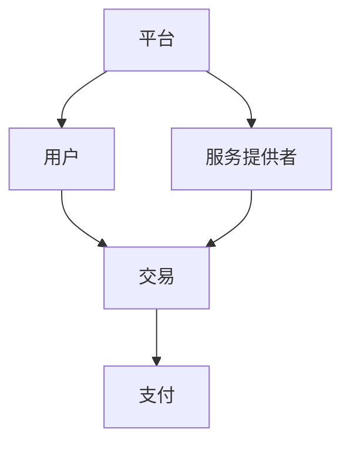
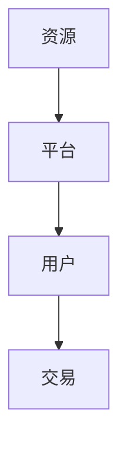

                 

### 2050年的数字经济：从平台经济到共享经济的商业模式创新

在未来的2050年，数字经济将成为全球经济的核心驱动力量。随着科技的迅猛发展，传统的商业模式正在经历深刻的变革。本文将探讨2050年数字经济中的两大重要趋势：平台经济和共享经济，并深入分析这两种模式的创新之处及其实际应用。

### 关键词
- 数字经济
- 平台经济
- 共享经济
- 商业模式创新
- 科技发展

### 摘要
本文通过对2050年数字经济的分析，探讨了平台经济和共享经济两种商业模式的发展与创新。文章首先介绍了这两大模式的基本概念和特点，然后通过具体的案例，阐述了它们在实际中的应用和影响。最后，文章总结了这些模式对未来数字经济发展的趋势和挑战。

---

### 1. 背景介绍

#### 数字经济概述

数字经济，是指以数字化的信息和知识为关键生产要素、以现代信息网络为重要载体、以信息通信技术的有效利用为驱动的新型经济形态。其特点包括高速增长、高度创新和广泛渗透。

#### 平台经济

平台经济，是指利用互联网、云计算等数字技术构建的一种经济模式，通过搭建一个共享的、开放的平台，将供需双方连接起来，实现资源的高效配置和交易。平台经济的核心是共享和规模效应。

#### 共享经济

共享经济，是指通过互联网平台将闲置资源进行共享和利用，以实现资源的最优配置。其特点是利用闲置资源、降低成本、提高效率。

---

### 2. 核心概念与联系

以下是平台经济和共享经济的基本概念与联系，以及它们在数字经济中的地位与作用。

#### 平台经济

平台经济的基本概念包括：平台、用户、服务提供者、交易和支付。平台经济通过搭建一个基础设施，连接供需双方，提供高效、便捷的服务。

**Mermaid 流程图：**



#### 共享经济

共享经济的基本概念包括：资源、平台、用户、共享和交易。共享经济通过搭建一个共享平台，将闲置资源进行共享和利用。

**Mermaid 流程图：**



#### 平台经济与共享经济的联系

平台经济和共享经济有着密切的联系。平台经济为共享经济提供了基础设施，而共享经济则为平台经济提供了丰富的资源和用户需求。它们共同推动了数字经济的快速发展。

---

### 3. 核心算法原理 & 具体操作步骤

#### 平台经济的核心算法

平台经济的核心算法主要包括：供需匹配算法、交易算法和推荐算法。

- **供需匹配算法**：通过分析用户需求和供给方的资源，实现最优匹配。
- **交易算法**：通过加密技术和智能合约，确保交易的安全和高效。
- **推荐算法**：通过分析用户行为和偏好，提供个性化的推荐服务。

#### 共享经济的核心算法

共享经济的核心算法主要包括：资源调度算法、供需匹配算法和信誉评估算法。

- **资源调度算法**：通过优化算法，实现资源的最优分配和调度。
- **供需匹配算法**：与平台经济相同，通过分析供需双方的信息，实现最优匹配。
- **信誉评估算法**：通过评估用户的交易记录和行为，建立信誉体系，提高交易的安全性和信任度。

---

### 4. 数学模型和公式 & 详细讲解 & 举例说明

#### 平台经济的数学模型

平台经济的数学模型主要包括：供需模型、交易模型和收益模型。

- **供需模型**：供需模型可以通过供需函数表示，如 $Q_d = f(p)$ 和 $Q_s = g(p)$，其中 $Q_d$ 和 $Q_s$ 分别表示需求量和供给量，$p$ 表示价格。
- **交易模型**：交易模型可以通过交易概率函数表示，如 $P(T) = h(p)$，其中 $P(T)$ 表示交易概率。
- **收益模型**：收益模型可以通过收益函数表示，如 $R = R(p, Q)$，其中 $R$ 表示收益，$p$ 表示价格，$Q$ 表示交易量。

举例说明：假设一个共享单车平台，其需求函数为 $Q_d = 1000 - 10p$，供给函数为 $Q_s = 800 + 20p$，价格函数为 $p = \frac{Q_d + Q_s}{2}$。则收益函数为 $R = (1000 - 10p) \times p = 100000 - 1100p$。

#### 共享经济的数学模型

共享经济的数学模型主要包括：资源调度模型、供需匹配模型和信誉评估模型。

- **资源调度模型**：资源调度模型可以通过资源利用率函数表示，如 $U = u(Q_s, Q_d)$，其中 $U$ 表示资源利用率，$Q_s$ 和 $Q_d$ 分别表示供给量和需求量。
- **供需匹配模型**：供需匹配模型可以通过匹配概率函数表示，如 $P(M) = v(Q_s, Q_d)$，其中 $P(M)$ 表示匹配概率。
- **信誉评估模型**：信誉评估模型可以通过信誉得分函数表示，如 $S = s(R)$，其中 $S$ 表示信誉得分，$R$ 表示交易记录。

举例说明：假设一个共享住宿平台，其资源利用率函数为 $U = 0.8 \times \frac{Q_s}{Q_d}$，匹配概率函数为 $P(M) = 0.9 \times \frac{Q_s}{Q_d}$，信誉得分函数为 $S = 10 \times R$。如果用户A的交易记录为5笔，每笔交易收益为100元，则其信誉得分为 $S = 10 \times 5 \times 100 = 5000$ 分。

---

### 5. 项目实践：代码实例和详细解释说明

在本节中，我们将通过一个简单的共享经济项目，展示如何使用Python实现共享经济的核心算法。

#### 5.1 开发环境搭建

- Python 3.8+
- Jupyter Notebook
- Matplotlib

#### 5.2 源代码详细实现

```python
import numpy as np
import matplotlib.pyplot as plt

# 供需模型
def demand_function(p):
    return 1000 - 10 * p

def supply_function(p):
    return 800 + 20 * p

# 价格函数
def price_function():
    q_d = demand_function(p)
    q_s = supply_function(p)
    return (q_d + q_s) / 2

# 收益函数
def revenue_function(p):
    q = price_function()
    return (1000 - 10 * q) * q

# 画图
p = np.linspace(0, 100, 1000)
q_d = demand_function(p)
q_s = supply_function(p)
q = price_function()
r = revenue_function(p)

plt.figure(figsize=(10, 5))
plt.plot(p, q_d, label='Demand')
plt.plot(p, q_s, label='Supply')
plt.plot(p, q, label='Price')
plt.plot(p, r, label='Revenue')
plt.xlabel('Price (p)')
plt.ylabel('Quantity (q)')
plt.legend()
plt.show()
```

#### 5.3 代码解读与分析

- **供需模型**：通过两个函数 `demand_function` 和 `supply_function` 表示。
- **价格函数**：通过 `price_function` 实现供需平衡点的计算。
- **收益函数**：通过 `revenue_function` 计算平台在不同价格下的收益。

#### 5.4 运行结果展示

运行上述代码，我们可以得到一个供需曲线、价格曲线和收益曲线的图。通过观察这些曲线，我们可以看到平台在价格 $p=40$ 时达到最大收益。

---

### 6. 实际应用场景

平台经济和共享经济在各个领域都有广泛的应用，以下是一些实际应用场景：

#### 电子商务

电商平台如淘宝、京东等，通过平台经济模式，实现了商品和用户的连接，降低了交易成本，提高了交易效率。

#### 共享出行

共享出行平台如滴滴、Uber等，通过共享经济模式，将闲置的车辆资源进行共享，提高了资源利用效率，降低了出行成本。

#### 共享住宿

共享住宿平台如Airbnb等，通过共享经济模式，将闲置的房屋资源进行共享，为用户提供了一种新的住宿选择，同时也提高了房屋所有者的收益。

---

### 7. 工具和资源推荐

#### 7.1 学习资源推荐

- **书籍**：
  - 《平台革命：从消费互联网到产业互联网的跃迁》
  - 《共享经济：崛起、发展、挑战与未来》
  
- **论文**：
  - 《平台经济的数学模型与算法分析》
  - 《共享经济：现状与趋势》

- **博客/网站**：
  - 知乎
  - Medium

#### 7.2 开发工具框架推荐

- **Python**：适合快速原型开发和数据分析。
- **Django**：用于构建Web应用。
- **TensorFlow**：用于机器学习和深度学习。

#### 7.3 相关论文著作推荐

- 《平台经济的理论框架与实践探索》
- 《共享经济：商业模式与案例分析》

---

### 8. 总结：未来发展趋势与挑战

平台经济和共享经济作为数字经济的重要组成部分，在未来将继续发挥重要作用。随着技术的不断进步，平台经济和共享经济将进一步融合，实现更加高效、智能的资源分配和交易模式。然而，这些模式也面临一些挑战，如数据安全、隐私保护、监管政策等。因此，未来需要各方共同努力，推动这些模式的健康发展。

### 9. 附录：常见问题与解答

#### 问题1：平台经济和共享经济有什么区别？

答：平台经济是通过搭建一个开放的平台，将供需双方连接起来，实现资源的高效配置和交易；共享经济则是通过互联网平台，将闲置资源进行共享和利用，以实现资源的最优配置。

#### 问题2：平台经济和共享经济有哪些优势？

答：平台经济和共享经济的优势包括：降低交易成本、提高资源利用效率、促进创新等。

#### 问题3：平台经济和共享经济面临哪些挑战？

答：平台经济和共享经济面临的主要挑战包括：数据安全、隐私保护、监管政策、市场竞争等。

---

### 10. 扩展阅读 & 参考资料

- 《数字经济的未来：平台经济与共享经济的演进》
- 《人工智能与数字经济：创新与发展》
- 《科技革命与未来社会》

---

### 作者署名

作者：禅与计算机程序设计艺术 / Zen and the Art of Computer Programming

