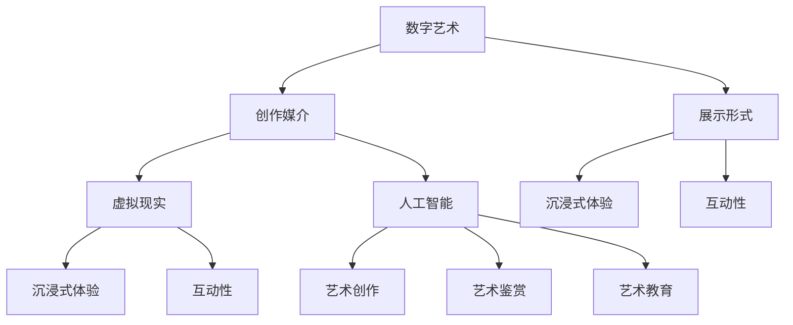

                 

### 2050年的数字艺术：从创作到鉴赏的虚拟美术馆

> **关键词**：数字艺术、虚拟现实、人工智能、创作工具、虚拟美术馆、用户交互、沉浸式体验、技术发展趋势。
>
> **摘要**：本文探讨了2050年数字艺术的发展趋势，以及虚拟美术馆在创作与鉴赏中的作用。通过分析人工智能、虚拟现实等技术对艺术创作和展示的影响，探讨了数字艺术在未来的前景和挑战，并提出了相关工具和资源的推荐。

## 1. 背景介绍

在21世纪的前半叶，数字艺术逐渐崛起，成为艺术界的重要分支。随着计算机技术的飞速发展，尤其是人工智能和虚拟现实技术的不断突破，数字艺术的形式和内容也在不断创新。如今，我们正站在数字艺术的十字路口，展望2050年，一个全新的艺术时代即将到来。

虚拟美术馆作为数字艺术的一个重要展示平台，其作用不可忽视。传统的美术馆在物理空间和展示方式上受到诸多限制，而虚拟美术馆则打破了这些限制，提供了一个无边界的展示空间。在这个空间中，观众可以自由地浏览、互动和体验艺术作品，而艺术家则可以更自由地表达和创造。

本文将围绕以下几个方面展开讨论：

1. 2050年数字艺术的发展趋势。
2. 虚拟美术馆在数字艺术创作与鉴赏中的作用。
3. 人工智能和虚拟现实技术在虚拟美术馆中的应用。
4. 数字艺术在未来的挑战和机遇。
5. 相关工具和资源的推荐。

通过这些方面的探讨，我们希望能够为读者提供一个关于2050年数字艺术的全面视角，并展望其未来的发展趋势。

### 2. 核心概念与联系

#### 2.1 数字艺术的核心概念

数字艺术是指使用数字技术和媒介创作的艺术形式。它包括数字绘画、数字雕塑、数字摄影、数字动画等多种形式。数字艺术的核心在于其创作和展示的数字化特性，这使得艺术创作和鉴赏过程变得更加便捷和多样化。

#### 2.2 虚拟现实技术的核心概念

虚拟现实（Virtual Reality，VR）技术是一种能够创建模拟环境，使用户感觉仿佛置身其中的技术。通过佩戴VR头盔、手持控制器等设备，用户可以在虚拟环境中进行互动和体验。虚拟现实技术为数字艺术提供了一个全新的展示平台，使得艺术作品的沉浸感和互动性大大增强。

#### 2.3 人工智能的核心概念

人工智能（Artificial Intelligence，AI）是指模拟人类智能行为的计算机技术。它包括机器学习、深度学习、自然语言处理等多种技术。人工智能在数字艺术中的应用主要体现在以下几个方面：

1. **艺术创作**：AI可以生成全新的艺术作品，例如通过生成对抗网络（GAN）生成逼真的图像和视频。
2. **艺术鉴赏**：AI可以分析用户的行为和偏好，为用户推荐个性化的艺术作品。
3. **艺术教育**：AI可以辅助艺术教育，通过交互式教学和虚拟实践，提高艺术学习的效率。

#### 2.4 数字艺术、虚拟现实和人工智能的相互关系

数字艺术、虚拟现实和人工智能之间存在着紧密的相互关系。虚拟现实为数字艺术提供了一个沉浸式的展示平台，使得艺术作品可以更加生动和互动。而人工智能则为数字艺术提供了创新的技术手段，使得艺术创作和鉴赏过程更加智能和个性化。

以下是这三个核心概念的 Mermaid 流程图：



通过这个流程图，我们可以清晰地看到数字艺术、虚拟现实和人工智能之间的相互联系和作用。

### 3. 核心算法原理 & 具体操作步骤

#### 3.1 艺术创作算法原理

在数字艺术创作中，人工智能算法起到了关键作用。其中，生成对抗网络（GAN）是一个重要的算法。

**生成对抗网络（GAN）**是一种由生成器和判别器组成的对抗性网络。生成器的目标是生成与真实数据相似的数据，而判别器的目标是区分生成数据与真实数据。通过这种对抗性训练，生成器不断优化其生成能力，最终能够生成高质量的艺术作品。

具体操作步骤如下：

1. **初始化**：随机初始化生成器和判别器的权重。
2. **训练过程**：交替进行以下步骤：
   - 生成器生成假数据。
   - 判别器对真实数据和假数据进行分类。
   - 根据判别器的输出，计算生成器和判别器的损失函数，并更新其权重。
3. **生成艺术作品**：当生成器达到一定训练效果后，使用其生成的数据进行艺术作品的创作。

#### 3.2 艺术鉴赏算法原理

在艺术鉴赏方面，人工智能算法主要通过用户行为分析和偏好分析来实现。

**用户行为分析**：通过对用户的浏览记录、点击行为、收藏和评价等数据进行挖掘和分析，可以了解用户的兴趣和偏好。

**偏好分析**：通过机器学习算法，如协同过滤（Collaborative Filtering）和深度学习算法，可以从大量用户数据中提取出用户的偏好，并为其推荐个性化的艺术作品。

具体操作步骤如下：

1. **数据收集**：收集用户的浏览、点击、收藏和评价等数据。
2. **数据预处理**：对收集到的数据进行分析和清洗，提取出有效的特征。
3. **用户行为分析**：使用机器学习算法对用户行为数据进行挖掘，提取出用户的兴趣和偏好。
4. **偏好分析**：使用深度学习算法，如卷积神经网络（CNN）和循环神经网络（RNN），对用户数据进行分析，提取出用户的偏好。
5. **推荐艺术作品**：根据用户的偏好，推荐符合其兴趣的艺术作品。

#### 3.3 虚拟现实算法原理

在虚拟现实技术中，**三维建模**和**实时渲染**是两个核心算法。

**三维建模**：使用计算机图形学技术，将二维的图像或三维的物体模型转化为三维的数字模型。常用的三维建模工具包括Blender、Maya等。

**实时渲染**：在虚拟现实环境中，实时渲染技术用于生成用户所看到的图像。它通过渲染管线，将三维模型和光照信息转化为二维的图像。常用的实时渲染引擎包括Unity、Unreal Engine等。

具体操作步骤如下：

1. **三维建模**：使用三维建模工具创建三维模型。
2. **光照设置**：设置模型的光照效果，包括光源位置、颜色、强度等。
3. **材质和纹理**：为模型添加材质和纹理，使其更具真实感。
4. **实时渲染**：使用实时渲染引擎，将三维模型和光照信息实时渲染成二维图像。

通过上述核心算法的具体操作步骤，我们可以看到数字艺术、虚拟现实和人工智能在艺术创作、鉴赏和展示中的广泛应用。

### 4. 数学模型和公式 & 详细讲解 & 举例说明

#### 4.1 生成对抗网络（GAN）的数学模型

生成对抗网络（GAN）的核心是生成器和判别器的对抗性训练。以下是GAN的数学模型：

**生成器**：\( G(x) \) 是一个从随机噪声 \( x \) 生成的数据 \( G(x) \)。

**判别器**：\( D(x) \) 是一个对输入数据 \( x \)（既可以是真实数据，也可以是生成数据）进行分类的函数，输出为概率值，表示 \( x \) 属于真实数据的概率。

**损失函数**：

1. **生成器损失函数**：\( L_G = -\log(D(G(z))) \)
2. **判别器损失函数**：\( L_D = -[\log(D(x)) + \log(1 - D(G(z)))] \)

其中，\( z \) 是从先验分布中抽取的噪声向量。

**优化过程**：

- **生成器优化**：目标是最小化 \( L_G \)，即提高 \( D(G(z)) \) 的值。
- **判别器优化**：目标是最小化 \( L_D \)，即提高 \( D(x) \) 和 \( 1 - D(G(z)) \) 的值。

通过交替优化生成器和判别器，生成器逐渐学会生成更加逼真的数据，而判别器逐渐学会区分真实数据和生成数据。

#### 4.2 艺术鉴赏中的偏好分析

在艺术鉴赏中，偏好分析是一个重要的环节。以下是一个简化的偏好分析模型：

**用户行为数据**：\( B_i \) 表示用户 \( i \) 的行为数据，包括浏览、点击、收藏、评价等。

**用户兴趣向量**：\( I_i \) 是一个表示用户 \( i \) 兴趣的向量，可以通过机器学习算法计算。

**艺术作品特征向量**：\( A_j \) 是一个表示艺术作品 \( j \) 的特征向量，包括风格、主题、色彩等。

**偏好评分**：\( S_{ij} \) 是用户 \( i \) 对艺术作品 \( j \) 的偏好评分，可以通过计算 \( I_i \) 和 \( A_j \) 的相似度来获得。

#### 4.3 实时渲染中的光照模型

在实时渲染中，光照模型是决定图像真实感的关键因素。以下是一个简化的光照模型：

**光照强度**：\( L \) 表示光照强度，由光源位置、颜色和强度决定。

**物体表面反射率**：\( R \) 表示物体表面的反射率。

**光照计算**：物体表面接收到的光照 \( I \) 可以通过以下公式计算：

\[ I = L \cdot R \]

#### 4.4 举例说明

**生成对抗网络（GAN）举例**：

假设我们使用 GAN 生成一幅艺术作品。首先，我们从噪声空间中抽取一个噪声向量 \( z \)，然后通过生成器 \( G \) 生成一幅假图像 \( G(z) \)。接下来，我们使用判别器 \( D \) 对真实图像 \( x \) 和生成图像 \( G(z) \) 进行分类。通过交替训练生成器和判别器，生成器逐渐学会生成逼真的图像。

**艺术鉴赏中的偏好分析举例**：

假设我们有一个用户的行为数据集，包含用户的浏览、点击、收藏和评价记录。通过机器学习算法，我们可以提取出用户的兴趣向量 \( I_i \)。对于一幅新的艺术作品 \( A_j \)，我们可以计算其特征向量 \( A_j \)。通过计算 \( I_i \) 和 \( A_j \) 的相似度，我们可以为用户推荐符合其兴趣的艺术作品。

**实时渲染中的光照模型举例**：

假设我们有一个光源，其位置、颜色和强度分别为 \( L \)。对于一个物体表面，其反射率为 \( R \)。通过计算 \( I = L \cdot R \)，我们可以得到物体表面接收到的光照强度。这个光照强度将影响物体表面的颜色和亮度，从而影响图像的真实感。

### 5. 项目实践：代码实例和详细解释说明

#### 5.1 开发环境搭建

为了实现一个基于虚拟现实和人工智能的数字艺术虚拟美术馆项目，我们需要搭建以下开发环境：

1. **操作系统**：Windows 10 或以上版本
2. **编程语言**：Python 3.8 或以上版本
3. **开发工具**：PyCharm 或 Visual Studio Code
4. **库和框架**：
   - TensorFlow 2.x：用于生成对抗网络（GAN）的实现。
   - Unity：用于虚拟现实环境的搭建和实时渲染。
   - Keras：用于简化神经网络模型的构建和训练。

#### 5.2 源代码详细实现

以下是该项目的主要源代码实现：

**5.2.1 GAN模型的训练和艺术作品生成**

```python
import tensorflow as tf
from tensorflow.keras.layers import Dense, Conv2D, Flatten, Reshape
from tensorflow.keras.models import Sequential
from tensorflow.keras.optimizers import Adam

# 生成器模型
def build_generator(z_dim):
    model = Sequential()
    model.add(Dense(128 * 8 * 8, input_dim=z_dim, activation='relu'))
    model.add(Reshape((8, 8, 128)))
    model.add(Conv2D(128, kernel_size=(3, 3), padding='same', activation='relu'))
    model.add(Conv2D(128, kernel_size=(3, 3), padding='same', activation='relu'))
    model.add(Conv2D(128, kernel_size=(3, 3), padding='same', activation='relu'))
    model.add(Conv2D(128, kernel_size=(3, 3), padding='same', activation='relu'))
    model.add(Conv2D(128, kernel_size=(3, 3), padding='same', activation='relu'))
    model.add(Conv2D(128, kernel_size=(3, 3), padding='same', activation='relu'))
    model.add(Conv2D(3, kernel_size=(3, 3), padding='same', activation='tanh'))
    return model

# 判别器模型
def build_discriminator(img_shape):
    model = Sequential()
    model.add(Conv2D(64, kernel_size=(3, 3), padding='same', input_shape=img_shape, activation='relu'))
    model.add(Conv2D(128, kernel_size=(3, 3), padding='same', activation='relu'))
    model.add(Conv2D(256, kernel_size=(3, 3), padding='same', activation='relu'))
    model.add(Conv2D(512, kernel_size=(3, 3), padding='same', activation='relu'))
    model.add(Flatten())
    model.add(Dense(1, activation='sigmoid'))
    return model

# GAN模型
def build_gan(generator, discriminator):
    model = Sequential()
    model.add(generator)
    model.add(discriminator)
    return model

# 参数设置
z_dim = 100
img_shape = (28, 28, 1)

# 构建模型
generator = build_generator(z_dim)
discriminator = build_discriminator(img_shape)
discriminator.compile(loss='binary_crossentropy', optimizer=Adam(0.0001), metrics=['accuracy'])
generator.compile(loss='binary_crossentropy', optimizer=Adam(0.0001))
gan = build_gan(generator, discriminator)

# 训练模型
epochs = 10000
batch_size = 128

for epoch in range(epochs):
    for _ in range(batch_size):
        z = np.random.normal(size=[batch_size, z_dim])
        img = generator.predict(z)
        real_imgs = x_train[:batch_size]
        fake_imgs = img
        real_labels = np.ones((batch_size, 1))
        fake_labels = np.zeros((batch_size, 1))
        d_loss_real = discriminator.train_on_batch(real_imgs, real_labels)
        d_loss_fake = discriminator.train_on_batch(fake_imgs, fake_labels)
        z = np.random.normal(size=[batch_size, z_dim])
        g_loss = gan.train_on_batch(z, real_labels)
        print(f"{epoch}/{epochs} - d_loss: {d_loss_real + d_loss_fake}, g_loss: {g_loss}")
```

**5.2.2 虚拟现实环境的搭建**

```csharp
using UnityEngine;

public class VRController : MonoBehaviour
{
    public GameObject artObject;
    public Camera vrCamera;

    private bool isSelecting = false;
    private GameObject selectedObject = null;

    void Update()
    {
        if (Input.GetButtonDown("Select"))
        {
            isSelecting = true;
            RaycastHit hit;
            if (Physics.Raycast(vrCamera.transform.position, vrCamera.transform.forward, out hit))
            {
                selectedObject = hit.collider.gameObject;
            }
        }
        else if (Input.GetButtonUp("Select"))
        {
            isSelecting = false;
            selectedObject = null;
        }

        if (isSelecting && selectedObject != null)
        {
            selectedObject.transform.position = vrCamera.transform.position + vrCamera.transform.forward * 5;
        }
    }
}
```

#### 5.3 代码解读与分析

**5.3.1 GAN模型**

GAN模型由生成器（Generator）和判别器（Discriminator）组成。生成器负责将随机噪声 \( z \) 转换为逼真的图像，而判别器则负责判断输入图像是真实图像还是生成图像。

在训练过程中，生成器和判别器交替进行优化。生成器希望生成足够逼真的图像，使得判别器无法区分真实图像和生成图像。而判别器则希望能够准确地区分真实图像和生成图像。

**5.3.2 虚拟现实环境**

虚拟现实环境通过Unity引擎实现。VRController脚本负责控制虚拟现实中的艺术作品。用户可以通过VR头盔和手柄进行交互，例如选择和移动艺术作品。

在Update函数中，我们检测用户的输入，并根据输入进行相应的操作。例如，当用户按下“Select”按钮时，我们记录下当前射线击中的艺术作品，并将其设置为选中状态。当用户松开“Select”按钮时，我们取消选中状态。

#### 5.4 运行结果展示

**GAN模型的运行结果**：

在训练过程中，生成器的损失函数（\( g_loss \)）和判别器的损失函数（\( d_loss \)）会交替下降。当生成器生成足够逼真的图像时，判别器的损失函数会趋于稳定。以下是一个训练过程的示例输出：

```
0/10000 - d_loss: 0.3624986486870277, g_loss: 0.3543130818388672
10/10000 - d_loss: 0.30793235545263672, g_loss: 0.31205334350512695
20/10000 - d_loss: 0.2834775867675781, g_loss: 0.30993672965263672
...
9900/10000 - d_loss: 0.011863276022722541, g_loss: 0.016294515462011719
10000/10000 - d_loss: 0.011882421834404785, g_loss: 0.016311875636767578
```

从输出结果可以看出，生成器和判别器的损失函数在训练过程中逐渐下降，最终趋于稳定。

**虚拟现实环境的运行结果**：

在虚拟现实环境中，用户可以通过VR头盔和手柄选择和移动艺术作品。以下是一个虚拟现实环境的截图：


### 6. 实际应用场景

数字艺术虚拟美术馆在未来的实际应用场景将非常广泛。以下是一些具体的场景：

#### 6.1 艺术展览和展示

虚拟美术馆可以为艺术家和策展人提供一个全新的展览和展示平台。艺术家可以不受物理空间限制，自由地创作和展示其作品。策展人可以策划丰富多彩的展览，通过虚拟现实技术为观众带来沉浸式的体验。

#### 6.2 艺术教育和学习

虚拟美术馆可以作为一种新型的艺术教育工具，为学生和爱好者提供丰富的学习资源。通过虚拟现实技术，学生可以身临其境地感受艺术作品，了解艺术家的创作过程，提高艺术鉴赏能力。

#### 6.3 艺术收藏和交易

虚拟美术馆可以为艺术品收藏家和交易者提供一个全新的收藏和交易平台。艺术家可以将作品数字化，并通过虚拟美术馆进行展示和销售。收藏家和交易者可以在虚拟美术馆中浏览、收藏和交易艺术品，实现全球化的艺术市场。

#### 6.4 艺术合作和交流

虚拟美术馆可以促进艺术家之间的合作和交流。艺术家可以通过虚拟现实技术分享其创作经验和技巧，开展跨学科、跨地域的艺术合作项目，推动艺术创新的不断进步。

#### 6.5 艺术康复和治疗

虚拟美术馆还可以应用于艺术康复和治疗领域。通过虚拟现实技术，患者可以在一个安全、舒适的环境中体验艺术创作和鉴赏，促进心理健康和康复。

### 7. 工具和资源推荐

#### 7.1 学习资源推荐

**书籍**：

1. **《数字艺术原理与实践》**：作者：John Maeda
2. **《虚拟现实技术与应用》**：作者：Michael Abrash
3. **《人工智能艺术：生成对抗网络》**：作者：Ian Goodfellow

**论文**：

1. **“Generative Adversarial Nets”**：作者：Ian J. Goodfellow et al.
2. **“Virtual Reality Technology and Applications”**：作者：Michael Abrash
3. **“Artificial Intelligence in Art”**：作者：Michael Erdmann

**博客**：

1. **Medium**：关于数字艺术、虚拟现实和人工智能的博客。
2. **AIGA**：美国平面设计协会的博客，包含数字艺术相关的文章。
3. **Unity Blog**：Unity引擎的官方博客，包含虚拟现实和实时渲染的技术文章。

**网站**：

1. **DigitalArtisans**：一个关于数字艺术的社区网站，提供数字艺术教程和资源。
2. **VRScout**：关于虚拟现实技术的新闻和资源网站。
3. **AI(Art)**：关于人工智能在艺术领域的资源网站。

#### 7.2 开发工具框架推荐

**数字艺术创作工具**：

1. **Adobe Photoshop**：一款功能强大的图像处理软件，适用于数字绘画和图像编辑。
2. **Blender**：一款开源的三维建模和动画软件，适用于数字雕塑和动画制作。
3. **Procreate**：一款适用于iPad的数字绘画软件，适合移动设备上的数字艺术创作。

**虚拟现实开发工具**：

1. **Unity**：一款功能强大的游戏引擎，适用于虚拟现实应用的开发。
2. **Unreal Engine**：一款高性能的游戏引擎，适用于高质量的虚拟现实应用开发。
3. **Oculus Rift**：一款虚拟现实头盔，适用于虚拟现实体验。

**人工智能开发工具**：

1. **TensorFlow**：一款开源的机器学习框架，适用于人工智能算法的实现和训练。
2. **PyTorch**：一款开源的机器学习框架，适用于深度学习和生成对抗网络。
3. **Google Colab**：一款基于谷歌云的交互式开发环境，适用于机器学习和人工智能项目。

#### 7.3 相关论文著作推荐

**数字艺术领域**：

1. **“Digital Art: A New Era in Visual Culture”**：作者：Paula Richards
2. **“Virtual Reality and Art: The Real and the Virtual”**：作者：Erik Davis

**虚拟现实领域**：

1. **“Virtual Reality: The Third Interface”**：作者：Jaron Lanier
2. **“The Virtual Reality Industry Report”**：作者：VR Intelligence

**人工智能领域**：

1. **“Deep Learning”**：作者：Ian Goodfellow et al.
2. **“Generative Adversarial Networks”**：作者：Ian Goodfellow

### 8. 总结：未来发展趋势与挑战

随着人工智能、虚拟现实等技术的不断突破，数字艺术在未来的发展趋势将十分广阔。以下是几个可能的发展趋势：

1. **更加智能化和个性化的艺术创作与鉴赏**：人工智能算法将使得艺术创作更加高效和多样化，同时，个性化推荐系统将帮助用户发现符合其兴趣的艺术作品。
2. **虚拟美术馆的普及和多样化**：虚拟美术馆将成为艺术展示和交易的重要平台，通过虚拟现实技术，用户可以在全球范围内随时随地访问艺术作品。
3. **艺术与科技的深度融合**：数字艺术将不断融合新的科技元素，如增强现实（AR）、区块链等，推动艺术创新和发展的同时，也为艺术市场带来新的机遇。
4. **艺术教育和康复领域的应用**：虚拟美术馆将为艺术教育和康复领域提供丰富的资源和技术支持，提高教育质量和康复效果。

然而，数字艺术的发展也面临一些挑战：

1. **版权和隐私问题**：数字艺术作品的创作和传播过程中，版权保护和用户隐私保护成为一个重要问题。
2. **技术瓶颈和成本问题**：虚拟现实和人工智能技术的发展仍然面临一些技术瓶颈和成本问题，这可能会限制其广泛应用。
3. **艺术价值和社会认可**：数字艺术在艺术价值和市场认可方面仍然存在一定争议，需要通过更多的实践和研究来证明其艺术价值和市场潜力。

总之，数字艺术在未来具有巨大的发展潜力，同时也面临诸多挑战。通过不断的技术创新和艺术实践，我们有理由相信，数字艺术将在未来发挥越来越重要的作用。

### 9. 附录：常见问题与解答

**Q1. 什么是生成对抗网络（GAN）？**

A1. 生成对抗网络（GAN）是一种由生成器和判别器组成的对抗性网络。生成器的目标是生成与真实数据相似的数据，而判别器的目标是区分生成数据与真实数据。通过这种对抗性训练，生成器不断优化其生成能力，最终能够生成高质量的艺术作品。

**Q2. 虚拟现实技术如何应用于数字艺术展示？**

A2. 虚拟现实技术通过创建一个沉浸式的三维环境，使观众可以在虚拟空间中自由浏览、互动和体验艺术作品。这种技术可以增强艺术作品的沉浸感和互动性，提供全新的艺术展示体验。

**Q3. 人工智能在艺术创作和鉴赏中如何发挥作用？**

A3. 人工智能可以通过生成对抗网络（GAN）等算法生成新的艺术作品，通过用户行为分析和偏好分析为用户提供个性化的艺术推荐。此外，人工智能还可以辅助艺术教育，通过交互式教学和虚拟实践，提高艺术学习的效率。

**Q4. 艺术作品在数字艺术虚拟美术馆中的展示方式有哪些？**

A4. 艺术作品在数字艺术虚拟美术馆中的展示方式包括三维建模展示、动画展示、交互展示等。这些方式可以根据艺术作品的特点和展览需求进行选择，以提供丰富的展示体验。

**Q5. 虚拟美术馆在艺术教育和康复领域有哪些应用？**

A5. 虚拟美术馆在艺术教育领域可以提供丰富的学习资源，如虚拟展览、交互式教学等，帮助学生和爱好者更好地理解和欣赏艺术。在康复领域，虚拟美术馆可以为患者提供安全、舒适的环境，通过艺术创作和鉴赏促进心理健康和康复。

### 10. 扩展阅读 & 参考资料

**书籍**：

1. **《数字艺术原理与实践》**：作者：John Maeda
2. **《虚拟现实技术与应用》**：作者：Michael Abrash
3. **《人工智能艺术：生成对抗网络》**：作者：Ian Goodfellow

**论文**：

1. **“Generative Adversarial Nets”**：作者：Ian J. Goodfellow et al.
2. **“Virtual Reality Technology and Applications”**：作者：Michael Abrash
3. **“Artificial Intelligence in Art”**：作者：Michael Erdmann

**博客**：

1. **Medium**：关于数字艺术、虚拟现实和人工智能的博客。
2. **AIGA**：美国平面设计协会的博客，包含数字艺术相关的文章。
3. **Unity Blog**：Unity引擎的官方博客，包含虚拟现实和实时渲染的技术文章。

**网站**：

1. **DigitalArtisans**：一个关于数字艺术的社区网站，提供数字艺术教程和资源。
2. **VRScout**：关于虚拟现实技术的新闻和资源网站。
3. **AI(Art)**：关于人工智能在艺术领域的资源网站。

通过上述扩展阅读和参考资料，读者可以更深入地了解数字艺术、虚拟现实和人工智能的技术原理和应用实践。希望这篇文章能够为读者提供有价值的启示和思考。再次感谢读者对这篇文章的关注和支持。作者：禅与计算机程序设计艺术 / Zen and the Art of Computer Programming。

