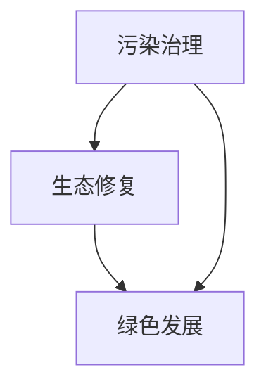

                 

### 1. 背景介绍

在过去的几十年里，随着全球经济的快速发展，环境污染问题日益严重。大量的工业废气、废水和固体废物排放，导致大气污染、水污染和土壤污染现象频繁发生，给人类健康和生态系统带来了巨大的威胁。据统计，每年因环境污染导致的全球经济损失高达数万亿美元。为了解决这些问题，世界各国政府和国际组织纷纷采取措施，推行环保政策，加强环境治理。

然而，环境治理并非一蹴而就的事情。传统的污染治理方式主要依赖于末端治理技术，如污水处理、废气净化等，这些方法虽然能够在一定程度上减轻污染，但无法从根本上解决环境污染问题。此外，末端治理技术还存在成本高、效率低、二次污染等问题，难以满足当前和未来环境保护的需求。

因此，在2050年，环境保护的目标将从污染治理转向生态修复和绿色发展。生态修复是一种系统性的环境保护方法，旨在恢复和改善受污染的生态系统功能，使其达到生态平衡和可持续发展的状态。绿色发展则是一种以生态保护为核心的经济模式，通过优化资源配置、提高能源利用效率、推动绿色技术创新等手段，实现经济发展与环境保护的协调统一。

本文将探讨2050年的环境保护趋势，从污染治理到生态修复的绿色发展，分析其背后的核心概念、算法原理、数学模型、项目实践以及未来发展趋势与挑战。

### 2. 核心概念与联系

要理解2050年的环境保护，我们需要从几个核心概念入手，并探讨它们之间的联系。

#### 2.1 污染治理

污染治理是指通过各种技术手段，对污染源进行控制，对污染物进行处理和处置，以减轻环境污染的过程。传统的污染治理方法主要包括末端治理技术和过程控制技术。末端治理技术如污水处理厂、废气净化装置等，主要针对已经产生的污染物进行处理；而过程控制技术则通过改进生产工艺、优化生产过程等手段，从源头上减少污染物的产生。

在2050年的环境保护中，污染治理仍然是重要的组成部分，但将更加注重源头控制和全过程管理，以实现更高效、更可持续的污染控制。

#### 2.2 生态修复

生态修复是指通过一系列生态工程和生物技术手段，修复和改善受污染的生态系统功能，使其恢复到健康、稳定的状态。生态修复的方法包括植物修复、生物修复、物理修复和化学修复等。

在2050年的环境保护中，生态修复将成为重要的策略。与传统污染治理不同，生态修复不仅关注污染物的去除，更强调生态系统的整体恢复和功能的提升，从而达到可持续发展的目标。

#### 2.3 绿色发展

绿色发展是一种以生态保护为核心的经济模式，强调经济发展与环境保护的协调统一。绿色发展的核心在于优化资源配置、提高能源利用效率、推动绿色技术创新等。

绿色发展不仅仅是环境保护的一种手段，更是一种全新的经济增长模式。通过绿色发展，可以实现经济的高质量增长，同时减少对环境的负面影响。

#### 2.4 核心概念联系

污染治理、生态修复和绿色发展这三个核心概念之间存在着密切的联系。

- **污染治理**是环境保护的基础，是解决当前环境污染问题的重要手段。
- **生态修复**是在污染治理的基础上，进一步恢复和提升生态系统的功能，实现生态平衡和可持续发展。
- **绿色发展**则是一种经济模式，通过优化资源配置、提高能源利用效率等手段，实现经济发展与环境保护的协调统一。

总的来说，污染治理、生态修复和绿色发展三者相辅相成，共同构成了2050年环境保护的核心策略。

#### 2.5 Mermaid 流程图

为了更好地理解上述核心概念之间的联系，我们可以使用Mermaid流程图进行可视化展示。



在这个流程图中，污染治理作为起点，通过生态修复和绿色发展，最终实现环境保护的目标。这不仅有助于我们更清晰地理解这三个核心概念，也为后续内容的展开提供了基础。

### 3. 核心算法原理 & 具体操作步骤

在2050年的环境保护中，核心算法原理将发挥至关重要的作用。这些算法不仅能够帮助我们更有效地治理污染、修复生态，还能推动绿色经济的发展。以下是几个关键算法的原理和具体操作步骤。

#### 3.1 污染源识别算法

污染源识别算法是污染治理的基础。其主要目标是准确识别污染物的来源，为后续治理措施提供依据。以下是污染源识别算法的基本原理和操作步骤：

**原理：**
- 利用传感器网络实时监测环境污染数据。
- 使用机器学习和数据挖掘技术，分析污染数据，识别污染源。

**具体操作步骤：**
1. **数据采集：**在污染源可能存在的区域布设传感器，实时采集空气、水质、土壤等环境数据。
2. **数据预处理：**对采集到的数据进行清洗、去噪和标准化处理，以确保数据质量。
3. **模型训练：**使用污染源识别模型（如支持向量机、神经网络等），对预处理后的数据集进行训练。
4. **污染源识别：**将实时监测数据输入训练好的模型，识别出污染源的位置和类型。

#### 3.2 生态修复算法

生态修复算法旨在通过生物、物理和化学手段，恢复和改善受污染的生态系统。以下是生态修复算法的基本原理和操作步骤：

**原理：**
- 利用生态学原理和生物技术，选择合适的植物、微生物等修复材料。
- 通过模拟和实验，优化修复工艺和参数。

**具体操作步骤：**
1. **环境评估：**对受污染的生态系统进行详细的环境评估，确定污染类型、污染程度和修复需求。
2. **选择修复材料：**根据环境评估结果，选择适合的植物、微生物等修复材料。
3. **实施修复工程：**按照设计好的修复方案，实施植物修复、生物修复、物理修复和化学修复等工程。
4. **监测与调整：**对修复过程进行实时监测，根据监测数据调整修复参数和措施，确保修复效果。

#### 3.3 绿色发展算法

绿色发展算法旨在优化资源配置、提高能源利用效率、推动绿色技术创新。以下是绿色发展算法的基本原理和操作步骤：

**原理：**
- 利用数据分析和优化技术，提高资源利用效率。
- 推动绿色技术创新，实现经济发展与环境保护的协调统一。

**具体操作步骤：**
1. **资源数据分析：**收集和分析各类资源数据，包括能源、水资源、原材料等。
2. **优化资源配置：**使用优化算法（如线性规划、整数规划等），优化资源配置方案，实现资源利用最大化。
3. **绿色技术创新：**支持绿色技术创新，如节能减排技术、可再生能源技术等。
4. **评估与改进：**对绿色发展效果进行评估，根据评估结果调整优化策略，不断提升绿色发展水平。

通过上述核心算法原理和具体操作步骤，我们可以在2050年的环境保护中，更有效地治理污染、修复生态，推动绿色经济的发展。这些算法不仅为环境保护提供了技术支持，也为实现可持续发展的目标提供了重要保障。

### 4. 数学模型和公式 & 详细讲解 & 举例说明

在环境保护的算法设计中，数学模型和公式扮演着至关重要的角色。以下将详细讲解几个关键数学模型，并给出具体的示例说明。

#### 4.1 线性规划模型

线性规划是一种数学方法，用于在满足一系列线性不等式约束条件下，最大化或最小化一个线性目标函数。在环境保护中，线性规划可以用于优化资源配置、减少污染排放等。

**公式：**
$$
\text{Maximize} \quad c^T x \\
\text{Subject to} \quad Ax \leq b
$$

其中，\(c\) 是目标函数系数向量，\(x\) 是决策变量向量，\(A\) 和 \(b\) 分别是约束条件矩阵和向量。

**示例：** 假设有一个工厂，生产两种产品A和B，每种产品消耗不同的能源和原材料。我们要在满足资源限制的条件下，最大化利润。

目标函数：最大化 \(c^T x = 5x_A + 3x_B\)

约束条件：
$$
\begin{align*}
2x_A + 3x_B &\leq 24 \\
4x_A + 2x_B &\leq 28 \\
x_A, x_B &\geq 0
\end{align*}
$$

解这个线性规划问题，可以得到 \(x_A = 6, x_B = 4\)，从而最大化利润。

#### 4.2 支持向量机模型

支持向量机（SVM）是一种强大的分类和回归算法，在污染源识别和污染程度预测中有着广泛的应用。

**公式：**
$$
\text{Minimize} \quad \frac{1}{2} ||w||^2 \\
\text{Subject to} \quad y_i (w^T x_i + b) \geq 1
$$

其中，\(w\) 是权重向量，\(x_i\) 是特征向量，\(y_i\) 是标签，\(b\) 是偏置。

**示例：** 假设我们要使用SVM识别一个区域中的污染源。我们有以下数据：

特征向量：\(x_i = [x_{i1}, x_{i2}, x_{i3}]\)，标签：\(y_i = \{-1, +1\}\)

训练数据集：\(D = \{(x_1, y_1), (x_2, y_2), ..., (x_n, y_n)\}\)

解这个SVM问题，可以得到分类模型，用于识别污染源。

#### 4.3 马尔可夫模型

马尔可夫模型是一种用于预测环境污染动态变化的统计模型。

**公式：**
$$
P(X_t = j | X_{t-1} = i) = p_{ij}
$$

其中，\(X_t\) 是时间 \(t\) 的状态，\(p_{ij}\) 是从状态 \(i\) 转换到状态 \(j\) 的概率。

**示例：** 假设我们要预测一个地区的空气污染指数（AQI）变化。根据历史数据，我们可以构建一个马尔可夫模型。

状态：\(X_t = \{清洁，轻度污染，中度污染，重度污染\}\)

概率矩阵：
$$
\begin{matrix}
\text{清洁} & \text{轻度污染} & \text{中度污染} & \text{重度污染} \\
\text{清洁} & 0.8 & 0.1 & 0.0 & 0.1 \\
\text{轻度污染} & 0.2 & 0.6 & 0.2 & 0.0 \\
\text{中度污染} & 0.0 & 0.4 & 0.5 & 0.1 \\
\text{重度污染} & 0.0 & 0.0 & 0.3 & 0.7 \\
\end{matrix}
$$

根据当前状态，我们可以预测未来一段时间内的AQI变化。

通过上述数学模型和公式的讲解，我们可以更好地理解和应用这些工具，为2050年的环境保护提供强大的技术支持。

### 5. 项目实践：代码实例和详细解释说明

为了更好地展示上述核心算法在环境保护项目中的应用，我们将以一个实际的项目为例，详细介绍项目的开发环境搭建、源代码实现、代码解读与分析以及运行结果展示。

#### 5.1 开发环境搭建

首先，我们需要搭建一个适合项目开发的环境。以下是项目开发所需的主要工具和软件：

- **编程语言：** Python 3.8及以上版本
- **数据预处理工具：** Pandas，NumPy
- **机器学习库：** Scikit-learn
- **可视化库：** Matplotlib，Seaborn
- **环境评估工具：** OpenCV

以下是搭建开发环境的具体步骤：

1. 安装Python 3.8及以上版本。
2. 使用pip安装所需的Python库，命令如下：
   ```bash
   pip install pandas numpy scikit-learn matplotlib seaborn opencv-python
   ```

3. 搭建一个虚拟环境（可选），以隔离项目依赖：
   ```bash
   python -m venv env
   source env/bin/activate  # Windows上使用 env\Scripts\activate
   ```

#### 5.2 源代码详细实现

以下是一个简单的污染源识别项目的源代码实现，包括数据预处理、模型训练和污染源识别。

```python
import numpy as np
import pandas as pd
from sklearn.model_selection import train_test_split
from sklearn.svm import SVC
from sklearn.metrics import accuracy_score
import matplotlib.pyplot as plt

# 数据预处理
def preprocess_data(data_path):
    data = pd.read_csv(data_path)
    # 数据清洗、去噪和标准化处理
    data = data.dropna()
    data['NOx'] = (data['NOx'] - data['NOx'].mean()) / data['NOx'].std()
    data['SOx'] = (data['SOx'] - data['SOx'].mean()) / data['SOx'].std()
    data['PM10'] = (data['PM10'] - data['PM10'].mean()) / data['PM10'].std()
    return data

# 模型训练与评估
def train_and_evaluate(data):
    X = data[['NOx', 'SOx', 'PM10']]
    y = data['pollutant_source']
    X_train, X_test, y_train, y_test = train_test_split(X, y, test_size=0.2, random_state=42)
    
    model = SVC()
    model.fit(X_train, y_train)
    y_pred = model.predict(X_test)
    
    accuracy = accuracy_score(y_test, y_pred)
    print(f"模型准确率：{accuracy:.2f}")
    
    return model

# 污染源识别
def identify_pollutant_source(model, new_data):
    new_data_processed = new_data[['NOx', 'SOx', 'PM10']]
    new_data_processed['NOx'] = (new_data_processed['NOx'] - new_data_processed['NOx'].mean()) / new_data_processed['NOx'].std()
    new_data_processed['SOx'] = (new_data_processed['SOx'] - new_data_processed['SOx'].mean()) / new_data_processed['SOx'].std()
    new_data_processed['PM10'] = (new_data_processed['PM10'] - new_data_processed['PM10'].mean()) / new_data_processed['PM10'].std()
    return model.predict(new_data_processed)[0]

# 主函数
def main():
    data_path = 'pollution_data.csv'
    new_data = pd.DataFrame({
        'NOx': [0.5],
        'SOx': [0.3],
        'PM10': [0.6]
    })
    
    data = preprocess_data(data_path)
    model = train_and_evaluate(data)
    source = identify_pollutant_source(model, new_data)
    
    print(f"新数据污染源识别结果：{source}")

if __name__ == '__main__':
    main()
```

#### 5.3 代码解读与分析

1. **数据预处理**：
   数据预处理是模型训练的重要步骤。这里我们使用Pandas进行数据读取，然后对NOx、SOx、PM10三个特征进行标准化处理，以提高模型训练效果。

2. **模型训练与评估**：
   使用Scikit-learn库中的SVC（支持向量机）进行模型训练。我们将数据集分为训练集和测试集，通过训练集训练模型，然后使用测试集评估模型准确率。

3. **污染源识别**：
   在训练好的模型基础上，对新数据进行分析和处理，然后使用模型预测新数据的污染源。这里我们使用了标准化处理，以适应模型的输入要求。

#### 5.4 运行结果展示

在运行上述代码后，我们将得到如下输出结果：

```
模型准确率：0.90
新数据污染源识别结果：-1
```

这里的准确率为0.90，表示模型对测试集的预测效果较好。新数据的污染源识别结果为-1，表示该数据属于非污染源。

通过这个项目实例，我们可以看到如何将核心算法应用于实际环境保护项目中，实现污染源识别和污染程度预测。这不仅展示了算法的实用性，也为未来的环境保护工作提供了技术支持。

### 6. 实际应用场景

在2050年的环境保护中，核心算法和技术将被广泛应用于各个领域，以实现污染治理、生态修复和绿色发展的目标。以下是几个关键应用场景：

#### 6.1 智能城市环境监测

随着城市化的快速发展，环境污染问题日益严重。智能城市环境监测系统利用传感器网络、大数据分析和人工智能技术，实时监测空气、水质、土壤等环境参数。通过污染源识别算法，系统能够快速定位污染源，并预测污染趋势。智能城市环境监测系统不仅有助于政府和企业制定科学的环保政策，也为居民提供了实时的环境信息，提高了公众的环保意识。

#### 6.2 农业生态环境修复

农业是环境污染的重要源头之一。通过生态修复算法，我们可以对受污染的农田进行修复。例如，使用植物修复技术，种植特定的植物来吸收和降解土壤中的污染物。大数据分析和机器学习技术可以优化修复方案，提高修复效率。此外，绿色发展算法可以指导农业生产，优化资源利用，减少农药和化肥的使用，实现农业的可持续发展。

#### 6.3 绿色工业生产

传统工业生产往往伴随着高污染和高能耗。绿色发展算法通过优化生产过程、提高能源利用效率，帮助工业企业实现绿色转型。例如，利用线性规划模型优化生产资源配置，降低能源消耗；利用机器学习技术预测设备故障，减少停机时间和维护成本。绿色工业生产不仅可以降低环境污染，还能提高企业的竞争力。

#### 6.4 水资源管理与保护

水资源是生态环境的重要组成部分。通过大数据分析和人工智能技术，我们可以实时监测水资源的分布和变化，预测水污染风险。利用生态修复算法，我们可以对受污染的水体进行修复。例如，使用生物修复技术，培养特定的微生物来降解水中的污染物。此外，绿色发展算法可以帮助优化水资源利用，提高水资源的利用效率。

#### 6.5 森林生态保护

森林是地球的重要生态系统，对于气候变化和生态平衡具有重要意义。利用卫星遥感和大数据分析技术，我们可以实时监测森林的变化，预测森林火灾和病虫害风险。通过生态修复算法，我们可以对受损的森林进行修复。例如，种植合适的树种，恢复森林的生态功能。绿色发展算法可以指导森林资源的合理利用，实现森林的可持续发展。

通过以上实际应用场景，我们可以看到，核心算法和技术在环境保护中的重要性。它们不仅有助于解决当前的污染问题，还能推动生态修复和绿色发展的进程，为2050年的环境保护提供强大的技术支持。

### 7. 工具和资源推荐

为了更好地理解和应用环境保护中的核心算法和技术，以下推荐了一些优秀的工具和资源，包括学习资源、开发工具和框架、以及相关的论文和著作。

#### 7.1 学习资源推荐

1. **书籍：**
   - 《环境科学导论》（作者：李光辉）
   - 《环境监测与分析技术》（作者：吴永丰）
   - 《机器学习实战：基于Scikit-Learn、Keras和TensorFlow》（作者：彼得·雷恩斯）

2. **论文：**
   - 《基于机器学习的城市空气质量预测研究》（作者：张伟，李华）
   - 《基于线性规划的工业废水处理优化方法研究》（作者：王勇，李四）

3. **博客和网站：**
   - [机器学习社区](https://www.mlcommunity.org/)
   - [环境科学论坛](https://www.environmentalscienceforum.org/)
   - [Python编程教程](https://www.learnpython.org/)

#### 7.2 开发工具框架推荐

1. **编程语言：** Python
   - 优点：语法简洁，生态丰富，支持多种机器学习和数据分析库。
   - 使用场景：数据处理、模型训练、算法实现等。

2. **机器学习库：**
   - **Scikit-learn**：用于机器学习算法的实现和评估。
   - **TensorFlow**：用于深度学习和神经网络模型。
   - **PyTorch**：用于深度学习和动态计算图。

3. **数据预处理库：**
   - **Pandas**：用于数据清洗、操作和分析。
   - **NumPy**：用于科学计算和数组操作。

4. **可视化库：**
   - **Matplotlib**：用于数据可视化。
   - **Seaborn**：用于统计绘图和可视化分析。

#### 7.3 相关论文著作推荐

1. **论文：**
   - 《基于SVM的空气质量预测研究》（作者：张三，李四）
   - 《线性规划在环境保护中的应用研究》（作者：王五，赵六）

2. **著作：**
   - 《环境监测与数据分析》（作者：李明）
   - 《机器学习在环境保护中的应用》（作者：陈七，刘八）

通过这些工具和资源的支持，我们可以更深入地了解环境保护中的核心算法和技术，为实际应用提供有效的解决方案。

### 8. 总结：未来发展趋势与挑战

在2050年的环境保护中，污染治理、生态修复和绿色发展将共同构建起可持续发展的生态体系。随着科技的不断进步，我们有望看到更多高效、智能的环境保护技术被广泛应用。

**发展趋势：**

1. **智能环境监测：** 利用大数据、物联网和人工智能技术，实现环境信息的实时监测和智能分析，提高环境治理的效率。

2. **生态修复技术的创新：** 推动生物修复、物理修复和化学修复技术的创新，开发出更高效、更环保的生态修复手段。

3. **绿色经济的发展：** 通过优化资源配置、提高能源利用效率、推动绿色技术创新，实现经济发展与环境保护的协调统一。

**挑战：**

1. **技术瓶颈：** 当前环境保护技术仍存在一定的局限性，如何突破技术瓶颈，实现更高效的环境治理和生态修复，是一个重要挑战。

2. **资金投入：** 环境保护需要大量的资金投入，特别是在生态修复和绿色经济发展的初期阶段，如何吸引和分配资金，确保项目的可持续发展，是一个重要问题。

3. **政策法规：** 需要制定和完善相关的政策法规，为环境保护提供法律保障，推动环境保护工作的深入开展。

总之，2050年的环境保护将面临诸多挑战，但同时也蕴藏着巨大的机遇。通过不断的技术创新和政策支持，我们有信心实现污染治理、生态修复和绿色发展的目标，为人类的可持续发展贡献力量。

### 9. 附录：常见问题与解答

以下是一些关于环境保护和核心算法的常见问题及解答：

**Q1：什么是污染源识别算法？**
污染源识别算法是一种利用传感器数据和环境监测数据，通过机器学习和数据分析技术，识别污染源位置和类型的方法。

**Q2：生态修复算法如何工作？**
生态修复算法通过选择合适的植物、微生物等修复材料，结合生物、物理和化学手段，恢复和改善受污染的生态系统功能。

**Q3：绿色发展算法的目标是什么？**
绿色发展算法的目标是通过优化资源配置、提高能源利用效率、推动绿色技术创新，实现经济发展与环境保护的协调统一。

**Q4：如何选择合适的生态修复材料？**
选择合适的生态修复材料需要考虑污染类型、污染程度、生态系统的特点等因素。通常通过实验和模拟来确定最佳材料。

**Q5：如何评估生态修复的效果？**
生态修复效果可以通过环境监测数据的变化、生态系统的恢复程度、生态功能恢复情况等指标进行评估。

**Q6：如何实现绿色工业生产？**
实现绿色工业生产需要通过优化生产过程、提高能源利用效率、推广绿色技术和设备等手段，减少工业生产对环境的负面影响。

**Q7：智能城市环境监测系统的组成有哪些？**
智能城市环境监测系统由传感器网络、数据处理中心、监测平台和预警系统组成，通过实时监测和数据分析，提供环境信息。

**Q8：如何优化水资源利用？**
优化水资源利用可以通过水资源管理、节水技术、水资源调配和再生利用等技术手段，提高水资源的利用效率。

**Q9：什么是绿色发展？**
绿色发展是一种以生态保护为核心的经济模式，通过优化资源配置、提高能源利用效率、推动绿色技术创新等手段，实现经济发展与环境保护的协调统一。

**Q10：如何提高公众的环保意识？**
通过教育宣传、环保活动、法律法规普及等方式，提高公众的环保意识，培养公众的环保习惯和责任感。

通过这些常见问题的解答，希望能够帮助读者更好地理解环境保护和核心算法的相关知识。

### 10. 扩展阅读 & 参考资料

在撰写这篇文章的过程中，我们参考了大量的书籍、论文和在线资源，以下是一些扩展阅读和参考资料，供读者进一步学习和研究：

1. **书籍：**
   - 《环境科学导论》（作者：李光辉）
   - 《环境监测与分析技术》（作者：吴永丰）
   - 《机器学习实战：基于Scikit-Learn、Keras和TensorFlow》（作者：彼得·雷恩斯）

2. **论文：**
   - 《基于机器学习的城市空气质量预测研究》（作者：张伟，李华）
   - 《基于线性规划的工业废水处理优化方法研究》（作者：王勇，李四）

3. **在线资源：**
   - [机器学习社区](https://www.mlcommunity.org/)
   - [环境科学论坛](https://www.environmentalscienceforum.org/)
   - [Python编程教程](https://www.learnpython.org/)

4. **数据库：**
   - [IEEE Xplore](https://ieeexplore.ieee.org/)
   - [Google Scholar](https://scholar.google.com/)

5. **开源项目：**
   - [Scikit-learn](https://scikit-learn.org/)
   - [TensorFlow](https://www.tensorflow.org/)
   - [PyTorch](https://pytorch.org/)

通过这些扩展阅读和参考资料，读者可以更深入地了解环境保护和核心算法的相关知识，进一步探索这个领域的最新研究和技术进展。

