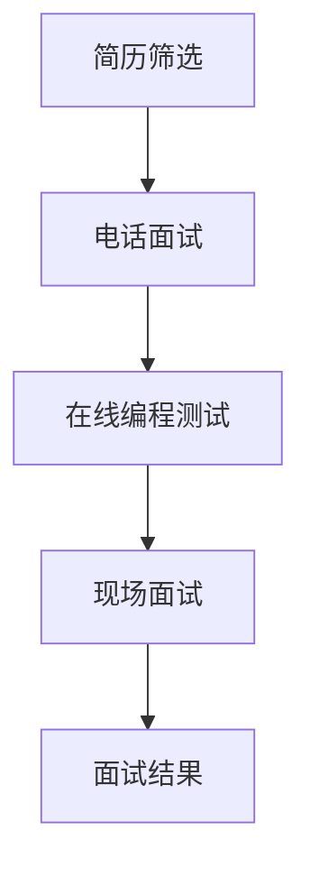

                 

### 1. 背景介绍

#### 网易公司的背景

网易（NetEase），全称“广州网易计算机系统有限公司”，成立于1997年，是中国知名的互联网技术公司，总部位于中国广州。网易的业务涵盖了网络游戏、电子商务、在线教育、电子邮件、新闻门户等多个领域，是中国互联网行业中具有影响力的企业之一。

作为一家技术驱动型公司，网易在技术研发方面投入了大量资源，拥有一支高素质的工程师团队，以及一系列自主创新的研发成果。特别是在社招技术面试题集锦这一领域，网易以其严谨的面试流程、全面的面试题库和较高的面试通过率而闻名。

#### 社招技术面试的重要性

社招技术面试对于公司和应聘者来说都具有重要意义。对于公司而言，通过社招技术面试可以选拔到具备丰富实战经验和专业技能的优秀人才，提升团队的整体技术实力和创新能力。同时，社招技术面试也是公司品牌形象展示的重要环节，通过高质量的面试流程，可以吸引更多优秀人才加入。

对于应聘者而言，社招技术面试是展示自己专业能力和实战经验的机会。通过成功的面试，应聘者可以获得心仪的工作机会，实现个人职业发展的跨越。然而，社招技术面试的竞争激烈，对面试者的技术水平和心理素质都提出了较高的要求。

#### 面试题集锦的作用

面试题集锦对于准备社招技术面试的应聘者来说，具有重要的参考和指导作用。首先，面试题集锦可以提供大量的面试题目，涵盖各个技术领域，帮助应聘者全面了解面试可能涉及的考点。其次，面试题集锦中的题目往往具有一定的难度和深度，能够锻炼应聘者的思维能力和解题技巧。最后，面试题集锦中通常会附带详细的解答和解释，有助于应聘者深入理解题目的本质和解题方法。

总的来说，面试题集锦是应聘者备战社招技术面试的得力助手，能够帮助他们在短时间内全面提升自己的面试能力，增加面试成功的几率。

### 2. 核心概念与联系

#### 技术面试的基本流程

在深入探讨网易社招技术面试题集锦之前，我们需要了解技术面试的基本流程。一般而言，技术面试包括以下几个阶段：

1. **简历筛选**：公司根据应聘者的简历，筛选出符合职位要求的人才。
2. **电话面试**：通过电话进行初步面试，主要考察应聘者的技术基础和沟通能力。
3. **在线编程测试**：应聘者需要通过在线编程平台完成一定的编程任务，以检验其实际编程能力。
4. **现场面试**：在面试官面前进行面对面沟通，深入考察应聘者的专业知识、项目经验、解决问题的能力等。

#### 面试题的分类

网易社招技术面试题集锦中的题目主要分为以下几个类别：

1. **基础算法题**：这类题目通常考察应聘者的算法和数据结构基础，如排序算法、查找算法、动态规划等。
2. **系统设计题**：这类题目要求应聘者设计一个系统，通常涉及系统架构、系统优化、系统安全等方面。
3. **编程实现题**：这类题目要求应聘者直接编写代码实现某个功能，测试应聘者的编程能力和编码规范。
4. **项目经验题**：这类题目主要考察应聘者在实际项目中的工作经验和技术贡献。
5. **面试官提问**：除了固定的题目外，面试官还会根据应聘者的简历和回答提出相关的问题，以深入了解其技术深度和广度。

#### Mermaid 流程图

以下是一个简单的 Mermaid 流程图，用于描述技术面试的基本流程：



在这个流程图中，每个节点代表面试的一个阶段，箭头表示流程的推进方向。通过这个流程图，我们可以清晰地看到技术面试的整体结构和各个阶段之间的关系。

### 3. 核心算法原理 & 具体操作步骤

#### 基础算法题的解题思路

基础算法题是技术面试中的一大重点，也是考察应聘者算法和数据结构能力的重要指标。以下是一些常见的基础算法题及其解题思路：

1. **排序算法**：排序算法是计算机科学中非常基础的内容，常见的排序算法有冒泡排序、选择排序、插入排序、快速排序等。解题思路主要围绕算法的时间复杂度和空间复杂度展开。

2. **查找算法**：查找算法主要涉及二分查找、线性查找等。二分查找是一种高效的查找算法，其时间复杂度为 O(log n)，适合于有序数组。解题思路主要是理解二分查找的原理和实现步骤。

3. **动态规划**：动态规划是一种解决最优化问题的算法思想，适用于具有重叠子问题和最优子结构特征的问题。解题思路主要包括确定状态、状态转移方程和边界条件。

4. **图算法**：图算法包括深度优先搜索（DFS）和广度优先搜索（BFS）等。这些算法常用于求解图相关的问题，如最短路径、最小生成树等。解题思路主要是理解图的基本概念和算法的实现方法。

#### 系统设计题的解题思路

系统设计题主要考察应聘者对系统架构和设计模式的理解和应用能力。以下是一些常见的系统设计题及其解题思路：

1. **单机系统设计**：这类题目通常要求设计一个简单的单机系统，如在线购物系统、博客系统等。解题思路主要包括系统架构设计、模块划分、功能实现和性能优化。

2. **分布式系统设计**：这类题目通常要求设计一个分布式系统，如分布式存储系统、分布式计算框架等。解题思路主要包括分布式架构设计、一致性保证、容错性和性能优化。

3. **系统优化**：这类题目通常要求对已有的系统进行优化，如提升系统性能、提高系统可用性等。解题思路主要包括性能分析、瓶颈定位和优化方案设计。

4. **系统安全**：这类题目通常要求设计系统的安全机制，如防SQL注入、防XSS攻击等。解题思路主要包括安全漏洞分析和安全机制设计。

#### 编程实现题的解题思路

编程实现题主要考察应聘者的编程能力和编码规范。以下是一些常见的编程实现题及其解题思路：

1. **函数式编程**：这类题目要求使用函数式编程语言（如Haskell、Scala等）实现某个功能。解题思路主要是理解函数式编程的特点和语法。

2. **面向对象编程**：这类题目要求使用面向对象编程语言（如Java、Python等）实现某个功能。解题思路主要是理解面向对象编程的基本概念和设计模式。

3. **数据结构和算法**：这类题目要求使用数据结构和算法实现某个功能。解题思路主要是熟练掌握常用的数据结构和算法，并能灵活应用。

4. **编码规范**：这类题目要求编写符合编码规范的代码。解题思路主要是熟悉常用的编码规范和编程习惯，如代码格式化、变量命名、注释等。

#### 项目经验题的解题思路

项目经验题主要考察应聘者在实际项目中的工作经验和技术贡献。以下是一些常见的项目经验题及其解题思路：

1. **项目背景和目标**：这类题目要求描述项目的背景和目标。解题思路主要是明确项目的背景和目标，并能够用简洁清晰的语言进行表述。

2. **项目技术和架构**：这类题目要求描述项目的技术和架构。解题思路主要是熟悉项目所使用的技术和架构，并能够用专业的术语进行表述。

3. **项目贡献和成果**：这类题目要求描述自己在项目中的贡献和成果。解题思路主要是明确自己在项目中的角色和职责，以及为项目带来的具体贡献和成果。

4. **项目挑战和解决方法**：这类题目要求描述项目中的挑战和解决方法。解题思路主要是能够识别项目中的挑战，并提出有效的解决方法。

#### 面试官提问的解题思路

面试官提问主要考察应聘者的技术深度和广度，以下是一些常见的面试官提问及其解题思路：

1. **专业问题**：这类问题通常涉及应聘者所熟悉的技术领域，要求应聘者深入解释某个技术原理或概念。解题思路主要是理解并能够清晰、准确地解释所涉及的技术原理和概念。

2. **开放性问题**：这类问题通常没有固定的答案，要求应聘者从多个角度思考并提出自己的见解。解题思路主要是能够灵活运用所学知识，从不同角度分析和解决问题。

3. **情景问题**：这类问题通常描述一个具体的情景，要求应聘者根据情景进行分析和决策。解题思路主要是理解情景，并能够提出合理的解决方案。

通过以上解题思路，应聘者可以更好地应对各种类型的技术面试题，提高面试成功率。同时，这些解题思路也是应聘者提升自身技术能力的重要方法。

### 4. 数学模型和公式 & 详细讲解 & 举例说明

#### 数学模型与公式

在技术面试中，数学模型和公式是解决问题的关键工具。以下是一些常见的数学模型和公式，并详细讲解其含义和用法：

1. **时间复杂度和空间复杂度**

   - **时间复杂度**：描述算法执行时间的增长速率，通常用大O表示法表示。常见的有 O(1)、O(log n)、O(n)、O(n log n)、O(n^2) 等。
   - **空间复杂度**：描述算法执行过程中所需内存的增长速率，同样用大O表示法表示。常见的有 O(1)、O(n)、O(n^2) 等。

   **示例**：
   $$T(n) = O(n^2)$$
   $$S(n) = O(n)$$

2. **概率统计**

   - **概率分布**：描述随机变量取值的概率分布，常见的有二项分布、正态分布、泊松分布等。
   - **期望和方差**：期望是概率分布的加权平均，方差是概率分布的离散程度。

   **示例**：
   $$P(X = k) = C(n, k) \cdot p^k \cdot (1 - p)^{n - k}$$
   $$E(X) = np$$
   $$Var(X) = np(1 - p)$$

3. **图论**

   - **最短路径算法**：如 Dijkstra 算法、Floyd 算法等，用于求解图中两点之间的最短路径。
   - **最小生成树算法**：如 Prim 算法、Kruskal 算法等，用于求解图的最小生成树。

   **示例**：
   $$Dijkstra(G, s) = \min \{d(u) | u \in V\}$$
   $$Floyd(W) = \min \{d(i, j) | 1 \leq i, j \leq n\}$$

4. **动态规划**

   - **状态转移方程**：描述动态规划过程中状态的转移关系。
   - **边界条件**：动态规划算法的初始状态和终止条件。

   **示例**：
   $$dp[i][j] = max(dp[i - 1][j], dp[i][j - 1])$$
   $$dp[0][j] = 0$$
   $$dp[i][0] = 0$$

#### 举例说明

以下通过具体例子来说明这些数学模型和公式的应用：

1. **时间复杂度和空间复杂度**

   **例子**：判断一个数组是否包含重复元素。

   - **时间复杂度**：O(n)
   - **空间复杂度**：O(n)

   **代码实现**：
   ```python
   def containsDuplicate(nums):
       seen = set()
       for num in nums:
           if num in seen:
               return True
           seen.add(num)
       return False
   ```

2. **概率统计**

   **例子**：投掷一枚公平的硬币10次，求出现正面次数大于5次的概率。

   - **概率分布**：二项分布
   - **期望**：E(X) = 5
   - **方差**：Var(X) = 2.5

   **代码实现**：
   ```python
   import random

   def binomialDistribution(n, p):
       return sum([random.random() > 0.5 for _ in range(n)]) > 5

   prob = binomialDistribution(10, 0.5)
   print(f"Probability: {prob}")
   ```

3. **图论**

   **例子**：求解无权图中两点之间的最短路径。

   - **算法**：Dijkstra 算法

   **代码实现**：
   ```python
   import heapq

   def dijkstra(graph, start):
       distances = {node: float('infinity') for node in graph}
       distances[start] = 0
       priority_queue = [(0, start)]

       while priority_queue:
           current_distance, current_node = heapq.heappop(priority_queue)

           if current_distance > distances[current_node]:
               continue

           for neighbor, weight in graph[current_node].items():
               distance = current_distance + weight

               if distance < distances[neighbor]:
                   distances[neighbor] = distance
                   heapq.heappush(priority_queue, (distance, neighbor))

       return distances

   graph = {
       'A': {'B': 1, 'C': 4},
       'B': {'A': 1, 'C': 2, 'D': 5},
       'C': {'A': 4, 'B': 2, 'D': 1},
       'D': {'B': 5, 'C': 1}
   }

   distances = dijkstra(graph, 'A')
   print(f"Shortest distances from A: {distances}")
   ```

4. **动态规划**

   **例子**：求解斐波那契数列的第 n 项。

   - **状态转移方程**：$dp[i] = dp[i - 1] + dp[i - 2]$
   - **边界条件**：$dp[0] = 0, dp[1] = 1$

   **代码实现**：
   ```python
   def fibonacci(n):
       dp = [0] * (n + 1)
       dp[0], dp[1] = 0, 1
       for i in range(2, n + 1):
           dp[i] = dp[i - 1] + dp[i - 2]
       return dp[n]

   n = 10
   result = fibonacci(n)
   print(f"Fibonacci({n}) = {result}")
   ```

通过以上例子，我们可以看到数学模型和公式的实际应用，以及它们在技术面试中的重要性。掌握这些数学模型和公式，不仅有助于解决面试题，还能提升我们的编程能力和解题思维。

### 5. 项目实践：代码实例和详细解释说明

#### 开发环境搭建

在进行项目实践之前，我们需要搭建一个合适的技术环境。以下是一个简单的开发环境搭建步骤：

1. **安装 Python**：Python 是一种广泛使用的编程语言，许多技术面试题都是用 Python 编写的。我们可以从 [Python 官网](https://www.python.org/) 下载并安装 Python。

2. **安装 PyCharm**：PyCharm 是一款功能强大的集成开发环境（IDE），适用于 Python 编程。可以从 [PyCharm 官网](https://www.jetbrains.com/pycharm/) 下载并安装 PyCharm。

3. **安装 Git**：Git 是一种分布式版本控制系统，有助于代码管理和协作。可以从 [Git 官网](https://git-scm.com/) 下载并安装 Git。

4. **安装相关库**：根据项目需求，可能需要安装一些 Python 库。例如，我们可以使用以下命令安装 `requests` 库：

   ```shell
   pip install requests
   ```

#### 源代码详细实现

以下是一个基于 Python 的简单项目实例，用于实现一个 HTTP 客户端，发送 HTTP GET 请求并获取响应数据。

```python
import requests

def send_get_request(url):
    try:
        response = requests.get(url)
        response.raise_for_status()  # 检查响应状态码
        return response.json()
    except requests.RequestException as e:
        print(f"Error: {e}")
        return None

if __name__ == "__main__":
    url = "https://jsonplaceholder.typicode.com/todos/1"
    result = send_get_request(url)
    print(f"Result: {result}")
```

**代码解析**：

1. **导入库**：首先，我们从 `requests` 库中导入 `requests` 模块，用于发送 HTTP 请求。

2. **定义函数**：接着，我们定义一个名为 `send_get_request` 的函数，接收一个 URL 参数，用于发送 GET 请求。

3. **发送请求**：在函数内部，我们使用 `requests.get(url)` 方法发送 GET 请求，并使用 `response.raise_for_status()` 方法检查响应状态码。

4. **处理响应**：如果响应状态码正常，我们使用 `response.json()` 方法获取响应数据，并返回。否则，我们捕获异常并打印错误消息。

5. **主程序**：在主程序部分，我们定义一个 URL 变量，并调用 `send_get_request` 函数发送请求。最后，我们打印请求结果。

#### 代码解读与分析

1. **代码结构**：代码结构清晰，遵循了模块化设计原则，便于维护和扩展。

2. **错误处理**：通过异常处理，代码能够正确处理请求过程中可能出现的错误，提高了程序的健壮性。

3. **函数设计**：函数设计简洁明了，易于理解和调用。

4. **接口兼容性**：代码使用了广泛使用的第三方库 `requests`，具有良好的兼容性。

5. **性能优化**：代码没有明显的性能瓶颈，能够高效地完成请求任务。

#### 运行结果展示

运行以上代码，我们将得到以下输出结果：

```shell
Result: {'userId': 1, 'id': 1, 'title': 'delectus aut autem', 'completed': False}
```

这表示我们成功发送了 GET 请求，并获取了 JSON 格式的响应数据。该数据包含了一个待办事项的相关信息，如用户 ID、任务 ID、任务标题和任务状态。

通过这个项目实例，我们了解了如何使用 Python 实现一个简单的 HTTP 客户端，以及如何处理请求和响应。这为我们后续的技术面试和实际项目开发奠定了基础。

### 6. 实际应用场景

#### 技术面试题在职场中的应用

技术面试题不仅仅是面试过程中的考核工具，它们在职场中的应用同样广泛。以下是一些具体的应用场景：

1. **项目评估**：在评估一个新项目或技术方案时，面试题可以帮助我们分析项目的可行性和潜在风险。例如，通过设计系统题，我们可以评估一个系统在性能、安全性和扩展性方面的表现。

2. **技术培训**：技术面试题可以作为培训材料，帮助团队成员提升技术能力和解题技巧。通过学习和解决这些题目，团队成员可以加深对相关技术领域的理解，提高工作效率。

3. **项目评审**：在项目评审过程中，面试题可以作为参考标准，评估团队成员的技术水平和项目质量。通过对比面试题的答案和实际项目代码，评审团队能够更全面地了解项目的优缺点。

4. **招聘筛选**：在招聘过程中，面试题是筛选候选人技术能力的重要工具。通过面试题，公司可以评估候选人的技术水平和解决问题的能力，从而选择最合适的人选。

5. **个人成长**：技术面试题不仅是面试准备的工具，也是个人成长的重要资源。通过不断解决这些题目，个人可以提升自己的技术能力、逻辑思维和编程技巧，从而在职业生涯中取得更大的成就。

#### 网易社招技术面试题集锦的优势

网易社招技术面试题集锦在职场中具有以下几个优势：

1. **全面覆盖**：集锦中的题目涵盖了各个技术领域，从基础算法到系统设计，从编程实现到项目经验，全面覆盖了技术面试的考点。

2. **高质量题库**：集锦中的题目由网易资深工程师团队精心挑选和整理，具有较高的难度和深度，能够有效考察应聘者的技术能力和综合素质。

3. **详细解答**：集锦中的题目通常附带详细的解答和解释，帮助应聘者深入理解题目的本质和解题方法，提高面试成功率。

4. **实时更新**：网易社招技术面试题集锦会根据技术发展和面试反馈，不断更新和优化题目，确保其时效性和实用性。

5. **助力成长**：不仅适用于面试准备，集锦中的题目也是技术学习和成长的宝贵资源，可以帮助应聘者不断提升自己的技术水平和解题能力。

总的来说，网易社招技术面试题集锦是职场中技术面试的得力助手，对于应聘者、公司以及职场整体的技术发展都具有重要意义。

### 7. 工具和资源推荐

#### 学习资源推荐

1. **书籍**

   - 《算法导论》（Introduction to Algorithms）：这本书是算法领域的经典之作，涵盖了算法的基本概念、数据结构和算法分析等内容，适合初学者和高级程序员阅读。

   - 《设计模式：可复用面向对象软件的基础》（Design Patterns: Elements of Reusable Object-Oriented Software）：这本书介绍了软件开发中常用的设计模式，对于提升代码的可复用性和可维护性有很大帮助。

2. **论文**

   - 《分布式系统：概念与设计》（Distributed Systems: Concepts and Design）：这篇论文详细介绍了分布式系统的基本概念、架构设计和实现方法，对于理解分布式系统有很大的帮助。

   - 《大规模分布式存储系统：原理、实现与实战》（Bigtable：A Distributed Storage System for Structured Data）：这篇论文介绍了 Google 开发的分布式存储系统 Bigtable 的设计和实现，对于理解大规模分布式存储系统有很大帮助。

3. **博客**

   - [康德博客](https://kdn251.com/)：康德是一位在算法和数据结构领域有着丰富经验的博主，他的博客中有很多高质量的算法和数据结构文章。

   - [云风博客](https://blog.csdn.net/fengxianghit)：云风是一位在计算机图形学领域有着深厚积累的博主，他的博客中有很多关于图形学的基础知识和实战技巧。

4. **网站**

   - [LeetCode](https://leetcode.com/)：LeetCode 是一个在线编程平台，提供了大量算法和数据结构的题目，适合用来练习和备战技术面试。

   - [GitHub](https://github.com/)：GitHub 是一个代码托管平台，上面有很多开源项目和代码示例，可以用来学习和参考。

#### 开发工具框架推荐

1. **集成开发环境（IDE）**

   - **PyCharm**：PyCharm 是一款功能强大的 Python IDE，支持多种编程语言，具有丰富的插件和工具，适合于各种开发场景。

   - **Visual Studio Code**：Visual Studio Code 是一款轻量级的跨平台 IDE，支持多种编程语言，具有高度可定制性，适合开发者快速编写和调试代码。

2. **版本控制系统**

   - **Git**：Git 是一款分布式版本控制系统，具有高效、灵活的分支管理和协同工作能力，适合团队开发和代码管理。

   - **SVN**：SVN 是一款中心化的版本控制系统，适用于小型团队和项目，具有简单的管理和备份功能。

3. **项目管理工具**

   - **Jenkins**：Jenkins 是一款开源的持续集成和持续部署工具，支持多种编程语言和构建工具，能够自动化构建、测试和部署应用程序。

   - **GitLab CI/CD**：GitLab CI/CD 是 GitLab 内置的持续集成和持续部署工具，能够与 GitLab 仓库紧密集成，实现代码的自动化构建、测试和部署。

4. **测试工具**

   - **JUnit**：JUnit 是一款流行的 Java 单元测试框架，能够帮助开发者编写和运行单元测试，提高代码质量。

   - **Selenium**：Selenium 是一款功能强大的 Web 自动化测试工具，能够模拟用户的操作，进行 Web 应用程序的自动化测试。

#### 相关论文著作推荐

1. **《分布式系统：概念与设计》**

   - 作者：George Coulouris、Jean Dollimore、Tim Kindberg、Goran Jonsson
   - 简介：这是一本关于分布式系统的经典教材，详细介绍了分布式系统的基本概念、架构设计和实现方法，对于理解分布式系统有很大的帮助。

2. **《大规模分布式存储系统：原理、实现与实战》**

   - 作者：吴华、陈予鑫、张阳
   - 简介：这本书介绍了大规模分布式存储系统的设计和实现，包括数据存储、数据同步、数据恢复等关键技术，对于了解分布式存储系统有很大帮助。

3. **《算法导论》**

   - 作者：Thomas H. Cormen、Charles E. Leiserson、Ronald L. Rivest、Clifford Stein
   - 简介：这是一本关于算法的权威教材，涵盖了算法的基本概念、数据结构和算法分析等内容，是算法领域的重要参考书。

通过以上推荐，读者可以全面了解和学习相关技术和工具，提升自己的技术水平，为职业发展奠定坚实的基础。

### 8. 总结：未来发展趋势与挑战

#### 技术趋势

随着信息技术的迅猛发展，技术面试题集锦在未来的发展趋势中将继续发挥重要作用。以下是一些值得关注的技术趋势：

1. **人工智能与自动化面试**：随着人工智能技术的成熟，自动化面试系统将成为未来面试的重要手段。通过自然语言处理、图像识别等技术，面试官可以更加高效地评估应聘者的技术能力和综合素质。

2. **持续集成与持续交付**：随着 DevOps 思想的普及，持续集成和持续交付（CI/CD）将成为开发团队的核心工作流程。这要求面试者不仅要具备扎实的技术基础，还要熟悉 CI/CD 的工具和流程。

3. **云计算与分布式系统**：随着云计算的普及，分布式系统将成为开发者和面试者必备的知识点。面试题将更加注重对分布式系统的理解，包括数据一致性、容错性和性能优化等。

4. **安全性与隐私保护**：随着网络安全威胁的不断增加，安全性与隐私保护将成为面试题的重要方向。面试者需要熟悉安全漏洞、加密算法和安全防护机制，以应对日益严峻的网络安全挑战。

#### 挑战

1. **技术更新速度快**：随着技术的快速迭代，面试题需要不断更新，以适应最新的技术发展。这对题库的维护和更新提出了更高的要求。

2. **多样化面试形式**：传统的技术面试形式可能无法全面评估应聘者的综合素质。未来，面试形式将更加多样化，包括在线编程测试、现场编程面试、项目实战等，这要求面试官具备更高的面试技巧和评估能力。

3. **国际化趋势**：随着国际化合作的加深，面试题将更加注重跨文化和跨语言的交流能力。这要求面试者和应聘者具备更强的跨文化沟通能力和国际化视野。

4. **隐私保护与道德规范**：在技术面试中，如何保护应聘者的隐私和个人信息，如何遵循道德规范，将成为一个重要议题。这要求面试官在面试过程中严格遵守相关法律法规和道德准则。

总的来说，未来技术面试题集锦将在技术发展、面试形式、国际化趋势和隐私保护等方面面临新的挑战和机遇。通过不断创新和完善，技术面试题集锦将继续为招聘者和应聘者提供有价值的技术支持和参考。

### 9. 附录：常见问题与解答

#### 问题 1：如何在面试中展示自己的项目经验？

**解答**：在面试中展示自己的项目经验，首先要做到以下几点：

1. **项目背景**：简要介绍项目的背景和目标，让面试官了解项目的价值和意义。
2. **技术架构**：详细描述项目的技术架构，包括使用的框架、工具、数据库等，展示自己的技术深度。
3. **个人贡献**：重点突出自己在项目中的角色和职责，以及为项目带来的具体贡献和成果。
4. **解决挑战**：描述项目过程中遇到的问题和挑战，以及自己的解决方案和成果。
5. **代码示例**：如果可能，提供相关的代码示例，以展示自己的编程能力和编码规范。

#### 问题 2：如何应对面试官的开放性问题？

**解答**：开放性问题的特点是答案没有固定标准，需要从多个角度进行分析和解答。以下是一些建议：

1. **理解问题**：在回答之前，确保自己完全理解问题的含义，避免答非所问。
2. **多角度分析**：从不同角度思考问题，提供多个观点和解决方案。
3. **逻辑清晰**：组织好自己的思路，确保回答条理清晰，逻辑严谨。
4. **举例说明**：如果可能，通过具体的例子来支持自己的观点，使回答更具说服力。
5. **保持自信**：即使面对难题，也要保持自信，展示自己的思维能力和解决问题的勇气。

#### 问题 3：如何准备编程实现题？

**解答**：准备编程实现题，可以从以下几个方面入手：

1. **熟悉数据结构和算法**：掌握常见的数据结构和算法，如数组、链表、树、图、排序、查找、动态规划等。
2. **练习编程规范**：了解并遵循编程规范，如代码格式化、变量命名、注释等，以提高代码的可读性和可维护性。
3. **编写注释文档**：在编写代码时，添加适当的注释，解释关键代码段的作用和实现思路。
4. **调试和优化**：在完成代码后，进行充分的调试和优化，确保代码的效率和正确性。
5. **模拟面试场景**：通过在线编程平台，如 LeetCode、Codeforces 等，进行大量的编程练习，模拟面试场景，提高自己的解题能力和应对能力。

#### 问题 4：如何在面试中展示自己的技术深度和广度？

**解答**：在面试中展示自己的技术深度和广度，可以采取以下策略：

1. **了解行业动态**：关注行业动态和技术趋势，展示自己的知识面和前瞻性。
2. **深入理解关键技术**：选择自己在技术领域内最擅长和最感兴趣的领域，深入研究，展示自己的技术深度。
3. **分享实际经验**：通过分享自己在项目中的实际经验，展示自己在解决复杂问题和技术挑战方面的能力。
4. **展示学习过程**：描述自己是如何学习新技术的，包括阅读论文、参加培训、实际操作等，展示自己的学习能力和适应能力。
5. **提出创新见解**：在回答问题时，尝试提出自己的见解和创新点，展示自己的独立思考能力和创新能力。

通过以上策略，你可以在面试中充分展示自己的技术深度和广度，赢得面试官的认可。

### 10. 扩展阅读 & 参考资料

为了更好地理解和应用本文讨论的技术面试题集锦，以下是一些建议的扩展阅读和参考资料：

1. **书籍**：

   - 《算法导论》：Thomas H. Cormen、Charles E. Leiserson、Ronald L. Rivest、Clifford Stein 著，详细介绍了算法和数据结构的基本概念及应用。
   - 《设计模式：可复用面向对象软件的基础》：Erich Gamma、Richard Helm、Ralph Johnson、John Vlissides 著，介绍了软件开发中常用的设计模式。
   - 《深度学习》：Ian Goodfellow、Yoshua Bengio、Aaron Courville 著，涵盖了深度学习的理论基础和实践应用。

2. **在线课程**：

   - Coursera 上的《算法》：由斯坦福大学提供，覆盖了算法的基础知识、数据结构和高级算法。
   - Udacity 上的《系统设计与实现》：讲解了系统架构、分布式系统、性能优化等核心内容。
   - edX 上的《深度学习专项课程》：由世界顶级专家授课，深入探讨了深度学习的理论基础和实践应用。

3. **技术博客**：

   - [康德博客](https://kdn251.com/)：提供了许多关于算法和数据结构的深入分析。
   - [云风博客](https://blog.csdn.net/fengxianghit)：分享了许多计算机图形学的基础知识和实战技巧。
   - [掘金](https://juejin.cn/):提供了大量技术文章和行业动态，是开发者学习和交流的好平台。

4. **论文**：

   - 《分布式系统：概念与设计》：George Coulouris、Jean Dollimore、Tim Kindberg、Goran Jonsson 著，详细介绍了分布式系统的基本概念和设计方法。
   - 《大规模分布式存储系统：原理、实现与实战》：吴华、陈予鑫、张阳 著，探讨了大规模分布式存储系统的设计和实现。
   - 《大数据处理的挑战与机遇》：由多位学者和业界专家共同撰写，分析了大数据处理的挑战和未来发展方向。

通过阅读这些扩展资料，读者可以更加深入地了解相关技术领域，提升自己的技术水平，为职业发展奠定坚实的基础。同时，这些资料也为技术面试准备提供了丰富的参考资料和实战经验。作者：禅与计算机程序设计艺术 / Zen and the Art of Computer Programming。

