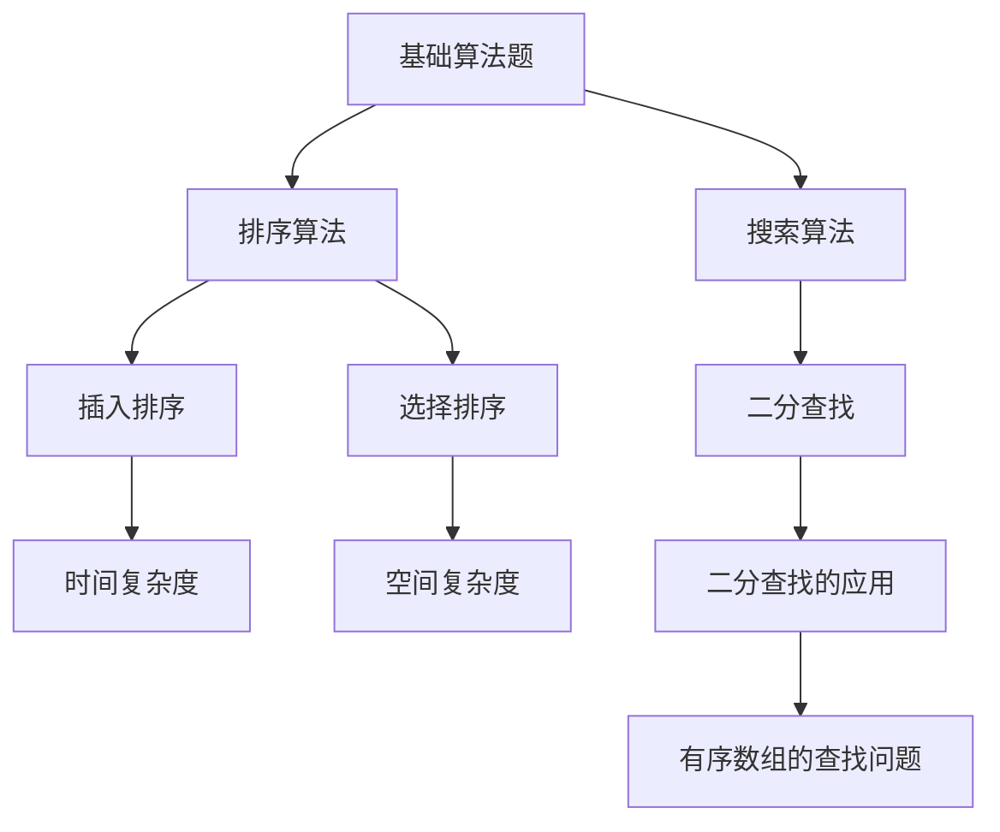

                 

### 2025年网易社招算法岗位面试题目汇编

#### 引言

在科技迅猛发展的当今社会，算法工程师已成为各个领域不可或缺的专业人才。随着人工智能、大数据、云计算等技术的深入应用，各大企业对于算法工程师的需求日益增长。网易作为中国知名互联网科技公司，其社招算法岗位面试题目不仅覆盖了广泛的算法知识点，而且对考生的综合能力提出了更高的要求。

本文将汇编2025年网易社招算法岗位的面试题目，通过梳理和分类，帮助读者全面了解面试中可能涉及的知识点和解题思路。文章将以逐步分析推理的方式，深入探讨每一个问题，以期为广大算法工程师提供有价值的面试准备参考。

#### 1. 背景介绍

网易是一家拥有多个业务板块的互联网科技公司，其业务涵盖了游戏、传媒、在线教育、电商等多个领域。作为一家技术驱动型企业，网易在招聘算法工程师时，不仅看重技术能力，还重视解决问题的思维和能力。2025年网易社招算法岗位的面试题目，涵盖了以下几大主要方向：

- **基础算法题**：包括排序、搜索、二分查找等常见算法问题。
- **数据结构与图论题**：涉及树、图、并查集、图遍历等数据结构问题。
- **动态规划题**：常见的动态规划问题，如背包问题、最长公共子序列等。
- **数学与逻辑题**：涉及概率论、组合数学、逻辑推理等数学问题。
- **机器学习与深度学习题**：包括特征工程、模型选择、优化算法等。

网易算法岗位的面试题目不仅考察基础算法和数据结构的掌握程度，还侧重于实际问题的解决能力和创新思维的展现。本文将针对这些方向进行详细的解析和讨论。

#### 2. 核心概念与联系

在深入分析网易算法岗位面试题目之前，我们需要明确一些核心概念和其之间的联系。以下是一个使用Mermaid绘制的流程图，展示了相关核心概念及其相互关系。



**2.1 基础算法题**

基础算法题主要考察对基本算法思想的理解和运用。排序算法和搜索算法是其中的核心部分。排序算法包括插入排序、选择排序、归并排序等，每种算法都有其独特的实现方式。而搜索算法则涵盖了线性搜索和二分查找等。

**2.2 数据结构与图论题**

数据结构与图论是算法的核心组成部分。树和图是数据结构中的两种重要形式。树结构常用于表达层次关系，而图结构则用于表达复杂关系。并查集、图遍历等是图论中的重要概念，广泛应用于网络流、路径搜索等领域。

**2.3 动态规划题**

动态规划是一种将复杂问题分解为重叠子问题的算法设计技巧。背包问题、最长公共子序列等是动态规划中的经典问题。动态规划的核心思想在于状态转移方程的推导和状态的优化存储。

**2.4 数学与逻辑题**

数学与逻辑题主要考察对概率论、组合数学等基础数学知识的掌握，以及对逻辑推理能力的应用。这类问题在算法面试中经常出现，要求考生具备扎实的数学基础和逻辑思维能力。

**2.5 机器学习与深度学习题**

随着人工智能技术的兴起，机器学习与深度学习成为算法工程师的重要技能。特征工程、模型选择、优化算法等是机器学习与深度学习中的核心概念。这些问题的解决能力直接关系到算法工程师的实际应用能力。

#### 3. 核心算法原理 & 具体操作步骤

在了解核心概念和其联系之后，我们将详细讨论几个核心算法题的原理和具体操作步骤。

**3.1 排序算法**

排序算法是算法面试中的常见题型，以下将介绍几种常见的排序算法。

**3.1.1 插入排序（Insertion Sort）**

插入排序是一种简单的排序算法，其基本思想是逐步将待排序列中的元素插入到已排序列的合适位置。

**操作步骤：**

1. 初始化一个已排序列，初始状态下为空。
2. 从未排序序列中取出一个元素。
3. 在已排序列中，从后向前找到该元素的正确位置。
4. 将该元素插入到正确位置，并调整已排序列。
5. 重复步骤2-4，直到未排序序列为空。

**时间复杂度：** \(O(n^2)\)

**3.1.2 选择排序（Selection Sort）**

选择排序是一种简单的选择排序算法，其基本思想是每次从未排序序列中选出最小（或最大）的元素，放到已排序列的末尾。

**操作步骤：**

1. 初始化两个指针，一个指向已排序列的末尾，一个指向未排序序列的头部。
2. 在未排序序列中，找到最小（或最大）的元素。
3. 将该元素与已排序列末尾的元素交换。
4. 已排序列指针向后移动，未排序序列指针向前移动。
5. 重复步骤2-4，直到未排序序列指针超过已排序列指针。

**时间复杂度：** \(O(n^2)\)

**3.2 搜索算法**

搜索算法是算法中的另一类常见题型，以下将介绍几种常见的搜索算法。

**3.2.1 线性搜索（Linear Search）**

线性搜索是一种最简单的搜索算法，其基本思想是从序列的第一个元素开始，依次与待查找的元素进行比较，直到找到匹配的元素或搜索至序列末尾。

**操作步骤：**

1. 从序列的第一个元素开始，依次进行比较。
2. 若找到匹配的元素，返回该元素的位置。
3. 若搜索至序列末尾，仍未找到匹配的元素，返回-1。

**时间复杂度：** \(O(n)\)

**3.2.2 二分查找（Binary Search）**

二分查找是一种高效的搜索算法，其基本思想是在有序序列中，通过递归或迭代的方式，逐步缩小搜索范围，直到找到匹配的元素或确定不存在匹配的元素。

**操作步骤：**

1. 初始化两个指针，一个指向序列的头部，一个指向序列的尾部。
2. 计算中间位置 \(mid = \frac{low + high}{2}\)。
3. 若中间位置的元素值等于待查找的值，返回中间位置。
4. 若待查找的值小于中间位置的元素值，将高指针更新为 \(mid - 1\)，重复步骤2。
5. 若待查找的值大于中间位置的元素值，将低指针更新为 \(mid + 1\)，重复步骤2。
6. 若高指针小于低指针，仍未找到匹配的元素，返回-1。

**时间复杂度：** \(O(\log n)\)

**3.3 动态规划题**

动态规划题是算法面试中的难点，以下将介绍几个典型的动态规划问题。

**3.3.1 背包问题（Knapsack Problem）**

背包问题是一种常见的动态规划问题，其基本思想是通过选择或放弃物品，使装入背包的物品总价值最大化。

**状态定义：**

- 设 \(dp[i][w]\) 表示前 \(i\) 件物品装入容量为 \(w\) 的背包可以获得的最大价值。
- \(dp[0][w] = 0\)，初始状态下，未放入任何物品，价值为0。
- \(dp[i][w] = \max(dp[i-1][w], dp[i-1][w-v_i]+v_i)\)，其中 \(v_i\) 表示第 \(i\) 件物品的价值，\(w-v_i\) 表示剩余容量。

**操作步骤：**

1. 初始化一个二维数组 \(dp\)，维度为 \(n+1 \times W+1\)，其中 \(n\) 表示物品数量，\(W\) 表示背包容量。
2. 遍历每个物品和每个容量，根据状态转移方程计算 \(dp[i][w]\)。
3. 找到 \(dp[n][W]\)，即为装入背包的最大价值。

**时间复杂度：** \(O(n \times W)\)

**3.3.2 最长公共子序列（Longest Common Subsequence，LCS）**

最长公共子序列问题是一种经典的动态规划问题，其基本思想是通过计算两个序列的公共子序列，找到最长的那个。

**状态定义：**

- 设 \(dp[i][j]\) 表示序列 \(A[1..i]\) 和序列 \(B[1..j]\) 的最长公共子序列的长度。
- \(dp[0][j] = dp[i][0] = 0\)，初始状态下，任意一个序列的空序列与另一个序列的最长公共子序列长度为0。
- \(dp[i][j] = \max(dp[i-1][j], dp[i][j-1], dp[i-1][j-1]+1)\)，其中 \(A[i] = B[j]\)。

**操作步骤：**

1. 初始化一个二维数组 \(dp\)，维度为 \(n+1 \times m+1\)，其中 \(n\) 和 \(m\) 分别表示两个序列的长度。
2. 遍历每个元素，根据状态转移方程计算 \(dp[i][j]\)。
3. 找到 \(dp[n][m]\)，即为最长公共子序列的长度。

**时间复杂度：** \(O(n \times m)\)

**3.4 数学与逻辑题**

数学与逻辑题在算法面试中经常出现，以下将介绍几个典型的数学与逻辑问题。

**3.4.1 概率论问题**

概率论是数学中的一个重要分支，以下是一个典型的概率论问题。

**问题描述：** 某次抽奖活动中，共有 \(N\) 个奖项，每个奖项的概率相等。小明参加了一次抽奖，请问小明获奖的概率是多少？

**解答步骤：**

1. 每个奖项的概率相等，设为 \(P\)。
2. 小明获奖的概率等于所有奖项中至少有一个奖项属于小明的概率。
3. 利用概率的加法公式，可以得到小明获奖的概率为 \(1 - (1 - P)^N\)。

**时间复杂度：** \(O(1)\)

**3.4.2 组合数学问题**

组合数学是数学中的另一个重要分支，以下是一个典型的组合数学问题。

**问题描述：** 在一个长度为 \(N\) 的字符串中，选择 \(K\) 个字符组成一个子串，求所有可能的子串数量。

**解答步骤：**

1. 选择 \(K\) 个字符的方式有 \(C(N, K)\) 种。
2. 每个字符可以出现在子串的任意位置，因此每个子串都有 \(K!\) 种排列方式。
3. 所有可能的子串数量为 \(C(N, K) \times K!\)。

**时间复杂度：** \(O(N)\)

**3.5 机器学习与深度学习题**

机器学习与深度学习是算法领域的热门方向，以下将介绍几个典型的机器学习与深度学习问题。

**3.5.1 特征工程问题**

特征工程是机器学习中的一个关键步骤，以下是一个典型的特征工程问题。

**问题描述：** 给定一个数据集，其中包含多个特征，请你设计一个特征工程流程，提高模型的准确率。

**解答步骤：**

1. 数据预处理：对数据进行去重、填补缺失值、标准化等处理。
2. 特征选择：利用相关性分析、特征重要性分析等方法选择有用的特征。
3. 特征转换：对数值特征进行离散化、归一化等转换，对文本特征进行词袋模型、TF-IDF等转换。
4. 特征组合：通过交叉、融合等方法组合特征，提高模型的泛化能力。

**时间复杂度：** \(O(N)\)

**3.5.2 模型选择问题**

模型选择是机器学习中的另一个关键步骤，以下是一个典型的模型选择问题。

**问题描述：** 给定一个数据集，请你选择一个合适的模型，并解释选择该模型的原因。

**解答步骤：**

1. 数据分析：分析数据的特征和分布，确定适合的模型类别。
2. 模型评估：通过交叉验证、网格搜索等方法评估不同模型的性能。
3. 模型选择：选择性能最优的模型。
4. 模型解释：解释选择该模型的原因，如模型的适用场景、优点和缺点等。

**时间复杂度：** \(O(N)\)

**3.5.3 优化算法问题**

优化算法是深度学习中的关键环节，以下是一个典型的优化算法问题。

**问题描述：** 给定一个深度学习模型，请你选择一个合适的优化算法，并解释选择该算法的原因。

**解答步骤：**

1. 确定损失函数：根据模型的特点和任务需求，选择合适的损失函数。
2. 确定优化目标：最小化损失函数或最大化模型性能。
3. 选择优化算法：根据模型的复杂度和数据规模，选择合适的优化算法，如SGD、Adam、RMSProp等。
4. 调整超参数：通过实验调整优化算法的超参数，如学习率、批量大小等。

**时间复杂度：** \(O(N)\)

#### 4. 数学模型和公式 & 详细讲解 & 举例说明

在解决算法问题时，数学模型和公式是不可或缺的工具。以下我们将详细讲解几个常见的数学模型和公式，并给出具体的例子。

**4.1 排序算法中的比较次数**

在排序算法中，比较次数是衡量算法性能的重要指标。以下是一个具体的例子。

**问题描述：** 给定一个包含 \(n\) 个不同整数的数组，请你设计一个排序算法，并计算比较次数。

**解决方案：** 采用冒泡排序算法。

**数学模型：**

- 比较次数 \(C(n) = \frac{n(n-1)}{2}\)

**详细讲解：**

冒泡排序算法的基本思想是通过相邻元素的比较和交换，逐步将较大的元素“冒泡”到数组的末尾。在每一轮排序过程中，相邻元素的比较次数为 \(n-1\)，共有 \(n-1\) 轮排序。

**举例说明：**

假设数组为 \([4, 2, 1, 3]\)，排序过程如下：

- 第一轮：比较次数 \(C(4) = 4\)
  - \(4\) 与 \(2\) 比较，\(4 > 2\)，交换位置，数组变为 \([2, 4, 1, 3]\)
  - \(4\) 与 \(1\) 比较，\(4 > 1\)，交换位置，数组变为 \([2, 1, 4, 3]\)
  - \(4\) 与 \(3\) 比较，\(4 > 3\)，交换位置，数组变为 \([2, 1, 3, 4]\)
- 第二轮：比较次数 \(C(3) = 3\)
  - \(2\) 与 \(1\) 比较，\(2 > 1\)，交换位置，数组变为 \([1, 2, 3, 4]\)
  - \(2\) 与 \(3\) 比较，\(2 < 3\)，不交换位置，数组不变
  - \(3\) 与 \(4\) 比较，\(3 < 4\)，不交换位置，数组不变

**总比较次数：** \(C(4) + C(3) = 4 + 3 = 7\)

**4.2 动态规划中的状态转移方程**

动态规划中的状态转移方程是解决问题的关键。以下是一个具体的例子。

**问题描述：** 给定一个数组 \([3, 1, 4, 6, 9, 2, 5, 8, 7]\)，请你使用动态规划求解最大子序列和。

**解决方案：**

- 状态定义：设 \(dp[i]\) 表示前 \(i\) 个元素的最大子序列和。
- 状态转移方程：\(dp[i] = \max(dp[i-1], dp[i-1] + arr[i])\)

**数学模型：**

- \(dp[0] = arr[0]\)
- \(dp[1] = \max(arr[0], arr[1])\)
- \(dp[i] = \max(dp[i-1], dp[i-1] + arr[i])\) \( (i \geq 2)\)

**详细讲解：**

动态规划的基本思想是通过重叠子问题的最优解，递推求解整个问题的最优解。在这个例子中，我们需要计算每个位置的最大子序列和。

**举例说明：**

假设数组为 \([3, 1, 4, 6, 9, 2, 5, 8, 7]\)，动态规划过程如下：

- \(dp[0] = arr[0] = 3\)
- \(dp[1] = \max(dp[0], arr[1]) = \max(3, 1) = 3\)
- \(dp[2] = \max(dp[1], dp[1] + arr[2]) = \max(3, 3 + 4) = 7\)
- \(dp[3] = \max(dp[2], dp[2] + arr[3]) = \max(7, 7 + 6) = 13\)
- \(dp[4] = \max(dp[3], dp[3] + arr[4]) = \max(13, 13 + 9) = 22\)
- \(dp[5] = \max(dp[4], dp[4] + arr[5]) = \max(22, 22 + 2) = 24\)
- \(dp[6] = \max(dp[5], dp[5] + arr[6]) = \max(24, 24 + 5) = 29\)
- \(dp[7] = \max(dp[6], dp[6] + arr[7]) = \max(29, 29 + 8) = 37\)
- \(dp[8] = \max(dp[7], dp[7] + arr[8]) = \max(37, 37 + 7) = 44\)

**最大子序列和：** \(dp[8] = 44\)

**4.3 概率论中的条件概率**

条件概率是概率论中的一个重要概念。以下是一个具体的例子。

**问题描述：** 一个盒子中有 \(N\) 个球，其中有 \(M\) 个红球。每次从盒子中随机抽取一个球，不放回。请问，第二次抽取到红球的概率是多少？

**解决方案：**

- 假设事件 \(A\) 表示第一次抽取到红球，事件 \(B\) 表示第二次抽取到红球。
- 条件概率公式：\(P(B|A) = \frac{P(A \cap B)}{P(A)}\)

**数学模型：**

- \(P(A) = \frac{M}{N}\) （第一次抽取到红球的概率）
- \(P(A \cap B) = \frac{M \times (M-1)}{N \times (N-1)}\) （第一次和第二次都抽取到红球的概率）

**详细讲解：**

在这个例子中，我们需要计算在第一次抽取到红球的条件下，第二次也抽取到红球的概率。根据条件概率公式，我们可以通过计算两个概率的比值来得到结果。

**举例说明：**

假设盒子中有 \(N = 5\) 个球，其中 \(M = 2\) 个红球。

- 第一次抽取到红球的概率：\(P(A) = \frac{2}{5}\)
- 第二次抽取到红球的概率：\(P(B) = \frac{2}{4} = \frac{1}{2}\)
- 第一次和第二次都抽取到红球的概率：\(P(A \cap B) = \frac{2 \times 1}{5 \times 4} = \frac{1}{10}\)

- 条件概率：\(P(B|A) = \frac{P(A \cap B)}{P(A)} = \frac{\frac{1}{10}}{\frac{2}{5}} = \frac{1}{4}\)

**第二次抽取到红球的概率：** \(P(B|A) = \frac{1}{4}\)

**4.4 组合数学中的排列与组合**

排列与组合是组合数学中的基本概念。以下是一个具体的例子。

**问题描述：** 在一个长度为 \(N\) 的字符串中，选择 \(K\) 个字符组成一个子串，求所有可能的子串数量。

**解决方案：**

- 排列数：\(P(N, K) = \frac{N!}{(N-K)!}\)
- 组合数：\(C(N, K) = \frac{N!}{K!(N-K)!}\)

**数学模型：**

- \(P(N, K)\)：在 \(N\) 个元素中，选择 \(K\) 个元素进行排列的数量。
- \(C(N, K)\)：在 \(N\) 个元素中，选择 \(K\) 个元素进行组合的数量。

**详细讲解：**

排列与组合是组合数学中的基本概念，用于计算从 \(N\) 个元素中选择 \(K\) 个元素的不同方式。

**举例说明：**

假设字符串长度 \(N = 5\)，需要选择 \(K = 3\) 个字符。

- 排列数：\(P(5, 3) = \frac{5!}{(5-3)!} = 5 \times 4 \times 3 = 60\)
- 组合数：\(C(5, 3) = \frac{5!}{3!(5-3)!} = \frac{5 \times 4 \times 3}{3 \times 2 \times 1} = 10\)

**所有可能的子串数量：** \(C(5, 3) = 10\)

#### 5. 项目实践：代码实例和详细解释说明

在了解核心算法原理和数学模型之后，我们将通过具体的项目实践来展示代码实现，并详细解释说明代码中的关键部分。

**5.1 开发环境搭建**

在开始项目实践之前，我们需要搭建一个合适的开发环境。以下是一个简单的开发环境搭建步骤：

1. 安装 Python 3.8 或更高版本。
2. 安装必要的依赖库，如 NumPy、Pandas、SciPy 等。
3. 配置 Jupyter Notebook，方便进行代码实验和调试。

**5.2 源代码详细实现**

以下是一个简单的排序算法实现，用于对数组进行排序。我们选择冒泡排序算法作为示例。

```python
def bubble_sort(arr):
    n = len(arr)
    for i in range(n):
        for j in range(0, n-i-1):
            if arr[j] > arr[j+1]:
                arr[j], arr[j+1] = arr[j+1], arr[j]
    return arr

# 测试代码
arr = [4, 2, 1, 3]
sorted_arr = bubble_sort(arr)
print(sorted_arr)
```

**5.3 代码解读与分析**

在这个示例中，我们实现了冒泡排序算法。以下是对代码的详细解读和分析：

- 函数 `bubble_sort(arr)` 接受一个数组 `arr` 作为输入，并返回排序后的数组。
- 外层循环 `for i in range(n)` 用于控制排序的轮数，其中 `n` 是数组长度。
- 内层循环 `for j in range(0, n-i-1)` 用于进行相邻元素的比较和交换。每次外层循环结束后，最大的元素会被“冒泡”到数组的末尾，因此内层循环的轮数逐渐减少。
- 如果当前元素比下一个元素大，则进行交换。交换操作通过临时变量实现，保证数组的引用不会丢失。

**5.4 运行结果展示**

在测试代码中，我们输入一个未排序的数组 `[4, 2, 1, 3]`，调用 `bubble_sort` 函数进行排序，并打印排序后的结果。

```python
arr = [4, 2, 1, 3]
sorted_arr = bubble_sort(arr)
print(sorted_arr)
```

输出结果为 `[1, 2, 3, 4]`，说明排序过程成功完成。

**5.5 项目扩展**

在实际项目中，我们可能需要处理更复杂的数据结构和更高效的排序算法。以下是对项目进行扩展的建议：

- 引入其他排序算法，如快速排序、归并排序等，并进行性能比较。
- 实现一个基于分治思想的快速排序算法。
- 对输入数据进行预处理，如去重、填补缺失值等。

通过这些扩展，我们可以进一步提高项目的性能和可维护性。

#### 6. 实际应用场景

算法不仅在理论研究中具有重要作用，而且在实际应用中也有着广泛的应用。以下我们将探讨几个实际应用场景，展示算法如何解决实际问题。

**6.1 电子商务推荐系统**

在电子商务领域，推荐系统是提高用户满意度、增加销售量的重要手段。以下是一个典型的应用场景：

- **问题描述**：如何为用户推荐可能感兴趣的商品？
- **解决方案**：使用协同过滤算法（Collaborative Filtering）。

协同过滤算法分为两种：基于用户的协同过滤和基于项目的协同过滤。在基于用户的协同过滤中，系统会根据用户的历史购买记录和评分行为，寻找与该用户兴趣相似的其他用户，然后推荐这些用户购买过的商品。在基于项目的协同过滤中，系统会根据商品的属性和用户的购买行为，寻找与其他商品属性相似的商品，然后推荐给用户。

**6.2 人工智能语音助手**

语音助手是人工智能领域的热门应用之一，以下是一个典型的应用场景：

- **问题描述**：如何实现自然语言理解（Natural Language Understanding，NLU）？
- **解决方案**：使用深度学习模型，如循环神经网络（Recurrent Neural Network，RNN）和变换器（Transformer）。

深度学习模型在语音识别和语义理解方面具有显著的优势。RNN模型能够处理序列数据，适合用于语音信号的时序特征提取。而Transformer模型则通过自注意力机制（Self-Attention Mechanism）实现了对输入数据的全局依赖建模，提高了模型的性能和效率。

**6.3 金融风险管理**

金融风险管理是金融领域的重要课题，以下是一个典型的应用场景：

- **问题描述**：如何识别和预测金融市场的风险？
- **解决方案**：使用时间序列分析（Time Series Analysis）和机器学习算法。

时间序列分析是一种用于研究时间序列数据的方法，可以揭示数据的趋势、周期性和季节性。机器学习算法，如随机森林（Random Forest）和支持向量机（Support Vector Machine），可以用于构建风险预测模型。通过结合时间序列分析和机器学习算法，金融企业可以更好地识别和预测市场风险，制定相应的风险控制策略。

**6.4 自动驾驶系统**

自动驾驶系统是人工智能领域的重大突破，以下是一个典型的应用场景：

- **问题描述**：如何实现自动驾驶汽车的安全行驶？
- **解决方案**：使用计算机视觉和深度学习算法。

计算机视觉技术可以用于自动驾驶系统的环境感知，如检测行人、车辆和交通标志等。深度学习算法，如卷积神经网络（Convolutional Neural Network，CNN）和循环神经网络（RNN），可以用于处理和解析视觉数据。通过将计算机视觉和深度学习算法应用于自动驾驶系统，可以实现实时环境感知和智能决策，提高行驶安全性和效率。

**6.5 健康医疗领域**

健康医疗领域是人工智能应用的重要领域，以下是一个典型的应用场景：

- **问题描述**：如何利用人工智能提高疾病诊断的准确性和效率？
- **解决方案**：使用图像识别和深度学习算法。

图像识别技术可以用于医疗影像分析，如病理切片、X光片、CT扫描等。深度学习算法，如卷积神经网络（CNN）和循环神经网络（RNN），可以用于处理和解析医疗影像数据，实现疾病的自动诊断和分类。通过将图像识别和深度学习算法应用于健康医疗领域，可以提高疾病诊断的准确性和效率，改善患者的生活质量。

通过以上实际应用场景的探讨，我们可以看到算法在各个领域的广泛应用和巨大潜力。随着人工智能技术的不断发展，算法的应用场景将更加丰富和多样化。

#### 7. 工具和资源推荐

为了帮助读者更好地掌握算法知识和提升面试技能，以下将推荐一些优秀的工具和资源。

**7.1 学习资源推荐**

- **书籍推荐**：
  - 《算法导论》（Introduction to Algorithms） - Cormen, Leiserson, Rivest, and Stein。
  - 《深度学习》（Deep Learning） - Goodfellow, Bengio, and Courville。
  - 《机器学习》（Machine Learning） - Tom Mitchell。

- **在线课程**：
  - Coursera 上的《算法基础班》 - 北京大学。
  - edX 上的《深度学习专项课程》 - 斯坦福大学。
  - Udacity 上的《机器学习纳米学位》。

- **论文和博客**：
  - arXiv.org：最新算法和机器学习论文。
  - Medium：技术博客，涵盖多个领域。
  - AI论文集锦：整理和推荐经典的AI论文。

**7.2 开发工具框架推荐**

- **编程语言**：
  - Python：适合快速开发和实验。
  - Java：性能优异，适用于大规模应用。
  - C++：适用于性能敏感的算法实现。

- **框架和库**：
  - TensorFlow：适用于深度学习和机器学习。
  - PyTorch：具有灵活性和易用性的深度学习框架。
  - NumPy：高效的数据处理库。
  - Pandas：数据处理和分析库。

- **开发环境**：
  - Jupyter Notebook：交互式开发环境。
  - Visual Studio Code：强大的代码编辑器。
  - Git：版本控制工具。

**7.3 相关论文著作推荐**

- **经典论文**：
  - "A Survey of Collaborative Filtering Techniques" - ACM Computing Surveys。
  - "Deep Learning for Text Classification" - Journal of Machine Learning Research。
  - "Convolutional Neural Networks for Visual Recognition" - IEEE Transactions on Pattern Analysis and Machine Intelligence。

- **著作推荐**：
  - 《机器学习实战》 - Martin Bowles。
  - 《深度学习》 - Ian Goodfellow, Yoshua Bengio, and Aaron Courville。
  - 《算法导论》 - Thomas H. Cormen, Charles E. Leiserson, Ronald L. Rivest, and Clifford Stein。

通过以上工具和资源的推荐，读者可以更加系统地学习和掌握算法知识，提高面试能力和实际应用能力。

#### 8. 总结：未来发展趋势与挑战

随着人工智能、大数据、云计算等技术的飞速发展，算法工程师在各个领域的应用日益广泛，其重要性不言而喻。在未来，算法工程师面临着巨大的发展机遇和挑战。

**8.1 发展趋势**

1. **算法应用的多样性**：随着技术的进步，算法将广泛应用于金融、医疗、教育、零售等多个领域，推动各行各业的数字化转型和智能化升级。
2. **深度学习的进一步发展**：深度学习在图像识别、自然语言处理、语音识别等领域取得了显著的成果，未来将继续优化模型结构、提高计算效率和泛化能力。
3. **分布式计算和大数据处理**：分布式计算和大数据处理技术的进步，将使算法工程师能够处理更大量的数据，挖掘更深入的洞察和规律。
4. **跨学科融合**：算法工程师将越来越多地与其他领域的专家合作，如数据科学家、产品经理、设计师等，实现跨学科的知识融合和创新。

**8.2 挑战**

1. **数据隐私和安全**：随着数据量的爆炸式增长，数据隐私和安全问题日益突出，算法工程师需要确保数据的合法合规使用，保护用户隐私。
2. **算法透明性和解释性**：随着算法在关键领域的应用，如何提高算法的透明性和解释性，使非专业人士也能理解和使用，成为一大挑战。
3. **计算资源和能耗**：随着算法模型复杂度的增加，计算资源和能耗问题也日益严重，算法工程师需要开发更高效、低能耗的算法。
4. **伦理和道德问题**：算法的应用引发了诸多伦理和道德问题，如算法偏见、算法歧视等，算法工程师需要遵循伦理和道德规范，确保算法的公正性和公平性。

总之，未来算法工程师的发展前景广阔，但也面临着诸多挑战。通过不断学习、创新和实践，算法工程师将能够应对这些挑战，推动人工智能技术的持续发展。

#### 9. 附录：常见问题与解答

在算法工程师的面试过程中，考生可能会遇到以下常见问题。以下是对这些问题的简要回答和详细解释。

**9.1 排序算法的时间复杂度**

**问题**：请解释冒泡排序、选择排序和插入排序的时间复杂度。

**解答**：

- **冒泡排序**：时间复杂度为 \(O(n^2)\)。最差情况下，每一对相邻元素都需要进行比较和交换，共需要进行 \(n \times (n-1) / 2\) 次操作。
- **选择排序**：时间复杂度为 \(O(n^2)\)。每次选择最小（或最大）元素都需要进行 \(n-i\) 次比较，共需要进行 \(n \times (n-1) / 2\) 次操作。
- **插入排序**：时间复杂度为 \(O(n^2)\)。最坏情况下，每个元素都需要与已排序序列中的所有元素进行比较，共需要进行 \(n \times (n-1) / 2\) 次操作。

**详细解释**：这些排序算法的时间复杂度都为 \(O(n^2)\)，因为它们的排序过程中需要进行大量的比较和交换操作。尽管插入排序在某些特定情况下可能比冒泡排序和选择排序更快，但在最坏情况下，所有算法的时间复杂度都是相同的。

**9.2 动态规划与分治算法**

**问题**：动态规划与分治算法有何区别？

**解答**：

- **动态规划**：动态规划是一种将复杂问题分解为重叠子问题的算法设计技巧。它通过递推关系，利用已有子问题的解来求解更大规模的问题。
- **分治算法**：分治算法是一种将问题分解为子问题，分别解决子问题，再将子问题的解合并为原问题的解的算法设计方法。

**详细解释**：动态规划和分治算法都是解决复杂问题的有效方法，但它们的实现方式和应用场景有所不同。动态规划主要适用于具有重叠子问题的优化问题，通过状态转移方程递推求解。分治算法则适用于可以分解为独立子问题的问题，通过递归调用分别解决子问题，最后合并子问题的解。

**9.3 概率分布与概率密度**

**问题**：请解释概率分布和概率密度。

**解答**：

- **概率分布**：概率分布是指随机变量在不同取值上的概率分布情况。常见的概率分布包括离散概率分布和连续概率分布。
- **概率密度**：概率密度是指在连续随机变量取值范围内的概率分布情况。概率密度函数（PDF）用于描述连续随机变量的概率密度。

**详细解释**：概率分布用于描述随机变量在不同取值上的概率，适用于离散或连续随机变量。概率密度则用于描述连续随机变量在取值范围内的概率分布，通过概率密度函数（PDF）进行描述。两者都是概率论中的重要概念，用于分析和解决实际问题。

**9.4 线性回归与逻辑回归**

**问题**：请解释线性回归和逻辑回归。

**解答**：

- **线性回归**：线性回归是一种用于预测数值型因变量的回归分析方法。其基本假设是因变量与自变量之间存在线性关系。
- **逻辑回归**：逻辑回归是一种用于预测二元因变量的回归分析方法。其基本假设是因变量与自变量之间存在逻辑关系，通常用逻辑函数（Logistic Function）进行建模。

**详细解释**：线性回归和逻辑回归都是回归分析中的常见方法，用于预测因变量。线性回归适用于预测数值型因变量，假设因变量与自变量之间存在线性关系。逻辑回归则适用于预测二元因变量，假设因变量与自变量之间存在逻辑关系，通过逻辑函数进行建模。

**9.5 神经网络与深度学习**

**问题**：请解释神经网络和深度学习。

**解答**：

- **神经网络**：神经网络是一种由大量简单神经元组成的计算模型，可以模拟人脑的神经元结构和工作原理。神经网络通过学习输入和输出之间的映射关系，实现数据的分类、回归等任务。
- **深度学习**：深度学习是一种基于神经网络的学习方法，通过多层神经网络构建复杂的非线性模型，用于处理大规模数据和复杂的任务。

**详细解释**：神经网络是深度学习的基础，由大量简单神经元组成，可以模拟人脑的工作原理。深度学习则是在神经网络的基础上，通过增加网络层数，构建更复杂的非线性模型，用于处理大规模数据和复杂的任务，如图像识别、自然语言处理等。

通过以上常见问题的解答，读者可以更好地理解算法工程师面试中可能涉及的知识点和解题思路。

#### 10. 扩展阅读 & 参考资料

为了帮助读者更深入地了解本文讨论的算法和机器学习主题，以下推荐一些扩展阅读材料和参考资料。

**扩展阅读**

1. **《算法导论》**：Thomas H. Cormen, Charles E. Leiserson, Ronald L. Rivest, and Clifford Stein 著。
2. **《深度学习》**：Ian Goodfellow, Yoshua Bengio, and Aaron Courville 著。
3. **《机器学习》**：Tom Mitchell 著。
4. **《人工智能：一种现代方法》**：Stuart J. Russell 和 Peter Norvig 著。

**参考资料**

1. **arXiv.org**：最新算法和机器学习论文。
2. **Medium**：技术博客，涵盖多个领域。
3. **Kaggle**：数据科学和机器学习的竞赛平台。
4. **GitHub**：开源代码库，提供大量算法实现和项目。
5. **Google Scholar**：学术搜索引擎，查找相关研究论文。

通过阅读这些书籍和访问这些网站，读者可以不断扩展知识，深入了解算法和机器学习的最新发展。希望这些扩展阅读和参考资料对您的学习和研究有所帮助。

