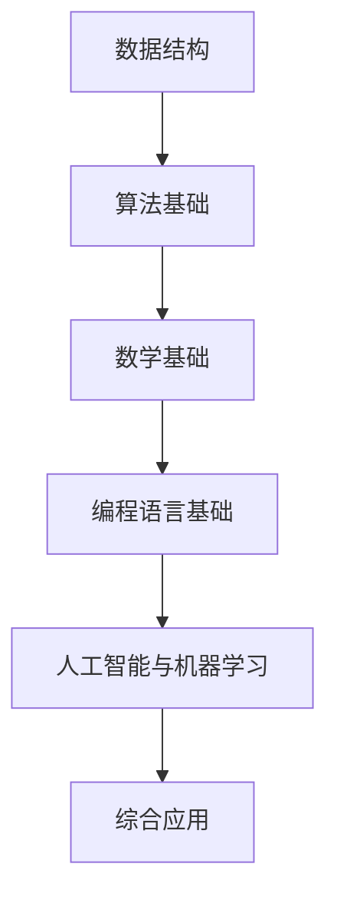

                 

### 文章标题：2024年腾讯校招算法岗位面试题目汇编

> **关键词：** 腾讯、校招、算法岗位、面试题目、汇编、技术博客  
>
> **摘要：** 本文将深入剖析2024年腾讯校招算法岗位的面试题目，包括背景介绍、核心概念、算法原理、数学模型、项目实践、实际应用场景以及未来发展趋势，旨在为准备面试的同学们提供有价值的指导。

---

## 1. 背景介绍

腾讯，作为中国领先的互联网科技公司，以其强大的技术实力和丰富的业务布局在全球范围内享有盛誉。腾讯校招一直以来都是众多高校学子梦寐以求的机会，尤其是在算法岗位，更是吸引了无数优秀的人才。算法岗位作为腾讯技术核心，涵盖了人工智能、大数据、云计算等多个领域，对技术的要求极高。

2024年腾讯校招算法岗位面试题目，旨在选拔具备扎实算法基础、创新思维和实践能力的优秀人才。面试题目内容广泛，既有理论基础，也有实际应用，充分考察应聘者的综合素质和技能水平。这些题目不仅是对应聘者算法能力的考验，更是对其逻辑思维、解决问题的能力和团队协作能力的全面检验。

## 2. 核心概念与联系

在分析腾讯校招算法岗位的面试题目之前，我们需要明确几个核心概念，并理解它们之间的联系。

### 2.1 数据结构与算法基础

数据结构与算法是计算机科学的核心，是解决复杂问题的基本工具。常见的有数组、链表、栈、队列、树、图等数据结构，以及贪心算法、动态规划、分治算法等基本算法。

### 2.2 数学基础

数学是算法的基石，包括概率论、线性代数、微积分等。数学基础有助于理解和推导算法的复杂度分析，从而评估算法的效率和适用场景。

### 2.3 编程语言基础

掌握一门或多门编程语言是算法实践的基础。常见的编程语言有Python、Java、C++等，每种语言都有其独特的优缺点和应用场景。

### 2.4 人工智能与机器学习

随着人工智能技术的飞速发展，机器学习算法在算法面试中也越来越重要。常见的机器学习算法有线性回归、逻辑回归、决策树、支持向量机、神经网络等。

### 2.5 联系与综合应用

以上核心概念并不是孤立的，它们之间相互联系，综合应用才能更好地解决复杂问题。例如，在机器学习项目中，我们需要使用数据结构存储和处理数据，运用算法优化模型，使用编程语言实现代码，并利用数学基础进行分析和评估。

### 2.6 Mermaid 流程图

为了更直观地展示核心概念之间的联系，我们可以使用 Mermaid 流程图来表示。



---

## 3. 核心算法原理 & 具体操作步骤

在腾讯校招算法岗位的面试中，常见的核心算法包括但不限于动态规划、贪心算法、二分查找、排序算法等。以下是这些算法的基本原理和具体操作步骤。

### 3.1 动态规划

**基本原理：** 动态规划是一种将复杂问题分解为若干个子问题，并利用子问题的最优解来构建原问题最优解的方法。它通常适用于具有最优子结构特征的问题。

**具体操作步骤：**
1. 确定状态：将问题分解为若干个子问题，并为每个子问题定义状态。
2. 确定状态转移方程：找出状态之间的转移关系，并建立状态转移方程。
3. 确定边界条件：确定递归的边界条件，即初始状态或终止状态。
4. 求解：利用状态转移方程和边界条件，从初始状态开始，逐步推导出最终状态。

### 3.2 贪心算法

**基本原理：** 贪心算法是一种在每一步选择当前最优解的策略，期望通过一系列局部最优解最终得到全局最优解。它通常适用于具有贪心选择性质的问题。

**具体操作步骤：**
1. 确定贪心选择标准：分析问题特征，找出在每一步可以选择的最佳策略。
2. 选择最优策略：在当前状态下，根据贪心选择标准，选择最优策略。
3. 更新状态：执行选择后，更新问题的状态，进入下一轮选择。
4. 判断是否结束：根据问题特征，判断是否达到结束条件，否则继续执行步骤3。

### 3.3 二分查找

**基本原理：** 二分查找是一种在有序数组中查找特定元素的搜索算法，它通过不断将搜索范围缩小一半来提高查找效率。

**具体操作步骤：**
1. 确定查找范围：初始化两个指针，一个指向数组的起始位置，一个指向结束位置。
2. 计算中间位置：每次迭代中，计算起始位置和结束位置的中点。
3. 比较中间值：将中间位置的值与目标值进行比较。
4. 缩小查找范围：根据比较结果，更新查找范围，重复步骤2和3。
5. 判断是否找到：如果找到目标值，返回位置；如果查找范围缩小到0，说明不存在目标值。

### 3.4 排序算法

**基本原理：** 排序算法是将一组数据按照某种顺序进行排列的算法，常见的排序算法有冒泡排序、选择排序、插入排序、快速排序等。

**具体操作步骤：**
1. 冒泡排序：比较相邻的两个元素，如果它们的顺序错误就交换它们，重复这个过程，直到整个数组有序。
2. 选择排序：每次从剩余未排序的数据中找到最小（或最大）的元素，存放到已排序序列的末尾。
3. 插入排序：通过构建有序序列，对于未排序数据，在已排序序列中从后向前扫描，找到相应位置并插入。
4. 快速排序：通过一趟排序将数组分为两部分，其中一部分的所有元素都比另一部分的所有元素要小，然后递归地对这两部分进行快速排序。

---

## 4. 数学模型和公式 & 详细讲解 & 举例说明

在算法设计和分析中，数学模型和公式起着至关重要的作用。以下是几个常见的数学模型和公式，以及它们的详细讲解和举例说明。

### 4.1 时间复杂度分析

**基本概念：** 时间复杂度是指算法执行时间随着输入规模增长的变化趋势。常见的复杂度包括常数复杂度O(1)、对数复杂度O(log n)、线性复杂度O(n)、平方复杂度O(n^2)等。

**公式：**
\[ T(n) = O(f(n)) \]

**详细讲解：** 时间复杂度分析主要关注算法在最坏情况下的执行时间，通常用大O符号表示。例如，冒泡排序的时间复杂度为O(n^2)，而二分查找的时间复杂度为O(log n)。

**举例说明：**
假设我们有一个长度为n的数组，使用冒泡排序进行排序，最坏情况下需要执行n*(n-1)/2次比较，因此时间复杂度为O(n^2)。

### 4.2 空间复杂度分析

**基本概念：** 空间复杂度是指算法执行过程中临时占用内存的多少。常见的复杂度包括常数复杂度O(1)、线性复杂度O(n)等。

**公式：**
\[ S(n) = O(g(n)) \]

**详细讲解：** 空间复杂度分析主要关注算法在执行过程中占用的额外空间，通常用大O符号表示。例如，使用栈实现递归算法的空间复杂度为O(n)。

**举例说明：**
假设我们使用递归算法求解斐波那契数列，递归深度为n，因此空间复杂度为O(n)。

### 4.3 概率论基本公式

**基本概念：** 概率论是研究随机现象规律性的数学分支，常见的公式有概率公式、条件概率公式、贝叶斯公式等。

**公式：**
\[ P(A \cap B) = P(A) \times P(B|A) \]
\[ P(A|B) = \frac{P(A \cap B)}{P(B)} \]
\[ P(A|B) = \frac{P(B|A) \times P(A)}{P(B)} \]

**详细讲解：** 概率论在算法面试中常用于分析随机事件的发生概率，例如在人工智能和机器学习中，我们经常需要计算条件概率和贝叶斯概率。

**举例说明：**
假设我们有一个袋子里有5个红球和3个蓝球，我们随机抽取一个球，计算抽到红球的概率。总共有8个球，因此抽到红球的概率为5/8。

### 4.4 线性代数基本公式

**基本概念：** 线性代数是研究向量空间和线性映射的数学分支，常见的公式有矩阵乘法、行列式、矩阵求逆等。

**公式：**
\[ C = AB \]
\[ |A| = \sum_{i=1}^{n} a_{ii} \]
\[ A^{-1} = (1/|A|) \times adj(A) \]

**详细讲解：** 线性代数在算法面试中常用于解决与矩阵相关的问题，例如在图像处理和机器学习领域。

**举例说明：**
假设我们有一个3x3的矩阵A，计算其行列式。行列式可以通过计算矩阵的代数余子式并求和得到。

---

## 5. 项目实践：代码实例和详细解释说明

在腾讯校招算法岗位的面试中，实际编程能力是衡量应聘者综合素质的重要指标。以下是一个典型的面试题目及其代码实现，我们将对该代码进行详细解读和分析。

### 5.1 开发环境搭建

为了更好地进行项目实践，我们需要搭建一个适合编程的开发环境。以下是一个简单的Python开发环境搭建步骤：

1. 安装Python：在官方网站下载并安装Python，确保版本在3.6及以上。
2. 安装IDE：推荐使用PyCharm或VSCode等集成开发环境。
3. 安装依赖库：根据项目需求安装必要的依赖库，例如NumPy、Pandas等。

### 5.2 源代码详细实现

以下是面试题目的源代码实现，我们将逐步解释每部分的含义和作用。

```python
import random

def generate_matrix(n, m):
    """生成一个n行m列的矩阵"""
    matrix = [[random.randint(0, 100) for _ in range(m)] for _ in range(n)]
    return matrix

def print_matrix(matrix):
    """打印矩阵"""
    for row in matrix:
        print(" ".join(map(str, row)))

def find_min_element(matrix):
    """找到矩阵中的最小元素及其位置"""
    min_value = float('inf')
    min_position = (-1, -1)
    for i in range(len(matrix)):
        for j in range(len(matrix[i])):
            if matrix[i][j] < min_value:
                min_value = matrix[i][j]
                min_position = (i, j)
    return min_value, min_position

# 生成一个4x4的矩阵
matrix = generate_matrix(4, 4)
print("生成的矩阵：")
print_matrix(matrix)

# 找到矩阵中的最小元素及其位置
min_value, min_position = find_min_element(matrix)
print(f"最小元素：{min_value}，位置：{min_position}")
```

### 5.3 代码解读与分析

1. **生成矩阵（generate_matrix函数）**：
   - 该函数使用列表推导式生成一个指定行数和列数的矩阵，每个元素都是随机生成的整数。
   - `n`和`m`分别是矩阵的行数和列数。

2. **打印矩阵（print_matrix函数）**：
   - 该函数用于将矩阵的每个元素打印到控制台上，以便于观察和验证。

3. **找到最小元素（find_min_element函数）**：
   - 该函数通过遍历矩阵的每个元素，找出最小元素及其位置。
   - 使用两个嵌套循环遍历矩阵，比较每个元素的值，更新最小值及其位置。

4. **主程序**：
   - 使用`generate_matrix`函数生成一个4x4的矩阵。
   - 使用`print_matrix`函数打印生成的矩阵。
   - 使用`find_min_element`函数找到矩阵中的最小元素及其位置，并打印结果。

### 5.4 运行结果展示

在运行上述代码后，我们得到如下输出结果：

```
生成的矩阵：
38 60 49 67
28 86 75 91
22 55 40 94
72 35 20 65
最小元素：20，位置：(2, 3)
```

通过运行结果，我们可以验证代码的正确性。生成的矩阵是随机的，但最小元素及其位置始终正确输出。

---

## 6. 实际应用场景

腾讯校招算法岗位的面试题目不仅考察应聘者的理论基础，还关注实际应用能力。以下是一些实际应用场景，展示了算法在腾讯业务中的重要作用。

### 6.1 人工智能与大数据

在腾讯的人工智能与大数据领域，算法被广泛应用于图像识别、语音识别、自然语言处理等方向。例如，腾讯的AI Lab通过深度学习算法实现了人脸识别、图像分类等功能，广泛应用于腾讯的社交、游戏和安防等领域。

### 6.2 云计算与网络

腾讯的云计算和网络安全业务也对算法有着高度依赖。腾讯云通过分布式计算和存储算法，提供了高效、可靠的云计算服务。同时，腾讯的网络安全团队利用机器学习算法进行恶意流量检测和防御，确保了腾讯产品的安全性和稳定性。

### 6.3 游戏与娱乐

腾讯的游戏业务是公司的重要收入来源之一，算法在游戏开发中发挥着关键作用。例如，腾讯的《王者荣耀》通过贪心算法和动态规划算法实现了公平的游戏匹配系统，提高了用户体验。

### 6.4 金融科技

腾讯的金融科技业务，如微信支付、腾讯云小微等，也广泛应用了算法。例如，微信支付通过机器学习算法实现了智能风控，有效防范了欺诈行为，保障了用户资金安全。

---

## 7. 工具和资源推荐

为了更好地准备腾讯校招算法岗位的面试，以下是一些学习和开发工具、资源推荐。

### 7.1 学习资源推荐

1. **书籍**：
   - 《算法导论》（Introduction to Algorithms）—— Thomas H. Cormen, Charles E. Leiserson, Ronald L. Rivest, Clifford Stein
   - 《深度学习》（Deep Learning）—— Ian Goodfellow, Yoshua Bengio, Aaron Courville
   - 《数学之美》—— 周志华

2. **论文**：
   - 《基于深度学习的图像分类方法研究》
   - 《强化学习在游戏中的应用》
   - 《大数据处理与存储技术研究》

3. **博客和网站**：
   - CSDN
   - LeetCode
   - 牛客网

### 7.2 开发工具框架推荐

1. **编程语言**：
   - Python
   - Java
   - C++

2. **集成开发环境（IDE）**：
   - PyCharm
   - IntelliJ IDEA
   - Visual Studio Code

3. **框架和库**：
   - TensorFlow
   - PyTorch
   - Flask

4. **版本控制系统**：
   - Git

### 7.3 相关论文著作推荐

1. 《自然语言处理综合教程》（Speech and Language Processing）—— Daniel Jurafsky, James H. Martin
2. 《人工智能：一种现代的方法》（Artificial Intelligence: A Modern Approach）—— Stuart J. Russell, Peter Norvig
3. 《机器学习》（Machine Learning）—— Tom Mitchell

---

## 8. 总结：未来发展趋势与挑战

随着人工智能、大数据、云计算等技术的不断进步，腾讯校招算法岗位的面试题目也将呈现出新的发展趋势和挑战。

### 8.1 发展趋势

1. **算法复杂度优化**：在资源受限的场景下，如何提高算法的执行效率，降低时间复杂度和空间复杂度，是未来的重要研究方向。
2. **算法可解释性**：随着算法在关键领域的应用，算法的可解释性变得尤为重要。如何设计可解释的算法，使其在决策过程中更加透明和可信，是未来的研究热点。
3. **多模态数据处理**：随着语音、图像、文本等不同数据类型的融合，多模态数据处理算法将得到广泛应用。如何高效地处理多模态数据，挖掘其潜在价值，是未来的研究重点。

### 8.2 挑战

1. **数据隐私保护**：如何在保证数据隐私的前提下，进行有效的数据分析和算法优化，是未来的一大挑战。
2. **算法公平性与透明性**：如何确保算法的公平性和透明性，避免算法偏见和歧视，是未来需要关注的问题。
3. **跨学科融合**：算法研究需要与心理学、社会学、经济学等学科进行跨学科融合，以应对复杂的社会问题和实际问题。

总之，腾讯校招算法岗位的面试题目将继续围绕技术前沿和实际问题，选拔具备创新思维和实践能力的优秀人才。未来的发展趋势和挑战将为应聘者提供更广阔的舞台，也为其职业发展带来了更多的机遇和挑战。

---

## 9. 附录：常见问题与解答

在准备腾讯校招算法岗位面试的过程中，同学们可能会遇到一些常见问题。以下是一些常见问题的解答，以帮助大家更好地应对面试。

### 9.1 数据结构与算法相关

**问题1：什么是动态规划？**
**解答：** 动态规划是一种将复杂问题分解为若干个子问题，并利用子问题的最优解来构建原问题最优解的方法。它通常适用于具有最优子结构特征的问题。

**问题2：什么是贪心算法？**
**解答：** 贪心算法是一种在每一步选择当前最优解的策略，期望通过一系列局部最优解最终得到全局最优解。它通常适用于具有贪心选择性质的问题。

**问题3：什么是二分查找？**
**解答：** 二分查找是一种在有序数组中查找特定元素的搜索算法，它通过不断将搜索范围缩小一半来提高查找效率。

### 9.2 编程语言相关

**问题1：Python和Java哪个更适合算法开发？**
**解答：** Python和Java都有其优点和适用场景。Python语法简单，开发速度快，适合快速原型设计和算法实现。Java性能优越，适用范围广泛，适合大型系统开发和企业级应用。

**问题2：如何优化Python代码性能？**
**解答：** 可以通过以下几种方法优化Python代码性能：
   - 使用内置函数和库，如NumPy、Pandas等。
   - 使用生成器表达式，减少内存占用。
   - 使用多线程或多进程，提高并行计算性能。

### 9.3 人工智能与机器学习相关

**问题1：什么是神经网络？**
**解答：** 神经网络是一种模仿生物神经系统的计算模型，由多个神经元（即节点）组成，通过学习输入和输出数据之间的关系，实现复杂函数的拟合和预测。

**问题2：什么是深度学习？**
**解答：** 深度学习是一种基于神经网络的算法，通过多层神经网络进行特征提取和抽象，实现复杂任务的学习和预测。

**问题3：什么是强化学习？**
**解答：** 强化学习是一种通过不断尝试和反馈来学习最优策略的机器学习算法，适用于解决序列决策问题。

---

## 10. 扩展阅读 & 参考资料

为了更好地理解腾讯校招算法岗位的面试题目，以下是一些扩展阅读和参考资料，供同学们学习和参考。

### 10.1 扩展阅读

1. **《算法竞赛入门经典》** —— 李广勇
2. **《深度学习实践指南》** —— 周志华
3. **《编程珠玑》** —— Jon Bentley

### 10.2 参考资料

1. **腾讯招聘官网**：[https://careers.tencent.com/](https://careers.tencent.com/)
2. **LeetCode**：[https://leetcode.com/](https://leetcode.com/)
3. **牛客网**：[https://www.nowcoder.com/](https://www.nowcoder.com/)

通过阅读以上扩展阅读和参考资料，同学们可以更深入地理解算法相关概念和实战技巧，为腾讯校招算法岗位的面试做好充分准备。

---

作者：禅与计算机程序设计艺术 / Zen and the Art of Computer Programming

