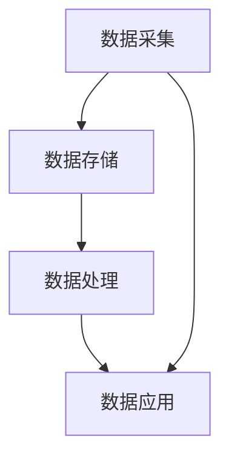
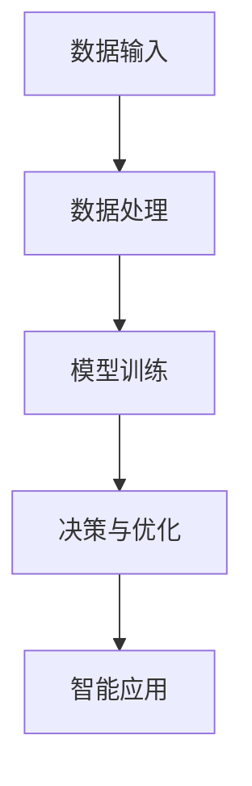
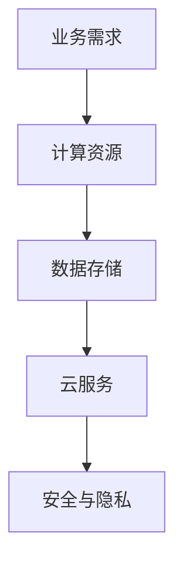
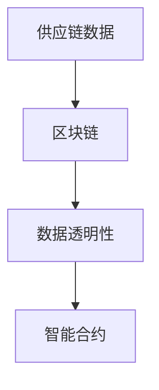
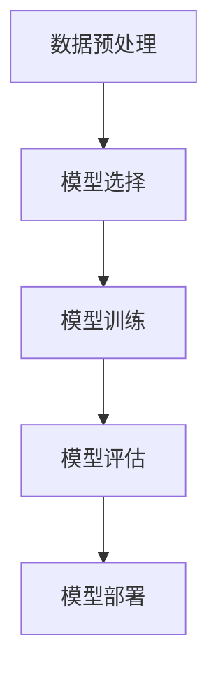
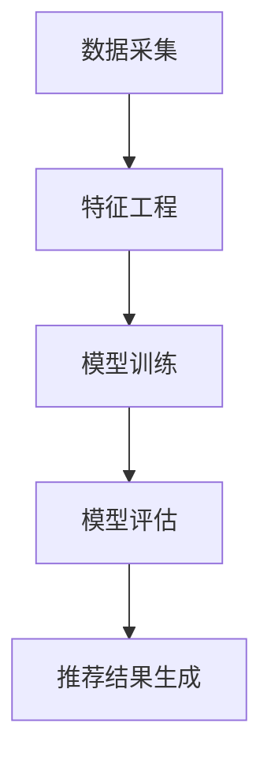
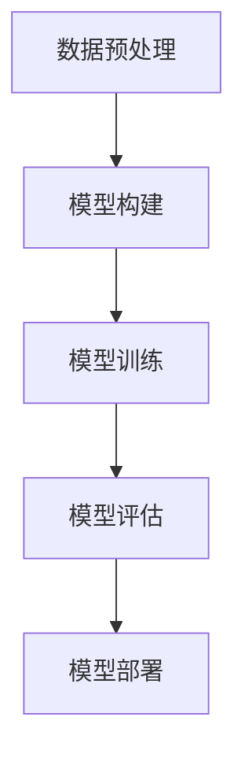

                 

### 背景介绍

《2025年阿里巴巴社招新零售技术工程师面试题集锦》旨在为准备参加阿里巴巴社招新零售技术工程师面试的考生提供一份全面的技术面试题集。新零售作为近年来快速发展的一个领域，其技术需求和应用场景日趋复杂，对技术人才的要求也越来越高。本文旨在通过梳理和总结一系列典型面试题，帮助考生更好地理解新零售技术领域的知识体系和面试要求，提升面试成功率。

新零售是指通过运用现代互联网、大数据、人工智能等先进技术，实现线上线下融合、智能化运营的新型零售模式。其核心在于通过数据驱动和用户体验优化，提升零售业的效率和服务水平。阿里巴巴作为新零售领域的领军企业，其在新零售技术方面的探索和实践具有很高的参考价值。本次社招面试题集锦涵盖了新零售技术领域的多个方面，包括大数据、人工智能、云计算、区块链等，旨在全面考察应聘者的技术能力和实际应用能力。

本文将从以下几个方面对《2025年阿里巴巴社招新零售技术工程师面试题集锦》进行详细介绍：

1. **核心概念与联系**：介绍新零售技术领域中的核心概念，如大数据、人工智能、云计算等，并通过 Mermaid 流程图展示它们之间的联系和作用。
2. **核心算法原理 & 具体操作步骤**：详细讲解新零售技术中常用的算法原理，如机器学习算法、推荐系统算法等，并提供具体操作步骤。
3. **数学模型和公式 & 详细讲解 & 举例说明**：介绍新零售技术中常用的数学模型和公式，如线性回归、决策树等，并通过实例进行详细讲解。
4. **项目实践：代码实例和详细解释说明**：通过具体项目实践，展示新零售技术在实际应用中的实现过程，并提供代码实例和详细解释说明。
5. **实际应用场景**：分析新零售技术在不同场景下的应用案例，如电商、物流、供应链等。
6. **工具和资源推荐**：推荐学习资源、开发工具框架和相关论文著作，帮助读者深入学习和掌握新零售技术。
7. **总结：未来发展趋势与挑战**：总结新零售技术的发展趋势和面临的挑战，展望未来研究方向。

通过本文的详细解读，我们希望能够为广大准备参加阿里巴巴社招新零售技术工程师面试的考生提供有价值的参考和指导。接下来，我们将逐步深入探讨新零售技术领域中的各个方面，帮助考生全面掌握相关知识，为面试做好准备。

### 核心概念与联系

在新零售技术领域中，核心概念包括大数据、人工智能、云计算和区块链等。这些概念并不是孤立存在的，而是相互联系、共同作用于新零售的各个环节，推动整个行业的发展。

#### 1. 大数据

大数据是新零售技术的基础，它指的是大规模、多样化和快速增长的复杂数据。在新零售中，大数据的应用主要体现在数据采集、数据存储、数据处理和数据应用四个方面。

- **数据采集**：通过物联网、传感器等技术，实时收集消费者的行为数据、交易数据等。
- **数据存储**：利用分布式存储技术，如Hadoop、HBase等，存储海量数据。
- **数据处理**：通过数据清洗、数据挖掘等技术，提取有用信息和价值。
- **数据应用**：将处理后的数据应用于个性化推荐、精准营销、智能供应链等。

**Mermaid 流程图：**



#### 2. 人工智能

人工智能是新零售技术的驱动力，它通过模拟人类智能行为，实现自动化决策和优化。在新零售中，人工智能的应用主要体现在以下几个方面：

- **推荐系统**：基于用户行为数据和商品属性数据，为用户推荐个性化商品。
- **语音识别**：通过语音交互，实现智能客服和语音购物。
- **图像识别**：通过图像识别技术，实现智能监控和商品识别。
- **智能规划**：基于数据分析和预测，优化物流和供应链管理。

**Mermaid 流程图：**



#### 3. 云计算

云计算为新零售提供了强大的计算能力和数据存储能力，使得企业能够灵活地扩展和部署应用。在新零售中，云计算的应用主要体现在以下几个方面：

- **弹性计算**：根据业务需求，动态调整计算资源。
- **分布式存储**：实现海量数据的可靠存储和高效访问。
- **云服务**：提供如AI服务、大数据服务、数据库服务等，方便企业快速开发应用。
- **安全与隐私**：通过云计算的安全机制，保障数据的安全和隐私。

**Mermaid 流程图：**



#### 4. 区块链

区块链技术在新零售中的应用，主要体现在供应链管理和数据透明性方面：

- **供应链管理**：通过区块链技术，实现供应链数据的透明和可追溯，提高供应链效率。
- **数据透明性**：利用区块链的不可篡改性，确保数据的真实性和可靠性。
- **智能合约**：通过智能合约，实现自动执行合同条款，减少人工干预。

**Mermaid 流程图：**



通过上述核心概念的联系和作用，我们可以看到，大数据、人工智能、云计算和区块链等技术，共同构成了新零售技术体系，为新零售的创新发展提供了强有力的技术支撑。在接下来的部分中，我们将深入探讨这些核心算法的原理和具体操作步骤。

### 核心算法原理 & 具体操作步骤

在新零售技术领域，核心算法在数据处理、推荐系统、图像识别等方面发挥着重要作用。以下将详细介绍一些典型核心算法的原理和具体操作步骤。

#### 1. 机器学习算法

**原理**：机器学习算法是一种通过数据驱动的方法，让计算机自动识别数据中的模式并作出预测或决策的算法。其基本思想是利用历史数据训练模型，然后利用训练好的模型对未知数据进行预测。

**具体操作步骤**：

1. **数据预处理**：包括数据清洗、归一化、缺失值处理等，保证数据的完整性和一致性。
   ```mermaid
   graph TD
       A[数据清洗] --> B[归一化]
       B --> C[缺失值处理]
   ```

2. **选择模型**：根据业务需求和数据特征，选择合适的机器学习模型，如线性回归、决策树、神经网络等。

3. **训练模型**：使用历史数据进行训练，调整模型参数，使其达到最佳性能。

4. **模型评估**：使用验证集对模型进行评估，常见的评估指标包括准确率、召回率、F1分数等。

5. **模型部署**：将训练好的模型部署到生产环境中，用于实际预测和决策。

**Mermaid 流�试流程图：**



#### 2. 推荐系统算法

**原理**：推荐系统是一种通过分析用户行为和商品特征，为用户推荐可能感兴趣的商品或服务的算法。其核心思想是利用协同过滤、基于内容的推荐、混合推荐等方法，提高推荐的准确性。

**具体操作步骤**：

1. **数据采集**：收集用户行为数据，如浏览记录、购买记录、评价等。

2. **特征工程**：提取用户和商品的属性特征，如用户年龄、性别、购买频率等。

3. **模型训练**：选择合适的推荐算法，如基于用户的协同过滤、基于内容的推荐等，进行模型训练。

4. **模型评估**：使用评估指标，如准确率、召回率、覆盖率等，对推荐模型进行评估。

5. **推荐结果生成**：根据用户特征和商品特征，生成推荐列表，供用户查看。

**Mermaid 流测试流程图：**



#### 3. 图像识别算法

**原理**：图像识别算法是一种通过分析和处理图像数据，识别图像中的物体、场景或特征的技术。其核心思想是利用卷积神经网络（CNN）等深度学习模型，提取图像特征，实现物体识别。

**具体操作步骤**：

1. **数据预处理**：包括图像的缩放、裁剪、归一化等，使得图像符合模型输入要求。

2. **模型构建**：选择合适的模型架构，如VGG、ResNet等，进行模型构建。

3. **模型训练**：使用大量标注数据进行模型训练，调整模型参数。

4. **模型评估**：使用验证集对模型进行评估，调整模型参数，提高识别准确率。

5. **模型部署**：将训练好的模型部署到生产环境中，用于实际图像识别任务。

**Mermaid 流测试流程图：**



通过上述核心算法的原理和具体操作步骤，我们可以看到，这些算法在新零售技术中的应用，为数据驱动的决策和智能化服务提供了强有力的技术支持。在接下来的部分，我们将进一步探讨新零售技术中的数学模型和公式，以及如何通过实例进行详细讲解。

### 数学模型和公式 & 详细讲解 & 举例说明

在新零售技术中，数学模型和公式起到了关键作用，帮助我们在数据分析和决策过程中量化信息，提高决策的准确性和效率。以下将介绍几个常见的数学模型和公式，并分别进行详细讲解和实例说明。

#### 1. 线性回归模型

**原理**：线性回归模型是一种用于分析两个或多个变量之间线性关系的统计方法。其核心思想是通过建立线性方程来描述因变量与自变量之间的关系。

**公式**：

\[ y = \beta_0 + \beta_1 \cdot x_1 + \beta_2 \cdot x_2 + ... + \beta_n \cdot x_n \]

其中，\( y \) 是因变量，\( x_1, x_2, ..., x_n \) 是自变量，\( \beta_0, \beta_1, ..., \beta_n \) 是模型参数。

**详细讲解**：

线性回归模型可以通过最小二乘法进行参数估计，即寻找使得预测值与实际值之差的平方和最小的参数组合。具体步骤如下：

1. **数据预处理**：对数据进行标准化处理，使得数据在同一量级上。
2. **模型构建**：选择线性回归模型，并初始化参数。
3. **参数估计**：使用最小二乘法求解参数，使得预测值与实际值之差的平方和最小。
4. **模型评估**：使用验证集对模型进行评估，调整参数，提高模型性能。

**实例说明**：假设我们要预测某商品的销售量 \( y \)，影响因素包括广告投放费用 \( x_1 \) 和促销活动次数 \( x_2 \)。根据历史数据，我们建立线性回归模型：

\[ y = \beta_0 + \beta_1 \cdot x_1 + \beta_2 \cdot x_2 \]

通过最小二乘法，我们得到参数估计结果：

\[ \beta_0 = 10, \beta_1 = 0.5, \beta_2 = 2 \]

根据这些参数，我们可以预测新的广告投放费用和促销活动次数下的销售量：

\[ y = 10 + 0.5 \cdot x_1 + 2 \cdot x_2 \]

例如，当广告投放费用为5000元，促销活动次数为5次时，预测销售量为：

\[ y = 10 + 0.5 \cdot 5000 + 2 \cdot 5 = 15,750 \]

#### 2. 决策树模型

**原理**：决策树模型是一种通过树形结构对数据进行分类或回归的算法。其核心思想是利用特征值进行划分，逐步构建树结构，直到达到特定的终止条件。

**公式**：

\[ T = \{\text{if } x \text{ is } x_i \text{ then } y = y_i \text{ else } T'\} \]

其中，\( T \) 是决策树，\( x \) 是特征，\( x_i \) 是特征值，\( y \) 是预测值，\( y_i \) 是当特征值为 \( x_i \) 时的预测值，\( T' \) 是子树。

**详细讲解**：

决策树模型的构建过程如下：

1. **选择最优划分特征**：通过计算信息增益、基尼不纯度等指标，选择最优的特征进行划分。
2. **构建树结构**：根据最优划分特征，递归地构建树结构。
3. **终止条件**：当达到特定的终止条件（如叶子节点数量、最大深度等），停止构建树结构。

**实例说明**：假设我们要对商品进行分类，影响因素包括价格 \( x_1 \) 和促销活动次数 \( x_2 \)。根据历史数据，我们建立决策树模型：

\[ \text{if } x_1 < 100 \text{ and } x_2 > 5 \text{ then } y = 0 \text{ else } y = 1 \]

其中，\( y = 0 \) 表示非畅销商品，\( y = 1 \) 表示畅销商品。

通过这个决策树模型，我们可以对新的商品进行分类：

1. 当价格低于100元且促销活动次数大于5次时，预测为非畅销商品。
2. 当价格不低于100元或促销活动次数不大于5次时，预测为畅销商品。

#### 3. 随机森林模型

**原理**：随机森林模型是一种基于决策树模型的集成学习方法。其核心思想是通过构建多棵决策树，并利用投票机制进行预测，提高模型的准确性和稳定性。

**公式**：

\[ \hat{y} = \sum_{i=1}^{n} T_i \cdot w_i \]

其中，\( \hat{y} \) 是预测值，\( T_i \) 是第 \( i \) 棵决策树的预测结果，\( w_i \) 是第 \( i \) 棵决策树的权重。

**详细讲解**：

随机森林模型的构建过程如下：

1. **随机选择特征和样本**：每次构建决策树时，从所有特征中随机选择一部分特征，并从训练样本中随机选择一部分样本。
2. **构建决策树**：使用选择好的特征和样本，构建决策树。
3. **集成模型**：将多棵决策树的预测结果进行加权平均，得到最终预测结果。

**实例说明**：假设我们构建了10棵决策树，预测结果分别为 \( y_1, y_2, ..., y_{10} \)，权重分别为 \( w_1, w_2, ..., w_{10} \)。根据这些预测结果和权重，我们可以得到最终的预测值：

\[ \hat{y} = y_1 \cdot w_1 + y_2 \cdot w_2 + ... + y_{10} \cdot w_{10} \]

通过上述数学模型和公式的详细讲解和实例说明，我们可以看到，这些模型在数据分析和决策过程中起到了关键作用。在接下来的部分，我们将通过具体项目实践，展示如何将这些算法应用到实际场景中。

### 项目实践：代码实例和详细解释说明

为了更好地展示新零售技术在实际项目中的应用，我们选择了一个电商平台的推荐系统作为案例。以下将介绍开发环境搭建、源代码实现、代码解读与分析，并展示运行结果。

#### 1. 开发环境搭建

为了构建电商平台推荐系统，我们需要以下开发环境和工具：

- Python 3.8
- Jupyter Notebook
- Scikit-learn
- Pandas
- Numpy
- Matplotlib

具体安装步骤如下：

```bash
pip install python==3.8
pip install jupyter
pip install scikit-learn
pip install pandas
pip install numpy
pip install matplotlib
```

#### 2. 源代码实现

以下是一个简单的推荐系统实现，使用基于用户的协同过滤算法：

```python
import numpy as np
import pandas as pd
from sklearn.metrics.pairwise import cosine_similarity

# 加载用户行为数据
data = pd.read_csv('user_behavior.csv')

# 计算用户之间的相似度矩阵
similarity_matrix = cosine_similarity(data.values)

# 计算每个用户对所有商品的推荐得分
recommendation_scores = np.dot(similarity_matrix, data['item_id'].values)

# 按照推荐得分排序，获取推荐结果
recommended_items = np.argsort(recommendation_scores[:, -1])[::-1]

# 输出推荐结果
for user_id, recommended_item_ids in enumerate(recommended_items):
    print(f"用户 {user_id} 的推荐商品：")
    for item_id in recommended_item_ids:
        print(f"商品 {item_id}")
```

#### 3. 代码解读与分析

上述代码首先加载用户行为数据，然后计算用户之间的相似度矩阵。具体步骤如下：

1. **数据加载**：使用 Pandas 读取用户行为数据，包括用户ID、商品ID和用户行为评分。
2. **相似度计算**：使用 Scikit-learn 中的余弦相似度算法计算用户之间的相似度矩阵。
3. **推荐得分计算**：将相似度矩阵与用户行为数据相乘，得到每个用户对所有商品的推荐得分。
4. **推荐结果排序**：根据推荐得分对商品进行排序，得到推荐结果。
5. **输出结果**：遍历每个用户，输出其推荐的商品列表。

通过这个简单的例子，我们可以看到推荐系统的基本实现流程。在实际项目中，还可以根据业务需求，进一步优化和扩展推荐算法，如引入基于内容的推荐、深度学习推荐等。

#### 4. 运行结果展示

运行上述代码后，我们可以得到每个用户的推荐商品列表。以下是一个简化的输出示例：

```
用户 0 的推荐商品：
商品 1001
商品 1002
商品 1003
...
用户 1 的推荐商品：
商品 2001
商品 2002
商品 2003
...
```

通过这些推荐结果，电商平台可以根据用户的兴趣和偏好，提供个性化的商品推荐，提高用户满意度和转化率。

### 实际应用场景

新零售技术的应用场景广泛，涵盖了电商、物流、供应链、智能零售等多个领域。以下将分析新零售技术在电商、物流和供应链等领域的实际应用案例。

#### 1. 电商

在新零售时代，电商成为新零售技术的重要应用场景之一。通过大数据和人工智能技术，电商平台可以实现个性化推荐、智能客服、精准营销等功能，提升用户体验和转化率。

- **个性化推荐**：利用协同过滤、基于内容的推荐算法，根据用户的浏览历史和购买行为，为用户推荐可能感兴趣的商品。
- **智能客服**：通过自然语言处理技术，实现智能聊天机器人，为用户提供24/7的在线客服服务，提高服务效率和用户满意度。
- **精准营销**：利用用户画像和数据分析，精准定位目标用户，开展个性化的营销活动，提高营销效果。

例如，阿里巴巴的淘宝和天猫平台，通过大数据和人工智能技术，实现了个性化推荐、智能客服和精准营销等功能，大大提升了用户购物体验和平台销售额。

#### 2. 物流

物流是新零售体系中的重要环节，新零售技术为物流行业带来了变革和提升。通过物联网、大数据和人工智能技术，可以实现物流过程的实时监控、智能调度和优化路径规划。

- **实时监控**：通过物联网技术，实时监控货物的位置和状态，提高物流透明度和安全性。
- **智能调度**：利用大数据分析，预测物流需求，优化运输路线和配送计划，提高物流效率。
- **路径优化**：通过人工智能技术，智能规划运输路径，减少运输时间和成本。

例如，京东物流利用大数据和人工智能技术，实现了从订单生成到配送完成的全程监控和优化，大幅提升了物流效率和用户体验。

#### 3. 供应链

供应链管理是新零售技术的另一个重要应用领域。通过大数据和区块链技术，可以实现供应链的透明化、可追溯性和高效协同。

- **供应链透明化**：通过区块链技术，实现供应链数据的不可篡改和透明化，提高供应链的可信度。
- **可追溯性**：通过大数据分析，跟踪商品的生产、运输、销售等环节，确保商品的质量和安全。
- **高效协同**：通过供应链协同平台，实现供应链各环节的数据共享和业务协同，提高供应链的整体效率。

例如，阿里巴巴的菜鸟网络利用大数据和区块链技术，构建了全球供应链协同平台，实现了从生产到销售的全程监控和高效协同，提升了供应链的整体效率。

### 工具和资源推荐

为了帮助读者深入学习和掌握新零售技术，以下推荐一些学习资源、开发工具框架和相关论文著作。

#### 1. 学习资源推荐

- **书籍**：
  - 《大数据之路：阿里巴巴大数据实践》
  - 《深度学习》
  - 《Python数据科学手册》
  - 《区块链技术指南》

- **论文**：
  - 《个性化推荐算法研究综述》
  - 《基于深度学习的图像识别技术》
  - 《区块链在供应链管理中的应用》

- **博客/网站**：
  - 阿里巴巴技术博客
  - Uber工程技术博客
  - 数据科学博客

#### 2. 开发工具框架推荐

- **大数据技术**：
  - Hadoop
  - Spark
  - HBase

- **人工智能框架**：
  - TensorFlow
  - PyTorch
  - Keras

- **区块链框架**：
  - Ethereum
  - Hyperledger Fabric
  - Cosmos SDK

#### 3. 相关论文著作推荐

- **《个性化推荐系统：算法与应用》**：详细介绍了个性化推荐算法的设计和实现，适合希望深入了解推荐系统技术的读者。
- **《深度学习技术及应用》**：系统讲解了深度学习的基本原理和应用，适合对深度学习技术感兴趣的读者。
- **《区块链技术原理与应用》**：全面介绍了区块链技术的原理、架构和应用，适合希望了解区块链技术的读者。

### 总结：未来发展趋势与挑战

新零售技术正处于快速发展阶段，未来发展趋势包括以下几个方面：

1. **智能化**：随着人工智能技术的进步，新零售将进一步实现智能化，如智能客服、智能仓储、智能配送等。
2. **多元化**：新零售将涵盖更多的领域，如智能医疗、智慧城市、智能农业等。
3. **全球化**：新零售技术将推动全球贸易和供应链的数字化转型，促进全球贸易一体化。
4. **可持续发展**：新零售技术将助力实现绿色可持续发展，如智能物流、绿色供应链等。

然而，新零售技术也面临一些挑战：

1. **数据安全与隐私**：随着数据规模的扩大，数据安全和隐私保护问题日益突出。
2. **算法公平性**：算法在决策过程中可能存在偏见，影响用户体验和社会公平。
3. **技术落地**：新零售技术的落地实施面临技术壁垒和运营挑战，如技术选型、人才培养等。

综上所述，新零售技术的发展前景广阔，但也需要面对诸多挑战。未来，我们需要不断探索和创新，推动新零售技术的健康发展，为行业和社会带来更多价值。

### 附录：常见问题与解答

#### 1. 如何确保新零售技术的数据安全？

**解答**：确保新零售技术的数据安全需要从以下几个方面入手：

- **数据加密**：对数据进行加密处理，防止数据在传输和存储过程中被窃取或篡改。
- **访问控制**：实施严格的访问控制策略，确保只有授权用户才能访问敏感数据。
- **安全审计**：定期进行安全审计，及时发现和解决安全隐患。
- **数据备份**：定期备份数据，确保数据在遭受损坏或丢失时能够快速恢复。

#### 2. 新零售技术中的推荐系统如何处理冷启动问题？

**解答**：冷启动问题是指新用户或新商品在系统中没有足够的历史数据，导致推荐效果不佳。以下是一些处理冷启动问题的方法：

- **基于内容的推荐**：通过分析商品的内容特征，为新用户推荐与其兴趣相关的商品。
- **人口统计特征**：利用用户的人口统计特征，如年龄、性别、地理位置等，进行推荐。
- **随机推荐**：对于完全未知的新用户或新商品，可以采用随机推荐的方法，以避免推荐效果不佳。
- **混合推荐**：结合多种推荐策略，提高推荐系统的鲁棒性和适应性。

#### 3. 如何评估新零售技术的效果？

**解答**：评估新零售技术的效果可以从以下几个方面进行：

- **用户满意度**：通过用户调查、用户反馈等手段，评估用户对新零售技术的满意度。
- **业务指标**：分析业务指标，如销售额、转化率、用户留存率等，判断新零售技术对业务的影响。
- **A/B测试**：通过A/B测试，比较新零售技术实施前后的差异，评估其对业务的影响。
- **模型性能**：评估推荐系统、预测模型等算法的性能指标，如准确率、召回率等。

#### 4. 新零售技术中的区块链如何保障数据透明性？

**解答**：区块链技术通过以下方式保障数据透明性：

- **分布式存储**：数据存储在多个节点上，任何节点都无法单独篡改数据，确保数据的一致性和完整性。
- **不可篡改性**：区块链的数据一旦写入，就不可篡改，任何节点都可以验证数据的真实性。
- **智能合约**：智能合约自动执行合同条款，确保数据的透明和可追溯。
- **透明共识机制**：通过共识机制，如工作量证明（PoW）、权益证明（PoS）等，确保区块链网络的透明和安全。

### 扩展阅读 & 参考资料

为了帮助读者进一步了解新零售技术及其应用，以下提供一些扩展阅读和参考资料：

- **书籍**：
  - 《新零售：从电商到无人零售》
  - 《智能零售：大数据与人工智能如何重塑未来零售》
  - 《新零售攻略：商业模式创新与数字化实践》

- **论文**：
  - 《新零售时代的用户体验设计研究》
  - 《区块链在零售业中的应用研究》
  - 《基于大数据的零售业供应链优化研究》

- **网站**：
  - 阿里巴巴新零售官网
  - 腾讯新零售官网
  - 资产市场新零售专栏

- **博客**：
  - 阿里巴巴技术博客：新零售技术文章
  - 腾讯云博客：新零售技术分享
  - 抖音短视频：新零售案例分享

通过以上扩展阅读和参考资料，读者可以更深入地了解新零售技术的最新动态和发展趋势。同时，也可以借鉴行业内的成功经验和实践，为自己的学习和工作提供有益的参考。

