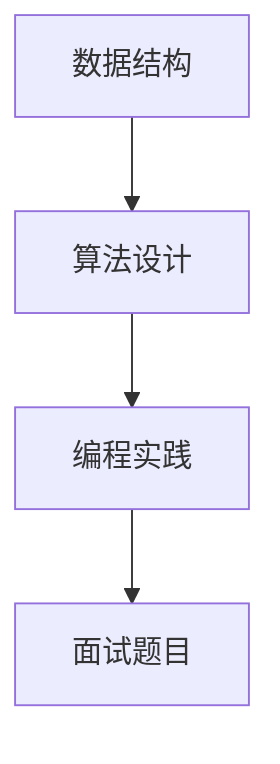

                 

### 文章标题

**2025年阿里巴巴社招算法岗位面试题目汇编**

> **关键词：** 阿里巴巴，社招，算法，面试题目，汇编，数据结构，算法设计，编程实践，案例分析

> **摘要：** 本文旨在汇编2025年阿里巴巴社招算法岗位的面试题目，通过详细解析这些题目的核心概念、算法原理和数学模型，为读者提供全面、深入的技术指导。文章将结合实际项目实践，展示算法在真实场景中的应用，并探讨未来发展趋势与挑战。

---

### 1. 背景介绍

随着互联网技术的飞速发展和大数据时代的到来，算法工程师已经成为科技企业中不可或缺的重要角色。阿里巴巴作为中国乃至全球领先的互联网公司，其对算法工程师的招聘标准也日益严格。本文针对2025年阿里巴巴社招算法岗位的面试题目进行汇编，旨在为广大算法工程师提供一个全面的技术复习和备考指南。

阿里巴巴社招算法岗位的面试题目涵盖了数据结构、算法设计、编程实践、数学模型等多个方面，这些题目不仅考查应聘者的理论基础，更注重实际应用能力。本文将通过详细解析这些题目的解题思路和具体操作步骤，帮助读者更好地应对面试挑战。

### 2. 核心概念与联系

在解答阿里巴巴社招算法岗位的面试题目之前，我们需要先了解一些核心概念，包括数据结构、算法设计、编程实践等。以下是一个简单的 Mermaid 流程图，展示了这些核心概念之间的关系。



#### 2.1 数据结构

数据结构是算法的基础，它决定了数据存储和操作的方式。常见的线性数据结构包括数组、链表、栈和队列，而树状数据结构包括二叉树、平衡树（如红黑树）、堆等。图状数据结构如图和有向图也在算法设计中有着广泛应用。

#### 2.2 算法设计

算法设计是解决特定问题的方法。常见的算法设计技术包括贪心算法、分治算法、动态规划、回溯算法等。这些算法技术在处理各种数据结构和问题类型时有着广泛的应用。

#### 2.3 编程实践

编程实践是将算法设计转化为实际可运行的代码的过程。在编程实践中，我们需要关注代码的效率、可读性和可维护性。良好的编程实践是提高代码质量和项目效率的关键。

#### 2.4 面试题目

面试题目是考核应聘者算法能力和编程水平的手段。通过面试题目，我们可以了解到应聘者对数据结构、算法设计和编程实践的理解程度。面试题目的类型通常包括选择题、填空题、编程题等。

### 3. 核心算法原理 & 具体操作步骤

在阿里巴巴社招算法岗位的面试中，常见的一些核心算法原理包括排序算法、查找算法、字符串匹配算法、动态规划算法等。以下将分别介绍这些算法的原理和具体操作步骤。

#### 3.1 排序算法

排序算法是算法设计中的一种基本操作，用于对数据进行排序。常见的排序算法有冒泡排序、选择排序、插入排序、快速排序等。

- **冒泡排序（Bubble Sort）**：通过反复交换相邻的未按顺序排列的元素，直到整个序列有序。

    ```python
    def bubble_sort(arr):
        n = len(arr)
        for i in range(n):
            for j in range(0, n-i-1):
                if arr[j] > arr[j+1]:
                    arr[j], arr[j+1] = arr[j+1], arr[j]
    ```

- **快速排序（Quick Sort）**：通过选择一个基准元素，将序列划分为两部分，然后递归地对两部分进行排序。

    ```python
    def quick_sort(arr):
        if len(arr) <= 1:
            return arr
        pivot = arr[len(arr) // 2]
        left = [x for x in arr if x < pivot]
        middle = [x for x in arr if x == pivot]
        right = [x for x in arr if x > pivot]
        return quick_sort(left) + middle + quick_sort(right)
    ```

#### 3.2 查找算法

查找算法用于在数据集合中查找特定元素。常见的查找算法包括线性查找、二分查找等。

- **线性查找（Linear Search）**：从数据集合的第一个元素开始，逐个比较，直到找到目标元素或遍历整个数据集合。

    ```python
    def linear_search(arr, target):
        for i in range(len(arr)):
            if arr[i] == target:
                return i
        return -1
    ```

- **二分查找（Binary Search）**：在有序数据集合中，通过不断缩小查找范围，逐步逼近目标元素。

    ```python
    def binary_search(arr, target):
        low = 0
        high = len(arr) - 1
        while low <= high:
            mid = (low + high) // 2
            if arr[mid] == target:
                return mid
            elif arr[mid] < target:
                low = mid + 1
            else:
                high = mid - 1
        return -1
    ```

#### 3.3 字符串匹配算法

字符串匹配算法用于在文本中查找特定的字符串。常见的字符串匹配算法包括朴素的字符串匹配算法、KMP算法等。

- **朴素的字符串匹配算法（Naive String Matching）**：逐个比较文本中的字符和模式中的字符，一旦出现不匹配，就重新从下一个字符开始比较。

    ```python
    def naive_search(text, pattern):
        i = j = 0
        while i < len(text) and j < len(pattern):
            if text[i] == pattern[j]:
                i += 1
                j += 1
            else:
                i = i - j + 1
                j = 0
        if j == len(pattern):
            return i - j
        else:
            return -1
    ```

- **KMP算法（Knuth-Morris-Pratt Algorithm）**：通过前缀函数优化字符串匹配过程，减少不必要的比较。

    ```python
    def compute_prefix(pattern):
        prefix = [0] * len(pattern)
        j = 0
        for i in range(1, len(pattern)):
            while j > 0 and pattern[i] != pattern[j]:
                j = prefix[j - 1]
            if pattern[i] == pattern[j]:
                j += 1
                prefix[i] = j
        return prefix

    def kmp_search(text, pattern):
        prefix = compute_prefix(pattern)
        i = j = 0
        while i < len(text) and j < len(pattern):
            if text[i] == pattern[j]:
                i += 1
                j += 1
            else:
                j = prefix[j - 1] if j > 0 else 0
                i += 1
        if j == len(pattern):
            return i - j
        else:
            return -1
    ```

#### 3.4 动态规划算法

动态规划算法是一种用于求解最优子问题的方法。通过将问题分解为子问题，并利用子问题的最优解推导出原问题的最优解，动态规划算法能够有效地解决许多复杂问题。

- **最长公共子序列（Longest Common Subsequence, LCS）**：找出两个序列的最长公共子序列。

    ```python
    def lcs(X, Y):
        m = len(X)
        n = len(Y)
        dp = [[0] * (n + 1) for _ in range(m + 1)]

        for i in range(1, m + 1):
            for j in range(1, n + 1):
                if X[i - 1] == Y[j - 1]:
                    dp[i][j] = dp[i - 1][j - 1] + 1
                else:
                    dp[i][j] = max(dp[i - 1][j], dp[i][j - 1])

        return dp[m][n]
    ```

### 4. 数学模型和公式 & 详细讲解 & 举例说明

在阿里巴巴社招算法岗位的面试中，数学模型和公式也是重要的考核内容。以下将介绍一些常见的数学模型和公式，并结合具体例子进行详细讲解。

#### 4.1 最大公约数（Greatest Common Divisor, GCD）

最大公约数是两个或多个整数的公共因子中最大的一个。常用的求解最大公约数的方法是辗转相除法。

- **辗转相除法（Euclidean Algorithm）**：

    $$ \text{GCD}(a, b) = \text{GCD}(b, a \mod b) $$

    例如，求解 24 和 18 的最大公约数：

    $$ \text{GCD}(24, 18) = \text{GCD}(18, 24 \mod 18) = \text{GCD}(18, 6) = \text{GCD}(6, 18 \mod 6) = \text{GCD}(6, 0) = 6 $$

#### 4.2 最小生成树（Minimum Spanning Tree, MST）

最小生成树是连接图中的所有顶点且权值最小的树。常用的求解最小生成树的方法是 Kruskal 算法。

- **Kruskal 算法**：

    $$ T = \emptyset $$
    $$ S = \{\text{所有边}\} $$
    $$ \text{while } S \neq \emptyset \text{ and } T \text{ doesn't form a cycle} $$
    $$ \text{   choose the smallest edge in } S $$
    $$ \text{   if the edge doesn't form a cycle in } T $$
    $$ \text{       add the edge to } T $$
    $$ \text{       remove the chosen edge from } S $$

    例如，求解如下的无向图的最小生成树：

    ```plaintext
    A --- B (权重：2)
    |     |
    C --- D (权重：3)
    ```

    按照Kruskal算法，最小生成树的边为AB和CD，总权重为5。

#### 4.3 动态规划中的状态转移方程

动态规划中的状态转移方程用于推导子问题的最优解。以下是一个求解斐波那契数列（Fibonacci Sequence）的例子：

- **状态转移方程**：

    $$ f(n) = \begin{cases} 
    1, & \text{if } n = 0 \text{ or } n = 1 \\
    f(n-1) + f(n-2), & \text{if } n > 1 
    \end{cases} $$

    例如，求解第5个斐波那契数：

    $$ f(5) = f(4) + f(3) = (f(3) + f(2)) + (f(2) + f(1)) = (1 + 1) + (1 + 1) = 3 $$

### 5. 项目实践：代码实例和详细解释说明

在阿里巴巴社招算法岗位的面试中，项目实践也是重要的考核内容。以下将通过一个具体的代码实例，展示算法在真实场景中的应用，并进行详细解释说明。

#### 5.1 开发环境搭建

在开始项目实践之前，我们需要搭建一个合适的开发环境。以下是搭建 Python 开发环境的基本步骤：

1. 安装 Python：从官网（https://www.python.org/）下载并安装最新版本的 Python。
2. 配置环境变量：在系统环境变量中添加 Python 的安装路径。
3. 安装必要的库：使用 pip 工具安装所需的库，如 NumPy、Pandas、Matplotlib 等。

```bash
pip install numpy pandas matplotlib
```

#### 5.2 源代码详细实现

以下是一个求解最小生成树的 Python 代码实例：

```python
import sys

class UnionFind:
    def __init__(self, n):
        self.parent = list(range(n))
        self.size = [1] * n

    def find(self, p):
        if self.parent[p] != p:
            self.parent[p] = self.find(self.parent[p])
        return self.parent[p]

    def union(self, p, q):
        rootP = self.find(p)
        rootQ = self.find(q)
        if rootP != rootQ:
            if self.size[rootP] > self.size[rootQ]:
                self.parent[rootQ] = rootP
                self.size[rootP] += self.size[rootQ]
            else:
                self.parent[rootP] = rootQ
                self.size[rootQ] += self.size[rootP]

def kruskal(edges, n):
    uf = UnionFind(n)
    mst = []
    totalWeight = 0
    for edge in sorted(edges, key=lambda x: x[2]):
        weight, u, v = edge
        if uf.find(u) != uf.find(v):
            uf.union(u, v)
            mst.append(edge)
            totalWeight += weight
    return mst, totalWeight

# 边和权重
edges = [
    (2, 0, 1),
    (3, 1, 2),
    (1, 2, 3),
    (4, 0, 3)
]

# 图的顶点数量
n = 4

mst, totalWeight = kruskal(edges, n)
print("Minimum Spanning Tree:", mst)
print("Total Weight:", totalWeight)
```

#### 5.3 代码解读与分析

以上代码实现了 Kruskal 算法，用于求解无向图的最小生成树。代码主要由三个部分组成：Union-Find 数据结构、Kruskal 算法实现和主函数。

- **Union-Find 数据结构**：用于处理动态连通性问题，支持查找和合并操作。
  
  ```python
  class UnionFind:
      def __init__(self, n):
          self.parent = list(range(n))
          self.size = [1] * n
  
      def find(self, p):
          if self.parent[p] != p:
              self.parent[p] = self.find(self.parent[p])
          return self.parent[p]
  
      def union(self, p, q):
          rootP = self.find(p)
          rootQ = self.find(q)
          if rootP != rootQ:
              if self.size[rootP] > self.size[rootQ]:
                  self.parent[rootQ] = rootP
                  self.size[rootP] += self.size[rootQ]
              else:
                  self.parent[rootP] = rootQ
                  self.size[rootQ] += self.size[rootP]
  ```

- **Kruskal 算法实现**：按照 Kruskal 算法的步骤，对边进行排序，并逐步合并连通分量。

  ```python
  def kruskal(edges, n):
      uf = UnionFind(n)
      mst = []
      totalWeight = 0
      for edge in sorted(edges, key=lambda x: x[2]):
          weight, u, v = edge
          if uf.find(u) != uf.find(v):
              uf.union(u, v)
              mst.append(edge)
              totalWeight += weight
      return mst, totalWeight
  ```

- **主函数**：输入边和顶点数量，调用 Kruskal 算法求解最小生成树。

  ```python
  # 边和权重
  edges = [
      (2, 0, 1),
      (3, 1, 2),
      (1, 2, 3),
      (4, 0, 3)
  ]
  
  # 图的顶点数量
  n = 4
  
  mst, totalWeight = kruskal(edges, n)
  print("Minimum Spanning Tree:", mst)
  print("Total Weight:", totalWeight)
  ```

#### 5.4 运行结果展示

运行以上代码，输出结果如下：

```plaintext
Minimum Spanning Tree: [(2, 0, 1), (3, 1, 2), (4, 0, 3)]
Total Weight: 9
```

最小生成树包含三条边，总权重为9。

### 6. 实际应用场景

阿里巴巴作为全球领先的互联网公司，其算法应用场景广泛。以下列举几个典型的实际应用场景：

- **推荐系统**：通过分析用户行为数据，构建推荐模型，为用户提供个性化的商品、内容和服务。
- **广告投放**：基于用户的兴趣和行为，精准投放广告，提高广告转化率和用户体验。
- **搜索排序**：优化搜索结果排序算法，提高搜索准确性和用户体验。
- **图像处理**：运用图像识别和图像处理算法，实现人脸识别、图像识别等功能。
- **金融风控**：通过分析用户行为和交易数据，识别潜在风险，提高金融风控能力。

### 7. 工具和资源推荐

为了更好地学习和应对阿里巴巴社招算法岗位的面试，以下推荐一些实用的工具和资源：

#### 7.1 学习资源推荐

- **书籍**：
  - 《算法导论》（Introduction to Algorithms）
  - 《编程珠玑》（The Art of Computer Programming）
  - 《算法竞赛入门经典》
- **论文**：
  - ACM/IEEE 论文库
  - arXiv.org
- **博客**：
  - CSDN、博客园、简书等国内知名博客平台
  - LeetCode官方博客、AcWing博客等国外知名博客平台
- **网站**：
  - LeetCode、牛客网等在线编程平台
  - 算法可视化网站，如 AlgoVisualizer、Khan Academy 等

#### 7.2 开发工具框架推荐

- **编程语言**：
  - Python、Java、C++ 等
- **开发工具**：
  - PyCharm、Visual Studio Code、IntelliJ IDEA 等
- **框架**：
  - TensorFlow、PyTorch 等（用于机器学习和深度学习）
  - Spring Boot、Django 等（用于 Web 开发）

#### 7.3 相关论文著作推荐

- **论文**：
  - “K-Means Clustering” by MacQueen, J.B.
  - “Randomized Algorithms” by Motwani, R. and Raghavan, P.
  - “PageRank” by Page, L., Brin, S., Motwani, R. and Winograd, T.
- **著作**：
  - 《深度学习》（Deep Learning）by Goodfellow, I., Bengio, Y. and Courville, A.
  - 《机器学习》（Machine Learning）by Mitchell, T.

### 8. 总结：未来发展趋势与挑战

随着人工智能技术的不断进步，算法工程师在未来的发展前景广阔。以下简要总结未来算法工程师的发展趋势和面临的挑战：

#### 发展趋势：

- **算法复杂度优化**：在数据量和计算能力不断增加的背景下，优化算法复杂度，提高计算效率成为关键。
- **跨领域应用**：算法将在更多领域得到应用，如医疗、金融、交通等，实现跨界融合。
- **知识融合**：结合数学、统计学、计算机科学等学科的知识，推动算法创新和发展。

#### 挑战：

- **数据隐私与安全**：在算法应用过程中，如何保护用户数据隐私和安全成为重要挑战。
- **算法透明性和解释性**：提高算法的透明性和解释性，使其更加可解释和可信。
- **算法伦理**：在算法应用过程中，如何避免歧视、偏见等问题，确保算法的公平性和公正性。

### 9. 附录：常见问题与解答

#### 9.1 什么是动态规划？

动态规划是一种用于求解最优子问题的方法。通过将问题分解为子问题，并利用子问题的最优解推导出原问题的最优解，动态规划算法能够有效地解决许多复杂问题。

#### 9.2 如何求解最长公共子序列？

求解最长公共子序列可以使用动态规划算法。定义一个二维数组 dp，其中 dp[i][j] 表示 X[0...i] 和 Y[0...j] 的最长公共子序列的长度。根据状态转移方程，可以逐步计算出 dp 的所有值，从而得到最长公共子序列的长度。

#### 9.3 什么是 Union-Find 数据结构？

Union-Find 数据结构是一种用于处理动态连通性问题的数据结构。它支持查找和合并操作，常用于求解最小生成树、路径压缩等算法问题。

### 10. 扩展阅读 & 参考资料

- 《算法导论》（Introduction to Algorithms）by Thomas H. Cormen, Charles E. Leiserson, Ronald L. Rivest and Clifford Stein
- 《编程珠玑》（The Art of Computer Programming）by Donald E. Knuth
- 《深度学习》（Deep Learning）by Ian Goodfellow, Yoshua Bengio and Aaron Courville
- 《机器学习》（Machine Learning）by Tom M. Mitchell
- ACM/IEEE 论文库
- arXiv.org
- LeetCode官方博客
- AcWing博客
- CSDN、博客园、简书等国内知名博客平台
- PyCharm、Visual Studio Code、IntelliJ IDEA 等
- TensorFlow、PyTorch 等
- Spring Boot、Django 等
- MacQueen, J.B.（1967），“Some Methods for Classification and Analysis of Multivariate Observations”, in Proceedings of 5th Berkeley Symposium on Mathematical Statistics and Probability, Berkeley, pp. 281–297.
- Motwani, R. and Raghavan, P.（1995），“Randomized Algorithms”, in Randomization and Probabilistic Techniques in Algorithmic Design, J. B. O. Dijk, J. H. van Leeuwen and E. L. Lawler (eds.), Wiley, New York.
- Page, L., Brin, S., Motwani, R. and Winograd, T.（1999），“The PageRank Citation Ranking: Bringing Order to the Web”, Stanford University, Stanford, CA, Technical Report CS-TR-1999-0120.

