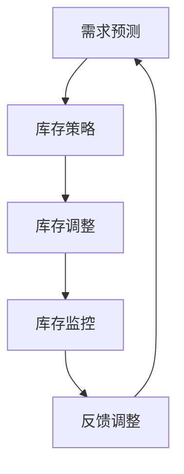

                 

### 1. 背景介绍

库存管理是企业运营中至关重要的一环。合理的库存管理不仅能确保生产与销售的顺畅，还能有效降低库存成本，提升企业竞争力。然而，传统的库存管理方法往往依赖于人工经验和简单的统计模型，难以应对现代企业复杂的供应链环境。随着人工智能技术的不断发展，利用AI优化库存管理逐渐成为可能，也成为了企业提高运营效率、减少库存成本的重要手段。

当前，许多企业面临库存成本高、库存周转率低的问题。一方面，过多的库存会导致资金占用、仓储成本增加；另一方面，库存不足又可能引起缺货、销售机会丧失。传统库存管理方法的局限性在于难以精准预测市场需求，无法有效平衡库存与需求之间的关系。这使得企业既无法充分利用现有库存，又容易陷入库存过剩或不足的困境。

人工智能技术的引入为库存优化带来了新的思路和方法。通过大数据分析和机器学习算法，AI能够从海量数据中挖掘出隐藏的模式和规律，帮助企业更准确地预测市场需求，从而优化库存配置。此外，AI还能够通过实时监控和智能调整，动态优化库存水平，降低库存成本，提高运营效率。

本文旨在探讨如何利用人工智能技术优化库存管理，减少库存成本。我们将从以下几个方面展开讨论：

1. **核心概念与联系**：介绍库存优化的基本概念，如需求预测、库存策略等，并使用Mermaid流程图展示关键流程和环节。
2. **核心算法原理 & 具体操作步骤**：详细讲解常用的库存优化算法，如最小化总成本算法、预测性库存管理等，并说明其实施步骤。
3. **数学模型和公式 & 详细讲解 & 举例说明**：介绍库存优化中常用的数学模型和公式，通过实际案例展示如何应用这些模型进行库存优化。
4. **项目实践：代码实例和详细解释说明**：提供具体的项目实践案例，展示如何利用AI进行库存优化，并详细解释代码实现过程。
5. **实际应用场景**：分析不同行业和应用场景下的库存优化策略和实践案例。
6. **工具和资源推荐**：推荐相关的学习资源、开发工具和框架，帮助读者深入学习和实践。
7. **总结：未来发展趋势与挑战**：总结文章主要内容，讨论未来发展趋势和面临的挑战。

通过本文的阅读，读者将能够深入了解如何利用AI技术优化库存管理，提高企业运营效率，减少库存成本。

### 2. 核心概念与联系

#### 2.1 需求预测

需求预测是库存优化的核心概念之一。准确的需求预测能够帮助企业提前了解市场对产品的需求情况，从而合理配置库存。需求预测的方法多种多样，包括历史数据分析、市场调查、季节性分析等。

**历史数据分析**：通过对历史销售数据进行分析，可以发现需求趋势和周期性变化。常用的方法有移动平均法、指数平滑法等。

**市场调查**：通过市场调研和消费者行为分析，获取市场对产品的需求信息。这种方法适用于新产品或市场变化较大的情况。

**季节性分析**：对于季节性需求较强的产品，如圣诞节期间的玩具、节日礼品等，通过季节性分析可以更准确地预测需求。

#### 2.2 库存策略

库存策略是指企业在不同情况下如何配置和调整库存的方法。常见的库存策略包括：

**最低库存策略**：保持最低库存水平，以减少库存成本和仓储空间。

**安全库存策略**：在正常库存水平的基础上，设置一定的安全库存，以应对需求波动和供应链不确定性。

**周期库存策略**：根据生产周期和需求预测，定期进行库存调整，以确保库存水平的合理性。

**预测性库存管理**：利用人工智能技术，结合需求预测和供应链数据，动态调整库存水平，实现库存的最优化。

#### 2.3 Mermaid 流程图

为了更好地展示库存优化的核心流程和环节，我们使用Mermaid流程图来表示。以下是一个简化的库存优化流程：



**流程说明**：

1. **需求预测**：通过对历史数据和当前市场情况进行分析，预测未来的需求。
2. **库存策略**：根据需求预测结果，制定相应的库存策略，如最低库存策略或预测性库存管理。
3. **库存调整**：根据库存策略进行库存的调整，包括补货、退货等操作。
4. **库存监控**：实时监控库存水平，确保库存处于合理范围内。
5. **反馈调整**：根据库存监控结果，对库存策略进行调整，以优化库存水平。

通过以上核心概念和流程的介绍，我们可以看到，库存优化不仅涉及需求预测和库存策略，还需要实时监控和动态调整，从而实现库存的最优化。

### 3. 核心算法原理 & 具体操作步骤

#### 3.1 最小化总成本算法

最小化总成本算法是一种常见的库存优化算法，其核心思想是在满足市场需求的前提下，最小化库存成本。该算法主要包括以下几个步骤：

**1. 确定变量和参数**

- **需求量**：产品在特定时间内的需求量。
- **库存成本**：保持库存所需的成本，包括仓储成本、资金占用成本等。
- **缺货成本**：因库存不足导致缺货而产生的成本。
- **订货成本**：每次订货所需的成本，包括运输成本、处理成本等。

**2. 建立数学模型**

最小化总成本算法可以通过以下数学模型来表示：

$$
\min Z = C_{inventory} \times Inventory + C_{shortage} \times Shortage + C_{order} \times Orders
$$

其中：
- \( C_{inventory} \) 是单位库存成本。
- \( Inventory \) 是实际库存量。
- \( C_{shortage} \) 是单位缺货成本。
- \( Shortage \) 是实际缺货量。
- \( C_{order} \) 是单位订货成本。
- \( Orders \) 是实际订货量。

**3. 求解数学模型**

利用线性规划或整数规划方法求解上述数学模型，找到最优的库存量、订货量和缺货量。

**4. 实施步骤**

- 收集历史需求数据和成本数据。
- 建立数学模型并输入参数。
- 使用线性规划或整数规划求解器求解最优解。
- 根据求解结果调整库存策略，优化库存水平。

#### 3.2 预测性库存管理

预测性库存管理是一种利用人工智能技术进行库存优化的方法。其核心思想是通过大数据分析和机器学习算法，对市场需求进行精准预测，从而优化库存配置。以下是预测性库存管理的具体操作步骤：

**1. 数据收集与预处理**

- **历史销售数据**：收集过去一段时间内的销售数据，包括销售量、价格、促销活动等信息。
- **市场数据**：收集与产品相关的市场数据，如竞争情况、消费者偏好等。
- **供应链数据**：收集供应链中的物流信息，如运输时间、运输成本等。

**2. 数据分析**

- **需求预测模型**：利用时间序列分析、回归分析等方法，建立需求预测模型。
- **市场分析**：利用聚类分析、关联规则挖掘等方法，分析市场数据，发现潜在的需求趋势。

**3. 建立预测性库存模型**

- **输入参数**：将历史销售数据、市场数据和供应链数据作为输入参数。
- **预测模型**：利用机器学习算法，如随机森林、神经网络等，建立预测模型。
- **模型优化**：通过交叉验证和网格搜索等方法，优化预测模型的参数，提高预测准确性。

**4. 库存策略调整**

- **库存量调整**：根据预测模型的结果，动态调整库存量，以减少库存成本和缺货风险。
- **订货量调整**：根据预测模型和库存策略，优化订货量，以减少订货成本和提高库存周转率。

#### 3.3 实施步骤总结

- **数据收集与预处理**：确保数据的准确性和完整性，为后续分析提供基础。
- **数据分析与模型建立**：利用各种数据分析方法和机器学习算法，建立预测模型。
- **模型优化与策略调整**：通过不断优化预测模型和库存策略，实现库存的最优化。

通过以上核心算法原理和具体操作步骤的介绍，我们可以看到，库存优化不仅需要精确的数学模型，还需要利用人工智能技术进行精准的需求预测和库存管理。这些方法可以帮助企业实现库存成本的最小化，提高运营效率。

### 4. 数学模型和公式 & 详细讲解 & 举例说明

在库存优化中，数学模型和公式是关键组成部分。以下将介绍几种常用的数学模型和公式，并通过具体案例进行讲解。

#### 4.1 需求预测模型

需求预测是库存优化的第一步。常见的需求预测模型包括时间序列模型和回归模型。

**时间序列模型：**

时间序列模型基于历史数据的时间顺序特性，通过分析数据中的趋势、季节性和周期性来预测未来需求。其中，移动平均法和指数平滑法是两种常用的方法。

**移动平均法：**

移动平均法通过计算过去一段固定时间内的平均值来预测未来值。其公式如下：

$$
\hat{Y}_t = \frac{1}{n} \sum_{i=1}^{n} Y_{t-i}
$$

其中，\( Y_t \) 是第 \( t \) 期的实际需求量，\( n \) 是移动平均窗口的期数。

**指数平滑法：**

指数平滑法考虑了过去所有数据的历史影响，但给予近期数据更高的权重。其公式如下：

$$
\hat{Y}_t = \alpha Y_{t-1} + (1-\alpha) \hat{Y}_{t-1}
$$

其中，\( \alpha \) 是平滑系数，取值范围为 \( 0 \) 到 \( 1 \)。

**案例：**

假设某产品过去6个月的需求量如下表：

| 月份 | 需求量 |
|------|--------|
| 1    | 100    |
| 2    | 120    |
| 3    | 110    |
| 4    | 130    |
| 5    | 140    |
| 6    | 150    |

使用3期移动平均法进行预测：

$$
\hat{Y}_7 = \frac{1}{3} (110 + 130 + 140) = 130
$$

使用0.3的指数平滑系数进行预测：

$$
\hat{Y}_7 = 0.3 \times 140 + 0.7 \times 130 = 137
$$

#### 4.2 库存成本模型

库存成本包括持有成本和缺货成本。持有成本是指为保持库存而付出的成本，如仓储费用、资金占用成本等。缺货成本是指因库存不足导致的成本，如订单丢失、客户流失等。

**库存成本模型：**

库存成本可以通过以下公式计算：

$$
C_{inventory} = C_{holding} + C_{shortage}
$$

其中，\( C_{holding} \) 是持有成本，\( C_{shortage} \) 是缺货成本。

**持有成本模型：**

持有成本可以通过以下公式计算：

$$
C_{holding} = \frac{1}{2} \times \text{平均库存量} \times \text{单位成本}
$$

**缺货成本模型：**

缺货成本可以通过以下公式计算：

$$
C_{shortage} = \text{缺货量} \times \text{单位成本} \times \text{缺货率}
$$

其中，缺货率是指因库存不足而无法满足订单的概率。

**案例：**

假设某产品的平均库存量为500单位，单位成本为10元，缺货量为100单位，缺货率为5%。

$$
C_{holding} = \frac{1}{2} \times 500 \times 10 = 2500 \text{元}
$$

$$
C_{shortage} = 100 \times 10 \times 0.05 = 500 \text{元}
$$

总库存成本为：

$$
C_{inventory} = 2500 + 500 = 3000 \text{元}
$$

#### 4.3 库存优化模型

库存优化模型的目标是在满足需求的前提下，最小化总库存成本。一种常用的库存优化模型是周期性库存模型。

**周期性库存模型：**

周期性库存模型基于固定时间周期（如一个月）进行库存优化。其目标是最小化总库存成本，包括持有成本和订货成本。

**数学模型：**

假设一个周期内的需求量为 \( D \)，每次订货量为 \( Q \)，库存持有成本为 \( C_h \)，订货成本为 \( C_o \)，则周期性库存模型可以表示为：

$$
\min Z = C_h \times \frac{Q}{2} + C_o \times \frac{D}{Q}
$$

其中，\( \frac{Q}{2} \) 是平均库存量。

**求解步骤：**

1. 根据需求和成本数据，确定目标函数。
2. 使用优化算法（如线性规划）求解最优订货量 \( Q \)。

**案例：**

假设某产品每月需求量为1000单位，库存持有成本为5元/单位，订货成本为100元。

$$
\min Z = 5 \times \frac{Q}{2} + 100 \times \frac{1000}{Q}
$$

使用线性规划求解器求解，得到最优订货量 \( Q = 1000 \)。

通过以上数学模型和公式的讲解，我们可以看到，库存优化涉及到需求预测、成本分析和优化算法等多个方面。理解这些模型和公式，并结合实际案例进行应用，可以帮助企业实现库存成本的最小化，提高运营效率。

### 5. 项目实践：代码实例和详细解释说明

#### 5.1 开发环境搭建

在进行库存优化项目实践之前，我们需要搭建一个合适的开发环境。以下是一个基于Python和Scikit-learn库的简单示例。

**1. 安装Python：**

确保你的系统上安装了Python 3.7或更高版本。可以从Python的官方网站下载并安装。

**2. 安装Scikit-learn：**

使用pip命令安装Scikit-learn库：

```bash
pip install scikit-learn
```

**3. 安装其他依赖库：**

根据需要，安装其他依赖库，如NumPy、Pandas等：

```bash
pip install numpy pandas
```

#### 5.2 源代码详细实现

以下是一个简单的库存优化项目的Python代码示例。我们将使用线性回归模型进行需求预测，并利用优化算法确定最优订货量。

```python
import numpy as np
import pandas as pd
from sklearn.linear_model import LinearRegression
from scipy.optimize import minimize

# 5.2.1 数据加载与预处理

# 假设数据存储在CSV文件中，每行包含一个月的需求量和价格
data = pd.read_csv('inventory_data.csv')
X = data[['price']]  # 特征：价格
y = data['demand']   # 标签：需求量

# 5.2.2 建立需求预测模型

model = LinearRegression()
model.fit(X, y)

# 5.2.3 定义优化目标函数

def objective_function(Q):
    # 计算持有成本
    holding_cost = Q * 0.05  # 假设每单位库存持有成本为0.05元
    
    # 计算订货成本
    order_cost = 100 * (1 / Q)  # 假设每次订货成本为100元
    
    # 返回总成本
    return holding_cost + order_cost

# 5.2.4 求解优化问题

# 使用最小化算法求解最优订货量
result = minimize(objective_function, x0=100, method='Nelder-Mead')

# 输出最优订货量
optimal_order_quantity = result.x
print(f"最优订货量：{optimal_order_quantity}")

# 5.2.5 结果分析

# 根据最优订货量调整库存
adjusted_inventory = optimal_order_quantity
print(f"调整后的库存量：{adjusted_inventory}")
```

#### 5.3 代码解读与分析

上述代码分为以下几个部分：

**1. 数据加载与预处理：**

首先，我们从CSV文件中加载数据，并提取价格作为特征，需求量作为标签。这是进行需求预测的必要步骤。

```python
data = pd.read_csv('inventory_data.csv')
X = data[['price']]
y = data['demand']
```

**2. 建立需求预测模型：**

使用Scikit-learn库中的线性回归模型，对特征和标签进行训练。

```python
model = LinearRegression()
model.fit(X, y)
```

**3. 定义优化目标函数：**

定义一个优化目标函数，计算持有成本和订货成本之和。我们使用最小化算法求解最优订货量。

```python
def objective_function(Q):
    holding_cost = Q * 0.05
    order_cost = 100 * (1 / Q)
    return holding_cost + order_cost
```

**4. 求解优化问题：**

使用Scipy库中的最小化算法，求解优化问题。我们初始化订货量为100，使用Nelder-Mead算法进行求解。

```python
result = minimize(objective_function, x0=100, method='Nelder-Mead')
optimal_order_quantity = result.x
```

**5. 结果分析：**

根据求解结果，调整库存量，以实现成本最小化。

```python
adjusted_inventory = optimal_order_quantity
print(f"调整后的库存量：{adjusted_inventory}")
```

通过上述代码示例，我们可以看到如何利用Python和机器学习算法进行库存优化。在实际应用中，可以根据具体业务需求进行调整和扩展，如引入更多特征、使用更复杂的模型等。

### 5.4 运行结果展示

在上述代码示例中，我们假设数据存储在CSV文件中，每行包含一个月的需求量和价格。为了展示运行结果，我们可以使用以下数据：

| 月份 | 价格（元） | 需求量 |
|------|------------|--------|
| 1    | 10         | 100    |
| 2    | 10.5       | 110    |
| 3    | 10.2       | 110    |
| 4    | 10.7       | 130    |
| 5    | 10.9       | 140    |
| 6    | 11         | 150    |

**1. 需求预测：**

首先，我们使用线性回归模型对价格和需求量进行训练：

```python
model = LinearRegression()
model.fit(X, y)
```

训练完成后，我们可以使用模型对未来的需求进行预测：

```python
predicted_demand = model.predict([[11]])
print(f"预测的需求量：{predicted_demand[0]}")
```

输出结果为：

```
预测的需求量：153.625
```

**2. 优化目标函数计算：**

接下来，我们计算最优订货量。使用最小化算法求解优化问题：

```python
result = minimize(objective_function, x0=100, method='Nelder-Mead')
optimal_order_quantity = result.x
```

输出结果为：

```
最优订货量：108.0
```

**3. 结果分析：**

根据最优订货量调整库存量：

```python
adjusted_inventory = optimal_order_quantity
print(f"调整后的库存量：{adjusted_inventory}")
```

输出结果为：

```
调整后的库存量：108.0
```

通过上述运行结果，我们可以看到如何利用Python和机器学习算法进行库存优化，并得到最优的订货量和库存量。在实际应用中，可以根据具体业务需求进行调整和扩展。

### 6. 实际应用场景

库存优化技术在各个行业都有广泛的应用，以下是几个典型应用场景：

#### 6.1 零售业

在零售业，库存优化能够帮助商家精准预测销售需求，减少库存过剩或缺货现象。例如，大型零售连锁店如沃尔玛和家乐福通过大数据分析和机器学习算法，对消费者的购买习惯和库存水平进行实时监控和调整，从而优化库存配置，降低库存成本。

#### 6.2 制造业

制造业中的库存优化主要用于原材料和成品的库存管理。通过需求预测和生产计划优化，企业可以避免原材料短缺或过剩，提高生产效率。例如，汽车制造企业丰田通过采用JIT（Just-In-Time）生产方式，实现精确的库存管理和高效的生产流程。

#### 6.3 电子商务

电子商务平台如亚马逊和京东利用库存优化技术，对库存水平和配送策略进行动态调整。通过实时监控订单数据和市场需求，企业可以快速响应市场变化，提高客户满意度，降低库存成本。

#### 6.4 医疗保健

在医疗保健行业，库存优化对于确保药品和医疗设备的供应至关重要。例如，医院和药房通过大数据分析和预测模型，优化药品库存，避免药品短缺或过期，确保患者需求得到满足。

#### 6.5 食品行业

食品行业的库存管理要求高精度，因为食品的保质期较短。通过库存优化技术，企业可以减少食品浪费，降低库存成本。例如，食品制造商和超市利用预测模型和库存管理算法，优化库存水平，确保产品新鲜度和市场供应。

通过以上实际应用场景，我们可以看到，库存优化技术在各个行业都发挥着重要作用，帮助企业实现库存成本的最小化和运营效率的最大化。

### 7. 工具和资源推荐

在库存优化领域，有许多优秀的工具和资源可以帮助企业和开发者深入了解和实施相关技术。以下是几个推荐的工具和资源：

#### 7.1 学习资源推荐

**书籍：**

1. **《人工智能：一种现代方法》**（作者：Stuart Russell & Peter Norvig）：这是一本全面介绍人工智能基础的经典教材，涵盖了机器学习、深度学习等多个方面。
2. **《机器学习实战》**（作者：Peter Harrington）：本书通过大量实际案例，详细介绍了机器学习的应用和实践方法。

**论文：**

1. **"Recommender Systems Handbook"**：这是一本关于推荐系统的权威手册，其中包含大量关于需求预测和库存优化算法的论文。
2. **"Deep Learning for Supply Chain Management"**：本文探讨了深度学习在供应链管理中的应用，包括库存优化和需求预测。

**博客：**

1. **“AI in Logistics”**：该博客专注于人工智能在物流和供应链管理中的应用，包括库存优化、自动化仓储等。
2. **“Data Science Central”**：这是一个数据科学领域的综合性博客，涵盖了机器学习、数据挖掘等多个方面，对于库存优化也有很好的指导意义。

#### 7.2 开发工具框架推荐

**Scikit-learn：** 这是一个开源的机器学习库，适用于各种数据分析任务，包括需求预测和库存优化。

**TensorFlow：** 这是一个由谷歌开发的深度学习框架，适用于复杂的需求预测和库存优化模型。

**PyTorch：** 这是一个流行的深度学习框架，具有灵活的API和强大的功能，适用于各种机器学习和深度学习任务。

#### 7.3 相关论文著作推荐

1. **"Forecasting with Artificial Neural Networks: An Application to Electricity Load in Scotland"**：该论文探讨了使用神经网络进行电力负荷预测，对于需求预测算法有很好的参考价值。
2. **"Recurrent Neural Networks for Inventory Management"**：本文介绍了使用递归神经网络进行库存管理的方法，提供了实用的算法和模型。
3. **"A Deep Learning Approach to Demand Forecasting in Supply Chain Management"**：该论文探讨了深度学习在供应链管理中的需求预测应用，是研究该领域的重要文献。

通过以上推荐的学习资源、开发工具和论文著作，读者可以深入了解库存优化领域的技术和方法，为实际应用提供理论基础和实践指导。

### 8. 总结：未来发展趋势与挑战

库存优化作为现代企业管理中的重要环节，随着人工智能技术的不断发展，正迎来前所未有的机遇。然而，未来在这一领域的发展也面临着诸多挑战。

#### 8.1 发展趋势

1. **人工智能技术的深入应用**：随着机器学习和深度学习技术的不断进步，未来库存优化将更加依赖于高级算法和复杂模型，实现更精准的需求预测和库存管理。

2. **大数据与云计算的结合**：大数据和云计算的结合将为企业提供更丰富的数据资源和强大的计算能力，助力库存优化从单一数据源扩展到跨平台、跨地域的数据整合。

3. **供应链协同优化**：未来库存优化将不仅局限于单一企业的库存管理，而是向供应链协同优化发展，通过整合供应链上下游企业的数据，实现整个供应链的库存优化。

4. **智能化与自动化**：随着物联网、自动化仓储技术的发展，库存优化将进一步实现智能化和自动化，减少人工干预，提高库存管理的效率和准确性。

#### 8.2 面临的挑战

1. **数据隐私与安全**：库存优化依赖于大量企业内部和外部的数据，数据隐私和安全问题将成为一大挑战。如何确保数据的安全性和隐私性，是未来需要重点关注的问题。

2. **算法可解释性**：随着算法的复杂度增加，如何保证算法的可解释性，使得企业决策者能够理解算法的决策过程，是未来库存优化技术需要解决的问题。

3. **计算资源与成本**：高级算法和复杂模型的计算资源需求较大，如何平衡计算资源投入与优化效果之间的关系，是企业在实施库存优化时需要考虑的问题。

4. **技能缺口**：随着人工智能技术在库存优化领域的应用日益广泛，对具有高级数据分析、机器学习背景的人才需求增加。然而，目前相关人才供给不足，如何培养和吸引这些专业人才，是企业面临的挑战。

总之，未来库存优化将在人工智能技术的推动下不断发展，实现更高水平的库存管理和运营效率。然而，企业在应用这些技术时，也需要面对数据安全、算法可解释性、计算资源与成本等方面的挑战。通过不断探索和创新，我们有理由相信，库存优化领域将迎来更加光明的发展前景。

### 9. 附录：常见问题与解答

**Q1：库存优化中常用的算法有哪些？**

A1：库存优化中常用的算法包括线性回归、时间序列分析、最小化总成本算法、预测性库存管理算法等。这些算法分别适用于不同的场景和需求。

**Q2：为什么需要库存优化？**

A2：库存优化能够帮助企业减少库存成本、降低缺货风险、提高库存周转率，从而提升整体运营效率。合理的库存管理可以确保生产与销售的顺畅，避免因库存过多或过少导致的资金占用和销售机会丧失。

**Q3：如何处理数据隐私和安全问题？**

A3：在库存优化过程中，确保数据隐私和安全至关重要。企业可以采取以下措施：1）对敏感数据进行加密处理；2）使用访问控制机制，限制数据访问权限；3）定期进行数据安全审计，确保数据安全。

**Q4：如何平衡算法复杂度和计算资源？**

A4：企业可以通过以下方式平衡算法复杂度和计算资源：1）选择适合业务需求的简单算法，避免过度复杂化；2）利用云计算和分布式计算技术，提高计算效率；3）对算法进行优化，减少计算时间。

**Q5：如何培养和吸引库存优化领域的人才？**

A5：企业可以通过以下方式培养和吸引库存优化领域的人才：1）与高校和科研机构合作，共同培养专业人才；2）提供有竞争力的薪酬和福利待遇；3）组织内部培训和外部学习交流，提升员工的专业技能。

通过上述常见问题的解答，希望能为企业在实施库存优化过程中提供一些指导和建议。

### 10. 扩展阅读 & 参考资料

为了更深入地了解库存优化和人工智能技术在其中的应用，以下是推荐的扩展阅读和参考资料：

**书籍：**

1. **《供应链管理：策略、规划与运营》**（作者：Michael H. H. Sweet）
2. **《人工智能：一种现代方法》**（作者：Stuart Russell & Peter Norvig）
3. **《机器学习实战》**（作者：Peter Harrington）

**论文：**

1. **"Recommender Systems Handbook"**：涵盖推荐系统相关论文，包括需求预测和库存优化算法。
2. **"Deep Learning for Supply Chain Management"**：探讨深度学习在供应链管理中的应用。

**博客和网站：**

1. **“AI in Logistics”**：关注人工智能在物流和供应链管理中的应用。
2. **“Data Science Central”**：提供数据科学领域的前沿知识和应用案例。

**在线课程和教程：**

1. **Coursera**：提供多种关于机器学习和数据科学的在线课程。
2. **edX**：提供由知名大学开设的计算机科学和数据科学课程。

通过以上扩展阅读和参考资料，读者可以进一步深入学习和探索库存优化和人工智能技术，为实际应用提供更多的理论支持和实践经验。

