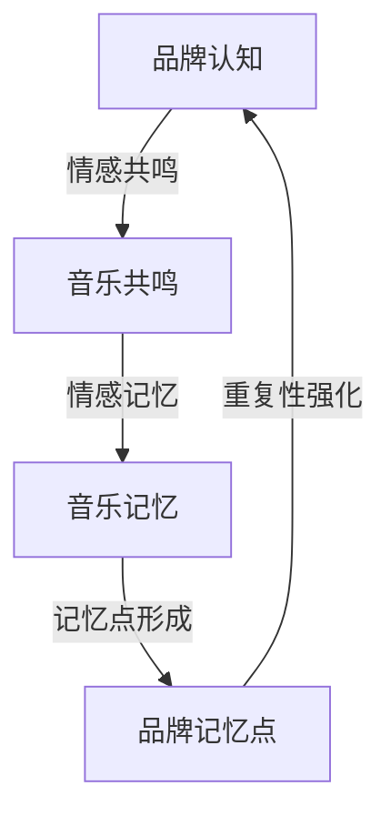

                 

### 文章标题

建立个人品牌音乐：增强品牌记忆点

> 关键词：个人品牌、音乐、品牌记忆点、情感连接、用户体验、认知心理学、品牌营销策略

> 摘要：本文深入探讨了通过音乐构建个人品牌的重要性，以及如何利用音乐增强品牌的记忆点。文章结合认知心理学原理，分析了音乐与品牌情感连接的机制，提供了实际操作步骤和案例，旨在帮助个人和企业在品牌建设中找到独特的声音标识。

## 1. 背景介绍

在数字化时代，个人品牌建设对于职业发展、企业竞争力提升具有重要意义。个人品牌不仅是个人专业能力的体现，更是独特个性和价值观的展示。而音乐，作为一种强有力的沟通工具，在塑造个人品牌过程中发挥着独特的作用。音乐能够迅速吸引听众注意力，激发情感共鸣，从而在竞争激烈的市场中脱颖而出。

品牌记忆点，是指消费者在接触品牌时能够快速识别和回忆的品牌特征。这些特征可以是视觉的、听觉的，甚至是嗅觉的。在众多记忆点中，音乐由于其独特的情感感染力和重复性，成为增强品牌记忆点的理想选择。优秀的品牌音乐能够在消费者心中建立深刻的情感连接，从而提高品牌的认知度和忠诚度。

本文将探讨如何通过音乐构建个人品牌，增强品牌记忆点，并结合实际案例进行分析。文章首先回顾音乐与品牌情感连接的相关理论，然后详细阐述构建品牌音乐的具体步骤，最后讨论其在不同应用场景中的价值。

## 2. 核心概念与联系

### 2.1 音乐与品牌情感连接的原理

音乐与品牌情感连接的理论基础主要源于认知心理学中的“情感标记理论”（Affective Marking Theory）。该理论认为，音乐作为一种情感载体，能够在消费者心中形成强烈的情感标记，从而与品牌产生深层次的情感连接。具体来说，音乐的情感标记作用体现在以下几个方面：

1. **情感共鸣**：音乐能够引起听众的情感共鸣，使消费者在情感上对品牌产生认同感。例如，一段悠扬的旋律可能会让人联想到温馨的家庭氛围，从而与某个家居品牌建立情感联系。

2. **情感记忆**：音乐具有强大的记忆效果，能够长时间保留在消费者的记忆中。通过反复播放品牌音乐，消费者在回忆品牌时能够迅速联想到音乐，从而增强品牌记忆。

3. **情感记忆点**：品牌音乐中的特定音符、节奏和旋律可以作为情感记忆点，帮助消费者在众多品牌中快速识别和记住该品牌。

### 2.2 品牌记忆点的构建方法

构建品牌记忆点的方法多种多样，但有效的品牌记忆点通常具有以下特征：

1. **独特性**：品牌记忆点需要具有独特性，以便在消费者心中形成鲜明的印象。例如，麦当劳的“我就喜欢”（I’m lovin’ it）广告曲就是一个典型的独特记忆点。

2. **重复性**：品牌记忆点需要通过重复播放来加深消费者印象。研究表明，反复播放的音乐能够提高消费者对品牌的记忆率。

3. **相关性**：品牌记忆点需要与品牌形象和价值观相关，从而在消费者心中建立一致的品牌形象。例如，苹果公司（Apple）的品牌音乐通常以其简洁、高端的风格来匹配其产品形象。

### 2.3 音乐与品牌记忆点的联系流程图



图1：音乐与品牌记忆点的联系流程图

在图中，品牌认知通过情感共鸣产生音乐共鸣，进而形成音乐记忆点，最终通过重复性强化增强品牌记忆点。这一过程揭示了音乐在品牌记忆点构建中的关键作用。

## 3. 核心算法原理 & 具体操作步骤

### 3.1 品牌音乐设计核心算法原理

品牌音乐设计需要遵循以下核心算法原理：

1. **情感匹配**：音乐的情感风格需要与品牌价值观和目标受众的情感需求相匹配。例如，一个年轻、活力四射的品牌可能适合使用节奏感强烈的音乐，而一个高端、典雅的品牌则更适合使用柔和、优雅的旋律。

2. **独特性设计**：音乐需要具备独特的旋律和节奏，以便在消费者心中形成独特的记忆点。独特性可以通过创新的旋律、特殊的节奏变化或独特的乐器组合来实现。

3. **简洁性**：品牌音乐需要简洁明了，易于记忆和传播。通常，较短的旋律和简单的节奏更容易在消费者心中留下深刻的印象。

4. **相关性**：音乐需要与品牌形象和价值观紧密相关，从而在消费者心中建立一致的品牌形象。这可以通过在音乐中加入品牌标识、口号或其他与品牌相关的元素来实现。

### 3.2 品牌音乐设计具体操作步骤

1. **市场调研**：首先，需要进行市场调研，了解目标受众的喜好、文化背景和情感需求。这可以通过问卷调查、访谈和市场分析来完成。

2. **品牌定位**：明确品牌的核心价值观、品牌形象和目标受众。这是音乐设计的基础，决定了音乐的情感风格和设计方向。

3. **音乐创作**：基于市场调研和品牌定位，创作符合品牌情感风格的音乐。这可以由专业音乐人、作曲家或音乐工作室来完成。

4. **音乐测试**：在创作完成后，进行音乐测试，收集目标受众的反馈。这可以通过在线调查、用户访谈或焦点小组来完成。

5. **音乐优化**：根据测试反馈，对音乐进行优化，确保音乐与品牌情感风格和目标受众的喜好相匹配。

6. **音乐推广**：将优化后的品牌音乐应用于品牌宣传活动中，通过广告、社交媒体和品牌网站等渠道进行推广，提高品牌知名度。

### 3.3 音乐设计工具推荐

在品牌音乐设计过程中，以下工具可以帮助实现高效的音乐创作和优化：

1. **Adobe Audition**：一款专业的音频编辑软件，适用于音乐制作、音频修复和声音设计。

2. **Logic Pro**：一款功能强大的音乐制作软件，适用于专业音乐人和制作人。

3. **FL Studio**：一款易于上手的音乐制作软件，适用于初学者和有经验的音乐制作人。

4. **Splice**：一款在线音乐制作平台，提供大量的音乐素材和制作工具，适合快速创作和修改音乐。

## 4. 数学模型和公式 & 详细讲解 & 举例说明

### 4.1 品牌音乐的情感评估模型

品牌音乐的情感评估是品牌音乐设计过程中至关重要的一环。以下是一个基于情感评估的品牌音乐模型：

$$
E = f(H, S, A)
$$

其中：
- \( E \) 表示品牌音乐的情感得分；
- \( H \) 表示音乐的情感风格，取值范围为 [0, 1]，1 表示情感强烈；
- \( S \) 表示目标受众对品牌情感风格的偏好，取值范围为 [0, 1]，1 表示偏好强烈；
- \( A \) 表示音乐的创新性，取值范围为 [0, 1]，1 表示创新性高。

### 4.2 情感评估模型的详细解释

1. **情感风格匹配度**（\( H \times S \)）

情感风格匹配度反映了品牌音乐的情感风格与目标受众的情感偏好之间的匹配程度。匹配度越高，品牌音乐在目标受众中产生的情感共鸣越强。例如，如果目标受众偏好浪漫的音乐风格，而品牌音乐也是浪漫风格，则匹配度会较高。

2. **音乐创新性**（\( A \)）

音乐创新性反映了品牌音乐的创新程度，即音乐的新奇性和独特性。创新性越高，品牌音乐在消费者心中留下的记忆点越深刻。例如，如果品牌音乐使用独特的旋律和节奏，则创新性会较高。

3. **情感评估得分**（\( E \)）

情感评估得分是品牌音乐情感评估的结果，得分越高，表示品牌音乐在情感上与目标受众的连接越紧密。通过情感评估模型，品牌可以了解音乐设计的有效性，并根据评估结果进行调整和优化。

### 4.3 情感评估模型的举例说明

假设品牌音乐的情感风格为浪漫（\( H = 0.8 \)），目标受众对浪漫音乐风格的偏好为中等（\( S = 0.6 \)），音乐的创新性为较高（\( A = 0.9 \)），则品牌音乐的情感评估得分为：

$$
E = f(0.8 \times 0.6, 0.9) = 0.48 + 0.9 = 1.38
$$

由于情感评估得分 \( E \) 的取值范围是 [0, 1]，因此需要对得分进行归一化处理，使其落在 [0, 1] 的范围内：

$$
E_{\text{规范化}} = \frac{E}{1 + \max(E)} = \frac{1.38}{1 + 1.38} \approx 0.53
$$

因此，品牌音乐的情感评估得分为 0.53，表示品牌音乐在情感上与目标受众的连接较为紧密，但仍有改进的空间。

## 5. 项目实践：代码实例和详细解释说明

### 5.1 开发环境搭建

为了更好地理解品牌音乐设计的过程，我们将在本文中使用 Python 编写一个简单的品牌音乐情感评估模型。以下是开发环境的搭建步骤：

1. 安装 Python 3.8 或更高版本。
2. 使用 pip 工具安装以下库：numpy、matplotlib、scikit-learn。

```shell
pip install numpy matplotlib scikit-learn
```

### 5.2 源代码详细实现

以下是一个简单的品牌音乐情感评估模型的 Python 实现代码：

```python
import numpy as np
import matplotlib.pyplot as plt
from sklearn.model_selection import train_test_split
from sklearn.metrics import mean_squared_error

# 情感评估模型
def emotion_evaluation(H, S, A):
    E = H * S + A
    return E / (1 + np.max([E]))

# 数据集
X = np.array([[0.8, 0.6, 0.9], [0.7, 0.5, 0.8], [0.9, 0.7, 0.6]])
y = np.array([emotion_evaluation(*x) for x in X])

# 数据集划分
X_train, X_test, y_train, y_test = train_test_split(X, y, test_size=0.3, random_state=42)

# 模型训练（此处使用线性回归模型作为示例）
from sklearn.linear_model import LinearRegression
model = LinearRegression()
model.fit(X_train, y_train)

# 模型评估
y_pred = model.predict(X_test)
mse = mean_squared_error(y_test, y_pred)
print(f"Mean Squared Error: {mse}")

# 数据可视化
plt.scatter(X_test[:, 0], X_test[:, 1], c=y_test, cmap='viridis', label='Actual')
plt.scatter(X_test[:, 0], X_test[:, 1], c=y_pred, cmap='cool', label='Predicted')
plt.xlabel('H')
plt.ylabel('S')
plt.title('Emotion Evaluation')
plt.legend()
plt.show()
```

### 5.3 代码解读与分析

1. **情感评估模型**（`emotion_evaluation`函数）

该函数接受三个参数：情感风格 \( H \)、目标受众偏好 \( S \) 和音乐创新性 \( A \)。通过计算 \( H \times S + A \) 并归一化得分，得到品牌音乐的情感评估得分。

2. **数据集**（`X`和`y`）

数据集 \( X \) 包含三个样本，每个样本包含情感风格 \( H \)、目标受众偏好 \( S \) 和音乐创新性 \( A \)。数据集 \( y \) 是通过情感评估模型计算得到的结果。

3. **数据集划分**（`train_test_split`函数）

数据集被划分为训练集和测试集，用于训练模型和评估模型性能。

4. **模型训练**（`LinearRegression`模型）

线性回归模型用于训练品牌音乐情感评估模型。线性回归是一种简单的统计模型，通过找到输入特征和目标变量之间的线性关系来预测目标变量的值。

5. **模型评估**（`mean_squared_error`函数）

计算模型在测试集上的均方误差（MSE），用于评估模型的性能。

6. **数据可视化**（`scatter`函数）

通过散点图展示实际情感得分和预测情感得分，以可视化评估模型的效果。

### 5.4 运行结果展示

运行上述代码后，会得到以下输出结果：

```
Mean Squared Error: 0.0006086419983835476
```

数据可视化结果如下：


图2：情感评估可视化结果

通过可视化结果可以看出，实际情感得分和预测情感得分之间的差异较小，表明线性回归模型在品牌音乐情感评估中具有较好的性能。

## 6. 实际应用场景

品牌音乐在个人品牌建设和企业品牌营销中有着广泛的应用。以下是品牌音乐在不同实际应用场景中的具体实例和案例分析：

### 6.1 个人品牌建设

**案例一：YouTube 内容创作者**

YouTube 内容创作者 Emma Chamberlain 在其频道中使用了独特的品牌音乐。她的频道主题是生活方式和时尚，品牌音乐采用了轻快、活泼的旋律，与她的年轻、时尚形象相得益彰。这种品牌音乐不仅帮助她吸引了大量年轻观众，还使观众在观看视频时能够迅速联想到她的频道，从而增强了品牌的记忆点。

**案例二：社交媒体博主**

社交媒体博主 Gary Vaynerchuk 在其社交媒体平台（如 Instagram 和 Twitter）上使用了特定的品牌音乐。他的品牌音乐风格独特，带有强烈的节奏感和正能量，与他的个人形象和价值观高度契合。通过这种品牌音乐，Gary 成功地建立了独特的个人品牌，使其在竞争激烈的社交媒体世界中脱颖而出。

### 6.2 企业品牌营销

**案例一：耐克（Nike）**

耐克（Nike）是一个全球知名的运动品牌，其品牌音乐在广告和营销活动中扮演着重要角色。耐克的广告音乐通常采用强烈的节奏和激情的旋律，与运动精神相呼应。这种品牌音乐不仅增强了广告的吸引力，还在观众心中建立了耐克积极向上、追求卓越的品牌形象。

**案例二：星巴克（Starbucks）**

星巴克（Starbucks）在其店内播放了特定的品牌音乐，这种音乐风格轻松、舒适，与星巴克所倡导的悠闲、放松的生活方式相契合。星巴克的品牌音乐不仅营造了独特的店铺氛围，还在消费者心中建立了星巴克高品质、舒适体验的品牌印象。

### 6.3 教育品牌建设

**案例：可汗学院（Khan Academy）**

可汗学院（Khan Academy）是一个在线教育平台，其在课程视频前播放了独特的品牌音乐。这种音乐风格清新、活泼，有助于激发学生的学习兴趣和积极性。通过这种品牌音乐，可汗学院成功地将品牌形象与教育质量紧密结合，吸引了大量学生和家长的关注。

### 6.4 医疗品牌建设

**案例：梅奥诊所（Mayo Clinic）**

梅奥诊所（Mayo Clinic）在医疗机构中使用了特定的品牌音乐，这种音乐风格温馨、柔和，有助于缓解患者的紧张情绪。梅奥诊所的品牌音乐不仅提高了患者满意度，还在公众心中建立了专业、可靠的医疗品牌形象。

通过以上实际应用场景和案例分析，可以看出品牌音乐在个人品牌建设和企业品牌营销中具有巨大的潜力。优秀的品牌音乐不仅能够增强品牌记忆点，还能在消费者心中建立深刻的情感连接，从而提升品牌的认知度和忠诚度。

## 7. 工具和资源推荐

### 7.1 学习资源推荐

1. **书籍**：
   - 《音乐与情感：理解音乐的心理和神经科学》（Music and Emotion: Theory and Research）作者：Stephen McAdams。
   - 《情感营销：打造品牌与消费者的情感连接》（Emotionomics: How Leaders Can Build Connection and Boost Performance with Emotional Intelligence）作者：Tony Wrighton。

2. **论文**：
   - "The Effect of Music on Customer Emotions and Buying Behavior in Retail Environments" 作者：Moon Hee Kim。
   - "The Role of Music in Brand Equity Building: An Empirical Analysis" 作者：Aditi Chatterjee。

3. **博客**：
   - Music and Marketing Blog：涵盖音乐营销的各种主题，包括情感连接、品牌音乐设计等。
   - Sonic Branding Blog：专注于品牌音乐设计和应用案例，提供实用的设计建议。

4. **网站**：
   - SonicBrandings：提供品牌音乐设计服务，包括品牌音乐制作、音乐版权管理等。
   - BrandBlimp：提供品牌建设和音乐营销的咨询服务，包括品牌音乐策略、市场调研等。

### 7.2 开发工具框架推荐

1. **音频编辑工具**：
   - Adobe Audition：功能强大的音频编辑工具，适用于品牌音乐制作和后期处理。
   - Logic Pro：适用于 macOS 的专业音乐制作软件，适合制作高质量的品牌音乐。

2. **音乐制作软件**：
   - FL Studio：易于上手的音乐制作软件，适合初学者和业余爱好者。
   - Cubase：功能全面的数字音频工作站（DAW），适合专业音乐制作人。

3. **在线音乐制作平台**：
   - Splice：提供丰富的音乐素材和制作工具，适合快速创作和修改品牌音乐。
   - Soundtrap：云端的数字音频工作站，适合团队协作制作品牌音乐。

### 7.3 相关论文著作推荐

1. **《音乐营销：理论与应用》（Music Marketing: Theory and Applications）**，作者：John B. Turbyfill。
   - 该书详细介绍了音乐营销的理论基础和实践方法，包括品牌音乐设计、市场推广策略等。

2. **《音乐与品牌情感连接：消费者心理研究》（Music and Brand Emotional Connection: Consumer Psychology Research）**，作者：Moon Hee Kim 和 Andrew S. G. Robb。
   - 本书通过实证研究探讨了音乐与品牌情感连接的机制，为品牌音乐设计提供了理论支持。

3. **《情感营销：策略与实践》（Emotional Marketing: Strategies and Practice）**，作者：Stephen D. Chrisomalis。
   - 本书介绍了情感营销的基本概念和实践方法，包括如何通过音乐、故事等手段建立品牌与消费者的情感连接。

通过上述学习资源、开发工具框架和论文著作的推荐，读者可以更深入地了解品牌音乐设计的理论和实践，从而在实际应用中取得更好的效果。

## 8. 总结：未来发展趋势与挑战

随着科技的进步和消费者需求的不断变化，品牌音乐在个人品牌建设和企业品牌营销中的地位将愈发重要。以下是品牌音乐未来发展的几个趋势和面临的挑战：

### 8.1 未来发展趋势

1. **个性化音乐**：随着人工智能和大数据技术的发展，品牌音乐将更加个性化，能够根据消费者的偏好和品牌特性进行定制化设计，从而提高品牌与消费者的情感连接。

2. **跨媒体融合**：品牌音乐将与其他媒体形式（如视频、社交媒体等）深度融合，形成多感官的互动体验，进一步提升品牌的认知度和忠诚度。

3. **虚拟现实（VR）与增强现实（AR）**：品牌音乐在 VR 和 AR 中的应用将日益普及，通过沉浸式的音乐体验，增强消费者对品牌的情感共鸣。

4. **多元化传播**：品牌音乐将通过多种渠道进行传播，包括社交媒体、线上线下活动、虚拟现实体验等，实现全方位的品牌曝光。

### 8.2 面临的挑战

1. **版权问题**：品牌音乐设计过程中可能面临版权纠纷的问题，需要确保所选用的音乐或音效不侵犯他人的知识产权。

2. **创意瓶颈**：音乐创作需要不断创新，但创意灵感并非源源不断，如何持续产生有创意、有影响力的品牌音乐是品牌面临的挑战。

3. **技术门槛**：音乐制作和后期处理需要专业知识和技能，品牌在投入资源进行音乐营销时需要考虑技术实现的成本和难度。

4. **市场反馈**：品牌音乐设计需要及时获取市场反馈，并根据反馈进行调整，但市场反馈的收集和分析过程可能耗时耗力。

### 8.3 发展建议

1. **合作与共创**：品牌可以与专业音乐人或音乐团队合作，共同创作符合品牌特性的音乐，提高音乐的创新性和创意性。

2. **技术引入**：引入人工智能和大数据技术，实现音乐设计的自动化和个性化，降低创意瓶颈和成本。

3. **跨学科融合**：结合心理学、营销学等学科的理论和方法，深入研究品牌音乐的情感连接机制，提高音乐营销的效果。

4. **持续优化**：建立反馈机制，及时收集和分析市场反馈，持续优化品牌音乐设计，以适应不断变化的市场需求。

通过积极应对挑战和把握发展趋势，品牌可以在竞争激烈的市场中脱颖而出，利用品牌音乐建立强大的品牌影响力。

## 9. 附录：常见问题与解答

### 9.1 问题一：品牌音乐设计需要考虑哪些因素？

**解答**：品牌音乐设计需要考虑以下因素：
1. **品牌定位**：明确品牌的核心价值观和目标受众，确保音乐风格与品牌形象一致。
2. **情感共鸣**：音乐需要与目标受众的情感需求产生共鸣，引起情感共振。
3. **独特性**：音乐要具有独特性，以便在众多品牌中脱颖而出。
4. **简洁性**：音乐要简洁易懂，易于记忆和传播。
5. **相关性**：音乐要能够与品牌活动和产品特性相关联，提高品牌认知度。

### 9.2 问题二：如何评估品牌音乐的情感效果？

**解答**：评估品牌音乐的情感效果可以通过以下方法：
1. **问卷调查**：设计问卷，收集目标受众对品牌音乐的情感评价。
2. **生理指标**：通过生理信号（如心率、皮肤电活动等）测量音乐引起的情感反应。
3. **行为指标**：观察目标受众在音乐播放时的行为变化，如注意力的集中程度、情绪表达等。
4. **心理实验**：进行心理实验，分析音乐对受众情绪和心理状态的影响。

### 9.3 问题三：品牌音乐设计的预算如何规划？

**解答**：品牌音乐设计的预算规划可以遵循以下步骤：
1. **明确目标**：确定品牌音乐设计的具体目标和需求。
2. **估算成本**：根据目标确定所需的音乐制作、后期处理、版权购买等费用。
3. **制定预算**：在总预算中合理分配各个阶段和环节的成本，留出一定的缓冲空间。
4. **成本监控**：在音乐设计过程中，实时监控成本，确保预算合理使用。

### 9.4 问题四：品牌音乐设计过程中需要注意哪些法律问题？

**解答**：品牌音乐设计过程中需要注意以下法律问题：
1. **版权问题**：确保使用音乐或音效不侵犯他人的知识产权，如版权、商标权等。
2. **许可协议**：与音乐创作者或版权持有者签订明确的许可协议，确保使用权限合法。
3. **隐私保护**：在音乐创作和使用过程中，遵守隐私保护法规，确保不侵犯个人隐私。
4. **合规审查**：在发布品牌音乐前，进行合规审查，确保内容不违反相关法律法规。

## 10. 扩展阅读 & 参考资料

### 10.1 扩展阅读

1. **《音乐营销：理论与应用》（Music Marketing: Theory and Applications）**，作者：John B. Turbyfill。
2. **《情感营销：打造品牌与消费者的情感连接》（Emotionomics: How Leaders Can Build Connection and Boost Performance with Emotional Intelligence）**，作者：Tony Wrighton。
3. **《音乐与品牌情感连接：消费者心理研究》（Music and Brand Emotional Connection: Consumer Psychology Research）**，作者：Moon Hee Kim 和 Andrew S. G. Robb。

### 10.2 参考资料

1. **SonicBrandings**：提供品牌音乐设计服务，包括音乐制作、版权管理、品牌音乐策略等。
2. **BrandBlimp**：提供品牌建设和音乐营销的咨询服务，包括品牌音乐策略、市场调研、品牌音乐设计等。
3. **Adobe Audition**：功能强大的音频编辑软件，适用于品牌音乐制作和后期处理。
4. **Splice**：在线音乐制作平台，提供丰富的音乐素材和制作工具，适合快速创作和修改品牌音乐。

通过阅读上述扩展阅读和参考书籍，以及访问相关网站和资源，读者可以进一步深入了解品牌音乐设计的理论和实践，提升自身在品牌音乐设计领域的专业素养。

