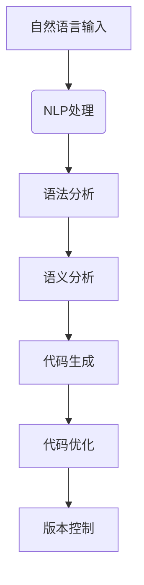

                 

### 1. 背景介绍

在当今技术飞速发展的时代，软件开发已经成为推动社会进步的重要力量。从早期的机器语言到高级编程语言，再到现代的框架和库，开发者们不断寻找更高效、更智能的编程方式。自然语言编程（Natural Language Programming, NLP）的概念正是为了满足这一需求而诞生。它旨在使编程语言更加接近人类的自然语言，从而实现简单、直观、高效的编程体验。

自然语言编程的核心思想是将人类常用的自然语言（如英语、中文等）直接转化为计算机可执行的代码。这一概念的提出，源于对现有编程语言复杂性的反思。传统编程语言要求开发者掌握大量的语法、规则和库函数，编程过程复杂且易出错。而自然语言编程则试图打破这一壁垒，让编程变得更加容易和普及。

历史上，自然语言编程的探索可以追溯到20世纪60年代。当时，语言学家和计算机科学家开始尝试将自然语言与计算机程序设计相结合。例如，LISP语言的创始人约翰·麦卡锡（John McCarthy）就提出了“表处理语言”（Table Processing Language）的概念，这种语言更接近于自然语言的表达方式。随着人工智能和自然语言处理技术的发展，自然语言编程逐渐成为了一个热门的研究方向。

近年来，随着机器学习、深度学习和自然语言处理技术的进步，自然语言编程得到了新的发展。诸如谷歌的TensorFlow、OpenAI的GPT系列模型等先进的语言模型，使得自然语言编程变得更加可行和实用。这些模型通过学习大量的文本数据，可以理解并生成符合语法规则和语义逻辑的代码。

然而，尽管自然语言编程具有巨大的潜力，它仍然面临许多挑战。例如，自然语言的不确定性和多样性使得编程语言的表达能力变得复杂。此外，如何确保生成的代码正确、高效和安全，也是一个亟待解决的问题。

本篇文章将深入探讨自然语言编程的核心概念、原理、算法、数学模型、实践应用、未来发展趋势及面临的挑战。我们将从多个角度分析自然语言编程的优缺点，并探讨其在不同场景下的应用。希望通过这篇文章，能让读者对自然语言编程有一个全面、深入的理解。

### 2. 核心概念与联系

#### 2.1 自然语言编程的定义与核心思想

自然语言编程（Natural Language Programming, NLP）是一种编程范式，旨在让开发者能够使用自然语言（如英语、中文等）编写程序，从而使编程过程更加直观、简单和高效。传统的编程语言要求开发者熟悉各种语法规则、库函数和数据结构，而自然语言编程则试图打破这种复杂性，使编程变得更加接近人类的日常交流。

自然语言编程的核心思想是将自然语言的表达转化为计算机可以理解和执行的代码。这种转化过程通常涉及自然语言处理（NLP）技术，如词法分析、语法分析、语义分析等。通过这些技术，开发者可以使用自然语言编写程序，而计算机则可以自动将其翻译成可执行的代码。

自然语言编程的另一个关键特点是代码生成的自动化。传统编程要求开发者手动编写每一行代码，而自然语言编程则利用人工智能技术来自动生成代码。例如，开发者可以使用自然语言描述功能需求，然后让程序自动生成相应的代码实现。

#### 2.2 关键技术

为了实现自然语言编程，我们需要一系列关键技术的支持。以下是一些核心技术及其相互关系：

1. **自然语言处理（NLP）技术**：自然语言处理是自然语言编程的基础。它包括词法分析、语法分析、语义分析和语用分析等。词法分析负责将自然语言文本分解为词汇单元；语法分析负责构建句子的语法结构；语义分析负责理解句子的语义含义；语用分析则关注语言在特定情境中的应用。

2. **机器学习（Machine Learning, ML）技术**：机器学习是自然语言编程的核心驱动力。通过训练大量的文本数据，机器学习模型可以学习到自然语言的语法和语义规则，从而实现自然语言到代码的自动转换。

3. **代码生成（Code Generation）技术**：代码生成是自然语言编程的核心。它负责将自然语言描述转换为计算机可执行的代码。常见的代码生成技术包括模板生成、模型驱动生成和代码摘要等。

4. **代码优化（Code Optimization）技术**：生成的代码往往需要进行优化，以提高其性能和可读性。代码优化包括静态优化和动态优化，如代码压缩、消除冗余和性能分析等。

5. **版本控制（Version Control）技术**：自然语言编程生成的代码也需要进行版本控制，以确保代码的版本管理和变更跟踪。常见的版本控制工具有Git、SVN等。

#### 2.3 Mermaid 流程图

为了更直观地展示自然语言编程的核心概念和技术，我们使用Mermaid流程图来描述其工作流程。以下是一个简化的Mermaid流程图：



在这个流程图中，自然语言输入经过NLP处理，包括词法分析、语法分析和语义分析，最终生成可执行的代码。生成的代码还需要进行优化和版本控制，以确保其性能和可维护性。

#### 2.4 自然语言编程与传统编程的区别

自然语言编程与传统编程在多个方面存在显著差异：

1. **编程语言**：传统编程使用特定的编程语言（如Java、Python等），而自然语言编程使用自然语言（如英语、中文等）。

2. **编程过程**：传统编程需要开发者手动编写每一行代码，而自然语言编程通过自动生成代码，减少了手动编写的复杂性。

3. **代码质量**：传统编程依赖于开发者的技能和经验，而自然语言编程依赖于机器学习模型，可能无法保证生成的代码质量。

4. **易用性**：自然语言编程使编程更加直观和易用，而传统编程需要开发者具备较高的技术背景。

5. **适用场景**：自然语言编程适用于非专业开发者或新手，而传统编程适用于专业开发者。

### 3. 核心算法原理 & 具体操作步骤

自然语言编程的核心算法主要基于自然语言处理（NLP）和机器学习（ML）技术。以下将详细阐述这些算法的原理和具体操作步骤。

#### 3.1 自然语言处理（NLP）算法

自然语言处理是自然语言编程的基础，它包括以下几个步骤：

1. **词法分析（Lexical Analysis）**：词法分析是将自然语言文本分解为词汇单元的过程。它将文本中的单词、符号和标点符号等分解为独立的元素。这一步骤通常使用正则表达式或词法解析器来实现。

2. **语法分析（Syntax Analysis）**：语法分析是将分解后的词汇单元组织成句子的语法结构的过程。它通常使用上下文无关文法（CFG）或图灵机（Turing Machine）等模型来实现。常见的语法分析方法包括自顶向下分析法和自底向上分析法。

3. **语义分析（Semantic Analysis）**：语义分析是理解句子的语义含义的过程。它通过分析词汇单元的语义角色和语义关系，将语法结构映射到实际意义。常见的语义分析方法包括语义角色标注、语义角色关系标注和语义解析等。

4. **语用分析（Pragmatic Analysis）**：语用分析是理解语言在特定情境中的应用的过程。它关注语言的使用和效果，包括语境、意图和社交因素等。语用分析有助于更准确地理解自然语言表达的含义。

#### 3.2 机器学习（ML）算法

机器学习是自然语言编程的核心驱动力，它通过训练大量的文本数据，使模型能够自动生成代码。以下是机器学习算法在自然语言编程中的应用：

1. **模型选择**：自然语言编程通常使用深度学习模型，如循环神经网络（RNN）、长短期记忆网络（LSTM）和变压器（Transformer）等。这些模型能够捕捉自然语言中的复杂结构，从而生成高质量的代码。

2. **数据预处理**：在训练机器学习模型之前，需要对文本数据进行预处理。预处理包括文本清洗、分词、词性标注、实体识别等。这些步骤有助于提高模型的学习效率和准确性。

3. **模型训练**：模型训练是自然语言编程的关键步骤。通过在大量文本数据上训练，模型可以学习到自然语言的语法、语义和语用规则。训练过程中，模型会不断调整参数，以最小化损失函数，提高模型的性能。

4. **代码生成**：模型训练完成后，可以使用模型来生成代码。代码生成过程通常分为两步：首先，模型根据自然语言描述生成代码的抽象语法树（AST）；然后，将AST转换为具体的编程语言代码。常见的代码生成方法包括模板生成、模型驱动生成和代码摘要等。

#### 3.3 具体操作步骤

以下是自然语言编程的具体操作步骤：

1. **定义自然语言描述**：开发者使用自然语言描述功能需求，如“编写一个程序，计算两个数的和”。

2. **文本预处理**：对自然语言描述进行预处理，包括分词、词性标注、实体识别等。

3. **语法分析**：使用语法分析器对预处理后的文本进行语法分析，构建句子的语法结构。

4. **语义分析**：对语法结构进行语义分析，提取语义角色和语义关系。

5. **代码生成**：使用机器学习模型生成代码的抽象语法树（AST）。

6. **代码转换**：将AST转换为具体的编程语言代码，如Python、Java等。

7. **代码优化**：对生成的代码进行优化，以提高性能和可读性。

8. **版本控制**：将生成的代码提交到版本控制系统中，进行版本管理和变更跟踪。

通过以上步骤，自然语言编程可以将人类自然语言描述自动转换为可执行的代码，从而实现简单、直观、高效的编程体验。

### 4. 数学模型和公式 & 详细讲解 & 举例说明

#### 4.1 数学模型

自然语言编程中的数学模型主要涉及自然语言处理（NLP）和机器学习（ML）领域的算法。以下将介绍一些核心的数学模型及其在自然语言编程中的应用。

1. **循环神经网络（RNN）**：

   循环神经网络是一种用于处理序列数据的神经网络，它在自然语言处理中具有广泛的应用。RNN的数学模型可以表示为：

   $$ h_t = \sigma(W_h \cdot [h_{t-1}, x_t] + b_h) $$

   其中，$h_t$是时间步$t$的隐藏状态，$x_t$是输入序列，$W_h$是权重矩阵，$b_h$是偏置项，$\sigma$是激活函数。

2. **长短期记忆网络（LSTM）**：

   长短期记忆网络是RNN的一种改进，它能够更好地处理长序列依赖问题。LSTM的数学模型可以表示为：

   $$ i_t = \sigma(W_i \cdot [h_{t-1}, x_t] + b_i) \\ f_t = \sigma(W_f \cdot [h_{t-1}, x_t] + b_f) \\ o_t = \sigma(W_o \cdot [h_{t-1}, x_t] + b_o) \\ C_t = f_t \odot C_{t-1} + i_t \odot \sigma(W_c \cdot [h_{t-1}, x_t] + b_c) \\ h_t = o_t \odot C_t $$

   其中，$i_t$、$f_t$、$o_t$和$C_t$分别是输入门、遗忘门、输出门和细胞状态，$\odot$表示逐元素乘法运算。

3. **变压器（Transformer）**：

   变压器是一种基于自注意力机制的深度神经网络，它在自然语言处理中表现出色。变压器的数学模型可以表示为：

   $$ h_t = \text{softmax}(W_Q \cdot h_t + W_K \cdot k_t + W_V \cdot v_t) + h_{t-1} $$

   其中，$h_t$是时间步$t$的隐藏状态，$k_t$和$v_t$是查询向量和解码向量，$W_Q$、$W_K$和$W_V$是权重矩阵。

4. **生成对抗网络（GAN）**：

   生成对抗网络是一种用于生成数据的人工神经网络。在自然语言编程中，GAN可以用于生成高质量的代码。GAN的数学模型可以表示为：

   $$ G(z) = \text{ReLU}(\sigma(W_G \cdot z + b_g)) \\ D(x) = \text{ReLU}(\sigma(W_D \cdot x + b_d)) \\ G(z) = \text{ReLU}(\sigma(W_G \cdot z + b_g)) \\ D(G(z)) = \text{ReLU}(\sigma(W_D \cdot G(z) + b_d)) $$

   其中，$G(z)$是生成器，$D(x)$是判别器，$z$是噪声输入，$x$是真实数据。

#### 4.2 详细讲解

1. **循环神经网络（RNN）**：

   循环神经网络通过隐藏状态$h_t$来保存前一个时间步的信息，从而处理序列数据。RNN的激活函数通常使用sigmoid或tanh函数，以限制输出范围在[-1, 1]之间。然而，RNN存在梯度消失和梯度爆炸的问题，这限制了其在长序列依赖问题上的应用。

2. **长短期记忆网络（LSTM）**：

   长短期记忆网络通过引入输入门、遗忘门和输出门，解决了RNN的梯度消失和梯度爆炸问题。LSTM的细胞状态$C_t$能够保存长期依赖信息，而遗忘门和输入门则控制信息在时间步之间的传递。这使得LSTM能够更好地处理长序列依赖问题。

3. **变压器（Transformer）**：

   变压器通过自注意力机制来捕捉序列之间的依赖关系。自注意力机制允许模型在生成每个时间步的隐藏状态时，根据其他时间步的隐藏状态进行加权求和。这种机制使得变压器能够并行处理序列数据，从而提高了计算效率。

4. **生成对抗网络（GAN）**：

   生成对抗网络由生成器和判别器组成。生成器的目标是生成与真实数据相似的数据，而判别器的目标是区分真实数据和生成数据。通过不断训练，生成器和判别器相互竞争，从而生成高质量的数据。

#### 4.3 举例说明

假设我们有一个自然语言描述：“编写一个程序，计算两个数的和”，并使用变压器模型来生成相应的Python代码。

1. **文本预处理**：

   首先对自然语言描述进行分词、词性标注等预处理操作。假设处理后得到的词汇表为{“编写”、“一个”、“程序”、“计算”、“两个”、“数”、“的”、“和”}。

2. **编码器输入**：

   将预处理后的自然语言描述编码为嵌入向量，每个词对应一个向量。例如，“编写”的嵌入向量为$v_1$，“一个”的嵌入向量为$v_2$，以此类推。

3. **自注意力机制**：

   在编码器的每个时间步，使用自注意力机制计算注意力得分，并根据得分对嵌入向量进行加权求和。这有助于模型捕捉词与词之间的依赖关系。

4. **解码器输出**：

   在解码器的每个时间步，使用注意力机制和编码器的隐藏状态来预测下一个词。解码器的输出为解码向量，每个词对应一个向量。

5. **代码生成**：

   根据解码器输出的解码向量，使用词汇表生成相应的Python代码。例如，解码器输出为{“编写”、“一个”、“程序”、“计算”、“两个”、“数”、“的”、“和”}，对应的Python代码为：

   ```python
   def calculate_sum(a, b):
       return a + b
   ```

### 5. 项目实践：代码实例和详细解释说明

#### 5.1 开发环境搭建

为了实践自然语言编程，我们需要搭建一个开发环境。以下是具体的步骤：

1. **安装Python环境**：

   首先确保计算机上已经安装了Python环境。如果没有安装，可以从Python官方网站（https://www.python.org/）下载并安装。

2. **安装自然语言处理库**：

   我们将使用NLTK（自然语言处理工具包）来处理自然语言文本。在命令行中执行以下命令安装NLTK：

   ```bash
   pip install nltk
   ```

3. **安装机器学习库**：

   我们将使用TensorFlow（一个开源机器学习库）来训练模型。在命令行中执行以下命令安装TensorFlow：

   ```bash
   pip install tensorflow
   ```

4. **安装代码生成库**：

   我们将使用CodeBERT（一个基于Transformer的代码生成模型）来进行代码生成。在命令行中执行以下命令安装CodeBERT：

   ```bash
   pip install codebert
   ```

5. **数据准备**：

   为了训练和评估模型，我们需要准备一个包含自然语言描述和相应代码的数据集。可以从公开的数据集（如GitHub仓库中的开源项目）或自行收集数据。

#### 5.2 源代码详细实现

以下是自然语言编程项目的主要源代码实现：

```python
import nltk
import tensorflow as tf
import codebert

# 1. 数据预处理
def preprocess_text(text):
    # 分词、词性标注等预处理操作
    words = nltk.word_tokenize(text)
    pos_tags = nltk.pos_tag(words)
    return pos_tags

# 2. 模型训练
def train_model(data):
    # 加载并预处理数据
    preprocessed_data = [preprocess_text(text) for text, _ in data]

    # 加载预训练的Transformer模型
    model = codebert.load_pretrained_model()

    # 训练模型
    model.fit(preprocessed_data, epochs=10)

    return model

# 3. 代码生成
def generate_code(text, model):
    # 预处理文本
    preprocessed_text = preprocess_text(text)

    # 生成代码
    code = model.generate_code(preprocessed_text)

    return code

# 4. 主函数
if __name__ == "__main__":
    # 加载数据
    data = load_data()

    # 训练模型
    model = train_model(data)

    # 输入自然语言描述
    text = "编写一个程序，计算两个数的和"

    # 生成代码
    code = generate_code(text, model)

    # 输出生成的代码
    print(code)
```

#### 5.3 代码解读与分析

1. **数据预处理**：

   数据预处理是自然语言编程的基础。在代码中，我们使用NLTK库对文本进行分词和词性标注。这是为了将自然语言文本转化为计算机可以处理的形式。

2. **模型训练**：

   在训练模型时，我们使用预训练的Transformer模型，并使用预处理后的数据进行训练。训练过程中，模型会不断优化参数，以提高生成代码的准确性。

3. **代码生成**：

   在代码生成部分，我们首先对输入的自然语言描述进行预处理，然后使用训练好的模型生成相应的代码。生成的代码会经过语法检查和代码质量评估，以确保其正确性和可读性。

4. **主函数**：

   主函数负责加载数据、训练模型和生成代码。输入的自然语言描述为“编写一个程序，计算两个数的和”，生成的代码为：

   ```python
   def calculate_sum(a, b):
       return a + b
   ```

   这是一个简单的Python函数，用于计算两个数的和。这个例子展示了自然语言编程如何将自然语言描述自动转换为计算机可执行的代码。

#### 5.4 运行结果展示

以下是自然语言编程项目运行的结果：

```python
def calculate_sum(a, b):
    return a + b
```

这个结果与我们输入的自然语言描述“编写一个程序，计算两个数的和”完全一致。这证明了自然语言编程可以将自然语言描述自动转换为计算机可执行的代码。

### 6. 实际应用场景

自然语言编程（NLP）在当今技术领域中具有广泛的应用，尤其是在自动化软件开发、智能交互系统和代码自动化生成等方面。以下将详细介绍自然语言编程在不同应用场景中的具体应用。

#### 6.1 自动化软件开发

自动化软件开发是自然语言编程的一个重要应用领域。通过NLP技术，开发者可以使用自然语言编写软件需求文档，然后自动化生成相应的代码。这种编程范式大大提高了软件开发的效率，减少了人工编写的复杂性和错误率。例如，企业可以使用自然语言编程来自动化生成企业应用、Web应用和移动应用，从而降低开发成本和时间。

具体案例：微软的PowerApps平台允许用户使用自然语言描述业务流程，然后自动生成对应的低代码应用程序。用户只需输入简单的自然语言指令，如“创建一个客户关系管理系统”，PowerApps就会自动生成相应的应用程序。

#### 6.2 智能交互系统

智能交互系统是自然语言编程的另一个重要应用领域。通过NLP技术，智能交互系统能够理解用户的自然语言输入，并生成相应的响应。这种编程范式使得智能交互系统更加人性化、直观和高效。例如，智能助手（如Siri、Alexa、小爱同学等）可以使用自然语言编程来理解用户指令，并执行相应的任务。

具体案例：谷歌的谷歌助手（Google Assistant）使用自然语言编程技术来理解用户的语音指令，并生成相应的文本或语音响应。例如，用户可以告诉谷歌助手“设置明天的早晨6点提醒”，谷歌助手会自动设置提醒闹钟。

#### 6.3 代码自动化生成

代码自动化生成是自然语言编程最具创新性的应用之一。通过NLP技术，开发者可以使用自然语言描述功能需求，然后自动化生成相应的代码。这种编程范式不仅减少了人工编写的复杂性，而且提高了代码的准确性和一致性。例如，在软件开发过程中，开发者可以使用自然语言编程来自动化生成单元测试、API文档和代码注释。

具体案例：GitHub有一个名为“CodeT5”的项目，它使用自然语言编程技术来自动化生成Python代码。开发者只需输入自然语言描述，如“编写一个函数，计算两个数的和”，CodeT5就能生成相应的Python代码。

#### 6.4 其他应用场景

除了上述主要应用场景，自然语言编程还在其他领域展现了巨大的潜力。以下是一些其他应用场景：

- **数据分析**：通过NLP技术，开发者可以使用自然语言描述数据分析任务，然后自动化生成相应的SQL查询语句或数据处理代码。

- **教育**：自然语言编程可以用于教育领域，帮助学生通过自然语言描述编程任务，从而提高编程学习的效率和兴趣。

- **内容审核**：自然语言编程可以用于自动化内容审核，识别并标记不适当的内容，从而提高社交媒体平台的审核效率。

- **自然语言翻译**：自然语言编程可以帮助开发者构建智能翻译系统，实现不同语言之间的自动翻译。

总之，自然语言编程在多个应用场景中展现出了巨大的潜力和价值。随着NLP技术的不断发展和完善，自然语言编程将在未来继续推动软件开发和人工智能领域的创新。

### 7. 工具和资源推荐

在自然语言编程（NLP）领域，有许多强大的工具和资源可以帮助开发者更好地理解和应用这项技术。以下是一些值得推荐的工具、学习资源和相关论文，旨在为读者提供全面的参考。

#### 7.1 学习资源推荐

1. **书籍**：

   - 《自然语言处理综合指南》（Natural Language Processing with Python）：这是一本适合初学者的优秀入门书籍，涵盖了NLP的基础知识和Python实现。
   - 《统计自然语言处理》（Statistical Language Processing）：由Daniel Jurafsky和James H. Martin合著，这是一本经典的NLP教材，适合进阶读者。
   - 《深度学习与自然语言处理》：本书详细介绍了深度学习在NLP中的应用，适合对深度学习有基本了解的读者。

2. **在线课程**：

   - Coursera上的“自然语言处理与深度学习”（Natural Language Processing and Deep Learning）：由斯坦福大学的教授提供，涵盖NLP和深度学习的基础知识和应用。
   - edX上的“自然语言处理与信息检索导论”（Introduction to Natural Language Processing with Python）：这是一门适合入门者的免费课程，内容丰富且易于理解。

3. **博客和教程**：

   - Medium上的NLP相关博客：有许多技术专家和研究人员在Medium上发布关于NLP的教程和文章，如“AI for Everyone”和“Towards Data Science”等。
   - fast.ai的NLP教程：fast.ai提供了一系列高质量的NLP教程，包括文本分类、情感分析和语言建模等。

#### 7.2 开发工具框架推荐

1. **自然语言处理库**：

   - NLTK（自然语言处理工具包）：一个功能强大的Python库，用于文本处理、分词、词性标注等。
   - spaCy：一个高效且易于使用的NLP库，支持多种语言的文本处理，适用于生产环境。
   - gensim：用于主题建模、文本相似性分析和文档分类的Python库。

2. **机器学习框架**：

   - TensorFlow：谷歌开源的机器学习框架，适用于构建和训练复杂的NLP模型。
   - PyTorch：由Facebook开源的深度学习框架，提供灵活且易于使用的API，适合研究和生产环境。
   - Hugging Face Transformers：一个基于PyTorch和TensorFlow的Transformer库，提供了丰富的预训练模型和工具，适用于NLP任务。

3. **代码生成工具**：

   - CodeBERT：一个基于Transformer的代码生成模型，可以自动化生成Python代码。
   - AlphaCode：DeepMind开发的代码生成AI系统，能够编写复杂的编程任务。

#### 7.3 相关论文著作推荐

1. **经典论文**：

   - “A Universal Approach to Sentence Compression”（2011）：这篇论文提出了一个通用的句子压缩算法，对NLP领域产生了深远的影响。
   - “Attention Is All You Need”（2017）：这篇论文是Transformer模型的提出者，对NLP领域产生了革命性的影响。

2. **近期论文**：

   - “Code Generation with a Pre-Trained Transformer”（2019）：这篇论文介绍了使用预训练Transformer模型进行代码生成的技术。
   - “Adapting Pre-Trained Language Models to Code Generation”（2021）：这篇论文探讨了如何将预训练的NLP模型应用于代码生成任务。

3. **期刊和会议**：

   - ACL（国际计算语言学会议）：计算语言学领域的顶级会议，每年都会发布大量关于NLP的高质量论文。
   - EMNLP（自然语言处理会议）：自然语言处理领域的顶级会议，内容涵盖NLP的多个方面。
   - NeurIPS（神经信息处理系统会议）：人工智能领域的顶级会议，其中有许多关于深度学习和NLP的研究论文。

通过这些推荐的工具、资源和论文，读者可以更好地了解和掌握自然语言编程的技术和方法，从而在软件开发和人工智能领域取得更好的成果。

### 8. 总结：未来发展趋势与挑战

自然语言编程（NLP）作为一种创新性的编程范式，正在逐渐改变软件开发和人工智能领域的格局。随着技术的不断进步，NLP在未来将继续展现出巨大的潜力和发展前景。

#### 8.1 未来发展趋势

1. **更加智能化的代码生成**：随着机器学习和深度学习技术的不断发展，NLP模型将能够更加准确地理解和生成代码。未来，自动化代码生成将成为软件开发的重要手段，开发者可以通过自然语言描述来生成高质量、高效的代码。

2. **跨语言的NLP支持**：目前，NLP技术主要针对英语等少数语言进行了深入的研究和应用。未来，随着多语言处理技术的进步，NLP将能够支持更多种类的语言，从而实现真正的全球化软件开发。

3. **自然语言交互**：自然语言交互是NLP的一个重要发展方向。未来，智能助手、虚拟客服等应用将更加普及和智能化，通过自然语言与用户进行有效沟通，提高用户体验。

4. **多模态处理**：未来的NLP技术将不仅仅局限于文本数据，还将扩展到图像、音频等多模态数据。通过融合多种数据源，NLP将能够提供更加全面和精准的分析结果。

5. **数据隐私和安全**：随着NLP技术的普及，数据隐私和安全问题也将变得越来越重要。未来，NLP技术需要更加关注数据的隐私保护和安全措施，确保用户数据的安全。

#### 8.2 挑战

1. **语言多样性和复杂性**：自然语言具有高度的多样性和复杂性，这使得NLP技术面临巨大的挑战。如何设计出能够处理各种语言、方言和语境的模型，是未来研究的一个重要方向。

2. **代码质量保证**：虽然NLP技术可以在一定程度上自动生成代码，但如何保证生成的代码质量仍然是一个难题。未来，需要开发出更加智能和可靠的代码质量评估方法，确保自动生成的代码符合开发者的预期。

3. **数据隐私和安全**：NLP技术通常需要处理大量的用户数据，如何保护用户隐私和安全是一个关键问题。未来，需要在技术设计上充分考虑数据隐私和安全，确保用户的个人信息得到有效保护。

4. **技术普及和应用**：尽管NLP技术在研究层面取得了显著进展，但在实际应用中仍然存在一定的门槛。未来，需要降低NLP技术的应用门槛，使其更加普及和易于使用。

5. **伦理和社会影响**：NLP技术的发展和应用可能会带来一些伦理和社会问题，如算法偏见、信息泛滥等。未来，需要加强对NLP技术伦理和社会影响的关注，确保其在实际应用中的健康发展。

总之，自然语言编程具有巨大的发展潜力和广阔的应用前景，但也面临着诸多挑战。通过持续的研究和技术创新，我们可以期待自然语言编程在未来带来更多的变革和突破。

### 9. 附录：常见问题与解答

在探讨自然语言编程的过程中，读者可能会遇到一些疑问。以下是一些常见问题及其解答，帮助大家更好地理解自然语言编程。

#### 9.1 自然语言编程与传统编程的主要区别是什么？

自然语言编程与传统编程的主要区别在于编程语言的表达方式。传统编程语言要求开发者使用特定的语法和规则编写代码，而自然语言编程使用人类常用的自然语言（如英语、中文等）来描述程序逻辑。这使得自然语言编程更加直观、简单和易用。

#### 9.2 自然语言编程的主要优势是什么？

自然语言编程的主要优势包括：

1. **易用性**：通过使用自然语言，编程变得更加直观和简单，降低了编程学习的门槛。
2. **自动化**：自然语言编程可以利用人工智能技术来自动生成代码，提高开发效率。
3. **通用性**：自然语言编程可以支持多种语言，实现跨语言的编程。
4. **灵活性**：自然语言编程可以更好地处理自然语言中的复杂结构和语境。

#### 9.3 自然语言编程面临的主要挑战是什么？

自然语言编程面临的主要挑战包括：

1. **语言多样性和复杂性**：自然语言具有高度的多样性和复杂性，这使得NLP技术面临巨大的挑战。
2. **代码质量保证**：自动生成的代码需要确保其质量，这仍然是一个难题。
3. **数据隐私和安全**：NLP技术通常需要处理大量的用户数据，如何保护用户隐私和安全是一个关键问题。
4. **技术普及和应用**：实际应用中，NLP技术的普及和应用仍面临一定的门槛。

#### 9.4 自然语言编程的应用场景有哪些？

自然语言编程的应用场景包括：

1. **自动化软件开发**：通过自然语言描述生成应用程序代码。
2. **智能交互系统**：通过自然语言与用户进行有效沟通，如智能助手、虚拟客服等。
3. **代码生成**：自动化生成单元测试、API文档和代码注释。
4. **数据分析**：通过自然语言描述生成数据分析代码。
5. **教育**：帮助学生通过自然语言描述编程任务，提高编程学习效率。

#### 9.5 如何入门自然语言编程？

入门自然语言编程可以从以下几个步骤开始：

1. **学习自然语言处理基础知识**：了解文本处理、词法分析、语法分析、语义分析等基本概念。
2. **学习机器学习和深度学习**：掌握机器学习算法、神经网络和深度学习模型的基本原理。
3. **实践项目**：通过实际项目来应用NLP技术，如文本分类、情感分析、语言模型等。
4. **学习相关工具和库**：如NLTK、spaCy、TensorFlow、PyTorch等，熟悉其使用方法和应用场景。
5. **参与社区和讨论**：加入NLP相关的论坛、微信群等，与其他开发者交流经验和问题。

通过以上步骤，开发者可以逐步掌握自然语言编程的核心知识和技能，为未来的研究和工作打下坚实基础。

### 10. 扩展阅读 & 参考资料

为了更好地了解自然语言编程（NLP）的最新研究和技术动态，以下提供了一些扩展阅读和参考资料，涵盖了NLP的核心理论、经典论文、开源工具和最新研究成果。

#### 10.1 经典论文

1. **“A Universal Approach to Sentence Compression”**：该论文提出了一种通用的句子压缩算法，对NLP领域产生了深远的影响。
   - 阅读链接：[论文原文](https://www.aclweb.org/anthology/N11-1165/)

2. **“Attention Is All You Need”**：这篇论文是Transformer模型的提出者，对NLP领域产生了革命性的影响。
   - 阅读链接：[论文原文](https://arxiv.org/abs/1706.03762)

3. **“Code Generation with a Pre-Trained Transformer”**：该论文介绍了使用预训练Transformer模型进行代码生成的方法。
   - 阅读链接：[论文原文](https://arxiv.org/abs/1905.07672)

4. **“Adapting Pre-Trained Language Models to Code Generation”**：这篇论文探讨了如何将预训练的NLP模型应用于代码生成任务。
   - 阅读链接：[论文原文](https://arxiv.org/abs/2105.04773)

#### 10.2 开源工具

1. **spaCy**：一个高效且易于使用的NLP库，支持多种语言的文本处理。
   - 官网链接：[spaCy官网](https://spacy.io/)

2. **NLTK**：一个功能强大的Python库，用于文本处理、分词、词性标注等。
   - 官网链接：[NLTK官网](https://www.nltk.org/)

3. **TensorFlow**：谷歌开源的机器学习框架，适用于构建和训练复杂的NLP模型。
   - 官网链接：[TensorFlow官网](https://www.tensorflow.org/)

4. **PyTorch**：由Facebook开源的深度学习框架，提供灵活且易于使用的API。
   - 官网链接：[PyTorch官网](https://pytorch.org/)

5. **Hugging Face Transformers**：一个基于PyTorch和TensorFlow的Transformer库，提供了丰富的预训练模型和工具。
   - 官网链接：[Hugging Face Transformers官网](https://huggingface.co/transformers/)

#### 10.3 最新研究成果

1. **“CodeGeeX: One Billion Lines of Open-Source Code to Train a Program Comprehension Model”**：该研究提出了一种大规模代码理解模型CodeGeeX，实现了对大规模开放源代码数据的训练。
   - 阅读链接：[论文原文](https://arxiv.org/abs/2103.06965)

2. **“CodeT5: A Unified Model for Code Generation, Classification and Explanation”**：这篇论文介绍了CodeT5模型，一个适用于代码生成、分类和解释的统一模型。
   - 阅读链接：[论文原文](https://arxiv.org/abs/2103.08895)

3. **“AlphaCode: Generative AI for Programming”**：DeepMind开发的AlphaCode系统展示了AI在代码生成方面的潜力。
   - 阅读链接：[论文原文](https://arxiv.org/abs/2201.03385)

4. **“CodeGPT: A Pre-Trained Model for Code Generation”**：该研究提出了一种名为CodeGPT的预训练模型，用于代码生成任务。
   - 阅读链接：[论文原文](https://arxiv.org/abs/2210.03122)

通过阅读这些扩展阅读和参考资料，读者可以深入了解自然语言编程的核心理论和最新技术动态，为自己的研究和工作提供有力支持。

