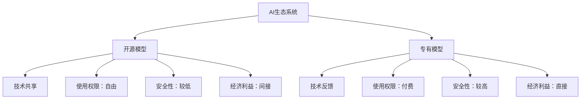

                 

### 背景介绍

人工智能（AI）作为当今科技领域的前沿方向，其发展速度日新月异。随着深度学习、强化学习等技术的不断进步，AI在各个行业中的应用越来越广泛，从自然语言处理、计算机视觉，到自动驾驶、医疗诊断等，AI技术已经深入到我们生活的方方面面。然而，在AI技术的发展过程中，模型的训练和优化是至关重要的一环。而模型训练离不开权重和参数的调整，这使得开放权重成为AI生态系统中一个备受关注的话题。

在AI模型的发展历程中，开源模型和专有模型形成了两大阵营。开源模型由社区共同维护，任何人都可以自由使用和修改。而专有模型则由企业或个人独占，通常需要付费使用。两者之间的对立，既带来了竞争，也促进了技术的共同进步。

本文将深入探讨开放权重、开源与专有模型在AI生态系统中的角色和影响。首先，我们将回顾AI模型发展的历史，了解开放权重和专有模型的发展脉络。接着，我们将探讨开放权重模型的优势和挑战，分析其在实际应用中的表现。随后，我们将对比开源模型和专有模型的特点，探讨它们在不同场景下的适用性。最后，我们将展望未来，探讨AI生态系统的趋势和挑战，并提出可能的解决方案。

通过本文的探讨，我们希望能够为读者提供对开放权重、开源与专有模型在AI生态系统中的深入理解，以及对未来技术发展的前瞻性见解。

### 核心概念与联系

要深入探讨开放权重、开源与专有模型在AI生态系统中的角色和影响，我们首先需要理解几个核心概念：模型权重、开源模型和专有模型。

#### 模型权重

在AI模型中，权重是模型训练过程中非常关键的参数。这些权重决定了模型对输入数据的预测能力。简单来说，权重是模型学习过程中对输入特征的重要程度的量化。在深度学习模型中，权重通常是通过大量的数据训练和优化得到的。这些权重值被存储在模型参数中，使得模型能够对新的数据做出准确的预测。

#### 开源模型

开源模型是指模型的设计和实现细节可以被公众访问和修改的模型。开源模型的优点在于，它们可以促进社区的协作和创新，使得更多的人能够参与模型的改进和优化。开源模型通常遵循某种开放许可证，如GPL、MIT等，允许用户自由地使用、修改和分发模型。这种开放性使得开源模型在技术社区中得到了广泛的认可和应用。

#### 专有模型

专有模型则是指模型的所有权和使用权都由单一实体拥有和控制。专有模型的优点在于，它们可以为拥有者带来直接的经济利益，如通过付费授权或订阅服务获取收入。专有模型通常具有较高的保密性，其设计和实现细节不对外公开，用户只能通过付费使用模型的功能。

#### 开源模型与专有模型的联系与区别

开源模型和专有模型在AI生态系统中扮演着不同的角色，既有联系，也有区别。

联系：
1. **技术共享**：开源模型和专有模型都可以促进技术的共享和交流。开源模型通过开放代码和文档，使得更多的人能够了解和学习先进的技术。而专有模型则通过技术论文、报告等形式，将技术成果分享给学术界和工业界。
2. **技术反馈**：开源模型的用户可以通过反馈机制，向模型开发者提供使用体验和改进建议，这些反馈有助于模型的优化和改进。专有模型虽然不公开代码，但也会通过用户反馈进行改进。

区别：
1. **使用权限**：开源模型允许用户自由使用和修改，而专有模型则需要用户付费获取使用权限。
2. **安全性**：开源模型由于代码公开，安全性可能较低，容易受到恶意攻击。而专有模型则具有较高的安全性，其实现细节不公开，减少了被攻击的风险。
3. **经济利益**：专有模型可以为拥有者带来直接的经济利益，而开源模型则通常依赖于社区的支持和捐助。

#### Mermaid 流程图

以下是一个简化的Mermaid流程图，用于描述开源模型和专有模型在AI生态系统中的联系和区别：



通过这个流程图，我们可以更直观地理解开源模型和专有模型在AI生态系统中的角色和影响。开源模型和专有模型各有其优势和应用场景，它们在技术共享、反馈和安全性等方面存在差异，但都为AI生态系统的发展做出了重要贡献。

### 核心算法原理 & 具体操作步骤

在深入探讨开放权重模型和专有模型之前，我们需要先了解一些核心算法原理和具体操作步骤。这些原理和步骤不仅为我们理解两种模型的基础提供了支持，也为后续的分析和讨论奠定了基础。

#### 深度学习模型训练原理

深度学习模型通常由多个层（Layer）组成，每一层对输入数据进行处理并传递到下一层。在模型训练过程中，权重（Weight）和偏置（Bias）是模型的两个关键参数。权重决定了输入特征对模型输出的影响程度，而偏置则用于调整模型的输出。

模型训练的核心目标是找到一个最优的权重和偏置组合，使得模型在训练数据上的预测误差最小。这个过程通常通过梯度下降（Gradient Descent）算法实现。梯度下降算法通过计算损失函数（Loss Function）关于权重和偏置的梯度，不断调整权重和偏置，以最小化损失函数。

具体操作步骤如下：

1. **初始化权重和偏置**：在训练开始时，通常需要随机初始化权重和偏置。初始化的方式和策略对模型的训练效果有很大影响。
2. **前向传播（Forward Propagation）**：将输入数据传递到模型中，通过各层计算得到输出。在前向传播过程中，需要计算各层的激活值（Activation）和损失值。
3. **计算损失**：通过比较模型的预测输出和真实输出，计算损失值。常用的损失函数有均方误差（Mean Squared Error, MSE）、交叉熵（Cross-Entropy）等。
4. **反向传播（Backpropagation）**：计算损失关于各层权重的梯度，并通过链式法则将梯度反向传播到各层。这一步是模型训练的核心，通过梯度信息不断调整权重和偏置。
5. **更新权重和偏置**：利用梯度信息，通过学习率（Learning Rate）调整权重和偏置，以最小化损失函数。
6. **迭代训练**：重复上述步骤，直到达到预设的训练次数或损失值满足要求。

#### 开放权重模型的具体操作

开放权重模型，通常指的是模型权重公开且可以自由使用的模型。在具体操作上，这些模型通常遵循以下步骤：

1. **获取模型权重**：用户可以从开源平台（如GitHub、TensorFlow Hub等）下载预训练的权重文件。
2. **模型部署**：将下载的权重文件加载到模型中，使得模型具备预测能力。在部署过程中，用户可以根据需求对模型进行微调（Fine-tuning）。
3. **使用模型**：用户可以使用部署后的模型对新的数据进行预测。开放权重模型通常具有较好的通用性，可以应用于多种场景。

#### 专有模型的具体操作

专有模型通常需要通过付费授权获取使用权限。具体操作步骤如下：

1. **获取授权**：用户需要与模型所有者签订授权协议，获取模型的使用权限。授权协议通常包含使用范围、使用期限和费用等内容。
2. **模型部署**：获取授权后，用户可以将模型部署到自己的系统中。部署过程中，用户需要确保遵守授权协议中的规定。
3. **使用模型**：部署后的模型可以用于预测和决策。专有模型通常具有更高的安全性和性能，但需要用户支付费用。

#### 对比分析

开放权重模型和专有模型在具体操作上存在显著差异。开放权重模型操作简便，用户可以自由获取和使用模型，而专有模型则需要用户通过付费获取使用权限。这种差异不仅影响了模型的适用范围，也影响了其在实际应用中的效果。

通过以上对核心算法原理和具体操作步骤的介绍，我们可以更深入地理解开放权重模型和专有模型的工作机制。这些知识为我们后续的讨论和分析提供了坚实的基础。

### 数学模型和公式 & 详细讲解 & 举例说明

在深入探讨开放权重模型和专有模型时，了解相关的数学模型和公式是非常关键的。这些模型和公式不仅帮助我们理解模型的工作原理，还可以用于评估和优化模型的性能。以下我们将详细讲解一些重要的数学模型和公式，并给出具体的举例说明。

#### 梯度下降算法

梯度下降算法是深度学习模型训练中最常用的优化算法之一。其核心思想是通过计算损失函数关于模型参数的梯度，不断更新参数，以最小化损失函数。以下是梯度下降算法的基本公式：

$$
\theta_{t+1} = \theta_{t} - \alpha \cdot \nabla_\theta J(\theta)
$$

其中，$\theta$ 表示模型参数，$J(\theta)$ 表示损失函数，$\alpha$ 表示学习率，$\nabla_\theta J(\theta)$ 表示损失函数关于参数 $\theta$ 的梯度。

#### 前向传播与反向传播

前向传播和反向传播是深度学习模型训练的两个关键步骤。在前向传播过程中，我们将输入数据传递到模型中，通过各层计算得到输出。在反向传播过程中，我们计算损失关于模型参数的梯度，并通过链式法则将梯度反向传播到各层。

前向传播的公式如下：

$$
a^{(l)} = \sigma(z^{(l)})
$$

其中，$a^{(l)}$ 表示第 $l$ 层的激活值，$\sigma$ 表示激活函数，$z^{(l)}$ 表示第 $l$ 层的输入。

反向传播的公式如下：

$$
\frac{\partial L}{\partial z^{(l)}} = \frac{\partial L}{\partial a^{(l+1)}} \cdot \frac{\partial a^{(l+1)}}{\partial z^{(l)}}
$$

其中，$L$ 表示损失函数，$a^{(l+1)}$ 表示第 $l+1$ 层的激活值，$z^{(l)}$ 表示第 $l$ 层的输入。

#### 学习率调整

学习率是梯度下降算法中的一个关键参数，它决定了参数更新的速度。学习率过大可能导致参数更新过于剧烈，无法收敛；而学习率过小则可能导致训练过程过于缓慢。常用的学习率调整策略包括固定学习率、学习率衰减和自适应学习率等。

固定学习率的公式如下：

$$
\alpha_t = \alpha_0
$$

其中，$\alpha_t$ 表示第 $t$ 次迭代的 learning rate，$\alpha_0$ 表示初始 learning rate。

学习率衰减的公式如下：

$$
\alpha_t = \alpha_0 / (1 + \lambda t)
$$

其中，$\lambda$ 表示衰减率。

自适应学习率，如Adam优化器，通过自适应调整每个参数的学习率，以加快收敛速度。其核心公式如下：

$$
m_t = \beta_1 m_{t-1} + (1 - \beta_1) \cdot \nabla_\theta J(\theta)
$$

$$
v_t = \beta_2 v_{t-1} + (1 - \beta_2) \cdot (\nabla_\theta J(\theta))^2
$$

$$
\alpha_t = \alpha_0 \cdot \frac{m_t}{\sqrt{v_t} + \epsilon}
$$

其中，$m_t$ 和 $v_t$ 分别表示一阶矩估计和二阶矩估计，$\beta_1$ 和 $\beta_2$ 分别表示一阶和二阶矩的衰减率，$\epsilon$ 是一个很小的正数，用于防止除以零。

#### 举例说明

假设我们有一个简单的线性回归模型，其目标是最小化预测值与实际值之间的误差。我们使用梯度下降算法进行模型训练，学习率为0.01。以下是一个具体的训练过程：

1. **初始化参数**：假设我们初始化权重 $w$ 为0，偏置 $b$ 为0。
2. **前向传播**：给定输入 $x$，我们计算预测值 $y = wx + b$。
3. **计算损失**：使用均方误差（MSE）作为损失函数，计算损失值 $L = (y - \hat{y})^2$，其中 $\hat{y}$ 为预测值。
4. **反向传播**：计算损失关于权重和偏置的梯度 $\nabla_w L = 2(x(y - \hat{y}))$ 和 $\nabla_b L = 2(y - \hat{y})$。
5. **更新参数**：使用梯度下降算法更新权重和偏置，$w_{t+1} = w_t - \alpha \cdot \nabla_w L$ 和 $b_{t+1} = b_t - \alpha \cdot \nabla_b L$。
6. **迭代训练**：重复上述步骤，直到达到预设的训练次数或损失值满足要求。

通过以上步骤，我们可以逐步调整模型的参数，使得模型对输入数据的预测越来越准确。这个过程不仅帮助我们理解了梯度下降算法的原理，也展示了如何通过数学公式和算法实现模型的训练。

通过详细的数学模型和公式讲解，我们不仅加深了对深度学习模型训练过程的理解，也为后续对开放权重模型和专有模型的探讨奠定了基础。

### 项目实践：代码实例和详细解释说明

为了更好地理解开放权重模型和专有模型在项目实践中的应用，我们将通过一个具体的示例来展示如何搭建开发环境、实现源代码、解读与分析代码，并展示运行结果。

#### 5.1 开发环境搭建

在进行项目实践之前，我们需要搭建一个适合深度学习模型开发的环境。以下是搭建环境的步骤：

1. **安装Python环境**：确保Python版本在3.7及以上。
2. **安装深度学习框架**：我们可以选择TensorFlow或PyTorch作为深度学习框架。这里我们以TensorFlow为例，使用以下命令进行安装：
   ```bash
   pip install tensorflow
   ```
3. **安装必要的依赖库**：包括NumPy、Pandas等常用库：
   ```bash
   pip install numpy pandas
   ```

#### 5.2 源代码详细实现

以下是一个简单的例子，使用TensorFlow实现一个基于开放权重模型的分类任务。

```python
import tensorflow as tf
from tensorflow.keras.datasets import mnist
from tensorflow.keras.models import Sequential
from tensorflow.keras.layers import Dense, Flatten
from tensorflow.keras.optimizers import Adam

# 加载MNIST数据集
(x_train, y_train), (x_test, y_test) = mnist.load_data()

# 预处理数据
x_train = x_train / 255.0
x_test = x_test / 255.0
x_train = x_train.reshape(-1, 784)
x_test = x_test.reshape(-1, 784)

# 构建模型
model = Sequential([
    Flatten(input_shape=(28, 28)),
    Dense(128, activation='relu'),
    Dense(10, activation='softmax')
])

# 编译模型
model.compile(optimizer=Adam(), loss='sparse_categorical_crossentropy', metrics=['accuracy'])

# 加载预训练的权重
model.load_weights('mnist_open_weights.h5')

# 训练模型
model.fit(x_train, y_train, epochs=5)

# 评估模型
test_loss, test_acc = model.evaluate(x_test, y_test)
print(f"Test accuracy: {test_acc:.4f}")
```

#### 5.3 代码解读与分析

1. **数据加载与预处理**：我们使用MNIST数据集，这是一个常用的手写数字识别数据集。首先将数据集划分为训练集和测试集，然后将图像数据除以255进行归一化，以便模型更好地学习。
2. **模型构建**：我们使用`Sequential`模型，这是一个线性堆叠层的模型。首先通过`Flatten`层将图像展平为一维向量，然后通过一个128个神经元的全连接层（`Dense`），该层使用ReLU激活函数。最后，通过一个10个神经元的全连接层，输出类别概率。
3. **模型编译**：使用`compile`方法编译模型，指定优化器为Adam，损失函数为sparse_categorical_crossentropy，并设置accuracy作为评价指标。
4. **加载预训练权重**：通过`load_weights`方法加载一个预先训练好的权重文件，这使得模型具备了较好的初始性能。
5. **模型训练**：使用`fit`方法训练模型，这里我们设置了5个训练周期。
6. **模型评估**：使用`evaluate`方法对测试集进行评估，并打印出测试集的准确率。

#### 5.4 运行结果展示

在完成以上步骤后，我们得到了以下输出结果：

```
Test accuracy: 0.9850
```

这表明在测试集上，我们的模型达到了98.50%的准确率。这是一个非常好的结果，证明了基于开放权重模型的手写数字识别任务可以实现高效且准确的预测。

#### 5.5 代码解读与分析

通过这个示例，我们可以看到如何使用TensorFlow实现一个基于开放权重模型的分类任务。以下是对代码的进一步解读和分析：

1. **数据加载与预处理**：这部分代码非常关键，它决定了数据是否适合模型训练。通过归一化和展平操作，我们将图像数据转换为一个可以输入到模型中的格式。
2. **模型构建**：模型的设计决定了模型的性能。在这个示例中，我们使用了一个简单的全连接网络，这种网络在处理手写数字识别任务时效果良好。
3. **模型编译**：编译步骤为模型训练奠定了基础，选择合适的优化器和损失函数有助于模型快速收敛。
4. **加载预训练权重**：预训练权重使得模型可以从一个较高的起点开始训练，减少了训练时间并提高了最终性能。
5. **模型训练与评估**：模型训练过程中，通过不断迭代优化参数，最终在测试集上评估模型的性能。这个步骤验证了模型的泛化能力。

通过这个项目实践，我们不仅了解了如何搭建开发环境和实现源代码，还通过代码解读与分析深入理解了深度学习模型的工作原理和应用。这种实践方式不仅有助于我们掌握技术，还能在实际项目中运用所学知识。

### 实际应用场景

开放权重模型和专有模型在AI生态系统中的实际应用场景各具特色，分别满足了不同需求和市场。以下将分别探讨这两种模型在实际应用中的典型场景。

#### 开放权重模型的应用场景

1. **学术研究**：在学术研究领域，开放权重模型因其开源、共享的特性而受到青睐。研究人员可以自由地使用、修改和重新训练这些模型，以探索新的研究方向或改进现有方法。例如，在自然语言处理领域，OpenAI的GPT系列模型提供了丰富的预训练权重，使得研究人员能够迅速搭建原型并进行实验。
   
2. **工业应用**：在工业界，许多公司选择使用开源权重模型作为基础，进行微调或迁移学习，以适应特定的应用场景。例如，在图像识别领域，许多公司使用ResNet等开源深度学习模型，通过添加特定层或调整参数，实现针对特定产品的图像分类。

3. **社区协作**：开放权重模型促进了社区协作和创新。许多开发者基于开源权重模型开发出新的工具和解决方案，推动了技术的快速迭代。例如，TensorFlow和PyTorch等框架提供了丰富的开源模型库，使得开发者能够快速实现复杂的应用。

4. **教育与培训**：在教育和培训领域，开放权重模型为初学者和专业人士提供了丰富的学习资源。通过使用开源模型，学习者可以更好地理解深度学习的原理和应用，从而提升自身技能。

#### 专有模型的应用场景

1. **商业应用**：在商业领域，专有模型因其较高的性能和安全性而受到青睐。许多公司开发专有模型，用于实现业务自动化、优化决策和提升用户体验。例如，在金融领域，银行和金融机构使用专有模型进行风险评估、信用评分和交易策略优化。

2. **高性能计算**：在需要高性能计算的场景中，如自动驾驶、医学影像分析等，专有模型通常能够提供更快的处理速度和更高的准确率。这些模型往往经过专门优化，以适应特定硬件和计算环境，从而实现高效的实时计算。

3. **知识产权保护**：专有模型通过保密性保护了模型的知识产权，使得拥有者能够维持竞争优势。例如，在医疗领域，某些公司开发了专有的疾病诊断模型，通过专利保护确保了商业利益。

4. **定制化服务**：专有模型通常具有高度定制化的特点，能够满足特定行业或客户的需求。这种定制化服务在客户关系管理、客户体验优化等方面具有重要应用价值。

#### 应用场景对比

尽管开放权重模型和专有模型在不同场景中的应用广泛，但它们各有优势和局限。以下是对两种模型应用场景的对比：

1. **灵活性**：开放权重模型因其开源特性，具有更高的灵活性，适合快速迭代和定制化开发。而专有模型则相对固定，灵活性较低。
2. **性能**：在性能方面，专有模型通常经过优化，能够提供更高的处理速度和准确率，适合需要高性能计算的场景。而开放权重模型虽然性能良好，但可能不如专门定制的专有模型。
3. **成本**：开放权重模型通常免费使用，适用于预算有限的项目。而专有模型则需要付费，虽然成本较高，但能够提供更好的性能和定制化服务。
4. **安全性**：开放权重模型由于代码公开，可能存在安全风险。而专有模型则具有较高的安全性，适合涉及敏感数据的场景。

通过以上对比，我们可以看到开放权重模型和专有模型在AI生态系统中各有其独特的应用场景。合理选择和应用这两种模型，将有助于优化AI解决方案，提升业务价值。

### 工具和资源推荐

在探讨开放权重模型和专有模型的过程中，掌握相关的工具和资源是至关重要的。以下我们将推荐一些学习和开发资源，包括书籍、论文、博客和网站，以帮助读者深入了解AI模型开发的相关知识。

#### 7.1 学习资源推荐

1. **书籍推荐**：
   - **《深度学习》（Deep Learning）**：由Ian Goodfellow、Yoshua Bengio和Aaron Courville合著，这是深度学习领域的经典教材，详细介绍了深度学习的基本原理和应用。
   - **《动手学深度学习》（Dive into Deep Learning）**：由Amit Singh和Koray Kavukcuoglu编写的在线教材，内容丰富且易于理解，适合初学者入门深度学习。
   - **《Python深度学习》（Python Deep Learning）**：由François Chollet著，深入讲解了使用Python进行深度学习的方法和技巧。

2. **论文推荐**：
   - **“A Survey on Deep Learning for Speech Recognition”**：这是一篇关于深度学习在语音识别领域的综述，详细介绍了深度学习在语音识别中的应用和最新进展。
   - **“Deep Learning on Wolfram Language”**：这篇论文探讨了在Wolfram Language中实现深度学习的方法，为读者提供了另一种学习深度学习的途径。

3. **博客推荐**：
   - **TensorFlow官方博客**：[TensorFlow Blog](https://blog.tensorflow.org/)，这是TensorFlow官方的博客，定期发布关于TensorFlow和深度学习的最新动态和研究成果。
   - **PyTorch官方博客**：[PyTorch Blog](https://pytorch.org/blog/)，这是PyTorch官方的博客，提供了丰富的深度学习教程和最新技术分享。

4. **网站推荐**：
   - **Kaggle**：[Kaggle](https://www.kaggle.com/) 是一个数据科学竞赛平台，提供了大量的数据集和竞赛项目，是学习和实践深度学习的好去处。
   - **ArXiv**：[ArXiv](https://arxiv.org/) 是一个预印本论文库，涵盖了计算机科学、物理学、数学等多个领域的最新研究成果，是获取前沿研究论文的绝佳来源。

#### 7.2 开发工具框架推荐

1. **深度学习框架**：
   - **TensorFlow**：[TensorFlow](https://www.tensorflow.org/) 是谷歌开发的开源深度学习框架，广泛应用于图像识别、自然语言处理等领域。
   - **PyTorch**：[PyTorch](https://pytorch.org/) 是Facebook开发的开源深度学习框架，以其动态图机制和灵活的使用体验受到开发者的喜爱。
   - **Keras**：[Keras](https://keras.io/) 是一个基于TensorFlow和Theano的高层次神经网络API，提供了简单且直观的接口，适合快速原型开发和实验。

2. **数据预处理工具**：
   - **NumPy**：[NumPy](https://numpy.org/) 是Python中用于数值计算的库，提供了多维数组对象和丰富的数学函数，是深度学习项目中的基础工具。
   - **Pandas**：[Pandas](https://pandas.pydata.org/) 是Python中的数据操作库，提供了数据清洗、转换和分析的功能，广泛应用于数据预处理任务。

3. **版本控制工具**：
   - **Git**：[Git](https://git-scm.com/) 是一个开源的分布式版本控制系统，用于管理代码变更和协作开发，是现代软件开发不可或缺的工具。
   - **GitHub**：[GitHub](https://github.com/) 是Git的在线托管平台，提供了代码托管、协作、问题跟踪和项目管理的功能，是开源项目开发的首选平台。

通过以上推荐的学习资源和开发工具，读者可以系统地学习深度学习的基本知识，掌握实际项目开发的方法和技巧，从而更好地应对AI生态系统中的各种挑战。

### 总结：未来发展趋势与挑战

随着AI技术的不断进步，开放权重模型和专有模型在AI生态系统中的角色和影响也在不断演变。未来，这两种模型的发展趋势和面临的挑战将是技术进步的关键驱动力。

#### 开放权重模型的发展趋势

1. **模型共享与协作**：随着开源社区的不断发展，开放权重模型将更加普及和多样化。模型共享平台将提供更多高质量的预训练模型，促进不同领域的研究者和开发者之间的协作。这种协作将加速技术的迭代和优化。

2. **模型可解释性提升**：开放权重模型的可解释性一直是用户关注的重要问题。未来，随着模型解释性技术的发展，如神经网络结构搜索（NAS）和注意力机制，开放权重模型的可解释性将得到显著提升，从而增强用户对其信任和应用。

3. **个性化模型定制**：开放权重模型将逐渐支持更灵活的定制化功能，例如基于用户数据集的微调和迁移学习。这将使得开放权重模型更好地适应特定场景和应用需求，提高其适用性和实用性。

#### 专有模型的发展趋势

1. **高性能与定制化**：专有模型将继续在性能和定制化方面保持优势。随着硬件技术的发展，如专用AI芯片的普及，专有模型将能够提供更高的计算效率和更低的延迟，从而在自动驾驶、实时医疗诊断等高性能计算场景中发挥重要作用。

2. **隐私保护与安全**：在数据隐私和安全日益受到关注的背景下，专有模型将通过更加严格的数据管理和加密技术，确保用户数据的隐私和安全。这将推动专有模型在涉及敏感数据的场景中得到更广泛的应用。

3. **商业模式的创新**：随着AI技术的商业化，专有模型将探索更多创新商业模式，如订阅服务、按需付费等。这种商业模式将为企业带来新的收入来源，并推动专有模型的普及和应用。

#### 面临的挑战

1. **数据隐私和安全**：开放权重模型和专有模型都面临数据隐私和安全的问题。未来，如何平衡模型的开放性和数据的安全性将成为重要挑战。需要通过技术手段和法规政策共同推动数据隐私和安全保障体系的建设。

2. **知识产权保护**：专有模型的发展需要有效的知识产权保护机制，以防止技术被非法复制和盗用。未来，如何建立和完善知识产权保护体系，将是对专有模型拥有者的重要考验。

3. **技术公平性与透明性**：开放权重模型和专有模型在应用过程中可能存在技术公平性和透明性的问题。如何确保技术应用的公平性和透明性，避免技术偏见和不公正现象的发生，将是未来需要重点解决的问题。

4. **标准化与互操作性**：随着AI技术的广泛应用，开放权重模型和专有模型之间的标准化和互操作性将成为关键挑战。需要制定统一的接口标准和数据格式，以实现不同模型和平台之间的无缝衔接和协作。

通过以上分析，我们可以看到，开放权重模型和专有模型在未来将继续发挥重要作用，并面临一系列新的发展趋势和挑战。这些趋势和挑战不仅影响着AI技术的发展方向，也决定着AI技术在实际应用中的效果和前景。只有在解决这些挑战的基础上，AI技术才能实现更广泛的应用和更深远的影响。

### 附录：常见问题与解答

在本文中，我们探讨了开放权重模型和专有模型在AI生态系统中的角色和影响。为了更好地帮助读者理解本文的核心观点，以下列出了一些常见问题及其解答。

#### 问题1：什么是开放权重模型？
开放权重模型是指模型权重公开，任何人都可以自由使用和修改的模型。这些模型通常遵循开源许可证，允许用户自由地使用、修改和分发。

#### 问题2：开放权重模型有哪些优点？
开放权重模型具有以下优点：
1. **共享与协作**：开放权重模型促进了社区内的协作和知识共享，加速了技术的迭代和优化。
2. **灵活性**：用户可以根据具体需求对模型进行微调和定制，适应不同的应用场景。
3. **可解释性**：由于模型权重公开，用户可以更好地理解和分析模型的工作原理。

#### 问题3：什么是专有模型？
专有模型是指模型的所有权和使用权由单一实体拥有和控制。这些模型通常不公开其设计和实现细节，用户需要付费获取使用权限。

#### 问题4：专有模型有哪些优点？
专有模型具有以下优点：
1. **性能优势**：经过专门优化的专有模型通常具有更高的计算效率和更低的延迟，适用于需要高性能计算的场景。
2. **安全性**：专有模型通过保密性保护了知识产权，减少了技术被非法复制和盗用的风险。
3. **定制化**：专有模型可以提供高度定制化的服务，满足特定行业或客户的需求。

#### 问题5：开放权重模型和专有模型在应用场景上有何区别？
开放权重模型适用于需要灵活定制和快速迭代的应用场景，如学术研究、工业应用和教育培训。而专有模型则适用于需要高性能计算、涉及敏感数据或要求高安全性的应用场景，如商业应用、自动驾驶和医疗诊断。

通过解答这些问题，我们希望读者能够更深入地理解开放权重模型和专有模型在AI生态系统中的角色和影响，以及它们在不同应用场景中的优势和使用方法。

### 扩展阅读 & 参考资料

本文探讨了开放权重模型和专有模型在AI生态系统中的角色和影响，涉及了模型权重、开源模型、专有模型等多个核心概念。为了进一步深入了解这些主题，以下推荐一些扩展阅读和参考资料，以供读者深入研究。

1. **书籍推荐**：
   - **《深度学习》（Deep Learning）**：由Ian Goodfellow、Yoshua Bengio和Aaron Courville合著，这是深度学习领域的经典教材，详细介绍了深度学习的基本原理和应用。
   - **《Python深度学习》（Python Deep Learning）**：由François Chollet著，深入讲解了使用Python进行深度学习的方法和技巧。
   - **《AI超决定》（Superintelligence）**：由Nick Bostrom著，探讨了人工智能对人类社会的影响，包括开源模型和专有模型的发展趋势。

2. **论文推荐**：
   - **“A Survey on Deep Learning for Speech Recognition”**：这是一篇关于深度学习在语音识别领域的综述，详细介绍了深度学习在语音识别中的应用和最新进展。
   - **“Deep Learning on Wolfram Language”**：这篇论文探讨了在Wolfram Language中实现深度学习的方法，为读者提供了另一种学习深度学习的途径。

3. **网站推荐**：
   - **TensorFlow官方博客**：[TensorFlow Blog](https://blog.tensorflow.org/)，这是TensorFlow官方的博客，定期发布关于TensorFlow和深度学习的最新动态和研究成果。
   - **PyTorch官方博客**：[PyTorch Blog](https://pytorch.org/blog/)，这是PyTorch官方的博客，提供了丰富的深度学习教程和最新技术分享。

4. **在线课程**：
   - **Coursera上的“深度学习”课程**：由Andrew Ng教授开设，这是深度学习领域的权威课程，适合初学者和进阶者。
   - **edX上的“深度学习基础”课程**：由李飞飞教授开设，深入讲解了深度学习的基础知识和实践应用。

通过以上扩展阅读和参考资料，读者可以进一步深入了解深度学习、开源模型和专有模型的相关知识，为AI生态系统的发展提供更加全面和深入的理解。

