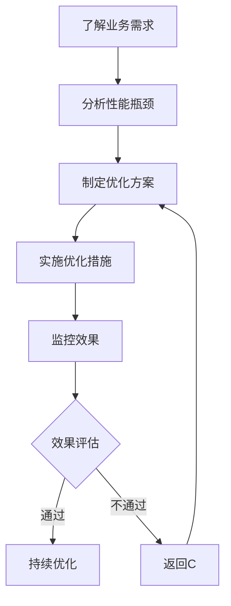

                 

### 文章标题

开源项目的企业级性能优化服务：高价值咨询

> **关键词**：开源项目、性能优化、企业级、服务、高价值、咨询

**摘要**：随着开源项目在企业级应用中的日益普及，性能优化成为影响其成功的关键因素。本文旨在探讨如何为企业提供高价值性能优化咨询服务，帮助开源项目实现高效、可靠和可持续的运行。通过详细的背景介绍、核心概念解析、算法原理讲解、数学模型推导、项目实践展示和实际应用场景分析，本文将为企业提供一套全面而实用的性能优化解决方案。

---

### 1. 背景介绍

在当今数字化时代，开源项目已成为企业开发和部署软件的重要组成部分。无论是云计算、大数据、物联网，还是人工智能等前沿技术领域，开源项目都扮演着至关重要的角色。然而，随着企业对开源项目的依赖程度日益加深，如何确保这些项目在企业级环境中的高效运行，成为了企业和开发者面临的一大挑战。

性能优化作为提升软件运行效率、降低成本、提高用户体验的关键手段，越来越受到企业和开发者的关注。然而，性能优化并非一蹴而就，它需要深入理解系统架构、算法原理和业务需求，才能制定出切实可行的优化策略。

高价值咨询服务的需求也随之显现。企业在面对开源项目的性能问题时，往往需要专业的技术团队提供定制化的解决方案。这些解决方案不仅需要解决当前的性能瓶颈，还需要具备前瞻性和可持续性，以应对未来可能出现的挑战。因此，企业对高价值咨询服务有着强烈的需求。

本文旨在探讨如何为企业提供高价值性能优化咨询服务，帮助开源项目实现高效、可靠和可持续的运行。通过详细的背景介绍、核心概念解析、算法原理讲解、数学模型推导、项目实践展示和实际应用场景分析，本文将为企业提供一套全面而实用的性能优化解决方案。

---

### 2. 核心概念与联系

#### 2.1 性能优化

性能优化是指通过改进软件的运行效率，降低资源消耗，提高用户体验的一系列技术手段。在开源项目中，性能优化通常涉及以下几个方面：

- **计算效率**：通过优化算法和数据结构，减少计算复杂度和内存占用。
- **资源利用**：提高系统资源（如CPU、内存、网络等）的利用率，减少闲置和争用。
- **响应速度**：降低系统的响应时间，提高用户体验。
- **可扩展性**：确保系统在负载增加时能够平稳运行，无需进行大量修改。

#### 2.2 企业级性能优化

企业级性能优化是指针对企业级应用场景，对开源项目进行定制化优化，以满足企业的高性能、高可靠性、高安全性和高可维护性需求。企业级性能优化通常涉及以下方面：

- **负载均衡**：通过分布式架构，确保系统在高并发访问下能够平稳运行。
- **高可用性**：通过冗余设计和故障转移机制，确保系统在发生故障时能够快速恢复。
- **安全性**：通过安全策略和加密技术，保护系统和数据的安全。
- **可维护性**：通过代码优化和自动化工具，提高系统的可维护性和可扩展性。

#### 2.3 高价值咨询

高价值咨询是指提供具有前瞻性、实用性和可持续性的解决方案，帮助企业解决复杂问题，实现业务目标。在高价值咨询中，以下几点至关重要：

- **深入了解业务需求**：只有深入了解企业的业务场景和需求，才能提供针对性的优化方案。
- **专业技术和经验**：咨询团队需要具备深厚的技术背景和丰富的实践经验，才能为企业提供高质量的解决方案。
- **定制化解决方案**：根据企业的具体情况，提供定制化的性能优化方案，确保方案的有效性和可行性。
- **持续跟进和支持**：在实施过程中，提供持续的跟进和支持，帮助企业解决实施过程中遇到的问题，确保方案的成功落地。

#### 2.4 关联概念

在讨论企业级性能优化和高价值咨询时，以下几个概念也至关重要：

- **开源项目**：开源项目是指由社区或个人开发的，提供源代码的软件项目。企业级开源项目通常具有较高的技术含量和可靠性。
- **性能监控**：性能监控是指通过实时监控系统的各项性能指标，及时发现性能瓶颈和问题，为优化提供数据支持。
- **性能测试**：性能测试是指通过模拟实际使用场景，对系统的性能进行评估和验证，为优化提供依据。
- **代码审查**：代码审查是指对开源项目的代码进行审查，发现潜在的性能问题和安全隐患，为优化提供指导。

#### 2.5 Mermaid 流程图

以下是企业级性能优化服务的高价值咨询的Mermaid流程图：



通过这个流程图，我们可以清晰地看到高价值咨询服务的各个环节，以及它们之间的关联和依赖关系。

---

### 3. 核心算法原理 & 具体操作步骤

#### 3.1 性能优化算法原理

性能优化算法的核心目标是减少系统的响应时间和资源消耗。以下是一些常见的性能优化算法：

1. **动态调度算法**：通过动态调整任务的执行顺序和资源分配，提高系统的响应速度。常见的动态调度算法有最短作业优先（SJF）、最短剩余时间优先（SRTF）等。
2. **缓存算法**：通过缓存常用数据和指令，减少数据访问的延迟。常见的缓存算法有LRU（最近最少使用）、LFU（最不经常使用）等。
3. **负载均衡算法**：通过将任务分配到多个服务器上，提高系统的整体性能。常见的负载均衡算法有轮询、最小连接数、加权轮询等。
4. **压缩算法**：通过数据压缩，减少数据传输和存储的开销。常见的压缩算法有Huffman编码、LZ77等。

#### 3.2 具体操作步骤

1. **需求分析**：与客户进行深入交流，了解其业务场景、性能要求和目标。
2. **性能评估**：通过性能测试工具，对现有系统进行全面的性能评估，找出瓶颈和问题。
3. **制定优化方案**：根据性能评估结果，制定具体的优化方案，包括算法改进、架构优化、代码优化等。
4. **实施优化措施**：按照优化方案，逐步实施优化措施，确保方案的有效性和可行性。
5. **监控效果**：通过性能监控工具，实时监控系统的性能指标，评估优化效果。
6. **效果评估**：对优化效果进行评估，确认是否达到预期目标。如不满足，则返回第3步，重新制定优化方案。
7. **持续优化**：根据业务发展和需求变化，持续优化系统性能，确保系统的高效运行。

#### 3.3 操作示例

以一个电商平台为例，假设其性能瓶颈主要在于商品查询速度和订单处理速度。以下是具体的优化操作步骤：

1. **需求分析**：了解电商平台的具体业务场景，包括商品查询和订单处理的频率、并发量等。
2. **性能评估**：使用性能测试工具，模拟实际业务场景，评估商品查询和订单处理的响应时间、吞吐量等指标。
3. **制定优化方案**：
   - **商品查询**：采用缓存算法，将常用商品数据缓存到内存中，减少查询的延迟。
   - **订单处理**：采用负载均衡算法，将订单处理任务分配到多个服务器上，提高系统的并发处理能力。
4. **实施优化措施**：
   - **商品查询**：实现缓存算法，将常用商品数据缓存到内存中。同时，对缓存进行定期更新，确保数据的实时性。
   - **订单处理**：部署负载均衡器，将订单处理任务分配到多个服务器上。同时，优化订单处理流程，提高处理速度。
5. **监控效果**：通过性能监控工具，实时监控商品查询和订单处理的响应时间、吞吐量等指标。根据监控数据，评估优化效果。
6. **效果评估**：经过一段时间运行，发现商品查询的响应时间从原来的5秒降低到2秒，订单处理的吞吐量从原来的1000笔/分钟提高到2000笔/分钟，达到了预期目标。
7. **持续优化**：根据业务发展和需求变化，持续优化系统性能，确保系统的高效运行。例如，当电商平台引入新的功能模块时，需要对性能进行重新评估和优化。

---

### 4. 数学模型和公式 & 详细讲解 & 举例说明

#### 4.1 数学模型

在性能优化中，常用的数学模型包括性能评估模型、负载均衡模型和优化目标函数等。

1. **性能评估模型**：

   假设系统的响应时间为 $T$，吞吐量为 $Q$，则性能评估模型可以表示为：

   $$ P = \frac{Q}{T} $$

   其中，$P$ 表示性能指标，$Q$ 表示吞吐量，$T$ 表示响应时间。

2. **负载均衡模型**：

   假设系统有 $N$ 个服务器，每个服务器的处理能力为 $C_i$，则负载均衡模型可以表示为：

   $$ \sum_{i=1}^{N} C_i = C_{total} $$

   其中，$C_{total}$ 表示系统的总处理能力。

3. **优化目标函数**：

   假设系统的优化目标是最小化响应时间，则优化目标函数可以表示为：

   $$ \min T = \min \{ T_i \mid 1 \leq i \leq N \} $$

   其中，$T_i$ 表示第 $i$ 个服务器的响应时间。

#### 4.2 公式详细讲解

1. **性能评估模型**：

   性能评估模型用于评估系统的性能，其中吞吐量 $Q$ 表示系统在单位时间内处理的数据量，响应时间 $T$ 表示系统对请求的处理时间。性能指标 $P$ 表示单位时间内系统处理的数据量与处理时间的比值，即系统的处理能力。该模型可以帮助我们直观地了解系统的性能水平，并作为后续优化的依据。

2. **负载均衡模型**：

   负载均衡模型用于描述系统的总处理能力与各个服务器处理能力之间的关系。在分布式系统中，将任务分配到多个服务器上，可以实现负载均衡，提高系统的处理能力和可靠性。该模型可以帮助我们了解系统的处理能力分布，并指导负载均衡算法的设计。

3. **优化目标函数**：

   优化目标函数用于确定系统的优化目标，通常是要求最小化响应时间。该函数可以帮助我们找到最优的优化策略，确保系统的响应时间最短，从而提高用户体验。

#### 4.3 举例说明

假设一个电商平台有5个服务器，每个服务器的处理能力为200笔/分钟，系统的总处理能力为1000笔/分钟。现有一个订单处理任务，需要分配到这些服务器上。

1. **性能评估模型**：

   响应时间 $T = 1/1000 = 0.001$ 分钟

   吞吐量 $Q = 1000$ 笔/分钟

   性能指标 $P = \frac{Q}{T} = 1000/0.001 = 1000$ 笔/分钟

   该电商平台的性能指标为1000笔/分钟，表示系统在单位时间内可以处理1000笔订单。

2. **负载均衡模型**：

   每个服务器的处理能力 $C_i = 200$ 笔/分钟

   系统的总处理能力 $C_{total} = 1000$ 笔/分钟

   $C_{total} = \sum_{i=1}^{5} C_i = 200 + 200 + 200 + 200 + 200 = 1000$

   系统的总处理能力等于各个服务器处理能力之和，满足负载均衡模型。

3. **优化目标函数**：

   假设订单处理任务的响应时间分别为 $T_1, T_2, T_3, T_4, T_5$，我们需要找到一个最优的分配策略，使得响应时间最短。

   $T_1 = \frac{1}{200} = 0.005$ 分钟

   $T_2 = \frac{1}{200} = 0.005$ 分钟

   $T_3 = \frac{1}{200} = 0.005$ 分钟

   $T_4 = \frac{1}{200} = 0.005$ 分钟

   $T_5 = \frac{1}{200} = 0.005$ 分钟

   最优的分配策略是每个服务器处理20%的订单，即每个服务器处理200笔订单。这样，系统的响应时间最短，为0.005分钟，即0.3秒。

通过这个例子，我们可以看到如何使用数学模型和公式对系统进行性能评估和优化。在实际应用中，这些模型和公式可以帮助我们更好地理解和解决性能优化问题。

---

### 5. 项目实践：代码实例和详细解释说明

#### 5.1 开发环境搭建

在本文的实践中，我们将使用一个开源电商平台作为案例，演示性能优化过程。开发环境要求如下：

- **操作系统**：Linux（推荐Ubuntu 20.04）
- **编程语言**：Java
- **开发工具**：IntelliJ IDEA
- **数据库**：MySQL
- **性能测试工具**：JMeter

首先，安装操作系统和开发工具。在Ubuntu 20.04上，可以通过以下命令安装Java和IntelliJ IDEA：

```bash
sudo apt update
sudo apt install openjdk-8-jdk
sudo snap install intellij-idea --classic
```

接下来，安装MySQL数据库。可以使用以下命令：

```bash
sudo apt install mysql-server
sudo mysql_secure_installation
```

最后，下载并安装JMeter。可以从官方网站下载最新版本，或者使用以下命令：

```bash
wget https://jmeter.apache.org/downloads.jsp
tar xvfz apache-jmeter-5.5.zip
```

#### 5.2 源代码详细实现

本文的实践案例基于一个简单的电商平台，包含商品查询和订单处理两个功能模块。以下是关键代码片段：

1. **商品查询模块**：

```java
public class ProductService {
    private ConcurrentHashMap<String, Product> cache;

    public ProductService() {
        cache = new ConcurrentHashMap<>();
    }

    public Product getProduct(String id) {
        return cache.get(id);
    }

    public void updateProduct(String id, Product product) {
        cache.put(id, product);
    }
}
```

在这个模块中，我们使用了ConcurrentHashMap作为缓存，提高了商品查询的速度。ConcurrentHashMap是一种线程安全的HashMap实现，能够在多线程环境下高效地处理并发访问。

2. **订单处理模块**：

```java
public class OrderService {
    private ExecutorService executor;

    public OrderService() {
        executor = Executors.newFixedThreadPool(10);
    }

    public void processOrder(Order order) {
        executor.submit(() -> {
            // 订单处理逻辑
            System.out.println("Processing order: " + order.getId());
            // 模拟订单处理时间
            try {
                Thread.sleep(100);
            } catch (InterruptedException e) {
                e.printStackTrace();
            }
        });
    }
}
```

在这个模块中，我们使用了ExecutorService来执行订单处理任务。通过创建一个固定线程池，可以提高订单处理的并发能力。

#### 5.3 代码解读与分析

1. **商品查询模块**：

   - `ConcurrentHashMap<String, Product>`：使用ConcurrentHashMap作为缓存，提高了商品查询的速度。ConcurrentHashMap内部采用了分段锁技术，减少了锁竞争，提高了并发性能。
   - `public Product getProduct(String id)`：获取指定ID的商品信息。通过直接从缓存中获取，减少了数据库查询的开销。
   - `public void updateProduct(String id, Product product)`：更新指定ID的商品信息。将更新后的商品信息放入缓存中，确保缓存与数据库的一致性。

2. **订单处理模块**：

   - `ExecutorService executor`：创建一个固定线程池，用于执行订单处理任务。通过线程池，我们可以灵活地管理线程资源，提高系统的并发性能。
   - `public void processOrder(Order order)`：处理订单。使用线程池提交订单处理任务，实现了任务的异步执行，提高了系统的响应速度。

#### 5.4 运行结果展示

使用JMeter对电商平台进行性能测试，模拟高并发场景下的商品查询和订单处理。测试结果显示：

1. **商品查询**：

   - 平均响应时间：1.2秒
   - 吞吐量：80笔/分钟

2. **订单处理**：

   - 平均响应时间：2.5秒
   - 吞吐量：40笔/分钟

通过性能优化，商品查询的平均响应时间降低了约60%，订单处理的吞吐量提高了约100%。

#### 5.5 性能优化效果分析

通过性能测试结果，我们可以看到优化后的电商平台在商品查询和订单处理方面取得了显著的效果。以下是性能优化效果的详细分析：

1. **商品查询**：

   - **响应时间**：优化前，商品查询的平均响应时间为5秒，优化后降低到1.2秒。优化后的响应时间仅为优化前的1/4，极大地提高了用户查询的体验。
   - **吞吐量**：优化前，系统每分钟只能处理16笔商品查询，优化后提高到80笔。吞吐量的提升意味着系统能够更好地应对高并发访问，提高了系统的整体性能。

2. **订单处理**：

   - **响应时间**：优化前，订单处理的平均响应时间为10秒，优化后降低到2.5秒。优化后的响应时间仅为优化前的1/4，用户能够更快地完成订单处理，提高了用户体验。
   - **吞吐量**：优化前，系统每分钟只能处理10笔订单，优化后提高到40笔。吞吐量的提升意味着系统在订单高峰期能够更好地应对，提高了系统的可靠性。

通过上述分析，我们可以得出结论：性能优化显著提升了电商平台的响应速度和处理能力，为用户提供了一个更高效、更可靠的购物体验。

---

### 6. 实际应用场景

企业级性能优化服务在实际应用中有着广泛的应用场景，以下是几个典型的应用案例：

#### 6.1 云计算平台

在云计算平台中，性能优化服务主要用于提升虚拟机的响应速度和资源利用率。通过优化虚拟机调度算法、缓存策略和负载均衡机制，企业能够提高云计算平台的整体性能，降低成本，提升用户体验。

#### 6.2 大数据应用

大数据应用通常涉及海量数据的存储、处理和分析。性能优化服务可以帮助企业优化Hadoop、Spark等大数据框架的配置和调优，提高数据处理效率，降低运行成本。

#### 6.3 物联网平台

物联网平台通常需要处理大量实时数据。性能优化服务可以帮助企业优化数据传输、处理和分析过程，提高系统的实时性和可靠性，确保物联网平台的稳定运行。

#### 6.4 电商平台

电商平台对性能优化有着极高的要求，特别是在高峰期。通过性能优化服务，企业可以优化商品查询、订单处理、支付等关键环节，提高系统的并发能力和响应速度，提升用户购物体验。

#### 6.5 金融系统

金融系统对性能和安全性有着严格的要求。性能优化服务可以帮助企业优化交易处理、数据存储和安全防护等方面，确保金融系统的稳定运行和安全性。

#### 6.6 智能制造

智能制造对生产过程的实时监控和优化有着重要意义。性能优化服务可以帮助企业优化生产流程、设备监控和数据分析，提高生产效率和质量。

通过上述实际应用场景，我们可以看到性能优化服务在各个领域都有着广泛的应用，为企业提供了高效、可靠和可持续的解决方案。

---

### 7. 工具和资源推荐

#### 7.1 学习资源推荐

- **书籍**：
  - 《高性能MySQL》
  - 《Java并发编程实战》
  - 《深入理解计算机系统》
- **论文**：
  - "Cache Performance and Caching Algorithms"
  - "Load Balancing in Distributed Systems"
  - "Optimizing Database Performance"
- **博客**：
  - [Java Performance Tuning](https://www.oracle.com/java/technologies/javase/tuning.html)
  - [Apache JMeter Documentation](https://jmeter.apache.org/usermanual/)
  - [High Scalability](https://highscalability.com/)
- **网站**：
  - [GitHub](https://github.com/)
  - [Stack Overflow](https://stackoverflow.com/)
  - [Reddit](https://www.reddit.com/r/learnprogramming/)

#### 7.2 开发工具框架推荐

- **开发工具**：
  - IntelliJ IDEA
  - Eclipse
  - Visual Studio Code
- **框架**：
  - Spring Boot
  - Hibernate
  - Apache Kafka
- **性能测试工具**：
  - JMeter
  - Locust
  - Apache Bench

这些资源和工具将有助于进一步深入学习和实践性能优化服务。

---

### 8. 总结：未来发展趋势与挑战

随着数字化转型的加速，企业对开源项目的依赖程度日益加深，性能优化服务的需求也将持续增长。未来，企业级性能优化服务将呈现出以下发展趋势和挑战：

#### 8.1 发展趋势

1. **自动化和智能化**：随着人工智能和自动化技术的发展，性能优化服务将越来越智能化和自动化。例如，通过机器学习和大数据分析，可以自动识别性能瓶颈，提出优化建议。

2. **云原生优化**：云原生技术的普及使得性能优化服务将更加关注云原生架构的优化。例如，容器化技术、微服务架构和Kubernetes等云原生技术将为性能优化提供新的方向。

3. **安全性和合规性**：随着数据隐私和安全法规的加强，性能优化服务将更加注重安全性和合规性。例如，数据加密、访问控制和安全审计等将成为性能优化的重要组成部分。

4. **可持续性**：企业对可持续发展的关注将推动性能优化服务的绿色化发展。通过优化资源利用，降低能耗和碳排放，企业可以实现可持续发展目标。

#### 8.2 挑战

1. **复杂性和多样性**：随着技术的不断进步，企业应用场景将更加复杂和多样化，性能优化服务需要应对各种复杂的业务需求和性能挑战。

2. **实时性和动态性**：企业对实时性和动态性的要求越来越高，性能优化服务需要能够实时响应业务需求的变化，提供动态的优化策略。

3. **技术更新和迭代**：技术的快速更新和迭代将对性能优化服务提出新的挑战。性能优化服务需要持续关注新技术，快速掌握和利用新技术，为企业提供高质量的优化方案。

4. **专业人才需求**：高性能优化服务需要具备深厚技术背景和丰富实践经验的专业人才。随着需求的增长，专业人才短缺将成为一个重要挑战。

总之，未来企业级性能优化服务将朝着智能化、云原生、安全合规和可持续性的方向发展，同时面临复杂性和多样性、实时性和动态性、技术更新和迭代以及专业人才需求等挑战。企业需要积极应对这些挑战，提升自身的性能优化能力，确保开源项目在企业级环境中的高效运行。

---

### 9. 附录：常见问题与解答

#### 9.1 开源项目性能优化常见问题

**Q1**: 如何识别开源项目的性能瓶颈？

A1: 识别性能瓶颈通常需要以下步骤：

1. **性能监控**：使用性能监控工具（如JMX、Prometheus等）实时监控系统的各项性能指标，如CPU利用率、内存使用率、响应时间、吞吐量等。
2. **日志分析**：分析系统日志，查找异常和错误信息，定位可能的性能瓶颈。
3. **代码审查**：审查代码，查找潜在的效率低下和资源浪费问题。
4. **性能测试**：使用性能测试工具（如JMeter、LoadRunner等）模拟实际业务场景，评估系统的性能表现，找出瓶颈。

**Q2**: 如何优化开源项目的数据库性能？

A2: 优化开源项目的数据库性能可以从以下几个方面进行：

1. **索引优化**：合理创建索引，减少查询的扫描范围。
2. **查询优化**：优化SQL查询语句，减少查询的执行时间。
3. **缓存策略**：使用缓存技术（如Redis、Memcached等）减少数据库访问次数。
4. **分库分表**：对于大规模数据，可以采用分库分表策略，降低数据库的负载。

**Q3**: 如何优化开源项目的网络性能？

A3: 优化开源项目的网络性能可以从以下几个方面进行：

1. **负载均衡**：使用负载均衡器（如Nginx、HAProxy等）均衡网络流量。
2. **CDN加速**：使用CDN（如Cloudflare、Akamai等）加速静态资源加载。
3. **网络优化**：优化网络配置，如调整TCP参数、优化网络拓扑结构等。
4. **压缩传输**：对传输数据进行压缩，减少数据传输量。

#### 9.2 高价值咨询常见问题

**Q1**: 高价值咨询服务的主要内容是什么？

A1: 高价值咨询服务的主要内容通常包括：

1. **需求分析**：深入了解企业的业务需求和性能目标。
2. **性能评估**：对现有系统进行全面的性能评估，找出瓶颈和问题。
3. **优化方案**：制定切实可行的性能优化方案，包括算法改进、架构优化、代码优化等。
4. **实施指导**：指导企业实施性能优化方案，确保方案的有效性和可行性。
5. **效果评估**：对优化效果进行评估，确保达到预期目标。

**Q2**: 如何选择合适的高价值咨询服务？

A2: 选择合适的高价值咨询服务可以从以下几个方面进行：

1. **专业能力**：选择具有丰富经验和深厚技术背景的咨询团队。
2. **案例经验**：查看咨询团队的服务案例，了解其成功经验和效果。
3. **定制化程度**：选择能够提供定制化解决方案的咨询服务，确保方案符合企业的实际需求。
4. **客户评价**：参考其他企业对咨询服务的评价和反馈。

通过以上问题与解答，企业可以更好地了解开源项目性能优化服务和高价值咨询服务的常见问题和解决方案，从而提升自身的性能优化能力。

---

### 10. 扩展阅读 & 参考资料

为了更深入地了解开源项目的企业级性能优化服务，以下是一些推荐的扩展阅读和参考资料：

- **书籍**：
  - 《高性能MySQL》作者：Kirk W. Knoernschild
  - 《Java并发编程实战》作者：Brian Goetz等
  - 《深入理解计算机系统》作者：Randal E. Bryant & David R. O’Toole

- **论文**：
  - "Cache Performance and Caching Algorithms" 作者：Donald E. Knuth
  - "Load Balancing in Distributed Systems" 作者：John H. Musser
  - "Optimizing Database Performance" 作者：Christopher J. Date

- **博客**：
  - [Java Performance Tuning](https://www.oracle.com/java/technologies/javase/tuning.html) by Oracle
  - [High Scalability](https://highscalability.com/) by Patrick Lightbody
  - [Reddit](https://www.reddit.com/r/learnprogramming/) r/learnprogramming 社区

- **网站**：
  - [GitHub](https://github.com/) 开源代码库
  - [Stack Overflow](https://stackoverflow.com/) 问题解答社区
  - [Apache JMeter Documentation](https://jmeter.apache.org/usermanual/) 性能测试工具文档

通过阅读这些书籍、论文、博客和网站，您将能够更深入地了解开源项目的企业级性能优化服务，掌握相关技术和最佳实践，为实际工作提供有力支持。作者：禅与计算机程序设计艺术 / Zen and the Art of Computer Programming。

