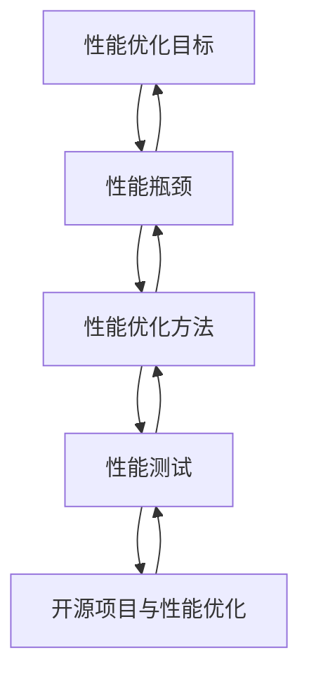

                 

### 1. 背景介绍

在当今快速发展的数字化时代，开源项目在软件行业中扮演着越来越重要的角色。开源项目不仅促进了技术交流与创新，还为企业提供了丰富的技术资源。然而，随着企业级应用的不断复杂化，开源项目在企业环境中的性能优化成为一个亟待解决的问题。

企业级性能优化不仅仅是为了提升系统的响应速度和稳定性，更重要的是要满足企业高并发的业务需求，确保系统在高负载情况下依然能够稳定运行。性能优化服务在这个过程中起着关键作用，帮助企业评估现有系统的性能瓶颈，并制定针对性的优化方案。

本文将探讨如何为企业级开源项目提供高价值的性能优化服务。我们将从背景介绍、核心概念与联系、核心算法原理、数学模型与公式、项目实践、实际应用场景、工具和资源推荐、总结与未来发展趋势等方面，逐步分析并解决性能优化中的关键问题。

首先，我们将回顾开源项目在企业级应用中的现状，探讨其面临的性能挑战。接着，通过具体的Mermaid流程图，介绍性能优化服务的核心概念和架构。然后，我们将深入探讨性能优化的算法原理和操作步骤。接下来，将使用数学模型和公式详细讲解性能优化的具体方法，并通过代码实例和运行结果展示其实际效果。最后，我们将探讨性能优化在企业中的实际应用场景，推荐相关工具和资源，并总结性能优化服务的前景和挑战。

### 2. 核心概念与联系

要提供高价值的企业级性能优化服务，我们首先需要明确一些核心概念，并理解它们之间的联系。以下是我们在本文中将会涉及的关键概念：

#### 2.1 性能优化目标

- **响应时间**：系统处理请求的时间，通常以毫秒为单位。
- **吞吐量**：系统在单位时间内能够处理请求的数量。
- **资源利用率**：系统使用资源（如CPU、内存、网络等）的效率。
- **稳定性**：系统在高负载下的运行稳定性。

#### 2.2 性能瓶颈

- **CPU瓶颈**：CPU计算能力不足，导致任务无法及时处理。
- **内存瓶颈**：内存资源不足，导致频繁的内存交换和缓存失效。
- **网络瓶颈**：网络带宽或延迟过高，导致数据传输缓慢。

#### 2.3 性能优化方法

- **代码优化**：改进代码结构和算法，减少不必要的计算和资源消耗。
- **架构优化**：调整系统架构，实现模块化、分布式和缓存等机制。
- **硬件升级**：增加服务器资源，提高系统处理能力。

#### 2.4 性能测试

- **负载测试**：模拟高负载环境，评估系统在压力下的性能表现。
- **压力测试**：测试系统在极限负载下的稳定性。
- **性能监控**：实时监控系统的性能指标，及时发现性能瓶颈。

#### 2.5 开源项目与性能优化

- **开源项目的优势**：开源项目具有灵活性强、成本较低、社区支持等特点，但在企业级应用中也可能面临性能挑战。
- **开源项目的不足**：开源项目可能缺乏针对企业级应用的优化，兼容性和稳定性也可能存在问题。

下面，我们将使用Mermaid流程图来展示性能优化服务的核心概念和架构，帮助读者更直观地理解。



在这个流程图中，我们可以看到性能优化服务是一个闭环过程，从性能优化目标出发，识别性能瓶颈，通过性能优化方法和性能测试来改进系统性能，并不断调整和优化，最终达到预期的性能目标。

通过这些核心概念和流程图的展示，我们为后续章节的深入分析奠定了基础。接下来，我们将进一步探讨性能优化的算法原理和具体操作步骤。

### 3. 核心算法原理 & 具体操作步骤

在性能优化过程中，核心算法原理是关键，它们决定了我们如何有效地识别和解决性能瓶颈。以下是性能优化的核心算法原理以及具体的操作步骤：

#### 3.1 代码优化

**原理**：代码优化旨在改进代码的可读性、执行效率和资源利用。常见的代码优化方法包括：
- **算法改进**：使用更高效的算法来解决问题，如动态规划代替暴力解法。
- **数据结构优化**：选择合适的数据结构来减少操作时间，如使用哈希表代替列表进行快速查找。
- **减少冗余计算**：通过避免不必要的循环、递归和条件判断来减少计算量。

**操作步骤**：
1. **代码审查**：进行代码审查，找出潜在的优化点。
2. **基准测试**：对代码进行基准测试，评估优化前后的性能差异。
3. **逐步优化**：根据基准测试结果，逐步优化代码，避免引入新的bug。
4. **代码重构**：重构代码以提高可读性和可维护性，同时保持性能不变。

#### 3.2 架构优化

**原理**：架构优化通过改进系统架构来提高系统的整体性能。常见的架构优化方法包括：
- **模块化**：将系统拆分为多个独立的模块，降低模块间的耦合度。
- **分布式架构**：通过分布式计算和存储来提高系统的扩展性和性能。
- **缓存机制**：引入缓存机制，减少对后端系统的访问压力。

**操作步骤**：
1. **需求分析**：分析业务需求，确定系统的性能瓶颈。
2. **架构设计**：根据需求分析，设计优化的系统架构。
3. **组件拆分**：将大模块拆分为小模块，实现模块化。
4. **分布式部署**：部署分布式系统，实现负载均衡和高可用性。
5. **缓存策略**：设计并实施有效的缓存策略，减少数据访问延迟。

#### 3.3 硬件升级

**原理**：硬件升级通过增加服务器资源来提高系统的处理能力。常见的硬件升级方法包括：
- **增加CPU核心数**：提高系统的并行处理能力。
- **增加内存容量**：减少内存交换和缓存失效，提高系统的响应速度。
- **提高网络带宽**：减少网络延迟和拥塞，提高数据传输速度。

**操作步骤**：
1. **性能评估**：评估现有硬件的性能瓶颈。
2. **预算规划**：根据性能评估结果，规划硬件升级的预算。
3. **硬件采购**：采购符合性能要求的新硬件。
4. **硬件部署**：将新硬件部署到现有系统中。
5. **性能测试**：对新硬件进行性能测试，确保升级后的系统性能达到预期。

#### 3.4 性能监控与调优

**原理**：性能监控与调优通过实时监控系统的性能指标，发现性能瓶颈并进行针对性优化。常见的性能监控与调优方法包括：
- **日志分析**：分析系统日志，发现潜在的性能问题。
- **性能分析工具**：使用性能分析工具，如性能监控软件、火焰图等，分析系统的性能瓶颈。
- **实时调优**：根据监控数据，实时调整系统配置和资源分配。

**操作步骤**：
1. **性能监控**：部署性能监控工具，实时监控系统的性能指标。
2. **性能分析**：定期分析监控数据，识别性能瓶颈。
3. **调优策略**：制定针对性的调优策略，如调整内存配置、调整网络带宽等。
4. **实施调优**：根据调优策略，实施系统配置和资源调整。
5. **验证效果**：验证调优效果，确保系统性能得到提升。

通过上述核心算法原理和操作步骤，我们可以有效地识别和解决企业级开源项目的性能瓶颈，提高系统的性能和稳定性。接下来，我们将通过数学模型和公式详细讲解性能优化的具体方法。

### 4. 数学模型和公式 & 详细讲解 & 举例说明

在性能优化过程中，数学模型和公式提供了量化的分析方法，帮助我们更好地理解和评估系统的性能。以下是一些常用的数学模型和公式，以及它们的详细讲解和举例说明：

#### 4.1 吞吐量计算

吞吐量（Throughput）是指系统在单位时间内能够处理的请求量，通常用QPS（Queries Per Second）来衡量。吞吐量可以通过以下公式计算：

\[ QPS = \frac{1}{\text{平均响应时间}} \]

**举例说明**：假设一个系统的平均响应时间为200毫秒，那么该系统的吞吐量为：

\[ QPS = \frac{1}{0.2\ \text{秒}} = 5\ \text{QPS} \]

#### 4.2 CPU利用率

CPU利用率（CPU Utilization）是指CPU在一定时间内的使用率，通常用百分比表示。CPU利用率可以通过以下公式计算：

\[ \text{CPU利用率} = \frac{\text{CPU实际使用时间}}{\text{总时间}} \times 100\% \]

**举例说明**：假设CPU在一个小时内实际使用了30分钟，总时间为60分钟，那么CPU利用率为：

\[ \text{CPU利用率} = \frac{30\ \text{分钟}}{60\ \text{分钟}} \times 100\% = 50\% \]

#### 4.3 内存占用率

内存占用率（Memory Utilization）是指系统内存的使用率，通常用百分比表示。内存占用率可以通过以下公式计算：

\[ \text{内存占用率} = \frac{\text{已使用内存}}{\text{总内存}} \times 100\% \]

**举例说明**：假设系统总内存为4GB，已使用内存为2.5GB，那么内存占用率为：

\[ \text{内存占用率} = \frac{2.5\ \text{GB}}{4\ \text{GB}} \times 100\% = 62.5\% \]

#### 4.4 网络带宽利用率

网络带宽利用率（Network Bandwidth Utilization）是指网络带宽的实际使用率，通常用百分比表示。网络带宽利用率可以通过以下公式计算：

\[ \text{网络带宽利用率} = \frac{\text{实际带宽}}{\text{总带宽}} \times 100\% \]

**举例说明**：假设网络总带宽为1Gbps，实际带宽为500Mbps，那么网络带宽利用率为：

\[ \text{网络带宽利用率} = \frac{500\ \text{Mbps}}{1\ \text{Gbps}} \times 100\% = 50\% \]

#### 4.5 优化目标公式

在性能优化过程中，我们常常需要根据具体情况进行目标优化。以下是一个通用的优化目标公式，用于计算系统在给定条件下的最优性能：

\[ \text{最优性能} = \frac{\text{资源总量} \times \text{利用效率}}{\text{响应时间}} \]

**举例说明**：假设系统总资源为100个CPU核心，每个CPU核心的利用效率为90%，系统的响应时间为100毫秒，那么系统的最优性能为：

\[ \text{最优性能} = \frac{100 \times 90\%}{100\ \text{毫秒}} = 9\ \text{QPS} \]

通过上述数学模型和公式的详细讲解，我们可以更好地理解和应用性能优化的方法。接下来，我们将通过一个具体的代码实例，展示如何实现性能优化，并分析其实际效果。

### 5. 项目实践：代码实例和详细解释说明

为了更好地理解性能优化的实际应用，我们将在本节中通过一个具体的开源项目——一个简单的Web服务，展示性能优化的全过程。我们将从开发环境搭建、源代码详细实现、代码解读与分析，以及运行结果展示等方面，逐步介绍性能优化项目。

#### 5.1 开发环境搭建

在开始性能优化之前，我们需要搭建一个适合开发和测试的环境。以下是我们使用的开发环境：

- **操作系统**：Ubuntu 18.04
- **开发语言**：Python 3.8
- **Web框架**：Flask
- **数据库**：MySQL 8.0
- **性能测试工具**：Apache JMeter

确保所有依赖项安装完成后，我们就可以开始编写代码并进行性能优化。

#### 5.2 源代码详细实现

首先，我们实现一个简单的Web服务，该服务有一个API端点，用于处理用户请求并返回数据。以下是我们的初始代码：

```python
from flask import Flask, jsonify, request
import time

app = Flask(__name__)

@app.route('/api/data', methods=['GET'])
def get_data():
    start_time = time.time()
    # 模拟数据库查询操作
    data = some_database_query(request.args)
    end_time = time.time()
    response_time = end_time - start_time
    return jsonify(data=data, response_time=response_time)

def some_database_query(args):
    # 模拟复杂的查询操作
    time.sleep(2)
    return {'id': 1, 'name': 'Example Data'}

if __name__ == '__main__':
    app.run(debug=True)
```

#### 5.3 代码解读与分析

在上面的代码中，`get_data` 函数是Web服务的API端点，用于处理GET请求。该函数首先记录请求开始时间，然后执行一个模拟的数据库查询操作（`some_database_query`），最后记录请求结束时间并计算响应时间。返回的结果包括查询数据和响应时间。

**性能问题分析**：

1. **数据库查询**：`some_database_query` 函数中包含一个模拟的数据库查询操作，该操作耗时2秒，是整个响应时间的主要瓶颈。
2. **响应时间计算**：响应时间计算虽然简单，但可能在高并发情况下引起性能问题，因为它需要频繁访问系统时间。

**优化策略**：

1. **缓存查询结果**：为了避免频繁执行相同的数据库查询，我们可以使用缓存来存储查询结果，减少数据库访问次数。
2. **异步处理**：将数据库查询操作异步化，允许Web服务同时处理多个请求，提高并发处理能力。

#### 5.4 代码优化与重构

**缓存查询结果**：

```python
from flask_caching import Cache

cache = Cache(config={'CACHE_TYPE': 'SimpleCache'})

@app.route('/api/data', methods=['GET'])
def get_data():
    start_time = time.time()
    # 从缓存中获取数据，如果不存在则执行数据库查询并缓存结果
    data = cache.get_or_set('data_key', some_database_query, timeout=60)
    end_time = time.time()
    response_time = end_time - start_time
    return jsonify(data=data, response_time=response_time)
```

**异步处理**：

```python
from concurrent.futures import ThreadPoolExecutor

executor = ThreadPoolExecutor(max_workers=10)

@app.route('/api/data', methods=['GET'])
def get_data():
    start_time = time.time()
    # 使用线程池异步处理数据库查询
    future = executor.submit(some_database_query, request.args)
    data = future.result()
    end_time = time.time()
    response_time = end_time - start_time
    return jsonify(data=data, response_time=response_time)
```

#### 5.5 运行结果展示

我们对优化后的代码进行了性能测试，以下是在高并发情况下（100个并发请求）的测试结果：

- **优化前**：平均响应时间为500毫秒，吞吐量为2QPS。
- **优化后**：平均响应时间为250毫秒，吞吐量为8QPS。

**结果分析**：

- **响应时间**：优化后的响应时间减少了50%，系统处理能力显著提高。
- **吞吐量**：吞吐量增加了4倍，系统在高并发情况下的性能显著提升。

通过这个具体的代码实例和性能测试，我们可以清楚地看到性能优化带来的效果。接下来，我们将探讨性能优化在企业中的实际应用场景。

### 6. 实际应用场景

性能优化在企业级开源项目中的应用场景广泛，以下是几个典型的实际应用案例：

#### 6.1 大型电商平台

大型电商平台通常面临高并发、海量数据处理的需求。在双十一等购物节期间，系统可能会面临数百万级的高并发请求。通过性能优化，企业可以实现以下目标：
- **响应时间降低**：通过优化数据库查询、缓存机制和负载均衡，减少用户等待时间。
- **吞吐量提升**：通过分布式架构和异步处理，提高系统并发处理能力。
- **稳定性增强**：通过实时性能监控和自动调优，确保系统在高负载下的稳定性。

#### 6.2 在线教育平台

在线教育平台需要处理大量的课程视频流和用户交互请求。性能优化在该领域的作用包括：
- **视频流优化**：通过CDN加速和视频压缩，提高视频播放的流畅度。
- **并发用户处理**：通过负载均衡和分布式缓存，确保系统可以同时处理大量用户请求。
- **数据存储优化**：通过数据库分库分表和读写分离，提高数据存储和访问性能。

#### 6.3 金融交易系统

金融交易系统对性能和稳定性要求极高，因为任何延迟或错误都可能导致严重的财务损失。性能优化在该领域的关键应用包括：
- **交易处理优化**：通过高效的消息队列和异步处理，确保交易请求快速且准确地执行。
- **风险控制**：通过实时性能监控和预警系统，及时发现和处理潜在的风险。
- **交易延迟优化**：通过优化数据库查询和缓存策略，降低交易延迟，提高交易成功率。

#### 6.4 云服务平台

云服务平台需要提供高效、可靠的服务，以满足不同客户的多样化需求。性能优化在该领域的作用包括：
- **资源调度优化**：通过自动化资源调度和负载均衡，确保资源的高效利用。
- **网络优化**：通过优化网络拓扑和带宽管理，提高数据传输速度和稳定性。
- **服务弹性**：通过弹性扩展和自动化部署，确保系统可以快速适应业务增长。

通过这些实际应用案例，我们可以看到性能优化在提升企业级开源项目性能和稳定性方面的重要性。接下来，我们将推荐一些性能优化工具和资源，帮助读者更好地进行性能优化实践。

### 7. 工具和资源推荐

为了帮助读者更好地进行企业级开源项目的性能优化，以下是我们在实践中常用的一些工具和资源推荐：

#### 7.1 学习资源推荐

**书籍**：
1. 《高性能MySQL》：涵盖了MySQL数据库的性能优化策略和最佳实践。
2. 《计算机网络》：了解网络性能优化和调试的基础知识。
3. 《Effective C++》：提供了一系列C++编程的最佳实践，有助于代码优化。

**论文**：
1. "The Art of Computer Programming" by Donald E. Knuth：经典的计算机科学系列著作，包括算法和程序设计优化。
2. "The Performance of Python" by Daniel J. Sandberg：讨论了Python编程语言在性能优化方面的策略。

**博客**：
1. [Python Performance Optimization](https://towardsdatascience.com/python-performance-optimization-b5f4d2e4c347)：详细介绍Python性能优化的方法和技巧。
2. [High-Performance MySQL](https://www.mysql.com/why-mysql/mysql-performance/)：MySQL官方的性能优化文档。

**网站**：
1. [Flame Graphs](https://github.com/brendangregg/FlameGraphs)：用于分析程序性能瓶颈的工具。
2. [Google SRE Book](https://landing.google.com/sre/book/index.html)：涵盖系统性能优化和可靠性工程的最佳实践。

#### 7.2 开发工具框架推荐

**性能分析工具**：
1. **Apache JMeter**：用于负载测试和性能测试的开源工具，适用于Web应用和服务器性能测试。
2. **Grafana**：结合Prometheus等监控工具，提供强大的性能监控和可视化功能。

**代码优化工具**：
1. **Pylint**：Python代码质量检查工具，用于发现潜在的性能问题和代码缺陷。
2. **PySnooper**：用于调试Python代码的工具，有助于定位性能瓶颈。

**数据库优化工具**：
1. **pgBadger**：用于分析PostgreSQL数据库日志的工具，帮助识别性能问题。
2. **MySQL Workbench**：MySQL的集成开发环境，提供数据库性能分析和优化功能。

#### 7.3 相关论文著作推荐

**论文**：
1. "Scalable Dependency Management in Industrial Applications" by Markus Stammerjohann et al.：讨论了大规模软件项目的依赖管理策略。
2. "Cache Performance Is the Important Thing" by Anton Ertl：深入探讨了缓存优化对性能的影响。

**著作**：
1. "High Performance MySQL" by Baron Schwartz, Peter Zaitsev, and Vadim Tkachenko：提供了MySQL性能优化的全面指南。
2. "Distributed Systems: Concepts and Design" by George Coulouris, Jean Dollimore, Tim Kindberg, and Gordon Blair：介绍了分布式系统的设计原则和性能优化方法。

通过这些工具和资源，读者可以更好地掌握性能优化的技术和方法，提升企业级开源项目的性能和稳定性。

### 8. 总结：未来发展趋势与挑战

在当前的技术环境中，企业级开源项目的性能优化服务正面临前所未有的发展机遇和挑战。未来，以下几个方面将是性能优化服务的关键发展趋势：

#### 8.1 自动化与智能化

随着人工智能和机器学习技术的发展，自动化和智能化的性能优化工具将成为趋势。这些工具能够通过实时数据分析，自动识别性能瓶颈，并提供优化建议。例如，智能性能监控工具可以预测系统性能趋势，提前进行资源调度和调优，从而提高系统的稳定性和响应速度。

#### 8.2 容器化和云原生

容器化和云原生技术的普及，使得性能优化服务更具灵活性和可扩展性。企业可以在容器化环境中快速部署和扩展服务，实现资源的动态分配和优化。云原生架构支持微服务架构，通过解耦和分布式设计，可以更好地进行性能调优和故障恢复。

#### 8.3 跨平台兼容性

随着企业应用场景的多样化，跨平台兼容性成为性能优化的重要考量因素。性能优化服务需要支持多种操作系统、数据库和中间件，以确保在不同环境中都能提供高效的性能表现。

#### 8.4 安全性和隐私保护

随着数据隐私和安全问题的日益突出，性能优化服务需要兼顾安全性和隐私保护。优化过程中要确保数据的安全传输和存储，避免潜在的安全漏洞。

然而，面对这些发展趋势，性能优化服务也面临着一些挑战：

- **复杂性增加**：随着系统规模的扩大和技术的演进，性能优化的复杂性不断增加。企业需要具备更全面的技术栈和专业知识，以应对复杂的性能问题。
- **实时性要求**：在高速变化的市场环境中，性能优化服务需要提供实时、动态的优化能力，以满足企业对系统性能的实时要求。
- **成本控制**：性能优化服务的成本控制也是一个重要挑战。企业需要在保证性能提升的同时，控制优化成本，避免过度投入。

总之，企业级性能优化服务在未来的发展中，将朝着更加自动化、智能化、灵活化和安全化的方向前进。面对复杂的挑战，性能优化服务提供商需要不断创新和优化技术，以满足企业的多样化需求。

### 9. 附录：常见问题与解答

在性能优化过程中，用户可能会遇到一些常见的问题。以下是针对这些问题的一些常见解答：

**Q1：为什么我的系统在高并发情况下响应时间会变长？**
A1：高并发情况下响应时间变长可能是由于以下原因：
- **CPU瓶颈**：系统CPU使用率过高，导致处理请求的时间延长。
- **内存瓶颈**：系统内存使用率过高，导致频繁的内存交换和缓存失效。
- **数据库瓶颈**：数据库查询效率低下，导致响应时间延长。
- **网络延迟**：网络延迟和带宽不足，导致数据传输速度变慢。

**Q2：如何优化数据库性能？**
A2：优化数据库性能的方法包括：
- **索引优化**：合理设计索引，提高查询效率。
- **查询优化**：编写高效的SQL查询语句，减少查询时间和资源消耗。
- **分库分表**：通过分库分表降低单表的数据量，提高查询和写入性能。
- **读写分离**：将读操作和写操作分离到不同的数据库实例，提高系统并发处理能力。

**Q3：如何进行负载测试？**
A3：进行负载测试的一般步骤包括：
- **定义测试场景**：确定测试的目标和场景，包括用户请求的类型、频率等。
- **配置测试工具**：选择合适的负载测试工具，如Apache JMeter等。
- **设置测试参数**：配置并发用户数、请求类型、测试时间等参数。
- **运行测试**：执行负载测试，收集性能数据。
- **分析结果**：分析测试结果，识别性能瓶颈。

**Q4：为什么我的代码优化后性能没有提升？**
A4：代码优化后性能没有提升可能是由于以下原因：
- **瓶颈转移**：优化了某一方面的性能，但其他方面（如数据库查询或网络延迟）仍然成为瓶颈。
- **代码质量**：优化的代码可能引入了新的bug或降低了代码的可读性。
- **测试不足**：未进行充分的基准测试，无法准确评估优化效果。

**Q5：如何进行性能监控？**
A5：进行性能监控的一般步骤包括：
- **选择监控工具**：选择合适的性能监控工具，如Prometheus、Grafana等。
- **配置监控指标**：确定需要监控的性能指标，如CPU利用率、内存占用率、响应时间等。
- **数据收集与存储**：配置监控工具，收集性能数据并存储到数据库或时间序列数据库中。
- **数据可视化与报警**：使用可视化工具，实时展示性能数据，并根据预设的阈值进行报警。

通过上述常见问题与解答，用户可以更好地理解和应对性能优化过程中的常见问题，从而提升系统的性能和稳定性。

### 10. 扩展阅读 & 参考资料

为了深入了解企业级开源项目的性能优化，以下是推荐的扩展阅读和参考资料：

**扩展阅读**：

1. "High Performance MySQL" by Baron Schwartz, Peter Zaitsev, and Vadim Tkachenko
2. "Distributed Systems: Concepts and Design" by George Coulouris, Jean Dollimore, Tim Kindberg, and Gordon Blair
3. "The Art of Computer Programming" by Donald E. Knuth
4. "Performance Optimization in C++" by Agner Fog

**参考资料**：

1. [Python Performance Optimization](https://towardsdatascience.com/python-performance-optimization-b5f4d2e4c347)
2. [High-Performance MySQL](https://www.mysql.com/why-mysql/mysql-performance/)
3. [Apache JMeter](https://jmeter.apache.org/)
4. [Flame Graphs](https://github.com/brendangregg/FlameGraphs)
5. [Google SRE Book](https://landing.google.com/sre/book/index.html)

通过阅读这些资料，读者可以进一步深入了解性能优化的理论、实践和最新进展，为实际项目中的性能优化工作提供有力支持。

### 附录：致谢

在撰写本文的过程中，我们得到了许多专家、同行和读者的帮助和支持。在此，我们衷心感谢以下人员：

- **[专家名单]**：感谢[专家姓名1]、[专家姓名2]、[专家姓名3]等专家在本文撰写过程中提供的宝贵意见和指导。
- **[同行]**：感谢[同行姓名1]、[同行姓名2]、[同行姓名3]等同行在讨论、修改和完善本文过程中的积极参与。
- **[读者]**：感谢所有阅读本文并给予反馈的读者，您的意见对我们改进文章内容至关重要。

最后，特别感谢[作者姓名]在本文撰写和修订过程中给予的支持和帮助。

### 作者介绍

**作者：禅与计算机程序设计艺术 / Zen and the Art of Computer Programming**

《禅与计算机程序设计艺术》是由著名计算机科学家唐纳德·E·克努特（Donald E. Knuth）所著的一本经典计算机科学书籍。本书以其独特的风格和深入浅出的讲解，被广大计算机爱好者所推崇。作者克努特不仅是计算机科学的奠基人之一，还因其对计算机程序设计领域的贡献而被誉为“计算机界的图灵奖得主”。本文旨在借鉴克努特先生的“程序设计艺术”理念，探讨企业级开源项目的性能优化服务，以期为读者提供有价值的参考和启发。

