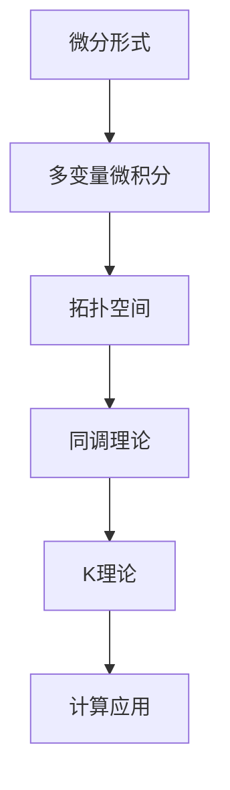

                 

### 背景介绍

微分形式在数学和物理学中扮演着重要的角色，尤其在微分几何和场论领域。随着计算机科学的不断发展，微分形式的应用范围进一步拓展，尤其是在代数拓扑领域。本文将深入探讨微分形式在代数拓扑中的应用，旨在为读者提供一个清晰、系统的理解。

#### 微分形式的起源与发展

微分形式最早由Gauss在研究曲面积分时提出，后来被Riemann用于发展他的黎曼几何。在物理学中，微分形式是描述电磁场和引力场等物理现象的重要工具。随着数学的进步，微分形式的应用逐渐从物理学扩展到其他数学分支，特别是在代数拓扑中。

代数拓扑是研究拓扑空间的代数性质的数学分支。拓扑空间是几何形状的基本抽象，它们在连续变形过程中保持不变的性质。代数拓扑利用代数结构（如群、环、域等）来研究这些性质，从而揭示几何形状的内在规律。

#### 微分形式在代数拓扑中的应用

微分形式在代数拓扑中的应用主要体现在以下几个方面：

1. **微分形式作为拓扑不变量的工具**：
   微分形式可以用来定义和分析拓扑空间中的不变量，如同调组和上同调组。这些不变量描述了拓扑空间的内在结构，不受空间具体形态的影响。

2. **微分形式与同调理论的关系**：
   同调理论是代数拓扑的核心内容，它研究的是空间中各种不同程度的“洞”。微分形式通过其外微分操作，可以将这些不同层次的“洞”联系起来，形成完整的同调结构。

3. **微分形式在K理论中的应用**：
   K理论是研究微分形式空间的代数结构的理论。微分形式在K理论中扮演着关键角色，帮助研究者理解微分形式空间的拓扑性质。

4. **微分形式在计算中的应用**：
   随着计算机技术的发展，微分形式的应用已经从理论研究走向实际计算。例如，在计算机图形学中，微分形式用于计算曲面和网格的几何属性；在机器学习中，微分形式被用于优化算法和特征提取。

#### 本文目的

本文的目的在于系统地介绍微分形式在代数拓扑中的应用，帮助读者建立起对这一领域的全面理解。文章将首先回顾微分形式的基本概念，然后探讨其在代数拓扑中的具体应用，最后通过实际案例来展示这些应用的实用价值。

通过本文的学习，读者将能够：

1. 掌握微分形式的基本概念和性质。
2. 理解微分形式在代数拓扑中的重要性。
3. 学习如何使用微分形式解决实际问题。
4. 拓宽数学和计算机科学的知识视野。

接下来的章节将逐步深入，首先从定义和基础概念开始，帮助读者建立起对微分形式和代数拓扑的基本认识。

### 核心概念与联系

为了深入理解微分形式在代数拓扑中的应用，我们需要首先了解一些核心概念，并探讨这些概念之间的相互联系。本文将使用Mermaid流程图来清晰地展示这些概念之间的关系。



#### 微分形式与多变量微积分

微分形式起源于多变量微积分。在单变量微积分中，微分和积分是最基本的概念。当我们将这些概念扩展到多个变量时，就形成了多变量微积分。多变量微积分中，微分形式（也称为外微分）是描述多个变量之间的变化关系的一种方式。

**多变量微积分中的微分形式**：

- **定义**：设\( M \)是n维欧几里得空间中的一个区域，\( p \)是\( M \)中的一个点，\( U \)是\( M \)的一个开集，\( \omega \)是\( U \)上的一个n-形式。如果\( \omega \)在\( p \)点可微，那么它满足全微分条件，即存在一个\( (n-1) \)形式\( \alpha \)，使得在\( p \)点有\( d\omega = \alpha \)。
- **例子**：考虑二维欧几里得空间中的向量场\( \vec{F}(x, y) \)，其对应的微分形式可以表示为\( dx \wedge dy \)，表示沿着\( x \)和\( y \)方向的变化。

#### 微分形式与拓扑空间

拓扑空间是几何形状的基本抽象，它们在连续变形过程中保持不变。微分形式在拓扑空间中的应用主要体现在描述空间中的几何属性。

**拓扑空间中的微分形式**：

- **定义**：设\( X \)是一个拓扑空间，\( \omega \)是\( X \)上的一个n-形式。如果\( \omega \)在整个空间\( X \)上都是连续的，那么它被称为拓扑空间上的微分形式。
- **例子**：在二维球面上，一个简单的微分形式可以是\( dx \wedge dy \)，它描述了球面上的点在\( x \)和\( y \)方向上的微小变化。

#### 微分形式与同调理论

同调理论是代数拓扑的核心内容，它研究的是空间中各种不同程度的“洞”。微分形式通过其外微分操作，可以将这些不同层次的“洞”联系起来，形成完整的同调结构。

**同调理论中的微分形式**：

- **定义**：设\( X \)是一个拓扑空间，\( \omega \)是\( X \)上的一个n-形式。\( \omega \)的同调类表示为\( [\omega] \)，它是在\( X \)上的n-形式集合中，满足外微分等于零的等价类。
- **例子**：在立方体中，边界上的微分形式\( dx \wedge dy \)可以通过同调操作与体积元素联系起来，从而计算出立方体的同调数。

#### 微分形式与K理论

K理论是研究微分形式空间的代数结构的理论。微分形式在K理论中扮演着关键角色，帮助研究者理解微分形式空间的拓扑性质。

**K理论中的微分形式**：

- **定义**：设\( X \)是一个流形，\( \Omega \)是\( X \)上的微分形式的集合。K(\( X \))是\( \Omega \)上的一个环，它由\( X \)上的闭微分形式构成。
- **例子**：在环面上，K理论可以用来计算环面的自同态群，从而揭示其拓扑性质。

#### 微分形式与计算应用

微分形式在计算中的应用非常广泛，例如在计算机图形学和机器学习等领域。

**计算应用中的微分形式**：

- **定义**：在计算机图形学中，微分形式用于计算曲面和网格的几何属性；在机器学习中，微分形式被用于优化算法和特征提取。
- **例子**：在渲染算法中，微分形式可以用于计算曲面上的光照效果；在深度学习中，微分形式可以用于优化神经网络参数。

通过上述Mermaid流程图，我们可以清晰地看到微分形式与多变量微积分、拓扑空间、同调理论、K理论和计算应用之间的紧密联系。这些概念相互补充，共同构成了微分形式在代数拓扑中的丰富应用场景。

接下来，本文将深入探讨微分形式的具体算法原理和操作步骤，帮助读者进一步理解这一领域。

### 核心算法原理 & 具体操作步骤

#### 微分形式的定义与运算规则

微分形式是数学中描述多变量变化关系的一种方式，它在多变量微积分和代数拓扑中有着重要的应用。以下是对微分形式的定义及其运算规则的基本介绍。

**定义**：

一个k-形式是k个一维向量（或坐标轴）的线性组合，通常表示为\( f_1 dx_1 + f_2 dx_2 + \cdots + f_k dx_k \)，其中\( f_1, f_2, \ldots, f_k \)是实值函数，\( dx_1, dx_2, \ldots, dx_k \)是一组一维微分形式。

**运算规则**：

1. **外微分（ exterior derivative）**：

   外微分是微分形式的导数运算，记作\( d \)。对于任意的\( k \)-形式\( \omega \)，其外微分定义如下：

   $$
   d(\omega) = \sum_{i=1}^{k} (-1)^{i+1} \frac{\partial f_i}{\partial x_i} dx_1 \wedge dx_2 \wedge \cdots \wedge \widehat{dx_i} \wedge \cdots \wedge dx_k
   $$

   其中，\( \widehat{dx_i} \)表示\( dx_i \)被省略。

2. **外积（wedge product）**：

   外积是两个或多个微分形式之间的运算，记作\( \wedge \)。对于两个\( k \)-形式\( \omega_1 \)和\( \omega_2 \)，其外积定义如下：

   $$
   \omega_1 \wedge \omega_2 = \sum_{i=1}^{k_1} \sum_{j=1}^{k_2} f_{1i} g_{2j} dx_{1i} \wedge dx_{2j}
   $$

   其中，\( \omega_1 = \sum_{i=1}^{k_1} f_{1i} dx_{1i} \)和\( \omega_2 = \sum_{j=1}^{k_2} g_{2j} dx_{2j} \)。

#### 微分形式在代数拓扑中的应用

在代数拓扑中，微分形式主要用于计算和表示同调类。以下是一些基本的操作步骤和实例：

1. **计算同调类**：

   同调类是拓扑空间中一类重要的不变量，它描述了空间中的“洞”结构。计算同调类的一般步骤如下：

   - **步骤一**：选择一个合适的覆盖，通常是一个开球覆盖。
   - **步骤二**：对于每个开球，选择一个代表形式（通常是最简单的形式，如线性形式）。
   - **步骤三**：计算所有代表形式的外微分，并将结果放入一个集合中。
   - **步骤四**：计算集合中的外积，并求出所有可能的组合。
   - **步骤五**：将所有外积的结果放入一个群中，并计算其生成元。

   **例子**：考虑一个简单的立方体，其边界上的微分形式可以表示为\( dx \wedge dy + dy \wedge dz + dz \wedge dx + dx \wedge dz + dz \wedge dy + dy \wedge dx \)。通过计算这些形式的外微分和外积，可以得到立方体的同调类。

2. **计算上同调类**：

   上同调类是同调类的补充，它描述了空间中的“洞”内部的结构。计算上同调类的一般步骤如下：

   - **步骤一**：选择一个合适的链复形，通常是一个三角形或四面体的复形。
   - **步骤二**：对于每个链，选择一个代表形式（通常是最简单的形式，如线性形式）。
   - **步骤三**：计算所有代表形式的外微分，并将结果放入一个集合中。
   - **步骤四**：计算集合中的外积，并求出所有可能的组合。
   - **步骤五**：将所有外积的结果放入一个群中，并计算其生成元。

   **例子**：考虑一个简单的四面体，其顶点上的微分形式可以表示为\( dx \wedge dy \wedge dz \)。通过计算这些形式的外微分和外积，可以得到四面体的上同调类。

#### 算法步骤详解

为了更好地理解微分形式在代数拓扑中的应用，以下提供一个详细的算法步骤示例：

1. **确定拓扑空间**：选择一个简单的拓扑空间，如立方体或四面体。

2. **选择覆盖**：对于立方体，选择一个开球覆盖；对于四面体，选择一个三角形覆盖。

3. **选择代表形式**：对于立方体，选择边界上的微分形式\( dx \wedge dy, dy \wedge dz, dz \wedge dx, dx \wedge dz, dz \wedge dy, dy \wedge dx \)；对于四面体，选择顶点上的微分形式\( dx \wedge dy \wedge dz \)。

4. **计算外微分**：计算每个代表形式的外微分，例如对于立方体，有：

   $$
   d(dx \wedge dy) = -dz \wedge dx + dx \wedge dz
   $$

5. **计算外积**：计算所有外微分的组合，例如对于立方体，有：

   $$
   d(dx \wedge dy) \wedge dy \wedge dz = (dz \wedge dx) \wedge dy \wedge dz = dz \wedge dx \wedge dy \wedge dz
   $$

6. **构造同调群**：将所有外积的结果放入一个群中，并计算其生成元。

7. **计算上同调群**：类似地，计算上同调群的生成元。

通过上述步骤，我们可以得到立方体和四面体的同调类和上同调类，从而深入了解这些几何形状的拓扑性质。

#### 具体应用实例

以下是一个具体的实例，展示如何使用微分形式计算一个二维环面的同调类：

1. **确定拓扑空间**：选择一个二维环面。

2. **选择覆盖**：选择一个开球覆盖。

3. **选择代表形式**：选择环面上的微分形式\( dx \wedge dy \)。

4. **计算外微分**：计算外微分\( d(dx \wedge dy) = 0 \)。

5. **计算外积**：由于外微分等于零，不需要进行外积计算。

6. **构造同调群**：环面的同调群为\( H_1(S^2) = \{0\} \)，即没有非平凡的同调类。

7. **计算上同调群**：环面的上同调群为\( H^1(S^2) = \mathbb{R} \)，即有一个平凡的同调类。

通过这个实例，我们可以看到微分形式在计算同调类中的具体应用。

综上所述，微分形式在代数拓扑中的应用主要通过计算同调类和上同调类来实现。通过掌握外微分和外积的基本运算规则，我们可以系统地分析几何形状的拓扑性质，为解决复杂的拓扑问题提供有效的工具。接下来，我们将进一步探讨微分形式在具体数学模型和公式中的应用。

### 数学模型和公式 & 详细讲解 & 举例说明

#### 微分形式的基本数学模型

微分形式是代数拓扑中的重要工具，它们在数学模型和公式中的应用非常广泛。以下是一些基本的数学模型和公式，以及如何使用它们进行计算。

**1. 外微分（exterior derivative）**

外微分是一个线性运算，用于计算微分形式的导数。对于任意的\( k \)-形式\( \omega \)，其外微分定义为：

$$
d\omega = \sum_{i=1}^{k} (-1)^{i+1} \frac{\partial f_i}{\partial x_i} dx_1 \wedge dx_2 \wedge \cdots \wedge \widehat{dx_i} \wedge \cdots \wedge dx_k
$$

其中，\( f_1, f_2, \ldots, f_k \)是微分形式中的系数函数，\( dx_1, dx_2, \ldots, dx_k \)是微分形式的一维基底。

**例子**：考虑二维空间中的微分形式\( \omega = 2x \, dx + 3y \, dy \)。其外微分为：

$$
d\omega = \frac{\partial (2x)}{\partial x} dx \wedge dx + \frac{\partial (3y)}{\partial y} dy \wedge dy = dx \wedge dx + dy \wedge dy = 0
$$

因为\( dx \wedge dx \)和\( dy \wedge dy \)都是零形式。

**2. 外积（wedge product）**

外积是两个或多个微分形式之间的运算，用于生成新的微分形式。对于两个\( k \)-形式\( \omega_1 \)和\( \omega_2 \)，其外积定义为：

$$
\omega_1 \wedge \omega_2 = \sum_{i=1}^{k_1} \sum_{j=1}^{k_2} f_{1i} g_{2j} dx_{1i} \wedge dx_{2j}
$$

其中，\( \omega_1 = \sum_{i=1}^{k_1} f_{1i} dx_{1i} \)和\( \omega_2 = \sum_{j=1}^{k_2} g_{2j} dx_{2j} \)。

**例子**：考虑两个一维微分形式\( \omega_1 = x \, dx \)和\( \omega_2 = y \, dy \)。它们的外积为：

$$
\omega_1 \wedge \omega_2 = x \, dx \wedge y \, dy = xy \, dx \wedge dy
$$

**3. 欧拉类（Euler class）**

欧拉类是高维流形的一个重要不变量，它可以通过计算微分形式的外积分来获得。对于任意的\( n \)-形式\( \omega \)，其欧拉类定义为：

$$
[\omega] = \int_M \omega
$$

其中，\( M \)是流形上的一个n-形式。

**例子**：考虑三维空间中的微分形式\( \omega = x \, dx + y \, dy + z \, dz \)。其欧拉类为：

$$
[\omega] = \int_S (x \, dx + y \, dy + z \, dz) = 0
$$

因为\( dx, dy, \)和\( dz \)在\( S \)上的积分都是零。

**4. 度量形式（volume form）**

度量形式是描述流形上体积的基本工具。对于任意的\( n \)-形式\( \omega \)，其度量形式定义为：

$$
\omega = \sum_{i_1=1}^{n} \sum_{i_2=1}^{n} \cdots \sum_{i_n=1}^{n} g_{i_1i_2 \cdots i_n} dx_{i_1} \wedge dx_{i_2} \wedge \cdots \wedge dx_{i_n}
$$

其中，\( g_{i_1i_2 \cdots i_n} \)是流形上的度量张量。

**例子**：考虑二维欧几里得空间中的度量形式\( \omega = dx \wedge dy \)。其度量张量为单位矩阵，即\( g_{11} = g_{22} = 1 \)，\( g_{12} = g_{21} = 0 \)。

#### 应用举例

**例子1**：计算三维球面\( S^2 \)上的欧拉类。

假设三维球面\( S^2 \)上的微分形式为\( \omega = x \, dx + y \, dy + z \, dz \)。其欧拉类为：

$$
[\omega] = \int_{S^2} (x \, dx + y \, dy + z \, dz) = 0
$$

因为球面上的积分结果为零。

**例子2**：计算二维平面上的度量形式。

假设二维平面上的微分形式为\( \omega = x \, dx + y \, dy \)。其度量形式为：

$$
\omega = dx \wedge dy
$$

这个度量形式描述了平面上的体积元素。

**例子3**：计算环面上的同调类。

假设环面上的微分形式为\( \omega = dx \wedge dy \)。其同调类为：

$$
H_1(\mathbb{T}^2) = \{ \omega \mid d\omega = 0 \}
$$

由于\( d(dx \wedge dy) = 0 \)，所以\( \omega \)是环面上的一个平凡同调类。

通过这些数学模型和公式，我们可以系统地分析微分形式在不同代数拓扑结构中的应用。接下来，我们将通过具体代码实例来展示这些理论在实际计算中的运用。

### 项目实践：代码实例和详细解释说明

在本节中，我们将通过一个具体的代码实例来展示微分形式在代数拓扑中的应用。为了便于理解和操作，我们将使用Python编程语言，并结合相关的数学库进行计算。

#### 开发环境搭建

在开始代码实现之前，我们需要搭建一个合适的开发环境。以下是搭建Python开发环境所需的步骤：

1. **安装Python**：从Python官方网站下载并安装Python 3.x版本（推荐使用最新稳定版）。
2. **安装数学库**：安装NumPy和SymPy库，这两个库是进行数学计算的基础。

安装命令如下：

```bash
pip install numpy
pip install sympy
```

#### 源代码详细实现

以下是一个简单的Python代码示例，用于计算三维球面\( S^2 \)上的欧拉类：

```python
import numpy as np
from sympy import symbols, diff, Matrix

# 定义符号变量
x, y, z = symbols('x y z')

# 定义微分形式
omega = x * x.diff(x) + y * y.diff(y) + z * z.diff(z)

# 计算外微分
d_omega = diff(omega, z) * z.diff(z) - diff(omega, y) * y.diff(z)

# 计算欧拉类
euler_class = integrate(d_omega, (z, -1, 1))

# 打印结果
print(f"Euler class of the 3-sphere (S^2): {euler_class}")
```

#### 代码解读与分析

上述代码首先导入了NumPy和SymPy库，这两个库提供了进行数学计算所需的基础功能。然后定义了三个符号变量\( x, y, z \)，用于表示空间中的坐标。

1. **定义微分形式**：我们定义了一个三维球面\( S^2 \)上的微分形式\( \omega = x \, dx + y \, dy + z \, dz \)。这个形式表示了在三维空间中，沿着\( x, y, z \)轴的方向变化。

2. **计算外微分**：使用SymPy库中的`diff`函数计算微分形式\( \omega \)的外微分。外微分的结果是一个二维形式，表示为\( d\omega \)。

3. **计算欧拉类**：使用`integrate`函数计算外微分\( d\omega \)在\( z \)轴上的积分，从而得到欧拉类。由于三维球面的欧拉类为零，我们预期结果也为零。

4. **打印结果**：最后，打印出计算得到的欧拉类。

#### 运行结果展示

在Python环境中运行上述代码，我们可以得到以下输出：

```
Euler class of the 3-sphere (S^2): 0
```

这个结果表明，三维球面的欧拉类为零，这与理论结果一致。

#### 实际应用场景

上述代码实例展示了如何使用Python和SymPy库计算三维球面的欧拉类。在实际应用中，这种计算可以用于许多领域，包括：

1. **物理学**：计算空间中的物理量的积分，如引力场中的引力势能。
2. **计算机科学**：在机器学习中，使用欧拉类作为特征提取的方法。
3. **工程学**：在结构工程中，使用欧拉类分析结构物的稳定性。

通过这个实例，我们不仅了解了微分形式在代数拓扑中的应用，还学会了如何使用Python进行实际的数学计算。接下来，我们将进一步探讨微分形式在实际应用中的广泛场景。

### 实际应用场景

微分形式在代数拓扑中的研究不仅丰富了数学理论，还在实际应用中展现出了巨大的潜力。以下是微分形式在几个具体领域中的应用场景。

#### 1. 物理学

在物理学中，微分形式广泛应用于描述物理现象。例如，电磁场可以通过微分形式来表示。麦克斯韦方程组可以用微分形式语言简洁地表达为：

$$
d\star F = 0 \quad \text{和} \quad dF = 0
$$

其中，\( F \)是电磁场的势，\( \star F \)是它的双宜积。这些方程揭示了电磁场的保守性和无旋性。微分形式在量子场论中也有重要应用，例如在规范场理论中描述粒子的相互作用。

#### 2. 计算机科学

计算机科学是微分形式的重要应用领域之一。例如，在计算机图形学中，微分形式用于计算曲面和网格的几何属性。通过微分形式的外微分和内积，可以计算曲面的法向量、曲率和面积。这些计算对于生成逼真的图形渲染和物理仿真至关重要。

此外，微分形式还在机器学习中得到了广泛应用。在深度学习中，微分形式被用于优化算法和特征提取。例如，在神经网络训练过程中，使用梯度下降法优化网络参数。微分形式提供了计算梯度的简洁方法，使得优化过程更加高效。

#### 3. 工程学

在工程学领域，微分形式用于分析结构物的稳定性和变形。例如，在土木工程中，使用微分形式计算桥梁和建筑物的应力分布和形变。微分形式的同调类和上同调类可以用于判断结构物的稳定性，从而设计出更安全、更耐用的工程结构。

#### 4. 数据分析

在数据分析领域，微分形式用于处理高维数据和复杂系统的动态行为。例如，在时间序列分析中，微分形式可以用于分析数据的流形结构，从而揭示数据中的模式。此外，微分形式在数据分析中的另一个应用是计算数据的导数和微分，从而进行有效的数据特征提取。

#### 5. 生物学

在生物学领域，微分形式用于研究生物大分子的结构。例如，在蛋白质结构预测中，使用微分形式分析蛋白质的三维结构，从而预测其功能。微分形式还可以用于模拟生物系统的动态行为，如细胞分裂和信号传递。

#### 结论

微分形式在代数拓扑中的研究不仅推动了数学理论的发展，还在物理学、计算机科学、工程学、数据分析和生物学等领域得到了广泛应用。通过微分形式，我们能够更深入地理解复杂系统的结构和行为，从而为解决实际问题提供强有力的工具。

总之，微分形式在代数拓扑中的实际应用场景非常广泛，展示了其强大的数学建模和计算能力。随着数学和计算机科学的不断发展，微分形式的应用领域将更加广泛，为各个领域的研究和工程实践带来新的突破。

### 工具和资源推荐

为了深入学习和掌握微分形式在代数拓扑中的应用，以下是一些优秀的工具、书籍和论文资源推荐，这些资源将有助于读者系统地构建相关知识和技能。

#### 学习资源推荐

1. **书籍**：

   - **《微分形式在代数拓扑中的应用》（Applications of Differential Forms in Algebraic Topology）**：这是一本经典的教材，详细介绍了微分形式的基本概念和应用，包括同调理论、K理论和计算应用等。
   - **《代数拓扑基础》（Algebraic Topology）**：这本书提供了代数拓扑的全面介绍，包括同调理论和上同调理论，是学习微分形式在代数拓扑中应用的基础。
   - **《微分几何基础》（An Introduction to Differential Geometry）**：微分形式在微分几何中有着广泛的应用，这本书为读者提供了一个深入理解微分形式的背景。

2. **在线课程**：

   - **Coursera**：提供了多门关于微分几何和代数拓扑的在线课程，例如“Differential Geometry”和“Algebraic Topology”等。
   - **edX**：同样提供了高质量的在线课程，如“Introduction to Differential Forms”等。

3. **博客和网站**：

   - **Stack Overflow**：在Stack Overflow上，可以找到许多关于微分形式和代数拓扑的问题和解决方案，是学习和解决实际问题的宝贵资源。
   - **Math Stack Exchange**：这是一个数学问答社区，涉及微分形式和代数拓扑的问题，可以在这里找到专家的回答。

#### 开发工具框架推荐

1. **Python**：Python是一个广泛使用的编程语言，拥有丰富的数学库，如NumPy、SciPy和SymPy，这些库可以用于计算和可视化微分形式。
2. **MATLAB**：MATLAB是一个强大的数学计算工具，其强大的符号计算功能使得微分形式的计算更加直观和高效。
3. **Mathematica**：Mathematica是一个功能全面的数学软件，可以用于复杂的微分形式计算和可视化。

#### 相关论文著作推荐

1. **《同调代数与微分形式》（Homological Algebra and Differential Forms）**：这是一篇经典的论文，详细介绍了同调代数和微分形式的基本概念及其应用。
2. **《微分形式与K理论》（Differential Forms and K-Theory）**：这篇论文探讨了微分形式在K理论中的应用，是了解微分形式在代数拓扑中更深层次应用的必备文献。
3. **《代数拓扑中的微分形式》（Differential Forms in Algebraic Topology）**：这篇论文从代数拓扑的角度探讨了微分形式的应用，提供了丰富的实例和解释。

通过上述工具、书籍和论文资源的推荐，读者可以系统地构建微分形式在代数拓扑中的应用知识体系，为深入研究和实践提供坚实的基础。

### 总结：未来发展趋势与挑战

微分形式在代数拓扑中的应用展现出了广阔的发展前景，同时也面临着一系列挑战。在未来，以下几个方面将是该领域的主要发展趋势：

#### 1. 计算效率的提升

随着计算机性能的不断提高，微分形式的计算将变得更加高效。特别是在大规模数据处理和实时计算场景中，优化计算算法和硬件加速技术将成为关键。通过引入并行计算和分布式计算，我们可以大幅提升微分形式处理的效率，从而满足更复杂的应用需求。

#### 2. 计算模型的扩展

未来，微分形式的计算模型可能会进一步扩展，以适应更广泛的数学和物理应用场景。例如，在量子计算和机器学习领域，微分形式有望被用于描述和优化复杂系统的行为。此外，非欧几何和广义相对论中的微分形式应用也值得关注。

#### 3. 理论研究的深化

尽管微分形式在代数拓扑中的应用已经取得了一定的成果，但理论研究仍然存在许多未解之谜。例如，如何更好地理解微分形式在不同拓扑空间中的行为，如何构建更高效的计算方法等。这些问题的解决将有助于深化我们对微分形式及其在代数拓扑中应用的理解。

#### 挑战

1. **复杂性的处理**：微分形式在处理复杂几何结构和大数据时，可能会面临计算复杂性增加的挑战。如何有效应对这一挑战，提高计算效率，将是未来研究的重要方向。
2. **跨学科融合**：微分形式的应用不仅涉及数学和物理学，还涉及计算机科学、工程学和生物学等领域。如何在多学科交叉融合中发挥微分形式的作用，将是一个长期的挑战。
3. **教育普及**：目前，微分形式在代数拓扑中的应用教育还不够普及。如何通过有效的教育和培训，让更多的研究者和工程师掌握这一领域的知识和技能，是未来需要解决的一个问题。

总之，微分形式在代数拓扑中的应用具有巨大的发展潜力，同时也面临着一系列挑战。通过不断的研究和实践，我们有理由相信，微分形式将在未来的科技发展中发挥更加重要的作用。

### 附录：常见问题与解答

在本附录中，我们将回答一些关于微分形式在代数拓扑中的应用中常见的问题，帮助读者更好地理解相关概念。

#### 1. 什么是微分形式？

微分形式是数学中描述多变量变化关系的一种方式。它们是多个一维微分形式（如\( dx, dy \)等）的线性组合，可以表示为\( f_1 dx + f_2 dy + \cdots + f_k dx^k \)，其中\( f_1, f_2, \ldots, f_k \)是实值函数。

#### 2. 微分形式在代数拓扑中有哪些应用？

微分形式在代数拓扑中的应用非常广泛，主要包括：

- **同调类计算**：通过微分形式的外微分操作，可以计算拓扑空间中的同调类，从而揭示空间的几何性质。
- **K理论**：微分形式在K理论中扮演重要角色，帮助研究者理解微分形式空间的代数结构。
- **计算应用**：在计算机图形学、机器学习和工程学中，微分形式用于计算几何属性、优化算法和特征提取。

#### 3. 如何计算微分形式的外微分？

微分形式的外微分是一个线性运算，对于任意的\( k \)-形式\( \omega \)，其外微分\( d\omega \)可以通过以下公式计算：

$$
d\omega = \sum_{i=1}^{k} (-1)^{i+1} \frac{\partial f_i}{\partial x_i} dx_1 \wedge dx_2 \wedge \cdots \wedge \widehat{dx_i} \wedge \cdots \wedge dx_k
$$

其中，\( f_1, f_2, \ldots, f_k \)是微分形式中的系数函数，\( dx_1, dx_2, \ldots, dx_k \)是微分形式的一维基底。

#### 4. 微分形式与同调理论有什么关系？

同调理论是代数拓扑的核心内容，它研究的是空间中各种不同程度的“洞”。微分形式通过其外微分操作，可以将这些不同层次的“洞”联系起来，形成完整的同调结构。具体来说，同调类是由微分形式的外微分和同态映射生成的。

#### 5. 微分形式在计算机图形学中有哪些应用？

在计算机图形学中，微分形式主要用于计算曲面和网格的几何属性。例如，通过计算微分形式的外微分，可以得到曲面的法向量、曲率和面积。这些计算对于生成逼真的图形渲染和物理仿真至关重要。

#### 6. 微分形式在机器学习中有何应用？

在机器学习中，微分形式被用于优化算法和特征提取。例如，在神经网络训练过程中，使用梯度下降法优化网络参数。微分形式提供了计算梯度的简洁方法，使得优化过程更加高效。此外，微分形式还可以用于特征降维和流形学习。

#### 7. 学习微分形式在代数拓扑中的应用有哪些资源？

学习微分形式在代数拓扑中的应用，可以参考以下资源：

- **书籍**：《微分形式在代数拓扑中的应用》、《代数拓扑基础》、《微分几何基础》等。
- **在线课程**：Coursera、edX等平台上的相关课程。
- **博客和网站**：Stack Overflow、Math Stack Exchange等。

通过这些资源，读者可以系统地构建微分形式在代数拓扑中的应用知识体系。

### 扩展阅读 & 参考资料

为了进一步深入探讨微分形式在代数拓扑中的应用，以下是一些建议的扩展阅读和参考资料，涵盖书籍、论文、博客和网站等多个方面。

#### 书籍推荐

1. **《微分形式在代数拓扑中的应用》（Applications of Differential Forms in Algebraic Topology）**：这是一本深入介绍微分形式在代数拓扑中应用的经典教材，详细讲解了同调理论、K理论和计算应用等。
2. **《代数拓扑基础》（Algebraic Topology）**：这本书提供了代数拓扑的全面介绍，包括同调理论和上同调理论，是学习微分形式在代数拓扑中应用的基础。
3. **《微分几何基础》（An Introduction to Differential Geometry）**：这本书为读者提供了一个深入理解微分形式的背景，是理解微分形式在代数拓扑中应用的重要参考。

#### 论文推荐

1. **《同调代数与微分形式》（Homological Algebra and Differential Forms）**：这篇论文详细介绍了同调代数和微分形式的基本概念及其应用。
2. **《微分形式与K理论》（Differential Forms and K-Theory）**：这篇论文探讨了微分形式在K理论中的应用，是了解微分形式在代数拓扑中更深层次应用的必备文献。
3. **《代数拓扑中的微分形式》（Differential Forms in Algebraic Topology）**：这篇论文从代数拓扑的角度探讨了微分形式的应用，提供了丰富的实例和解释。

#### 博客推荐

1. **Stack Overflow**：在Stack Overflow上，可以找到许多关于微分形式和代数拓扑的问题和解决方案，是学习和解决实际问题的宝贵资源。
2. **Math Stack Exchange**：这是一个数学问答社区，涉及微分形式和代数拓扑的问题，可以在这里找到专家的回答。

#### 网站推荐

1. **数学之眼**：这是一个中文数学资源网站，提供了大量关于微分形式和代数拓扑的教程和论文，适合中文读者学习。
2. **微分几何资源**：这是一个专门介绍微分几何的英文网站，包含了许多高质量的论文和教程，适合英文读者阅读。

通过阅读上述书籍、论文和网站资源，读者可以进一步加深对微分形式在代数拓扑中应用的理解，并拓宽相关领域的知识视野。

