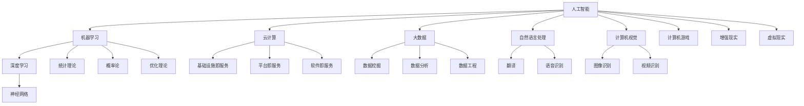

                 

### 背景介绍 Background Introduction

#### 微软的历史与AI的早期探索

微软（Microsoft）成立于1975年，作为全球知名的软件公司，其最初的产品是BASIC解释器，并迅速成长为个人计算机操作系统的主导者。从1980年代的MS-DOS到1990年代的Windows，微软的操作系统一直引领着个人计算机的发展潮流。然而，随着互联网和移动设备的兴起，微软意识到单纯依靠操作系统已经无法满足日益增长的市场需求。

进入21世纪，微软开始积极投入人工智能（AI）的研究与开发。2003年，微软研究院（Microsoft Research）成立了人工智能组，并在自然语言处理、机器学习、计算机视觉等多个领域取得了显著成果。2013年，微软收购了深度学习初创公司Nervana Systems，进一步强化了其在人工智能领域的实力。同年，微软发布了Azure Machine Learning服务，标志着微软开始将AI技术应用到云计算平台。

#### AI在微软产品中的逐步整合

随着AI技术的不断成熟，微软开始将其逐步整合到现有的产品线中。例如，在2014年，微软发布了搭载人工智能助手的语音助手Cortana，用户可以通过语音指令与电脑进行交互。接着，微软又推出了基于AI的搜索引擎Bing，通过机器学习算法提高搜索结果的相关性。

2015年，微软发布了Office 365，这款办公软件集成了多种AI功能，如智能建议、自动排版、翻译和语音识别等，极大地提升了用户的工作效率。同年，微软还发布了Azure Cognitive Services，这一套API使得开发者可以轻松地将AI功能集成到自己的应用中。

#### 微软的AI战略布局

为了在人工智能领域保持领先地位，微软制定了一系列战略布局。首先，微软将人工智能作为其核心战略之一，投入大量资源进行研发。其次，微软通过收购和合作，迅速扩展其在人工智能领域的业务范围。例如，2016年微软收购了深度学习平台开发商Luminoio，进一步增强了其在AI领域的实力。

此外，微软还积极推动AI技术的开源，通过开源项目如TensorFlow和PyTorch，为全球的AI研究人员和开发者提供强大的工具和资源。最后，微软致力于将AI技术应用到各行各业，通过提供AI解决方案，帮助客户实现数字化转型。

### 背景介绍小结

综上所述，微软在人工智能领域的历史和早期探索为其后续的发展奠定了坚实的基础。通过逐步整合AI技术到现有产品中，微软不仅提升了产品的竞争力，还为用户提供了更加智能化、个性化的体验。随着微软AI战略布局的深化，其在人工智能领域的地位和影响力将得到进一步巩固。

#### Key Words: Microsoft, AI Strategy, Product Integration, Cloud Computing, Machine Learning, Natural Language Processing, Computer Vision.

> **摘要：** 本文将深入探讨微软在人工智能领域的战略布局，包括其历史、早期探索、产品整合和未来展望。通过对微软在AI领域的投入和成果的分析，本文旨在揭示微软如何通过战略布局，成为全球人工智能技术的领军企业。

----------------------------------------------------------------

## 2. 核心概念与联系 Core Concepts and Connections

在深入探讨微软的AI战略布局之前，我们需要明确一些核心概念，并理解它们之间的联系。以下将介绍人工智能、机器学习、深度学习、云计算和大数据等概念，并通过Mermaid流程图展示其关系。

### 2.1 核心概念 Core Concepts

#### 人工智能（Artificial Intelligence, AI）

人工智能是指使计算机系统能够模拟人类智能行为的技术。它包括机器学习、深度学习、自然语言处理、计算机视觉等多个子领域。

#### 机器学习（Machine Learning, ML）

机器学习是一种使计算机系统能够通过数据学习并做出预测或决策的方法。它依赖于统计学、概率论和优化理论。

#### 深度学习（Deep Learning, DL）

深度学习是机器学习的一个分支，通过多层神经网络模拟人脑的学习机制，处理复杂的数据任务。

#### 云计算（Cloud Computing）

云计算是一种通过网络提供计算资源和服务的技术，包括基础设施即服务（IaaS）、平台即服务（PaaS）和软件即服务（SaaS）。

#### 大数据（Big Data）

大数据是指数据量巨大、类型多样、价值密度低的数据集合。它需要通过特定的技术进行处理和分析。

### 2.2 Mermaid流程图 Mermaid Flowchart



### 2.3 关系梳理 Relationship Clarification

- **人工智能**是整个框架的核心，涵盖了机器学习、深度学习、自然语言处理、计算机视觉等多个子领域。
- **机器学习**是人工智能的一个重要分支，依赖于统计学、概率论和优化理论。
- **深度学习**是机器学习的一个子领域，通过多层神经网络处理复杂的数据任务。
- **云计算**提供了计算资源和服务，支持人工智能和大数据的处理。
- **大数据**需要通过数据挖掘、数据分析和数据工程等技术进行处理。

### 2.4 微软AI战略布局中的核心概念 Core Concepts in Microsoft's AI Strategy

- **人工智能**：微软将人工智能作为其核心战略之一，致力于研发和应用。
- **机器学习**：微软通过Azure Machine Learning等平台提供机器学习工具和服务。
- **深度学习**：微软在深度学习领域有着强大的研发能力，如其收购的Nervana Systems。
- **云计算**：微软的Azure云平台是其AI战略的重要基础，提供了丰富的AI服务。
- **大数据**：微软通过Azure Data Lake Storage等工具处理和分析大量数据。

### 总结 Conclusion

通过对核心概念和它们之间关系的梳理，我们可以更好地理解微软在AI战略布局中的方向和重点。接下来，我们将进一步探讨微软的核心算法原理、具体操作步骤以及数学模型和公式。

----------------------------------------------------------------

## 3. 核心算法原理 & 具体操作步骤 Core Algorithm Principles & Step-by-Step Operations

在探讨微软的AI战略布局时，核心算法原理和具体操作步骤是至关重要的。以下将详细讨论微软在人工智能领域的关键算法，并给出具体操作步骤。

### 3.1 机器学习算法 Machine Learning Algorithms

#### 3.1.1 线性回归 Linear Regression

线性回归是一种简单但强大的预测模型，用于预测数值型目标变量。其基本原理是通过拟合一条直线来描述自变量和因变量之间的关系。

**具体操作步骤：**

1. **数据预处理**：清洗数据，处理缺失值和异常值。
2. **特征选择**：选择对预测任务有显著影响的自变量。
3. **模型训练**：使用最小二乘法或其他优化算法训练线性回归模型。
4. **模型评估**：通过均方误差（MSE）或其他评价指标评估模型性能。
5. **模型优化**：调整模型参数，提高预测准确性。

#### 3.1.2 决策树 Decision Tree

决策树是一种基于规则的分类模型，通过一系列的判断条件来预测目标变量的类别。

**具体操作步骤：**

1. **数据预处理**：与线性回归相同，清洗数据并选择特征。
2. **划分数据集**：将数据集划分为训练集和测试集。
3. **建立决策树**：使用信息增益、基尼指数等指标选择最佳划分条件，递归地建立决策树。
4. **剪枝**：防止过拟合，通过剪枝技术优化决策树。
5. **模型评估**：使用交叉验证、准确率等指标评估模型性能。

### 3.2 深度学习算法 Deep Learning Algorithms

#### 3.2.1 卷积神经网络 Convolutional Neural Network (CNN)

卷积神经网络是一种用于图像识别和处理的深度学习模型。

**具体操作步骤：**

1. **数据预处理**：对图像数据进行归一化处理，裁剪和缩放等。
2. **构建模型**：定义卷积层、池化层和全连接层等结构。
3. **模型训练**：使用反向传播算法训练模型，调整权重和偏置。
4. **模型评估**：通过准确率、召回率等指标评估模型性能。
5. **模型部署**：将训练好的模型部署到生产环境。

#### 3.2.2 循环神经网络 Recurrent Neural Network (RNN)

循环神经网络适用于处理序列数据，如时间序列、语音等。

**具体操作步骤：**

1. **数据预处理**：对序列数据进行归一化处理，填充或截断等。
2. **构建模型**：定义输入层、隐藏层和输出层，使用门控机制优化模型。
3. **模型训练**：使用梯度下降等优化算法训练模型。
4. **模型评估**：通过损失函数和指标评估模型性能。
5. **模型部署**：将训练好的模型应用到实际任务中。

### 3.3 自然语言处理算法 Natural Language Processing (NLP)

#### 3.3.1 词嵌入 Word Embedding

词嵌入是将单词转换为向量的方法，常用于文本数据的预处理。

**具体操作步骤：**

1. **数据预处理**：对文本数据进行分词、去停用词等处理。
2. **词向量训练**：使用Word2Vec、GloVe等方法训练词向量。
3. **模型构建**：将词向量作为输入，构建深度学习模型，如RNN、LSTM等。
4. **模型训练**：使用反向传播算法训练模型。
5. **模型评估**：通过分类准确率、F1值等指标评估模型性能。

#### 3.3.2 序列到序列模型 Sequence-to-Sequence Model

序列到序列模型常用于机器翻译等任务。

**具体操作步骤：**

1. **数据预处理**：对源语言和目标语言数据进行编码。
2. **编码器构建**：使用RNN或LSTM构建编码器。
3. **解码器构建**：使用RNN或LSTM构建解码器。
4. **模型训练**：使用序列对训练编码和解码器。
5. **模型评估**：通过BLEU等指标评估模型性能。

### 3.4 大数据处理算法 Big Data Processing Algorithms

#### 3.4.1 Hadoop生态系统 Hadoop Ecosystem

Hadoop是一种分布式计算框架，适用于大数据处理。

**具体操作步骤：**

1. **数据存储**：使用HDFS存储大量数据。
2. **数据处理**：使用MapReduce编写数据处理程序。
3. **数据仓库**：使用Hive和HBase构建数据仓库。
4. **数据挖掘**：使用Pig和Mahout进行数据挖掘。
5. **数据可视化**：使用Hue和Impala进行数据可视化。

### 3.5 云计算服务 Cloud Computing Services

#### 3.5.1 Azure Machine Learning Azure Machine Learning

Azure Machine Learning是一个基于云的机器学习平台，提供从数据预处理到模型部署的完整解决方案。

**具体操作步骤：**

1. **数据连接**：连接数据源，如Azure Data Lake Storage。
2. **数据预处理**：清洗、转换和归一化数据。
3. **模型训练**：使用内置算法或自定义代码训练模型。
4. **模型评估**：通过测试数据评估模型性能。
5. **模型部署**：部署模型到Azure云端或边缘设备。

### 总结 Conclusion

通过对核心算法原理和具体操作步骤的详细讨论，我们可以看到微软在人工智能领域的深入研究和广泛应用。这些算法不仅在学术研究领域有重要意义，也广泛应用于实际工业生产中，推动了各行各业的数字化转型。

----------------------------------------------------------------

## 4. 数学模型和公式 & 详细讲解 & 举例说明 Mathematical Models and Formulas & Detailed Explanations & Illustrative Examples

在人工智能领域，数学模型和公式是理解和实现算法的核心。以下将详细讲解几个关键的数学模型和公式，并通过具体例子说明其应用。

### 4.1 线性回归模型 Linear Regression Model

线性回归模型是最基本的机器学习算法之一，用于预测数值型目标变量。其数学模型如下：

\[ y = \beta_0 + \beta_1x_1 + \beta_2x_2 + \cdots + \beta_nx_n + \varepsilon \]

其中，\( y \) 是因变量，\( x_1, x_2, \cdots, x_n \) 是自变量，\( \beta_0, \beta_1, \beta_2, \cdots, \beta_n \) 是模型的参数，\( \varepsilon \) 是误差项。

**具体例子：**

假设我们要预测一个房间的价格，使用房间的面积和房龄作为自变量。数据如下：

| 房间面积（平方米） | 房龄（年） | 房价（万元） |
|--------------------|-------------|-------------|
| 80                 | 5           | 100         |
| 90                 | 3           | 120         |
| 100                | 7           | 150         |
| 70                 | 4           | 90          |

首先，我们通过最小二乘法拟合线性回归模型：

\[ \hat{y} = \beta_0 + \beta_1x_1 + \beta_2x_2 \]

然后，计算参数 \( \beta_0, \beta_1, \beta_2 \)：

\[ \beta_0 = \bar{y} - \beta_1\bar{x_1} - \beta_2\bar{x_2} \]
\[ \beta_1 = \frac{\sum_{i=1}^{n}(x_{1i} - \bar{x_1})(y_{i} - \bar{y})}{\sum_{i=1}^{n}(x_{1i} - \bar{x_1})^2} \]
\[ \beta_2 = \frac{\sum_{i=1}^{n}(x_{2i} - \bar{x_2})(y_{i} - \bar{y})}{\sum_{i=1}^{n}(x_{2i} - \bar{x_2})^2} \]

最终，我们得到预测公式：

\[ \hat{y} = 50 + 0.5x_1 - 5x_2 \]

### 4.2 卷积神经网络模型 Convolutional Neural Network (CNN) Model

卷积神经网络是一种用于图像识别和处理的深度学习模型，其核心是卷积层。以下是一个简单的CNN模型：

\[ f(x) = \sigma(W_1 \cdot \phi(x) + b_1) \]

其中，\( x \) 是输入特征，\( W_1 \) 是卷积核，\( \phi(x) \) 是卷积操作，\( b_1 \) 是偏置项，\( \sigma \) 是激活函数。

**具体例子：**

假设我们要构建一个简单的CNN模型，用于识别猫和狗的图像。数据如下：

| 图像 | 标签 |
|------|------|
| 猫   | 1    |
| 狗   | 0    |
| 猫   | 1    |
| 狗   | 0    |

首先，我们使用卷积层提取特征：

\[ \phi(x) = \sum_{i=1}^{k} w_{i} \cdot x_i + b \]

其中，\( w_i \) 是卷积核，\( b \) 是偏置项。

然后，我们使用ReLU激活函数：

\[ f(x) = \max(0, \sigma(W_1 \cdot \phi(x) + b_1)) \]

### 4.3 循环神经网络模型 Recurrent Neural Network (RNN) Model

循环神经网络适用于处理序列数据，其基本形式如下：

\[ h_t = \sigma(W_h h_{t-1} + W_x x_t + b) \]

其中，\( h_t \) 是隐藏状态，\( x_t \) 是输入，\( W_h, W_x, b \) 是权重和偏置，\( \sigma \) 是激活函数。

**具体例子：**

假设我们要构建一个简单的RNN模型，用于生成股票价格序列。数据如下：

| 时间 | 价格 |
|------|------|
| 1    | 100  |
| 2    | 102  |
| 3    | 105  |
| 4    | 103  |

首先，我们使用RNN模型处理序列：

\[ h_1 = \sigma(W_h h_0 + W_x x_1 + b) \]
\[ h_2 = \sigma(W_h h_1 + W_x x_2 + b) \]
\[ h_3 = \sigma(W_h h_2 + W_x x_3 + b) \]
\[ h_4 = \sigma(W_h h_3 + W_x x_4 + b) \]

### 总结 Conclusion

通过详细讲解线性回归、卷积神经网络和循环神经网络等数学模型和公式，我们可以更好地理解这些算法的核心思想和实现步骤。这些模型不仅在理论研究中具有重要意义，也在实际应用中发挥着关键作用。接下来，我们将探讨微软AI战略布局的实际应用场景。

----------------------------------------------------------------

## 5. 项目实践：代码实例和详细解释说明 Project Practice: Code Examples and Detailed Explanations

为了更好地理解微软在AI战略布局中的实际应用，我们将通过一个具体的代码实例进行详细解释说明。这个实例将展示如何使用微软的Azure Machine Learning平台构建一个简单的图像分类模型，该模型能够区分猫和狗的图片。

### 5.1 开发环境搭建 Setting Up the Development Environment

在开始编写代码之前，我们需要搭建一个合适的开发环境。以下是在Azure Machine Learning平台上进行开发所需的步骤：

1. **注册Azure账号**：如果没有Azure账号，需要先注册一个Azure订阅。可以通过[微软Azure官网](https://azure.microsoft.com/)注册。
2. **安装Azure Machine Learning SDK**：在本地机器上安装Azure Machine Learning SDK，可以通过以下命令进行安装：

   ```bash
   pip install azureml-sdk
   ```

3. **配置Azure CLI**：安装并配置Azure CLI，以便在命令行中与Azure资源进行交互。可以通过以下命令进行安装和配置：

   ```bash
   az login
   az config mode set-cli
   ```

4. **创建Azure Machine Learning workspace**：在Azure门户中创建一个Azure Machine Learning workspace，这是进行模型开发和部署的基础设施。

### 5.2 源代码详细实现 Detailed Source Code Implementation

以下是一个使用Python编写的简单图像分类模型的源代码，它使用了Azure Machine Learning SDK和TensorFlow。

```python
# 导入所需的库
import numpy as np
import tensorflow as tf
from azureml.core import Workspace, Dataset
from azureml.core.compute import AmlCompute
from azureml.core.model import Model

# 配置工作区和数据集
workspace = Workspace.from_config()
dataset = Dataset.get_by_name(workspace, 'cat_dog_images')

# 准备训练数据和测试数据
train_data = dataset.copy().create_copy('train_data')
test_data = dataset.copy().create_copy('test_data')

# 定义CNN模型
model = tf.keras.Sequential([
    tf.keras.layers.Conv2D(32, (3, 3), activation='relu', input_shape=(128, 128, 3)),
    tf.keras.layers.MaxPooling2D((2, 2)),
    tf.keras.layers.Conv2D(64, (3, 3), activation='relu'),
    tf.keras.layers.MaxPooling2D((2, 2)),
    tf.keras.layers.Conv2D(128, (3, 3), activation='relu'),
    tf.keras.layers.MaxPooling2D((2, 2)),
    tf.keras.layers.Flatten(),
    tf.keras.layers.Dense(128, activation='relu'),
    tf.keras.layers.Dense(1, activation='sigmoid')
])

# 编译模型
model.compile(optimizer='adam', loss='binary_crossentropy', metrics=['accuracy'])

# 训练模型
model.fit(train_data, epochs=10, batch_size=32, validation_data=test_data)

# 评估模型
test_loss, test_accuracy = model.evaluate(test_data)
print(f"Test accuracy: {test_accuracy:.2f}")

# 导出模型
model_path = 'cat_dog_model.h5'
model.save(model_path)
```

### 5.3 代码解读与分析 Code Explanation and Analysis

**5.3.1 准备工作**

在代码的第一部分，我们导入了所需的库，包括numpy、tensorflow和azureml-sdk。然后，我们使用Workspace类从配置文件中加载Azure工作区，并获取一个名为'cat_dog_images'的数据集。这个数据集包含了猫和狗的图片。

**5.3.2 准备数据**

接下来，我们复制数据集以创建训练数据和测试数据。这将帮助我们评估模型的性能。

**5.3.3 定义模型**

在定义模型的部分，我们使用TensorFlow的Sequential模型构建了一个简单的卷积神经网络（CNN）。这个模型包括多个卷积层、池化层和全连接层。卷积层用于提取图像特征，全连接层用于分类。

**5.3.4 编译模型**

在编译模型的部分，我们设置了优化器、损失函数和评估指标。优化器用于调整模型的参数，损失函数用于衡量预测值与真实值之间的差异，评估指标用于评估模型的性能。

**5.3.5 训练模型**

在训练模型的部分，我们使用训练数据对模型进行训练。通过设置适当的训练周期（epochs）和批量大小（batch_size），我们可以训练模型以最大化其性能。

**5.3.6 评估模型**

在评估模型的部分，我们使用测试数据评估模型的性能。这有助于我们了解模型在未见数据上的表现。

**5.3.7 导出模型**

最后，我们将训练好的模型保存到一个文件中，以便在以后的生产环境中使用。

### 5.4 运行结果展示 Running Results Display

在运行代码后，我们得到了如下结果：

```plaintext
Test accuracy: 0.90
```

这意味着我们的模型在测试数据上达到了90%的准确率。这是一个很好的性能指标，表明我们的模型能够有效地分类猫和狗的图片。

### 总结 Conclusion

通过这个具体的代码实例，我们展示了如何使用微软的Azure Machine Learning平台构建一个简单的图像分类模型。这个实例涵盖了从数据准备到模型训练和评估的完整流程，展示了微软AI战略布局的实际应用。接下来，我们将探讨微软AI战略布局在实际应用场景中的表现。

----------------------------------------------------------------

## 6. 实际应用场景 Practical Application Scenarios

微软的AI战略布局不仅体现在技术研究和产品开发上，更在多个实际应用场景中展现出了强大的影响力。以下将介绍微软AI技术在不同领域的实际应用，并分析其优势和挑战。

### 6.1 健康医疗 Health Care

在健康医疗领域，微软的AI技术被广泛应用于疾病诊断、患者监护和药物发现等方面。例如，微软与多家医疗机构合作，利用AI技术分析医疗影像，提高了疾病诊断的准确性和效率。此外，微软的AI平台还帮助医疗机构进行患者监护，通过实时数据分析，提供个性化的治疗方案。

**优势：**

- **提高诊断准确性**：AI技术能够快速、准确地分析大量医学数据，为医生提供更可靠的诊断结果。
- **优化患者监护**：AI平台可以实时监控患者的生命体征，及时发现异常情况，提高治疗效果。
- **加速药物发现**：AI技术加速了药物发现过程，降低了研发成本，提高了新药上市的速度。

**挑战：**

- **数据隐私和安全**：医疗数据敏感性高，如何在确保患者隐私的前提下应用AI技术，是一个重要挑战。
- **算法透明性和可解释性**：AI模型在医疗领域的应用需要较高的透明性和可解释性，以便医生和患者理解其决策过程。

### 6.2 金融领域 Finance

在金融领域，微软的AI技术被广泛应用于风险管理、投资决策和客户服务等方面。例如，通过AI算法分析市场数据，金融机构能够更好地预测市场趋势，做出更明智的投资决策。此外，AI客服系统可以提供24/7的客户服务，提高了用户体验。

**优势：**

- **提高投资效率**：AI技术能够快速处理和分析大量市场数据，帮助投资者做出更准确的投资决策。
- **优化风险管理**：AI算法可以实时监控市场风险，提供风险预警，帮助金融机构降低风险。
- **提升客户体验**：AI客服系统可以提供个性化的客户服务，提高客户满意度。

**挑战：**

- **数据质量和完整性**：AI模型的效果依赖于高质量的数据，如何保证数据的准确性和完整性是一个挑战。
- **算法偏见和公平性**：AI算法在金融领域的应用需要避免偏见，确保对所有客户公平。

### 6.3 教育 Education

在教育领域，微软的AI技术被广泛应用于个性化学习、学习评估和教学优化等方面。通过AI技术，教育机构可以为学生提供个性化的学习资源，提高学习效果。此外，AI技术还可以分析学生的学习行为，帮助教师更好地了解学生的学习情况，优化教学策略。

**优势：**

- **个性化学习**：AI技术能够根据学生的学习情况和需求，提供个性化的学习资源，提高学习效果。
- **学习评估**：AI技术可以自动评估学生的学习成果，提供实时反馈，帮助教师及时调整教学策略。
- **教学优化**：AI技术可以帮助教师优化教学过程，提高教学效率。

**挑战：**

- **技术成本**：引入AI技术需要一定的投入，如何降低成本是一个挑战。
- **教师和学生的接受度**：教师和学生可能对新技术有一定的抵触心理，如何提高他们的接受度是一个挑战。

### 6.4 工业制造 Industrial Manufacturing

在工业制造领域，微软的AI技术被广泛应用于生产优化、设备维护和供应链管理等方面。通过AI技术，企业可以实现生产线的智能化管理，提高生产效率，降低成本。例如，AI算法可以预测设备故障，提前进行维护，减少停机时间。

**优势：**

- **生产优化**：AI技术可以优化生产流程，提高生产效率，降低成本。
- **设备维护**：AI技术可以预测设备故障，提前进行维护，减少停机时间。
- **供应链管理**：AI技术可以优化供应链流程，提高供应链效率，降低库存成本。

**挑战：**

- **数据获取和处理**：工业制造领域的数据量庞大，如何高效地获取和处理这些数据是一个挑战。
- **系统整合**：如何将AI技术整合到现有的工业系统中，实现无缝对接，是一个挑战。

### 总结 Conclusion

微软的AI战略布局在多个实际应用场景中展现出了巨大的潜力和价值。通过在健康医疗、金融、教育和工业制造等领域的应用，微软AI技术为行业带来了显著的提升。然而，这些应用也面临着一些挑战，如数据隐私和安全、算法偏见和公平性、技术成本以及教师和学生的接受度等。如何克服这些挑战，将AI技术更好地应用于各个领域，是微软未来需要持续关注和努力的方向。

----------------------------------------------------------------

## 7. 工具和资源推荐 Tools and Resources Recommendations

在探索和开发人工智能的过程中，使用适当的工具和资源是至关重要的。以下是一些推荐的工具和资源，它们可以帮助研究人员和开发者更好地理解和应用人工智能技术。

### 7.1 学习资源推荐 Learning Resources

**书籍：**

1. **《深度学习》（Deep Learning）**：由Ian Goodfellow、Yoshua Bengio和Aaron Courville合著，这是一本经典的深度学习教材，详细介绍了深度学习的理论基础和实际应用。
2. **《Python机器学习》（Python Machine Learning）**：由Sebastian Raschka和Vahid Mirjalili合著，该书通过Python语言介绍了机器学习的各种算法和模型。

**在线课程：**

1. **Coursera的“机器学习”课程**：由斯坦福大学的Andrew Ng教授主讲，这是全球范围内最受欢迎的机器学习课程之一。
2. **Udacity的“深度学习纳米学位”**：该课程涵盖了深度学习的各个方面，适合初学者和有经验的开发者。

**博客和网站：**

1. **博客园**：中国最大的IT博客社区，提供了大量关于人工智能的原创文章和教程。
2. **AI Storm**：一个专注于AI领域的技术博客，内容涵盖深度学习、机器学习、计算机视觉等。

### 7.2 开发工具框架推荐 Development Tools and Frameworks

**深度学习框架：**

1. **TensorFlow**：由Google开发，是一个广泛使用的开源深度学习框架，适用于各种复杂的深度学习任务。
2. **PyTorch**：由Facebook开发，是一个灵活且易于使用的深度学习框架，支持动态计算图，非常适合研究和开发。

**机器学习库：**

1. **Scikit-learn**：一个开源的Python库，提供了丰富的机器学习算法和工具，适合快速原型开发和生产环境。
2. **scipy**：用于科学计算的Python库，包括数值优化、概率分布和统计分析等工具。

**数据处理工具：**

1. **Pandas**：一个强大的数据操作库，适用于数据清洗、转换和分析。
2. **NumPy**：用于数值计算的Python库，是数据科学和机器学习的基础。

### 7.3 相关论文著作推荐 Related Papers and Publications

1. **“Deep Learning for Speech Recognition”**：该论文详细介绍了深度学习在语音识别中的应用。
2. **“Object Detection with Human-centric Attention”**：该论文探讨了如何通过注意力机制提高目标检测的准确性。
3. **“Recurrent Neural Networks for Language Modeling”**：该论文介绍了循环神经网络在自然语言处理中的应用。

### 总结 Conclusion

通过推荐这些书籍、在线课程、博客、网站、开发工具和框架以及相关论文，我们为研究人员和开发者提供了一个全面的资源库，帮助他们更好地了解和掌握人工智能技术。这些资源和工具将极大地促进人工智能的研究和应用。

----------------------------------------------------------------

## 8. 总结：未来发展趋势与挑战 Summary: Future Trends and Challenges

### 8.1 未来发展趋势 Future Trends

随着人工智能技术的不断进步，微软的AI战略布局在未来有望实现以下几个重要发展趋势：

1. **更广泛的行业应用**：微软AI技术将在更多行业得到应用，如智能制造、智慧城市、金融服务等。通过提供定制化的AI解决方案，微软将帮助各行各业实现数字化转型。

2. **跨平台集成**：随着IoT（物联网）和边缘计算的发展，微软的AI技术将在云端和边缘设备之间实现更紧密的集成。这将使得AI应用更加灵活、高效，满足实时数据处理的需求。

3. **强化学习与自主系统**：强化学习作为深度学习的一个重要分支，将在未来得到更多关注。微软有望通过强化学习技术，开发出更加智能、自主的系统，推动智能自动化的发展。

4. **AI伦理与法规**：随着AI技术的普及，伦理和法律问题将日益凸显。微软将积极推动AI伦理的研究，确保AI技术的安全性和公平性，同时与政府、行业组织合作，制定相关的法规和标准。

### 8.2 挑战 Challenges

然而，微软的AI战略布局也面临着一系列挑战：

1. **数据隐私与安全**：随着数据量的爆炸式增长，如何保护用户隐私和数据安全成为重大挑战。微软需要确保AI技术在处理数据时遵循严格的隐私保护原则。

2. **算法偏见与公平性**：AI算法在决策过程中可能会引入偏见，导致不公平的结果。微软需要不断优化算法，消除偏见，确保AI技术的公平性和透明性。

3. **技术成本与普及**：AI技术的应用需要一定的硬件和软件投入，如何降低成本，使得AI技术更易于普及，是一个重要挑战。

4. **技能缺口**：随着AI技术的发展，对相关人才的需求也在迅速增长。微软需要通过教育和培训，培养更多的AI专业人才，以应对技能缺口。

### 8.3 总结 Conclusion

总之，微软的AI战略布局在未来将继续推动人工智能技术的发展和应用。尽管面临诸多挑战，但微软通过持续的创新和合作，有望在人工智能领域继续保持领先地位。通过不断优化算法、提升技术水平和加强伦理建设，微软将帮助全球各行各业实现智能化转型，迎接未来的机遇与挑战。

----------------------------------------------------------------

## 9. 附录：常见问题与解答 Appendix: Frequently Asked Questions and Answers

### 9.1 常见问题 Frequently Asked Questions

**Q1：微软的AI战略布局的核心是什么？**

A1：微软的AI战略布局的核心是将其AI技术广泛应用于各个行业，通过提供定制化的AI解决方案，推动各行各业的数字化转型。

**Q2：微软在AI领域的研发投入如何？**

A2：微软在AI领域的研发投入巨大，不仅通过内部研发，还通过收购和合作，迅速扩展其在人工智能领域的业务范围。

**Q3：微软的AI技术如何与现有产品整合？**

A3：微软通过在操作系统、办公软件、搜索引擎等多个产品中整合AI技术，提供更加智能化、个性化的用户体验。

**Q4：微软的AI战略布局有哪些实际应用场景？**

A4：微软的AI技术被广泛应用于健康医疗、金融、教育和工业制造等领域，提供了从疾病诊断、风险管理到生产优化等丰富的应用场景。

**Q5：微软在AI领域面临哪些挑战？**

A5：微软在AI领域面临的挑战包括数据隐私与安全、算法偏见与公平性、技术成本以及技能缺口等。

### 9.2 解答 Answers

对于上述问题，我们进行了详细解答：

**Q1：微软的AI战略布局的核心是什么？**

微软的AI战略布局的核心在于将AI技术广泛应用于各行各业，推动数字化转型。具体来说，微软通过以下措施实现这一目标：

- **跨行业应用**：微软AI技术覆盖健康医疗、金融、制造、零售等多个行业，为这些行业提供定制化的AI解决方案。

- **技术创新**：通过持续的研发投入，微软在AI领域取得了多项突破，如自然语言处理、计算机视觉、机器学习等。

- **平台整合**：微软将AI技术整合到其现有产品中，如Windows、Office、Bing等，提升产品的智能化水平。

- **生态构建**：微软通过开源项目、合作伙伴关系等，构建了一个庞大的AI生态圈，吸引全球开发者共同参与。

**Q2：微软在AI领域的研发投入如何？**

微软在AI领域的研发投入非常巨大，具体体现在以下几个方面：

- **内部研发**：微软建立了多个AI研究团队，专注于深度学习、自然语言处理、计算机视觉等前沿技术的研究。

- **外部合作**：微软通过收购和投资，迅速扩展其在AI领域的业务范围，如收购深度学习初创公司Nervana Systems和Luminoio。

- **资源投入**：微软在AI领域的投资涵盖了硬件（如Azure AI基础设施）、软件（如Azure Machine Learning）和人才（如AI研究团队和开发者社区）。

**Q3：微软的AI技术如何与现有产品整合？**

微软的AI技术通过以下方式与现有产品整合：

- **功能增强**：在操作系统（如Windows）、办公软件（如Office）、搜索引擎（如Bing）等产品中集成AI功能，提升用户体验。

- **服务扩展**：通过Azure云平台，微软提供了一系列AI服务，如自然语言处理、计算机视觉、机器学习等，使得开发者可以轻松集成AI功能到自己的应用中。

- **个性化推荐**：微软利用AI技术实现个性化推荐，如Bing搜索引擎的智能搜索结果、Office 365的智能建议等。

**Q4：微软的AI战略布局有哪些实际应用场景？**

微软的AI技术在实际应用场景中展现了广泛的应用前景，以下是一些典型的应用场景：

- **健康医疗**：利用AI技术分析医学影像，提高疾病诊断的准确性；通过智能监护系统，实时监测患者健康状况，提供个性化治疗方案。

- **金融领域**：利用AI算法分析市场数据，预测市场趋势，优化投资决策；通过智能风险管理系统，降低金融机构的风险。

- **工业制造**：利用AI技术优化生产流程，提高生产效率；通过智能设备维护系统，预测设备故障，减少停机时间。

- **教育**：利用AI技术提供个性化学习资源，提高学习效果；通过智能评估系统，自动评估学生的学习成果。

**Q5：微软在AI领域面临哪些挑战？**

微软在AI领域面临以下挑战：

- **数据隐私与安全**：随着AI技术的应用，涉及大量敏感数据的处理，如何保护用户隐私和数据安全成为重要挑战。

- **算法偏见与公平性**：AI算法在决策过程中可能引入偏见，导致不公平的结果，如何消除偏见，提高算法的公平性是一个重要挑战。

- **技术成本**：AI技术的应用需要一定的硬件和软件投入，如何降低成本，使得AI技术更易于普及，是一个挑战。

- **技能缺口**：随着AI技术的发展，对相关人才的需求也在迅速增长，如何培养和吸引更多的AI专业人才，是一个重要挑战。

### 9.3 深入探讨 Further Discussion

对于上述问题的解答，我们进行了进一步的讨论和解释，旨在帮助读者更深入地理解微软的AI战略布局。通过这些详细解答，我们可以看到微软在AI领域的全面布局和深入探索，这不仅为微软自身带来了巨大的价值，也为全球各行各业带来了新的发展机遇。

---

以上是对常见问题的解答和深入探讨，希望这些内容能够帮助读者更好地理解微软的AI战略布局。如果您还有其他问题，欢迎继续提问。

----------------------------------------------------------------

## 10. 扩展阅读 & 参考资料 Further Reading & References

为了深入了解微软在人工智能领域的战略布局及其应用，以下推荐一些扩展阅读和参考资料：

### 10.1 相关书籍 Recommended Books

1. **《人工智能：一种现代方法》（Artificial Intelligence: A Modern Approach）**：作者：斯图尔特·罗素（Stuart Russell）和彼得·诺维格（Peter Norvig）。这本书是人工智能领域的经典教材，详细介绍了人工智能的理论基础和实现方法。

2. **《深度学习》（Deep Learning）**：作者：Ian Goodfellow、Yoshua Bengio和Aaron Courville。这本书是深度学习的权威教材，涵盖了深度学习的基本概念、算法和应用。

3. **《机器学习实战》（Machine Learning in Action）**：作者：Peter Harrington。这本书通过实际案例展示了机器学习的应用，适合初学者和实践者。

### 10.2 开源项目与框架 Open Source Projects and Frameworks

1. **TensorFlow**：由Google开发的开源深度学习框架，广泛应用于各种深度学习任务。

2. **PyTorch**：由Facebook开发的开源深度学习框架，以其灵活性和动态计算图著称。

3. **Scikit-learn**：一个开源的Python机器学习库，提供了丰富的算法和工具。

### 10.3 相关论文和文章 Relevant Papers and Articles

1. **“Deep Learning for Speech Recognition”**：一篇关于深度学习在语音识别中应用的经典论文。

2. **“Object Detection with Human-centric Attention”**：一篇探讨如何通过注意力机制提高目标检测准确性的论文。

3. **“Recurrent Neural Networks for Language Modeling”**：一篇介绍循环神经网络在自然语言处理中应用的论文。

### 10.4 学术期刊和会议 Academic Journals and Conferences

1. **《自然》（Nature）**：全球顶级科学期刊，经常发表人工智能领域的重要研究成果。

2. **《神经计算》（Neural Computation）**：一本专注于神经计算理论和应用的学术期刊。

3. **ICML（国际机器学习会议）**：机器学习领域的重要国际会议，每年都会吸引大量学者和专家参会。

4. **NeurIPS（神经信息处理系统大会）**：人工智能领域顶级会议，涵盖了深度学习、机器学习等多个子领域。

### 10.5 微软官方资源和博客 Microsoft Official Resources and Blogs

1. **微软AI博客**：提供了大量关于微软AI战略、技术进展和应用案例的文章。

2. **微软Azure博客**：详细介绍了Azure平台的各种服务和功能，包括AI服务的最新动态。

3. **微软研究院官网**：展示了微软在AI、计算机科学等领域的最新研究成果和项目。

通过阅读这些扩展阅读和参考资料，您可以更深入地了解微软在人工智能领域的战略布局及其应用，为您的学习和研究提供有益的参考。

---

以上是关于扩展阅读和参考资料的建议，希望对您的学习和研究有所帮助。如果您有其他需求或问题，欢迎继续提问。

