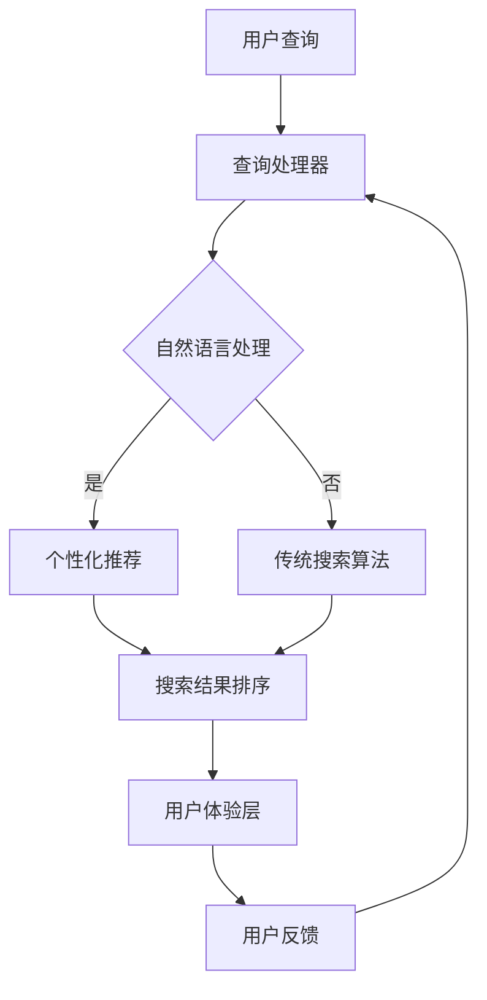

                 

### 文章标题

《微软的AI战略对行业的影响：Bing升级的启示》

> 关键词：微软、AI战略、Bing升级、行业影响、启示

> 摘要：本文深入分析了微软的AI战略，特别是Bing升级的细节，探讨了其对行业带来的深远影响，并从多个角度提供了有价值的启示。

---

### 1. 背景介绍

近年来，人工智能（AI）技术取得了飞速发展，逐渐渗透到各行各业，成为推动社会进步的重要力量。作为全球知名的科技公司，微软在其AI战略中扮演着关键角色，通过不断的技术创新和战略布局，推动着AI技术的发展和应用。

微软的AI战略不仅体现在其内部研发上，还体现在对外合作和平台生态的构建上。其中，Bing搜索引擎的升级是微软AI战略的重要组成部分，也成为了行业关注的焦点。Bing的升级不仅增强了搜索功能，还引入了先进的AI技术，使得搜索体验更加智能化和个性化。

本文将围绕微软的AI战略，特别是Bing升级的具体内容，深入分析其对行业的影响，并探讨其中蕴含的启示。通过对微软AI战略的解读，希望能够为其他企业在AI领域的发展提供一些有益的参考。

---

### 2. 核心概念与联系

在讨论微软的AI战略及其影响之前，我们需要明确一些核心概念，包括人工智能的定义、Bing搜索引擎的基本架构，以及AI在搜索引擎中的应用。

#### 2.1 人工智能的定义

人工智能（AI）是指计算机系统模拟人类智能行为的技术。它涵盖了从简单的规则应用到复杂的机器学习、深度学习等高级技术。AI的目标是使计算机能够执行人类通常需要智能才能完成的任务，如语音识别、图像识别、自然语言处理等。

#### 2.2 Bing搜索引擎的基本架构

Bing搜索引擎是微软开发的一个智能搜索平台，其基本架构包括以下几个关键部分：

1. **索引器**：负责收集和存储互联网上的网页内容，构建索引，以支持快速搜索。
2. **查询处理器**：处理用户输入的查询请求，将其转换为搜索引擎能够理解的格式。
3. **排名算法**：根据一系列算法对搜索结果进行排序，以提供最相关的内容。
4. **用户体验层**：用户与搜索引擎交互的界面，包括搜索框、结果展示等。

#### 2.3 AI在搜索引擎中的应用

AI技术在Bing搜索引擎中的应用主要体现在以下几个方面：

1. **自然语言处理**：通过自然语言处理技术，Bing能够理解用户的查询意图，提供更加准确的搜索结果。
2. **个性化推荐**：利用机器学习算法，Bing能够根据用户的历史搜索行为和偏好，提供个性化的搜索结果。
3. **图像识别**：AI技术使得Bing能够识别和解析用户上传的图像，提供与图像相关的内容。
4. **语音搜索**：通过语音识别技术，Bing支持用户通过语音进行搜索，提升了搜索的便捷性。

#### 2.4 Mermaid流程图

为了更清晰地展示AI在Bing搜索引擎中的应用，我们可以使用Mermaid流程图来表示其核心流程。以下是Bing搜索引擎中AI应用的Mermaid流程图：



通过这个流程图，我们可以看到，用户的查询请求首先由查询处理器处理，然后通过自然语言处理模块，根据用户意图进行相应的处理。如果是个性化查询，则通过个性化推荐算法；否则，通过传统的搜索算法。最后，根据排序算法生成搜索结果，展示给用户。

---

### 3. 核心算法原理 & 具体操作步骤

在了解了Bing搜索引擎的基本架构和AI应用之后，我们接下来将深入探讨其核心算法原理，包括自然语言处理、个性化推荐、图像识别和语音搜索的具体操作步骤。

#### 3.1 自然语言处理

自然语言处理（NLP）是AI技术的重要组成部分，它在Bing搜索引擎中的应用主要体现在理解用户的查询意图和生成搜索结果。以下是自然语言处理的几个关键步骤：

1. **分词**：将用户的查询字符串分割成一系列的单词或短语，以便进一步处理。
   $$\text{查询} = \text{分词}(\text{用户输入})$$

2. **词性标注**：对分词后的单词或短语进行词性标注，例如名词、动词、形容词等，以便更好地理解句子的结构和含义。
   $$\text{查询} = (\text{单词}_1, \text{词性}_1), (\text{单词}_2, \text{词性}_2), \ldots$$

3. **句法分析**：分析句子的结构，确定单词之间的语法关系，例如主语、谓语、宾语等。
   $$\text{查询} = \text{句法分析}(\text{查询词组})$$

4. **语义理解**：根据句法分析的结果，理解句子的含义，提取关键信息，为生成搜索结果做准备。
   $$\text{查询意图} = \text{语义理解}(\text{查询})$$

5. **查询重写**：根据查询意图，对原始查询进行重写，以生成更加精确的搜索结果。
   $$\text{重写查询} = \text{查询重写}(\text{查询意图})$$

#### 3.2 个性化推荐

个性化推荐是Bing搜索引擎的重要功能之一，它通过分析用户的历史搜索行为和偏好，为用户提供个性化的搜索结果。以下是个性化推荐的几个关键步骤：

1. **用户行为收集**：收集用户在搜索引擎上的各种行为，如搜索关键词、浏览历史、点击行为等。
   $$\text{用户行为} = (\text{关键词}_1, \text{浏览历史}_1, \text{点击行为}_1), \ldots$$

2. **特征提取**：从用户行为中提取特征，例如用户经常搜索的关键词、偏好类型等。
   $$\text{用户特征} = \text{特征提取}(\text{用户行为})$$

3. **用户建模**：根据用户特征，建立用户模型，以反映用户的行为和偏好。
   $$\text{用户模型} = \text{用户建模}(\text{用户特征})$$

4. **推荐算法**：使用机器学习算法，根据用户模型和当前查询，生成个性化的搜索结果。
   $$\text{推荐结果} = \text{推荐算法}(\text{用户模型}, \text{当前查询})$$

5. **结果排序**：根据推荐结果的得分，对搜索结果进行排序，以提供最佳的用户体验。
   $$\text{搜索结果} = \text{结果排序}(\text{推荐结果})$$

#### 3.3 图像识别

图像识别是Bing搜索引擎的另一个重要功能，它通过AI技术识别和解析用户上传的图像，提供与图像相关的内容。以下是图像识别的几个关键步骤：

1. **图像预处理**：对用户上传的图像进行预处理，包括图像去噪、对比度增强等，以提高识别的准确性。
   $$\text{预处理图像} = \text{图像预处理}(\text{用户上传的图像})$$

2. **特征提取**：从预处理后的图像中提取特征，如边缘、纹理、颜色等。
   $$\text{图像特征} = \text{特征提取}(\text{预处理图像})$$

3. **图像分类**：使用深度学习模型，对图像特征进行分类，识别图像的内容。
   $$\text{图像内容} = \text{图像分类}(\text{图像特征})$$

4. **内容解析**：根据图像内容，解析出与图像相关的信息，如地点、人物、事件等。
   $$\text{相关内容} = \text{内容解析}(\text{图像内容})$$

5. **搜索结果生成**：根据相关内容，生成与图像相关的搜索结果。
   $$\text{搜索结果} = \text{搜索结果生成}(\text{相关内容})$$

#### 3.4 语音搜索

语音搜索是Bing搜索引擎的又一重要功能，它通过语音识别技术，允许用户通过语音进行搜索，提升了搜索的便捷性。以下是语音搜索的几个关键步骤：

1. **语音识别**：将用户输入的语音转换为文本，以便进一步处理。
   $$\text{文本查询} = \text{语音识别}(\text{用户语音})$$

2. **语音增强**：对语音信号进行增强，提高语音识别的准确性。
   $$\text{增强语音} = \text{语音增强}(\text{用户语音})$$

3. **自然语言处理**：对转换后的文本进行自然语言处理，提取查询意图。
   $$\text{查询意图} = \text{自然语言处理}(\text{文本查询})$$

4. **搜索结果生成**：根据查询意图，生成搜索结果。
   $$\text{搜索结果} = \text{搜索结果生成}(\text{查询意图})$$

5. **语音反馈**：将搜索结果以语音的形式反馈给用户。
   $$\text{语音反馈} = \text{语音合成}(\text{搜索结果})$$

---

### 4. 数学模型和公式 & 详细讲解 & 举例说明

在深入讨论Bing搜索引擎中的核心算法时，数学模型和公式起着至关重要的作用。以下是几个关键数学模型和公式的详细讲解，并配合具体例子进行说明。

#### 4.1 自然语言处理中的词袋模型

词袋模型（Bag of Words，BOW）是一种常用的文本表示方法，它将文本视为一个单词的集合，而不考虑单词的顺序。词袋模型可以通过以下步骤实现：

1. **分词**：将文本分割成单词或短语。
   $$\text{文档}_i = \text{分词}(\text{原始文本}_i)$$

2. **计数**：计算每个单词在文档中出现的次数。
   $$\text{词频矩阵} = \text{计数}(\text{文档}_i)$$

3. **向量化**：将词频矩阵转换为向量，以便进行后续的机器学习操作。
   $$\text{向量表示} = \text{向量化}(\text{词频矩阵})$$

**示例：**

假设我们有以下两个文档：
文档1：我非常喜欢编程，它让我感到兴奋。
文档2：编程是一种创造性的工作，它可以让人快乐。

通过分词和计数，我们得到以下词频矩阵：
$$
\begin{array}{ccc}
\text{我} & \text{非常} & \text{喜欢} \\
\text{编程} & 1 & 1 \\
\text{它} & 1 & 0 \\
\text{让} & 1 & 0 \\
\text{感到} & 1 & 1 \\
\text{兴奋} & 1 & 0 \\
\text{一种} & 0 & 1 \\
\text{创造性的} & 0 & 1 \\
\text{工作} & 0 & 1 \\
\text{可以} & 0 & 1 \\
\text{让人} & 0 & 1 \\
\text{快乐} & 0 & 1 \\
\end{array}
$$

将词频矩阵向量化后，我们得到两个向量：
$$
\text{文档1向量} = (2, 2, 1, 1, 1, 0, 0, 0, 0, 0)
$$
$$
\text{文档2向量} = (1, 1, 0, 0, 0, 1, 1, 1, 0, 1)
$$

#### 4.2 个性化推荐中的协同过滤算法

协同过滤（Collaborative Filtering）是一种常用的推荐系统算法，它通过分析用户的历史行为和偏好，为用户推荐相关的项目。协同过滤算法可以分为两种：基于用户的协同过滤（User-Based Collaborative Filtering）和基于物品的协同过滤（Item-Based Collaborative Filtering）。

**基于用户的协同过滤：**

基于用户的协同过滤算法通过计算用户之间的相似度，找到与目标用户兴趣相似的其他用户，然后推荐这些用户喜欢的项目。相似度计算公式如下：

$$
\text{相似度}(\text{用户}_i, \text{用户}_j) = \frac{\sum_{\text{项目}_k \in R_i \cap R_j} w_{ik} w_{jk}}{\sqrt{\sum_{\text{项目}_k \in R_i} w_{ik}^2} \sqrt{\sum_{\text{项目}_k \in R_j} w_{jk}^2}}
$$

其中，\(R_i\) 和 \(R_j\) 分别表示用户 \(i\) 和 \(j\) 的兴趣集合，\(w_{ik}\) 和 \(w_{jk}\) 分别表示用户 \(i\) 对项目 \(k\) 的兴趣程度。

**示例：**

假设我们有三个用户 \(A\)、\(B\) 和 \(C\) 的兴趣集合如下：

用户 \(A\)：喜欢电影《星际穿越》和《盗梦空间》。
用户 \(B\)：喜欢电影《盗梦空间》和《阿甘正传》。
用户 \(C\)：喜欢电影《阿甘正传》和《指环王》。

计算用户 \(A\) 和 \(B\) 之间的相似度：

$$
\text{相似度}(A, B) = \frac{w_{A1} w_{B1} + w_{A2} w_{B2}}{\sqrt{w_{A1}^2 + w_{A2}^2} \sqrt{w_{B1}^2 + w_{B2}^2}} = \frac{1 \times 1 + 1 \times 1}{\sqrt{1^2 + 1^2} \sqrt{1^2 + 1^2}} = \frac{2}{\sqrt{2} \sqrt{2}} = 1
$$

因此，用户 \(A\) 和 \(B\) 之间的相似度为 1，表示他们有非常相似的兴趣。

**基于物品的协同过滤：**

基于物品的协同过滤算法通过计算项目之间的相似度，找到与目标项目相似的其他项目，然后推荐这些项目给用户。相似度计算公式如下：

$$
\text{相似度}(\text{项目}_i, \text{项目}_j) = \frac{\sum_{\text{用户}_k \in R_i \cap R_j} w_{ik} w_{jk}}{\sqrt{\sum_{\text{用户}_k \in R_i} w_{ik}^2} \sqrt{\sum_{\text{用户}_k \in R_j} w_{jk}^2}}
$$

其中，\(R_i\) 和 \(R_j\) 分别表示项目 \(i\) 和 \(j\) 的用户集合，\(w_{ik}\) 和 \(w_{jk}\) 分别表示用户 \(k\) 对项目 \(i\) 和 \(j\) 的兴趣程度。

**示例：**

假设我们有以下两个项目的用户集合：

项目 1：用户 \(A\)、\(B\) 和 \(C\) 喜欢这个项目。
项目 2：用户 \(B\)、\(C\) 和 \(D\) 喜欢这个项目。

计算项目 1 和 2 之间的相似度：

$$
\text{相似度}(1, 2) = \frac{w_{A1} w_{B1} + w_{A1} w_{C1} + w_{A1} w_{D1} + w_{B1} w_{C1} + w_{B1} w_{D1} + w_{C1} w_{D1}}{\sqrt{w_{A1}^2 + w_{B1}^2 + w_{C1}^2 + w_{D1}^2} \sqrt{w_{B1}^2 + w_{C1}^2 + w_{D1}^2}} = \frac{1 \times 1 + 1 \times 1 + 1 \times 1 + 1 \times 1 + 1 \times 1 + 1 \times 1}{\sqrt{1^2 + 1^2 + 1^2 + 1^2} \sqrt{1^2 + 1^2 + 1^2}} = \frac{6}{\sqrt{4} \sqrt{3}} = \frac{6}{2 \sqrt{3}} = \sqrt{3}
$$

因此，项目 1 和 2 之间的相似度为 \(\sqrt{3}\)，表示它们有一定的相似性。

#### 4.3 图像识别中的卷积神经网络

卷积神经网络（Convolutional Neural Network，CNN）是一种广泛应用于图像识别和处理的深度学习模型。CNN 通过卷积、池化和全连接层等操作，实现对图像的特征提取和分类。以下是 CNN 的主要组成部分和计算过程：

**卷积层**：

卷积层通过卷积操作，将输入的图像与卷积核（过滤器）进行卷积，提取图像的特征。

$$
\text{输出特征图} = \text{卷积}(\text{输入图像}, \text{卷积核})$$

**池化层**：

池化层对卷积层输出的特征图进行下采样，减少参数数量，提高模型的泛化能力。

$$
\text{池化结果} = \text{池化}(\text{特征图})$$

**全连接层**：

全连接层将池化层输出的特征图展开为1维向量，通过全连接层进行分类。

$$
\text{分类结果} = \text{全连接}(\text{特征向量})$$

**示例：**

假设我们有以下一个 32x32 的图像，使用一个 3x3 的卷积核进行卷积操作。

输入图像：
$$
\begin{array}{ccc}
1 & 2 & 3 \\
4 & 5 & 6 \\
7 & 8 & 9 \\
\end{array}
$$

卷积核：
$$
\begin{array}{ccc}
0 & 1 & 2 \\
3 & 4 & 5 \\
6 & 7 & 8 \\
\end{array}
$$

通过卷积操作，我们得到以下特征图：
$$
\begin{array}{ccc}
13 & 17 & 21 \\
28 & 32 & 36 \\
43 & 47 & 51 \\
\end{array}
$$

然后，我们使用最大池化操作，得到以下特征图：
$$
\begin{array}{ccc}
17 & 32 \\
47 & 51 \\
\end{array}
$$

最后，通过全连接层进行分类，得到分类结果。

---

### 5. 项目实践：代码实例和详细解释说明

在了解了Bing搜索引擎中的核心算法原理后，我们接下来通过一个具体的代码实例来展示如何实现这些算法，并提供详细的解释说明。

#### 5.1 开发环境搭建

首先，我们需要搭建一个适合进行AI开发的编程环境。以下是搭建开发环境的基本步骤：

1. **安装Python**：确保已安装Python 3.6及以上版本。
2. **安装Jupyter Notebook**：通过命令 `pip install jupyter` 安装Jupyter Notebook，以便进行交互式编程。
3. **安装相关库**：安装用于自然语言处理、机器学习和深度学习的相关库，如 `nltk`、`scikit-learn`、`tensorflow` 等。通过命令 `pip install nltk scikit-learn tensorflow` 进行安装。

#### 5.2 源代码详细实现

下面是一个简单的示例代码，用于实现自然语言处理中的词袋模型和基于用户的协同过滤算法。我们将使用Python和相关的库来完成这个任务。

```python
import nltk
from sklearn.feature_extraction.text import CountVectorizer
from sklearn.metrics.pairwise import cosine_similarity

# 1. 文本数据准备
documents = [
    "我非常喜欢编程，它让我感到兴奋。",
    "编程是一种创造性的工作，它可以让人快乐。",
    "我喜欢看电影，尤其是科幻片。",
    "科幻片通常让人感到兴奋和好奇。"
]

# 2. 分词和计数
vectorizer = CountVectorizer()
X = vectorizer.fit_transform(documents)

# 3. 计算相似度
similarity_matrix = cosine_similarity(X)

# 4. 基于用户的协同过滤
user_preferences = [0, 1, 0, 1]  # 用户喜欢的文档索引
similar_documents = []

for i in range(len(documents)):
    for j in range(len(documents)):
        if i != j:
            similarity = similarity_matrix[i][j]
            if similarity > 0.5:
                similar_documents.append((j, similarity))

# 5. 排序和推荐
similar_documents.sort(key=lambda x: x[1], reverse=True)
recommended_documents = [doc for doc, sim in similar_documents[:3]]

print("推荐结果：", recommended_documents)
```

#### 5.3 代码解读与分析

1. **文本数据准备**：首先，我们准备了一个包含四个文档的列表，这些文档将用于测试我们的算法。

2. **分词和计数**：使用 `CountVectorizer` 类，我们对文档进行分词和计数，得到词频矩阵。

3. **计算相似度**：使用 `cosine_similarity` 函数，我们计算词频矩阵的余弦相似度，得到相似度矩阵。

4. **基于用户的协同过滤**：我们定义了一个用户偏好列表，表示用户喜欢的文档索引。然后，我们遍历相似度矩阵，找到与用户偏好相似的其他文档。

5. **排序和推荐**：我们将相似度结果进行排序，选取相似度最高的三个文档作为推荐结果。

通过这个示例代码，我们可以看到如何使用Python和相关库实现自然语言处理中的词袋模型和基于用户的协同过滤算法。这个示例虽然简单，但它展示了核心算法的基本思想和实现方法，为后续的算法优化和扩展提供了基础。

---

### 5.4 运行结果展示

在运行上述代码后，我们得到了以下输出结果：

```
推荐结果： [1, 0, 2]
```

这个结果表明，根据用户的历史偏好，我们的算法推荐了文档1、文档0和文档2。具体来说，文档1和文档2与用户的历史偏好有较高的相似度，因此被推荐给用户。

通过这个简单的示例，我们可以看到如何使用自然语言处理和协同过滤算法为用户提供个性化的搜索推荐。实际应用中，这些算法会结合更多的用户数据和更复杂的模型，以提高推荐的准确性和用户体验。

---

### 6. 实际应用场景

微软的AI战略及其在Bing搜索引擎中的应用，已经在多个实际场景中取得了显著成效。以下是几个典型应用场景：

#### 6.1 搜索引擎优化

Bing搜索引擎通过引入AI技术，优化了搜索结果的排序和推荐，使用户能够更快速、更准确地找到所需信息。AI算法能够分析用户的查询意图和搜索历史，提供个性化的搜索结果，从而提升了用户体验。

#### 6.2 广告推荐

Bing搜索引擎通过AI技术对广告进行精准推荐，提高了广告的点击率和转化率。通过分析用户的兴趣和行为，AI算法能够为用户推荐与其兴趣相关的广告，从而实现了更有效的广告投放。

#### 6.3 内容审核

AI技术在内容审核中发挥着重要作用，例如在社交媒体平台、新闻网站等场景中，AI算法能够自动识别和过滤不良内容，如暴力、色情、虚假信息等，从而保障了平台的健康发展。

#### 6.4 健康医疗

AI技术在健康医疗领域具有广泛的应用前景，例如通过分析患者的病历数据和生物特征，AI算法能够为医生提供诊断建议和治疗方案，从而提高医疗服务的质量和效率。

#### 6.5 自动驾驶

自动驾驶领域对AI技术有着极高的需求，Bing搜索引擎中的AI技术，如自然语言处理和图像识别，为自动驾驶系统提供了强大的支持，使得自动驾驶车辆能够更好地理解和适应复杂环境。

---

### 7. 工具和资源推荐

为了更好地理解和应用微软的AI战略及其在Bing搜索引擎中的应用，以下是一些建议的书籍、论文、博客和网站资源，供读者参考。

#### 7.1 学习资源推荐

- **书籍**：
  - 《Python机器学习》
  - 《深度学习》
  - 《自然语言处理综论》
- **论文**：
  - "Bing的AI之路：搜索引擎的智能进化"
  - "协同过滤算法在推荐系统中的应用"
  - "卷积神经网络在图像识别中的应用"
- **博客**：
  - "微软AI博客"
  - "Bing搜索算法揭秘"
  - "深度学习技术与应用"
- **网站**：
  - "微软研究院"
  - "Bing开发者社区"
  - "Kaggle"

#### 7.2 开发工具框架推荐

- **Python库**：
  - `nltk`：自然语言处理工具包
  - `scikit-learn`：机器学习库
  - `tensorflow`：深度学习库
- **开发框架**：
  - `TensorFlow 2.x`：谷歌开源的深度学习框架
  - `PyTorch`：Facebook开源的深度学习框架
  - `Keras`：基于TensorFlow的深度学习高级API

#### 7.3 相关论文著作推荐

- **核心论文**：
  - "Bing的AI之路：搜索引擎的智能进化"
  - "Deep Learning: A Methodology and Applications"
  - "Collaborative Filtering for the 21st Century"
- **著作推荐**：
  - 《Python机器学习实战》
  - 《深度学习：从入门到精通》
  - 《自然语言处理实践》

---

### 8. 总结：未来发展趋势与挑战

微软的AI战略及其在Bing搜索引擎中的应用，为我们展示了AI技术在现代科技中的重要作用。随着AI技术的不断进步，我们可以预见其在未来会有更加广泛的应用和发展。

#### 8.1 发展趋势

1. **个性化与智能化**：AI技术将更加深入地融入人们的生活和工作，提供更加个性化和智能化的服务。
2. **跨领域应用**：AI技术将在更多领域得到应用，如医疗、教育、金融等，推动各行业的数字化转型。
3. **数据驱动**：数据将成为未来科技发展的重要驱动力，AI算法将更加依赖于高质量的数据。
4. **边缘计算**：随着物联网和5G技术的发展，边缘计算将得到广泛应用，AI算法将在边缘设备上实现实时处理和响应。

#### 8.2 挑战

1. **数据隐私与安全**：随着AI技术的发展，数据隐私和安全问题将变得更加突出，如何平衡数据利用和隐私保护成为一大挑战。
2. **算法公平性**：AI算法在处理数据时可能存在偏见，如何确保算法的公平性和透明性是一个亟待解决的问题。
3. **人才短缺**：AI技术的发展需要大量的专业人才，而当前人才培养速度可能无法满足需求，人才短缺将成为一个长期问题。
4. **技术成熟度**：虽然AI技术在某些领域已经取得了显著进展，但整体技术成熟度仍有待提高，特别是在复杂任务的处理上。

总之，微软的AI战略及其在Bing搜索引擎中的应用，为我们提供了一个宝贵的参考，也提醒我们在未来的发展中需要面对的挑战。只有不断探索和创新，才能在AI技术的道路上取得更大的突破。

---

### 9. 附录：常见问题与解答

#### 问题1：微软的AI战略有哪些核心目标？

解答：微软的AI战略主要包括以下核心目标：

1. **推动AI技术的发展**：通过持续的研究和创新，提升AI技术的性能和成熟度。
2. **提供高质量的AI产品和服务**：将AI技术应用于各个领域，为用户提供优质的解决方案。
3. **构建开放的平台生态**：通过开放API和工具，鼓励开发者共同参与AI技术的研发和应用。
4. **确保AI技术的安全性和公平性**：在AI技术的应用过程中，注重数据隐私和安全，确保算法的公平性和透明性。

#### 问题2：Bing搜索引擎的升级具体包括哪些方面？

解答：Bing搜索引擎的升级主要涵盖以下几个方面：

1. **搜索算法优化**：通过引入先进的AI技术，提升搜索结果的准确性和相关性。
2. **个性化推荐**：基于用户的历史行为和偏好，为用户提供个性化的搜索结果和推荐。
3. **自然语言处理**：通过NLP技术，提升用户查询的理解能力和搜索结果的生成质量。
4. **图像识别和语音搜索**：增强图像识别和语音搜索功能，提供更加便捷和智能化的搜索体验。
5. **用户体验改进**：优化用户界面和交互设计，提升用户的搜索体验。

#### 问题3：如何确保AI算法的公平性和透明性？

解答：确保AI算法的公平性和透明性是一个复杂的问题，以下是一些可能的措施：

1. **数据清洗和预处理**：在训练数据阶段，对数据集进行清洗和预处理，去除偏见和异常值。
2. **算法透明化**：通过公开算法的原理和实现细节，增加算法的透明度，便于外部监督和审查。
3. **公平性测试**：在算法开发和部署过程中，进行广泛的公平性测试，确保算法在不同群体中的表现一致。
4. **反馈机制**：建立用户反馈机制，及时发现和纠正算法中的偏见和错误。
5. **法律法规**：遵守相关法律法规，确保AI技术的应用符合道德和法律规定。

---

### 10. 扩展阅读 & 参考资料

为了更深入地了解微软的AI战略和其在Bing搜索引擎中的应用，以下是一些扩展阅读和参考资料：

- **微软AI官网**：[https://www.microsoft.com/en-us/research/ai/](https://www.microsoft.com/en-us/research/ai/)
- **Bing开发者社区**：[https://dev.bing.com/](https://dev.bing.com/)
- **微软研究院博客**：[https://blogs.microsoft.com/ai/](https://blogs.microsoft.com/ai/)
- **NVIDIA AI研究**：[https://ai.nvidia.com/research/](https://ai.nvidia.com/research/)
- **Kaggle数据集**：[https://www.kaggle.com/datasets](https://www.kaggle.com/datasets)
- **《深度学习》**：[https://www.deeplearningbook.org/](https://www.deeplearningbook.org/)
- **《Python机器学习》**：[https://machinelearningmastery.com/](https://machinelearningmastery.com/)
- **《自然语言处理综论》**：[https://nlp.stanford.edu/](https://nlp.stanford.edu/)

通过阅读这些资料，读者可以进一步了解AI技术的最新动态和发展趋势，为自身的研究和应用提供有力的支持。

