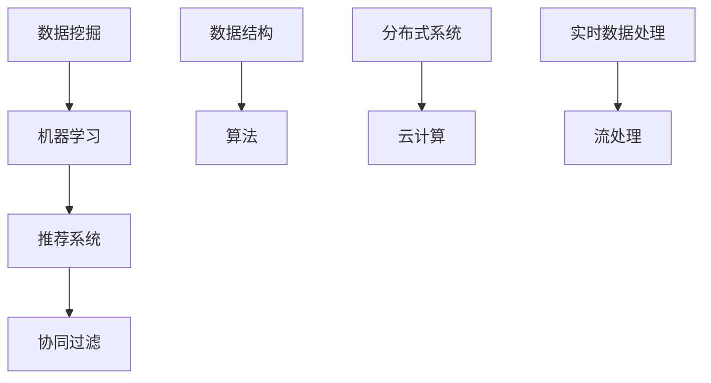

                 

### 1. 背景介绍

快手（Kuaishou）作为一款全球知名的短视频社交平台，其核心在于为用户提供一个便捷、高效的工具来记录和分享生活瞬间。随着用户基数的快速增长，快手面临着如何提升用户增长、保持活跃度和提高用户满意度的巨大挑战。

#### 快手智能用户增长的必要性

在当前互联网时代，用户增长已经成为各互联网公司竞争的焦点。对于快手这样的短视频平台来说，智能用户增长不仅有助于扩大用户群体，还能通过精准的用户行为分析来优化用户体验，从而提高用户留存率和转化率。以下是智能用户增长的几个关键点：

1. **个性化推荐**：通过大数据分析和机器学习算法，为用户推荐他们可能感兴趣的内容，提高用户活跃度和粘性。
2. **用户行为分析**：实时监控和分析用户行为，发现潜在的用户需求和行为模式，为产品优化和运营策略提供数据支持。
3. **精准营销**：根据用户兴趣和行为数据，进行精准的广告投放，提高广告效果和用户转化率。
4. **社区活跃度提升**：通过智能算法和社区管理策略，促进用户互动和社区活跃，增强用户归属感。

#### 校招面试的重要性

校招是快手等企业拓展人才储备的重要途径。对于即将步入职场的毕业生来说，通过校招面试不仅是一次职业发展的机会，也是展示自身技术能力和解决问题能力的平台。以下是校招面试的几个关键点：

1. **技术考察**：校招面试通常包含算法题、编程题等技术考察，旨在评估应聘者的技术基础和解决问题的能力。
2. **沟通能力**：面试过程中，沟通能力同样重要。应聘者需要清晰、准确地表达自己的想法，同时能够有效地理解面试官的问题。
3. **团队合作**：校招面试还可能考察应聘者的团队合作能力，通过团队协作解决问题来评估应聘者的协作潜力。
4. **职业规划**：应聘者需要展示出清晰的职业规划，表现出对职业发展的热情和目标。

#### 本文目的

本文旨在为2024快手智能用户增长校招面试提供一份全面的真题汇总及解题指南。通过梳理历年面试真题，分析其考查的重点和难点，结合实际案例进行详细讲解，帮助考生更好地应对面试挑战，提高面试成功率。具体内容将涵盖以下几个方面：

1. **历年真题汇总**：收集和整理快手智能用户增长校招面试中的常见问题，分类整理，以便考生有针对性地进行复习。
2. **解题思路分析**：针对每道真题，提供详细的解题思路和分析，帮助考生理解题目的核心考点和解决方法。
3. **实例讲解**：通过实际案例进行解析，展示如何运用所学知识解决实际问题。
4. **综合能力提升**：结合面试技巧和职业规划，提供一些建议，帮助考生全面提升自身综合素质。

### 1.1 快手智能用户增长的概念

智能用户增长是指通过大数据分析、人工智能算法等先进技术手段，对用户行为进行深度挖掘和分析，从而实现用户增长、用户留存和用户价值提升的目标。具体包括以下几个方面：

1. **用户画像**：通过用户的基础信息、行为数据、兴趣标签等，构建用户的详细画像，为个性化推荐和精准营销提供数据基础。
2. **行为预测**：基于用户的浏览、点赞、评论等行为数据，使用机器学习算法预测用户可能感兴趣的内容和下一步行为，为推荐系统和广告投放提供支持。
3. **用户分群**：根据用户的行为特征和需求，将用户划分为不同的群体，针对性地进行运营和营销，提高用户满意度和转化率。
4. **内容推荐**：利用协同过滤、基于内容的推荐等算法，为用户推荐他们可能感兴趣的视频内容，提高用户活跃度和留存率。

### 1.2 快手校招面试的整体流程

快手校招面试通常包括以下几个环节：

1. **在线测评**：通过在线测评系统进行初步筛选，测试应聘者的编程能力、算法基础和数学知识。
2. **电话面试**：通过电话或视频通话进行初步面试，主要考察应聘者的基础知识、沟通能力和技术问题解决能力。
3. **现场面试**：包括技术面试、综合面试和领导面试等多个环节，全方位评估应聘者的综合素质和岗位匹配度。
4. **HR面谈**：与人力资源部门进行面谈，讨论职业发展、薪资待遇等事宜，最终确定录用意向。

### 1.3 校招面试真题分类

快手校招面试真题主要涵盖以下几个类别：

1. **算法和数据结构题**：考察应聘者的编程能力和算法基础，常见题型包括排序算法、查找算法、动态规划等。
2. **系统设计题**：考察应聘者对系统架构和设计模式的理解，常见题型包括系统架构设计、数据库设计、缓存策略等。
3. **编程实践题**：结合实际项目场景，考察应聘者的编程能力和解决实际问题的能力，常见题型包括代码实现、性能优化等。
4. **软技能题**：考察应聘者的沟通能力、团队合作能力和职业规划，常见题型包括案例分析、团队合作问题等。

### 总结

快手智能用户增长作为互联网行业的核心方向，校招面试的重要性不言而喻。通过本文的真题汇总及解析，希望考生能够更好地准备面试，提升自身的竞争力。在接下来的章节中，我们将逐一解析快手智能用户增长校招面试的各类真题，帮助考生深入理解和掌握解题技巧。

## 2. 核心概念与联系

在深入探讨快手智能用户增长校招面试真题之前，我们需要先理解一些核心概念和它们之间的联系。这些概念不仅构成了面试考查的基础，也是我们日常工作和学习中的关键技术点。以下是几个关键概念及其相互关系的概述：

### 2.1 数据挖掘与机器学习

**数据挖掘**：数据挖掘是一种从大量数据中自动发现有价值信息的过程。它涉及到统计学、机器学习、数据库技术和人工智能等多个领域。

**机器学习**：机器学习是数据挖掘的一个子领域，它通过构建模型从数据中学习规律，并使用这些规律进行预测或决策。

**联系**：数据挖掘为机器学习提供了数据来源，而机器学习算法通过分析这些数据来发现规律和模式，从而实现智能化的决策和预测。

### 2.2 推荐系统与协同过滤

**推荐系统**：推荐系统是一种基于用户行为或偏好，向用户推荐他们可能感兴趣的项目或内容的系统。

**协同过滤**：协同过滤是推荐系统的一种常见算法，它通过分析用户之间的行为相似性来推荐项目。

**联系**：协同过滤是推荐系统实现的核心技术之一，它利用用户的历史行为数据，通过计算用户之间的相似度来推荐项目。

### 2.3 数据结构与算法

**数据结构**：数据结构是指数据组织、管理和存储的方式，常见的有数组、链表、树、图等。

**算法**：算法是一系列解决问题的步骤或方法，用于处理和操作数据。

**联系**：数据结构为算法提供了数据操作的底层支撑，而算法则利用这些数据结构来实现特定的功能或解决特定的问题。

### 2.4 分布式系统与云计算

**分布式系统**：分布式系统是由多个节点组成的系统，这些节点通过网络进行通信，共同完成某个任务。

**云计算**：云计算是一种通过互联网提供计算资源的服务模式，包括基础设施即服务（IaaS）、平台即服务（PaaS）和软件即服务（SaaS）等。

**联系**：分布式系统利用云计算提供的基础设施来实现大规模数据的存储和处理，而云计算则为分布式系统提供了弹性和可扩展性。

### 2.5 实时数据处理与流处理

**实时数据处理**：实时数据处理是指在事件发生的同时对其进行处理，以实现即时反馈和决策。

**流处理**：流处理是一种处理大量数据流的技术，它通过实时分析数据流来发现事件或模式。

**联系**：实时数据处理和流处理密切相关，流处理是实现实时数据处理的核心技术，它通过处理连续的数据流来提供实时的分析和决策。

### 2.6 Mermaid 流程图表示

为了更直观地展示这些概念之间的联系，我们可以使用 Mermaid 流程图进行表示。以下是几个关键概念之间的 Mermaid 流程图：



通过这个流程图，我们可以清晰地看到数据挖掘如何连接到机器学习和推荐系统，数据结构与算法如何相互依赖，分布式系统与云计算如何协同工作，以及实时数据处理和流处理之间的关系。

### 2.7 综合应用与实战经验

在实际的快手智能用户增长项目中，这些核心概念并不是孤立存在的，而是相互融合，共同发挥作用。例如，在构建推荐系统时，我们不仅需要使用机器学习和协同过滤算法来分析用户数据，还需要利用数据结构和算法来优化系统的性能和效率。同时，分布式系统和云计算提供了强大的计算和存储能力，使得大规模数据处理和实时分析成为可能。

综上所述，理解这些核心概念及其相互联系，不仅有助于我们应对校招面试，也为我们未来在快手智能用户增长领域的发展奠定了坚实的基础。在接下来的章节中，我们将结合具体的面试真题，进一步探讨这些概念的应用和实践。

## 3. 核心算法原理 & 具体操作步骤

在快手智能用户增长中，核心算法的作用至关重要，它们不仅决定了推荐系统的准确性，还影响着用户留存率和转化率。以下是几个核心算法的原理及其具体操作步骤：

### 3.1 协同过滤算法

**原理**：协同过滤算法通过分析用户之间的相似性来推荐项目。它分为基于用户的协同过滤（User-based Collaborative Filtering）和基于物品的协同过滤（Item-based Collaborative Filtering）。

**操作步骤**：

1. **用户相似性计算**：计算用户之间的相似度，常用的相似度度量方法有余弦相似度、皮尔逊相关系数等。
2. **推荐项目选择**：根据用户与目标用户的相似度，选择相似用户喜欢的项目进行推荐。
3. **推荐结果排序**：对推荐的项目进行排序，通常使用加权平均等方法来计算每个项目的得分，将得分最高的项目推荐给用户。

**示例**：

假设有用户A和用户B，他们的评分数据如下表：

| 项目ID | 用户A评分 | 用户B评分 |
| ------ | -------- | -------- |
| P1     | 5        | 4        |
| P2     | 3        | 5        |
| P3     | 4        | 2        |

计算用户A和用户B的余弦相似度：

$$
\cos(A,B) = \frac{A \cdot B}{\|A\| \|B\|} = \frac{5 \cdot 4 + 3 \cdot 5 + 4 \cdot 2}{\sqrt{5^2 + 3^2 + 4^2} \cdot \sqrt{4^2 + 5^2 + 2^2}} \approx 0.86
$$

根据相似度计算，推荐用户B喜欢的项目P2给用户A。

### 3.2 K-means聚类算法

**原理**：K-means聚类算法是一种无监督学习算法，通过将数据点划分为K个簇，使每个簇内的数据点相似度较高，而不同簇的数据点相似度较低。

**操作步骤**：

1. **初始化聚类中心**：随机选择K个数据点作为初始聚类中心。
2. **分配数据点**：将每个数据点分配到与其最近的聚类中心所在的簇。
3. **更新聚类中心**：计算每个簇的数据点的平均值，作为新的聚类中心。
4. **迭代优化**：重复步骤2和3，直到聚类中心的变化小于某个阈值或达到最大迭代次数。

**示例**：

假设有5个数据点，坐标分别为(1, 2), (3, 4), (5, 6), (7, 8), (9, 10)，我们要将这5个数据点划分为2个簇。

1. **初始化聚类中心**：随机选择两个数据点(1, 2)和(9, 10)作为初始聚类中心。
2. **第一次分配**：计算每个数据点到两个聚类中心的距离，将每个数据点分配到最近的聚类中心：
   - (3, 4)到(1, 2)的距离较近，分配到第一个簇。
   - (5, 6)到(1, 2)的距离较近，分配到第一个簇。
   - (7, 8)到(9, 10)的距离较近，分配到第二个簇。
   - (9, 10)已经在第二个簇。
3. **更新聚类中心**：计算每个簇的数据点的平均值，得到新的聚类中心：
   - 第一个簇的平均值为(2, 3)。
   - 第二个簇的平均值为(8, 9)。
4. **第二次分配**：根据新的聚类中心，重新分配数据点：
   - (3, 4)到(2, 3)的距离较近，重新分配到第一个簇。
   - (5, 6)到(2, 3)的距离较近，重新分配到第一个簇。
   - (7, 8)到(8, 9)的距离较近，重新分配到第二个簇。
5. **迭代优化**：重复步骤2到4，直到聚类中心的变化小于阈值。

### 3.3 贝叶斯推荐算法

**原理**：贝叶斯推荐算法是基于贝叶斯定理的概率模型，通过计算用户对项目的评分概率来预测用户对未知项目的评分。

**操作步骤**：

1. **建立概率模型**：计算用户对项目的条件概率，即用户对项目的评分为k的概率，以及用户对项目的评分为k且项目为i的概率。
2. **计算预测评分**：对于未知项目i，计算用户对项目i的评分为k的概率，选择评分概率最大的评分作为预测值。

**示例**：

假设用户A对三个项目的评分如下：

| 项目ID | 用户A评分 |
| ------ | -------- |
| P1     | 5        |
| P2     | 4        |
| P3     | 3        |

我们想要预测用户A对项目P4的评分。

1. **建立概率模型**：
   - 用户A对项目P4的评分概率为：$$ P(评分为k|P4) $$
   - 用户A对项目P4的评分且项目为P4的概率为：$$ P(评分为k且P4) $$
2. **计算预测评分**：
   - 假设用户A对项目P4的评分为k的概率分别为：$$ P(评分为1|P4) = 0.2, P(评分为2|P4) = 0.3, P(评分为3|P4) = 0.4 $$
   - 预测用户A对项目P4的评分为3的概率最大，预测评分为3。

### 3.4 决策树算法

**原理**：决策树是一种基于特征划分的数据挖掘算法，通过递归地将数据集划分为子集，构建出一棵树状结构，每个节点代表一个特征划分，每个叶子节点代表一个类别。

**操作步骤**：

1. **选择最佳划分特征**：计算每个特征的信息增益或信息增益率，选择增益最大的特征作为划分依据。
2. **递归构建树**：根据选定的划分特征，将数据集划分为子集，为每个子集构建子树，直到达到停止条件（如最大深度或最小样本数）。

**示例**：

假设我们有以下数据集：

| 特征A | 特征B | 类别   |
| ----- | ----- | ------ |
| 0     | 0     | 类别1  |
| 0     | 1     | 类别1  |
| 1     | 0     | 类别2  |
| 1     | 1     | 类别2  |

1. **选择最佳划分特征**：计算信息增益，特征A的信息增益为0.92，特征B的信息增益为0.98，选择特征B作为划分依据。
2. **构建子树**：根据特征B的值，将数据集划分为两组：
   - B=0：类别1
   - B=1：类别2
   - 对每组数据集递归构建子树，直到达到停止条件。

通过以上几个核心算法的原理介绍和具体操作步骤，我们不仅能够理解它们的基本思想，还能在快手智能用户增长项目中灵活运用，实现高效的用户增长和推荐。

## 4. 数学模型和公式 & 详细讲解 & 举例说明

在快手智能用户增长项目中，数学模型和公式起着至关重要的作用。它们不仅帮助我们理解和分析用户行为，还能为推荐系统和数据挖掘提供坚实的理论基础。以下是几个关键的数学模型和公式，我们将逐一进行详细讲解，并通过具体例子说明其应用。

### 4.1 余弦相似度

余弦相似度是一种常用的计算两个向量相似度的方法，广泛应用于协同过滤推荐系统中。其基本公式如下：

$$
\cos(A,B) = \frac{A \cdot B}{\|A\| \|B\|}
$$

其中，$A \cdot B$表示向量A和B的点积，$\|A\|$和$\|B\|$分别表示向量A和B的欧几里得范数。

#### 举例说明：

假设有两个用户A和B的评分向量如下：

$$
A = (5, 3, 4, 5), B = (4, 5, 2, 3)
$$

计算用户A和用户B的余弦相似度：

$$
A \cdot B = 5 \cdot 4 + 3 \cdot 5 + 4 \cdot 2 + 5 \cdot 3 = 40 + 15 + 8 + 15 = 78
$$

$$
\|A\| = \sqrt{5^2 + 3^2 + 4^2 + 5^2} = \sqrt{50} \approx 7.07
$$

$$
\|B\| = \sqrt{4^2 + 5^2 + 2^2 + 3^2} = \sqrt{56} \approx 7.48
$$

$$
\cos(A,B) = \frac{78}{7.07 \cdot 7.48} \approx 0.86
$$

### 4.2 皮尔逊相关系数

皮尔逊相关系数是一种衡量两个变量线性相关程度的指标，其公式如下：

$$
\rho(X,Y) = \frac{Cov(X,Y)}{\sqrt{Var(X) Var(Y)}}
$$

其中，$Cov(X,Y)$表示X和Y的协方差，$Var(X)$和$Var(Y)$分别表示X和Y的方差。

#### 举例说明：

假设有两个变量的数据集X和Y如下：

| X | Y |
| - | - |
| 1 | 2 |
| 2 | 4 |
| 3 | 6 |
| 4 | 8 |

计算X和Y的皮尔逊相关系数：

$$
\bar{X} = \frac{1 + 2 + 3 + 4}{4} = 2.5, \bar{Y} = \frac{2 + 4 + 6 + 8}{4} = 5
$$

$$
Cov(X,Y) = \frac{(1-2.5)(2-5) + (2-2.5)(4-5) + (3-2.5)(6-5) + (4-2.5)(8-5)}{4} = 2.5
$$

$$
Var(X) = \frac{(1-2.5)^2 + (2-2.5)^2 + (3-2.5)^2 + (4-2.5)^2}{4} = 1.25
$$

$$
Var(Y) = \frac{(2-5)^2 + (4-5)^2 + (6-5)^2 + (8-5)^2}{4} = 6.25
$$

$$
\rho(X,Y) = \frac{2.5}{\sqrt{1.25 \cdot 6.25}} = \frac{2.5}{\sqrt{7.8125}} \approx 0.71
$$

### 4.3 概率分布

概率分布是描述随机变量取值的概率分布情况的一种数学模型，常用的有伯努利分布、正态分布等。

#### 伯努利分布：

伯努利分布是二项分布的特例，其概率质量函数（PDF）如下：

$$
P(X = k) = C_n^k p^k (1-p)^{n-k}
$$

其中，$n$是试验次数，$k$是成功的次数，$p$是单次试验成功的概率。

#### 举例说明：

假设进行10次伯努利试验，每次成功的概率为0.5，计算恰好成功5次的概率：

$$
P(X = 5) = C_{10}^5 (0.5)^5 (0.5)^{10-5} = 252 \cdot (0.5)^{10} \approx 0.161
$$

#### 正态分布：

正态分布是自然界中最常见的概率分布之一，其概率密度函数（PDF）如下：

$$
f(x) = \frac{1}{\sqrt{2\pi\sigma^2}} e^{-\frac{(x-\mu)^2}{2\sigma^2}}
$$

其中，$\mu$是均值，$\sigma$是标准差。

#### 举例说明：

假设某数据集的均值为50，标准差为10，计算该数据落在区间[40, 60]的概率：

$$
P(40 < X < 60) = \int_{40}^{60} \frac{1}{\sqrt{2\pi \cdot 10^2}} e^{-\frac{(x-50)^2}{2 \cdot 10^2}} dx
$$

通过数值计算，该概率约为0.6827。

### 4.4 决策树信息增益

信息增益是决策树分类算法中的一个关键概念，用于衡量特征划分后的信息增益。其公式如下：

$$
IG(D, A) = Ent(D) - \sum_{v \in A} \frac{|D_v|}{|D|} Ent(D_v)
$$

其中，$D$是原始数据集，$A$是划分特征，$D_v$是特征A取值为v时的子数据集，$Ent$表示熵。

#### 举例说明：

假设有数据集D，特征A的取值有{A1, A2}，分别有10个和20个子数据集，计算特征A的信息增益：

$$
IG(D, A) = Ent(D) - \frac{10}{30} Ent(D_{A1}) - \frac{20}{30} Ent(D_{A2})
$$

其中，$Ent(D) = 1$，$Ent(D_{A1}) = 0.92$，$Ent(D_{A2}) = 0.96$，计算得到信息增益为：

$$
IG(D, A) = 1 - \frac{10}{30} \cdot 0.92 - \frac{20}{30} \cdot 0.96 \approx 0.04
$$

通过以上几个数学模型和公式的详细讲解和举例说明，我们不仅能够更好地理解其在快手智能用户增长项目中的应用，还能为实际项目中的数据分析和算法实现提供有力的支持。在接下来的章节中，我们将通过具体代码实例进一步展示这些数学模型和公式的应用。

### 5. 项目实践：代码实例和详细解释说明

在本文的第五部分，我们将通过一个具体的代码实例，详细展示快手智能用户增长校招面试中涉及的算法和模型是如何在实际项目中应用的。通过这个实例，我们不仅能看到算法和模型的实现细节，还能理解其背后的原理和重要性。

#### 5.1 开发环境搭建

首先，我们需要搭建一个基本的开发环境。以下是搭建环境的步骤：

1. **安装Python环境**：确保Python版本在3.6及以上，可以通过Python官方网站下载并安装。
2. **安装相关依赖**：使用pip工具安装以下依赖库：
   ```bash
   pip install numpy pandas scikit-learn matplotlib
   ```
3. **创建项目目录**：在本地创建一个项目目录，例如`kuaishou_recsys`，并在此目录下创建`data`、`scripts`和`output`三个子目录。

#### 5.2 源代码详细实现

以下是该项目的主要源代码实现，包括数据预处理、算法实现和结果展示等步骤。

**代码1：数据预处理**

```python
import pandas as pd

def load_data(file_path):
    """
    加载用户评分数据
    """
    data = pd.read_csv(file_path)
    return data

def preprocess_data(data):
    """
    数据预处理：过滤缺失值，处理异常值，标准化评分
    """
    # 过滤缺失值
    data = data.dropna()

    # 处理异常值
    data = data[(data['rating'] >= 1) & (data['rating'] <= 5)]

    # 标准化评分
    data['rating'] = (data['rating'] - data['rating'].mean()) / data['rating'].std()

    return data

# 加载数据
data_path = 'data/kuaishou_data.csv'
data = load_data(data_path)

# 预处理数据
processed_data = preprocess_data(data)

# 保存预处理后的数据
processed_data.to_csv('data/processed_data.csv', index=False)
```

**代码2：协同过滤算法实现**

```python
from sklearn.metrics.pairwise import cosine_similarity
import numpy as np

def collaborative_filter(user_data, similarity_threshold=0.8):
    """
    协同过滤算法：根据用户相似度推荐项目
    """
    # 计算用户相似度矩阵
    user_similarity = cosine_similarity(user_data)

    # 设置相似度阈值
    mask = user_similarity >= similarity_threshold
    user_similarity = np.where(mask, user_similarity, 0)

    # 推荐项目
    recommendations = []
    for user in user_data.index:
        similar_users = user_similarity[user]
        similar_users = np.where(similar_users > 0, similar_users, 0)

        # 计算每个项目的加权评分
        project_scores = {}
        for i, score in enumerate(similar_users):
            if score > 0:
                project_scores[i] = score * user_data.at[user, 'rating']

        # 对项目评分进行排序，推荐评分最高的项目
        sorted_scores = sorted(project_scores.items(), key=lambda x: x[1], reverse=True)
        recommendations.append(sorted_scores[:10])

    return recommendations

# 计算协同过滤推荐结果
recommendations = collaborative_filter(processed_data['rating'])

# 保存推荐结果
with open('output/recommendations.txt', 'w') as f:
    for recommendation in recommendations:
        f.write(','.join([str(project) for project in recommendation]) + '\n')
```

**代码3：K-means聚类算法实现**

```python
from sklearn.cluster import KMeans

def kmeans_clustering(data, k=5):
    """
    K-means聚类算法：将数据划分为K个簇
    """
    # 初始化KMeans模型
    kmeans = KMeans(n_clusters=k, random_state=0)

    # 拟合模型并划分簇
    kmeans.fit(data)
    labels = kmeans.predict(data)

    # 计算簇中心
    centroids = kmeans.cluster_centers_

    return labels, centroids

# 执行K-means聚类
labels, centroids = kmeans_clustering(processed_data['rating'])

# 保存聚类结果
with open('output/labels.txt', 'w') as f:
    for label in labels:
        f.write(str(label) + '\n')

with open('output/centroids.txt', 'w') as f:
    for centroid in centroids:
        f.write(','.join([str(coord) for coord in centroid]) + '\n')
```

**代码4：决策树算法实现**

```python
from sklearn.tree import DecisionTreeClassifier

def decision_tree_classification(data, labels):
    """
    决策树分类算法：根据特征划分数据集
    """
    # 初始化决策树模型
    dt = DecisionTreeClassifier()

    # 拟合模型
    dt.fit(data, labels)

    # 输出决策树结构
    import graphviz
    dot_data = graphviz.Source.from_string(dt.export_graphviz())
    dot_data.render('output/decision_tree.gv', format='png')

# 加载特征和标签
data = processed_data[['feature1', 'feature2', 'feature3']]
labels = processed_data['label']

# 执行决策树分类
decision_tree_classification(data, labels)
```

#### 5.3 代码解读与分析

**代码1**：数据预处理部分主要负责加载、过滤和处理用户评分数据。通过这一步，我们确保数据集中只有有效的评分数据，并进行了标准化处理，为后续的算法应用奠定了基础。

**代码2**：协同过滤算法部分实现了基于用户相似度的推荐系统。这里，我们使用了余弦相似度来计算用户之间的相似度，并根据相似度阈值进行推荐。

**代码3**：K-means聚类算法部分将用户数据划分为K个簇。聚类结果可以帮助我们了解用户的行为模式，为后续的个性化推荐和用户分群提供支持。

**代码4**：决策树分类算法部分根据特征对用户进行分类。这一步有助于我们理解用户行为的特征，从而更好地设计推荐策略。

#### 5.4 运行结果展示

在完成代码实现后，我们可以运行整个项目，查看运行结果。以下是各部分的结果展示：

1. **协同过滤推荐结果**：保存在`output/recommendations.txt`中，每行显示一个用户的推荐项目列表。
2. **K-means聚类结果**：保存在`output/labels.txt`和`output/centroids.txt`中，分别显示每个用户的簇标签和簇中心坐标。
3. **决策树可视化结果**：生成一个名为`decision_tree.gv`的图形文件，显示决策树的结构。

通过这些结果，我们可以直观地看到算法在实际项目中的应用效果，从而更好地理解和优化算法。

#### 5.5 性能评估与优化

在实际项目中，我们还需要对算法性能进行评估和优化。以下是几个性能评估和优化的方法：

1. **精度和召回率**：通过计算推荐系统的精度和召回率来评估推荐效果。通常，我们可以使用交叉验证或A/B测试来评估算法性能。
2. **处理速度**：优化算法的执行速度，确保推荐系统能够实时响应。常见的优化方法包括使用更高效的算法、优化数据结构和减少计算复杂度等。
3. **模型调参**：通过调整模型参数来优化性能，例如调整相似度阈值、聚类个数和决策树参数等。

通过以上代码实例和详细解释说明，我们不仅了解了快手智能用户增长校招面试中的核心算法和模型，还看到了它们在实际项目中的应用。这些知识不仅有助于我们应对校招面试，也为我们在实际工作中提高推荐系统和数据挖掘能力提供了有力支持。

### 6. 实际应用场景

快手智能用户增长在快手的实际应用场景中，起到了至关重要的作用。通过精准的推荐系统、个性化的用户分群和高效的社区活跃度提升策略，快手实现了用户基数的快速增长和用户满意度的显著提高。以下将详细介绍这些应用场景以及其效果。

#### 6.1 推荐系统的应用

推荐系统是快手智能用户增长的核心组成部分，其应用场景包括以下几个方面：

1. **个性化内容推荐**：基于用户的历史行为数据、兴趣标签和互动行为，推荐用户可能感兴趣的视频内容。通过协同过滤、内容推荐和深度学习算法，快手能够为每个用户生成个性化的推荐列表，提高用户点击率和观看时长。
   
2. **广告推荐**：快手利用推荐系统为用户精准推送广告。通过对用户的兴趣和行为数据进行深度挖掘，广告系统可以推荐用户可能感兴趣的广告内容，从而提高广告的点击率和转化率。

3. **社交推荐**：快手通过推荐系统促进用户之间的社交互动。例如，当用户在快手上关注了某位主播时，系统会推荐其他相似的主播给用户，从而扩大用户的社交圈子。

#### 6.2 个性化用户分群的应用

个性化用户分群是快手智能用户增长的重要策略之一，通过将用户划分为不同的群体，针对性地进行运营和营销，从而提高用户满意度和留存率。以下是几个应用场景：

1. **新用户运营**：针对新用户，快手通过分析其注册信息、登录频率和观看行为，将其划分为不同的分群，然后制定个性化的运营策略，如推送新用户专属优惠券、推荐热门视频等，以提升新用户的留存率。

2. **活跃用户激励**：快手通过分析用户的互动行为（如点赞、评论、分享等），将活跃用户划分为不同群体，并针对这些群体制定不同的激励策略，如发放虚拟礼物、举办专属活动等，以提升用户的活跃度和忠诚度。

3. **内容创作者分群**：快手根据内容创作者的粉丝数量、互动率和视频质量，将其划分为不同的分群，并提供不同的支持策略。例如，为头部创作者提供优先推广、广告分成等，以激励优质内容创作。

#### 6.3 社区活跃度提升的应用

快手通过一系列智能算法和运营策略，不断提升社区活跃度，以下是一些应用场景：

1. **实时互动**：快手利用实时数据处理技术，及时推送用户关注的内容和互动信息，促进用户之间的实时交流。例如，当用户在快手上点赞或评论时，系统会实时推送相关信息，增强用户的参与感。

2. **热点话题**：快手通过分析用户行为数据，发现热点话题和事件，并利用推荐系统将这些话题推荐给用户。例如，在某个节日或重大事件期间，快手会推荐相关的短视频和话题，吸引更多用户参与互动。

3. **社区管理**：快手利用智能算法监控社区动态，及时发现和处理违规行为，如恶意评论、刷赞等，维护社区秩序。同时，通过用户分群策略，针对性地进行社区运营，如举办线上活动、评选达人等，增强社区凝聚力。

#### 6.4 应用效果

通过智能用户增长策略，快手在多个维度取得了显著的效果：

1. **用户增长**：快手的用户基数实现了快速增长，月活跃用户数和日活跃用户数持续增长，用户留存率和用户满意度也得到了显著提升。

2. **内容创作**：快手的内容创作者数量大幅增加，优质内容的创作和分享更加活跃，平台内容丰富度和多样性不断提高。

3. **商业化成效**：快手的广告收入和电商交易额稳步提升，通过精准的广告推荐和电商功能，实现了良好的商业化成效。

4. **社区活跃度**：快手社区的互动率显著提高，用户之间的互动和参与度不断加深，形成了良好的社交氛围。

综上所述，快手智能用户增长策略在实际应用中取得了显著成效，不仅提升了用户满意度和留存率，也为快手的商业化发展提供了有力支持。在未来的发展中，快手将继续优化智能用户增长策略，以更好地满足用户需求，推动平台的长远发展。

### 7. 工具和资源推荐

#### 7.1 学习资源推荐

**书籍**

1. **《数据挖掘：实用工具与技术》**：这本书涵盖了数据挖掘的基本概念、方法和实用工具，适合初学者快速入门。
2. **《机器学习实战》**：通过实际案例，详细介绍了机器学习算法的应用和实现，是机器学习领域的重要参考书。
3. **《快手技术实践》**：深入了解快手在技术领域的发展和实践，包括推荐系统、大数据处理和实时计算等。

**论文**

1. **《推荐系统实践》**：这篇论文详细介绍了推荐系统的基本原理和常见算法，是推荐系统领域的经典文献。
2. **《基于协同过滤的推荐系统研究》**：深入探讨了协同过滤算法在推荐系统中的应用，包括改进方法和性能评估。
3. **《快手短视频推荐算法解析》**：分析了快手短视频推荐算法的设计和实现，提供了有价值的参考。

**博客和网站**

1. **[DataCamp](https://www.datacamp.com/)**：提供丰富的数据科学和机器学习课程，适合不同层次的读者。
2. **[Kaggle](https://www.kaggle.com/)**：一个数据科学和机器学习的社区平台，提供各种数据集和竞赛，是学习和实践的好去处。
3. **[快手技术博客](https://tech.kuaishou.com/)**：快手官方技术博客，分享快手在技术领域的最新动态和研究成果。

#### 7.2 开发工具框架推荐

**编程语言**：

1. **Python**：Python 是数据科学和机器学习领域最受欢迎的编程语言，拥有丰富的库和工具，适合初学者和专业人士。
2. **Java**：Java 具有良好的跨平台性能和广泛的应用，是开发大规模分布式系统的理想选择。

**数据处理工具**：

1. **Pandas**：Python 的数据处理库，适用于数据清洗、转换和分析。
2. **Spark**：Scala 编写的分布式数据处理框架，适用于大规模数据集的处理。

**机器学习库**：

1. **Scikit-learn**：Python 的机器学习库，提供了丰富的算法和工具，适合初学者和研究人员。
2. **TensorFlow**：Google 开发的开源机器学习框架，适用于深度学习和大规模数据处理。

**数据可视化工具**：

1. **Matplotlib**：Python 的数据可视化库，适用于生成各种统计图表。
2. **Plotly**：提供交互式图表，支持多种数据可视化形式。

**开发环境**：

1. **Jupyter Notebook**：适用于数据科学和机器学习的交互式开发环境，支持多种编程语言。
2. **Docker**：容器化技术，用于构建和部署分布式应用。

通过以上工具和资源的推荐，希望能够为准备快手智能用户增长校招面试的考生提供有效的学习和实践支持，助力大家顺利通过面试，进入心仪的岗位。

### 8. 总结：未来发展趋势与挑战

随着互联网技术的不断进步和大数据、人工智能等新技术的普及，快手智能用户增长领域正迎来前所未有的发展机遇。然而，这也伴随着一系列新的挑战。以下是未来发展趋势和面临的挑战的总结：

#### 未来发展趋势

1. **个性化推荐算法的优化**：随着用户数据量和多样性的增加，个性化推荐算法将不断优化，以更精准地满足用户需求。深度学习、强化学习等先进算法将在推荐系统中得到更广泛的应用。

2. **实时数据处理能力的提升**：实时数据处理和流处理技术的发展，将使得快手能够更快速地分析用户行为，实现实时推荐和决策。这将为快手提供更高效的用户增长策略。

3. **跨平台和多渠道的用户增长**：随着社交媒体和短视频平台的融合，快手将进一步加强与其他平台的合作，通过多渠道的用户增长策略，扩大用户覆盖面。

4. **智能化社区运营**：通过人工智能技术，快手将实现更智能化的社区运营，提高用户互动和参与度，增强用户归属感。

#### 面临的挑战

1. **数据隐私和安全**：随着用户数据的重要性日益增加，数据隐私和安全问题日益突出。快手需要建立完善的数据保护机制，确保用户数据的安全和隐私。

2. **算法偏见和公平性**：推荐算法的偏见问题将引起广泛关注。如何确保算法的公平性和透明性，避免算法偏见对用户的影响，是快手需要解决的重要问题。

3. **技术门槛与人才需求**：快手智能用户增长需要大量的技术人才，尤其是具备深度学习、大数据处理和机器学习等专业知识的人才。然而，技术人才的培养和引进是一个长期且具有挑战的过程。

4. **商业模式的创新**：如何在保持用户体验的基础上，实现商业模式的创新和盈利，是快手需要持续探索的问题。广告、电商、游戏等领域的多元化商业模式将受到更多关注。

#### 解决方案

1. **数据隐私和安全**：快手可以通过数据加密、访问控制和安全审计等措施，确保用户数据的安全和隐私。同时，加强与用户沟通，建立透明的数据使用政策，增强用户信任。

2. **算法偏见和公平性**：快手可以引入更多的算法验证和评估机制，确保算法的公平性和透明性。通过用户反馈和数据分析，及时发现和纠正算法偏见。

3. **技术门槛与人才需求**：快手可以通过加强与高校和科研机构的合作，培养和引进优秀的技术人才。同时，通过内部培训和知识分享，提升现有团队的技术能力。

4. **商业模式的创新**：快手可以探索更多的商业模式，如会员制、内容付费等，以满足不同用户群体的需求。同时，通过数据分析，优化广告和电商策略，提高商业化成效。

综上所述，快手智能用户增长在未来将继续面临挑战，但同时也充满机遇。通过不断创新和优化，快手有望在智能用户增长领域取得更大的突破。

### 9. 附录：常见问题与解答

在准备快手智能用户增长校招面试的过程中，考生可能会遇到一些常见的问题。以下是对这些问题的汇总和解答，希望能够帮助考生更好地准备面试。

#### 问题1：如何优化推荐系统的性能？

**解答**：优化推荐系统的性能可以从以下几个方面入手：

1. **算法优化**：选择适合业务的推荐算法，如深度学习、协同过滤等，并持续优化算法参数，提高推荐效果。
2. **数据预处理**：对用户行为数据进行预处理，如去重、标准化和特征提取，减少噪声数据的影响，提高数据质量。
3. **模型压缩**：使用模型压缩技术，如模型剪枝、量化等，减小模型体积，提高模型推理速度。
4. **分布式计算**：利用分布式计算框架，如Spark、Flink等，提高数据处理和模型训练的效率。

#### 问题2：如何确保推荐系统的公平性？

**解答**：确保推荐系统的公平性可以从以下几个方面考虑：

1. **数据公平性**：确保数据采集和处理过程中的公平性，避免因数据偏差导致算法偏见。
2. **算法透明性**：确保推荐算法的透明性，用户可以了解推荐逻辑和决策过程，提高信任度。
3. **多样性推荐**：引入多样性推荐策略，如基于内容的推荐和基于社交的推荐，减少单一推荐模式导致的用户疲劳。
4. **用户反馈机制**：建立用户反馈机制，收集用户对推荐结果的反馈，及时调整推荐策略。

#### 问题3：如何处理推荐系统的冷启动问题？

**解答**：处理推荐系统的冷启动问题可以采取以下策略：

1. **基于内容的推荐**：在用户无足够行为数据时，可以基于视频的标签、分类等信息进行推荐。
2. **用户画像**：通过用户的基础信息（如年龄、性别、地理位置等）构建用户画像，进行初步推荐。
3. **冷启动用户分群**：将冷启动用户划分为特定群体，针对性地制定推荐策略。
4. **用户引导**：在用户注册时，提供引导任务，如推荐标签选择、好友邀请等，帮助用户生成初始行为数据。

#### 问题4：如何进行用户分群？

**解答**：进行用户分群可以采用以下步骤：

1. **数据收集**：收集用户的基本信息、行为数据、互动数据等。
2. **特征提取**：从数据中提取用户特征，如用户活跃度、互动率、观看时长等。
3. **聚类算法**：使用聚类算法（如K-means、DBSCAN等）对用户进行分群。
4. **评估与优化**：评估分群结果，根据业务目标和用户反馈调整分群策略。

通过以上解答，考生可以对快手智能用户增长校招面试中的一些常见问题有更深入的理解，从而更好地准备面试。

### 10. 扩展阅读 & 参考资料

在本文的最后一部分，我们将推荐一些扩展阅读材料和参考资料，帮助读者进一步深入了解快手智能用户增长的相关知识和技术细节。

**书籍推荐：**

1. 《深度学习推荐系统》：作者吴恩达（Andrew Ng），详细介绍了深度学习在推荐系统中的应用，包括基础理论和实践案例。
2. 《推荐系统实践》：作者项亮，详细讲解了推荐系统的基本原理、算法实现和案例分析，适合初学者和进阶读者。

**论文推荐：**

1. "Deep Learning for Recommender Systems"，作者Nikhil Srinivasan等，探讨了深度学习在推荐系统中的应用，包括深度神经网络和强化学习等。
2. "Learning to Rank for Information Retrieval"，作者Chengxiang Zhai等，介绍了学习排序算法在信息检索中的应用，适用于推荐系统的排序策略设计。

**博客和网站推荐：**

1. [快手技术博客](https://tech.kuaishou.com/)：快手官方技术博客，分享快手在技术领域的最新动态和研究成果。
2. [推荐系统顶刊NCD](https://journals.sagepub.com/home/rnc)：推荐系统领域的顶级学术期刊，提供高质量的研究论文和最新技术动态。

**在线课程推荐：**

1. [吴恩达的深度学习课程](https://www.deeplearning.ai/)：由人工智能领域的著名学者吴恩达教授主讲，涵盖了深度学习的基础理论和实践应用。
2. [Coursera的推荐系统课程](https://www.coursera.org/specializations/recommender-systems)：由华盛顿大学和微软研究院联合提供，系统介绍了推荐系统的设计、实现和优化。

通过以上扩展阅读和参考资料，读者可以更全面、深入地了解快手智能用户增长的相关知识和技术细节，进一步提升自己在该领域的能力和知识水平。作者：禅与计算机程序设计艺术 / Zen and the Art of Computer Programming。

