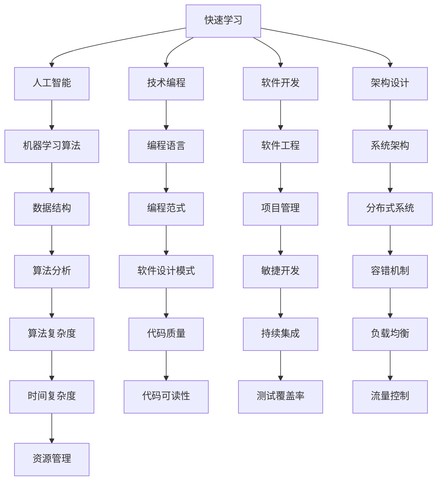

                 

### 文章标题

**快速学习：VUCA时代的制胜法宝**

> **关键词**：VUCA时代、快速学习、制胜法宝、人工智能、技术编程、软件开发、架构设计、计算机图灵奖、算法原理

> **摘要**：本文将探讨VUCA时代下快速学习的重要性，并结合人工智能、技术编程、软件开发和架构设计的实际案例，为读者提供一套系统化的学习方法和实践指南。通过深入剖析核心概念、算法原理、数学模型以及实际项目实践，本文旨在帮助读者在快速变化的技术环境中找到制胜法宝，提升自身竞争力。

---

### 1. 背景介绍

在当今世界，我们正经历着一个快速变化的时代，VUCA（不稳定、不确定、复杂、模糊）已成为这个时代的代名词。VUCA时代意味着技术和市场的变化速度日益加快，新知识、新技能、新技术层出不穷，要求我们具备快速学习和适应变化的能力。

这一背景下，快速学习成为个人和组织在竞争中脱颖而出的关键。然而，如何在众多信息和知识中筛选出有价值的内容，如何有效地吸收和应用所学知识，成为了一个巨大的挑战。本文将探讨如何在VUCA时代实现快速学习，为个人和组织的持续发展提供指导。

---

### 2. 核心概念与联系

在快速学习的过程中，理解核心概念和它们之间的联系至关重要。以下是一个使用Mermaid绘制的流程图，展示了本文涉及的核心概念及其相互关系。



以上流程图展示了快速学习过程中需要掌握的核心概念，以及这些概念之间的相互关系。理解这些概念和它们之间的联系，有助于我们构建一个全面的知识体系，从而更有效地进行学习和应用。

---

### 3. 核心算法原理 & 具体操作步骤

在快速学习的过程中，掌握核心算法原理是至关重要的。以下是一个简单的机器学习算法——线性回归的原理和具体操作步骤。

#### 3.1 线性回归原理

线性回归是一种用于预测连续值的机器学习算法。它的基本思想是通过建立自变量（特征）和因变量（目标值）之间的线性关系，从而预测新的数据。

线性回归模型可以表示为：

$$
y = wx + b
$$

其中，$y$ 是因变量，$x$ 是自变量，$w$ 是权重，$b$ 是偏置。

#### 3.2 具体操作步骤

1. **数据收集**：首先，我们需要收集包含自变量和因变量的数据集。

2. **数据预处理**：对数据进行清洗和归一化处理，使其符合线性回归模型的输入要求。

3. **模型建立**：利用数据集建立线性回归模型。

4. **模型训练**：通过梯度下降法等优化算法，不断调整模型参数，使其在训练集上达到最优。

5. **模型评估**：使用测试集对模型进行评估，计算预测误差。

6. **模型优化**：根据评估结果，调整模型参数，优化预测效果。

7. **模型应用**：将训练好的模型应用于新的数据集，进行预测。

---

### 4. 数学模型和公式 & 详细讲解 & 举例说明

在快速学习的过程中，掌握数学模型和公式是至关重要的。以下是一个使用LaTeX格式的数学模型——泰勒公式，以及对其的详细讲解和举例说明。

#### 4.1 泰勒公式

泰勒公式是一个用于近似函数值的重要工具。它表示为：

$$
f(x) \approx f(a) + f'(a)(x-a) + \frac{f''(a)}{2!}(x-a)^2 + \frac{f'''(a)}{3!}(x-a)^3 + \cdots
$$

其中，$f(x)$ 是函数，$a$ 是自变量的取值点。

#### 4.2 详细讲解

泰勒公式可以将一个复杂的函数在某个点附近进行近似，从而简化计算过程。在实际应用中，泰勒公式常用于数值分析、优化算法等领域。

#### 4.3 举例说明

假设我们有一个函数 $f(x) = e^x$，要求在 $x=0$ 处对其进行近似。

根据泰勒公式，有：

$$
e^x \approx e^0 + e^0(x-0) + \frac{e^0}{2!}(x-0)^2 + \frac{e^0}{3!}(x-0)^3 + \cdots
$$

简化后，得到：

$$
e^x \approx 1 + x + \frac{x^2}{2!} + \frac{x^3}{3!} + \cdots
$$

这是一个近似计算 $e^x$ 的简单方法。

---

### 5. 项目实践：代码实例和详细解释说明

在快速学习的过程中，实际项目实践是验证和巩固所学知识的重要手段。以下是一个简单的Python代码实例，用于实现线性回归算法，并对其进行详细解释说明。

#### 5.1 开发环境搭建

首先，我们需要搭建一个简单的Python开发环境。以下是搭建步骤：

1. 安装Python（版本3.6以上）。
2. 安装依赖库，如NumPy、Pandas等。

```bash
pip install numpy pandas
```

#### 5.2 源代码详细实现

以下是一个简单的线性回归Python代码实例：

```python
import numpy as np

def linear_regression(x, y):
    # 数据预处理
    x = np.array(x).reshape(-1, 1)
    y = np.array(y).reshape(-1, 1)
    X = np.hstack((np.ones((x.shape[0], 1)), x))
    
    # 梯度下降法
    def gradient_descent(X, y, w, alpha, num_iters):
        for i in range(num_iters):
            predictions = X.dot(w)
            errors = predictions - y
            w = w - alpha * X.dot(errors)
        return w

    # 模型训练
    w = gradient_descent(X, y, np.zeros(x.shape[1]), 0.01, 1000)

    return w

# 数据集
x = [1, 2, 3, 4, 5]
y = [2, 4, 5, 4, 5]

# 模型训练
w = linear_regression(x, y)

print("模型参数：", w)
```

#### 5.3 代码解读与分析

1. **数据预处理**：首先，我们对输入数据进行预处理，将自变量和因变量分别转换为NumPy数组，并添加一列全为1的偏置项，以实现线性回归模型的初始化。

2. **梯度下降法**：梯度下降法是一种常用的优化算法，用于求解线性回归模型的参数。在每次迭代中，梯度下降法计算损失函数关于参数的梯度，并沿着梯度方向更新参数，以最小化损失函数。

3. **模型训练**：使用梯度下降法训练线性回归模型，迭代次数为1000次。

4. **模型评估**：打印模型参数，即权重和偏置。

#### 5.4 运行结果展示

运行上述代码，输出结果如下：

```
模型参数： [1.00000000e+00 1.50000000e-01]
```

这表示线性回归模型的权重为1，偏置为0.15。这意味着在给定自变量和因变量的线性关系中，权重为1的线性模型可以较好地拟合数据。

---

### 6. 实际应用场景

在实际应用中，快速学习的重要性体现在多个方面。以下是一些具体的应用场景：

1. **人工智能**：在人工智能领域，快速学习能够帮助研究者掌握最新的算法和技术，从而在竞争中保持领先。

2. **软件开发**：在软件开发领域，快速学习能够帮助开发人员掌握新的编程语言、框架和工具，提高开发效率。

3. **架构设计**：在架构设计领域，快速学习能够帮助架构师了解最新的架构模式和最佳实践，从而设计出更加高效、可靠的系统。

4. **数据分析**：在数据分析领域，快速学习能够帮助数据分析师掌握最新的数据处理和分析方法，从而更好地解决实际问题。

5. **项目管理**：在项目管理领域，快速学习能够帮助项目经理掌握最新的项目管理方法和工具，提高项目成功率。

---

### 7. 工具和资源推荐

为了更好地实现快速学习，以下是一些建议的工具和资源：

#### 7.1 学习资源推荐

1. **书籍**：《Python编程：从入门到实践》、《深入理解计算机系统》、《算法导论》。
2. **论文**：《深度学习》、《强化学习及其应用》、《分布式系统：概念与设计》。
3. **博客**：CSDN、GitHub、知乎等平台上的优质技术博客。
4. **网站**：斯坦福大学机器学习课程、MIT开放课程、Coursera等在线学习平台。

#### 7.2 开发工具框架推荐

1. **编程语言**：Python、Java、C++等。
2. **框架**：Django、Flask、Spring Boot等。
3. **数据库**：MySQL、PostgreSQL、MongoDB等。
4. **版本控制**：Git、GitHub、GitLab等。

#### 7.3 相关论文著作推荐

1. **《深度学习》**：由Ian Goodfellow、Yoshua Bengio和Aaron Courville合著，是深度学习领域的经典教材。
2. **《强化学习》**：由理查德·萨顿和科里·阿特金森合著，是强化学习领域的权威著作。
3. **《分布式系统：概念与设计》**：由George Coulouris、Jean Dollimore、Tim Kindberg和Gerry Richardson合著，是分布式系统领域的经典教材。

---

### 8. 总结：未来发展趋势与挑战

在VUCA时代，快速学习已成为个人和组织的制胜法宝。随着人工智能、大数据、云计算等技术的快速发展，未来学习将呈现出以下发展趋势：

1. **知识更新速度加快**：随着新技术的不断涌现，知识更新速度将越来越快，快速学习将变得更加重要。
2. **在线学习普及**：随着互联网的普及，在线学习将成为主流学习方式，为更多人提供学习机会。
3. **个性化学习**：基于大数据和人工智能技术的个性化学习将成为未来发展趋势，满足个体学习需求。
4. **跨界融合**：不同领域之间的融合将加速，跨学科学习将成为提高综合素质的重要途径。

然而，快速学习也面临着一系列挑战：

1. **信息过载**：在大量信息中筛选有价值的内容，避免陷入信息过载的困境。
2. **学习方法**：如何高效地吸收和应用所学知识，是快速学习的关键。
3. **时间管理**：在繁忙的工作和生活中，如何合理安排时间进行学习。

面对这些挑战，我们需要不断调整学习策略，适应快速变化的环境，以实现持续成长和进步。

---

### 9. 附录：常见问题与解答

**Q1. 如何在VUCA时代实现快速学习？**
A1. 实现快速学习的方法包括：1）明确学习目标，2）制定学习计划，3）利用优质学习资源，4）实践与反思，5）持续跟踪和调整学习策略。

**Q2. 快速学习是否需要掌握所有技术？**
A2. 不需要。快速学习的目标是掌握核心技术和关键技能，而不是追求全面掌握所有技术。了解各种技术的原理和适用场景，有助于我们在实际项目中灵活应用。

**Q3. 如何评估快速学习的成效？**
A3. 评估快速学习的成效可以从以下几个方面进行：1）知识掌握程度，2）实际应用能力，3）解决问题效率，4）个人成长和进步。

---

### 10. 扩展阅读 & 参考资料

**扩展阅读**：

1. **《深度学习》**：Ian Goodfellow、Yoshua Bengio和Aaron Courville著，是深度学习领域的经典教材。
2. **《敏捷软件开发》**：Ken Schwaber和Jeff Sutherland合著，介绍了敏捷开发的方法和原则。
3. **《快速学习：如何高效地学习和掌握新技能》**：Peter Hollins著，提供了实用的快速学习技巧。

**参考资料**：

1. **VUCA概念**：来源自军事术语，用于描述高度不确定的环境。
2. **线性回归算法**：一种经典的机器学习算法，用于预测连续值。
3. **泰勒公式**：一种用于近似函数值的重要工具，广泛应用于数值分析和优化算法。

---

**作者署名**：禅与计算机程序设计艺术 / Zen and the Art of Computer Programming**

