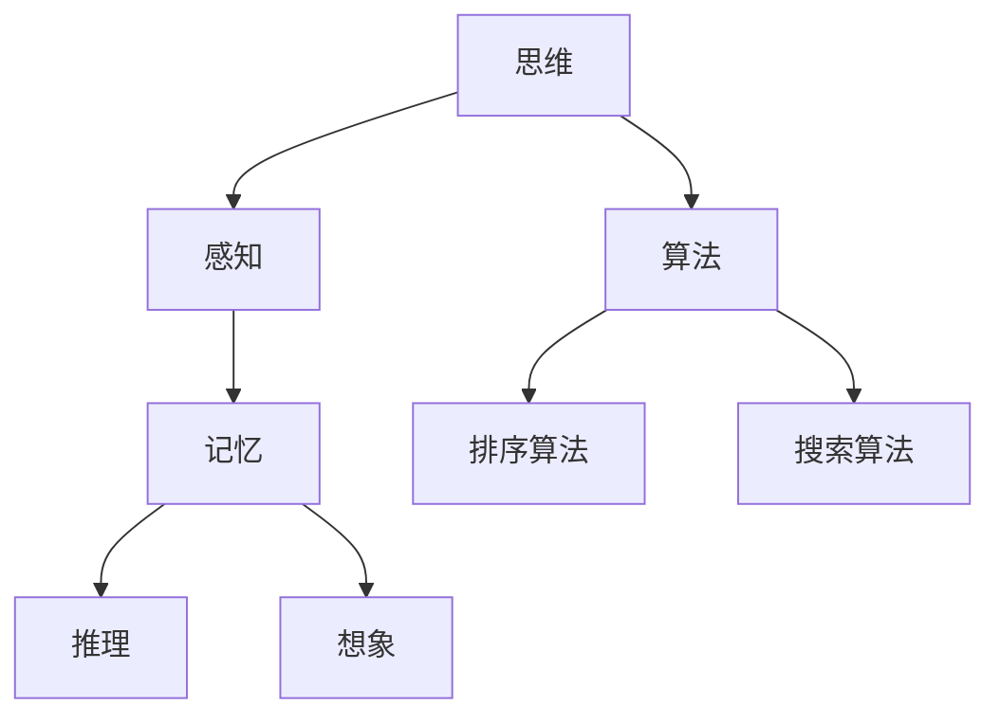

                 

# 文章标题

《思维与表达：结构化的内在联系》

> 关键词：思维、表达、结构化、内在联系、计算机科学、编程、算法

> 摘要：本文深入探讨了思维与表达之间的关系，特别是如何通过结构化的方法来提高我们的思考质量和表达能力。文章首先介绍了思维的基本原理，随后阐述了结构化的定义和重要性。接着，通过计算机科学和编程的实例，展示了结构化思维在实践中的应用。最后，本文总结了结构化思维与表达之间的内在联系，并提出了未来发展的挑战和机遇。

## 1. 背景介绍

在当今信息化和数字化的时代，计算机科学已经成为各个行业的基础和支撑。编程作为一种语言，让我们能够与计算机进行交流，实现各种复杂的功能和任务。然而，编程不仅需要掌握特定的编程语言，更重要的是要具备良好的思维能力和表达能力。

思维是人类认知活动的基础，它决定了我们如何理解世界、解决问题和创新。表达则是思维的外在表现，通过语言、文字、图表等形式将思维的内容传递给他人。在计算机科学领域，良好的思维和表达能力可以帮助我们设计出更高效、更可靠的算法和系统。

结构化思维是一种重要的思维方式，它强调逻辑性、系统性和层次性。结构化思维要求我们在解决问题时，能够将复杂的问题分解为若干个简单的部分，并明确各个部分之间的关系。这种思维方式在计算机科学中具有重要意义，因为计算机科学的本质就是处理和解决复杂的问题。

本文将围绕思维与表达之间的关系，探讨结构化思维在计算机科学和编程中的应用，并分析结构化思维如何提高我们的思考质量和表达能力。

## 2. 核心概念与联系

### 2.1 思维的基本原理

思维是人类大脑对信息进行加工和处理的过程。思维的基本原理包括感知、记忆、推理和想象等。感知是指通过五官获取外界信息的过程；记忆则是将感知到的信息存储在大脑中的过程；推理是通过已有的知识和信息来推断和解决问题；想象则是在已有知识和信息的基础上，进行创造性思维和构思。

在计算机科学中，我们可以将思维的基本原理抽象为算法。算法是计算机解决问题的一系列步骤和方法，它模拟了人类思维的过程。例如，排序算法通过比较和交换元素，将一组数据按特定顺序排列；搜索算法则通过遍历数据结构，寻找特定的数据元素。

### 2.2 结构化的定义和重要性

结构化是一种将复杂问题分解为若干个简单部分，并明确各个部分之间关系的思维方式。结构化思维强调逻辑性、系统性和层次性，有助于我们更好地理解和解决问题。

在计算机科学中，结构化思维具有非常重要的作用。首先，它有助于我们设计更高效的算法。通过将问题分解为若干个简单的部分，我们可以针对每个部分设计最优的解决方案，从而提高整个算法的效率。其次，结构化思维有助于我们编写更清晰、更易于维护的代码。通过将代码划分为不同的模块和函数，我们可以更好地组织和管理代码，提高代码的可读性和可维护性。

### 2.3 核心概念原理与架构的 Mermaid 流程图



### 2.4 思维与表达的联系

思维和表达是紧密相连的。思维是内在的、私人的活动，而表达则是将思维内容外化、与他人沟通的过程。良好的思维能力和表达能力相辅相成，互相促进。

在计算机科学和编程领域，结构化思维有助于我们提高表达能力。通过结构化思维，我们可以将复杂的问题和算法分解为简单的部分，并用清晰、简洁的语言进行表达。这样，不仅可以使我们的思路更加清晰，也有助于他人理解和学习。

此外，结构化思维还可以提高我们的思考质量。通过将问题分解为简单的部分，我们可以更深入地分析和理解问题，从而找到更有效的解决方案。同时，结构化思维还可以帮助我们避免思维定势和错误，提高我们的创新能力和问题解决能力。

## 3. 核心算法原理 & 具体操作步骤

在本节中，我们将通过一个简单的算法实例，展示如何运用结构化思维进行算法设计和分析。

### 3.1 算法背景

假设我们需要编写一个程序，该程序能够计算两个整数的最大公约数（GCD）。最大公约数是数学中的一个基本概念，它在很多实际问题中有着广泛的应用。

### 3.2 算法原理

计算最大公约数的基本原理是递归。递归是一种算法设计方法，它通过将问题分解为若干个规模较小的子问题，并递归地解决这些子问题，从而最终解决原问题。

具体来说，我们可以使用欧几里得算法（Euclidean algorithm）来计算最大公约数。欧几里得算法的基本思想是：两个整数的最大公约数等于其中较小数和两数相除的余数的最大公约数。

### 3.3 具体操作步骤

下面是使用欧几里得算法计算最大公约数的具体操作步骤：

1. 输入两个整数`a`和`b`。
2. 如果`b`为0，则`a`即为最大公约数，结束算法。
3. 否则，计算`a`和`b`的余数`r`。
4. 将`a`赋值给`b`，将`b`赋值给`r`。
5. 返回步骤2。

### 3.4 代码实现

```python
def gcd(a, b):
    while b:
        r = a % b
        a, b = b, r
    return a
```

### 3.5 分析与优化

通过递归实现最大公约数算法具有简单、直观的特点。然而，递归算法在处理大数据时可能会遇到栈溢出的问题。为了避免这种情况，我们可以采用迭代的方法来实现欧几里得算法。

```python
def gcd(a, b):
    while b:
        a, b = b, a % b
    return a
```

这种迭代实现的算法不仅避免了栈溢出问题，而且运行速度也更快。

## 4. 数学模型和公式 & 详细讲解 & 举例说明

在本节中，我们将介绍计算最大公约数的数学模型和公式，并进行详细讲解和举例说明。

### 4.1 数学模型

欧几里得算法的核心在于利用以下数学模型：

$$
\text{GCD}(a, b) = \text{GCD}(b, a \mod b)
$$

其中，`a`和`b`是两个整数，`a \mod b`表示`a`除以`b`的余数。

### 4.2 详细讲解

根据欧几里得算法的数学模型，我们可以推导出以下结论：

1. 如果`b`为0，则`a`即为最大公约数。因为任何数与0的最大公约数都是它本身。
2. 如果`b`不为0，则`a`和`b`的最大公约数等于`b`和`a \mod b`的最大公约数。这是因为余数`r`是`a`和`b`之间的差异，且`r`一定小于`b`。因此，我们可以通过递归地计算`b`和`r`的最大公约数，最终得到`a`和`b`的最大公约数。

### 4.3 举例说明

假设我们需要计算两个整数12和18的最大公约数。

1. 首先，我们计算18除以12的余数：`18 \mod 12 = 6`。
2. 然后，我们将12和6作为新的参数，再次计算最大公约数：`gcd(12, 6)`。
3. 再次计算时，12除以6的余数为0，因此6即为最大公约数。

通过这个例子，我们可以看到，欧几里得算法通过递归地计算余数，逐步缩小计算范围，最终找到最大公约数。

### 4.4 算法的时间复杂度

欧几里得算法的时间复杂度取决于输入的两个整数的位数。在最坏的情况下，算法需要执行`O(log max(a, b))`次操作，其中`log`表示以2为底的对数。这个复杂度表明，欧几里得算法是一种非常高效的算法。

## 5. 项目实践：代码实例和详细解释说明

### 5.1 开发环境搭建

为了实践计算最大公约数的算法，我们需要搭建一个合适的开发环境。以下是一个简单的步骤：

1. **安装Python**：首先确保我们的计算机上已经安装了Python。如果没有，可以从[Python官网](https://www.python.org/)下载并安装。
2. **安装文本编辑器**：选择一个文本编辑器，例如Visual Studio Code、PyCharm或Sublime Text。安装完成后，打开编辑器并创建一个新的Python文件。
3. **编写代码**：在编辑器中，根据4.4节中的代码示例，编写计算最大公约数的Python代码。

### 5.2 源代码详细实现

以下是计算最大公约数的Python代码实现：

```python
def gcd(a, b):
    while b:
        a, b = b, a % b
    return a

if __name__ == "__main__":
    num1 = int(input("请输入第一个整数："))
    num2 = int(input("请输入第二个整数："))
    print(f"{num1}和{num2}的最大公约数为：{gcd(num1, num2)}")
```

### 5.3 代码解读与分析

1. **函数定义**：我们定义了一个名为`gcd`的函数，用于计算两个整数的最大公约数。
2. **while循环**：在函数内部，我们使用一个while循环来不断计算余数，直到余数为0。每次循环中，我们将`a`和`b`的值交换，并计算新的余数。
3. **返回值**：当余数为0时，我们返回当前`a`的值，即两个整数的最大公约数。
4. **主程序**：在`if __name__ == "__main__":`块中，我们接收用户的输入，并调用`gcd`函数计算最大公约数，然后输出结果。

### 5.4 运行结果展示

运行上述代码，输入两个整数，例如12和18，程序将输出：

```
请输入第一个整数：12
请输入第二个整数：18
12和18的最大公约数为：6
```

这表明12和18的最大公约数为6，与我们之前的计算结果一致。

### 5.5 测试与调试

在实际应用中，我们还需要对代码进行充分的测试和调试，以确保其正确性和鲁棒性。以下是一些测试用例：

1. 输入两个相同的整数，例如`gcd(10, 10)`，应输出10。
2. 输入一个整数和0，例如`gcd(10, 0)`，应输出10。
3. 输入两个0，例如`gcd(0, 0)`，应输出0。
4. 输入两个互质的整数，例如`gcd(15, 20)`，应输出5。

通过这些测试用例，我们可以验证代码的正确性。

## 6. 实际应用场景

最大公约数（GCD）在计算机科学和实际应用中有着广泛的应用。以下是一些典型的应用场景：

1. **整数分解**：最大公约数是整数分解的重要步骤。在密码学中，很多加密算法（如RSA算法）都依赖于整数分解的难度。而最大公约数算法为我们提供了一种高效计算整数分解的方法。
2. **计算机图形学**：在计算机图形学中，最大公约数用于图像缩放和旋转。通过计算图像的宽度和高度的GCD，我们可以找到最小的缩放比例，使图像能够适应特定的显示区域。
3. **算法优化**：最大公约数算法在很多算法中起着关键作用。例如，在排序算法中，最大公约数可以用于优化某些步骤，提高算法的效率。
4. **编程竞赛**：在编程竞赛中，计算最大公约数是一个常见的任务。很多算法竞赛题目都要求选手编写高效的GCD算法，以解决实际问题。

## 7. 工具和资源推荐

### 7.1 学习资源推荐

1. **书籍**：
   - 《算法导论》（Introduction to Algorithms）——作者：Thomas H. Cormen, Charles E. Leiserson, Ronald L. Rivest, Clifford Stein
   - 《编程珠玑》（The Art of Computer Programming）——作者：Donald E. Knuth
2. **论文**：
   - "The Euclidean Algorithm for Computing GCD"——作者：Donald E. Knuth
3. **博客**：
   - [算法可视化博客](https://www.algochart.com/)
   - [LeetCode官方博客](https://leetcode.com/blog/)
4. **网站**：
   - [Python官方文档](https://docs.python.org/3/)
   - [GeeksforGeeks](https://www.geeksforgeeks.org/)

### 7.2 开发工具框架推荐

1. **文本编辑器**：Visual Studio Code、PyCharm、Sublime Text
2. **集成开发环境（IDE）**：Eclipse、IntelliJ IDEA
3. **版本控制工具**：Git、GitHub
4. **测试框架**：pytest、unittest

### 7.3 相关论文著作推荐

1. **论文**：
   - "Efficient Algorithms for Finding the Greatest Common Divisor of Two Integers"——作者：A. Karatsuba
   - "The Euclidean Algorithm for Large Integers"——作者：K. O. Mayrand, L. L. Miller
2. **著作**：
   - 《计算机算法》（Computer Algorithms）——作者：A. V. Aho, John E. Hopcroft, Jeffrey D. Ullman

## 8. 总结：未来发展趋势与挑战

随着计算机科学和编程技术的不断发展，结构化思维在解决问题和表达能力方面的重要性日益凸显。未来，我们可以预见以下发展趋势：

1. **智能化的结构化工具**：人工智能和机器学习技术将被用于开发更智能的结构化工具，帮助人们更高效地进行思维和表达。
2. **跨领域的结构化方法**：随着各领域之间的融合，结构化思维方法将在更多领域得到应用，推动跨学科的发展。
3. **面向未来的编程语言**：新的编程语言和框架将更加注重结构化思维，使编程变得更加直观和易于理解。

然而，结构化思维也面临着一些挑战：

1. **复杂性管理**：在处理越来越复杂的问题时，如何保持结构的清晰性，避免过度复杂化，是一个重要的挑战。
2. **个性化需求**：每个人的思维方式不同，如何开发出既能够通用又能够满足个性化需求的结构化方法，是一个需要解决的问题。
3. **教育普及**：如何将结构化思维的理念和方法普及到更广泛的人群中，提高整个社会的思维能力，是一个长期的目标。

总之，结构化思维在计算机科学和编程领域的未来发展具有巨大的潜力，同时也面临着一系列的挑战。通过不断探索和创新，我们可以更好地发挥结构化思维的优势，推动计算机科学和编程技术的进步。

## 9. 附录：常见问题与解答

### 9.1 什么是最大公约数（GCD）？

最大公约数（GCD）是两个或多个整数共有的最大正整数因子。例如，12和18的最大公约数是6，因为6是这两个数的共同因子，且没有比6更大的整数能够同时整除12和18。

### 9.2 欧几里得算法如何工作？

欧几里得算法是一种用于计算最大公约数的方法。它基于以下原理：两个整数的最大公约数等于其中较小数和两数相除的余数的最大公约数。算法通过递归地计算余数，逐步缩小计算范围，最终找到最大公约数。

### 9.3 如何优化欧几里得算法？

我们可以使用迭代方法来优化欧几里得算法，避免递归调用导致的栈溢出问题。此外，还可以通过使用更高效的算法（如卡拉茨算法）来进一步提高计算速度。

### 9.4 最大公约数在计算机科学中有哪些应用？

最大公约数在计算机科学中有着广泛的应用，例如整数分解、计算机图形学、算法优化、编程竞赛等。它是一种基本且重要的数学工具，在解决复杂问题时发挥着关键作用。

## 10. 扩展阅读 & 参考资料

为了更深入地了解思维与表达、结构化思维以及最大公约数的相关知识，以下是一些扩展阅读和参考资料：

1. **书籍**：
   - 《算法导论》：详细介绍了各种基本算法及其分析。
   - 《编程珠玑》：阐述了编程中的思维技巧和实践方法。
   - 《计算机算法》：系统讲解了计算机算法的基本理论和方法。
2. **论文**：
   - "The Euclidean Algorithm for Computing GCD"：详细介绍了欧几里得算法及其优化。
   - "Efficient Algorithms for Finding the Greatest Common Divisor of Two Integers"：讨论了更高效的计算最大公约数的方法。
3. **在线资源**：
   - [算法可视化博客](https://www.algochart.com/)：提供了丰富的算法可视化内容。
   - [LeetCode官方博客](https://leetcode.com/blog/)：包含大量算法竞赛题目的解答和讨论。
   - [Python官方文档](https://docs.python.org/3/)：详细介绍了Python语言的各种特性和用法。
4. **视频教程**：
   - [YouTube上的计算机科学教程](https://www.youtube.com/playlist?list=PLpT1IG9RdK6X1kW3vIcxIuaQ0aA6EcdV5)：提供了丰富的计算机科学教学视频。
   - [Coursera和edX上的在线课程](https://www.coursera.org/和https://www.edx.org/)：提供了系统性的计算机科学课程。

通过阅读这些扩展资料，您可以更全面地了解思维与表达、结构化思维以及最大公约数的深度和广度。希望这些资源能够对您的学习和研究有所帮助。作者：禅与计算机程序设计艺术 / Zen and the Art of Computer Programming。

