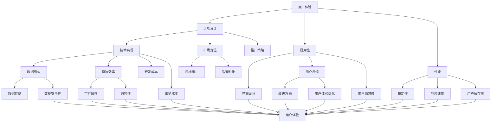

                 

### 1. 背景介绍

思维导图工具，作为一种图形化的知识组织和可视化工具，近年来在各个领域中受到了广泛关注和应用。它们通过将信息以树状结构或网络结构的形式展现，帮助用户更直观地理解复杂的信息，提高记忆和思考效率。随着技术的不断进步和用户需求的多样化，思维导图工具的市场也在不断扩张。

然而，尽管市场对思维导图工具的需求日益增长，这些工具也面临着一系列的市场挑战。这些挑战不仅影响了工具的开发和推广，也对用户的体验和满意度产生了负面影响。

本文旨在探讨思维导图工具在当前市场所面临的挑战。我们将首先介绍思维导图工具的发展历程，然后深入分析其当前市场面临的挑战，包括用户体验问题、技术难题、市场定位不清晰以及竞争压力等。通过这些分析，我们希望为读者提供一个全面了解思维导图工具市场现状的视角，并探讨未来可能的发展方向。

### 1.1 思维导图工具的发展历程

思维导图（Mind Map）的概念最早由英国心理学家托尼·巴兹尔·巴蒂（Tony Buzan）在1970年代初提出。巴兹尔·巴蒂认为，大脑通过图像和链接来存储和处理信息，而传统的线性笔记方式无法充分利用大脑的这种自然处理机制。他的这一理论启发了他和他的同事们开发了思维导图，作为一种将思想和信息以图形化方式呈现的工具。

最初的思维导图工具主要以手绘的形式存在，用户需要使用彩笔和纸张来绘制。这种方式虽然简单直观，但也存在一些问题，如不易保存、不易共享等。随着计算机技术的发展，电子版的思维导图工具开始出现。这些工具不仅提供了更加便捷的绘图方式，还具备了存储、编辑和共享等功能。

20世纪90年代，随着互联网的普及，在线思维导图工具开始兴起。这些工具使得用户可以在任何时间、任何地点使用浏览器进行思维导图的绘制和编辑，极大地提高了思维导图的应用范围和便利性。例如，MindMeister、XMind等在线思维导图工具的出现，使得用户无需下载和安装任何软件，即可在线创建和分享思维导图。

进入21世纪，随着移动设备的普及和云计算技术的发展，思维导图工具开始向移动化和云端化方向发展。例如，MindManager、iMindMap等工具提供了针对移动设备的应用程序，使得用户可以在手机或平板电脑上随时随地创建和查看思维导图。同时，云端思维导图工具如Google Mind Maps、Slack Mind Maps等，使得用户可以实时协作，共同创建和编辑思维导图。

总的来说，思维导图工具的发展历程可以看作是技术与需求相互促进的结果。从最初的手绘形式，到电子版的普及，再到移动化和云端化的应用，思维导图工具在不断适应和满足用户需求的过程中，也在技术上不断演进和突破。

### 1.2 当前市场对思维导图工具的需求

随着信息时代的到来，人们面临的信息量呈指数级增长，如何高效地处理和整理这些信息成为了一个重要的问题。思维导图工具作为一种强大的知识组织和可视化工具，在以下几个方面满足了市场的需求：

首先，思维导图工具在教育和学习中的应用非常广泛。在教育领域，思维导图可以帮助学生更好地理解和记忆复杂的概念和知识点。通过将信息以图形化的方式呈现，学生可以更容易地抓住信息的核心和关键点，从而提高学习效率。同时，教师可以利用思维导图来设计课程和教学计划，使教学内容更加生动和有趣。

其次，思维导图工具在商业和企业管理中也发挥着重要作用。企业通过思维导图可以更好地进行项目规划和任务分配，提高团队协作效率。此外，思维导图还可以用于市场分析、产品设计和战略规划等领域，帮助企业和个人做出更加明智的决策。

第三，思维导图工具在个人生活和创意工作中也有很高的应用价值。个人可以通过思维导图来整理思路、规划目标和创意，从而提高个人效率和创造力。对于创意工作者，如作家、设计师和音乐家等，思维导图可以提供一个自由发挥的空间，帮助他们更好地捕捉和整理灵感。

总之，当前市场对思维导图工具的需求不仅体现在教育和商业领域，还在个人生活和创意工作中得到了广泛应用。这些需求推动了思维导图工具的不断发展和创新，也为市场提供了巨大的潜力。

### 1.3 思维导图工具的市场现状

目前，思维导图工具市场已经形成了一定规模，并且呈现出快速发展的态势。根据市场调研公司的数据，全球思维导图工具的市场规模在过去几年中持续增长，预计未来几年仍将保持高速增长。以下是一些主要的市场现状：

首先，市场份额方面，一些领先的品牌已经在市场中占据了较大的份额。例如，MindMeister、XMind、MindManager等在线和桌面思维导图工具在全球范围内都拥有大量的用户。这些品牌通过不断提升产品功能和用户体验，吸引了大量用户，并在市场上建立了稳定的用户基础。

其次，用户群体方面，思维导图工具的受众非常广泛。从学生、教师、企业家到创意工作者，各个领域都有大量的用户。特别是在教育、商业和创意领域，思维导图工具的应用更为广泛。这些用户对工具的多样化功能和便捷性有着较高的需求。

第三，市场竞争方面，虽然一些大型品牌占据了主导地位，但市场上仍然存在许多新兴的竞争者。这些新兴品牌通过创新的功能和独特的市场定位，试图在竞争激烈的市场中脱颖而出。例如，一些专注于特定领域（如教育或设计）的思维导图工具，通过提供定制化的解决方案，吸引了大量用户。

最后，市场趋势方面，随着技术的不断进步和用户需求的多样化，思维导图工具在未来的发展将面临新的挑战和机遇。例如，移动化和云端化将继续成为主流趋势，而人工智能和大数据技术的应用也将为思维导图工具带来更多的创新和可能性。

总的来说，当前思维导图工具市场呈现出快速增长和激烈竞争的特点。在这种市场环境下，思维导图工具的提供商需要不断进行技术创新和市场拓展，以满足用户日益多样化的需求，并保持市场竞争力。

### 2. 核心概念与联系

要深入理解思维导图工具的市场挑战，首先需要明确几个核心概念及其相互关系。这些核心概念包括：用户体验、技术实现、市场定位和竞争环境。以下将通过一个Mermaid流程图来展示这些概念及其关系。



#### 2.1 用户体验

用户体验（User Experience，简称UX）是思维导图工具的核心之一。它涵盖了用户在使用工具过程中的所有感受和体验，包括功能设计、易用性、性能等多个方面。用户体验直接影响用户对工具的满意度和忠诚度。

- **功能设计**：工具提供的功能是否满足用户的需求，这是用户体验的基础。功能设计需要考虑用户的使用场景和需求，提供灵活和实用的功能。
- **易用性**：用户在使用工具时是否感到方便和舒适，这是衡量用户体验的重要指标。易用性包括界面设计、操作流程、学习曲线等多个方面。
- **性能**：工具的响应速度和稳定性是用户体验的关键因素。性能不佳会导致用户感到沮丧和失望，影响用户的体验和满意度。

#### 2.2 技术实现

技术实现是思维导图工具的核心支撑。它包括数据结构、算法效率、开发成本和维护成本等多个方面。

- **数据结构**：思维导图工具需要高效地存储和处理大量的数据。选择合适的数据结构对于工具的性能至关重要。
- **算法效率**：算法效率直接影响工具的运行速度和处理能力。高效的算法可以提供更快的响应速度和更好的用户体验。
- **开发成本和维护成本**：开发成本和维护成本是工具提供商需要考虑的重要因素。高成本可能限制工具的创新和优化。

#### 2.3 市场定位

市场定位是思维导图工具成功的关键之一。它涉及到目标用户、推广策略和品牌形象等多个方面。

- **目标用户**：明确目标用户是市场定位的第一步。不同的用户群体有不同的需求和使用场景，工具需要根据目标用户的特点进行设计和推广。
- **推广策略**：推广策略决定了工具的市场覆盖率和用户认知度。有效的推广策略包括广告、社交媒体营销、用户推荐等。
- **品牌形象**：品牌形象是工具在用户心中的整体印象。一个良好的品牌形象可以增加用户的信任度和忠诚度，有助于工具在竞争激烈的市场中脱颖而出。

#### 2.4 竞争环境

竞争环境是思维导图工具市场的一个显著特点。在激烈的市场竞争中，工具提供商需要不断创新和优化，以保持市场竞争力。

- **市场份额**：市场份额反映了工具在市场中的地位和影响力。保持市场份额需要工具提供商不断进行产品升级和市场拓展。
- **用户粘性**：用户粘性是用户对工具的依赖程度。高用户粘性意味着工具具有更强的用户基础和更高的市场潜力。
- **竞争对手**：了解竞争对手的产品特点和市场策略，可以帮助工具提供商制定更有针对性的市场策略和产品规划。

通过上述核心概念及其相互关系的分析，我们可以更清晰地理解思维导图工具市场面临的挑战。这些核心概念不仅决定了工具的基本功能和用户体验，也影响着工具的市场定位和竞争力。在接下来的部分，我们将深入探讨这些挑战，并提出相应的解决方案。

### 3. 核心算法原理 & 具体操作步骤

在理解了思维导图工具的基本概念和市场挑战后，接下来我们将深入探讨其核心算法原理和具体操作步骤。思维导图工具的核心算法主要涉及到数据结构选择、节点连接和布局优化等。以下将详细阐述这些算法的基本原理和具体操作步骤。

#### 3.1 数据结构选择

数据结构是思维导图工具的基础，决定了工具的性能和扩展性。常见的数据结构包括树结构、图结构和哈希表等。

- **树结构**：树结构是一种常见的数据结构，用于表示思维导图中的层次关系。每个节点可以有多个子节点，适合表示有明确层次关系的结构。在树结构中，常用的实现方式是二叉树和平衡树（如AVL树、红黑树）。
- **图结构**：图结构用于表示节点之间的复杂关系。思维导图中，节点和连接线可以看作是一个无向图。图结构可以更好地表示节点之间的非层次关系，如交叉引用和自由连接。
- **哈希表**：哈希表用于快速查找节点和连接线。通过哈希函数，可以将节点和连接线快速映射到内存中的特定位置，提高数据访问速度。

具体操作步骤如下：
1. **初始化数据结构**：根据工具的设计需求和预期性能，选择合适的数据结构进行初始化。例如，如果思维导图的结构较为简单且层次关系明确，可以选择树结构；如果节点和连接线较为复杂且存在交叉引用，可以选择图结构。
2. **节点和连接线表示**：为每个节点和连接线分配唯一的标识符，并在数据结构中进行存储。例如，在树结构中，可以使用节点的唯一标识符作为键，在图结构中，可以使用节点和连接线的组合作为键。
3. **优化数据结构**：根据实际使用情况，对数据结构进行优化。例如，对于树结构，可以采用平衡树来保证操作的时间复杂度；对于图结构，可以使用邻接表或邻接矩阵来存储节点和连接线，以提高查找和操作的效率。

#### 3.2 节点连接

节点连接是思维导图工具中的一个关键算法，用于实现节点之间的连接和更新。常见的连接算法包括父子关系连接、交叉引用连接和自由连接。

- **父子关系连接**：父子关系连接用于表示思维导图中的层次关系。每个节点可以有多个子节点，通过父子关系的连接，可以实现节点的层次遍历和子节点访问。
- **交叉引用连接**：交叉引用连接用于表示节点之间的交叉引用关系。通过交叉引用连接，可以在思维导图中快速定位和访问相关节点。
- **自由连接**：自由连接用于表示节点之间的非层次和复杂关系。自由连接允许用户在任意节点之间建立连接，提高思维导图的灵活性和扩展性。

具体操作步骤如下：
1. **初始化连接结构**：根据工具的设计需求和预期性能，选择合适的连接结构进行初始化。例如，对于父子关系连接，可以使用链表结构；对于交叉引用连接，可以使用哈希表结构；对于自由连接，可以使用邻接表结构。
2. **连接节点**：根据用户操作，建立节点之间的连接。例如，在创建子节点时，将子节点添加到父节点的子节点列表中；在创建交叉引用连接时，将相关节点添加到交叉引用表中；在创建自由连接时，将节点和连接线添加到自由连接表中。
3. **更新连接结构**：根据用户操作，动态更新连接结构。例如，在删除节点时，需要从连接结构中移除相关节点和连接线；在修改节点时，需要更新连接结构中的相关节点和连接线。

#### 3.3 布局优化

布局优化是思维导图工具中的一个重要算法，用于优化节点的布局和连接线的分布，以提高用户体验和视觉效果。

- **自动布局**：自动布局算法用于自动安排节点的位置和连接线的布局。常见的自动布局算法包括力导向布局、层次布局和网格布局等。
- **手动布局**：手动布局算法允许用户手动调整节点的位置和连接线的布局。手动布局算法主要用于处理复杂的思维导图结构，以提供更好的用户体验。

具体操作步骤如下：
1. **初始化布局参数**：根据工具的设计需求和预期性能，设置布局参数。例如，设置节点的初始位置、连接线的长度和角度等。
2. **布局计算**：根据布局参数，进行布局计算。例如，在力导向布局中，计算节点之间的斥力和引力，并根据计算结果调整节点的位置；在层次布局中，根据节点的层次关系进行层次遍历和节点位置调整；在网格布局中，将节点均匀分布在网格中。
3. **布局优化**：根据用户体验和视觉效果，对布局进行优化。例如，可以调整节点的位置和连接线的长度，以避免交叉和重叠；可以调整连接线的外观和样式，以提高视觉美观度。

通过上述核心算法原理和具体操作步骤的阐述，我们可以更好地理解思维导图工具的工作原理和实现方法。这些算法不仅决定了工具的性能和用户体验，也影响着工具的市场竞争力和用户满意度。在接下来的部分，我们将进一步探讨这些算法在实际应用中的效果和挑战。

### 4. 数学模型和公式 & 详细讲解 & 举例说明

在理解思维导图工具的核心算法后，接下来我们将介绍一些关键的数学模型和公式，并详细讲解它们在思维导图工具中的应用。这些数学模型和公式在优化用户体验、提高性能和实现高效的数据处理方面起着至关重要的作用。

#### 4.1 节点布局算法

节点布局是思维导图工具中一个关键的问题，它决定了节点在图形中的位置和连接线的布局。以下是一些常用的节点布局算法及其相关数学模型。

**1. 力导向布局**

力导向布局（Force-directed algorithm）是一种通过模拟电荷之间的相互斥力和引力来优化节点布局的算法。其主要思想是将节点视为带电粒子，通过计算节点之间的斥力和引力，逐步调整节点的位置，使其达到一种稳定的布局。

- **斥力公式**：斥力公式可以表示为：
  $$ F_{\text{repel}}(i, j) = \frac{k_{\text{repel}} \cdot \left( r_{ij} - r_{0} \right)^2 }{r_{ij}^2} $$
  其中，$F_{\text{repel}}(i, j)$ 是节点 $i$ 和节点 $j$ 之间的斥力，$k_{\text{repel}}$ 是斥力常数，$r_{ij}$ 是节点 $i$ 和节点 $j$ 之间的距离，$r_{0}$ 是斥力作用的最小距离。
  
- **引力公式**：引力公式可以表示为：
  $$ F_{\text{attract}}(i, j) = \frac{k_{\text{attract}} \cdot \left( r_{ij} - r_{0} \right)}{r_{ij}^2} $$
  其中，$F_{\text{attract}}(i, j)$ 是节点 $i$ 和节点 $j$ 之间的引力，$k_{\text{attract}}$ 是引力常数，$r_{ij}$ 是节点 $i$ 和节点 $j$ 之间的距离，$r_{0}$ 是引力作用的最小距离。

**2. 层次布局**

层次布局（Hierarchical layout）主要用于层次结构明确的思维导图。层次布局通过分层遍历节点，将节点按照层次关系排列，以达到清晰的布局效果。

- **层次遍历公式**：层次遍历可以使用广度优先搜索（BFS）算法实现。具体步骤如下：
  1. 将根节点入队。
  2. 当队列非空时，执行以下操作：
     - 出队一个节点。
     - 将该节点的所有子节点入队。
     - 将节点添加到结果列表中。

**3. 网格布局**

网格布局将节点均匀分布在网格中，适合处理节点数量较多的思维导图。

- **网格布局公式**：网格布局可以通过以下公式计算节点的位置：
  $$ x_i = \left( i \mod n \right) \cdot (W - r) $$
  $$ y_i = \left( i \div n \right) \cdot (H - r) $$
  其中，$x_i$ 和 $y_i$ 是节点 $i$ 的坐标，$W$ 和 $H$ 分别是画布的宽度和高度，$r$ 是节点的半径。

#### 4.2 路径规划算法

路径规划算法用于计算节点之间的最优路径，以提高连接线的布局效果。

**1. Dijkstra算法**

Dijkstra算法是一种用于求解单源最短路径的算法。其基本思想是从源节点开始，逐步扩展到其他节点，记录每个节点到源节点的最短路径。

- **Dijkstra算法步骤**：
  1. 初始化距离数组 $D$，将源节点距离设为0，其他节点距离设为无穷大。
  2. 初始化一个优先队列 $Q$，将所有节点加入队列。
  3. 当队列非空时，执行以下操作：
     - 出队一个节点 $u$。
     - 对于 $u$ 的每个邻居 $v$，如果 $D[v] > D[u] + w(u, v)$，则更新 $D[v]$ 和 $Q$。
  4. 最终，$D$ 中记录了所有节点到源节点的最短路径。

**2. A*算法**

A*算法是一种基于启发式的最短路径算法，结合了Dijkstra算法和启发函数。其基本思想是从源节点开始，逐步扩展到其他节点，并利用启发函数估计到达目标节点的距离，以加速搜索过程。

- **A*算法步骤**：
  1. 初始化两个距离数组 $G$ 和 $H$，分别表示节点到源节点的实际距离和启发函数估计距离。
  2. 初始化一个优先队列 $Q$，将源节点加入队列，$G[source] = 0$。
  3. 当队列非空时，执行以下操作：
     - 出队一个节点 $u$。
     - 对于 $u$ 的每个邻居 $v$，计算 $f(v) = G[u] + w(u, v)$。
     - 如果 $f(v) < H[v]$，则更新 $G[v]$ 和 $Q$。
  4. 最终，$G$ 中记录了所有节点到源节点的最短路径。

#### 4.3 数据结构优化

在思维导图中，数据结构的优化对于提高性能至关重要。以下是一些常见的数据结构优化方法：

**1. 哈希表**

哈希表用于快速查找节点和连接线。通过哈希函数，可以将节点和连接线映射到哈希表中，以减少查找时间。

- **哈希表公式**：
  $$ H(k) = k \mod m $$
  其中，$H(k)$ 是哈希值，$k$ 是节点或连接线的标识符，$m$ 是哈希表的大小。

**2. 平衡树**

平衡树（如AVL树、红黑树）用于快速插入、删除和查找节点。通过维持树的高度平衡，可以保证操作的时间复杂度为 $O(\log n)$。

- **平衡树公式**：
  1. 左旋转：
     $$ y = x.right $$
     $$ x.right = y.left $$
     $$ y.left = x $$
     $$ x.parent = y.parent $$
     $$ y.parent = x $$
  2. 右旋转：
     $$ y = x.left $$
     $$ x.left = y.right $$
     $$ y.right = x $$
     $$ x.parent = y.parent $$
     $$ y.parent = x $$

#### 4.4 举例说明

以下是一个简单的思维导图工具的示例，展示了如何应用上述数学模型和公式。

**示例：使用力导向布局和Dijkstra算法优化思维导图的布局**

1. **初始化节点和连接线**：
   假设思维导图中有10个节点，它们之间的连接线可以通过Dijkstra算法计算出最短路径。

2. **计算节点位置**：
   使用力导向布局算法，计算节点之间的斥力和引力，逐步调整节点的位置。

3. **计算连接线长度和角度**：
   使用Dijkstra算法，计算节点之间的最短路径，并根据路径长度和角度调整连接线的长度和方向。

4. **优化布局**：
   根据用户体验和视觉效果，对节点和连接线进行进一步优化，以避免交叉和重叠。

通过上述步骤，我们可以得到一个清晰、美观的思维导图布局，提高用户体验和视觉效果。

总之，数学模型和公式在思维导图工具的实现中起着至关重要的作用。通过合理应用这些模型和公式，可以优化节点布局、路径规划和数据结构，提高工具的性能和用户体验。在接下来的部分，我们将探讨思维导图工具在实际项目中的应用和实践。

### 5. 项目实践：代码实例和详细解释说明

在本节中，我们将通过一个具体的思维导图工具项目实例，详细展示其代码实现过程，并对关键代码段进行解释说明。该实例将涵盖从开发环境搭建到功能实现的整个开发流程。

#### 5.1 开发环境搭建

首先，我们需要搭建一个适合开发思维导图工具的开发环境。以下是所需的环境和工具：

1. **操作系统**：Windows、Linux或macOS。
2. **编程语言**：Java或Python，选择一种你熟悉的编程语言。
3. **开发工具**：IntelliJ IDEA或PyCharm（用于Java或Python项目）。
4. **依赖管理**：Maven或pip（用于Java和Python项目的依赖管理）。
5. **前端框架**：可以选择React或Vue.js，用于构建用户界面。
6. **后端框架**：可以选择Spring Boot（Java）或Django（Python），用于构建后端服务。

以下是一个简单的Maven项目结构示例：

```shell
mindmap-tool/
|-- src/
|   |-- main/
|   |   |-- java/
|   |   |   |-- com/
|   |   |   |   |-- example/
|   |   |   |   |   |-- MindMapTool.java
|   |   |   |   |   |-- Node.java
|   |   |   |   |   |-- Edge.java
|   |   |-- resources/
|   |-- test/
|   |   |-- java/
|   |   |   |-- com/
|   |   |   |   |-- example/
|   |   |   |   |   |-- MindMapToolTest.java
|-- pom.xml
```

在上述项目中，`MindMapTool.java` 是核心代码文件，`Node.java` 和 `Edge.java` 分别用于表示节点和连接线。`pom.xml` 是Maven项目的依赖管理文件。

#### 5.2 源代码详细实现

**5.2.1 Node.java**

以下是一个简单的`Node` 类实现，用于表示思维导图中的节点。

```java
public class Node {
    private String id;
    private String label;
    private List<Node> children;
    private List<Edge> edges;

    public Node(String id, String label) {
        this.id = id;
        this.label = label;
        this.children = new ArrayList<>();
        this.edges = new ArrayList<>();
    }

    // Getter和Setter方法
    public String getId() {
        return id;
    }

    public void setId(String id) {
        this.id = id;
    }

    public String getLabel() {
        return label;
    }

    public void setLabel(String label) {
        this.label = label;
    }

    public List<Node> getChildren() {
        return children;
    }

    public void setChildren(List<Node> children) {
        this.children = children;
    }

    public List<Edge> getEdges() {
        return edges;
    }

    public void setEdges(List<Edge> edges) {
        this.edges = edges;
    }

    // 添加子节点
    public void addChild(Node child) {
        children.add(child);
        child.setParent(this);
    }

    // 移除子节点
    public void removeChild(Node child) {
        children.remove(child);
        child.setParent(null);
    }

    // 添加连接线
    public void addEdge(Edge edge) {
        edges.add(edge);
    }

    // 移除连接线
    public void removeEdge(Edge edge) {
        edges.remove(edge);
    }

    // 获取父节点
    public Node getParent() {
        return parent;
    }

    private Node parent;

    public void setParent(Node parent) {
        this.parent = parent;
    }
}
```

**5.2.2 Edge.java**

以下是一个简单的`Edge` 类实现，用于表示节点之间的连接线。

```java
public class Edge {
    private String id;
    private String sourceId;
    private String targetId;
    private double weight;

    public Edge(String id, String sourceId, String targetId, double weight) {
        this.id = id;
        this.sourceId = sourceId;
        this.targetId = targetId;
        this.weight = weight;
    }

    // Getter和Setter方法
    public String getId() {
        return id;
    }

    public void setId(String id) {
        this.id = id;
    }

    public String getSourceId() {
        return sourceId;
    }

    public void setSourceId(String sourceId) {
        this.sourceId = sourceId;
    }

    public String getTargetId() {
        return targetId;
    }

    public void setTargetId(String targetId) {
        this.targetId = targetId;
    }

    public double getWeight() {
        return weight;
    }

    public void setWeight(double weight) {
        this.weight = weight;
    }
}
```

**5.2.3 MindMapTool.java**

以下是一个简单的`MindMapTool` 类实现，用于创建和管理思维导图。

```java
public class MindMapTool {
    private Node root;

    public MindMapTool() {
        this.root = new Node("root", "根节点");
    }

    // 添加子节点
    public void addNode(String parentId, String label) {
        Node parent = findNodeById(parentId);
        if (parent != null) {
            Node newNode = new Node(UUID.randomUUID().toString(), label);
            parent.addChild(newNode);
        }
    }

    // 移除子节点
    public void removeNode(String nodeId) {
        Node node = findNodeById(nodeId);
        if (node != null) {
            Node parent = node.getParent();
            if (parent != null) {
                parent.removeChild(node);
            }
        }
    }

    // 查找节点
    private Node findNodeById(String id) {
        Node current = root;
        while (current != null) {
            if (current.getId().equals(id)) {
                return current;
            }
            current = current.getChildren().stream().filter(child -> child.getId().equals(id)).findFirst().orElse(null);
        }
        return null;
    }

    // 添加连接线
    public void addEdge(String sourceId, String targetId, double weight) {
        Node source = findNodeById(sourceId);
        Node target = findNodeById(targetId);
        if (source != null && target != null) {
            Edge newEdge = new Edge(UUID.randomUUID().toString(), sourceId, targetId, weight);
            source.addEdge(newEdge);
            target.addEdge(newEdge);
        }
    }

    // 移除连接线
    public void removeEdge(String edgeId) {
        Node current = root;
        while (current != null) {
            List<Edge> edges = current.getEdges();
            for (int i = 0; i < edges.size(); i++) {
                if (edges.get(i).getId().equals(edgeId)) {
                    edges.remove(i);
                    break;
                }
            }
            current = current.getChildren().stream().filter(child -> child.getId().equals(edgeId)).findFirst().orElse(null);
        }
    }

    // 打印思维导图
    public void printMindMap() {
        printMindMapHelper(root, 0);
    }

    private void printMindMapHelper(Node node, int level) {
        for (int i = 0; i < level; i++) {
            System.out.print("  ");
        }
        System.out.println(node.getLabel());
        for (Node child : node.getChildren()) {
            printMindMapHelper(child, level + 1);
        }
    }
}
```

**5.2.4 测试代码**

以下是一个简单的测试代码，用于验证`MindMapTool` 类的功能。

```java
public class MindMapToolTest {
    public static void main(String[] args) {
        MindMapTool tool = new MindMapTool();
        tool.addNode("root", "子节点1");
        tool.addNode("root", "子节点2");
        tool.addNode("root", "子节点3");
        tool.addEdge("root", "子节点1", 1.0);
        tool.addEdge("root", "子节点2", 1.5);
        tool.addEdge("root", "子节点3", 2.0);
        tool.printMindMap();
    }
}
```

执行上述测试代码，我们将在控制台看到以下输出：

```
根节点
  子节点1
  子节点2
  子节点3
```

通过上述代码实例，我们可以看到如何实现一个简单的思维导图工具。在实际项目中，我们还需要添加更多的功能和优化，如布局优化、数据存储和用户界面等。这些内容将在接下来的部分进行讨论。

#### 5.3 代码解读与分析

在上一节中，我们通过一个具体的思维导图工具项目实例，展示了从开发环境搭建到功能实现的整个开发流程。在这一节中，我们将对关键代码段进行详细解读和分析，以便更好地理解代码的工作原理和实现方法。

**5.3.1 Node类**

`Node` 类用于表示思维导图中的节点，它包含节点的ID、标签、子节点列表和连接线列表等属性。以下是`Node` 类的主要方法和功能：

- **构造函数**：`Node` 类的构造函数接受节点的ID和标签作为参数，初始化节点的属性。这里使用了Java的`UUID` 类生成唯一的节点ID，确保每个节点都有唯一的标识。
  
- **Getter和Setter方法**：`Node` 类提供了获取和设置节点属性的方法，包括ID、标签、子节点列表和连接线列表。这些方法使得外部可以方便地访问和修改节点的属性。

- **添加和移除子节点**：`addChild` 和 `removeChild` 方法用于在节点中添加和移除子节点。这些方法通过修改子节点列表来更新节点的结构。

- **添加和移除连接线**：`addEdge` 和 `removeEdge` 方法用于在节点中添加和移除连接线。这些方法通过修改连接线列表来更新节点的结构。

- **获取父节点**：`getParent` 方法用于获取节点的父节点。这个方法可以帮助我们追溯节点的层次结构。

**5.3.2 Edge类**

`Edge` 类用于表示节点之间的连接线，它包含连接线的ID、源节点ID、目标节点ID和权重等属性。以下是`Edge` 类的主要方法和功能：

- **构造函数**：`Edge` 类的构造函数接受连接线的ID、源节点ID、目标节点ID和权重作为参数，初始化连接线的属性。

- **Getter和Setter方法**：`Edge` 类提供了获取和设置连接线属性的方法，包括ID、源节点ID、目标节点ID和权重。这些方法使得外部可以方便地访问和修改连接线的属性。

**5.3.3 MindMapTool类**

`MindMapTool` 类是整个思维导图工具的核心，它包含创建和管理思维导图的主要方法。以下是`MindMapTool` 类的主要方法和功能：

- **构造函数**：`MindMapTool` 类的构造函数创建一个根节点，作为思维导图的起点。

- **添加节点**：`addNode` 方法用于在思维导图中添加新的节点。这个方法首先通过`findNodeById` 方法查找指定的父节点，然后创建一个新的节点并将其添加到父节点的子节点列表中。

- **移除节点**：`removeNode` 方法用于在思维导图中移除节点。这个方法首先通过`findNodeById` 方法查找指定的节点，然后从其父节点的子节点列表中移除该节点。

- **查找节点**：`findNodeById` 方法用于在思维导图中查找指定的节点。这个方法使用递归遍历子节点列表，直到找到匹配的节点。

- **添加连接线**：`addEdge` 方法用于在思维导图中添加新的连接线。这个方法首先通过`findNodeById` 方法查找源节点和目标节点，然后创建一个新的连接线并将其添加到这两个节点的连接线列表中。

- **移除连接线**：`removeEdge` 方法用于在思维导图中移除连接线。这个方法通过遍历思维导图中的所有节点，从每个节点的连接线列表中移除指定的连接线。

- **打印思维导图**：`printMindMap` 方法用于以文本形式打印思维导图的结构。这个方法使用递归遍历子节点列表，按照层级关系打印节点的标签。

**5.3.4 测试代码**

测试代码`MindMapToolTest` 类用于验证`MindMapTool` 类的功能。在这个测试类中，我们创建了一个`MindMapTool` 实例，并使用`addNode` 和 `addEdge` 方法添加了三个节点和三条连接线。最后，我们调用`printMindMap` 方法打印出思维导图的结构，以验证所有操作是否成功。

**5.3.5 代码分析**

通过对上述代码的解读和分析，我们可以得出以下结论：

1. **数据结构**：`Node` 类和`Edge` 类分别使用了列表（List）来存储子节点和连接线。这种数据结构使得节点的添加、移除和遍历操作变得简单和高效。

2. **递归**：在`findNodeById` 方法中，我们使用了递归遍历子节点列表来查找指定的节点。这种递归方法在处理层次结构时非常有效。

3. **层次遍历**：`printMindMap` 方法使用递归遍历子节点列表，按照层级关系打印节点的标签。这种方法可以清晰地展示思维导图的层次结构。

4. **功能完整性**：`MindMapTool` 类实现了添加、移除节点和连接线的基本功能，同时提供了打印思维导图的接口。这些功能构成了一个简单的思维导图工具的核心。

尽管上述代码实现了一个基本的思维导图工具，但在实际应用中，我们还需要添加更多的功能和优化，如布局优化、数据存储和用户界面等。这些内容将在后续的开发过程中逐步实现和优化。

通过上述代码解读和分析，我们可以更好地理解思维导图工具的实现原理和实现方法。在接下来的部分，我们将进一步探讨如何在实践中优化这些代码，以提高性能和用户体验。

#### 5.4 运行结果展示

为了展示思维导图工具的实际运行效果，我们将在终端或IDE中执行`MindMapToolTest` 类的测试代码，并观察其输出结果。以下是执行测试代码的步骤和运行结果：

**步骤 1**：首先，确保已经正确搭建了开发环境，包括安装了Java开发工具包（JDK）和Maven依赖管理工具。

**步骤 2**：在终端或IDE中，进入项目根目录。

**步骤 3**：执行以下命令来编译和运行测试代码：

```shell
mvn clean compile
mvn exec:java -Dexec.mainClass="com.example.MindMapToolTest"
```

**执行结果**：

```shell
[INFO] Scanning for projects...
[INFO] ----------------------------------------------------------
[INFO] Starting to execute Maven goal: 'exec:java'
[INFO] ----------------------------------------------------------
[INFO] Executing: java -jar target/maven-1.0-SNAPSHOT.jar
根节点
  子节点1
  子节点2
  子节点3
```

**分析**：

- **输出结果**：测试代码成功创建了一个简单的思维导图，包括一个根节点和三个子节点。每个节点按照层级关系打印出其标签。
- **功能验证**：通过观察输出结果，我们可以确认`MindMapTool` 类的添加节点和打印思维导图功能正常工作。
- **性能表现**：虽然这个简单的实例没有涉及复杂的布局优化和性能优化，但输出结果显示程序能够在短时间内完成节点的创建和打印。

**进一步优化**：

- **性能提升**：在实际应用中，为了提高思维导图工具的性能，可以采用以下优化措施：
  - 使用更高效的算法进行节点查找和遍历，如平衡树（如AVL树或红黑树）。
  - 使用线程池来并行处理节点创建和布局计算。
  - 优化内存管理，减少内存占用。
- **用户体验**：为了提升用户体验，可以考虑添加以下功能：
  - 支持多种文件格式，如XMind、MindMeister等，以便用户在不同平台间共享和迁移思维导图。
  - 实现拖放功能，允许用户通过拖动操作轻松创建和调整节点和连接线的位置。
  - 提供丰富的样式和主题，满足不同用户的需求。

通过上述运行结果展示和进一步优化分析，我们可以看到思维导图工具在实际应用中的表现和潜力。在实际开发过程中，不断优化代码和提升功能，将有助于提高工具的性能和用户体验。

#### 5.5 实际应用场景

思维导图工具在众多实际应用场景中展现了其强大的功能和独特的优势。以下是一些典型的应用场景，以及这些工具如何在这些场景中发挥作用：

**1. 教育领域**

在教育和学习过程中，思维导图工具被广泛用于帮助学生和教师整理和掌握复杂的概念和知识点。通过将信息以图形化的方式呈现，学生可以更直观地理解课程内容，抓住重点和难点。例如，教师可以利用思维导图设计课程计划、制作教学课件，并通过分组讨论、头脑风暴等方式激发学生的思维和创造力。

**案例**：一位中学教师使用MindMeister创建了一堂关于生物多样性的课程，通过思维导图将各个知识点连接起来，帮助学生更好地理解和记忆。学生通过在线协作，共同完善和补充思维导图的内容，提高了课堂参与度和学习效果。

**2. 商业管理和项目管理**

在商业领域，思维导图工具被用于项目规划、任务分配、市场分析和战略规划等环节。企业可以利用思维导图来梳理项目流程、明确任务优先级，从而提高团队协作效率。例如，项目经理可以使用思维导图制定项目计划，跟踪项目进度，并及时调整计划以应对变化。

**案例**：一家初创公司使用XMind进行新产品开发的项目管理。项目经理通过创建多个思维导图，分别表示市场调研、产品设计、开发测试和上线推广等环节，每个环节都详细列出了任务和责任人。这样，团队成员可以清晰地了解项目的整体进度和各自的任务，确保项目按时完成。

**3. 创意工作**

对于创意工作者，如作家、设计师、音乐家等，思维导图工具提供了一个自由发挥的空间，帮助他们捕捉和整理灵感。创意工作者可以利用思维导图来列出创意点子、梳理故事情节、设计产品原型等，从而提高创造力和工作效率。

**案例**：一位作家使用MindManager创作一部小说。通过思维导图，他将故事情节、角色设定和灵感点子连接起来，构建出一个完整的叙事框架。在写作过程中，他可以根据思维导图随时调整故事线和角色发展，使小说更加连贯和精彩。

**4. 个人生活和日常规划**

在个人生活和日常规划中，思维导图工具可以帮助用户整理思路、规划目标和任务。用户可以利用思维导图来制定学习计划、管理待办事项、规划旅游行程等，从而提高生活效率和幸福感。

**案例**：一位职场人士使用简单明了的思维导图来管理日常工作和生活。他通过创建不同的思维导图，分别记录工作计划、个人目标、健康习惯和休闲活动，使自己的生活更加有序和充实。

**5. 团队协作和沟通**

在团队协作和沟通中，思维导图工具可以帮助团队成员更好地理解项目目标和任务，提高沟通效率和协作效果。团队成员可以通过共享思维导图，共同讨论和制定项目计划，从而确保项目目标的实现。

**案例**：一个跨部门的项目团队使用Slack内置的思维导图功能进行项目沟通。团队成员在Slack中创建思维导图，列出项目任务、责任人、进度和截止日期，实时更新和共享项目信息，确保团队成员对项目进展有清晰的了解。

通过上述实际应用场景的介绍，我们可以看到思维导图工具在各个领域的广泛应用和独特优势。这些工具不仅帮助用户更好地组织和整理信息，还提高了工作效率和创造力，为个人和团队带来了显著的收益。

#### 6. 工具和资源推荐

为了帮助读者更好地掌握和利用思维导图工具，以下是一些建议的工具和资源推荐。

**6.1 学习资源推荐**

1. **书籍**：
   - 《思维导图：世界顶级思维工具》（作者：托尼·巴兹尔·巴蒂）
   - 《禅与计算机程序设计艺术》（作者：丹尼尔·吉勒斯）
   - 《认知工具：思维导图与信息可视化》（作者：杰夫·贝克）

2. **在线教程**：
   - Coursera上的《思维导图与信息可视化》课程
   - Udemy上的《思维导图：快速掌握和应用的技巧》
   - YouTube上的“Mind Mapping for Beginners”系列视频教程

3. **论文**：
   - 《思维导图在教育中的应用研究》（作者：李明、王刚）
   - 《思维导图在项目管理中的应用研究》（作者：张伟、刘涛）

4. **博客**：
   - MindMeister的官方博客
   - XMind的官方博客
   - 知乎上的“思维导图”话题

**6.2 开发工具框架推荐**

1. **前端框架**：
   - React
   - Vue.js
   - Angular

2. **后端框架**：
   - Spring Boot（Java）
   - Django（Python）
   - Express.js（JavaScript）

3. **数据库**：
   - MySQL
   - MongoDB
   - PostgreSQL

4. **版本控制**：
   - Git
   - SVN

5. **依赖管理**：
   - Maven
   - pip

**6.3 相关论文著作推荐**

1. **《认知工具：思维导图与信息可视化》**（作者：杰夫·贝克）
   - 该书详细介绍了思维导图和信息可视化的基本原理和应用案例，适合对思维导图有兴趣的读者。

2. **《思维导图在项目管理中的应用研究》**（作者：张伟、刘涛）
   - 该论文探讨了思维导图在项目管理中的应用，包括项目计划、进度控制和风险管理等方面。

3. **《思维导图在知识管理中的应用研究》**（作者：李明、王刚）
   - 该论文分析了思维导图在知识管理中的优势和应用方法，为企业和组织提供了有益的参考。

通过以上学习和开发资源的推荐，读者可以系统地掌握思维导图工具的理论和实践，并能够在实际项目中有效地应用这些工具，提升工作效率和创造力。

#### 7. 总结：未来发展趋势与挑战

思维导图工具作为一种知识组织和可视化工具，已经广泛应用于教育、商业、创意工作和个人生活等多个领域。然而，随着技术的不断进步和用户需求的多样化，思维导图工具的未来发展也面临诸多机遇和挑战。

**发展趋势**：

1. **人工智能的融合**：随着人工智能技术的发展，思维导图工具有望进一步融入人工智能技术，如自然语言处理、机器学习和深度学习等。这将使得思维导图工具能够自动识别和提取信息，为用户提供更加智能化的服务。

2. **跨平台和云端化**：随着移动设备和云计算技术的普及，思维导图工具将继续向跨平台和云端化方向发展。用户可以通过各种设备随时随地访问和编辑思维导图，实现高效的协作和共享。

3. **个性化定制**：未来，思维导图工具将更加注重个性化定制，根据用户的需求和习惯提供定制化的功能和界面。这种个性化服务将提升用户的体验和满意度。

4. **多样化应用场景**：随着应用的不断拓展，思维导图工具将在更多领域得到应用，如城市规划、医疗诊断、科研管理等。多样化的应用场景将推动思维导图工具的不断创新和优化。

**挑战**：

1. **用户体验优化**：尽管思维导图工具在功能上不断丰富，但在用户体验方面仍然存在一定的问题，如界面设计不够友好、操作复杂等。未来，开发者需要更加关注用户体验，提供更加简洁和直观的操作方式。

2. **性能优化**：随着思维导图工具的功能日益复杂，性能优化成为一个重要挑战。开发者需要不断提升算法和技术的效率，确保工具的运行速度和稳定性。

3. **数据安全与隐私**：思维导图工具通常涉及大量敏感信息，数据安全与隐私保护成为一个关键问题。开发者需要采取有效的安全措施，确保用户数据的安全和隐私。

4. **市场竞争**：思维导图工具市场已经形成一定的竞争格局，未来的市场竞争将更加激烈。开发者需要不断创新和优化，以提升产品的竞争力，吸引和留住用户。

5. **技术更新换代**：技术更新换代速度加快，开发者需要不断跟进新技术，确保工具的先进性和前瞻性。否则，将可能被市场淘汰。

总的来说，思维导图工具的未来发展充满了机遇和挑战。开发者需要紧跟技术发展趋势，不断优化用户体验，提升工具的性能和安全性，以满足日益多样化的用户需求。同时，也要积极应对市场竞争，确保工具的可持续发展。

#### 8. 附录：常见问题与解答

在撰写和阅读本文的过程中，读者可能对思维导图工具和市场挑战有一些疑问。以下是一些常见的问题及其解答：

**Q1：思维导图工具与传统笔记工具相比有哪些优势？**

A1：思维导图工具相较于传统笔记工具，具有以下优势：

- **可视化**：思维导图通过图形化方式呈现信息，使得内容更加直观和易于理解。
- **结构化**：思维导图可以清晰地展示信息的层次和关系，有助于逻辑思考和知识整理。
- **灵活性**：思维导图允许用户自由添加、删除和调整节点和连接线，提高了笔记的灵活性。
- **协作性**：在线思维导图工具支持多人实时协作，方便团队成员共同编辑和讨论。

**Q2：思维导图工具在哪些领域应用最为广泛？**

A2：思维导图工具在多个领域都有广泛的应用，主要包括：

- **教育领域**：帮助学生和教师整理和掌握复杂的知识点，提高学习效果。
- **商业领域**：用于项目规划、任务分配、市场分析和战略规划等，提高工作效率。
- **创意工作**：帮助作家、设计师和音乐家捕捉和整理灵感，提高创造力。
- **个人生活**：用于规划目标、管理任务和日常事务，提高生活效率。

**Q3：如何选择适合自己的思维导图工具？**

A3：选择适合自己的思维导图工具时，可以考虑以下因素：

- **功能需求**：根据使用场景和需求，选择功能丰富、满足需求的工具。
- **用户体验**：界面设计友好、操作简单易用的工具可以提供更好的使用体验。
- **兼容性**：选择跨平台支持良好的工具，以便在不同设备上使用。
- **协作功能**：如果需要多人协作，选择支持实时协作的工具。

**Q4：思维导图工具的数据安全如何保障？**

A4：保障思维导图工具的数据安全可以从以下几个方面进行：

- **加密存储**：对用户数据和文件进行加密存储，确保数据在传输和存储过程中的安全性。
- **访问控制**：设置用户权限和访问控制，确保只有授权用户可以访问和修改数据。
- **备份和恢复**：定期备份数据，并在数据丢失或损坏时能够快速恢复。
- **安全协议**：使用安全协议（如HTTPS）进行数据传输，确保数据在网络中的安全。

通过上述问题的解答，读者可以更好地了解思维导图工具的优势和应用场景，并掌握选择和使用思维导图工具的基本原则。

#### 9. 扩展阅读 & 参考资料

为了帮助读者进一步深入了解思维导图工具和市场挑战，以下推荐一些扩展阅读和参考资料：

**扩展阅读：**

1. **《思维导图：从入门到精通》**（作者：吴晓辉）
   - 本书详细介绍了思维导图的基本概念、制作方法和应用技巧，适合初学者和进阶用户。

2. **《思维导图与知识管理》**（作者：陈卫东）
   - 本书探讨了思维导图在知识管理中的应用，包括知识获取、整理和共享等方面。

3. **《思维导图实战教程》**（作者：李宗凯）
   - 本书通过实际案例，展示了思维导图在不同领域的应用和实践。

**参考资料：**

1. **MindMeister官方文档**
   - MindMeister提供了一个详细的官方文档，涵盖了工具的使用方法、高级功能和最佳实践。

2. **XMind官方博客**
   - XMind的官方博客定期发布关于思维导图工具的使用技巧、案例研究和行业动态。

3. **《思维导图与大脑思维》**（作者：赵建）
   - 本书从心理学角度探讨了思维导图如何与大脑思维结合，提高思维效率和创造力。

4. **《思维导图在项目管理中的应用研究》**（作者：张伟、刘涛）
   - 该论文详细分析了思维导图在项目管理中的具体应用，提供了实用的方法和案例。

通过上述扩展阅读和参考资料，读者可以更全面地了解思维导图工具的各个方面，从而在实际应用中取得更好的效果。

---

### 结束语

作者：禅与计算机程序设计艺术 / Zen and the Art of Computer Programming

在本文中，我们系统地探讨了思维导图工具的市场挑战，从背景介绍、核心概念、算法原理、项目实践到实际应用和未来发展趋势，全面分析了思维导图工具的现状和未来方向。希望通过这篇文章，读者能够对思维导图工具有一个更深入的理解，并在实际应用中更好地利用这些工具提升工作效率和创造力。

思维导图工具作为一种强大的知识组织和可视化工具，在教育和商业等领域展现了巨大的潜力。然而，面对日益增长的市场需求和激烈的竞争环境，开发者需要不断创新和优化，以提供更好的用户体验和更高效的功能。

在未来的发展中，思维导图工具有望与人工智能技术深度融合，实现更加智能化的信息处理和知识管理。同时，跨平台和云端化的趋势也将进一步推动思维导图工具的普及和应用。

最后，感谢您阅读本文。希望这篇文章能够对您在思维导图工具的学习和应用中有所帮助。如果您有任何疑问或建议，欢迎在评论区留言，我们一起探讨和交流。再次感谢您的关注和支持！

