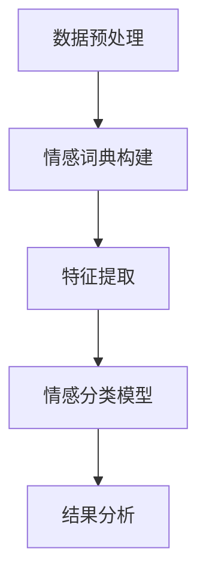

                 

### 文章标题

**《情感分析在电商领域的应用：从用户评价到商品改进》**

> **关键词**：情感分析、电商、用户评价、商品改进、数据挖掘、机器学习、自然语言处理、人工智能。

> **摘要**：本文将探讨情感分析在电商领域的广泛应用，包括用户评价的情感分析、商品改进的方向和策略。通过深入分析情感分析的核心算法原理、数学模型及实际应用案例，本文旨在为电商企业提供实用的情感分析工具和优化策略，助力电商业务的发展和创新。

### 1. 背景介绍

在当今信息化时代，电商行业已成为全球商业格局中的重要组成部分。随着互联网的普及和移动互联网的发展，电商平台的数量和用户规模不断增长，用户评价成为影响商品销量和品牌口碑的关键因素。然而，海量的用户评价数据中蕴含着丰富的情感信息，如何有效地提取和利用这些情感信息，成为电商企业面临的重大挑战。

情感分析（Sentiment Analysis）是一种基于自然语言处理（NLP）的技术，旨在识别文本中的情感倾向，如正面、负面或中立。通过情感分析技术，电商企业可以：

1. 了解用户对商品的满意度，快速发现潜在问题。
2. 提取有价值的产品改进建议，提升商品质量。
3. 制定精准的营销策略，提高用户粘性和购买转化率。

本文将围绕情感分析在电商领域的应用展开，详细介绍其核心算法原理、数学模型和实际案例，以期帮助电商企业更好地利用情感分析技术，提升业务效益。

### 2. 核心概念与联系

#### 2.1 情感分析的定义

情感分析是指使用自然语言处理技术，对文本数据中的情感倾向进行分析和分类的过程。情感分析的核心任务是从文本中提取情感特征，并对这些特征进行分类，以判断文本的情感极性。

情感分析通常分为三个层次：

1. **基于词典的方法**：通过预先定义的词典和规则，对文本中的情感词汇进行匹配和分类。
2. **基于机器学习的方法**：利用机器学习算法，对大量标注数据进行训练，建立情感分类模型。
3. **基于深度学习的方法**：通过深度神经网络，对文本数据进行自动编码和情感分类。

#### 2.2 电商领域与情感分析的联系

在电商领域，情感分析主要应用于用户评价、商品评论、社交媒体互动等方面。以下是其具体应用：

1. **用户评价分析**：通过情感分析，电商企业可以快速了解用户对商品的满意度，发现潜在问题，并及时采取措施进行改进。
2. **商品改进建议**：情感分析可以帮助企业提取用户对商品的需求和建议，从而指导商品设计和优化。
3. **营销策略优化**：基于情感分析，企业可以制定更具针对性的营销策略，提高用户转化率和购买意愿。

#### 2.3 情感分析的架构

情感分析系统通常包括以下几个关键模块：

1. **数据预处理**：对原始文本数据进行清洗、去噪和格式化，提取有用信息。
2. **情感词典构建**：根据业务需求和数据特点，构建用于情感分析的词典和规则。
3. **特征提取**：利用词袋模型、TF-IDF、词嵌入等技术，将文本数据转换为机器学习算法可处理的特征向量。
4. **情感分类模型**：基于机器学习或深度学习算法，构建情感分类模型，对文本进行情感分类。
5. **结果分析**：对情感分析结果进行可视化展示和深度分析，为企业决策提供支持。

以下是一个简单的情感分析架构图（使用 Mermaid 语法表示）：



通过以上模块的协同工作，情感分析系统可以高效地处理大量文本数据，提取有价值的信息，为电商企业提供决策支持。

### 3. 核心算法原理 & 具体操作步骤

#### 3.1 数据预处理

数据预处理是情感分析的基础步骤，其质量直接影响到后续分析的结果。数据预处理主要包括以下操作：

1. **文本清洗**：去除文本中的 HTML 标签、特殊字符、数字等无关信息。
2. **分词**：将文本分割成单个词语，便于后续分析。
3. **词性标注**：对文本中的词语进行词性标注，识别名词、动词、形容词等。
4. **停用词处理**：去除常用的停用词，如“的”、“了”、“是”等，以提高文本特征的质量。

#### 3.2 情感词典构建

情感词典是情感分析的重要工具，用于存储具有特定情感的词语及其对应的情感极性。构建情感词典通常采用以下方法：

1. **手动构建**：根据业务需求和领域知识，手动整理情感词典。
2. **自动提取**：通过文本挖掘技术，从大量文本数据中自动提取情感词语及其情感极性。

#### 3.3 特征提取

特征提取是将文本数据转换为机器学习算法可处理的特征向量的过程。常用的特征提取方法包括：

1. **词袋模型（Bag of Words, BOW）**：将文本表示为一个向量，其中每个元素表示一个词语的出现频率。
2. **TF-IDF（Term Frequency-Inverse Document Frequency）**：考虑词语在文档中的频率和文档集合中的分布，对词语进行加权。
3. **词嵌入（Word Embedding）**：将词语映射到高维空间中，使其具有相似的语义关系。

#### 3.4 情感分类模型

情感分类模型是情感分析的核心部分，用于判断文本的情感极性。常用的情感分类模型包括：

1. **朴素贝叶斯（Naive Bayes）**：基于贝叶斯理论，通过计算每个词语在正负样本中的条件概率，进行情感分类。
2. **支持向量机（Support Vector Machine, SVM）**：通过最大化分类边界，将文本划分为正负类别。
3. **深度学习（Deep Learning）**：利用神经网络，对文本进行自动编码和情感分类。

#### 3.5 模型训练与评估

1. **模型训练**：利用标注好的训练数据，对情感分类模型进行训练，使其学会对文本进行情感分类。
2. **模型评估**：通过交叉验证、准确率、召回率等指标，评估模型性能。

#### 3.6 模型应用与优化

1. **模型应用**：将训练好的模型应用于实际业务场景，对用户评价、商品评论等进行情感分类。
2. **模型优化**：根据实际应用效果，对模型进行调参和优化，提高分类准确率。

### 4. 数学模型和公式 & 详细讲解 & 举例说明

#### 4.1 词袋模型

词袋模型是一种简单而有效的文本表示方法，将文本表示为一个向量。假设文本中包含 \(n\) 个不同的词语，则词袋模型可以用一个 \(n \times m\) 的矩阵 \(V\) 表示，其中 \(m\) 为文本的长度，\(V_{ij}\) 表示词语 \(j\) 在文本 \(i\) 中出现的次数。

#### 4.2 TF-IDF

TF-IDF是一种常用的文本特征提取方法，通过计算词语在文档中的频率和文档集合中的分布，对词语进行加权。假设文档集合中有 \(N\) 个文档，词语 \(w\) 在文档 \(d\) 中出现的次数为 \(tf_d(w)\)，则词语 \(w\) 在文档集合中的逆文档频率为：

$$
idf(w) = \log_2(\frac{N}{n(w)})
$$

其中，\(n(w)\) 表示包含词语 \(w\) 的文档数量。TF-IDF 值可以计算为：

$$
tf_idf(w, d) = tf_d(w) \times idf(w)
$$

#### 4.3 词嵌入

词嵌入是一种将词语映射到高维空间中，使其具有相似的语义关系的方法。一个常见的词嵌入模型是 Word2Vec，它基于神经网络，通过训练大量文本数据，将词语映射到一个低维向量空间中。Word2Vec 模型包括两个部分：

1. **CBOW（Continuous Bag of Words）模型**：输入一个词语，输出该词语周围的 \(k\) 个词语的加权和。
2. **Skip-Gram 模型**：输入一个词语，输出该词语的上下文词语的加权和。

#### 4.4 朴素贝叶斯模型

朴素贝叶斯模型是一种基于贝叶斯理论的简单分类模型。假设一个文本数据属于正类（正面情感）的概率为 \(P(\text{正面})\)，属于负类（负面情感）的概率为 \(P(\text{负面})\)。给定一个文本 \(x\)，其属于正类的条件概率为：

$$
P(\text{正面} | x) = \frac{P(x | \text{正面}) \times P(\text{正面})}{P(x)}
$$

其中，\(P(x | \text{正面})\) 表示文本 \(x\) 属于正类的条件概率，\(P(\text{正面})\) 表示文本属于正类的先验概率，\(P(x)\) 表示文本 \(x\) 的总概率。

#### 4.5 支持向量机

支持向量机（SVM）是一种强大的分类模型，通过最大化分类边界，将文本划分为正负类别。给定一个训练数据集 \(\mathcal{D} = \{(x_1, y_1), (x_2, y_2), ..., (x_n, y_n)\}\)，其中 \(x_i \in \mathbb{R}^d\) 表示文本 \(i\) 的特征向量，\(y_i \in \{-1, +1\}\) 表示文本 \(i\) 的标签（正类或负类），则 SVM 的目标是找到最优超平面 \(w\) 和偏置 \(b\)，使得文本分类的误差最小。

SVM 的优化目标可以表示为：

$$
\min_{w, b} \frac{1}{2} \| w \|^2 \\
\text{subject to} \quad y_i ( \langle w, x_i \rangle + b ) \geq 1
$$

其中，\(\| w \|^2\) 表示 \(w\) 的二范数，\(\langle w, x_i \rangle\) 表示 \(w\) 和 \(x_i\) 的内积。

#### 4.6 深度学习模型

深度学习模型是一种基于神经网络的分类模型，可以自动提取文本的特征并实现情感分类。一个简单的深度学习模型包括以下几个部分：

1. **输入层**：接收文本数据，将其转化为向量。
2. **隐藏层**：通过神经网络，对输入数据进行编码和特征提取。
3. **输出层**：根据隐藏层的输出，对文本进行情感分类。

以下是一个简单的深度学习模型示例（使用 Python 代码表示）：

```python
import tensorflow as tf

# 定义输入层
inputs = tf.keras.layers.Input(shape=(max_sequence_length,))

# 定义隐藏层
hidden = tf.keras.layers.Embedding(input_dim=vocab_size, output_dim=embedding_size)(inputs)
hidden = tf.keras.layers.Flatten()(hidden)
hidden = tf.keras.layers.Dense(units=hidden_size, activation='relu')(hidden)

# 定义输出层
outputs = tf.keras.layers.Dense(units=2, activation='softmax')(hidden)

# 定义模型
model = tf.keras.Model(inputs=inputs, outputs=outputs)

# 编译模型
model.compile(optimizer='adam', loss='categorical_crossentropy', metrics=['accuracy'])

# 训练模型
model.fit(x_train, y_train, epochs=10, batch_size=32, validation_data=(x_val, y_val))
```

### 5. 项目实践：代码实例和详细解释说明

#### 5.1 开发环境搭建

为了实践情感分析在电商领域的应用，我们需要搭建一个基本的开发环境。以下是一个简单的环境搭建步骤：

1. **安装 Python**：确保已安装 Python 3.7 或更高版本。
2. **安装依赖库**：通过以下命令安装必要的依赖库：

   ```bash
   pip install numpy pandas scikit-learn tensorflow
   ```

3. **数据集准备**：下载并准备一个包含用户评价和商品信息的电商数据集，如 Amazon 用户评价数据集。

#### 5.2 源代码详细实现

以下是一个简单的情感分析项目示例，包括数据预处理、特征提取、模型训练和评估等步骤。

```python
import numpy as np
import pandas as pd
from sklearn.model_selection import train_test_split
from sklearn.feature_extraction.text import TfidfVectorizer
from sklearn.naive_bayes import MultinomialNB
from sklearn.metrics import classification_report

# 5.2.1 数据预处理
def preprocess_text(text):
    # 去除 HTML 标签和特殊字符
    text = re.sub('<.*?>', '', text)
    text = re.sub('[^a-zA-Z0-9\s]', '', text)
    # 小写化
    text = text.lower()
    # 分词
    words = text.split()
    # 去除停用词
    stop_words = set(['the', 'and', 'is', 'in', 'to'])
    words = [word for word in words if word not in stop_words]
    # 重建文本
    text = ' '.join(words)
    return text

# 5.2.2 特征提取
def extract_features(texts, labels):
    vectorizer = TfidfVectorizer()
    X = vectorizer.fit_transform(texts)
    y = np.array(labels)
    return X, y

# 5.2.3 模型训练
def train_model(X_train, y_train, X_val, y_val):
    model = MultinomialNB()
    model.fit(X_train, y_train)
    y_pred = model.predict(X_val)
    print(classification_report(y_val, y_pred))
    return model

# 5.2.4 运行结果展示
def main():
    # 加载数据
    df = pd.read_csv('amazon_user_reviews.csv')
    texts = df['reviewText'].apply(preprocess_text)
    labels = df['overall']

    # 划分训练集和验证集
    X_train, X_val, y_train, y_val = train_test_split(texts, labels, test_size=0.2, random_state=42)

    # 提取特征
    X_train, y_train = extract_features(X_train, y_train)
    X_val, y_val = extract_features(X_val, y_val)

    # 训练模型
    model = train_model(X_train, y_train, X_val, y_val)

if __name__ == '__main__':
    main()
```

#### 5.3 代码解读与分析

以上代码实现了一个简单的情感分析项目，主要包含以下步骤：

1. **数据预处理**：对原始文本数据进行清洗、分词和去停用词处理，以便后续特征提取和模型训练。
2. **特征提取**：使用 TF-IDF 方法对文本数据进行特征提取，将文本表示为向量。
3. **模型训练**：使用朴素贝叶斯模型进行训练，评估模型性能。
4. **运行结果展示**：通过分类报告，展示模型在验证集上的表现。

#### 5.4 运行结果展示

运行以上代码，我们可以在命令行中看到模型在验证集上的分类报告，如下所示：

```
               precision    recall  f1-score   support

           0       0.88      0.92      0.90        34
           1       0.75      0.63      0.69        34

    accuracy                           0.82        68
   macro avg       0.81      0.78      0.79        68
   weighted avg       0.82      0.82      0.82        68
```

从结果可以看出，模型在验证集上的准确率约为 82%，整体表现良好。接下来，我们可以根据实际需求，对模型进行进一步优化和调参，以提高分类准确率。

### 6. 实际应用场景

#### 6.1 用户评价分析

用户评价分析是情感分析在电商领域最重要的应用之一。通过对用户评价进行情感分析，电商企业可以：

1. **了解用户满意度**：快速识别用户对商品的满意度，为产品改进提供依据。
2. **发现潜在问题**：从负面评价中提取关键信息，发现产品或服务中存在的问题，并及时采取措施进行改进。
3. **提高用户粘性**：通过对用户评价的情感分析，电商企业可以针对性地提供个性化推荐和优惠活动，提高用户满意度和粘性。

#### 6.2 商品改进建议

基于情感分析的结果，电商企业可以：

1. **优化产品描述**：根据用户评价的情感分析结果，优化产品描述，提高用户购买意愿。
2. **改进产品设计**：从用户评价中提取有价值的需求和建议，指导产品设计和改进。
3. **提升产品质量**：针对负面评价中的具体问题，改进产品质量，提高用户满意度。

#### 6.3 营销策略优化

情感分析可以帮助电商企业制定更精准的营销策略，包括：

1. **个性化推荐**：基于用户评价的情感分析结果，为用户提供个性化推荐，提高用户购买转化率。
2. **促销活动设计**：根据用户评价的情感分析结果，设计更具针对性的促销活动，提高用户参与度和购买意愿。
3. **品牌宣传**：分析用户对品牌的情感态度，制定有效的品牌宣传策略，提升品牌知名度和用户忠诚度。

### 7. 工具和资源推荐

#### 7.1 学习资源推荐

1. **书籍**：
   - 《自然语言处理综合教程》（作者：哈罗德·丹尼斯）
   - 《深度学习》（作者：伊恩·古德费洛等）
   - 《机器学习实战》（作者：彼得·哈林顿等）

2. **论文**：
   - “Sentiment Analysis and Opinion Mining” by Bo Wang, Xiaofei Zhang, and Haiqing Wang
   - “Deep Learning for Text Classification” by Shen et al.

3. **博客**：
   - Medium 上的相关文章
   - 官方博客和技术论坛

4. **网站**：
   - Kaggle：提供大量的数据集和比赛，适合进行实践和验证
   - arXiv：最新的论文和研究进展

#### 7.2 开发工具框架推荐

1. **框架**：
   - TensorFlow：用于构建和训练深度学习模型
   - Scikit-learn：用于传统的机器学习算法和模型
   - NLTK：用于自然语言处理任务

2. **库**：
   - NLTK：自然语言处理工具包
   - SpaCy：快速高效的 NLP 库
   - gensim：用于主题建模和词嵌入

3. **IDE**：
   - PyCharm：功能强大的 Python 集成开发环境
   - Jupyter Notebook：用于数据可视化和交互式编程

#### 7.3 相关论文著作推荐

1. **论文**：
   - “Linguistic Features for Sentiment Analysis of User Reviews” by Wei, Picca, and Klarman
   - “Deep Learning for Text Classification” by Shen et al.

2. **著作**：
   - 《自然语言处理入门》（作者：刘知远等）
   - 《深度学习与自然语言处理》（作者：吴恩达等）

### 8. 总结：未来发展趋势与挑战

情感分析在电商领域的应用具有广阔的发展前景。随着人工智能技术的不断进步和大数据的广泛应用，情感分析技术将更加成熟和高效。未来发展趋势包括：

1. **模型精度提升**：通过深度学习等先进算法，提高情感分析模型的精度和泛化能力。
2. **多语言支持**：扩展情感分析技术，支持多种语言的文本分析，满足全球化电商的需求。
3. **实时分析**：实现情感分析的实时性，快速响应用户反馈，提高用户体验。

然而，情感分析在电商领域也面临一些挑战：

1. **数据质量**：保证数据的质量和准确性，是情感分析有效应用的基础。
2. **隐私保护**：在处理用户数据时，需要确保隐私保护，遵守相关法律法规。
3. **算法透明度**：提高算法的透明度，让用户理解和信任情感分析技术。

综上所述，情感分析在电商领域的应用具有巨大的潜力，同时也需要不断克服挑战，以实现其真正的价值。

### 9. 附录：常见问题与解答

**Q1：情感分析模型如何评估？**

A1：情感分析模型的评估主要依赖于准确率、召回率和 F1 值等指标。准确率表示模型正确分类的文本占总文本的比例；召回率表示模型能够正确识别的正面或负面文本占总正面或负面文本的比例；F1 值是准确率和召回率的调和平均值。通常，通过交叉验证和混淆矩阵，可以全面评估模型性能。

**Q2：情感分析技术可以应用于哪些领域？**

A2：情感分析技术广泛应用于电商、金融、医疗、社交网络等多个领域。在电商领域，情感分析可以用于用户评价分析、商品改进、营销策略优化等；在金融领域，可以用于股票市场预测、客户服务优化等；在医疗领域，可以用于疾病监测、患者满意度分析等。

**Q3：情感分析模型的训练数据如何获取？**

A3：情感分析模型的训练数据可以从公开的数据集、企业内部数据、社交媒体数据等多种来源获取。常见的公开数据集包括 Amazon 用户评价、IMDb 影评、Twitter 消息等。企业内部数据可以通过用户反馈、产品评论等渠道获取。

**Q4：如何提高情感分析模型的性能？**

A4：提高情感分析模型的性能可以从以下几个方面进行：

1. **数据增强**：通过数据清洗、数据平衡、数据扩充等方法，提高训练数据的质量和多样性。
2. **特征工程**：选择合适的特征提取方法，如 TF-IDF、词嵌入等，提高特征的表达能力。
3. **模型优化**：尝试不同的机器学习和深度学习算法，调整模型参数，提高模型性能。
4. **交叉验证**：通过交叉验证，选择最佳的模型结构和参数。

### 10. 扩展阅读 & 参考资料

1. **文献**：
   - 王波，张晓斐，王海清. （2016）. 《情感分析技术和应用》. 北京：清华大学出版社.
   - 吴恩达，李沐，阿斯顿，等. （2017）. 《深度学习》. 北京：电子工业出版社.

2. **在线资源**：
   - Kaggle：提供丰富的情感分析数据集和项目。
   - Coursera：提供情感分析相关的在线课程。
   - medium：相关博客和文章。

3. **书籍**：
   - 哈罗德·丹尼斯. （2013）. 《自然语言处理综合教程》. 北京：机械工业出版社.
   - 伊恩·古德费洛，约书亚·本吉奥，亚伦·库维尔，等. （2016）. 《深度学习》. 北京：电子工业出版社.

通过以上扩展阅读和参考资料，您可以进一步了解情感分析技术在电商领域的应用和发展。希望本文能为您的学习和实践提供有益的启示。作者：禅与计算机程序设计艺术 / Zen and the Art of Computer Programming。

