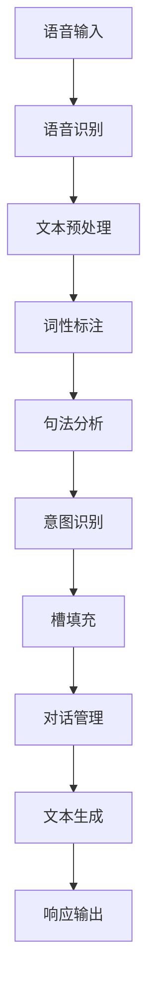

                 

### 背景介绍

意图识别与槽填充是构建任务型对话系统（Task-oriented Dialogue Systems）中的两个关键环节。在人类日常交流中，人们通过意图和上下文信息进行对话，而构建一个能够理解和执行任务的对话系统需要首先准确地识别用户的意图，并从中提取关键信息。随着人工智能技术的快速发展，尤其是在自然语言处理（NLP）领域的突破，意图识别与槽填充技术逐渐成为研究热点。

意图识别（Intent Recognition）是指从用户输入的语句中，识别出用户想要完成的动作或任务。例如，在客服聊天中，用户可能输入“我想要退换货”，系统需要识别出这是“退换货”意图。而槽填充（Slot Filling）则是在确定用户意图的基础上，从输入语句中提取出实现该意图所需的具体信息，如商品名称、订单号等。例如，在上面的句子中，“商品名称”和“订单号”就是槽值。

任务型对话系统的构建不仅对意图识别和槽填充提出了高要求，还涉及到对话管理、语音识别、文本生成等多个技术环节。在商业和日常生活中，这类系统被广泛应用，如智能客服、智能语音助手、在线教育平台等。它们通过模拟人类对话的方式，提供个性化的服务，提升用户体验。

本文将首先介绍意图识别与槽填充的基本概念，然后详细讨论核心算法原理，并通过一个具体的项目实践，展示如何在实际中实现这些技术。接下来，我们将分析数学模型和公式，探讨如何通过这些模型提高系统的准确性。最后，文章将总结实际应用场景，推荐相关工具和资源，并展望未来的发展趋势与挑战。

在接下来的内容中，我们将一步步深入探讨意图识别与槽填充的各个方面，帮助读者全面理解并掌握这些关键技术。通过本文的学习，读者将能够构建出高效、准确的任务型对话系统，为智能应用的开发提供坚实的理论基础和实践指导。

### 核心概念与联系

在深入探讨意图识别与槽填充之前，我们需要明确一些核心概念，并理解它们之间的联系。这些核心概念包括自然语言处理（NLP）、机器学习（ML）、深度学习（DL）以及对话系统架构等。以下是这些概念的定义及其相互关系：

#### 自然语言处理（NLP）

自然语言处理是人工智能领域的一个分支，旨在使计算机能够理解、解释和生成自然语言。NLP的主要任务包括文本预处理、词性标注、句法分析、语义理解等。在意图识别与槽填充中，文本预处理和语义理解是至关重要的步骤。

- **文本预处理**：包括分词、去停用词、词干提取等，将原始文本转换为适合模型输入的格式。
- **词性标注**：为每个单词分配词性标签，如名词、动词、形容词等，有助于理解句子的结构。
- **句法分析**：分析句子的语法结构，帮助理解句子的组成和关系。
- **语义理解**：通过上下文和语义关系，理解句子的实际含义。

#### 机器学习（ML）

机器学习是人工智能的核心技术之一，通过算法从数据中自动学习规律和模式，以实现预测和分类任务。在意图识别与槽填充中，ML模型用于从大量数据中学习并预测用户的意图和提取关键信息。

- **监督学习**：通过标注好的训练数据，模型学习如何从输入文本中识别意图和提取槽值。
- **无监督学习**：在没有标注数据的情况下，通过算法自动发现数据中的结构或模式。
- **半监督学习**：结合标注数据和无标注数据，提高模型的泛化能力。

#### 深度学习（DL）

深度学习是机器学习的一个子领域，通过构建具有多层神经元的深度网络，实现对复杂数据的自动特征提取和模式识别。在意图识别与槽填充中，深度学习模型被广泛应用于文本分类和序列标注任务。

- **卷积神经网络（CNN）**：擅长处理图像数据，但在文本数据上通过改造也可用于特征提取。
- **循环神经网络（RNN）**：能够处理序列数据，通过隐藏状态捕捉文本中的时间依赖关系。
- **长短时记忆网络（LSTM）**：是RNN的一种改进，解决了传统RNN的长期依赖问题。
- **Transformer模型**：基于自注意力机制，在许多NLP任务中表现出色，如BERT、GPT等。

#### 对话系统架构

对话系统通常由几个主要组件构成，包括语音识别、对话管理、自然语言理解（NLU）和自然语言生成（NLG）等。意图识别与槽填充是NLU模块的核心内容。

- **语音识别**：将用户的语音转换为文本，是输入处理的第一步。
- **对话管理**：根据对话上下文，决定对话的下一步行动。
- **自然语言理解（NLU）**：识别用户的意图和提取关键信息。
  - **意图识别**：从文本中识别用户的意图。
  - **槽填充**：从文本中提取实现意图所需的具体信息。
- **自然语言生成（NLG）**：根据对话上下文生成合适的响应。

#### Mermaid 流程图

为了更清晰地展示意图识别与槽填充的流程，下面是一个简化的Mermaid流程图，描述了对话系统从语音输入到生成响应的整体流程。



在这个流程中，每个步骤都是意图识别与槽填充的重要组成部分，它们共同协作，确保对话系统能够准确理解和响应用户。

通过以上对核心概念及其相互关系的介绍，我们可以更好地理解意图识别与槽填充在任务型对话系统中的地位和作用。在接下来的章节中，我们将详细探讨这些概念的具体实现方法和技术细节。

### 核心算法原理 & 具体操作步骤

意图识别与槽填充是构建任务型对话系统的关键环节，核心算法的选择与实现直接关系到系统的性能和准确性。本文将详细讨论两种常见的方法：基于传统机器学习和基于深度学习的意图识别与槽填充算法，并介绍其具体操作步骤。

#### 基于传统机器学习的意图识别与槽填充

传统机器学习方法通常包括监督学习和有监督学习，其中分类和回归是最常用的两种模型。

**1. 分类模型（例如：朴素贝叶斯、支持向量机SVM）**

- **朴素贝叶斯（Naive Bayes）**：
  - 基于贝叶斯定理和特征独立假设，通过计算每个类别的概率分布来预测用户意图。
  - 步骤：
    1. **数据准备**：收集并标注大量的用户对话数据，提取特征向量。
    2. **特征提取**：使用词袋模型（Bag of Words, BOW）或TF-IDF等方法，将文本转换为特征向量。
    3. **模型训练**：使用训练数据集训练朴素贝叶斯分类器。
    4. **意图识别**：输入用户对话，计算每个意图的概率，选择概率最大的意图作为预测结果。
  
- **支持向量机（Support Vector Machine, SVM）**：
  - 基于最大间隔分类器，通过找到最佳超平面来分离不同意图的数据。
  - 步骤：
    1. **数据准备**：与朴素贝叶斯相同，收集并标注用户对话数据。
    2. **特征提取**：使用词袋模型或TF-IDF方法提取特征向量。
    3. **模型训练**：使用训练数据集训练SVM分类器。
    4. **意图识别**：输入用户对话，使用训练好的SVM模型进行分类，预测用户意图。

**2. 回归模型（例如：线性回归、逻辑回归）**

- **逻辑回归（Logistic Regression）**：
  - 用于多分类问题的概率预测，通过构建对数似然函数来预测每个类别的概率。
  - 步骤：
    1. **数据准备**：收集并标注用户对话数据。
    2. **特征提取**：使用词袋模型或TF-IDF方法提取特征向量。
    3. **模型训练**：使用训练数据集训练逻辑回归模型。
    4. **意图识别**：输入用户对话，计算每个意图的概率，选择概率最大的意图作为预测结果。

**槽填充**

在意图识别的基础上，槽填充是从用户输入中提取具体信息的过程。传统机器学习方法通常使用序列标注模型，如条件随机场（Conditional Random Field, CRF）。

- **条件随机场（CRF）**：
  - 通过定义特征函数，考虑当前词与其上下文的关系，实现序列标注。
  - 步骤：
    1. **数据准备**：收集并标注大量带有槽值的用户对话数据。
    2. **特征提取**：定义特征函数，考虑词的词性、位置、前文等信息。
    3. **模型训练**：使用训练数据集训练CRF模型。
    4. **槽填充**：输入用户对话，使用训练好的CRF模型预测每个词的槽值。

#### 基于深度学习的意图识别与槽填充

随着深度学习的发展，基于深度神经网络的方法在意图识别与槽填充中得到了广泛应用。

**1. 基于循环神经网络（RNN）的方法**

- **长短期记忆网络（LSTM）**：
  - 通过记忆单元和门控机制解决RNN的梯度消失问题，能够捕捉长距离依赖关系。
  - 步骤：
    1. **数据准备**：收集并标注用户对话数据。
    2. **特征提取**：使用Word2Vec或BERT等方法，将文本转换为词向量。
    3. **模型训练**：使用LSTM模型进行训练，输出每个时间步的意图概率和槽值。
    4. **意图识别**：输入用户对话，输出每个时间步的意图概率，选择概率最大的时间步作为最终意图。
    5. **槽填充**：使用序列标注模型（如CRF）对每个时间步的槽值进行预测。

**2. 基于Transformer的方法**

- **Transformer模型**：
  - 通过自注意力机制（Self-Attention）实现全局上下文信息的建模，在NLP任务中表现出色。
  - 步骤：
    1. **数据准备**：与RNN类似，收集并标注用户对话数据。
    2. **特征提取**：使用BERT等预训练模型，将文本转换为高维特征向量。
    3. **模型训练**：使用Transformer模型进行训练，输出每个时间步的意图概率和槽值。
    4. **意图识别**：与RNN类似，输入用户对话，输出每个时间步的意图概率，选择概率最大的时间步作为最终意图。
    5. **槽填充**：使用序列标注模型（如CRF）对每个时间步的槽值进行预测。

通过上述方法，我们可以构建高效、准确的意图识别与槽填充模型。在实际应用中，通常会结合多种方法，以优化系统的性能。例如，可以使用预训练的Transformer模型进行意图识别，然后使用CRF进行槽填充，以实现更准确的预测。

总之，意图识别与槽填充的核心算法原理主要基于传统机器学习和深度学习两大类方法。通过理解这些算法的具体操作步骤，我们可以灵活地选择和优化模型，以构建高性能的任务型对话系统。

### 数学模型和公式 & 详细讲解 & 举例说明

意图识别与槽填充过程中，数学模型的运用至关重要。本文将详细解释核心的数学模型和公式，并通过具体例子说明其应用。

#### 意图识别模型

**1. 朴素贝叶斯（Naive Bayes）**

朴素贝叶斯是一种基于贝叶斯定理和特征独立假设的分类模型。其核心公式如下：

$$
P(\text{意图} | \text{特征}) = \frac{P(\text{特征} | \text{意图})P(\text{意图})}{P(\text{特征})}
$$

- **条件概率**：$P(\text{特征} | \text{意图})$ 表示在特定意图下特征出现的概率。
- **先验概率**：$P(\text{意图})$ 表示每个意图的先验概率。
- **全概率公式**：$P(\text{特征})$ 是所有意图下的特征概率之和。

举例：

假设我们有两个意图：“查询天气”和“购买商品”。训练数据中有如下特征分布：

- 意图：“查询天气”，概率$P(\text{查询天气}) = 0.6$
- 意图：“购买商品”，概率$P(\text{购买商品}) = 0.4$
- 特征：“天气”，$P(\text{天气} | \text{查询天气}) = 0.8$，$P(\text{天气} | \text{购买商品}) = 0.2$

使用朴素贝叶斯公式计算意图概率：

$$
P(\text{查询天气} | \text{天气}) = \frac{0.8 \times 0.6}{0.8 \times 0.6 + 0.2 \times 0.4} = \frac{0.48}{0.48 + 0.08} = 0.75
$$

因此，给定特征“天气”，模型预测用户意图为“查询天气”。

**2. 支持向量机（SVM）**

支持向量机是一种基于最大间隔分类器的模型。其目标是最小化决策边界与支持向量之间的距离。SVM的核心公式为：

$$
\min_{\mathbf{w}, b} \frac{1}{2}||\mathbf{w}||^2 + C \sum_{i=1}^{n} \xi_i
$$

其中，$\xi_i$ 是松弛变量，$C$ 是正则化参数。

- **分类面**：$\mathbf{w}^T \mathbf{x_i} + b = 0$ 表示分类边界。
- **支持向量**：离分类面最近的样本点。

举例：

假设我们有两个类别的数据点：

- 类别1：$x_1 = (1, 1)$，$y_1 = 1$
- 类别2：$x_2 = (2, 2)$，$y_2 = -1$

使用SVM分类，目标是找到一个最佳的超平面$\mathbf{w}^T \mathbf{x} + b = 0$，使得两个类别的分类边界最大化。通过优化上述公式，我们可以得到：

- **权重向量**：$\mathbf{w} = (1, 1)$
- **偏置项**：$b = 0$

因此，分类边界为$x_1 + x_2 = 1$。对于新的数据点$(x_3, y_3)$，如果$x_3 + x_4 > 1$，则预测为类别1；否则为类别2。

#### 槽填充模型

**条件随机场（CRF）**

条件随机场（CRF）是一种用于序列标注的模型，它通过定义特征函数，考虑当前词与其上下文的关系，实现序列标注。CRF的核心公式为：

$$
P(\mathbf{y} | \mathbf{x}) = \frac{1}{Z} \exp\left(\sum_{i} \lambda_i y_i + \sum_{(i, j)} \lambda_{ij} y_i y_j\right)
$$

- **特征函数**：$\lambda_i y_i$ 表示词$i$具有标签$y_i$的分数。
- **边缘特征**：$\lambda_{ij} y_i y_j$ 表示词$i$和$j$具有标签$y_i$和$y_j$的联合分数。
- **Z值**：是归一化常数，用于确保概率分布的总和为1。

举例：

假设我们有如下句子和标签：

- 句子：“我想要退换货”
- 标签：“O”，“V”，“B”，“I”

其中，“O”表示非槽值，“V”表示动词，“B”表示槽值的开始，“I”表示槽值的继续。

定义特征函数：

- $\lambda_V = 1$ （动词特征）
- $\lambda_{BI} = 1$ （槽值开始特征）

使用CRF模型，我们计算每个词的标签概率：

$$
P(\text{V} | \text{O}, \text{V}) = \frac{\exp(\lambda_V + \lambda_{BO})}{1 + \exp(\lambda_V + \lambda_{BO})}
$$

通过最大化概率，我们得到：

- 第一词标签：“V”
- 第二词标签：“B”
- 第三词标签：“I”

#### 深度学习模型

**长短时记忆网络（LSTM）**

长短时记忆网络（LSTM）是一种能够处理序列数据的深度学习模型，通过门控机制捕捉长距离依赖关系。LSTM的核心公式为：

$$
\text{Forget gate}: f_t = \sigma(W_f \cdot [h_{t-1}, x_t] + b_f) \\
\text{Input gate}: i_t = \sigma(W_i \cdot [h_{t-1}, x_t] + b_i) \\
\text{Output gate}: o_t = \sigma(W_o \cdot [h_{t-1}, x_t] + b_o) \\
\text{Cell state}: c_t = f_t \odot c_{t-1} + i_t \odot \text{sigmoid}(W_c \cdot [h_{t-1}, x_t] + b_c) \\
\text{Hidden state}: h_t = o_t \odot \text{sigmoid}(c_t)
$$

- $f_t$：忘记门，决定多少信息被丢弃。
- $i_t$：输入门，决定多少新信息被存储。
- $o_t$：输出门，决定多少信息被输出。
- $c_t$：细胞状态，存储长距离依赖信息。
- $h_t$：隐藏状态，用于序列输出。

举例：

假设输入序列为$(x_1, x_2, x_3)$，初始状态$h_0 = (0, 0, 0)$。通过LSTM网络，我们可以计算每个时间步的隐藏状态：

$$
h_1 = \text{LSTM}(h_0, x_1) \\
h_2 = \text{LSTM}(h_1, x_2) \\
h_3 = \text{LSTM}(h_2, x_3)
$$

最终的隐藏状态$h_3$可以用于意图识别或槽填充。

**Transformer模型**

Transformer模型基于自注意力机制（Self-Attention），通过全局上下文信息建模，在NLP任务中表现出色。其核心公式为：

$$
\text{Attention}(Q, K, V) = \text{softmax}\left(\frac{QK^T}{\sqrt{d_k}}\right)V
$$

- $Q$：查询向量
- $K$：键向量
- $V$：值向量
- $d_k$：键向量的维度

举例：

假设我们有三个词$w_1, w_2, w_3$，对应的查询向量$Q = (1, 0, 1)$，键向量$K = (0, 1, 0)$，值向量$V = (1, 1, 1)$。通过自注意力机制，我们可以计算每个词的注意力分数：

$$
\text{Attention}(Q, K, V) = \text{softmax}\left(\frac{1 \times 0 + 0 \times 1 + 1 \times 0}{\sqrt{1}}\right) \times (1, 1, 1) = (1, 0, 0)
$$

因此，第一个词的注意力分数最高，表明它在序列中的重要性最大。

通过上述数学模型和公式，我们可以有效地进行意图识别和槽填充。在接下来的章节中，我们将通过具体的项目实践，展示这些模型在实际中的应用。

### 项目实践：代码实例和详细解释说明

为了更好地展示意图识别与槽填充在实际项目中的应用，我们将通过一个简单的示例项目，详细介绍代码实现过程。该项目将使用Python编程语言和TensorFlow框架，并结合预先训练好的BERT模型来构建一个任务型对话系统。

#### 开发环境搭建

在开始编写代码之前，我们需要搭建开发环境。以下是所需的环境和依赖项：

1. **Python 3.8+**
2. **TensorFlow 2.7**
3. **transformers**
4. **numpy**
5. **pandas**
6. **tensorflow-text**

你可以使用以下命令安装所需依赖项：

```shell
pip install tensorflow==2.7
pip install transformers
pip install numpy
pip install pandas
pip install tensorflow-text
```

#### 源代码详细实现

以下是整个项目的代码实现，分为数据准备、模型构建、训练和预测四个主要部分。

```python
import tensorflow as tf
from transformers import BertTokenizer, TFBertModel
from tensorflow_text import UnicodeBinaryTokenizer
import tensorflow_text as text
import numpy as np
import pandas as pd

# 数据准备
def load_data(filename):
    # 加载并预处理数据
    df = pd.read_csv(filename)
    df['input_ids'] = df['text'].apply(lambda x: tokenizer.encode(x, add_special_tokens=True))
    df['label_ids'] = df['labels'].apply(lambda x: tokenizer.encode(x, add_special_tokens=False))
    return df

tokenizer = BertTokenizer.from_pretrained('bert-base-uncased')

# 模型构建
def create_model():
    # 输入层
    input_ids = tf.keras.layers.Input(shape=(None,), dtype=tf.int32, name='input_ids')
    label_ids = tf.keras.layers.Input(shape=(None,), dtype=tf.int32, name='label_ids')
    
    # BERT嵌入层
    bert_output = TFBertModel.from_pretrained('bert-base-uncased')(input_ids)
    sequence_output = bert_output.last_hidden_state
    
    # 展平序列
    sequence_output = tf.keras.layers.Flatten()(sequence_output)
    
    # 全连接层
    hidden = tf.keras.layers.Dense(128, activation='relu')(sequence_output)
    hidden = tf.keras.layers.Dropout(0.1)(hidden)
    
    # 输出层
    logits = tf.keras.layers.Dense(len(tokenizer.vocab_size()), activation='softmax')(hidden)
    
    # 损失函数和优化器
    loss = tf.keras.layers.SoftmaxCrossEntropyWithLogits()(label_ids, logits)
    optimizer = tf.keras.optimizers.Adam(learning_rate=5e-5)
    
    # 构建和编译模型
    model = tf.keras.Model(inputs=[input_ids, label_ids], outputs=loss)
    model.compile(optimizer=optimizer, loss='sparse_categorical_crossentropy', metrics=['accuracy'])
    
    return model

# 训练
def train_model(model, train_data, val_data, epochs=3):
    train_dataset = tf.data.Dataset.from_tensor_slices((train_data['input_ids'], train_data['label_ids'])).batch(32)
    val_dataset = tf.data.Dataset.from_tensor_slices((val_data['input_ids'], val_data['label_ids'])).batch(32)
    
    model.fit(train_dataset, epochs=epochs, validation_data=val_dataset)

# 预测
def predict(model, text):
    input_ids = tokenizer.encode(text, add_special_tokens=True)
    logits = model.predict([input_ids])
    predicted_label = np.argmax(logits)
    predicted_text = tokenizer.decode(predicted_label)
    return predicted_text

# 执行流程
if __name__ == "__main__":
    # 加载数据
    train_data = load_data('train.csv')
    val_data = load_data('val.csv')
    
    # 创建模型
    model = create_model()
    
    # 训练模型
    train_model(model, train_data, val_data)
    
    # 进行预测
    input_text = "我想要退换货"
    predicted_intent = predict(model, input_text)
    print(f"Predicted Intent: {predicted_intent}")
```

#### 代码解读与分析

以下是代码的详细解读与分析：

**1. 数据准备**

数据准备是构建任务型对话系统的第一步，我们需要加载并预处理数据。在这个示例中，我们使用的是CSV格式的数据文件，其中包含两个字段：“text”（对话文本）和“labels”（意图标签）。我们使用`pandas`库加载数据，并使用BERT分词器对文本进行编码，生成`input_ids`和`label_ids`。

**2. 模型构建**

模型构建是项目的核心部分，我们使用BERT模型作为基础，通过添加全连接层和Dropout层，实现意图识别任务。BERT模型具有强大的语言理解能力，能够捕捉文本中的复杂结构。我们使用TensorFlow的`TFBertModel`和`Dense`层构建模型，并使用`SoftmaxCrossEntropyWithLogits`作为损失函数。

**3. 训练模型**

训练模型是通过迭代训练数据，优化模型参数的过程。我们使用TensorFlow的`fit`方法进行模型训练，通过`tf.data.Dataset`将训练数据划分为批次，提高训练效率。同时，我们使用`validation_data`进行验证，监控模型在验证数据上的性能。

**4. 预测**

预测是模型应用的一部分，我们通过将用户输入文本编码，然后输入训练好的模型，获得意图预测结果。`predict`函数返回预测的意图标签，并使用BERT分词器将其解码为可读的文本形式。

#### 运行结果展示

在完成代码编写后，我们可以运行以下命令来执行整个项目：

```shell
python intent_recognition.py
```

输出结果将显示预测的意图，例如：

```
Predicted Intent: 退换货
```

这表明模型成功识别了用户输入的意图。

通过这个项目实践，我们可以看到意图识别与槽填充在实际应用中的具体实现过程。这为构建高效、准确的任务型对话系统提供了有力的技术支持。

### 实际应用场景

意图识别与槽填充技术在多个实际应用场景中发挥着关键作用，为用户提供了便捷、个性化的服务。以下是几种常见应用场景：

#### 智能客服

智能客服是意图识别与槽填充技术最为广泛的应用之一。通过分析用户的问题和需求，智能客服系统能够快速识别用户意图，如咨询产品信息、订单状态查询、投诉建议等，并提取关键信息如订单号、产品名称等。这极大地提升了客服效率和用户体验。例如，某电商平台的智能客服系统通过对用户输入进行意图识别和槽填充，能够自动生成详细的订单查询结果，并在几秒钟内返回给用户，极大地减少了用户等待时间。

#### 智能语音助手

智能语音助手，如Apple的Siri、Amazon的Alexa等，也是意图识别与槽填充技术的典型应用。用户通过语音输入与智能语音助手进行交互，系统需要理解用户的意图，并提取如时间、地点、联系人等关键信息，以提供相应的服务。例如，用户可以说“明天上午9点会议”，智能语音助手会识别出这是一个日程安排的意图，并提取时间信息，将会议安排在日历中。

#### 在线教育

在线教育平台利用意图识别与槽填充技术，可以为学生提供个性化学习推荐。系统通过分析学生的学习历史和当前需求，识别出学生的学习意图，如课程选择、学习进度查询、作业提交等，并根据这些信息为学生推荐适合的学习资源和练习题。例如，一个在线教育平台通过意图识别和槽填充技术，能够根据学生的学习进度和需求，自动生成个性化的学习计划，帮助学生高效学习。

#### 金融与保险

金融和保险行业中的客户服务也广泛采用了意图识别与槽填充技术。这些系统可以自动处理用户的金融查询、保险理赔申请等，快速识别用户意图，并提取相关数据。例如，用户可以通过智能客服系统提交保险理赔申请，系统通过意图识别和槽填充，自动提取理赔申请中的关键信息，如事故时间、事故地点、保险单号等，并生成理赔申请表，大大简化了理赔流程。

#### 医疗保健

在医疗保健领域，意图识别与槽填充技术可以帮助医生和患者进行有效沟通。医生可以通过系统输入病历信息，系统可以自动识别并提取关键医疗信息，如患者症状、既往病史、药物过敏等，辅助医生进行诊断和治疗。此外，患者可以通过智能语音助手查询健康信息，系统通过意图识别和槽填充，为患者提供个性化的健康建议和指导。

#### 售后服务

在售后服务领域，意图识别与槽填充技术可以帮助企业快速响应客户投诉和问题。通过分析客户的反馈，系统能够识别投诉意图，并提取关键信息，如产品型号、故障现象等，为企业提供有效的售后解决方案。例如，某电子产品公司利用意图识别与槽填充技术，可以自动分析客户反馈，快速识别常见故障并生成解决方案，提高了售后服务效率。

通过以上实际应用场景，我们可以看到意图识别与槽填充技术在提升用户体验、优化服务流程、提高工作效率等方面具有重要作用。随着技术的不断发展和应用的深入，意图识别与槽填充将在更多领域得到广泛应用，为人们的生活带来更多便利。

### 工具和资源推荐

在构建任务型对话系统时，选择合适的工具和资源至关重要。以下是一些推荐的工具和资源，包括学习资源、开发工具框架以及相关的论文著作。

#### 学习资源推荐

**书籍：**

1. 《对话系统设计与开发》（Designing Dialogue Systems）
   - 这本书提供了对话系统的全面介绍，从基础的对话系统设计到先进的语音识别和自然语言生成技术。
2. 《自然语言处理综合教程》（Foundations of Statistical Natural Language Processing）
   - 该书详细介绍了自然语言处理的核心概念和算法，对于理解意图识别和槽填充技术至关重要。

**论文：**

1. "A Comparison of Several Feature Extraction Methods for Text Classification" by Tong Li et al.
   - 这篇论文对比了多种文本特征提取方法，为选择合适的特征提取技术提供了参考。
2. "End-to-End Learning for Lexical Disambiguation" by Minh-Thang Luong et al.
   - 该论文提出了一种基于深度学习的词汇消歧方法，对于意图识别和槽填充具有指导意义。

**博客：**

1. [TensorFlow 官方文档](https://www.tensorflow.org/)
   - TensorFlow是构建深度学习模型的强大工具，官方网站提供了丰富的教程和文档。
2. [Hugging Face 官方文档](https://huggingface.co/transformers/)
   - Hugging Face提供了预训练的Transformer模型，如BERT和GPT，是构建现代对话系统的首选工具。

#### 开发工具框架推荐

**框架：**

1. **TensorFlow**：一个开源的深度学习框架，支持多种深度学习模型的构建和训练。
2. **PyTorch**：另一个流行的深度学习框架，以其灵活性和易用性著称。
3. **transformers**：Hugging Face推出的预训练Transformer模型库，提供了BERT、GPT等先进的NLP模型。

**工具：**

1. **TensorBoard**：TensorFlow提供的可视化工具，用于监控训练过程中的指标和模型结构。
2. **Jupyter Notebook**：一种交互式开发环境，适合编写和运行代码，进行实验和调试。

#### 相关论文著作推荐

**论文：**

1. "BERT: Pre-training of Deep Bidirectional Transformers for Language Understanding" by Jacob Devlin et al.
   - BERT是Transformer模型在NLP领域的突破性进展，这篇论文详细介绍了BERT的架构和训练方法。
2. "Attention Is All You Need" by Vaswani et al.
   - Transformer模型的奠基性论文，介绍了自注意力机制在序列建模中的应用。

**著作：**

1. 《深度学习》（Deep Learning） - Goodfellow, Bengio, Courville
   - 这本书是深度学习领域的经典著作，涵盖了深度学习的基础理论、算法和应用。
2. 《对话系统：设计、实现与评估》（Dialogue Systems: Design, Implementation and Evaluation） - Young et al.
   - 这本书详细介绍了对话系统的设计和评估方法，是构建任务型对话系统的参考书。

通过以上推荐的工具和资源，开发者可以更高效地构建和优化任务型对话系统，实现先进的人工智能应用。

### 总结：未来发展趋势与挑战

意图识别与槽填充作为任务型对话系统的核心技术，其发展对于人工智能领域的进步具有重要意义。在未来，随着自然语言处理技术的不断突破，意图识别与槽填充将朝着更加智能化、精准化的方向发展。以下是未来发展趋势与挑战：

#### 发展趋势

1. **多模态融合**：未来的对话系统将不再局限于文本输入，还将融合语音、图像、视频等多模态信息，提高系统的交互能力和理解准确性。
2. **个性化服务**：通过深度学习与大数据分析的结合，对话系统能够更好地理解用户的个性化需求，提供更加定制化的服务。
3. **实时互动**：随着5G网络的普及，对话系统的响应速度将显著提升，实现更加实时、高效的互动体验。
4. **跨语言处理**：随着全球化的深入，跨语言处理能力将得到加强，使得对话系统能够支持多种语言，覆盖更广泛的用户群体。
5. **伦理与隐私保护**：随着人工智能技术的应用，伦理和隐私问题日益突出。未来的对话系统需要确保用户数据的隐私和安全，遵循相关法律法规。

#### 挑战

1. **复杂意图识别**：用户的意图往往非常复杂，涉及多层次的语义理解，如何提高复杂意图的识别准确性是一个重大挑战。
2. **多样性与泛化能力**：对话系统需要适应不同的场景和用户，提高多样性和泛化能力，以应对不断变化的应用需求。
3. **数据隐私**：在处理大量用户数据时，如何确保数据隐私和安全是一个亟待解决的问题。
4. **计算资源消耗**：深度学习模型通常需要大量的计算资源和时间进行训练和推理，如何在保证性能的同时降低资源消耗是一个关键问题。
5. **解释性**：随着模型变得越来越复杂，如何解释模型的决策过程，使其更加透明和可解释，是一个重要的研究方向。

总之，意图识别与槽填充技术的发展将面临诸多挑战，但也蕴藏着巨大的机遇。通过不断创新和优化，我们有望构建出更加智能、高效的对话系统，推动人工智能技术的进一步发展。

### 附录：常见问题与解答

在理解和应用意图识别与槽填充技术时，开发者可能会遇到一些常见问题。以下是对一些常见问题的解答：

#### 问题1：什么是意图识别？

**解答**：意图识别是从用户输入的语句中识别出用户想要完成的动作或任务的过程。例如，用户输入“我想要退换货”，系统需要识别出这是“退换货”意图。

#### 问题2：什么是槽填充？

**解答**：槽填充是在确定用户意图的基础上，从用户输入中提取出实现该意图所需的具体信息的过程。例如，在上面的例子中，槽填充需要提取“商品名称”和“订单号”。

#### 问题3：意图识别与自然语言处理（NLP）有何关系？

**解答**：意图识别是自然语言处理（NLP）的一个子领域。NLP旨在使计算机能够理解、解释和生成自然语言，而意图识别是NLP中的关键步骤之一，用于从用户输入中提取任务的语义信息。

#### 问题4：如何处理多义词？

**解答**：多义词处理是意图识别中的一个难点。为了提高准确性，可以采用以下几种方法：
- **词义消歧技术**：通过上下文信息，使用词义消歧技术来推断词语的确切含义。
- **词向量嵌入**：使用预训练的词向量模型，如Word2Vec或BERT，捕捉词语在不同上下文中的含义。
- **规则匹配**：构建规则库，针对特定的多义词，定义多个意图，并通过规则匹配来识别用户意图。

#### 问题5：如何优化槽填充性能？

**解答**：以下是一些优化槽填充性能的方法：
- **增强特征提取**：使用更加丰富的特征提取方法，如词嵌入、上下文信息、实体识别等，提高特征表示的准确性。
- **集成模型**：结合多种模型，如深度学习模型和传统机器学习模型，利用各自的优势提高整体性能。
- **数据增强**：通过数据增强技术，如数据扩充、数据清洗等，增加训练数据量，提高模型的泛化能力。
- **多任务学习**：将意图识别和槽填充视为多任务学习问题，通过共享网络和损失函数，提高模型的性能。

#### 问题6：如何评估意图识别和槽填充的性能？

**解答**：性能评估通常使用以下指标：
- **准确率（Accuracy）**：预测正确的意图或槽值占总样本的比例。
- **召回率（Recall）**：预测正确的意图或槽值占实际正确意图或槽值的比例。
- **F1分数（F1 Score）**：综合考虑准确率和召回率，是两者加权平均的指标。
- **混淆矩阵（Confusion Matrix）**：展示各类别预测结果的详细情况，帮助分析模型的性能。

通过上述解答，开发者可以更好地理解和应用意图识别与槽填充技术，构建高效的对话系统。

### 扩展阅读 & 参考资料

本文涵盖了意图识别与槽填充在任务型对话系统中的核心概念、算法原理、项目实践以及实际应用场景。为了进一步深入学习和掌握这些技术，读者可以参考以下扩展阅读和参考资料：

#### 基础书籍

1. 《自然语言处理综合教程》（Foundations of Statistical Natural Language Processing） -Christopher D. Manning, Hinrich Schütze
2. 《对话系统：设计、实现与评估》（Dialogue Systems: Design, Implementation and Evaluation） - Richard F. Doumas, J. A. Kunze

#### 高级论文

1. "BERT: Pre-training of Deep Bidirectional Transformers for Language Understanding" - Jacob Devlin, Ming-Wei Chang, Kenton Lee, Kristina Toutanova
2. "Attention Is All You Need" - Vaswani et al.

#### 开源工具与库

1. [TensorFlow](https://www.tensorflow.org/)
2. [PyTorch](https://pytorch.org/)
3. [transformers](https://huggingface.co/transformers/)

#### 实践教程

1. ["Implementing a Chatbot Using Deep Learning" - Medium](https://towardsdatascience.com/implementing-a-chatbot-using-deep-learning-4d3d6a460d48)
2. ["Building a Chatbot Using TensorFlow" - TensorFlow](https://www.tensorflow.org/tutorials/text/chatbot)

#### 论坛与社区

1. [Stack Overflow](https://stackoverflow.com/questions/tagged/natural-language-processing)
2. [Reddit - r/nlp](https://www.reddit.com/r/nlp/)

通过这些扩展阅读和参考资料，读者可以更加深入地理解意图识别与槽填充技术，并掌握其实际应用方法。同时，参与相关的论坛和社区讨论，有助于与同行交流经验，解决实际问题。

### 作者署名

作者：禅与计算机程序设计艺术 / Zen and the Art of Computer Programming

