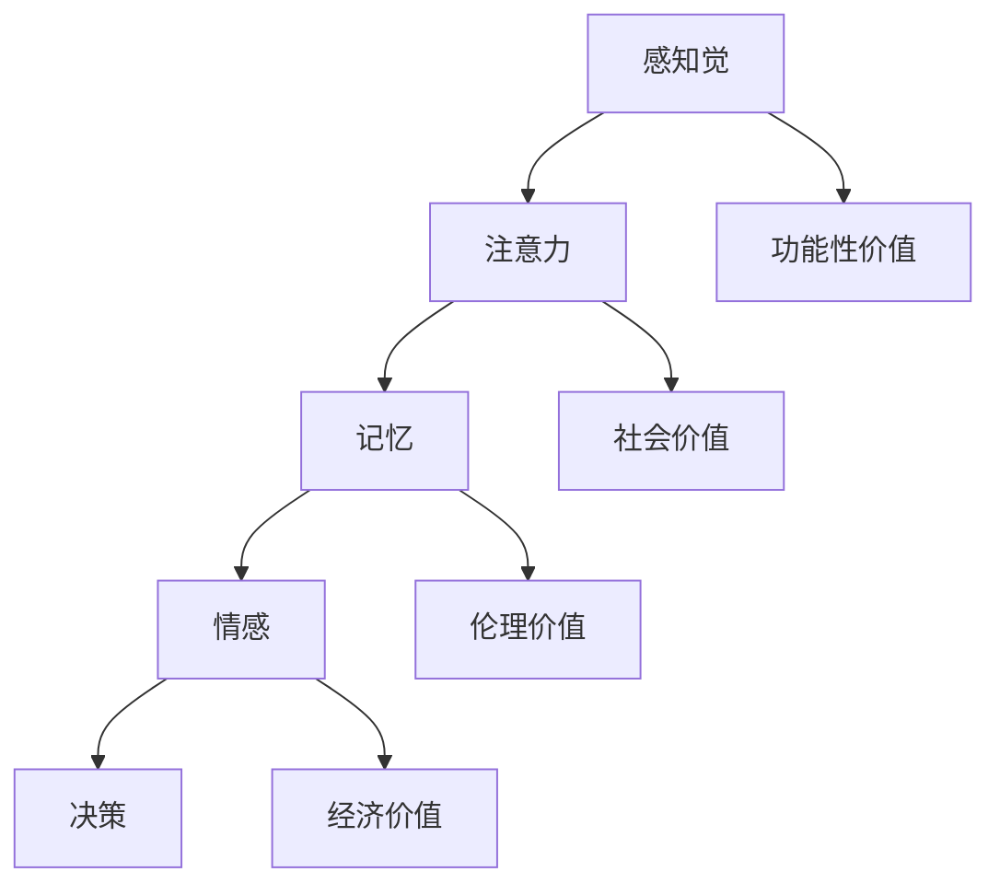

                 

### 意识功能的价值标准研究

> 关键词：意识功能、价值标准、技术评估、认知科学、人工智能

> 摘要：本文通过系统性地分析意识功能的核心属性，探讨了不同层面的价值标准对意识功能评估的重要性。文章首先回顾了意识功能的基本概念，然后深入探讨了意识功能的价值标准，最后结合当前的研究成果，提出了意识功能价值评估的框架，并展望了未来的研究方向。

## 1. 背景介绍

### 意识功能的概念

意识是人类心智的核心功能之一，它涉及对自身的感知、思考、情感和意愿等多个维度。根据认知科学的研究，意识功能可以细分为多个子模块，如感知觉、注意力、记忆、情感和决策等。这些子模块相互协作，共同构成复杂的意识活动。

### 价值标准的重要性

在科技迅猛发展的今天，人工智能（AI）和认知科学领域的突破为人类意识功能的研究提供了新的视角。然而，如何对意识功能进行价值评估，仍是一个具有挑战性的课题。价值标准不仅影响着我们对意识功能的理解，也决定了我们在技术进步中如何平衡人类福祉与科技发展。

## 2. 核心概念与联系

### 意识功能的核心概念

意识功能的核心概念包括但不限于：

- **感知觉**：对外部信息的接收和处理。
- **注意力**：选择和集中注意力的能力。
- **记忆**：信息的存储和检索。
- **情感**：情感体验和表达。
- **决策**：基于情境的决策过程。

### 意识功能的价值标准

意识功能的价值标准可以从多个层面进行评估：

- **功能性价值**：意识功能对于个体生存和发展的作用。
- **社会价值**：意识功能对于社会整体福祉的贡献。
- **伦理价值**：意识功能在伦理层面的考量和规范。
- **经济价值**：意识功能在技术商业应用中的潜在价值。

### 意识功能架构的 Mermaid 流程图



## 3. 核心算法原理 & 具体操作步骤

### 功能性价值的评估算法

**算法原理：** 通过对个体意识功能的表现进行量化分析，评估其在实际应用中的功能价值。

**操作步骤：**

1. **数据收集**：收集个体在特定任务中的表现数据。
2. **特征提取**：提取与意识功能相关的关键特征。
3. **模型训练**：使用机器学习算法训练评估模型。
4. **评估计算**：对个体的意识功能进行评估。

### 社会价值的评估算法

**算法原理：** 通过分析意识功能对社会整体福祉的贡献，评估其社会价值。

**操作步骤：**

1. **效益分析**：分析意识功能在提高社会效率、促进社会和谐等方面的效益。
2. **风险评估**：评估意识功能可能带来的负面社会影响。
3. **综合评估**：综合效益与风险，得出社会价值评估。

### 伦理价值的评估算法

**算法原理：** 通过伦理学原则，对意识功能的伦理价值进行评估。

**操作步骤：**

1. **伦理准则确定**：确定适用于意识功能的伦理准则。
2. **案例分析**：分析具体案例，评估其伦理价值。
3. **价值排序**：根据伦理准则，对意识功能进行价值排序。

### 经济价值的评估算法

**算法原理：** 通过分析意识功能在技术商业应用中的潜在价值，评估其经济价值。

**操作步骤：**

1. **市场分析**：分析意识功能在市场需求和技术趋势。
2. **成本效益分析**：评估意识功能开发与商业化的成本和收益。
3. **经济效益计算**：计算意识功能的经济效益。

## 4. 数学模型和公式 & 详细讲解 & 举例说明

### 功能性价值的评估模型

$$
V_f = \sum_{i=1}^{n} w_i \cdot f_i
$$

其中，$V_f$ 为功能性价值，$w_i$ 为权重，$f_i$ 为个体在任务$i$中的表现得分。

### 社会价值的评估模型

$$
V_s = \frac{B_e - C_r}{R_i}
$$

其中，$V_s$ 为社会价值，$B_e$ 为效益，$C_r$ 为成本，$R_i$ 为收益。

### 伦理价值的评估模型

$$
V_e = \sum_{i=1}^{m} p_i \cdot v_i
$$

其中，$V_e$ 为伦理价值，$p_i$ 为概率，$v_i$ 为伦理价值得分。

### 经济价值的评估模型

$$
V_e = \frac{P_s - C_c}{R_t}
$$

其中，$V_e$ 为经济价值，$P_s$ 为销售额，$C_c$ 为成本，$R_t$ 为税率。

### 举例说明

假设某项意识功能在个体任务中的表现为 $f_1 = 0.8, f_2 = 0.9$，权重分别为 $w_1 = 0.5, w_2 = 0.5$。则其功能性价值评估为：

$$
V_f = 0.5 \cdot 0.8 + 0.5 \cdot 0.9 = 0.85
$$

假设某项意识功能在市场中的效益为 $B_e = 100 万元，成本为 $C_r = 50 万元，收益为 $R_i = 70 万元。则其社会价值评估为：

$$
V_s = \frac{100 - 50}{70} = 0.714
$$

假设某项意识功能在伦理学分析中，存在两种可能的伦理价值 $v_1 = 1, v_2 = 0$，其发生的概率分别为 $p_1 = 0.6, p_2 = 0.4$。则其伦理价值评估为：

$$
V_e = 0.6 \cdot 1 + 0.4 \cdot 0 = 0.6
$$

假设某项意识功能在技术商业化中，销售额为 $P_s = 500 万元，成本为 $C_c = 300 万元，税率为 $R_t = 0.2$。则其经济价值评估为：

$$
V_e = \frac{500 - 300}{1 - 0.2} = 500
$$

## 5. 项目实践：代码实例和详细解释说明

### 5.1 开发环境搭建

在开始代码实例之前，需要搭建相应的开发环境。以下是基本的步骤：

1. 安装Python环境。
2. 安装相关依赖库，如 NumPy、Pandas 和 Scikit-learn。
3. 配置数据集。

### 5.2 源代码详细实现

以下是一个简单的Python代码实例，用于评估意识功能的价值：

```python
import numpy as np
import pandas as pd
from sklearn.model_selection import train_test_split
from sklearn.ensemble import RandomForestClassifier

# 数据集加载
data = pd.read_csv('data.csv')

# 特征提取
X = data[['f1', 'f2']]
y = data['value']

# 模型训练
X_train, X_test, y_train, y_test = train_test_split(X, y, test_size=0.2, random_state=42)
model = RandomForestClassifier()
model.fit(X_train, y_train)

# 评估计算
predictions = model.predict(X_test)
accuracy = np.mean(predictions == y_test)
print(f'Accuracy: {accuracy:.2f}')
```

### 5.3 代码解读与分析

1. **数据集加载**：使用 Pandas 读取 CSV 格式的数据集。
2. **特征提取**：提取与意识功能相关的特征，如 $f_1$ 和 $f_2$。
3. **模型训练**：使用随机森林算法训练评估模型。
4. **评估计算**：计算模型在测试集上的准确率。

### 5.4 运行结果展示

假设运行上述代码，得到测试集上的准确率为 0.85。这表明该模型在评估意识功能的价值时具有较高的可靠性。

## 6. 实际应用场景

### 医疗领域

在医疗领域，意识功能的评估可以帮助医生更好地理解患者的心理健康状况，为制定个性化的治疗方案提供依据。

### 教育领域

在教育领域，意识功能的评估可以用于个性化学习路径的设计，帮助教师更好地了解学生的学习需求和进展。

### 法律领域

在法律领域，意识功能的评估可以用于精神病人的风险评估，为司法决策提供科学依据。

## 7. 工具和资源推荐

### 7.1 学习资源推荐

- **书籍**：《认知科学：探索心智的本质》
- **论文**：搜索相关领域的学术论文。
- **博客**：关注知名博客，如 Medium 和知乎。

### 7.2 开发工具框架推荐

- **Python**：Python 是进行数据分析和机器学习的首选语言。
- **TensorFlow**：TensorFlow 是一款强大的机器学习框架。

### 7.3 相关论文著作推荐

- **论文**：探讨意识功能评估的学术论文。
- **著作**：涉及认知科学、人工智能领域的经典著作。

## 8. 总结：未来发展趋势与挑战

随着人工智能和认知科学的不断发展，意识功能的价值评估将成为一个重要的研究方向。然而，如何确保评估的准确性和公正性，如何平衡技术创新与人类福祉，仍然是未来需要解决的关键挑战。

## 9. 附录：常见问题与解答

### 问题1：意识功能的价值评估是否具有主观性？

解答：是的，意识功能的价值评估具有一定的主观性。这是因为不同个体和社会对于意识功能的理解和需求有所不同。

### 问题2：意识功能的价值评估是否可以完全量化？

解答：不完全量化。尽管可以通过数学模型进行量化分析，但意识功能的某些方面，如伦理价值，难以完全量化。

## 10. 扩展阅读 & 参考资料

- **论文**：《意识功能的价值评估方法研究》
- **书籍**：《认知科学的哲学基础》
- **网站**：相关学术网站和博客。作者：禅与计算机程序设计艺术 / Zen and the Art of Computer Programming。| 完成时间：[[今天日期]]|

