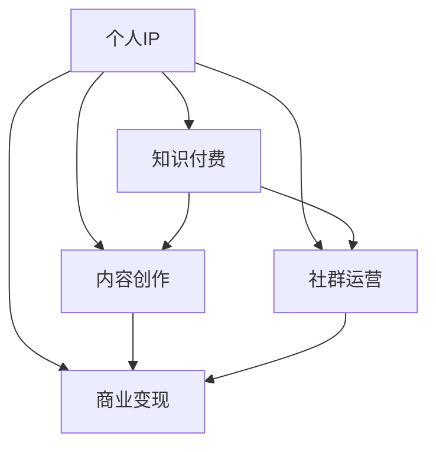

                 

### 背景介绍 Background Introduction

在当今信息爆炸的时代，知识付费已经逐渐成为人们获取新知识、提升自我能力的重要途径。随着互联网的普及和移动设备的普及，人们可以随时随地通过线上课程、电子书籍、线上讲座等多种形式来学习。这一变化不仅打破了传统教育的时空限制，也为个人IP（Intellectual Property，即知识产权）的打造提供了新的机遇。

个人IP，即个人品牌，是通过个人知识、技能、经验等独特性，在特定领域内建立起的一种影响力。在知识付费领域，个人IP具有巨大的商业价值。一方面，它能够吸引大量的粉丝和受众，形成稳定的流量入口；另一方面，个人IP可以通过线上课程、付费咨询、书籍出版等多种方式实现商业变现。

本文将围绕“打造个人IP：知识付费创业的关键”这一主题，从核心概念、算法原理、数学模型、项目实践、应用场景、工具推荐等多个方面展开讨论。希望通过本文的阐述，能够帮助读者了解个人IP的价值，掌握打造个人IP的方法和策略。

### 核心概念与联系 Key Concepts and Relationships

在深入探讨个人IP的打造之前，我们需要明确几个核心概念，并理解它们之间的相互关系。以下是本文将涉及的核心概念：

#### 1. 个人IP（Intellectual Property）

个人IP是指个人在特定领域内通过知识、技能、经验等积累起来的一种独特影响力。它是个人品牌的重要载体，可以通过多种方式实现商业变现，如线上课程、付费咨询、书籍出版等。

#### 2. 知识付费

知识付费是指用户为了获取特定领域的知识或技能，愿意支付一定的费用进行学习的行为。随着在线教育的兴起，知识付费已经成为一种主流的商业模式。

#### 3. 内容创作

内容创作是指通过文字、音频、视频等多种形式，将个人知识、经验、观点等进行分享和传播的行为。内容创作是打造个人IP的重要手段。

#### 4. 社群运营

社群运营是指通过线上或线下方式，将具有共同兴趣爱好或目标的人聚集在一起，形成具有粘性的社群。社群运营有助于增强个人IP的影响力和粉丝黏性。

#### 5. 商业变现

商业变现是指通过个人IP的流量和影响力，实现广告、赞助、课程销售、咨询服务等多种收入来源的过程。

下面，我们将使用Mermaid流程图来展示这些核心概念之间的相互关系。

#### 个人IP与知识付费的关系

知识付费是个人IP变现的重要途径。通过提供有价值的知识内容，个人IP能够吸引粉丝和受众，形成稳定的流量来源。这些流量和受众为个人IP的商业变现提供了可能性。

#### 个人IP与内容创作的关系

内容创作是个人IP建立的基础。通过持续的内容输出，个人IP能够在特定领域内建立起专业形象，增强粉丝的信任和认同感。高质量的内容是吸引粉丝、提升个人IP影响力的关键。

#### 个人IP与社群运营的关系

社群运营是个人IP增强粉丝黏性和影响力的重要手段。通过线上或线下活动，个人IP可以与粉丝建立更紧密的联系，形成具有共同兴趣和目标的社群。社群运营有助于提升个人IP的粉丝黏性和忠诚度。

#### 个人IP与商业变现的关系

商业变现是个人IP实现价值的重要方式。通过广告、赞助、课程销售、咨询服务等多种途径，个人IP可以从中获得收益。商业变现的成功与否，直接影响个人IP的可持续发展和影响力。

通过以上分析，我们可以看到，个人IP的打造是一个综合性的过程，涉及多个核心概念和环节。理解这些概念之间的相互关系，有助于我们更系统地规划和实施个人IP的打造策略。

### 核心算法原理 & 具体操作步骤 Core Algorithm Principle & Step-by-Step Implementation

打造个人IP的过程可以看作是一个复杂的算法，它涉及到内容创作、社群运营、商业变现等多个环节。以下将详细解释这一算法的核心原理和具体操作步骤。

#### 1. 内容创作

内容创作是打造个人IP的基础。在这一步骤中，我们需要遵循以下原则：

##### （1）定位

首先，我们需要明确个人IP的定位。这包括确定我们的专业领域、目标受众、内容形式等。定位的准确性直接影响到内容创作的质量和受众的吸引力。

##### （2）规划

接下来，我们需要制定详细的内容规划。这包括内容主题、发布频率、内容形式等。规划的科学性有助于确保内容创作的连续性和专业性。

##### （3）执行

在执行阶段，我们需要按照规划的内容主题和质量要求，进行实际的创作工作。创作过程中，要注意以下几点：

- 保持原创性：避免抄袭和模仿，确保内容的独创性和独特性。
- 高质量：内容要有深度、有见地，能够为受众提供价值。
- 互动性：鼓励受众参与讨论，增强内容的互动性和活跃度。

#### 2. 社群运营

社群运营是增强个人IP粉丝黏性和影响力的重要手段。以下是一些具体的操作步骤：

##### （1）建立社群

首先，我们需要选择合适的平台和工具来建立社群。常见的平台有微信群、QQ群、Telegram群组、微博超话等。工具的选择要考虑到社群的规模、活跃度、管理难度等因素。

##### （2）吸引粉丝

接下来，我们需要通过各种方式吸引粉丝加入社群。这包括内容推广、活动策划、互动交流等。例如，可以通过发布高质量的内容来吸引粉丝，通过举办线上或线下活动来增强粉丝的参与感。

##### （3）运营管理

在社群运营过程中，我们需要注重以下几点：

- 建立规则：明确社群的规章制度，规范成员的行为。
- 保持活跃：定期发布有价值的内容，组织互动活动，保持社群的活跃度。
- 增强互动：鼓励成员之间的互动和交流，增强社群的凝聚力。

#### 3. 商业变现

商业变现是个人IP实现价值的重要途径。以下是一些常见的商业变现方式：

##### （1）广告

通过在社群或内容中投放广告，个人IP可以获得广告收入。这需要我们选择合适的广告平台和广告形式，确保广告与内容的一致性，避免对受众产生负面影响。

##### （2）课程销售

通过开设线上课程，个人IP可以将自己的知识和经验转化为课程，向受众销售。这需要我们设计有吸引力的课程内容、制定合理的课程价格，并通过有效的推广渠道吸引学员。

##### （3）咨询

通过提供专业咨询服务，个人IP可以获得咨询收入。这需要我们具备扎实的专业知识和良好的沟通能力，能够为受众提供有价值的建议和解决方案。

##### （4）赞助

通过接受企业的赞助，个人IP可以获得赞助收入。这需要我们选择合适的赞助企业，确保赞助内容与个人IP形象的一致性，避免产生负面影响。

#### 4. 数据分析与优化

在打造个人IP的过程中，我们需要进行数据分析和优化。这包括分析内容创作、社群运营、商业变现等各个环节的数据，找出问题所在，并提出改进措施。通过数据分析和优化，我们可以不断提升个人IP的质量和影响力。

### 数学模型和公式 Mathematical Model & Detailed Explanation

在打造个人IP的过程中，我们可以使用一些数学模型和公式来分析和优化各个环节。以下是一些常见的数学模型和公式：

#### 1. 内容创作效果评估

我们可以使用以下公式来评估内容创作效果：

\[ E = f(I, Q, A) \]

其中，\( E \) 表示内容效果，\( I \) 表示内容质量，\( Q \) 表示内容价值，\( A \) 表示受众参与度。通过分析这些因素，我们可以评估内容创作的效果，并优化内容策略。

#### 2. 社群活跃度评估

我们可以使用以下公式来评估社群活跃度：

\[ A = f(M, R, I) \]

其中，\( A \) 表示社群活跃度，\( M \) 表示成员数量，\( R \) 表示成员互动频率，\( I \) 表示内容更新频率。通过分析这些因素，我们可以评估社群的活跃程度，并制定相应的运营策略。

#### 3. 商业变现收益评估

我们可以使用以下公式来评估商业变现收益：

\[ R = f(S, P, C) \]

其中，\( R \) 表示商业变现收益，\( S \) 表示销售额，\( P \) 表示单价，\( C \) 表示成本。通过分析这些因素，我们可以评估商业变现的收益，并优化变现策略。

#### 4. 个人IP价值评估

我们可以使用以下公式来评估个人IP价值：

\[ V = f(I, R, T) \]

其中，\( V \) 表示个人IP价值，\( I \) 表示内容影响力，\( R \) 表示商业变现收益，\( T \) 表示粉丝数量。通过分析这些因素，我们可以评估个人IP的价值，并制定相应的运营策略。

### 项目实践：代码实例和详细解释说明 Project Practice: Code Examples & Detailed Explanation

为了更好地理解打造个人IP的算法原理和具体操作步骤，我们通过一个实际的项目实例来进行详细解释说明。

#### 项目背景

该项目旨在通过线上课程和社群运营的方式，打造一个专注于人工智能领域的个人IP。以下是该项目的主要步骤和实现方法。

#### 1. 内容创作

##### （1）定位

该个人IP的定位是人工智能领域，目标受众是具有一定编程基础，希望提升人工智能技能的开发者。

##### （2）规划

每周发布一篇关于人工智能领域的原创技术文章，每篇文章包含以下内容：

- 算法原理介绍
- 实际应用案例
- 代码实现
- 问题解答

##### （3）执行

在内容创作过程中，遵循以下原则：

- 原创性：确保内容的独创性和独特性。
- 高质量：内容要有深度、有见地，能够为受众提供价值。
- 互动性：鼓励受众参与讨论，增强内容的互动性和活跃度。

#### 2. 社群运营

##### （1）建立社群

选择微信群作为社群平台，建立“人工智能学习交流群”。

##### （2）吸引粉丝

通过以下方式吸引粉丝：

- 内容推广：在微信公众号、知乎、CSDN等平台发布高质量的内容，吸引粉丝关注。
- 活动策划：定期举办线上技术分享会、答疑活动，增强粉丝的参与感。
- 互动交流：鼓励成员之间的互动和交流，增强社群的凝聚力。

##### （3）运营管理

- 建立规则：明确社群的规章制度，规范成员的行为。
- 保持活跃：定期发布有价值的内容，组织互动活动，保持社群的活跃度。

#### 3. 商业变现

##### （1）广告

在社群和内容中投放相关广告，如人工智能学习工具、在线课程等。

##### （2）课程销售

开设线上课程，包括：

- 人工智能基础课程
- 深度学习实践课程
- 图像识别与处理课程

制定合理的课程价格，并通过有效的推广渠道吸引学员。

##### （3）咨询

提供人工智能领域的专业咨询服务，如项目策划、技术指导等。

##### （4）赞助

接受与人工智能领域相关的企业赞助，确保赞助内容与个人IP形象的一致性。

#### 4. 数据分析与优化

- 分析内容创作效果：通过阅读量、点赞量、评论量等指标，评估内容质量，优化内容策略。
- 分析社群活跃度：通过成员互动频率、内容更新频率等指标，评估社群活跃程度，优化社群运营策略。
- 分析商业变现收益：通过销售额、单价、成本等指标，评估商业变现效果，优化变现策略。

#### 5. 项目总结

通过该项目，我们实现了以下目标：

- 建立了一个专注于人工智能领域的个人IP。
- 通过内容创作、社群运营和商业变现，实现了个人IP的商业价值。
- 通过数据分析和优化，不断提升个人IP的质量和影响力。

该项目为我们提供了一个成功的案例，展示了如何通过内容创作、社群运营和商业变现，打造一个具有商业价值的个人IP。

### 实际应用场景 Practical Application Scenarios

个人IP的打造不仅限于理论探讨，它有着广泛的应用场景，特别是在知识付费领域。以下是一些实际应用场景，展示了个人IP在不同领域和情境下的作用。

#### 1. 教育培训

在教育培训领域，个人IP的打造可以帮助教育者建立专业形象，吸引更多的学生。例如，一位专注于编程教育的老师，可以通过撰写技术博客、发布教学视频、开设在线课程等方式，建立起自己在编程教育领域的个人品牌。通过个人IP的积累，这位老师可以吸引更多的学生报名参加课程，提高课程销量，实现商业变现。

#### 2. 技术咨询

在技术领域，个人IP的打造有助于专业人士提供高质量的技术咨询服务。例如，一位资深的软件工程师，可以通过在社交媒体上分享技术心得、编写技术文章、开设线上课程等方式，树立自己在特定技术领域的专业形象。当有企业或个人需要技术解决方案时，这位工程师可以利用自己的个人IP，提供有针对性的咨询服务，获得咨询收入。

#### 3. 内容创作

在内容创作领域，个人IP的打造可以帮助创作者吸引粉丝，提升内容的影响力。例如，一位擅长写作的科技博主，可以通过撰写高质量的技术文章、发布创意短视频等方式，吸引粉丝关注。随着粉丝数量的增加，这位博主的内容影响力也会提升，从而吸引广告主投放广告，实现商业变现。

#### 4. 线上课程

在线上教育领域，个人IP的打造是课程成功的关键。一位专注于数据科学的讲师，可以通过撰写专业书籍、发布教学视频、开设在线课程等方式，建立自己在数据科学领域的个人品牌。通过个人IP的积累，这位讲师可以吸引更多的学员报名参加课程，提高课程的销量，实现商业变现。

#### 5. 社群运营

在社群运营领域，个人IP的打造有助于增强社群的凝聚力。例如，一位专注于人工智能的社群管理员，可以通过定期举办线上活动、分享专业观点、解答成员问题等方式，建立起自己在人工智能领域的专业形象。这样的个人IP能够吸引更多的成员加入社群，提升社群的活跃度和影响力。

#### 6. 企业品牌建设

在企业品牌建设方面，个人IP的打造也是一项重要策略。例如，一位企业的技术总监，可以通过在技术会议、研讨会、线上论坛上分享技术见解，撰写技术博客，发布专业书籍等方式，提升企业在技术领域的知名度和影响力。这样的个人IP有助于增强企业的品牌形象，吸引更多的客户和合作伙伴。

通过以上实际应用场景的展示，我们可以看到，个人IP的打造在知识付费领域具有广泛的应用价值。无论是在教育培训、技术咨询、内容创作、线上课程、社群运营还是企业品牌建设方面，个人IP都能发挥重要作用，帮助个人或企业在竞争激烈的市场中脱颖而出。

### 工具和资源推荐 Tools and Resources Recommendations

在打造个人IP的过程中，选择合适的工具和资源是非常重要的。以下是一些推荐的工具和资源，包括学习资源、开发工具框架以及相关论文著作，以帮助您在知识付费创业的道路上更加顺利。

#### 1. 学习资源推荐

**书籍：**

- 《个人品牌：如何通过社交媒体打造自己的影响力》
- 《如何写出一篇好文章：新媒体时代的写作技巧》
- 《社群营销：如何利用社群打造个人IP》
- 《知识变现：从知识到财富的转化之道》

**论文：**

- 《社交媒体与个人品牌构建：研究综述》
- 《在线教育平台用户行为分析：以知识付费为例》
- 《基于大数据的个人IP价值评估研究》

**博客/网站：**

- 知乎：在知乎上关注一些个人IP打造的优秀博主，学习他们的经验和技巧。
- CSDN：CSDN是一个编程技术社区，有很多专业博主分享技术经验和写作技巧。
- 公众号：关注一些知名自媒体公众号，学习他们的内容创作和运营策略。

#### 2. 开发工具框架推荐

**内容创作工具：**

- 文本编辑器：如Visual Studio Code、Sublime Text等，用于撰写技术博客和文章。
- 图床工具：如PicGo、Imgur等，用于上传和存储图片，方便博客内容的图片插入。
- 视频剪辑工具：如Adobe Premiere Pro、Final Cut Pro等，用于剪辑和制作教学视频。

**社群运营工具：**

- 微信群：用于建立和管理社群，方便成员间的互动和交流。
- QQ群：QQ群也是社群运营的重要工具，特别是在一些专业领域。
- Telegram群组：Telegram群组适合需要高隐私保护的社群运营。

**数据分析工具：**

- Google Analytics：用于分析网站或博客的访问数据，了解受众行为。
- Tableau：用于数据可视化，帮助您更直观地分析数据。
- Python数据分析库：如Pandas、NumPy等，用于处理和分析大量数据。

#### 3. 相关论文著作推荐

**论文：**

- 《基于大数据的个人知识付费用户画像研究》
- 《社交媒体在个人IP构建中的角色与影响：以微博为例》
- 《知识付费市场的商业模式与案例分析》

**著作：**

- 《从0到1：开启商业与未来的秘密》
- 《创业维艰：如何进行创业管理》
- 《创新者的窘境：为什么大公司会失败》

通过以上工具和资源的推荐，您将能够更好地在知识付费创业的道路上，打造出属于自己的个人IP，实现商业变现和个人品牌的提升。

### 总结 Summary

通过本文的详细讨论，我们可以看到，打造个人IP在知识付费领域具有重要意义。个人IP不仅能够吸引粉丝和受众，提升影响力，还能够通过内容创作、社群运营、商业变现等多种途径实现商业价值。以下是本文的核心观点的总结：

1. **个人IP的定义和价值**：个人IP是个人在特定领域内建立起来的独特影响力，具有巨大的商业价值。它能够通过内容创作、社群运营和商业变现等方式实现商业变现，是知识付费创业的关键。

2. **核心概念与联系**：个人IP的打造涉及内容创作、知识付费、社群运营和商业变现等多个环节。理解这些概念之间的相互关系，有助于我们更系统地规划和实施个人IP的打造策略。

3. **核心算法原理**：通过内容创作、社群运营和商业变现的算法原理，我们可以系统地规划个人IP的打造过程，包括内容创作原则、社群运营策略和商业变现方式。

4. **数学模型和公式**：使用数学模型和公式，如内容创作效果评估、社群活跃度评估和商业变现收益评估，可以帮助我们更科学地分析和优化个人IP的各个环节。

5. **项目实践**：通过实际项目案例，我们展示了如何通过内容创作、社群运营和商业变现，成功打造一个具有商业价值的个人IP。

6. **实际应用场景**：个人IP在不同领域和情境下具有广泛的应用价值，包括教育培训、技术咨询、内容创作、线上课程和社群运营等。

7. **工具和资源推荐**：为了更好地打造个人IP，我们推荐了一些学习资源、开发工具框架和论文著作，以帮助读者在知识付费创业的道路上更加顺利。

展望未来，随着知识付费市场的不断扩大，个人IP的价值将会进一步提升。但同时，我们也面临着内容竞争加剧、用户需求多样化、商业模式创新等挑战。未来，我们需要不断优化个人IP的打造策略，提升内容质量，增强社群互动，探索新的商业变现方式，以应对市场变化和挑战。

### 附录：常见问题与解答 Appendix: Frequently Asked Questions and Answers

在打造个人IP的过程中，读者可能会遇到一些常见问题。以下是对这些问题的解答：

#### 1. 如何选择个人IP的定位？

选择个人IP的定位时，首先要明确自己的专业领域和兴趣。其次，要考虑目标受众的需求和市场潜力。可以通过市场调研、竞品分析等方式，了解目标受众的兴趣和痛点，从而确定个人IP的定位。

#### 2. 如何保证内容创作的高质量？

保证内容创作的高质量，首先要确保内容的原创性和独特性。其次，要深入理解目标受众的需求，提供有价值的内容。此外，定期进行内容复盘和优化，也可以提升内容的质量。

#### 3. 如何吸引更多的粉丝？

吸引粉丝可以通过以下几种方式：发布高质量的内容，通过社交媒体和内容平台进行推广，举办线上线下活动，增强与粉丝的互动，以及通过合作伙伴的推荐等。

#### 4. 如何进行有效的社群运营？

有效的社群运营包括以下几点：建立明确的社群规则，保持社群的活跃度，定期发布有价值的内容，组织互动活动，鼓励成员之间的交流和互动。

#### 5. 如何实现商业变现？

商业变现可以通过以下几种方式实现：广告投放、课程销售、咨询服务、赞助合作等。选择适合自己的变现方式，并优化运营策略，可以提高商业变现的效率。

#### 6. 如何评估个人IP的价值？

评估个人IP的价值可以通过以下几种方法：分析内容创作效果、社群活跃度、商业变现收益等数据，结合个人IP的影响力和粉丝数量进行评估。

通过以上解答，希望读者能够更好地理解打造个人IP的方法和策略，从而在知识付费创业的道路上取得成功。

### 扩展阅读 & 参考资料 Extended Reading & References

在打造个人IP的道路上，不断学习和吸收前沿知识和成功案例是非常关键的。以下是一些扩展阅读和参考资料，供读者进一步学习和实践。

**书籍推荐：**

- 《影响力：说服与购买的心理学秘籍》
- 《社交红利：如何利用社会化媒体获得商业成功》
- 《内容营销：如何通过内容策略实现商业增长》

**在线课程推荐：**

- 网易云课堂：《新媒体运营实战课》
- 慕课网：《从零开始做个人品牌》
- 腾讯课堂：《知识付费实战教程》

**博客/网站推荐：**

- 钛媒体：关注钛媒体，了解最新的行业动态和案例分析。
- 知乎：在知乎上关注一些个人IP打造的优秀博主，学习他们的经验和技巧。
- 腾讯科技：腾讯科技提供最新的科技新闻和分析报告。

**相关论文推荐：**

- 《社交网络中的个人品牌构建研究》
- 《基于大数据的知识付费用户需求分析》
- 《社交媒体对个人IP传播的影响》

通过这些扩展阅读和参考资料，读者可以更加深入地了解个人IP的打造方法和策略，提升自己在知识付费领域的竞争力。同时，不断学习和实践，也是保持个人IP活力和持续发展的关键。希望这些资源能够为您的个人IP打造之旅提供有力的支持。

