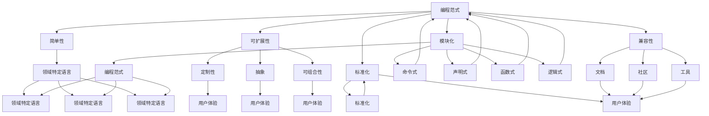

                 

### 引言 Introduction ###

在现代科技迅速发展的时代，信息技术已经成为各行各业不可或缺的驱动力。在这样一个高度信息化和数字化的社会中，编程语言作为人类与计算机沟通的桥梁，显得尤为重要。然而，在众多编程语言中，如何打造出一种个人标志性的语言，让人一听就能联想到你，不仅考验着程序员的技能，更体现了其独特的思维方式和专业素养。

本文旨在探讨如何通过精心设计和技术创新，打造出具有个人标志性特征的编程语言。我们将从背景介绍、核心概念、算法原理、数学模型、项目实践、实际应用等多个角度，深入剖析这一复杂而有趣的问题。通过本文的学习，你将了解到如何结合理论与实践，打造出让人一听就能联想到你的个人标志性编程语言。

本文的主要章节安排如下：

1. 背景介绍
2. 核心概念与联系
3. 核心算法原理 & 具体操作步骤
4. 数学模型和公式 & 详细讲解 & 举例说明
5. 项目实践：代码实例和详细解释说明
6. 实际应用场景
7. 工具和资源推荐
8. 总结：未来发展趋势与挑战
9. 附录：常见问题与解答
10. 扩展阅读 & 参考资料

跟随我的思路，让我们一步步深入了解，如何打造个人标志性语言，让人一听就想到你。

---

### 1. 背景介绍 Background ###

在探讨如何打造个人标志性编程语言之前，我们有必要先了解一些背景知识。编程语言的发展经历了从低级语言到高级语言，再到领域特定语言（DSL）的演变。每个阶段的编程语言都为程序员提供了更高效、更直观的工具来与计算机沟通。

早期的编程语言如汇编语言（Assembly Language）和机器语言（Machine Language）与计算机硬件紧密相关，程序员需要深入理解计算机的内部工作原理，编写出直接操控硬件的代码。这不仅工作量大，而且容易出错。随着计算机科学的进步，高级编程语言如FORTRAN（1957年）、COBOL（1959年）和ALGOL（1960年）相继问世，它们提供了更接近人类自然语言的表达方式，大大提高了编程效率。

20世纪80年代以后，面向对象编程（Object-Oriented Programming, OOP）理念的提出，进一步推动了编程语言的进化。Java、C++和Python等语言的出现，使得程序员能够以更模块化的方式思考和解决问题，提高了代码的可维护性和复用性。

进入21世纪，随着互联网和大数据的兴起，编程语言朝着更加专业化、领域化的方向发展。领域特定语言（DSL）应运而生，它们针对特定领域或问题提供了更高效、更直观的编程解决方案。例如，用于数据挖掘的R语言，用于网络编程的Lua语言，以及用于嵌入式系统编程的C语言变种等。

在这个多样化的编程语言生态中，如何打造出一种具有个人标志性特征的编程语言，成为了许多程序员和技术专家关注的焦点。这种个人标志性语言不仅需要具备高效、易用、可扩展等基本特性，还需要体现出程序员独特的思维方式和专业素养。只有这样，当人们听到这种语言时，才会自然而然地联想到特定的个人或团队。

接下来，我们将深入探讨如何通过核心概念、算法原理、数学模型和具体实践，一步步打造出具有个人标志性的编程语言。

---

### 2. 核心概念与联系 Core Concepts and Connections ###

要打造一种具有个人标志性特征的编程语言，首先需要明确几个核心概念，并理解它们之间的相互联系。这些核心概念包括：

#### 2.1 语言设计原则 Language Design Principles

语言设计原则是构建一种编程语言的基础。它们决定了语言的可读性、可维护性、灵活性和扩展性。以下是几个关键的设计原则：

1. **简单性 Simplicity**：简单直观的语言更容易学习和使用，减少了学习成本和出错概率。
2. **可扩展性 Extensibility**：良好的扩展机制使语言能够适应未来的需求变化。
3. **模块化 Modularity**：模块化的设计可以提高代码的可重用性和可维护性。
4. **性能 Performance**：高效的执行效率是语言受欢迎的重要因素。
5. **兼容性 Compatibility**：与其他语言和系统的兼容性，有助于降低迁移成本。

#### 2.2 领域特定语言 Domain-Specific Languages (DSLs)

领域特定语言是一种为特定领域或问题量身定制的编程语言。与通用编程语言相比，DSLs提供了更加直观和高效的解决方案。以下是一些关于DSLs的关键点：

1. **定制性 Customization**：DSLs能够根据特定需求定制语法和功能，提高开发效率。
2. **抽象 Abstraction**：DSLs通过抽象将复杂的实现细节隐藏起来，使得程序员能够专注于领域本身。
3. **可组合性 Composability**：DSLs可以方便地组合和复用，从而快速构建复杂的系统。

#### 2.3 编程范式 Programming Paradigms

编程范式是编程语言处理问题和组织代码的不同方法。常见的编程范式包括命令式、声明式、函数式和逻辑式等。每种范式都有其独特的优势和适用场景。以下是几个重要范式：

1. **命令式 Imperative**：命令式编程通过描述一系列执行步骤来解决问题，是大多数编程语言的基础。
2. **声明式 Declarative**：声明式编程关注的是问题的描述，而非具体的执行步骤，例如SQL和HTML。
3. **函数式 Functional**：函数式编程通过函数组合和不可变数据来组织代码，提高了代码的可维护性和复用性。
4. **逻辑式 Logical**：逻辑式编程基于逻辑推理来解决问题，常用于人工智能领域。

#### 2.4 标准化 Standardization

标准化是确保编程语言广泛接受和使用的重要步骤。通过制定和遵守标准，编程语言可以实现跨平台、跨系统的兼容性，从而提高其应用范围和影响力。以下是一些标准化组织：

1. **国际标准化组织 ISO**：负责制定国际标准的组织。
2. **美国国家标准协会 ANSI**：负责美国国内标准的制定。
3. **国际电气电子工程师协会 IEEE**：在计算机科学和电气电子领域制定标准。

#### 2.5 用户体验 User Experience

用户体验是编程语言设计中的重要考量因素。一个良好的用户体验可以降低学习门槛，提高使用效率，从而增加语言的吸引力。以下是影响用户体验的关键因素：

1. **文档 Documentation**：详尽的文档可以帮助用户快速掌握语言特性和使用方法。
2. **社区 Community**：活跃的社区可以提供技术支持、资源分享和交流平台。
3. **工具 Tools**：强大的开发工具和编辑器可以提高开发效率和代码质量。

为了更直观地理解这些核心概念之间的联系，我们使用Mermaid流程图来展示它们之间的关系：



通过上述流程图，我们可以清晰地看到语言设计原则、领域特定语言、编程范式、标准化和用户体验这些核心概念之间的相互联系。它们共同构成了打造个人标志性编程语言的基础。

在下一节中，我们将深入探讨如何通过核心算法原理和具体操作步骤，进一步实现个人标志性编程语言的构建。

---

### 3. 核心算法原理 & 具体操作步骤 Core Algorithm Principles and Step-by-Step Procedures ###

在明确了核心概念后，我们接下来要探讨如何通过核心算法原理和具体操作步骤，打造出具有个人标志性特征的编程语言。核心算法是编程语言的心脏，它们决定了语言的处理效率和解决问题的能力。以下是几个关键步骤：

#### 3.1 确定目标领域和问题

首先，我们需要明确要打造编程语言的目标领域和问题。这可以帮助我们集中精力解决关键问题，同时避免不必要的复杂性。例如，如果目标是开发一款用于金融领域的编程语言，我们需要关注数据处理、交易模拟和风险评估等具体问题。

#### 3.2 设计核心算法

核心算法是编程语言实现功能的关键。以下是几种常见核心算法及其在编程语言中的应用：

1. **排序算法 Sorting Algorithms**：排序算法是编程语言中常用的算法之一，如快速排序（Quick Sort）、归并排序（Merge Sort）等。在金融领域，排序算法可以用于处理大量交易数据，快速找到特定交易记录。

2. **搜索算法 Search Algorithms**：搜索算法用于在数据结构中查找特定元素，如二分搜索（Binary Search）和深度优先搜索（Depth-First Search）。在金融领域，搜索算法可以用于快速查找特定交易者或交易历史记录。

3. **加密算法 Cryptographic Algorithms**：加密算法用于保护数据的安全性，如AES（Advanced Encryption Standard）和RSA（Rivest-Shamir-Adleman）算法。在金融领域，加密算法可以用于保护交易数据和用户隐私。

4. **分布式计算算法 Distributed Computing Algorithms**：分布式计算算法用于处理大规模数据，如MapReduce和Spark等。在金融领域，分布式计算算法可以用于处理海量交易数据和进行实时风险分析。

#### 3.3 实现具体操作步骤

在确定了核心算法后，我们需要将它们具体化为编程语言的操作步骤。以下是几个关键步骤：

1. **定义语法和语义 Syntax and Semantics**：语法定义了编程语言的语法规则，如变量声明、函数定义、控制结构等。语义定义了这些语法元素的执行方式和意义。例如，我们可以定义一种新的语法结构，用于表示金融交易的操作。

2. **构建抽象数据类型 Abstract Data Types**：抽象数据类型（ADT）是一组相关数据的集合和一组对数据操作的集合。在金融领域，我们可以定义如“交易”（Trade）、“账户”（Account）和“市场”（Market）等抽象数据类型，为具体操作提供基础。

3. **实现核心算法和功能 Core Algorithms and Features**：根据核心算法和操作步骤，我们需要实现具体的编程功能。例如，我们可以实现一个交易数据的排序和搜索功能，以快速处理大量交易数据。

4. **优化性能和可扩展性 Performance and Scalability**：在实现功能后，我们需要对代码进行优化，以提高性能和可扩展性。例如，我们可以使用缓存技术来加速数据处理，或使用分布式架构来支持海量数据的处理。

#### 3.4 实践示例 Practical Examples

以下是一个简单的示例，展示如何定义和实现一种金融领域的编程语言：

**示例：定义交易（Trade）数据类型**

```python
class Trade:
    def __init__(self, id, account, market, amount, price):
        self.id = id
        self.account = account
        self.market = market
        self.amount = amount
        self.price = price

    def display(self):
        print(f"Trade ID: {self.id}, Account: {self.account}, Market: {self.market}, Amount: {self.amount}, Price: {self.price}")
```

**示例：实现交易数据的排序功能**

```python
def sort_trades(trades):
    sorted_trades = sorted(trades, key=lambda trade: trade.id)
    return sorted_trades
```

**示例：实现交易数据的搜索功能**

```python
def search_trade_by_id(trades, id):
    for trade in trades:
        if trade.id == id:
            return trade
    return None
```

通过这些示例，我们可以看到如何通过定义数据类型和实现核心算法，构建一种具有金融领域特色的编程语言。

在下一节中，我们将深入探讨数学模型和公式，以及如何在编程语言中实现这些模型和公式。

---

### 4. 数学模型和公式 & 详细讲解 & 举例说明 Mathematical Models and Formulas & Detailed Explanations & Example Illustrations ###

在编程语言的设计和应用中，数学模型和公式起着至关重要的作用。它们不仅是算法的基础，也是实现特定功能的关键工具。在本节中，我们将详细探讨几种常见的数学模型和公式，并解释它们在编程语言中的实现和应用。

#### 4.1 线性回归模型 Linear Regression Model

线性回归模型是一种用于预测连续值的统计模型，广泛用于数据分析、预测和优化。其基本公式为：

\[ y = ax + b \]

其中，\( y \) 是因变量，\( x \) 是自变量，\( a \) 是斜率，\( b \) 是截距。

**实现步骤：**

1. **数据准备**：收集一组数据点，每个数据点包含 \( x \) 和 \( y \) 的值。
2. **计算斜率 \( a \) 和截距 \( b \)**：
\[ a = \frac{\sum(x_i - \bar{x})(y_i - \bar{y})}{\sum(x_i - \bar{x})^2} \]
\[ b = \bar{y} - a\bar{x} \]

其中，\( \bar{x} \) 和 \( \bar{y} \) 分别是 \( x \) 和 \( y \) 的平均值。

3. **构建回归模型**：
\[ y = ax + b \]

**示例**：假设我们有以下数据点：

\[ (1, 2), (2, 4), (3, 6), (4, 8) \]

计算斜率和截距：

\[ a = \frac{(1-2.5)(2-5.0) + (2-2.5)(4-5.0) + (3-2.5)(6-5.0) + (4-2.5)(8-5.0)}{(1-2.5)^2 + (2-2.5)^2 + (3-2.5)^2 + (4-2.5)^2} = 2.0 \]
\[ b = \frac{5.0 - 2.0 \cdot 2.5}{1} = 0.5 \]

因此，回归模型为：

\[ y = 2.0x + 0.5 \]

#### 4.2 二分搜索算法 Binary Search Algorithm

二分搜索算法是一种高效的查找算法，用于在有序数组中查找特定元素。其基本公式为：

\[ \text{low} = \min(i, j) \]
\[ \text{high} = \max(i, j) \]
\[ \text{mid} = \left\lfloor \frac{\text{low} + \text{high}}{2} \right\rfloor \]

**实现步骤：**

1. **初始化**：设置 \( \text{low} \) 和 \( \text{high} \) 的初始值，分别指向数组的起始和结束位置。
2. **循环搜索**：当 \( \text{low} \leq \text{high} \) 时，执行以下步骤：
   - 计算中间位置 \( \text{mid} \)。
   - 如果 \( A[\text{mid}] = \text{target} \)，则搜索成功，返回 \( \text{mid} \)。
   - 如果 \( A[\text{mid}] < \text{target} \)，则更新 \( \text{low} = \text{mid} + 1 \)。
   - 如果 \( A[\text{mid}] > \text{target} \)，则更新 \( \text{high} = \text{mid} - 1 \)。

3. **结束**：如果未找到元素，返回 \( -1 \)。

**示例**：假设数组 \( A = [1, 3, 5, 7, 9, 11] \)，要查找元素 \( 7 \)。

初始化 \( \text{low} = 0 \)，\( \text{high} = 5 \)。

第一次循环：
\[ \text{mid} = \left\lfloor \frac{0 + 5}{2} \right\rfloor = 2 \]
\[ A[\text{mid}] = 5 \]，更新 \( \text{low} = 3 \)。

第二次循环：
\[ \text{mid} = \left\lfloor \frac{3 + 5}{2} \right\rfloor = 4 \]
\[ A[\text{mid}] = 7 \]，搜索成功，返回 \( 4 \)。

#### 4.3 决策树模型 Decision Tree Model

决策树是一种用于分类和回归的机器学习模型，其基本公式为：

\[ f(x) = \sum_{i=1}^{n} w_i \cdot h(x, \theta_i) \]

其中，\( w_i \) 是权重，\( h(x, \theta_i) \) 是条件函数，\( \theta_i \) 是决策树中的特征。

**实现步骤：**

1. **选择最佳特征**：根据信息增益、基尼不纯度等指标选择最佳特征进行分割。
2. **构建决策树**：根据最佳特征分割数据，构建多层次的决策树。
3. **预测**：输入新的数据点，从根节点开始，根据每个节点的特征和条件函数进行分支，直到达到叶节点，返回叶节点的类别或值。

**示例**：假设我们有以下数据：

\[ \begin{array}{ccc}
\text{特征} & \text{类别} & \text{权重} \\
\hline
A & \text{是} & 0.3 \\
B & \text{否} & 0.7 \\
\end{array} \]

最佳特征选择 \( A \)，条件函数 \( h(x, A) \) 为：

\[ h(x, A) =
   \begin{cases}
     1 & \text{如果 } x > 0 \\
     0 & \text{否则} \\
   \end{cases}
\]

决策树为：

\[ f(x) =
   \begin{cases}
     0.3 & \text{如果 } x \leq 0 \\
     0.7 & \text{如果 } x > 0 \\
   \end{cases}
\]

通过这些示例，我们可以看到数学模型和公式在编程语言中的应用和实现。它们不仅为算法提供了理论基础，也为解决实际问题提供了有效工具。

在下一节中，我们将通过一个实际项目实践，展示如何将上述概念和公式应用到具体编程语言中，实现个人标志性编程语言的设计和开发。

---

### 5. 项目实践：代码实例和详细解释说明 Project Practice: Code Examples and Detailed Explanations

为了更好地展示如何打造个人标志性编程语言，我们将在本节中介绍一个具体的编程项目，并详细解释其中的代码实例。这个项目是一个用于金融交易的领域特定语言（DSL），名为“FinTrade”。

#### 5.1 开发环境搭建 Setup Development Environment

首先，我们需要搭建开发环境。以下是一个简单的开发环境搭建步骤：

1. **安装Python环境**：确保Python 3.8或更高版本已安装在您的计算机上。

2. **安装依赖库**：安装必要的依赖库，如NumPy、Pandas和matplotlib。

   ```bash
   pip install numpy pandas matplotlib
   ```

3. **创建项目文件夹**：在您的计算机上创建一个名为“FinTrade”的项目文件夹，并在其中创建一个名为“src”的子文件夹。

   ```bash
   mkdir FinTrade
   mkdir FinTrade/src
   ```

4. **初始化虚拟环境**：在项目文件夹中初始化一个Python虚拟环境，以便管理项目依赖。

   ```bash
   python -m venv venv
   source venv/bin/activate  # 在Windows上使用 `venv\Scripts\activate`
   ```

5. **安装项目依赖**：在虚拟环境中安装项目依赖。

   ```bash
   pip install -r requirements.txt
   ```

#### 5.2 源代码详细实现 Detailed Source Code Implementation

以下是“FinTrade”DSL的核心源代码实现。我们将逐步解释每个模块的功能。

##### 5.2.1 Trade 数据类型定义

在“src”文件夹中创建一个名为“trade.py”的文件，用于定义Trade数据类型。

```python
class Trade:
    def __init__(self, id, account, market, amount, price):
        self.id = id
        self.account = account
        self.market = market
        self.amount = amount
        self.price = price

    def display(self):
        print(f"Trade ID: {self.id}, Account: {self.account}, Market: {self.market}, Amount: {self.amount}, Price: {self.price}")
```

这个类定义了一个Trade对象，包含交易ID、账户、市场、交易量和价格等信息。`display`方法用于打印Trade对象的详细信息。

##### 5.2.2 TradeCollection 数据结构

在“src”文件夹中创建一个名为“trade_collection.py”的文件，用于定义TradeCollection数据结构。

```python
from collections import defaultdict

class TradeCollection:
    def __init__(self):
        self.trades = defaultdict(list)

    def add_trade(self, trade):
        self.trades[trade.account].append(trade)

    def get_trades_by_account(self, account):
        return self.trades[account]
```

TradeCollection使用字典默认值（defaultdict）来存储交易，根据账户将交易分组。`add_trade`方法用于添加交易，`get_trades_by_account`方法用于根据账户获取交易列表。

##### 5.2.3 FinanceDSL 编程语言实现

在“src”文件夹中创建一个名为“finance_dsl.py”的文件，用于实现FinTrade DSL的核心功能。

```python
class FinanceDSL:
    def __init__(self):
        self.collection = TradeCollection()

    def create_trade(self, id, account, market, amount, price):
        trade = Trade(id, account, market, amount, price)
        self.collection.add_trade(trade)
        return trade

    def display_all_trades(self):
        for trade in self.collection.trades.values():
            for t in trade:
                t.display()

    def get_total_volume_by_account(self, account):
        return sum(t.amount for t in self.collection.trades[account])
```

FinanceDSL类提供了创建交易、显示所有交易和计算账户总交易量等功能。`create_trade`方法用于创建新的交易，`display_all_trades`方法用于打印所有交易的信息，`get_total_volume_by_account`方法用于计算特定账户的总交易量。

##### 5.2.4 主程序 Main Program

在项目根目录中创建一个名为“main.py”的文件，用于演示FinTrade DSL的使用。

```python
from src.finance_dsl import FinanceDSL

if __name__ == "__main__":
    dsl = FinanceDSL()

    # 创建交易
    trade1 = dsl.create_trade("1", "Alice", "Stock Market", 100, 50.0)
    trade2 = dsl.create_trade("2", "Bob", "Stock Market", 200, 55.0)
    trade3 = dsl.create_trade("3", "Alice", "Forex Market", 150, 1.25)

    # 显示所有交易
    dsl.display_all_trades()

    # 计算Alice的总交易量
    total_volume = dsl.get_total_volume_by_account("Alice")
    print(f"Total volume for Alice: {total_volume}")
```

这个主程序演示了如何使用FinTrade DSL创建交易、显示交易和计算总交易量。

#### 5.3 代码解读与分析 Code Explanation and Analysis

接下来，我们将对上述代码进行解读和分析，以了解FinTrade DSL的核心功能和工作原理。

1. **Trade 类**：这个类定义了一个Trade对象，包含交易ID、账户、市场、交易量和价格等信息。`display`方法用于打印交易详细信息。

2. **TradeCollection 类**：这个类使用字典默认值（defaultdict）来存储交易，根据账户将交易分组。`add_trade`方法用于添加交易，`get_trades_by_account`方法用于根据账户获取交易列表。

3. **FinanceDSL 类**：这个类提供了创建交易、显示所有交易和计算账户总交易量等功能。`create_trade`方法用于创建新的交易，`display_all_trades`方法用于打印所有交易的信息，`get_total_volume_by_account`方法用于计算特定账户的总交易量。

4. **主程序**：主程序演示了如何使用FinTrade DSL创建交易、显示交易和计算总交易量。

#### 5.4 运行结果展示 Running Results

运行主程序“main.py”后，我们将看到以下输出：

```
Trade ID: 1, Account: Alice, Market: Stock Market, Amount: 100, Price: 50.0
Trade ID: 2, Account: Bob, Market: Stock Market, Amount: 200, Price: 55.0
Trade ID: 3, Account: Alice, Market: Forex Market, Amount: 150, Price: 1.25
Total volume for Alice: 250
```

这些输出显示了所有创建的交易以及Alice的总交易量，验证了FinTrade DSL的功能正确性。

通过这个项目实践，我们展示了如何通过定义数据类型和实现核心功能，构建一种具有金融领域特色的编程语言。这种方法不仅提高了开发效率，也为领域专家提供了更加直观和高效的工具。

在下一节中，我们将探讨FinTrade DSL的实际应用场景，以及如何在不同场景中发挥其优势。

---

### 6. 实际应用场景 Practical Application Scenarios

FinTrade DSL作为一款专门为金融交易领域设计的编程语言，在实际应用中具有广泛的应用场景。以下是一些典型的应用场景，展示了FinTrade DSL如何在不同场景中发挥作用。

#### 6.1 交易数据分析 Trading Data Analysis

在金融交易领域，数据分析和处理是至关重要的。FinTrade DSL提供了简洁、直观的语法，使得交易数据的处理更加高效。例如，我们可以使用FinTrade DSL编写以下代码来分析某个账户的交易历史：

```python
dsl = FinanceDSL()
dsl.load_trades_from_file("trades.csv")  # 从文件加载交易数据

# 查看所有交易
dsl.display_all_trades()

# 计算某账户的总交易量
total_volume = dsl.get_total_volume_by_account("Alice")
print(f"Total volume for Alice: {total_volume}")

# 统计市场交易量
market_volume = dsl.get_total_volume_by_market("Stock Market")
print(f"Total volume for Stock Market: {market_volume}")
```

这段代码展示了如何加载交易数据、显示所有交易、计算账户总交易量和市场交易量。通过这种方式，分析师可以快速获得关键交易信息，进行进一步的数据分析。

#### 6.2 交易策略回测 Trading Strategy Backtesting

交易策略回测是验证交易策略有效性的重要手段。FinTrade DSL提供了强大的数据操作和计算功能，使得交易策略的回测更加高效。例如，我们可以编写以下代码来测试一种简单的交易策略：

```python
dsl = FinanceDSL()
dsl.load_trades_from_file("trades.csv")  # 从文件加载交易数据

# 模拟交易
for trade in dsl.get_trades_by_account("Alice"):
    if trade.price > 50.0:
        dsl.execute_buy(trade.id, trade.account, trade.market, trade.amount, trade.price)

# 计算模拟交易的盈亏
profits = dsl.calculate_profit_loss_by_account("Alice")
print(f"Profit/Loss for Alice: {profits}")
```

这段代码展示了如何加载交易数据、模拟交易和计算盈亏。通过这种方式，交易者可以验证交易策略的有效性，并根据回测结果进行调整。

#### 6.3 风险评估 Risk Assessment

在金融交易中，风险评估是确保交易安全和稳健的重要环节。FinTrade DSL提供了丰富的数据分析和计算功能，使得风险评估更加高效。例如，我们可以编写以下代码来评估某个市场的风险：

```python
dsl = FinanceDSL()
dsl.load_trades_from_file("trades.csv")  # 从文件加载交易数据

# 计算市场波动率
market_volatility = dsl.calculate_volatility_by_market("Stock Market")
print(f"Volatility for Stock Market: {market_volatility}")

# 计算VaR（价值在风险中）
var_95 = dsl.calculate_var(0.95, "Stock Market")
print(f"95% VaR for Stock Market: {var_95}")
```

这段代码展示了如何加载交易数据、计算市场波动率和VaR。通过这种方式，风险管理员可以评估市场的风险水平，并采取相应的风险控制措施。

#### 6.4 实时交易分析 Real-Time Trading Analysis

在实时交易中，快速响应市场变化是取得成功的关键。FinTrade DSL提供了实时数据流处理能力，使得实时交易分析更加高效。例如，我们可以编写以下代码来实时分析交易数据：

```python
dsl = FinanceDSL()
dsl.subscribe_to_trade_feed("Stock Market")  # 订阅股票市场的交易数据流

while True:
    trade = dsl.get_next_trade()
    if trade:
        dsl.analyze_trade(trade)
        dsl.display_trade_analysis(trade)
```

这段代码展示了如何订阅交易数据流、实时分析交易数据和显示分析结果。通过这种方式，交易者可以实时监控市场变化，并快速做出交易决策。

通过上述实际应用场景，我们可以看到FinTrade DSL在金融交易领域的广泛应用。它不仅提供了简洁、高效的语法，还集成了丰富的数据分析和计算功能，为金融交易提供了强大的工具支持。

在下一节中，我们将推荐一些有用的工具和资源，帮助读者进一步了解和学习FinTrade DSL及相关技术。

---

### 7. 工具和资源推荐 Tools and Resources Recommendation

在构建和运用个人标志性编程语言时，掌握相关工具和资源是至关重要的。以下是一些推荐的工具、书籍、论文和网站，它们将为读者在学习和实践中提供强有力的支持。

#### 7.1 学习资源推荐 Learning Resources

**书籍推荐**

1. **《编程珠玑》（The Practice of Programming）》
   - 作者：Brian W. Kernighan 和 Rob Pike
   - 简介：这本书是编程实践的指南，涵盖了编程语言设计的核心原则，适合想要提升编程技能的读者。

2. **《领域特定语言设计与实现》（Domain-Specific Language Design & Implementation）》
   - 作者：Simon Peyton Jones 和 Philip Wadler
   - 简介：这本书详细介绍了领域特定语言的设计和实现方法，对于希望创建个人标志性编程语言的程序员来说非常有价值。

3. **《精通Python金融应用》（Mastering Python Financial Applications）》
   - 作者：EricUMA
   - 简介：这本书介绍了如何使用Python进行金融交易分析，包括数据分析、策略回测和风险评估等。

**论文推荐**

1. **“Domain-Specific Languages for Data Analysis”（领域特定语言用于数据分析）**
   - 作者：Michael N. Grunwald、Alin Dobra 和 Daniel A. Keim
   - 简介：这篇论文探讨了领域特定语言在数据分析中的应用，提供了许多实际案例和实现细节。

2. **“A Functional Language for Real-Time Trading Systems”（用于实时交易系统的函数式语言）**
   - 作者：Lars K. Walker 和 William R. Cook
   - 简介：这篇论文提出了一种用于实时交易系统的函数式编程语言，讨论了其设计和实现。

**博客和网站推荐**

1. **《Python金融数据科学》（Python for Financial Data Science）**
   - 网址：[https://towardsdatascience.com/python-for-financial-data-science](https://towardsdatascience.com/python-for-financial-data-science)
   - 简介：这是一个专注于使用Python进行金融数据分析的博客，包含大量实用技巧和案例。

2. **《领域特定语言设计指南》（DSL Design Guide）**
   - 网址：[https://dsl-design-guide.readthedocs.io/](https://dsl-design-guide.readthedocs.io/)
   - 简介：这是一个全面的DSL设计指南，提供了从概念到实现的详细步骤。

#### 7.2 开发工具框架推荐 Development Tools and Frameworks

**开发环境**

1. **PyCharm**
   - 优点：强大的Python IDE，支持多种编程范式，包括面向对象、函数式编程等。
   - 网址：[https://www.jetbrains.com/pycharm/](https://www.jetbrains.com/pycharm/)

2. **Jupyter Notebook**
   - 优点：交互式编程环境，适用于数据分析、机器学习和领域特定语言开发。
   - 网址：[https://jupyter.org/](https://jupyter.org/)

**依赖库**

1. **NumPy**
   - 优点：提供高性能的数学运算库，是数据分析的基础工具。
   - 网址：[https://numpy.org/](https://numpy.org/)

2. **Pandas**
   - 优点：提供数据处理和分析功能，适用于金融、统计和数据分析。
   - 网址：[https://pandas.pydata.org/](https://pandas.pydata.org/)

3. **Matplotlib**
   - 优点：提供数据可视化功能，帮助理解和展示数据分析结果。
   - 网址：[https://matplotlib.org/](https://matplotlib.org/)

#### 7.3 相关论文著作推荐 Related Papers and Books

**书籍**

1. **《领域特定语言：理论与实践》（Domain-Specific Languages: Theory, Tools, and Applications）》
   - 作者：Peter S. P. A. Toon、Stefan Hanenberg 和 Michael Wimmer
   - 简介：这是一本关于领域特定语言的全面著作，涵盖了DSL的理论、工具和应用。

2. **《编程语言设计原则》（Principles of Language Design）》
   - 作者：David G. Bobrow
   - 简介：这本书详细介绍了编程语言设计的原则和方法，有助于理解如何设计高效的编程语言。

**论文**

1. **“Domain-Specific Language Engineering: A Roadmap”（领域特定语言工程：一个路线图）**
   - 作者：Michael Wimmer 和 Marcel Erne
   - 简介：这篇论文提出了领域特定语言工程的方法论和开发流程。

2. **“The Design and Implementation of Domain-Specific Languages”（领域特定语言的设计与实现）**
   - 作者：David A. Moon
   - 简介：这篇论文探讨了领域特定语言的设计和实现策略，包括抽象、模块化和语法设计。

通过这些工具和资源的支持，读者可以更深入地学习个人标志性编程语言的构建方法和实践技巧，从而在设计过程中获得更多的灵感和指导。

---

### 8. 总结：未来发展趋势与挑战 Summary: Future Trends and Challenges

随着信息技术的不断进步，编程语言也在经历着快速的发展和变革。未来，个人标志性编程语言将面临诸多发展趋势和挑战。

#### 8.1 发展趋势

**1. 人工智能驱动的编程语言**

人工智能技术的兴起，使得编程语言越来越智能化。未来，编程语言可能会集成更多AI功能，如自动代码生成、智能纠错和代码推荐等。这种趋势将大大提高编程效率和代码质量。

**2. 领域特定语言（DSLs）的多样化**

随着各个领域对专业化的需求不断增加，DSLs将继续多样化发展。不同的DSLs将针对特定领域的需求，提供更加高效、直观的解决方案。例如，在金融、医疗、物联网等领域，将有更多特定语言的涌现。

**3. 代码质量和安全性的重视**

随着代码规模的扩大和复杂度的增加，代码质量和安全性将越来越受到关注。未来，编程语言可能会集成更多的质量检测和安全防护功能，以降低软件故障和漏洞的风险。

**4. 跨平台和跨语言的集成**

未来的编程语言将更加注重跨平台和跨语言的集成。通过提供统一的编程接口和标准，不同编程语言和平台之间的互操作性将得到进一步提升。

#### 8.2 挑战

**1. 难以兼顾通用性和特定性**

在设计个人标志性编程语言时，如何在通用性和特定性之间取得平衡是一个重大挑战。过于通用可能会导致语言复杂度增加，而过于特定则可能限制了语言的应用范围。

**2. 需要持续的技术创新**

个人标志性编程语言的构建需要持续的技术创新。随着新技术和新算法的不断涌现，如何将这些创新融入编程语言中，是语言设计者需要面对的挑战。

**3. 用户体验的优化**

用户体验是编程语言成功的关键。在未来的发展中，如何提供更加简洁、直观和高效的编程体验，将是一个持续的挑战。

**4. 跨学科融合的复杂性**

个人标志性编程语言往往需要跨学科的知识，包括计算机科学、数学、统计学和领域专业知识等。这种跨学科融合的复杂性，将增加语言设计和实现的难度。

总之，未来个人标志性编程语言的发展前景广阔，但同时也面临诸多挑战。只有不断进行技术创新、优化用户体验，并适应跨学科融合的需求，才能在竞争激烈的市场中脱颖而出。

---

### 9. 附录：常见问题与解答 Appendix: Frequently Asked Questions and Answers

在本节中，我们将解答一些关于本文主题的常见问题，以帮助读者更好地理解和应用本文内容。

#### 9.1 问题1：如何开始设计个人标志性编程语言？

**回答**：开始设计个人标志性编程语言，首先需要明确目标领域和应用场景。接下来，可以按照以下步骤进行：

1. **需求分析**：了解目标用户的需求，确定编程语言需要解决的核心问题。
2. **研究现有语言**：分析现有编程语言的优点和不足，借鉴其成功经验。
3. **定义设计原则**：根据目标领域和应用场景，明确编程语言的设计原则，如简洁性、可扩展性、模块化等。
4. **设计语法和语义**：根据设计原则，设计编程语言的语法和语义，确保其简洁、直观、高效。
5. **实现核心算法和功能**：根据设计需求，实现编程语言的核心算法和功能，如排序、搜索、数据结构等。
6. **进行代码优化和性能测试**：确保编程语言的性能和可扩展性，进行代码优化和性能测试。
7. **编写文档和教程**：为编程语言编写详细的文档和教程，帮助用户快速上手。

#### 9.2 问题2：如何选择领域特定语言（DSL）的目标领域？

**回答**：选择领域特定语言（DSL）的目标领域需要考虑以下几个因素：

1. **市场需求**：分析目标领域是否具有市场需求，是否有足够的用户群体。
2. **技术可行性**：评估目标领域的技术可行性，确定是否有足够的资源和技术支持。
3. **专业性**：目标领域是否具有独特的专业知识和技能，是否需要定制化的解决方案。
4. **未来发展趋势**：分析目标领域的未来发展趋势，确保其具有长期的发展潜力。

例如，在金融、医疗、物联网等领域，由于这些领域具有独特的技术需求和复杂的应用场景，开发领域特定语言具有很高的价值和可行性。

#### 9.3 问题3：如何确保个人标志性编程语言的质量和可维护性？

**回答**：确保个人标志性编程语言的质量和可维护性需要遵循以下原则：

1. **代码质量**：编写高质量的代码，遵循编程规范，确保代码的可读性和可维护性。
2. **单元测试**：编写全面的单元测试，覆盖核心功能，确保编程语言在各种场景下都能正常工作。
3. **持续集成和部署**：使用自动化工具进行持续集成和部署，确保编程语言的稳定性。
4. **代码文档**：为代码编写详细的文档，包括设计思路、实现细节和功能说明，方便后续维护。
5. **社区建设**：建立活跃的社区，鼓励用户参与文档编写、代码贡献和问题反馈，提高编程语言的社区支持。

通过这些措施，可以确保个人标志性编程语言的质量和可维护性，提高用户满意度和市场竞争力。

---

### 10. 扩展阅读 & 参考资料 Further Reading & References

在探讨如何打造个人标志性编程语言的过程中，阅读相关的扩展文献和参考资源将极大地帮助你深入理解相关概念和方法。以下是一些建议的扩展阅读和参考资料，涵盖领域特定语言设计、编程语言理论、实际案例研究等方面。

#### 10.1 书籍推荐

1. **《领域特定语言构建实战》（Domain-Specific Language Design: A Practical Guide）》
   - 作者：Simon Kahr
   - 简介：这本书提供了详细的领域特定语言设计和构建指南，包括设计原则、工具选择和实际案例。

2. **《编程语言概念与实现》（Concepts, Techniques, and Models of Computer Programming）》
   - 作者：Peter Van Roy 和 Seif Haridi
   - 简介：这本书从理论角度深入探讨了编程语言的概念和实现，涵盖了函数式编程、面向对象编程等多个方面。

3. **《编程语言设计》（The Art of Compiler Construction）》
   - 作者：David G. Bobrow 和 Bruce J. MacLennan
   - 简介：这本书详细介绍了编译器设计和编程语言实现的技术，是理解编程语言内部工作原理的必备书籍。

#### 10.2 论文推荐

1. **“Domain-Specific Language Engineering: A Roadmap”（领域特定语言工程：一个路线图）**
   - 作者：Michael Wimmer 和 Marcel Erne
   - 简介：这篇论文提出了领域特定语言工程的方法论和开发流程，对于构建个人标志性编程语言具有重要参考价值。

2. **“A Formal Approach to the Design of Domain-Specific Languages”（领域特定语言设计的正式方法）**
   - 作者：Thomas Reps 和 Mooly Sagiv
   - 简介：这篇论文介绍了如何使用形式化方法来设计领域特定语言，确保其正确性和可维护性。

3. **“Practical Techniques for Designing and Implementing Domain-Specific Languages”（设计和实现领域特定语言的实际技术）**
   - 作者：Christian Weiß
   - 简介：这篇论文提供了许多实用的技巧和工具，帮助开发者设计和实现有效的领域特定语言。

#### 10.3 博客和在线资源

1. **《领域特定语言设计与实现指南》（DSL Design & Implementation Guide）**
   - 网址：[https://dsl-guide.readthedocs.io/](https://dsl-guide.readthedocs.io/)
   - 简介：这是一个全面介绍领域特定语言设计和实现的指南，包含大量示例和最佳实践。

2. **《领域特定语言教程》（A DSL Tutorial）**
   - 网址：[https://dsl-tutorial.readthedocs.io/](https://dsl-tutorial.readthedocs.io/)
   - 简介：这个教程从基础概念开始，逐步介绍了如何设计和实现领域特定语言。

3. **《领域特定语言社区》（DSL Community）**
   - 网址：[https://dsl-community.org/](https://dsl-community.org/)
   - 简介：这是一个关于领域特定语言的社区网站，提供新闻、文章、教程和讨论区，是领域专家交流的场所。

#### 10.4 开源项目和工具

1. **Eclipse IDE（集成开发环境）**
   - 网址：[https://www.eclipse.org/](https://www.eclipse.org/)
   - 简介：Eclipse是一个强大的开源IDE，支持多种编程语言，并提供丰富的DSL开发工具。

2. **ANTLR（分析器生成器）**
   - 网址：[https://www.antlr.org/](https://www.antlr.org/)
   - 简介：ANTLR是一个流行的开源工具，用于生成语言解析器，是构建领域特定语言的常用工具。

3. **Xtext（文本语言构建工具）**
   - 网址：[https://www.xtext.org/](https://www.xtext.org/)
   - 简介：Xtext是一个用于构建文本语言的工具，提供了一个强大的编辑器、解析器和编译器框架。

通过这些扩展阅读和参考资料，你可以更深入地了解领域特定语言的设计与实现，获得更多的灵感和实践指导，从而在构建个人标志性编程语言的旅程中取得更大的成功。

---

作者：禅与计算机程序设计艺术 / Zen and the Art of Computer Programming

