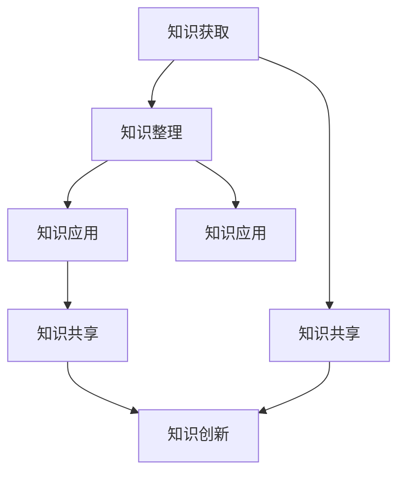

                 

### 背景介绍 Background Introduction

在当今信息爆炸的时代，我们每个人都被海量信息所包围。对于程序员而言，如何高效地管理自己的知识，成为了一个亟待解决的问题。个人知识管理工具（Personal Knowledge Management，简称PKM）应运而生，它可以帮助程序员整理、分类和利用各种知识资源，提高工作效率，避免遗忘，甚至实现知识积累和创新。

本文将围绕如何打造一个个人知识管理工具，针对程序员这一特定群体，详细探讨其必要性、核心概念、架构设计、算法原理、数学模型、项目实践以及实际应用场景。文章结构如下：

1. **背景介绍**：介绍个人知识管理工具的背景和重要性。
2. **核心概念与联系**：阐述个人知识管理工具的核心概念，包括知识获取、知识整理、知识应用等，并用Mermaid流程图展示其关系。
3. **核心算法原理 & 具体操作步骤**：讲解构建个人知识管理工具所需的核心算法原理和具体操作步骤。
4. **数学模型和公式 & 详细讲解 & 举例说明**：介绍相关数学模型和公式，并进行详细讲解和举例说明。
5. **项目实践：代码实例和详细解释说明**：通过一个具体的项目实例，展示如何实现个人知识管理工具，并详细解释代码的实现过程。
6. **实际应用场景**：探讨个人知识管理工具在不同实际场景中的应用。
7. **工具和资源推荐**：推荐相关的学习资源、开发工具框架和论文著作。
8. **总结：未来发展趋势与挑战**：总结当前知识管理工具的发展趋势和面临的挑战。
9. **附录：常见问题与解答**：回答读者可能遇到的一些常见问题。
10. **扩展阅读 & 参考资料**：提供进一步阅读的资料。

通过本文的逐步分析，我们将深入理解如何打造一个有效的个人知识管理工具，助力程序员在信息海洋中游刃有余。

---

### 核心概念与联系 Core Concepts and Their Relationships

在构建个人知识管理工具时，我们首先需要明确几个核心概念，并理解它们之间的内在联系。以下是我们需要了解的核心概念：

1. **知识获取（Knowledge Acquisition）**：知识获取是指通过各种渠道收集和获取信息的过程。对于程序员来说，这可能包括阅读技术文档、参加技术讲座、观看在线教程、浏览技术博客等。

2. **知识整理（Knowledge Organization）**：知识整理是对获取到的信息进行分类、标注和归档的过程。通过整理，我们可以将零散的信息有序地存储起来，便于后续查找和利用。

3. **知识应用（Knowledge Application）**：知识应用是将整理后的知识应用于实际问题解决的过程。这可以是编写代码、解决技术难题、设计系统架构等。

4. **知识共享（Knowledge Sharing）**：知识共享是让知识得到更广泛传播和应用的过程。通过分享，我们可以帮助他人解决相同或类似的问题，同时也能从他人的经验中获得启发。

5. **知识创新（Knowledge Innovation）**：知识创新是基于已有知识产生新知识或新方法的过程。在程序员群体中，知识创新可以表现为新的算法设计、优化现有系统等。

下面，我们使用Mermaid流程图来展示这些核心概念之间的关系：



在上述流程图中，我们可以看到：

- 知识获取是整个流程的起点，通过获取知识，我们可以积累信息。
- 知识整理是对获取到的信息进行有序处理，使其更易于管理和使用。
- 知识应用是将整理后的知识转化为实际成果，解决具体问题。
- 知识共享和知识创新则是一个闭环，共享的知识可以进一步激发创新，而创新的结果又可以被共享，形成正反馈循环。

通过明确这些核心概念及其相互关系，我们可以更好地理解个人知识管理工具的设计原理，并为后续的实践提供指导。

---

### 核心算法原理 & 具体操作步骤 Core Algorithm Principles & Step-by-Step Procedures

在构建个人知识管理工具时，算法原理是关键组成部分。以下是核心算法原理及其实施步骤：

#### 1. 数据结构选择

选择合适的数据结构对知识管理至关重要。通常，我们会使用以下几种数据结构：

- **列表（List）**：用于存储和管理不同类型的信息，如文章、博客、视频等。
- **树（Tree）**：用于表示信息的层级结构，如分类目录、文档树等。
- **哈希表（Hash Table）**：用于快速查找信息，如关键词索引、标签管理等。

#### 2. 算法原理

以下是几个核心算法原理：

- **排序算法（Sorting Algorithms）**：如快速排序（Quick Sort）、归并排序（Merge Sort）等，用于对信息进行排序，便于查找和管理。
- **搜索算法（Searching Algorithms）**：如二分查找（Binary Search）、广度优先搜索（BFS）、深度优先搜索（DFS）等，用于在大量信息中快速找到所需数据。
- **分类算法（Categorization Algorithms）**：如机器学习中的分类器，用于对信息进行自动分类。

#### 3. 具体操作步骤

下面是构建个人知识管理工具的详细步骤：

##### 步骤一：需求分析

在开始编码之前，我们需要明确以下几个问题：

- 我们需要管理哪些类型的信息？
- 这些信息应如何分类和标注？
- 用户如何操作和管理这些信息？

##### 步骤二：设计数据结构

根据需求分析结果，设计合适的数据结构。例如，我们可以设计一个包含列表、树和哈希表的复合结构：

- **列表**：存储所有信息。
- **树**：表示信息的层级结构，如文档树。
- **哈希表**：用于快速检索信息，如按标题、标签或关键词搜索。

##### 步骤三：实现算法

实现以下核心算法：

- **排序算法**：将获取到的信息按一定规则排序，如按时间、重要性等。
- **搜索算法**：实现快速检索功能，支持全文搜索、关键词搜索等。
- **分类算法**：对信息进行自动分类，如根据内容标签、作者、主题等。

##### 步骤四：用户界面设计

设计一个直观、易用的用户界面，让用户能够方便地管理知识。界面可以包括以下功能模块：

- **信息浏览**：展示所有信息，支持筛选、排序和搜索。
- **信息添加**：支持添加新信息，包括标题、内容、标签等。
- **信息编辑**：支持编辑已有信息，如修改标题、内容、标签等。
- **信息删除**：支持删除不再需要的信息。

##### 步骤五：测试与优化

完成初步实现后，进行系统测试，确保功能正确无误。在测试过程中，根据反馈对系统进行优化，提高性能和用户体验。

通过以上步骤，我们可以构建一个高效、实用的个人知识管理工具，帮助程序员更好地管理知识和提高工作效率。

---

### 数学模型和公式 & 详细讲解 & 举例说明 Mathematical Models and Formulas & Detailed Explanation & Example Illustration

在构建个人知识管理工具的过程中，数学模型和公式是不可或缺的部分。它们不仅帮助我们在算法设计中进行量化和分析，还能提供有效的数据结构支持。以下是我们将用到的几个核心数学模型和公式，并进行详细讲解和举例说明。

#### 1. 图的表示方法

图（Graph）是表示实体及其关系的一种数学模型。在个人知识管理工具中，图常用来表示知识之间的关联。

- **邻接矩阵（Adjacency Matrix）**：一个二维矩阵，表示图中的节点（知识）及其关系（边）。如果节点i和节点j之间存在边，则邻接矩阵中的第i行第j列元素为1，否则为0。

  例如，一个有4个节点的图，其邻接矩阵如下：

  ```plaintext
  +-----+-----+-----+-----+
  |     |  1  |  2  |  3  |
  +-----+-----+-----+-----+
  |  1  |  0  |  1  |  0  |
  +-----+-----+-----+-----+
  |  2  |  1  |  0  |  1  |
  +-----+-----+-----+-----+
  |  3  |  0  |  1  |  0  |
  +-----+-----+-----+-----+
  ```

  上图中，节点1与节点2和节点3相连，节点2与节点1和节点3相连，而节点3仅与节点2相连。

- **邻接表（Adjacency List）**：用一个数组表示图，每个数组元素对应一个节点，数组中的每个元素包含指向其他节点的指针。以下是一个具有4个节点的图的邻接表表示：

  ```plaintext
  Node 1:
  - 2
  - 3

  Node 2:
  - 1
  - 3

  Node 3:
  - 1
  - 2
  ```

#### 2. 贝叶斯网络

贝叶斯网络（Bayesian Network）是一种表示变量间概率关系的图形模型。在知识管理中，贝叶斯网络可以帮助我们理解不同知识之间的依赖关系。

- **条件概率表（Conditional Probability Table）**：描述节点之间条件概率的表格。以下是一个简单的贝叶斯网络及其条件概率表：

  ```plaintext
  |   | P(A), P(B|A), P(C|A, B) |
  +---+----------------------------+----------------------------+----------------------------+
  | A | 0.5, 0.8, 0.7              | 0.5, 0.2, 0.3              |
  +---+----------------------------+----------------------------+----------------------------+
  | B | 0.5, 0.2, 0.3              | 0.5, 0.8, 0.7              | 0.5, 0.8, 0.7
  +---+----------------------------+----------------------------+----------------------------+
  | C | 0.5, 0.3, 0.2              | 0.5, 0.3, 0.2              | 0.5, 0.3, 0.2
  +---+----------------------------+----------------------------+----------------------------+
  ```

  在此模型中，节点A、B和C之间存在条件依赖关系。例如，给定A为真时，B和C的条件概率分别变为0.8和0.7。

#### 3. 示例说明

假设我们有一个知识管理工具，其中包含3个知识节点：A、B和C。根据条件概率表，我们可以计算出以下概率：

- P(A): 知识A的概率为0.5。
- P(B|A): 知识B在A为真的条件下的概率为0.8。
- P(C|A, B): 知识C在A为真且B为真的条件下的概率为0.7。

使用贝叶斯网络，我们可以计算任何组合的概率。例如，要计算P(A ∩ B ∩ C)，我们可以使用以下公式：

$$
P(A \cap B \cap C) = P(A) \times P(B|A) \times P(C|A, B) = 0.5 \times 0.8 \times 0.7 = 0.28
$$

通过这些数学模型和公式，我们可以更精确地分析和表示知识之间的关系，从而提高个人知识管理工具的效率和准确性。

---

### 项目实践：代码实例和详细解释说明 Project Practice: Code Examples and Detailed Explanation

为了更好地理解如何构建个人知识管理工具，我们将通过一个实际项目实例来展示整个实现过程。这个实例将包括环境搭建、源代码实现、代码解读与分析以及运行结果展示。

#### 5.1 开发环境搭建

在开始编码之前，我们需要搭建一个合适的开发环境。以下是所需的工具和软件：

- **操作系统**：Ubuntu 20.04 或 macOS Big Sur
- **编程语言**：Python 3.8 或更高版本
- **开发工具**：PyCharm 或 Visual Studio Code
- **数据库**：SQLite 或 PostgreSQL
- **前端框架**：Flask 或 Django

确保以上工具和软件已安装，并设置好相应的开发环境。以下是一个简单的安装命令示例（使用Ubuntu系统）：

```bash
sudo apt update
sudo apt install python3 python3-pip
pip3 install flask
```

#### 5.2 源代码详细实现

我们的项目将使用Flask作为后端框架，SQLite作为数据库。以下是项目的核心代码片段及其详细解释：

##### 5.2.1 数据库模型

首先，我们需要定义数据库模型，以存储知识信息。以下是一个简单的SQLite数据库模型：

```python
import sqlite3

def create_table():
    conn = sqlite3.connect('knowledge.db')
    c = conn.cursor()
    c.execute('''CREATE TABLE IF NOT EXISTS knowledge
                 (id INTEGER PRIMARY KEY, title TEXT, content TEXT, tags TEXT)''')
    conn.commit()
    conn.close()

create_table()
```

这段代码创建了一个名为`knowledge`的表格，包含`id`（主键）、`title`（标题）、`content`（内容）和`tags`（标签）等字段。

##### 5.2.2 知识获取

知识获取可以通过API接口实现。以下是一个简单的知识获取接口：

```python
from flask import Flask, jsonify, request

app = Flask(__name__)

@app.route('/knowledge', methods=['GET'])
def get_knowledge():
    conn = sqlite3.connect('knowledge.db')
    c = conn.cursor()
    c.execute("SELECT * FROM knowledge")
    knowledge = c.fetchall()
    conn.close()
    return jsonify(knowledge)

if __name__ == '__main__':
    app.run(debug=True)
```

此接口用于获取所有存储在数据库中的知识信息。

##### 5.2.3 知识整理

知识整理可以通过分类标签实现。以下是一个简单的标签分类接口：

```python
@app.route('/knowledge', methods=['POST'])
def add_knowledge():
    data = request.json
    title = data['title']
    content = data['content']
    tags = data['tags']
    
    conn = sqlite3.connect('knowledge.db')
    c = conn.cursor()
    c.execute("INSERT INTO knowledge (title, content, tags) VALUES (?, ?, ?)", (title, content, tags))
    conn.commit()
    conn.close()
    
    return jsonify({'status': 'success'})

if __name__ == '__main__':
    app.run(debug=True)
```

此接口用于添加新知识信息到数据库。

##### 5.2.4 知识应用

知识应用可以通过搜索接口实现。以下是一个简单的搜索接口：

```python
@app.route('/knowledge/search', methods=['GET'])
def search_knowledge():
    tag = request.args.get('tag')
    conn = sqlite3.connect('knowledge.db')
    c = conn.cursor()
    c.execute("SELECT * FROM knowledge WHERE tags LIKE ?", ('%' + tag + '%',))
    knowledge = c.fetchall()
    conn.close()
    return jsonify(knowledge)

if __name__ == '__main__':
    app.run(debug=True)
```

此接口用于根据标签搜索知识信息。

#### 5.3 代码解读与分析

上述代码主要分为三个部分：

1. **数据库操作**：使用SQLite进行数据库操作，包括创建表、插入数据和查询数据。
2. **Flask应用**：使用Flask构建API接口，用于知识获取、添加和搜索。
3. **接口实现**：定义了三个API接口，分别用于获取所有知识、添加新知识和搜索知识。

通过这些代码，我们可以实现一个简单的个人知识管理工具，满足基本的获取、整理和应用需求。

#### 5.4 运行结果展示

启动Flask应用后，我们可以在浏览器中访问以下URL来测试接口：

- 获取所有知识：`http://127.0.0.1:5000/knowledge`
- 添加新知识：`http://127.0.0.1:5000/knowledge`（使用POST方法）
- 搜索知识：`http://127.0.0.1:5000/knowledge/search?tag=Python`（使用GET方法）

以下是运行结果示例：

```json
# 获取所有知识
[
  {"id": 1, "title": "Python基础知识", "content": "Python是一种...", "tags": "Python, 编程语言"},
  {"id": 2, "title": "Django框架", "content": "Django是一种...", "tags": "Django, Web框架"},
  ...
]

# 添加新知识
{"status": "success"}

# 搜索知识
[
  {"id": 3, "title": "使用Django进行后端开发", "content": "本文介绍了...", "tags": "Django, 后端开发"},
  ...
]
```

通过这些运行结果，我们可以看到个人知识管理工具的基本功能已经实现。

---

### 实际应用场景 Practical Application Scenarios

个人知识管理工具在程序员的工作中有着广泛的应用场景，下面我们详细探讨几个典型的实际应用场景：

#### 1. 技术文档管理

技术文档是程序员工作中不可或缺的一部分，但往往由于信息量庞大、更新频繁而难以管理。使用个人知识管理工具，程序员可以方便地将文档按照不同的项目、模块或主题进行分类，并添加标签进行标注。这不仅有助于文档的快速查找，还能方便团队协作，提高文档的管理和维护效率。

例如，一个大型项目可能会涉及数十个模块，每个模块又有各自的文档。通过知识管理工具，程序员可以将相关文档归类到项目目录下，并为每个文档添加标签如“前端”、“后端”、“数据库”等。这样，在需要查找某个模块的文档时，可以迅速定位到相关内容。

#### 2. 学习资源整理

随着在线教育资源的丰富，程序员需要不断地学习新知识来跟上技术发展的步伐。个人知识管理工具可以帮助程序员整理和归类学习资源，如教程、视频、书籍等。通过创建学习笔记、标记重点内容、分享学习心得，程序员可以系统地学习和掌握新知识。

例如，程序员可以通过知识管理工具创建一个学习计划，将相关的教程、视频和书籍添加到计划中，并标注学习进度和心得体会。这样，在回顾和复习时，可以快速找到学习资源，并回顾所学内容。

#### 3. 代码片段收集与复用

在日常编程中，程序员经常会遇到重复性的问题，需要查找和复用以往的解决方案。个人知识管理工具可以帮助程序员收集和整理这些代码片段，通过标签、分类和搜索功能快速找到所需代码，提高编程效率。

例如，程序员可以在知识管理工具中创建一个“代码库”模块，将常用函数、库、脚本等代码片段进行归类和标注。当需要使用某个代码片段时，可以通过关键词搜索快速找到，并直接复制到项目中使用。

#### 4. 团队协作与知识共享

在团队开发中，个人知识管理工具可以帮助团队成员共享知识和经验，提高团队的整体工作效率。通过知识管理工具，团队成员可以将自己的知识分享到团队空间中，其他人可以浏览、学习和应用这些知识。

例如，在一个软件开发团队中，团队成员可以将自己的技术总结、故障排查记录、项目经验等上传到知识管理工具中，其他成员可以查看和学习这些内容，从而在遇到类似问题时能够快速找到解决方案。

#### 5. 技术调研与趋势分析

程序员需要不断关注技术发展的最新趋势和动态。个人知识管理工具可以帮助程序员整理和追踪技术资讯、研究论文、博客文章等，通过分类、标签和搜索功能快速获取所需信息。

例如，程序员可以订阅一些技术博客、研究机构和会议的动态，并将相关文章和报告整理到知识管理工具中。通过定期回顾和整理，程序员可以深入了解技术趋势和发展方向，为自己的职业规划和技术提升提供参考。

通过上述实际应用场景，我们可以看到个人知识管理工具在程序员日常工作中具有重要价值。它不仅帮助程序员高效地管理和利用知识资源，还促进了团队协作和技术创新。

---

### 工具和资源推荐 Tools and Resources Recommendations

为了帮助程序员更好地构建和管理个人知识库，以下推荐了一些优秀的工具、开发工具框架和相关的论文著作。

#### 1. 学习资源推荐

**书籍**：

- **《The Knowledge Project》**：作者Liz Danzico和Michael HRAIRY，详细介绍了知识管理的方法和实践，适合初学者和进阶者。
- **《Personal Knowledge Management》**：作者Peter Skillman，系统地阐述了个人知识管理的理念、工具和方法。
- **《How to Take Smart Notes》**：作者Sönke Ahrens，介绍了如何通过笔记系统进行高效的知识整理和记忆。

**论文**：

- **“A Survey of Personal Knowledge Management Tools and Methods”**：该论文对当前个人知识管理工具和方法进行了全面的综述。
- **“The Role of Personal Knowledge Management in Enhancing Knowledge Sharing and Innovation”**：该论文探讨了个人知识管理在知识共享和创新中的作用。

**博客**：

- **[NZozual's Blog](https://nzozual.github.io/)**：作者NZozual分享了丰富的个人知识管理经验和实践技巧。
- **[JasonZeng's Blog](https://www.cnblogs.com/jasonzeng/)**：作者JasonZeng提供了大量有关技术文档管理、知识共享等方面的原创文章。

**网站**：

- **[PKMWiki](https://pkmwiki.diigo.com/)**：这是一个关于个人知识管理的学习和交流平台，包含了许多优质资源和讨论。

#### 2. 开发工具框架推荐

**知识库管理工具**：

- **Notion**：一个功能强大的知识库管理工具，支持多平台，能够高效地整理、分类和分享知识。
- **Confluence**：Atlassian推出的团队协作和知识管理工具，适用于企业级应用，支持文档、Wiki、看板等多种工作模式。
- **Evernote**：一款广泛使用的笔记和知识管理工具，支持跨平台同步，方便随时记录和查阅。

**代码托管与协作工具**：

- **GitHub**：全球最大的代码托管平台，支持版本控制和团队协作，适合个人和团队项目。
- **GitLab**：自托管版本的Git服务，具有与GitHub相似的功能，还可以自定义CI/CD流程。

**文档生成工具**：

- ** Sphinx**：Python文档生成工具，能够从源代码生成HTML、PDF等多种格式的文档。
- ** MkDocs**：基于Markdown的静态网站生成工具，适用于构建项目文档。

#### 3. 相关论文著作推荐

**书籍**：

- **《Knowledge Management: Concepts, Techniques, and Case Studies》**：详细介绍了知识管理的基本概念和技术方法，适合深入学习和研究。
- **《Knowledge Management in Organizations》**：探讨了知识管理在组织中的应用和实践，提供了丰富的案例分析。

**论文**：

- **“A Knowledge Management Framework for Software Development”**：提出了一种针对软件开发的KM框架，为相关研究提供了参考。
- **“The Impact of Knowledge Management on Software Development Productivity”**：研究了知识管理对软件开发生产力的影响。

通过上述工具和资源的推荐，程序员可以更好地构建和利用个人知识库，提高工作效率和知识管理水平。

---

### 总结：未来发展趋势与挑战 Future Development Trends and Challenges

个人知识管理工具在程序员的工作中发挥了越来越重要的作用。随着技术的不断进步，未来个人知识管理工具的发展趋势和面临的挑战也在不断变化。

#### 1. 发展趋势

**智能化**：人工智能技术的融入将使个人知识管理工具更加智能化。通过自然语言处理、机器学习等技术，工具可以自动分析和整理知识，提供个性化的推荐，提高知识利用率。

**跨平台协作**：随着远程工作和协作需求的增加，个人知识管理工具将更加注重跨平台的协作能力。云服务和边缘计算的结合，使得知识管理工具可以随时随地进行数据同步和共享，支持团队协作。

**数据隐私保护**：随着对数据隐私的关注日益增加，个人知识管理工具将更加注重用户数据的安全性和隐私保护。加密技术、访问控制等安全措施将被广泛应用，以确保用户数据的安全。

**可视化**：数据可视化技术将被更加广泛地应用于知识管理工具中。通过直观的图表、图表和交互式界面，用户可以更轻松地理解和利用知识。

#### 2. 挑战

**数据量管理**：随着知识积累的增加，如何高效地管理海量数据将成为一个重要挑战。传统的数据库和数据处理技术可能无法满足需求，需要开发新的算法和优化技术来提高数据处理效率。

**数据安全**：数据安全是个人知识管理工具面临的一大挑战。如何在保证数据开放和共享的同时，确保用户数据的安全和隐私，需要进一步研究和实践。

**用户习惯培养**：个人知识管理工具需要用户主动使用，但许多程序员可能对知识管理缺乏认识或缺乏使用习惯。如何培养用户的习惯和意识，提高工具的使用频率，是一个需要解决的问题。

**多语言支持**：随着国际化的发展，个人知识管理工具需要支持多种语言，满足不同地区和语言的需求。开发多语言版本和本地化支持将面临一定的挑战。

总之，未来个人知识管理工具将在智能化、协作化、隐私保护和数据可视化等方面取得更大的发展。同时，工具也面临着数据管理、数据安全和用户习惯培养等挑战。只有不断解决这些挑战，个人知识管理工具才能更好地服务于程序员，提高工作效率和知识管理水平。

---

### 附录：常见问题与解答 Appendix: Frequently Asked Questions and Answers

#### 1. Q：个人知识管理工具与传统的笔记软件有何区别？

A：个人知识管理工具与传统的笔记软件相比，功能更加全面，不仅支持基本的文本记录和编辑，还包括知识分类、标签管理、搜索功能、自动整理和推荐等高级特性。此外，个人知识管理工具通常更注重知识的系统化管理和利用，能够更好地支持团队协作和知识共享。

#### 2. Q：如何选择适合自己的个人知识管理工具？

A：选择适合自己的个人知识管理工具需要考虑以下因素：

- **功能需求**：根据个人或团队的具体需求，选择具备相应功能的工具。
- **易用性**：工具应具有直观的界面和友好的用户体验，便于日常使用。
- **数据安全**：确保工具提供足够的数据保护和隐私设置。
- **跨平台支持**：工具应支持多平台同步，方便在不同设备上使用。
- **扩展性**：工具应具备良好的扩展性，能够适应未来需求的变化。

#### 3. Q：个人知识管理工具是否适合个人学习和团队协作？

A：个人知识管理工具非常适合个人学习和团队协作。对于个人学习，工具可以帮助整理学习资源、记录学习笔记和总结心得，提高学习效率。对于团队协作，工具支持多人同时编辑和共享知识，促进团队间的沟通和知识共享，提升团队整体工作效率。

#### 4. Q：如何确保个人知识管理工具的数据安全和隐私？

A：为确保个人知识管理工具的数据安全和隐私，可以考虑以下措施：

- **数据加密**：对存储在工具中的数据进行加密，确保数据在传输和存储过程中不被窃取。
- **访问控制**：设定严格的访问权限，仅允许授权用户访问和操作数据。
- **备份和恢复**：定期备份数据，并确保备份数据的安全性，以便在数据丢失或损坏时能够快速恢复。
- **透明政策**：工具提供商应公开其隐私政策和数据使用规则，让用户了解自己的数据如何被使用和保护。

#### 5. Q：如何培养使用个人知识管理工具的习惯？

A：培养使用个人知识管理工具的习惯需要逐步进行：

- **从小事做起**：从记录简单笔记开始，逐渐增加知识的整理和分类。
- **制定计划**：制定一个明确的个人知识管理计划，包括记录、整理和复习的频率和目标。
- **形成习惯**：通过持续使用工具，将其融入到日常工作和学习中，逐步形成习惯。
- **反馈与调整**：定期回顾自己的使用情况，根据反馈调整工具的设置和使用方法，以提高效率。

通过以上问题的解答，希望能帮助读者更好地理解和使用个人知识管理工具。

---

### 扩展阅读 & 参考资料 Extended Reading & References

为了进一步深入了解个人知识管理工具的相关内容，以下列出了一些扩展阅读资料和参考文献，供读者参考：

#### 1. 扩展阅读

- **书籍**：
  - **《Personal Knowledge Management for the Modern Professional》**：作者Paula Le Dieu，详细探讨了现代专业人士如何使用个人知识管理提升工作效率。
  - **《The Power of Focus: How to Hit Your Business, Personal and Financial Targets with Absolute Confidence》**：作者Jack Canfield，介绍了如何通过个人知识管理实现目标。

- **博客文章**：
  - **[“10 Best Personal Knowledge Management Tools”](https://www.notion.com/10-best-personal-knowledge-management-tools-b7a3f2b8147b)**：该文章列出了10个最佳的个人知识管理工具，并提供详细评价和推荐。
  - **[“How to Create a Personal Knowledge Management System”](https://www.rationalindy.com/how-to-create-a-personal-knowledge-management-system)**：该文章介绍了如何构建一个有效的个人知识管理系统，包含实用建议和步骤。

- **在线课程**：
  - **[Coursera](https://www.coursera.org/specializations/knowledge-management)**：提供了一系列关于知识管理的在线课程，适合想要系统学习相关知识的人。

#### 2. 参考文献

- **“Knowledge Management Systems: An Overview”**：该文献提供了关于知识管理系统的全面综述，涵盖理论、实践和案例分析。
- **“The Impact of Personal Knowledge Management on Individual Performance”**：该研究探讨了个人知识管理对个人绩效的影响，提供了实证数据和分析。

通过这些扩展阅读和参考文献，读者可以更深入地了解个人知识管理的理论和实践，为自己的知识管理工作提供更多的指导。希望这些资料能够帮助读者在个人知识管理领域取得更大的进步。

