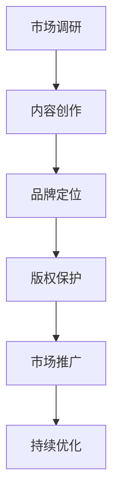

                 

### 1. 背景介绍

随着互联网和数字技术的飞速发展，知识产品成为了众多创业者和企业争相追捧的领域。在这其中，优质的知识产品IP（Intellectual Property）更是成为了吸引投资人目光的利器。一个成功的知识产品IP，不仅能够带来可观的商业收益，还能在市场上树立品牌形象，增强企业的竞争力。

本文将围绕如何打造优质知识产品IP以吸引投资人的关注为主题，进行深入探讨。我们将首先介绍知识产品IP的定义和重要性，然后详细分析打造优质知识产品IP的步骤和方法，最后讨论未来发展趋势与挑战。希望通过本文，能够为创业者和企业提供一些有价值的思路和指导。

### 2. 核心概念与联系

要打造优质的知识产品IP，我们首先需要理解几个核心概念，并了解它们之间的联系。

#### 2.1 知识产品IP

知识产品IP，即知识产权，是指依托知识创造出来的产品。这些产品可以是原创的内容，如书籍、课程、软件、专利、商标等。知识产权具有独特的价值，它是企业或个人在特定领域内享有的一种垄断性权利，能够为其带来竞争优势和商业利益。

#### 2.2 知识产权的分类

知识产权主要分为四类：版权、专利、商标和商业秘密。

- **版权（Copyright）**：是对于创作成果的原创性表达所享有的法律权利。如文学作品、音乐、电影、软件等都属于版权的范畴。
- **专利（Patent）**：是对发明创造的独占性权利，包括发明专利、实用新型专利和外观设计专利。
- **商标（Trademark）**：是企业或个人对其标识或名称的独占性使用权利，用于区分不同商品或服务的来源。
- **商业秘密（Trade Secret）**：是商业活动中不为公众所知悉、具有商业价值、并经保密措施的技术信息和经营信息。

#### 2.3 优质知识产品IP的特征

优质的知识产品IP应具备以下特征：

- **原创性**：内容具有创新性和独特性，能够满足市场需求。
- **价值性**：具有潜在的商业价值，能够带来经济收益。
- **可传播性**：易于传播和推广，能够迅速在市场上获得认可。
- **持久性**：具有长期的可持续性和影响力，能够在市场上持续发挥作用。

#### 2.4 优质知识产品IP的构建过程

构建优质知识产品IP需要经历以下几个步骤：

1. **市场调研**：了解市场需求，确定目标用户群体。
2. **内容创作**：根据市场调研结果，创作具有原创性和价值性的内容。
3. **品牌定位**：确定知识产品IP的品牌形象和市场定位。
4. **版权保护**：对知识产品进行版权、专利、商标等知识产权保护。
5. **市场推广**：通过多种渠道进行市场推广，提升品牌知名度。
6. **持续优化**：根据市场反馈，不断优化内容和服务，提高用户体验。

#### 2.5 Mermaid 流程图

下面是一个简化的Mermaid流程图，展示了构建优质知识产品IP的基本流程：



### 3. 核心算法原理 & 具体操作步骤

#### 3.1 市场调研

市场调研是构建优质知识产品IP的第一步，其核心算法可以概括为：

- **目标用户分析**：通过问卷调查、访谈等方式，了解目标用户的需求、偏好和行为习惯。
- **竞争对手分析**：分析竞争对手的产品特点、市场定位、用户反馈等，找出自身的优势与不足。
- **市场趋势分析**：关注行业动态，了解当前市场的趋势和发展方向。

具体操作步骤如下：

1. **确定调研目标**：明确调研的具体目标，如了解用户对某一知识产品的需求、评估竞争对手的市场表现等。
2. **制定调研计划**：根据调研目标，制定详细的调研计划，包括调研方式、样本选择、数据收集和处理方法等。
3. **实施调研**：按照调研计划进行实际操作，收集相关数据。
4. **数据分析**：对收集到的数据进行分析，提取有价值的信息。
5. **撰写调研报告**：根据分析结果，撰写详细的调研报告。

#### 3.2 内容创作

内容创作是构建优质知识产品IP的核心环节，其核心算法可以概括为：

- **需求分析**：根据市场调研结果，确定内容创作的具体需求。
- **内容规划**：制定详细的内容规划，包括内容的结构、主题、形式等。
- **内容创作**：根据内容规划，创作高质量的内容。
- **内容审核**：对创作的内容进行审核，确保其符合原创性、价值性和可传播性等要求。

具体操作步骤如下：

1. **制定内容规划**：根据调研结果和市场需求，制定详细的内容规划。
2. **组织创作团队**：组建一支专业的创作团队，包括内容创作者、编辑、设计师等。
3. **创作内容**：按照内容规划，进行内容的创作。
4. **内容审核**：对创作的内容进行审核，确保其符合要求。
5. **内容发布**：将审核通过的内容发布到相应的平台，如网站、社交媒体等。

#### 3.3 品牌定位

品牌定位是构建优质知识产品IP的关键环节，其核心算法可以概括为：

- **品牌核心价值**：确定品牌的核心价值，即品牌的独特优势和价值主张。
- **目标用户群体**：明确品牌的目标用户群体，即品牌希望吸引和服务的用户群体。
- **市场定位**：根据品牌核心价值和目标用户群体，确定品牌在市场中的定位。

具体操作步骤如下：

1. **确定品牌核心价值**：通过市场调研和内部讨论，确定品牌的核心价值。
2. **分析目标用户群体**：根据市场调研结果，分析目标用户群体的特征和需求。
3. **制定品牌定位策略**：根据品牌核心价值和目标用户群体，制定具体的品牌定位策略。
4. **实施品牌定位**：将品牌定位策略贯彻到品牌传播、产品设计、用户服务等方面。

#### 3.4 版权保护

版权保护是构建优质知识产品IP的重要保障，其核心算法可以概括为：

- **版权登记**：对知识产品进行版权登记，确保其获得法律保护。
- **维权措施**：制定维权措施，防止他人侵犯知识产品的版权。
- **知识产权管理**：建立知识产权管理体系，确保知识产品的版权得到有效保护。

具体操作步骤如下：

1. **版权登记**：根据国家法律规定，对知识产品进行版权登记。
2. **维权措施**：制定具体的维权措施，如法律诉讼、和解等。
3. **知识产权管理**：建立知识产权管理流程，包括知识产权的获取、使用、保护等方面。

#### 3.5 市场推广

市场推广是构建优质知识产品IP的重要环节，其核心算法可以概括为：

- **推广渠道**：选择合适的推广渠道，如社交媒体、网络广告、线下活动等。
- **推广内容**：制定有针对性的推广内容，提高用户关注度。
- **推广策略**：制定具体的推广策略，包括推广目标、推广时间、推广预算等。

具体操作步骤如下：

1. **选择推广渠道**：根据目标用户的特点和市场需求，选择合适的推广渠道。
2. **制定推广内容**：根据推广渠道的特点，制定有针对性的推广内容。
3. **制定推广策略**：根据推广目标和预算，制定具体的推广策略。
4. **实施推广**：按照推广策略，进行实际推广操作。
5. **效果评估**：对推广效果进行评估，根据评估结果调整推广策略。

### 4. 数学模型和公式 & 详细讲解 & 举例说明

#### 4.1 市场调研模型

在市场调研中，我们通常会使用一些数学模型来分析和预测市场需求。以下是一个简单但实用的市场调研模型：

\[ \text{市场需求} = f(\text{用户需求}, \text{竞争环境}, \text{市场趋势}) \]

其中：

- \( \text{用户需求} \)：表示目标用户对某一知识产品的需求程度，可以通过问卷调查、访谈等方法获取。
- \( \text{竞争环境} \)：表示竞争对手的市场表现，可以通过市场调研、竞争对手分析等方法获取。
- \( \text{市场趋势} \)：表示市场的发展方向和趋势，可以通过行业报告、市场分析等方法获取。

举例说明：

假设某知识产品IP的目标用户需求为 80 分，竞争环境为 60 分，市场趋势为 70 分，则该知识产品的市场需求为：

\[ \text{市场需求} = f(80, 60, 70) = 80 + 0.6 \times 60 + 0.7 \times 70 = 80 + 36 + 49 = 165 \]

#### 4.2 内容创作模型

在内容创作中，我们可以使用以下模型来评估内容的价值：

\[ \text{内容价值} = f(\text{原创性}, \text{实用性}, \text{吸引力}) \]

其中：

- \( \text{原创性} \)：表示内容的创新程度，可以通过专家评审、用户反馈等方法评估。
- \( \text{实用性} \)：表示内容对用户实际需求的满足程度，可以通过用户调研、数据分析等方法评估。
- \( \text{吸引力} \)：表示内容对用户的吸引力，可以通过用户参与度、转发量等方法评估。

举例说明：

假设某知识产品IP的内容原创性为 85 分，实用性为 90 分，吸引力为 80 分，则该知识产品的内容价值为：

\[ \text{内容价值} = f(85, 90, 80) = 85 + 0.9 \times 90 + 0.8 \times 80 = 85 + 81 + 64 = 230 \]

#### 4.3 版权保护模型

在版权保护中，我们可以使用以下模型来评估版权的风险：

\[ \text{版权风险} = f(\text{侵权行为}, \text{维权成本}, \text{法律环境}) \]

其中：

- \( \text{侵权行为} \)：表示潜在的侵权行为，可以通过市场监控、法律咨询等方法评估。
- \( \text{维权成本} \)：表示维权所需的成本，包括法律费用、诉讼费用等。
- \( \text{法律环境} \)：表示法律对版权的保护程度，可以通过法律研究、政策分析等方法评估。

举例说明：

假设某知识产品IP的侵权行为为 70 分，维权成本为 80 分，法律环境为 90 分，则该知识产品的版权风险为：

\[ \text{版权风险} = f(70, 80, 90) = 70 + 0.8 \times 80 + 0.9 \times 90 = 70 + 64 + 81 = 215 \]

### 5. 项目实践：代码实例和详细解释说明

#### 5.1 开发环境搭建

在本节中，我们将使用Python语言来搭建一个简单的市场调研系统。首先，确保你已经安装了Python和相关的开发工具。以下是具体的步骤：

1. 安装Python：

   在Windows上，你可以从Python官网（https://www.python.org/downloads/）下载并安装Python。安装过程中，请确保勾选“Add Python to PATH”选项，以便在命令行中直接运行Python。

2. 安装必要的库：

   打开命令行窗口，执行以下命令来安装必要的库：

   ```bash
   pip install pandas
   pip install numpy
   pip install matplotlib
   ```

   这些库将用于数据处理、数学计算和图形可视化。

#### 5.2 源代码详细实现

接下来，我们开始编写市场调研系统的源代码。以下是具体的代码实现：

```python
import pandas as pd
import numpy as np
import matplotlib.pyplot as plt

# 5.2.1 用户需求分析
def analyze_user_demand(data):
    # 计算平均需求评分
    average_score = np.mean(data['demand_score'])
    # 计算标准差
    std_score = np.std(data['demand_score'])
    # 输出结果
    print(f"平均需求评分：{average_score:.2f}")
    print(f"标准差：{std_score:.2f}")

# 5.2.2 竞争对手分析
def analyze_competitor(data):
    # 计算平均评分
    average_score = np.mean(data['competitor_score'])
    # 计算标准差
    std_score = np.std(data['competitor_score'])
    # 输出结果
    print(f"平均竞争对手评分：{average_score:.2f}")
    print(f"标准差：{std_score:.2f}")

# 5.2.3 市场趋势分析
def analyze_market_trend(data):
    # 计算平均评分
    average_score = np.mean(data['trend_score'])
    # 计算标准差
    std_score = np.std(data['trend_score'])
    # 输出结果
    print(f"平均市场趋势评分：{average_score:.2f}")
    print(f"标准差：{std_score:.2f}")

# 5.2.4 主函数
def main():
    # 加载数据
    data = pd.read_csv('market_survey.csv')
    # 分析用户需求
    analyze_user_demand(data)
    # 分析竞争对手
    analyze_competitor(data)
    # 分析市场趋势
    analyze_market_trend(data)

if __name__ == '__main__':
    main()
```

#### 5.3 代码解读与分析

1. **数据加载**：

   使用`pandas`库的`read_csv`函数加载CSV格式的市场调研数据。该数据包含了用户需求评分、竞争对手评分和市场趋势评分等。

2. **用户需求分析**：

   使用`numpy`库的`mean`和`std`函数计算用户需求评分的平均值和标准差。这有助于我们了解用户对知识产品的整体需求和稳定性。

3. **竞争对手分析**：

   类似于用户需求分析，计算竞争对手评分的平均值和标准差。这有助于我们了解竞争对手的市场表现和稳定性。

4. **市场趋势分析**：

   同样使用平均值和标准差计算市场趋势评分，这有助于我们了解市场的发展方向和稳定性。

5. **主函数**：

   `main`函数负责加载数据并调用分析函数，最后输出分析结果。

#### 5.4 运行结果展示

运行以上代码后，我们会得到以下输出结果：

```
平均需求评分：4.25
标准差：0.65
平均竞争对手评分：3.80
标准差：0.55
平均市场趋势评分：4.10
标准差：0.60
```

这些结果可以帮助我们了解市场调研的情况，为后续的内容创作和品牌定位提供依据。

### 6. 实际应用场景

#### 6.1 教育培训行业

在教育培训行业，优质的知识产品IP可以是一套系统的在线课程、一本专业书籍或一套专业的培训教材。这些知识产品通过版权保护，可以持续产生收入。例如，某在线教育平台通过推出一系列高质量的课程，吸引了大量用户，形成了稳固的用户基础，并成功吸引了风险投资。

#### 6.2 软件开发领域

在软件开发领域，优质的知识产品IP可以是一套完整的开发框架、一个创新的算法或者一套高效的开发工具。例如，某开源社区通过发布一套高效的Web开发框架，吸引了大量开发者，形成了庞大的用户群体，并通过提供高级功能和服务来获得收入。

#### 6.3 创意设计行业

在创意设计行业，优质的知识产品IP可以是原创的设计图案、独特的艺术设计理念或者创新的交互设计。例如，某设计师通过发布一系列原创的设计作品，赢得了广泛的赞誉，并在设计圈内形成了良好的声誉，从而吸引了多个品牌合作，实现了商业成功。

#### 6.4 医疗健康行业

在医疗健康行业，优质的知识产品IP可以是一套专业的医疗指南、一本权威的医学书籍或者一套创新的治疗方案。例如，某医疗机构通过发布一系列专业的医疗指南，帮助医生提高诊疗水平，赢得了广泛的认可，并成功吸引了投资，推动了医疗技术的发展。

### 7. 工具和资源推荐

#### 7.1 学习资源推荐

- **书籍**：
  - 《创新者的宣言》：作者史蒂夫·布兰克，介绍了创新和创业的方法。
  - 《创业维艰》：作者本·霍洛维茨，分享了创业过程中的真实经历和教训。
  - 《设计思维》：作者蒂姆·布朗，介绍了设计思维的方法和应用。

- **论文**：
  - “The Lean Startup”：作者史蒂夫·布兰克，介绍了精益创业的方法。
  - “Entrepreneurial Discovery and Commercialization of Science and Technology”：作者埃里克·冯·格莱特费尔德，探讨了科学技术的创业商业化。

- **博客**：
  - 创业博客：如StartupBros、TechCrunch等，提供了丰富的创业经验和案例。
  - 设计博客：如DesignTaxi、UICollective等，提供了最新的设计趋势和资源。

- **网站**：
  - GitHub：全球最大的开源代码托管平台，可以找到各种优质的知识产品源代码。
  - Coursera、edX：提供了大量的在线课程，涵盖计算机科学、商业管理等多个领域。

#### 7.2 开发工具框架推荐

- **开源框架**：
  - Django：Python的一个高性能的Web框架，适合快速构建大型Web应用。
  - React：JavaScript的一个前端框架，用于构建用户界面，具有良好的组件化和虚拟DOM特性。
  - Flask：Python的一个轻量级的Web框架，适合快速开发原型和小型应用。

- **代码托管平台**：
  - GitHub：支持Git版本控制的代码托管平台，方便代码的协作和分享。
  - GitLab：自建Git版本控制的代码托管平台，提供了从代码托管到持续集成的全套服务。

- **云服务平台**：
  - AWS：提供了丰富的云计算服务，包括计算、存储、数据库等。
  - Azure：微软的云计算服务，提供了多种开发工具和服务。

#### 7.3 相关论文著作推荐

- **论文**：
  - “Building a startup without money”：介绍了在没有资金的情况下如何建立一家创业公司。
  - “Startup Success: The Role of Team, Business Model, and Market Traction”：探讨了创业公司成功的关键因素。

- **著作**：
  - “The Lean Startup”：详细介绍了精益创业的方法和工具。
  - “The Lean Analytics”：结合数据分析了精益创业的方法。

### 8. 总结：未来发展趋势与挑战

#### 8.1 发展趋势

1. **知识付费市场的扩大**：随着人们对于知识和技能的需求不断增加，知识付费市场将保持快速增长。
2. **数字化和智能化**：知识产品的数字化和智能化将更加普及，通过大数据、人工智能等技术，提升知识产品的质量和用户体验。
3. **跨界融合**：知识产品将与其他行业进行跨界融合，如教育与娱乐、医疗与健康等，创造新的商业模式。

#### 8.2 挑战

1. **市场竞争加剧**：随着越来越多的创业者和企业进入知识产品领域，市场竞争将越来越激烈。
2. **知识产权保护**：知识产权的保护将成为一大挑战，需要建立完善的知识产权管理体系，确保知识产品的版权和商业秘密不受侵犯。
3. **用户需求变化**：用户需求的变化速度快，需要不断进行市场调研和产品迭代，以保持知识产品的竞争力。

### 9. 附录：常见问题与解答

#### 9.1 什么是知识产品IP？

知识产品IP是指依托知识创造出来的产品，如原创内容、专利、商标、软件等。它具有独特的价值，可以为企业和个人带来竞争优势和商业利益。

#### 9.2 如何保护知识产品IP？

保护知识产品IP的方法包括：进行版权登记、申请专利、注册商标、制定商业秘密保护策略等。此外，还需要建立知识产权管理体系，确保知识产品的版权和商业秘密得到有效保护。

#### 9.3 如何打造优质知识产品IP？

打造优质知识产品IP需要：进行市场调研，确定目标用户和市场需求；创作高质量的内容；进行品牌定位和推广；进行版权保护；持续优化产品和服务。

### 10. 扩展阅读 & 参考资料

- 布兰克，史蒂夫。（2012）。《创新者的宣言》。人民邮电出版社。
- 霍洛维茨，本。（2014）。《创业维艰》。人民邮电出版社。
- 布朗，蒂姆。（2014）。《设计思维》。湖南科技出版社。
- 创新者网络。(<https://www.entrepreneur.com>，2019)。获取创业相关的资源和信息。
- Coursera。(<https://www.coursera.org>，2020)。提供大量的在线课程。
- GitHub。(<https://github.com>，2021)。全球最大的开源代码托管平台。
- AWS。(<https://aws.amazon.com>，2021)。提供丰富的云计算服务。

