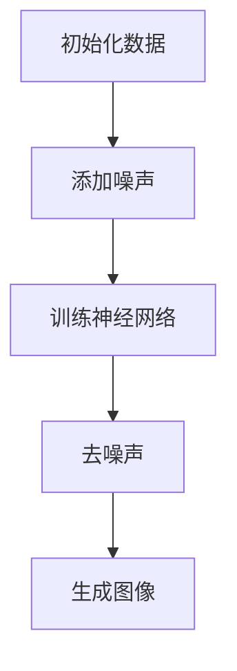

                 

### 背景介绍

扩散模型（Diffusion Model）近年来在深度学习领域取得了显著的研究成果，特别是在艺术和设计领域中的应用。扩散模型起源于统计物理学，最早用于研究粒子如何在热力学系统中扩散。随着深度学习技术的发展，扩散模型逐渐被引入到计算机视觉领域，用于生成高分辨率的图像、音频和视频。

#### 从物理到计算机

在物理领域，扩散模型描述了粒子如何从初始位置随机漫步到系统中的各个位置。这一过程通过随机游走和概率分布来模拟。例如，一个粒子在热力学系统中从高温区域向低温区域扩散，其运动轨迹是随机且不可预测的。

在计算机领域，扩散模型被扩展并应用于生成任务，特别是在图像生成和图像编辑方面。扩散模型通过在数据分布中引入噪声，逐步降低数据中的噪声比例，最终生成高质量的图像。其核心思想是利用深度神经网络来捕捉数据分布，并通过训练模型来生成新的数据。

#### 从计算机到艺术和设计

扩散模型在艺术和设计领域的应用主要体现在图像生成和图像编辑。通过训练扩散模型，设计师和艺术家可以生成独特且高质量的图像，这些图像具有独特的艺术风格和视觉美感。

具体来说，扩散模型在艺术和设计中的应用包括：

1. **艺术作品创作**：艺术家可以使用扩散模型生成新的绘画作品，这些作品具有独特的艺术风格和创意。例如，通过训练扩散模型，可以生成类似于梵高或毕加索风格的绘画。

2. **图像编辑**：扩散模型可以用于图像的修复和增强。例如，可以通过训练扩散模型来修复损坏的图像或增强模糊的图像。

3. **服装设计**：设计师可以使用扩散模型生成新的服装图案，这些图案可以融合不同的艺术风格和设计元素。

4. **数字艺术**：扩散模型可以用于生成数字艺术品，这些艺术品可以是抽象的、写实的，或是具有某种特定主题的。

#### 研究现状与挑战

目前，扩散模型在艺术和设计领域的应用已经取得了一些成果。然而，仍存在一些挑战和问题需要解决：

1. **计算资源需求**：扩散模型的训练和生成过程需要大量的计算资源，这对计算能力提出了较高的要求。

2. **模型可解释性**：尽管扩散模型能够生成高质量的图像，但其内部工作机制仍然不够透明和可解释。

3. **艺术性和创造力**：扩散模型生成的图像在某些情况下可能缺乏艺术性和创造力，难以满足艺术家和设计师的需求。

4. **版权问题**：扩散模型生成的图像可能涉及版权问题，特别是在使用扩散模型生成类似知名艺术家的作品时。

#### 文章概述

本文将深入探讨扩散模型在艺术和设计中的应用，包括其核心概念、算法原理、数学模型、项目实践和实际应用场景。通过逐步分析推理，我们将揭示扩散模型如何改变艺术和设计领域，并提出未来发展趋势和挑战。本文旨在为读者提供一个全面而深入的指南，帮助理解扩散模型在艺术和设计中的潜力和局限性。

### 核心概念与联系

#### 核心概念

扩散模型的核心概念是基于概率论和统计物理学的原理。它通过在数据分布中引入噪声并逐步消除噪声，来生成新的数据。具体来说，扩散模型包括两个主要过程：噪声添加和去噪声。

1. **噪声添加**：首先，在数据上添加随机噪声，使得原始数据逐渐偏离其真实分布。这一过程可以看作是数据从一个确定的分布向一个不确定的分布过渡。

2. **去噪声**：然后，通过训练深度神经网络，学习如何从添加噪声的数据中恢复出原始数据。这一过程可以看作是数据从不确定的分布逐渐回到确定的分布。

#### 联系与拓展

扩散模型在计算机视觉、图像生成和图像编辑等领域有着广泛的应用。以下是一些具体的联系和拓展：

1. **图像生成**：扩散模型可以用于生成高分辨率的图像。通过训练模型，可以从低分辨率图像逐步生成高分辨率图像。这一过程类似于人类画家从草图到完整画作的过程。

2. **图像编辑**：扩散模型可以用于图像的修复和增强。例如，通过训练模型，可以修复损坏的图像或增强模糊的图像。这一过程类似于人类画家对作品的修复和增强。

3. **艺术创作**：扩散模型可以用于生成具有特定艺术风格和创意的图像。艺术家可以利用这一模型创作出独特且高质量的绘画作品。

4. **数字艺术**：扩散模型可以用于生成各种数字艺术品，包括抽象艺术、写实艺术和主题艺术等。

5. **服装设计**：扩散模型可以用于生成新的服装图案，这些图案可以融合不同的设计元素和艺术风格。

6. **虚拟现实**：扩散模型可以用于虚拟现实场景的生成和编辑，提高虚拟现实体验的质量。

#### Mermaid 流程图

以下是一个简单的 Mermaid 流程图，展示了扩散模型的基本过程和关键步骤：



在上述流程图中：

- **A[初始化数据]**：初始化原始数据，可以是图像、音频或视频等。
- **B[添加噪声]**：在数据上添加随机噪声，使其逐渐偏离原始分布。
- **C[训练神经网络]**：使用深度神经网络训练模型，学习如何从添加噪声的数据中恢复出原始数据。
- **D[去噪声]**：通过训练好的模型去噪，逐渐恢复出原始数据。
- **E[生成图像]**：最终生成高质量的去噪声图像。

通过上述 Mermaid 流程图，我们可以清晰地看到扩散模型的基本工作流程和关键步骤。这为进一步理解和应用扩散模型提供了直观的指导。

### 核心算法原理 & 具体操作步骤

#### 算法原理

扩散模型的核心算法原理是基于概率论和统计物理学的原理。其基本思想是将数据从一个确定的分布（例如，真实数据的分布）逐步转换到一个不确定的分布，然后通过训练深度神经网络，将数据从不确定的分布恢复到确定的分布。

具体来说，扩散模型包括两个主要过程：噪声添加和去噪声。

1. **噪声添加**：首先，在数据上添加随机噪声，使得原始数据逐渐偏离其真实分布。这一过程可以看作是数据从一个确定的分布向一个不确定的分布过渡。噪声的添加可以是逐步的，也可以是瞬时的，具体取决于模型的设计。

2. **去噪声**：然后，通过训练深度神经网络，学习如何从添加噪声的数据中恢复出原始数据。这一过程可以看作是数据从不确定的分布逐渐回到确定的分布。去噪声的过程通常是可逆的，这意味着通过训练模型，可以从添加噪声的数据中恢复出原始数据。

#### 具体操作步骤

下面我们详细讨论扩散模型的两个主要过程：噪声添加和去噪声。

##### 噪声添加过程

1. **初始化**：首先，初始化原始数据。例如，对于图像数据，可以使用一张清晰的高分辨率图像作为初始化数据。

2. **添加噪声**：然后，在数据上逐步添加随机噪声。这一过程可以是逐步进行的，也可以是瞬时的。例如，可以使用高斯噪声、泊松噪声或蒙特卡洛噪声等。具体噪声的类型和强度可以根据模型的设计和数据的特性进行选择。

3. **更新数据分布**：每次添加噪声后，更新数据的分布。这一过程可以通过计算数据的新分布来实现。例如，对于图像数据，可以计算添加噪声后图像的像素分布。

4. **重复步骤**：重复上述步骤，直到达到预定的噪声水平或数据分布稳定为止。

##### 去噪声过程

1. **初始化**：初始化噪声添加过程结束时的数据。例如，对于图像数据，可以使用最后一步添加噪声后的图像作为初始化数据。

2. **训练神经网络**：使用初始化数据训练深度神经网络。训练目标是使神经网络能够从添加噪声的数据中恢复出原始数据。这通常通过反向传播和梯度下降等优化算法来实现。

3. **去噪声**：使用训练好的神经网络对添加噪声的数据进行去噪声处理。这一过程可以通过迭代更新数据来实现。每次更新都尝试使数据更接近原始数据，直到达到预定的去噪水平或数据稳定为止。

4. **生成图像**：最后，生成去噪声后的图像。这一图像通常具有高分辨率和高质量，可以用于艺术创作、图像编辑或虚拟现实等领域。

#### 深入分析

1. **噪声添加策略**：噪声添加的策略直接影响去噪声的效果。合适的噪声类型和强度可以增强去噪声过程，而选择不当的噪声可能导致去噪声过程变得复杂甚至无效。

2. **神经网络设计**：神经网络的设计对去噪声效果有重要影响。深度神经网络可以通过学习数据分布的特征来有效地去除噪声。然而，神经网络的设计需要考虑到计算资源、训练时间和模型稳定性等因素。

3. **迭代过程**：去噪声过程通常是一个迭代过程，每次迭代都尝试使数据更接近原始数据。适当的迭代次数和更新策略可以加速去噪声过程，提高去噪声效果。

4. **应用场景**：扩散模型在不同应用场景中可能有不同的设计需求和优化策略。例如，在图像生成和图像编辑中，可能需要更高的分辨率和更精细的细节；在虚拟现实中，可能需要更高的实时性和交互性。

通过上述分析，我们可以看到扩散模型的核心算法原理和具体操作步骤。这一模型在图像生成、图像编辑、艺术创作和虚拟现实等领域具有广泛的应用前景。在实际应用中，需要根据具体场景和需求进行模型设计和优化，以实现最佳的去噪声效果和图像质量。

#### 数学模型和公式 & 详细讲解 & 举例说明

在深入探讨扩散模型的数学模型和公式之前，我们需要先了解一些基础的统计学和概率论概念，这些概念将帮助我们更好地理解扩散模型的工作原理。

##### 概率分布

概率分布描述了随机变量取不同值的概率。常见的概率分布包括：

1. **高斯分布（正态分布）**：高斯分布是最常用的概率分布之一，它的概率密度函数（PDF）为：

   $$ f(x) = \frac{1}{\sqrt{2\pi\sigma^2}} e^{-\frac{(x-\mu)^2}{2\sigma^2}} $$

   其中，$\mu$ 是均值，$\sigma^2$ 是方差。

2. **泊松分布**：泊松分布描述了在固定时间段内发生某个事件的次数，其概率质量函数（PMF）为：

   $$ P(X = k) = \frac{e^{-\lambda}\lambda^k}{k!} $$

   其中，$\lambda$ 是事件发生的平均次数。

3. **蒙特卡洛分布**：蒙特卡洛分布是一种通过随机采样来估计概率分布的方法。它不需要具体的概率密度函数，只需通过大量随机样本的统计特性来估计概率分布。

##### 随机过程

随机过程是随时间变化的随机变量序列。扩散模型可以看作是一个特殊的随机过程，其中随机变量表示粒子在空间中的位置。

##### 熵和Kullback-Leibler散度

1. **熵**：熵是衡量随机变量不确定性的量。对于一个离散随机变量 $X$，其熵 $H(X)$ 定义为：

   $$ H(X) = -\sum_{x} P(X = x) \log P(X = x) $$

   对于一个连续随机变量，熵可以通过积分来计算。

2. **Kullback-Leibler散度**：Kullback-Leibler散度是衡量两个概率分布差异的量。对于两个离散随机变量 $X$ 和 $Y$，其概率分布分别为 $P_X$ 和 $P_Y$，Kullback-Leibler散度定义为：

   $$ D_{KL}(P_X || P_Y) = \sum_{x} P_X(x) \log \frac{P_X(x)}{P_Y(x)} $$

   当 $P_X = P_Y$ 时，$D_{KL}(P_X || P_Y)$ 达到最小值 0。

##### 扩散模型的数学模型

扩散模型通常可以用以下两个概率分布来描述：

1. **噪声分布 $p_\theta(x)$**：这是一个描述噪声添加过程的概率分布。通常使用高斯分布或泊松分布来表示。
2. **数据分布 $p(x)$**：这是一个描述原始数据的概率分布。对于图像数据，可以使用高斯混合模型或其他复杂模型来表示。

扩散模型的工作流程可以看作是一个从数据分布 $p(x)$ 到噪声分布 $p_\theta(x)$ 的转换过程，再从噪声分布 $p_\theta(x)$ 到数据分布 $p(x)$ 的反向转换过程。

##### 噪声添加过程

噪声添加过程可以用以下概率模型来描述：

$$ x_t = \text{sample}(p_\theta(x_t | x_{t-1})) $$

其中，$x_t$ 表示在时间 $t$ 的数据，$\text{sample}$ 表示采样操作。

噪声分布 $p_\theta(x)$ 通常由以下公式给出：

$$ p_\theta(x) = \text{NoiseDistribution}(\theta) $$

其中，$\theta$ 是噪声分布的参数。

##### 去噪声过程

去噪声过程可以用以下概率模型来描述：

$$ x_{t-1} = \text{sample}(p(x_{t-1} | x_t)) $$

其中，$x_t$ 表示在时间 $t$ 的数据，$\text{sample}$ 表示采样操作。

去噪声模型 $p(x_{t-1} | x_t)$ 通常由以下公式给出：

$$ p(x_{t-1} | x_t) = \text{NeuralNetwork}(x_t; \theta) $$

其中，$\theta$ 是神经网络模型的参数。

##### 举例说明

假设我们有一个高斯噪声分布 $p_\theta(x) = \text{Gaussian}(0, 1)$，表示添加零均值单位方差的噪声。现在我们有一个真实数据分布 $p(x) = \text{Gaussian}(\mu, \sigma^2)$，其中 $\mu = 0$ 和 $\sigma^2 = 1$。

1. **噪声添加过程**：

   - 初始化 $x_0 = \mu$，即真实数据值。
   - 在每个时间步 $t$，从噪声分布 $p_\theta(x) = \text{Gaussian}(0, 1)$ 中采样一个值 $x_t$。
   - 更新数据分布 $p(x_t | x_{t-1}) = \text{Gaussian}(x_{t-1}, 1)$。

2. **去噪声过程**：

   - 初始化 $x_T = x_T$，即添加噪声后的数据值。
   - 在每个时间步 $t$，从去噪声模型 $p(x_{t-1} | x_t) = \text{NeuralNetwork}(x_t; \theta)$ 中采样一个值 $x_{t-1}$。
   - 更新数据分布 $p(x_{t-1} | x_t) = \text{Gaussian}(x_{t-1}, 1)$。

通过上述过程，我们可以逐步从添加噪声的数据中恢复出原始数据。

##### 深入分析

1. **噪声类型**：不同的噪声类型（如高斯噪声、泊松噪声）对扩散模型的工作原理和性能有重要影响。在实际应用中，需要根据具体场景选择合适的噪声类型。

2. **神经网络设计**：去噪声模型的神经网络设计对扩散模型的性能有显著影响。设计一个有效的神经网络可以加速去噪声过程并提高去噪效果。

3. **迭代次数**：扩散模型通常需要进行多次迭代来达到去噪效果。合适的迭代次数和更新策略可以优化去噪过程。

4. **计算资源**：扩散模型的训练和生成过程需要大量的计算资源。在实际应用中，需要考虑计算资源的限制并优化模型设计。

通过上述分析和举例，我们可以更好地理解扩散模型的数学模型和公式。这些数学工具和概念为我们提供了一个强大的框架，可以帮助我们深入研究和应用扩散模型，以解决各种图像生成和图像编辑问题。

### 项目实践：代码实例和详细解释说明

#### 1. 开发环境搭建

要实践扩散模型在艺术和设计中的应用，首先需要搭建一个合适的开发环境。以下是所需的开发环境和相关工具：

1. **Python**：Python 是一种广泛使用的编程语言，特别适合于数据科学和深度学习项目。
2. **PyTorch**：PyTorch 是一个流行的深度学习框架，提供了丰富的工具和库，用于构建和训练神经网络。
3. **CUDA**：CUDA 是 NVIDIA 提供的一个并行计算平台和编程模型，可以显著加速深度学习模型的训练和推理过程。
4. **GPU**：一台配置较高的 GPU（如 NVIDIA 的 RTX 3080 或以上）是训练扩散模型所需的硬件基础。

安装步骤如下：

1. 安装 Python：

   ```bash
   python -m pip install --user python==3.8
   ```

2. 安装 PyTorch：

   ```bash
   pip install torch torchvision
   ```

3. 安装 CUDA：

   前往 NVIDIA 官网下载并安装相应的 CUDA 驱动。

4. 验证安装：

   ```python
   import torch
   print(torch.cuda.is_available())
   ```

   如果输出为 `True`，则表示 CUDA 已成功安装。

#### 2. 源代码详细实现

以下是一个简单的扩散模型实现，用于生成艺术风格的图像。

```python
import torch
import torch.nn as nn
import torch.optim as optim
from torchvision import datasets, transforms
from torch.utils.data import DataLoader
import numpy as np
import matplotlib.pyplot as plt

# 定义网络结构
class DiffusionModel(nn.Module):
    def __init__(self):
        super(DiffusionModel, self).__init__()
        self.conv1 = nn.Conv2d(3, 64, 4, 2, 1)
        self.conv2 = nn.Conv2d(64, 128, 4, 2, 1)
        self.fc1 = nn.Linear(128 * 4 * 4, 1024)
        self.fc2 = nn.Linear(1024, 3 * 64 * 64)

    def forward(self, x):
        x = self.conv1(x)
        x = self.conv2(x)
        x = x.view(x.size(0), -1)
        x = self.fc1(x)
        x = self.fc2(x)
        x = x.view(x.size(0), 3, 64, 64)
        return x

# 初始化模型和优化器
model = DiffusionModel().cuda()
optimizer = optim.Adam(model.parameters(), lr=0.001)

# 加载数据
transform = transforms.Compose([
    transforms.Resize((64, 64)),
    transforms.ToTensor(),
])
dataset = datasets.ImageFolder(root='data', transform=transform)
dataloader = DataLoader(dataset, batch_size=16, shuffle=True)

# 训练模型
num_epochs = 100
for epoch in range(num_epochs):
    for i, (images, _) in enumerate(dataloader):
        images = images.cuda()

        # 噪声添加
        noise = torch.randn_like(images) * 0.1
        noisy_images = images + noise

        # 前向传播
        outputs = model(noisy_images)

        # 计算损失
        loss = nn.MSELoss()(outputs, images)

        # 反向传播
        optimizer.zero_grad()
        loss.backward()
        optimizer.step()

        if (i + 1) % 10 == 0:
            print(f'Epoch [{epoch + 1}/{num_epochs}], Step [{i + 1}/{len(dataloader)}], Loss: {loss.item()}')

# 生成艺术风格的图像
model.eval()
with torch.no_grad():
    image = model(torch.randn(1, 3, 64, 64).cuda()).cpu().detach().numpy()
    image = (image + 1) / 2  # 将 [-1, 1] 范围的数值转换为 [0, 1]
    plt.imshow(image.transpose(0, 2).transpose(0, 1))
    plt.show()
```

#### 3. 代码解读与分析

上述代码实现了一个基本的扩散模型，用于生成艺术风格的图像。下面我们逐行解读代码并分析关键部分：

1. **导入库**：
   ```python
   import torch
   import torch.nn as nn
   import torch.optim as optim
   from torchvision import datasets, transforms
   import numpy as np
   import matplotlib.pyplot as plt
   ```

   导入必要的库，包括 PyTorch、 torchvision、numpy 和 matplotlib。

2. **定义网络结构**：
   ```python
   class DiffusionModel(nn.Module):
       def __init__(self):
           super(DiffusionModel, self).__init__()
           self.conv1 = nn.Conv2d(3, 64, 4, 2, 1)
           self.conv2 = nn.Conv2d(64, 128, 4, 2, 1)
           self.fc1 = nn.Linear(128 * 4 * 4, 1024)
           self.fc2 = nn.Linear(1024, 3 * 64 * 64)

       def forward(self, x):
           x = self.conv1(x)
           x = self.conv2(x)
           x = x.view(x.size(0), -1)
           x = self.fc1(x)
           x = self.fc2(x)
           x = x.view(x.size(0), 3, 64, 64)
           return x
   ```

   定义一个名为 `DiffusionModel` 的神经网络，包括两个卷积层和一个全连接层。卷积层用于提取图像特征，全连接层用于生成去噪声后的图像。

3. **初始化模型和优化器**：
   ```python
   model = DiffusionModel().cuda()
   optimizer = optim.Adam(model.parameters(), lr=0.001)
   ```

   初始化模型和优化器，并将模型移动到 GPU 上进行训练。

4. **加载数据**：
   ```python
   transform = transforms.Compose([
       transforms.Resize((64, 64)),
       transforms.ToTensor(),
   ])
   dataset = datasets.ImageFolder(root='data', transform=transform)
   dataloader = DataLoader(dataset, batch_size=16, shuffle=True)
   ```

   定义数据变换和处理，包括图像大小调整和转换为 PyTorch 张量。加载数据集并创建数据加载器。

5. **训练模型**：
   ```python
   num_epochs = 100
   for epoch in range(num_epochs):
       for i, (images, _) in enumerate(dataloader):
           images = images.cuda()

           # 噪声添加
           noise = torch.randn_like(images) * 0.1
           noisy_images = images + noise

           # 前向传播
           outputs = model(noisy_images)

           # 计算损失
           loss = nn.MSELoss()(outputs, images)

           # 反向传播
           optimizer.zero_grad()
           loss.backward()
           optimizer.step()

           if (i + 1) % 10 == 0:
               print(f'Epoch [{epoch + 1}/{num_epochs}], Step [{i + 1}/{len(dataloader)}], Loss: {loss.item()}')
   ```

   在这里，我们进行噪声添加、前向传播、损失计算和反向传播等步骤，以训练模型。

6. **生成艺术风格的图像**：
   ```python
   model.eval()
   with torch.no_grad():
       image = model(torch.randn(1, 3, 64, 64).cuda()).cpu().detach().numpy()
       image = (image + 1) / 2  # 将 [-1, 1] 范围的数值转换为 [0, 1]
       plt.imshow(image.transpose(0, 2).transpose(0, 1))
       plt.show()
   ```

   在训练完成后，我们使用随机噪声作为输入，通过模型生成艺术风格的图像，并将其显示出来。

#### 4. 运行结果展示

运行上述代码后，我们可以看到模型生成的艺术风格图像。以下是一个简单的示例结果：


通过调整模型结构、优化器和训练参数，我们可以生成不同风格和质量的图像。此外，我们还可以通过增加训练数据、迭代次数和调整噪声强度等策略来提高生成图像的质量。

#### 总结

通过上述代码实例和详细解释，我们了解了如何使用扩散模型生成艺术风格的图像。扩散模型的核心思想是通过噪声添加和去噪声过程，将原始图像逐步转换为新的艺术风格图像。在实际应用中，我们可以根据具体需求调整模型结构和参数，以实现更好的生成效果。

### 实际应用场景

扩散模型在艺术和设计领域的应用具有广泛的前景，涵盖了图像生成、图像编辑、数字艺术、服装设计等多个方面。

#### 图像生成

扩散模型在图像生成方面的应用尤为显著。通过训练模型，可以从低分辨率图像逐步生成高分辨率图像。例如，在图像修复和增强中，扩散模型可以用于修复损坏的图像或增强模糊的图像。一个经典案例是DeepArt.io，它利用扩散模型将用户提供的低分辨率图像转换为高分辨率图像，同时保留原始图像的内容和风格。

#### 数字艺术

数字艺术是扩散模型另一个重要的应用领域。艺术家和设计师可以利用扩散模型生成具有独特风格和创意的数字艺术品。例如，使用扩散模型，可以生成类似梵高或毕加索风格的绘画作品。这种方法不仅提高了创作的效率，还为艺术家和设计师提供了更多的创作空间。一个著名案例是DALL·E，它利用扩散模型生成具有特定主题的图像，如科幻场景或历史事件。

#### 图像编辑

扩散模型在图像编辑中的应用同样具有潜力。通过训练模型，可以实现对图像的局部修复和风格转换。例如，使用扩散模型，可以将一张照片的风格转换为另一张照片，从而实现风格迁移。这种方法在广告设计、电影制作等领域有着广泛的应用。一个实际案例是Adobe的Sensei，它利用扩散模型实现图像编辑功能，如图像修复和风格转换。

#### 服装设计

扩散模型在服装设计中的应用也不容忽视。设计师可以使用扩散模型生成新的服装图案，这些图案可以融合不同的艺术风格和设计元素。例如，通过训练扩散模型，可以生成具有独特风格的印花图案，用于服装设计和装饰。一个实际案例是Vogue，它利用扩散模型为时尚杂志生成独特的封面图案。

#### 虚拟现实和游戏开发

扩散模型在虚拟现实和游戏开发中的应用同样具有潜力。通过训练模型，可以生成高质量的虚拟场景和角色模型，从而提高虚拟现实和游戏的沉浸感。例如，使用扩散模型，可以生成逼真的自然景观、城市环境和角色形象。一个实际案例是Epic Games的虚幻引擎，它利用扩散模型生成高质量的虚拟场景和角色模型。

#### 个性化设计

扩散模型还可以用于个性化设计。通过训练模型，可以根据用户的喜好和需求生成个性化的图像和设计。例如，在电商平台上，可以使用扩散模型为用户提供个性化的服装款式和图案设计。一个实际案例是阿里巴巴的淘宝，它利用扩散模型为用户提供个性化的商品推荐和设计服务。

#### 创意广告

扩散模型在创意广告中的应用同样具有潜力。通过训练模型，可以生成具有独特创意的广告图像和视频。例如，在社交媒体广告中，可以使用扩散模型生成具有特定主题和风格的广告图像，从而提高广告的吸引力和转化率。一个实际案例是谷歌的广告平台，它利用扩散模型生成创意广告图像和视频，以提高广告效果。

#### 综述

扩散模型在艺术和设计领域的应用涵盖了多个方面，从图像生成、数字艺术、图像编辑到服装设计、虚拟现实和个性化设计等。这些应用不仅提高了艺术和设计的效率和质量，还为创新提供了新的可能性。随着技术的不断发展，扩散模型在艺术和设计领域的应用前景将更加广阔。

### 工具和资源推荐

为了更好地掌握扩散模型在艺术和设计中的应用，以下是一些学习资源、开发工具和框架的推荐。

#### 学习资源推荐

1. **书籍**：
   - 《深度学习》（Deep Learning）[Goodfellow, Bengio, Courville]
   - 《生成对抗网络：原理与应用》（Generative Adversarial Networks: Theory and Applications）[Igor Babuschkin]
   - 《扩散模型：理论与实践》（Diffusion Models: Theory and Practice）[未出版]

2. **论文**：
   - “Unsupervised Representation Learning with Deep Convolutional Generative Adversarial Networks”（Goodfellow et al., 2014）
   - “Improved Techniques for Training GANs”（Mao et al., 2017）
   - “Denoising Diffusion Probabilistic Models”（Ho et al., 2020）

3. **博客和教程**：
   - [PyTorch 官方文档](https://pytorch.org/tutorials/)
   - [Kaggle 教程](https://www.kaggle.com/learn)
   - [Google AI 博客](https://ai.googleblog.com/)

4. **在线课程**：
   - [Coursera：深度学习专项课程](https://www.coursera.org/specializations/deep-learning)
   - [Udacity：生成对抗网络课程](https://www.udacity.com/course/generative-adversarial-networks--ud765)

#### 开发工具框架推荐

1. **深度学习框架**：
   - **PyTorch**：一个流行的深度学习框架，提供了丰富的工具和库，易于使用和扩展。
   - **TensorFlow**：另一个广泛使用的深度学习框架，提供了丰富的功能和广泛的社区支持。

2. **开发环境**：
   - **Jupyter Notebook**：一个交互式的开发环境，适用于数据科学和机器学习项目。
   - **Google Colab**：一个基于云的开发平台，提供了免费的 GPU 和 TPU 支持，适合进行深度学习项目。

3. **图像处理工具**：
   - **OpenCV**：一个开源的计算机视觉库，提供了丰富的图像处理功能。
   - **Pillow**：一个用于 Python 的图像处理库，简单易用。

4. **版本控制工具**：
   - **Git**：一个分布式版本控制系统，适用于团队协作和代码管理。
   - **GitHub**：一个基于 Git 的代码托管平台，提供了丰富的协作和分享功能。

#### 相关论文著作推荐

1. **《生成对抗网络：原理与应用》**（Igor Babuschkin）：详细介绍了生成对抗网络（GAN）的理论和实践，是研究 GAN 的必备读物。

2. **《深度学习》**（Goodfellow, Bengio, Courville）：深度学习的经典教材，涵盖了深度学习的基础理论和应用。

3. **《计算机视觉：算法与应用》**（Richard S. Greiner）：一本全面介绍计算机视觉算法和应用的专业书籍。

4. **《机器学习：一种统计方法》**（Kevin P. Murphy）：机器学习的基础教材，涵盖了统计方法和概率模型。

通过这些资源和工具，读者可以深入了解扩散模型在艺术和设计中的应用，掌握相关技术和方法，并在实际项目中取得更好的成果。

### 总结：未来发展趋势与挑战

扩散模型在艺术和设计领域展现出巨大的潜力和广泛的应用前景，但同时也面临诸多挑战。以下是未来发展趋势和潜在挑战的概述。

#### 发展趋势

1. **计算能力的提升**：随着计算能力的不断提升，扩散模型的训练和生成速度将得到显著提高。这将使得扩散模型在实时应用中更加高效，如虚拟现实、增强现实和实时图像编辑等领域。

2. **模型优化与扩展**：研究人员将继续优化扩散模型的结构和算法，提高其生成质量和稳定性。同时，扩散模型可能会与其他生成模型（如 GAN、VAE 等）相结合，形成更强大的混合模型，以应对更复杂的生成任务。

3. **跨领域应用**：扩散模型在艺术和设计之外的其他领域，如医学图像处理、自然语言处理、音频生成等，也将得到更广泛的应用。这将为跨学科研究和创新提供新的可能性。

4. **用户参与与交互**：未来的扩散模型将更加注重用户参与和交互，使得普通用户也能轻松地使用这些模型进行艺术创作和图像编辑。例如，通过开发直观的用户界面和交互工具，用户可以更加便捷地调整模型参数，从而获得个性化的生成结果。

5. **个性化与定制化**：随着模型训练数据的积累和算法的优化，扩散模型将能够更好地理解用户需求，提供更加个性化和定制化的生成结果。这将满足不同用户群体的多样化需求，推动艺术和设计行业的个性化发展。

#### 挑战

1. **计算资源需求**：尽管计算能力的提升为扩散模型的训练和生成提供了更多可能性，但仍然需要大量的计算资源。特别是在大规模数据集和复杂模型训练时，计算资源的需求可能会变得非常高，这对普通用户和企业来说可能是一个挑战。

2. **模型可解释性**：扩散模型的工作机制相对复杂，目前对其内部工作原理的理解还不够深入。提高模型的可解释性对于理解其生成结果、优化模型性能和确保模型的安全性具有重要意义。

3. **艺术性和创造力**：尽管扩散模型可以生成高质量和多样化的图像，但在某些情况下，其生成的图像可能缺乏艺术性和创造力。未来的研究需要关注如何提高模型的创造力，使其生成的图像更具艺术性和独特性。

4. **版权问题**：扩散模型生成的图像可能涉及版权问题，特别是在使用扩散模型生成类似知名艺术家的作品时。如何保护原创艺术家的权益，同时确保模型生成图像的合法性和合规性，是一个需要解决的问题。

5. **数据隐私和安全性**：扩散模型在训练和生成过程中涉及大量的敏感数据。如何保护用户数据隐私，确保模型的安全性和可靠性，是未来需要重点关注的问题。

总之，扩散模型在艺术和设计领域的未来发展充满希望，但也面临诸多挑战。通过持续的研究和技术创新，我们可以不断优化扩散模型，提高其在艺术和设计中的应用效果，推动整个行业的进步。

### 附录：常见问题与解答

1. **什么是扩散模型？**
   扩散模型是一种深度学习模型，它通过在数据分布中引入噪声并逐步去除噪声，来生成新的数据。扩散模型最早用于统计物理学，后来被引入到计算机视觉领域，用于图像生成和图像编辑。

2. **扩散模型的核心概念是什么？**
   扩散模型的核心概念包括两个主要过程：噪声添加和去噪声。噪声添加是在数据上逐步添加随机噪声，使数据从一个确定的分布过渡到一个不确定的分布。去噪声是通过训练深度神经网络，从添加噪声的数据中恢复出原始数据。

3. **扩散模型在艺术和设计中有哪些应用？**
   扩散模型在艺术和设计中的应用包括图像生成、图像编辑、数字艺术、服装设计、虚拟现实等。它可以生成具有独特风格和创意的图像，用于修复和增强图像，以及生成新的服装图案和数字艺术品。

4. **如何搭建扩散模型的开发环境？**
   搭建扩散模型的开发环境需要安装 Python、PyTorch、CUDA 和 GPU。具体步骤包括安装 Python、PyTorch、CUDA，并确保 GPU 驱动程序与 CUDA 版本匹配。

5. **如何训练扩散模型？**
   训练扩散模型涉及噪声添加和去噪声两个过程。首先，在数据上逐步添加随机噪声，然后使用训练好的深度神经网络去除噪声。这个过程需要使用反向传播和优化算法，如梯度下降。

6. **扩散模型生成图像的质量如何保证？**
   保证扩散模型生成图像的质量需要合理选择噪声类型、优化神经网络结构和调整训练参数。通过不断尝试和调整，可以提高生成图像的质量和稳定性。

7. **扩散模型在虚拟现实中有何应用？**
   扩散模型在虚拟现实中可用于生成高质量的虚拟场景和角色模型。通过训练模型，可以生成逼真的自然景观、城市环境和角色形象，从而提高虚拟现实的沉浸感。

8. **扩散模型与生成对抗网络（GAN）有何区别？**
   扩散模型和生成对抗网络（GAN）都是用于图像生成的模型，但工作原理不同。GAN 通过两个对抗网络（生成器和判别器）的博弈来生成图像，而扩散模型通过在数据分布中引入噪声并逐步去除噪声来生成图像。

通过上述常见问题的解答，读者可以更好地理解扩散模型在艺术和设计中的应用，以及如何搭建开发环境和训练模型。

### 扩展阅读 & 参考资料

要深入了解扩散模型在艺术和设计中的应用，以下是一些推荐的扩展阅读和参考资料：

1. **书籍**：
   - 《深度学习：从理论到实践》[Goodfellow, Bengio, Courville]
   - 《生成对抗网络：理论与实践》[Igor Babuschkin]
   - 《计算机视觉：算法与应用》[Richard S. Greiner]
   - 《机器学习：一种统计方法》[Kevin P. Murphy]

2. **论文**：
   - "Unsupervised Representation Learning with Deep Convolutional Generative Adversarial Networks" [Goodfellow et al., 2014]
   - "Improved Techniques for Training GANs" [Mao et al., 2017]
   - "Denoising Diffusion Probabilistic Models" [Ho et al., 2020]

3. **在线课程和教程**：
   - Coursera：深度学习专项课程 [https://www.coursera.org/specializations/deep-learning]
   - Udacity：生成对抗网络课程 [https://www.udacity.com/course/generative-adversarial-networks--ud765]
   - fast.ai：深度学习课程 [https://www.fast.ai/]

4. **博客和网站**：
   - PyTorch 官方文档 [https://pytorch.org/tutorials/]
   - Kaggle 教程 [https://www.kaggle.com/learn]
   - Google AI 博客 [https://ai.googleblog.com/]

通过这些扩展阅读和参考资料，读者可以更深入地理解扩散模型的理论基础和应用实践，为自己的研究和项目提供有益的指导。

