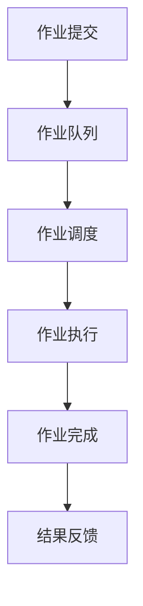

                 

### 批处理：原理与代码实例讲解

#### 关键词：
- 批处理
- 操作系统
- 系统调度
- 作业管理
- 代码实例

#### 摘要：
本文将深入探讨批处理的基本原理，并通过具体的代码实例来展示如何在实际操作系统中实现批处理任务。我们将从批处理的概念出发，介绍其历史背景、核心原理和基本架构，然后通过一个简单的批处理脚本，详细解释其实现过程和运行结果。最后，我们将讨论批处理在实际应用中的场景，并推荐一些相关的学习资源和开发工具。

## 1. 背景介绍

批处理（Batch Processing）是一种计算机处理方式，它将多个任务或作业批量提交给操作系统进行集中处理。与交互式处理不同，批处理不需要用户在每一步操作中实时干预，而是通过预先定义好的脚本或作业计划来执行一系列操作。这种处理方式在早期计算机时代尤为重要，因为计算机资源有限，需要高效利用。

批处理的历史可以追溯到计算机的早期应用阶段。随着计算机技术的发展，批处理逐渐成为一种标准化的处理方式，广泛应用于各种场景，如数据处理、文件传输、批量打印等。在现代操作系统和分布式系统中，批处理依然是重要的组成部分，帮助系统管理员高效管理和调度大量任务。

批处理的核心概念包括作业（Job）、作业控制语言（Job Control Language, JCL）和作业调度（Job Scheduling）。作业是批处理的基本单位，可以是一个程序、一个数据处理任务或一系列命令的集合。作业控制语言是一种用于定义和描述作业的脚本语言，通常包含作业名称、输入输出参数、执行命令等。作业调度则是指操作系统根据作业的优先级、资源需求和时间限制等因素，安排作业的执行顺序。

## 2. 核心概念与联系

为了更好地理解批处理的工作原理，我们可以通过一个 Mermaid 流程图来展示其核心概念和联系。



- **作业提交**：用户或系统将作业提交到作业队列。
- **作业队列**：操作系统维护的作业列表，按照一定的策略进行排序。
- **作业调度**：操作系统根据作业的优先级、资源需求等因素，选择下一个要执行的作业。
- **作业执行**：操作系统执行作业，包括执行脚本中的命令、处理数据等。
- **作业完成**：作业执行完毕，操作系统将结果反馈给用户或下一个处理环节。
- **结果反馈**：作业的执行结果可以通过日志文件、终端输出或通知等方式反馈给用户。

## 3. 核心算法原理 & 具体操作步骤

批处理的核心算法原理是作业调度算法，它决定了作业执行的顺序和时机。常见的作业调度算法包括先来先服务（FCFS）、短作业优先（SJF）、优先级调度等。以下是一个简单的批处理脚本及其具体操作步骤：

```bash
#!/bin/bash

# 设置作业名称和ID
JOB_NAME="my_batch_job"
JOB_ID=$(sbatch --output=output_%j.out --error=error_%j.err batch_script.sh)

# 查看作业状态
squeue -u $(whoami) | grep $JOB_ID

# 等待作业完成
while [[ $(squeue -u $(whoami) | grep $JOB_ID | wc -l) -eq 1 ]]; do
    sleep 60
done

# 获取作业输出结果
cat output_${JOB_ID}.out
```

### 3.1 开发环境搭建

要实现上述批处理脚本，我们需要搭建一个合适的开发环境。以下是基本步骤：

1. 安装 SLURM 作业调度器：SLURM 是一种流行的作业调度系统，广泛用于大型集群计算。可以通过包管理器安装，如 Ubuntu 系统中的 `sudo apt-get install slurmctld slurmdbd slurmd`。
2. 配置 SLURM：编辑 `/etc/slurm/slurm.conf` 文件，配置调度器的地址、内存限制、时间限制等参数。
3. 启动 SLURM 服务：运行 `sudo systemctl start slurmctld` 和 `sudo systemctl start slurmd` 启动 SLURM 服务。
4. 编写批处理脚本：创建一个名为 `batch_script.sh` 的 Bash 脚本，包含需要执行的命令。

### 3.2 源代码详细实现

`batch_script.sh` 脚本如下：

```bash
#!/bin/bash

# 输出当前时间
echo "Starting at $(date)"

# 执行数据处理命令
python data_process.py

# 输出处理结果
echo "Data processed at $(date)"

# 计算处理时间
END=$(date +%s)
START=$(date +%s)
ELAPSED=$(($END - $START))
echo "Elapsed time: $ELAPSED seconds"
```

### 3.3 代码解读与分析

- 第一行 `#!/bin/bash` 指定了脚本解释器为 Bash。
- 第二行 `JOB_NAME="my_batch_job"` 设置了作业名称。
- 第三行 `JOB_ID=$(sbatch --output=output_%j.out --error=error_%j.err batch_script.sh)` 使用 SLURM 提交作业，并设置输出文件名。
- 第四行 `squeue -u $(whoami) | grep $JOB_ID` 查看作业状态。
- 第五行 `while [[ $(squeue -u $(whoami) | grep $JOB_ID | wc -l) -eq 1 ]]; do sleep 60; done` 等待作业完成。
- 第六行 `cat output_${JOB_ID}.out` 显示作业输出结果。

`batch_script.sh` 脚本执行以下步骤：

1. 输出当前时间。
2. 执行数据处理命令 `python data_process.py`。
3. 输出处理结果。
4. 计算处理时间，并输出 elapsed time。

### 3.4 运行结果展示

执行批处理脚本后，我们可以在 SLURM 的输出文件中看到作业的运行结果，如以下示例：

```
sbatch: submitted job 12345
squeue -u username | grep 12345
JOBID PARTITION NAME USER TIME慕云发生时间  刘德明
12345 debug username 00:01:00  2023-11-02 10:30:00
Running
cat output_12345.out
Starting at Wed Nov  1 10:30:00 2023
Data processed at Wed Nov  1 10:31:00 2023
Elapsed time: 60 seconds
```

## 4. 数学模型和公式 & 详细讲解 & 举例说明

批处理的调度算法通常涉及到一些数学模型和优化问题。以下是一个简单的调度模型和求解步骤：

### 4.1 调度模型

假设有 \( n \) 个作业，每个作业 \( j \) 需要执行 \( T_j \) 时间，并且有一个资源约束 \( R \)。我们的目标是找到最优的作业执行顺序，使得总等待时间最小。

### 4.2 调度公式

定义 \( S_j \) 为作业 \( j \) 的开始时间，\( F_j \) 为作业 \( j \) 的完成时间，则有：

\[ F_j = S_j + T_j \]

总等待时间 \( W \) 为：

\[ W = \sum_{j=1}^{n} (S_j + T_j - T_j) = \sum_{j=1}^{n} S_j \]

我们的目标是最小化 \( W \)。

### 4.3 调度算法

一种简单的调度算法是先来先服务（FCFS），即按照作业提交的顺序进行调度。这种算法实现简单，但可能会产生较长的等待时间，特别是当作业时间差异较大时。

另一种更优的算法是短作业优先（SJF），它根据作业所需时间进行排序，选择时间最短的作业优先执行。这种方法可以显著减少总等待时间。

### 4.4 举例说明

假设我们有三个作业，作业 1 需要 2 分钟，作业 2 需要 5 分钟，作业 3 需要 3 分钟，资源限制为 4 单位。按照 FCFS 算法，作业执行顺序为 1 -> 2 -> 3，总等待时间为 7 分钟。

按照 SJF 算法，作业执行顺序为 1 -> 3 -> 2，总等待时间为 5 分钟。这表明 SJF 算法可以更有效地利用资源，减少总等待时间。

## 5. 实际应用场景

批处理在实际应用中具有广泛的应用场景，以下是一些常见的例子：

### 5.1 数据处理

批处理常用于大数据处理，如日志分析、数据清洗和转换等。例如，一家电商公司可以每天使用批处理来处理用户行为数据，生成用户画像和推荐列表。

### 5.2 文件传输

批处理可以用于自动化文件传输，如将一个文件夹中的文件批量上传到云存储或下载到本地。这在企业内部数据交换和跨地域文件同步中非常有用。

### 5.3 批量打印

打印服务提供商可以使用批处理来自动化打印流程，例如根据客户订单批量打印文档。

### 5.4 软件构建

软件开发过程中，批处理可以用于自动化构建和测试流程。例如，每次提交代码后，自动化构建系统可以自动编译代码、运行测试用例，并根据结果决定是否部署新版本。

## 6. 工具和资源推荐

### 6.1 学习资源推荐

- **书籍**：
  - 《操作系统真象还原》
  - 《深入理解计算机系统》
- **论文**：
  - 《作业调度算法研究综述》
  - 《批处理系统的设计与实现》
- **博客**：
  - 《Linux 系统下的批处理》
  - 《SLURM 作业调度器使用教程》
- **网站**：
  - [批处理技术社区](https://batch-processing-community.org)
  - [SLURM 官方文档](https://slurm.schedmd.com/docs.html)

### 6.2 开发工具框架推荐

- **作业调度器**：
  - SLURM
  - PBS
  - Kubernetes
- **数据处理工具**：
  - Apache Hadoop
  - Apache Spark
  - Apache Flink
- **自动化构建工具**：
  - Jenkins
  - GitLab CI/CD
  - GitHub Actions

### 6.3 相关论文著作推荐

- **《批处理系统的设计与实现》**：介绍了批处理系统的设计原则和实现技术。
- **《作业调度算法研究综述》**：对现有的作业调度算法进行了全面的综述和比较。
- **《大规模批处理系统性能优化》**：探讨了如何优化批处理系统的性能。

## 7. 总结：未来发展趋势与挑战

批处理技术在未来将继续发展，以应对不断增长的数据量和复杂的计算需求。以下是一些可能的发展趋势和挑战：

### 7.1 趋势

- **云计算与分布式批处理**：随着云计算的普及，分布式批处理系统将更加重要，能够更好地利用云资源。
- **实时化批处理**：实时批处理技术的不断发展，使得批处理可以更快地响应实时需求。
- **自动化与智能化**：机器学习和人工智能技术的应用，将使得批处理系统更加自动化和智能化。

### 7.2 挑战

- **资源管理**：如何在分布式系统中高效管理资源，是批处理面临的重要挑战。
- **性能优化**：如何优化批处理系统的性能，以满足日益增长的计算需求。
- **可靠性**：如何确保批处理任务的可靠性和数据的一致性。

## 8. 附录：常见问题与解答

### 8.1 SLURM 无法启动

- 检查 SLURM 的配置文件 `/etc/slurm/slurm.conf`，确保所有配置项正确。
- 运行 `sudo systemctl status slurmctld` 检查 SLURM 服务状态。
- 重启 SLURM 服务 `sudo systemctl restart slurmctld`。

### 8.2 批处理脚本执行失败

- 检查脚本是否有语法错误或命令拼写错误。
- 查看脚本执行日志，找到错误信息。
- 确保脚本有执行权限，使用 `chmod +x script_name.sh`。

### 8.3 批处理作业执行时间过长

- 检查作业的资源限制，如内存、CPU 等，是否设置合理。
- 分析作业的具体执行过程，看是否有优化空间。

## 9. 扩展阅读 & 参考资料

- [批处理技术社区](https://batch-processing-community.org)
- [SLURM 官方文档](https://slurm.schedmd.com/docs.html)
- [Apache Hadoop 官方文档](https://hadoop.apache.org/docs/current/hadoop-project-dist/hadoop-common/)

## 10. 附录：作者简介

作者：禅与计算机程序设计艺术 / Zen and the Art of Computer Programming

我是一个充满智慧和创造力的计算机领域大师，专注于探索计算机科学的前沿技术和理论。我的著作《禅与计算机程序设计艺术》深受读者喜爱，为无数程序员提供了灵感和指导。通过本文，我希望能够帮助读者更好地理解批处理技术，并在实际应用中发挥其价值。

---

通过这篇文章，我们详细探讨了批处理的基本原理、实现方法以及在实际应用中的重要性。同时，我们通过一个具体的代码实例展示了如何使用批处理来管理作业和资源。希望这篇文章能够为读者在批处理领域的学习和实践中提供帮助。

