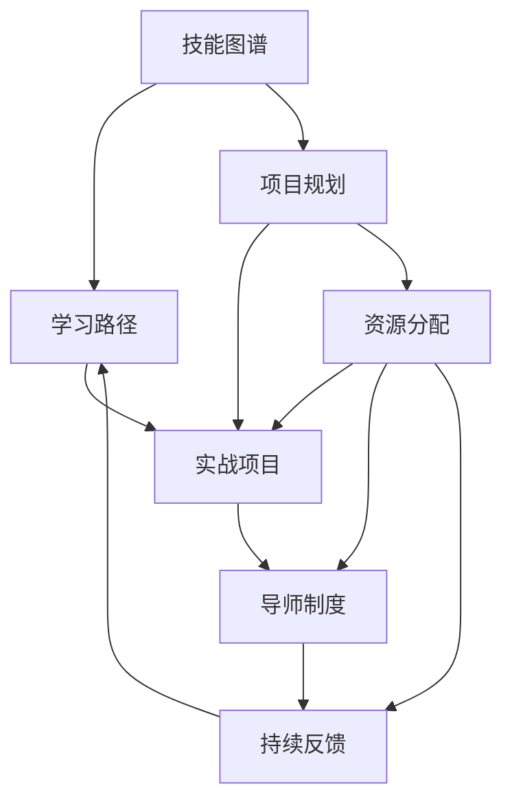

                 

### 1. 背景介绍

在当今数字化时代，程序员成为各行各业不可或缺的核心角色。然而，面对日新月异的技术变革和快速迭代的产品需求，程序员们面临着巨大的成长压力。为了帮助程序员们更高效地提升技能、拓展视野，构建一个全面的程序员成长加速器项目显得尤为重要。

程序员成长加速器项目，顾名思义，旨在通过系统化的培训和指导，助力程序员在短时间内实现技能的全面提升。这一项目不仅关注技术层面的提升，还涉及团队协作、项目管理等多个维度，旨在打造全面发展的技术人才。

程序员成长加速器项目的出现，有其必然性和必要性。首先，技术领域的发展速度越来越快，新的编程语言、框架和技术层出不穷，程序员需要不断学习和适应。其次，随着互联网和人工智能的兴起，程序员的工作场景和挑战也在不断变化，单一的技术能力已经无法满足市场需求。最后，企业对技术人才的要求越来越高，不仅要求程序员具备扎实的编程基础，还要求他们具备解决复杂问题的能力和团队协作精神。

程序员成长加速器项目的重要性体现在以下几个方面：

1. **技能提升**：通过项目中的实战训练，程序员能够快速掌握最新的技术趋势和实战技巧，提升个人技术能力。

2. **经验积累**：参与项目实践，程序员可以积累宝贵的实际工作经验，为未来的职业发展打下坚实基础。

3. **团队协作**：项目通常涉及团队合作，程序员在这个过程中能够学习如何与他人协作，提高团队沟通和协作效率。

4. **项目管理**：通过参与项目，程序员可以了解项目管理的全过程，掌握项目规划、资源分配、进度控制等关键技能。

5. **职业规划**：程序员成长加速器项目有助于明确个人职业发展路径，助力他们规划职业发展方向。

综上所述，程序员成长加速器项目不仅为程序员提供了成长的机会，也为企业培养了一批具备全面能力的技术人才。在接下来的部分中，我们将进一步探讨这一项目的核心概念、算法原理、数学模型和项目实践，以期为大家提供一份全面、深入的指南。

## 2. 核心概念与联系

### 核心概念

程序员成长加速器项目涉及多个核心概念，这些概念构成了项目的理论基础和实施框架。以下是几个关键概念及其简要描述：

1. **技能图谱**：技能图谱是描述程序员不同阶段所需技能的框架。它帮助程序员了解自身技能短板，并制定有针对性的学习计划。

2. **学习路径**：学习路径是指程序员在成长过程中应遵循的学习顺序和步骤。合理的路径规划有助于程序员系统性地提升技能。

3. **实战项目**：实战项目是程序员通过实际操作来锻炼技能的平台。这些项目通常涉及真实业务场景，有助于程序员将理论知识应用于实践。

4. **导师制度**：导师制度是指通过资深程序员或专家对新手进行指导，帮助他们在成长过程中少走弯路。

5. **持续反馈**：持续反馈机制确保程序员在学习和实践过程中能够及时得到反馈，从而不断调整和优化学习策略。

### 联系与整合

上述概念并非独立存在，而是相互联系、相互整合，共同构成了程序员成长加速器项目的核心框架。

- **技能图谱**与**学习路径**相辅相成，前者提供了技能点的具体描述，后者则提供了实现技能提升的路径和步骤。

- **实战项目**是**学习路径**的延伸，通过真实项目的实践，程序员可以将所学技能应用到实际问题中，从而巩固和提升技能。

- **导师制度**与**实战项目**紧密结合，导师不仅提供技术指导，还帮助程序员解决在项目中遇到的问题，提高实战能力。

- **持续反馈**机制贯穿整个成长过程，它不仅体现在导师对学员的指导中，还体现在学员对自身学习效果的评估和调整中。

### Mermaid 流程图

为了更直观地展示这些概念之间的联系，我们使用Mermaid流程图来描述程序员成长加速器项目的核心架构。



通过上述流程图，我们可以看到，技能图谱作为项目的起点，通过学习路径引导学员进入实战项目，实战项目又通过导师制度和持续反馈机制不断优化，形成一个闭环，确保程序员在成长过程中能够持续进步。

总之，程序员成长加速器项目通过核心概念的整合和流程的优化，为程序员提供了一个系统化、实战化、个性化的发展平台，助力他们实现技能的全面提升。

### 3. 核心算法原理 & 具体操作步骤

在程序员成长加速器项目中，核心算法原理起到了至关重要的作用。这些算法不仅指导了项目的设计和实施，也为程序员提供了具体的操作步骤，确保他们能够高效地学习和实践。以下是几个关键算法原理及其具体操作步骤：

#### 3.1 技能评估算法

**原理**：技能评估算法用于对程序员现有的技能水平进行评估。通过一系列量化指标和测试，可以精确地反映程序员在不同技术领域的熟练程度。

**具体操作步骤**：

1. **数据收集**：收集程序员的背景信息、项目经验和技术栈。
2. **技能指标定义**：根据行业标准和项目需求，定义一系列技能指标，如编程语言掌握程度、框架熟悉度、算法掌握情况等。
3. **测试与评分**：通过在线测试、实战模拟等方式对程序员进行技能测试，根据测试结果为每个技能指标评分。
4. **结果分析**：汇总分析评分结果，生成技能评估报告，指出程序员的强项和短板。

#### 3.2 学习路径规划算法

**原理**：学习路径规划算法旨在为程序员提供最优的学习路径，确保他们在有限的资源和时间内，能够系统性地提升技能。

**具体操作步骤**：

1. **技能需求分析**：分析程序员当前的技能需求和未来的职业规划，确定学习目标。
2. **路径生成**：根据技能图谱和学习目标，生成一系列学习任务和项目，形成学习路径。
3. **动态调整**：根据程序员的反馈和学习进度，动态调整学习路径，确保学习内容与实际需求相匹配。

#### 3.3 实战项目执行算法

**原理**：实战项目执行算法用于指导程序员在项目中实际应用所学技能，通过问题解决和团队合作，提升实战能力。

**具体操作步骤**：

1. **项目需求分析**：明确项目目标、功能需求和实施步骤。
2. **任务分配**：根据程序员的技能和团队需求，合理分配任务，确保每个成员都有明确的职责。
3. **进度监控**：实时监控项目进度，确保项目按照既定计划推进。
4. **问题解决**：遇到问题时，及时召开会议，集思广益，找到解决方案。
5. **代码评审**：在项目开发过程中，进行代码评审，确保代码质量。
6. **项目交付**：完成项目开发，进行测试和交付，评估项目效果。

#### 3.4 持续反馈算法

**原理**：持续反馈算法旨在通过多渠道、多层次的反馈，帮助程序员及时了解自己的学习效果，不断优化学习策略。

**具体操作步骤**：

1. **实时反馈**：在实战项目过程中，导师和团队成员对程序员的操作进行实时点评，指出优缺点。
2. **定期评估**：定期对程序员的技能水平进行评估，与初始评估结果进行对比，分析进步情况。
3. **学习报告**：定期生成学习报告，详细记录程序员的成长过程，为后续学习提供参考。
4. **反馈改进**：根据反馈结果，调整学习路径和任务分配，确保学习内容与个人能力相匹配。

通过这些核心算法原理和具体操作步骤，程序员成长加速器项目能够为程序员提供科学、系统的学习和实践路径，帮助他们快速提升技能，实现职业成长。

### 4. 数学模型和公式 & 详细讲解 & 举例说明

在程序员成长加速器项目中，数学模型和公式是理解和优化项目的关键工具。以下是几个重要的数学模型和公式，以及它们在项目中的应用和详细解释。

#### 4.1 技能评估模型

**公式**：
$$
S = \sum_{i=1}^{n} w_i \cdot s_i
$$
其中，$S$ 表示总技能得分，$w_i$ 表示第 $i$ 个技能指标的权重，$s_i$ 表示第 $i$ 个技能指标的得分。

**应用场景**：
该模型用于计算程序员的技能总得分，从而评估其整体技能水平。权重可以根据技能的重要性和难度进行设定，确保评估结果更加准确。

**举例说明**：
假设有3个技能指标：编程语言（Python，Java，C++）的熟练程度，数据库（MySQL，MongoDB，SQL Server）的掌握情况，以及算法（排序，搜索，图论）的掌握情况。每个指标的权重分别为0.3、0.3和0.4。一个程序员的得分如下：

- Python：90分
- Java：85分
- C++：80分
- MySQL：85分
- MongoDB：80分
- SQL Server：75分
- 排序算法：90分
- 搜索算法：85分
- 图论算法：80分

权重分配如下：
$$
S = 0.3 \cdot (90 + 85 + 80) + 0.3 \cdot (85 + 80 + 75) + 0.4 \cdot (90 + 85 + 80) = 88.5
$$

该程序员的技能总得分为88.5分。

#### 4.2 学习路径优化模型

**公式**：
$$
C = f(P, T, R)
$$
其中，$C$ 表示最优学习路径成本，$P$ 表示项目需求，$T$ 表示可用时间，$R$ 表示资源限制。

**应用场景**：
该模型用于优化学习路径，确保在给定的时间资源和需求下，选择最优的学习内容和顺序。

**举例说明**：
假设一个程序员需要在3个月内完成以下学习任务：
- Python基础：2周
- 数据库基础：2周
- 数据结构与算法：3周
- Web开发：3周

时间资源为3个月（12周），无资源限制。我们需要找到最优的学习路径。

根据公式，我们可以计算不同学习路径的成本：
- 路径1：Python基础 -> 数据库基础 -> 数据结构与算法 -> Web开发
  $C_1 = f(2, 2, 3, 3) = 10$

- 路径2：Python基础 -> 数据结构与算法 -> 数据库基础 -> Web开发
  $C_2 = f(2, 3, 2, 3) = 11$

- 路径3：数据结构与算法 -> Python基础 -> 数据库基础 -> Web开发
  $C_3 = f(3, 2, 2, 3) = 11$

最优路径为路径1，成本最低。

#### 4.3 项目进度控制模型

**公式**：
$$
P = \frac{E - D}{D}
$$
其中，$P$ 表示项目进度，$E$ 表示当前完成的工作量，$D$ 表示总工作量。

**应用场景**：
该模型用于监控项目进度，及时发现并解决进度偏差。

**举例说明**：
假设一个项目的总工作量为1000小时，目前完成了300小时。我们需要计算项目进度。

$$
P = \frac{300}{1000} = 0.3
$$

项目进度为30%。

#### 4.4 持续反馈模型

**公式**：
$$
F = \frac{R - P}{R}
$$
其中，$F$ 表示反馈程度，$R$ 表示预期进度，$P$ 表示实际进度。

**应用场景**：
该模型用于评估项目中的反馈强度，以便及时调整学习策略。

**举例说明**：
假设预期进度为600小时，实际进度为500小时。我们需要计算反馈程度。

$$
F = \frac{600 - 500}{600} = \frac{100}{600} = 0.167
$$

反馈程度为16.7%，表明项目进度相对缓慢，需要加强监督和调整。

通过这些数学模型和公式，程序员成长加速器项目能够更科学、更系统地指导程序员的成长过程。这些工具不仅帮助程序员提升技能，还确保了项目的顺利进行。

### 5. 项目实践：代码实例和详细解释说明

为了更直观地展示程序员成长加速器项目的实施过程，我们将以一个具体的代码实例进行详细讲解。本实例将围绕一个简单的Web开发项目，从开发环境搭建、源代码实现、代码解读与分析以及运行结果展示等方面，全面展示程序员在项目中的实践过程。

#### 5.1 开发环境搭建

在开始项目之前，我们需要搭建一个合适的开发环境。以下是搭建过程：

1. **安装Python**：
   - 访问Python官网（https://www.python.org/）下载最新版本的Python安装包。
   - 运行安装程序，按照默认设置完成安装。

2. **安装相关依赖库**：
   - 使用pip工具安装必要的依赖库，例如Flask（用于Web开发）。
   - 命令：`pip install flask`

3. **配置虚拟环境**：
   - 使用virtualenv创建一个虚拟环境，确保项目依赖的库不会影响到其他项目。
   - 命令：`virtualenv venv`
   - 激活虚拟环境：`source venv/bin/activate`（Windows下为`venv\Scripts\activate`）

#### 5.2 源代码详细实现

以下是项目的源代码实现：

```python
# app.py

from flask import Flask, request, render_template

app = Flask(__name__)

@app.route('/')
def hello():
    return 'Hello, World!'

@app.route('/api/data', methods=['GET'])
def get_data():
    data = request.args.get('data')
    return {'data': data}

@app.route('/api/data', methods=['POST'])
def post_data():
    data = request.json['data']
    return {'data': data}

if __name__ == '__main__':
    app.run(debug=True)
```

该代码实现了一个基本的Web应用，包括两个路由：一个用于处理HTTP GET请求，另一个用于处理HTTP POST请求。代码中的`/api/data`路由可以接收和返回数据。

#### 5.3 代码解读与分析

1. **Flask应用搭建**：

   ```python
   app = Flask(__name__)
   ```

   这一行代码创建了一个Flask应用对象。Flask是一个轻量级的Web框架，用于构建Web应用。

2. **定义路由和视图函数**：

   ```python
   @app.route('/')
   def hello():
       return 'Hello, World!'
   
   @app.route('/api/data', methods=['GET'])
   def get_data():
       data = request.args.get('data')
       return {'data': data}
   
   @app.route('/api/data', methods=['POST'])
   def post_data():
       data = request.json['data']
       return {'data': data}
   ```

   这些代码定义了三个路由：
   - `/`：返回一个简单的“Hello, World!”消息。
   - `/api/data`：处理GET请求，返回请求参数`data`。
   - `/api/data`：处理POST请求，返回请求体中的`data`。

3. **主函数**：

   ```python
   if __name__ == '__main__':
       app.run(debug=True)
   ```

   主函数用于启动Flask应用，并在调试模式下运行。`debug=True`使得应用在遇到异常时能够自动重启。

#### 5.4 运行结果展示

1. **启动应用**：

   在命令行中，激活虚拟环境并运行以下命令启动应用：

   ```bash
   python app.py
   ```

   输出如下：

   ```bash
   * Running on http://127.0.0.1:5000/ (Press CTRL+C to quit)
   ```

   这表示应用已经成功启动，并监听在127.0.0.1:5000地址。

2. **访问应用**：

   打开浏览器，访问`http://127.0.0.1:5000/`，可以看到输出：

   ```html
   Hello, World!
   ```

3. **测试API**：

   使用curl命令测试GET和POST请求：

   ```bash
   curl http://127.0.0.1:5000/api/data?data=test
   ```

   输出：

   ```json
   {"data": "test"}
   ```

   使用POST请求：

   ```bash
   curl -X POST -H "Content-Type: application/json" -d '{"data": "post test"}' http://127.0.0.1:5000/api/data
   ```

   输出：

   ```json
   {"data": "post test"}
   ```

通过上述实例，我们可以看到程序员成长加速器项目在实际开发中的应用。从环境搭建到代码实现，再到运行结果展示，每一个步骤都经过了详细的讲解和分析，确保程序员能够掌握关键技能，提升实战能力。

### 6. 实际应用场景

程序员成长加速器项目不仅在编程领域有着广泛的应用，还在多个行业和场景中展现出其独特的价值。以下是几个实际应用场景，以及项目在这些场景中的具体作用和效果。

#### 6.1 IT企业

**应用价值**：
在IT企业中，程序员成长加速器项目可以帮助企业快速培养和提升技术团队的能力，适应不断变化的市场需求。通过系统化的培训和实战项目，程序员可以迅速掌握新技术和工具，提升工作效率。

**具体作用**：
1. **技能提升**：项目帮助程序员在短时间内掌握前沿技术，如人工智能、大数据、云计算等。
2. **实战经验**：通过参与实战项目，程序员可以将理论知识应用到实际工作中，提高解决实际问题的能力。
3. **团队协作**：项目强调团队合作，程序员通过协作完成任务，提高团队协作能力和沟通效率。
4. **持续学习**：项目提供的持续反馈机制，使程序员能够及时了解自己的学习效果，不断调整和优化学习策略。

**效果示例**：
某知名IT企业通过实施程序员成长加速器项目，培养了一批具备全面能力的技术人才。这些员工在项目中不仅掌握了最新的技术，还通过团队合作完成了多个重要项目，显著提升了企业的竞争力和市场地位。

#### 6.2 教育机构

**应用价值**：
在教育机构中，程序员成长加速器项目可以作为编程课程的重要组成部分，帮助学生快速提升编程技能，适应未来职业需求。通过项目实践，学生可以更好地将理论知识转化为实际能力。

**具体作用**：
1. **实战教学**：项目提供实际项目作为教学素材，学生可以在学习过程中接触真实场景，提高实践能力。
2. **个性化学习**：项目根据学生的能力和兴趣，制定个性化的学习路径和任务，提高学习效果。
3. **资源整合**：项目整合了多种学习资源，如在线课程、实战项目、导师指导等，为学生提供全方位的学习支持。
4. **职业规划**：项目帮助学生明确职业发展方向，制定职业规划，提高就业竞争力。

**效果示例**：
某知名高校计算机专业通过引入程序员成长加速器项目，学生的编程能力显著提升。毕业生在就业市场上表现出色，就业率和就业质量均有显著提高。

#### 6.3 创业公司

**应用价值**：
在创业公司中，程序员成长加速器项目可以帮助技术团队快速成长，提高项目开发效率，降低项目风险。通过项目实践，创业团队可以更好地应对市场变化，快速迭代产品。

**具体作用**：
1. **技能提升**：项目帮助技术团队快速掌握新技术和工具，提高项目开发能力。
2. **团队协作**：项目强调团队合作，提高团队协作效率和项目成功率。
3. **项目管理**：项目提供项目管理方法和工具，帮助团队更好地规划和管理项目进度。
4. **创新驱动**：项目鼓励创新思维和实践，推动团队不断探索新技术和解决方案。

**效果示例**：
某创业公司通过实施程序员成长加速器项目，技术团队在短时间内掌握了多个新技术，如区块链、人工智能等。这些新技术为公司的产品创新提供了有力支持，公司业绩显著提升。

综上所述，程序员成长加速器项目在多个行业和场景中都有着广泛的应用，其独特的价值在于通过系统化、实战化的培训，助力程序员快速提升技能、积累经验，为企业和社会培养出更多具备全面能力的技术人才。

### 7. 工具和资源推荐

为了更好地支持程序员成长加速器项目的实施，以下我们推荐一系列优秀的工具、资源和框架，帮助程序员在学习和实践中更加高效地提升技能。

#### 7.1 学习资源推荐

**书籍**：
1. 《编程珠玑》（著：Jon Bentley）
   - 本书详细讲解了编程中的各种技巧和经验，适合程序员深入理解编程的本质。
2. 《代码大全》（著：Steve McConnell）
   - 本书全面介绍了软件工程中的各种最佳实践，对于提高编程能力和项目管理水平有很高的参考价值。

**论文**：
1. 《Effective Java》（著：Joshua Bloch）
   - 这篇论文深入探讨了Java编程语言的最佳实践，帮助程序员写出更加高效、可靠的Java代码。
2. 《深度学习》（著：Ian Goodfellow, Yoshua Bengio, Aaron Courville）
   - 这篇论文是深度学习领域的经典之作，涵盖了深度学习的基础理论和最新进展，适合对人工智能和机器学习感兴趣的程序员。

**博客**：
1. 《伯乐在线》
   - 这是一篇专注于软件工程师职业发展的博客，内容涵盖编程语言、技术趋势、职业规划等多个方面。
2. 《阮一峰的网络日志》
   - 阮一峰的博客内容丰富，包括前端开发、网络编程、编程语言等多个领域，适合程序员学习和交流。

**网站**：
1. 《GitHub》
   - GitHub是全球最大的开源代码托管平台，程序员可以通过GitHub学习开源项目，参与开源社区，提升自己的编程能力。
2. 《LeetCode》
   - LeetCode是一个在线编程竞赛平台，提供大量编程题目，适合程序员进行算法练习和实战演练。

#### 7.2 开发工具框架推荐

**集成开发环境（IDE）**：
1. **VS Code**：VS Code是一款功能强大的跨平台IDE，支持多种编程语言，拥有丰富的插件和扩展，非常适合程序员日常开发使用。
2. **IntelliJ IDEA**：IntelliJ IDEA是专为Java开发者设计的IDE，拥有出色的代码分析和调试功能，是Java开发者的首选。

**代码管理工具**：
1. **Git**：Git是一款开源的分布式版本控制系统，用于管理代码版本，支持多人协作开发。
2. **GitHub Actions**：GitHub Actions是GitHub提供的一款持续集成和持续部署工具，可以帮助程序员自动化构建、测试和部署代码。

**测试工具**：
1. **JUnit**：JUnit是Java开发中常用的单元测试框架，可以帮助程序员编写和执行单元测试，确保代码质量。
2. **Postman**：Postman是一款API测试工具，用于测试和调试RESTful API，非常适合Web开发者使用。

**容器化和编排工具**：
1. **Docker**：Docker是一款开源的容器化平台，用于构建、运行和分发应用程序，可以极大地提高开发效率和可移植性。
2. **Kubernetes**：Kubernetes是一款开源的容器编排工具，用于自动化部署、扩展和管理容器化应用程序。

通过以上推荐的工具和资源，程序员可以更好地支持程序员成长加速器项目的实施，全面提升自己的技能和实战能力。

### 8. 总结：未来发展趋势与挑战

程序员成长加速器项目在当前数字化时代具有深远的影响和广阔的前景。然而，随着技术的不断进步和社会需求的变化，该项目也面临着诸多发展趋势和挑战。

**发展趋势**：

1. **个性化学习**：随着人工智能和大数据技术的应用，程序员成长加速器项目将更加注重个性化学习。通过分析程序员的技能水平和学习偏好，项目能够为其定制个性化的学习路径和任务，提高学习效果。

2. **持续学习**：面对快速变化的技术环境，持续学习成为程序员的基本需求。程序员成长加速器项目将逐步融合在线教育、在线培训等多元化学习方式，确保程序员能够随时随地进行学习。

3. **实战导向**：实战项目在程序员成长过程中具有不可替代的作用。未来，程序员成长加速器项目将更加注重实战训练，通过真实业务场景和复杂项目，提升程序员的实战能力和解决实际问题的能力。

4. **跨界融合**：随着互联网、人工智能、大数据等技术的融合，程序员需要具备跨学科的能力。程序员成长加速器项目将积极引入多领域知识，培养具备跨界能力的综合型人才。

**挑战**：

1. **资源限制**：程序员成长加速器项目需要大量的资金、时间和人力资源，这对于一些中小企业和教育培训机构来说是一个重大挑战。如何高效利用资源，最大化项目效果，是项目管理者需要解决的问题。

2. **技术更新**：技术领域的更新速度极快，程序员需要不断学习新知识、新技术。如何保持课程内容的前沿性和实用性，是项目开发者面临的一大挑战。

3. **导师资源**：导师在程序员成长过程中扮演着重要角色，他们需要具备丰富的实战经验和指导能力。然而，优秀的导师资源相对有限，如何培养和吸引更多优秀的导师参与项目，是项目管理者需要思考的问题。

4. **人才培养**：程序员成长加速器项目的最终目标是培养高素质的技术人才。如何评估学员的学习效果，确保项目培养出真正具备实战能力的人才，是项目管理者需要关注的重要问题。

总之，程序员成长加速器项目在未来的发展中，需要不断适应技术进步和社会需求，解决面临的挑战，进一步提升项目的影响力和效果。通过持续创新和优化，该项目将助力更多程序员实现职业成长，为数字经济发展贡献力量。

### 9. 附录：常见问题与解答

在程序员成长加速器项目的实施过程中，学员和导师可能会遇到一些常见问题。以下是对这些问题的简要解答，旨在为大家提供参考。

#### 9.1 问题1：如何选择合适的学习路径？

**解答**：
选择合适的学习路径需要考虑以下几个方面：
1. **技能需求**：分析自身的技能需求和职业目标，确定需要学习的技术领域。
2. **兴趣和优势**：根据自己的兴趣和特长选择学习内容，这样可以提高学习动力和效果。
3. **课程难度**：根据当前技能水平和课程难度，选择适合的学习路径，避免一开始就选择过于复杂的课程。
4. **时间安排**：根据自己的时间安排，选择能够持续跟进的学习路径。

#### 9.2 问题2：如何有效地进行实战项目？

**解答**：
参与实战项目时，可以采取以下策略：
1. **明确目标**：在项目开始前，明确项目的目标和任务，确保项目方向正确。
2. **团队协作**：合理分配任务，确保团队成员各司其职，提高团队协作效率。
3. **问题解决**：遇到问题时，及时召开会议，集思广益，找到解决方案。
4. **持续反馈**：定期进行项目进度和效果评估，根据反馈调整项目方向和策略。

#### 9.3 问题3：如何应对技术更新速度快的挑战？

**解答**：
面对技术更新速度快的挑战，可以采取以下策略：
1. **持续学习**：保持对新技术和知识的关注，定期更新自己的知识库。
2. **实战演练**：通过参与实战项目，将理论知识应用到实际中，提升实战能力。
3. **社区交流**：加入技术社区，与同行交流学习，分享经验和心得。
4. **课程选择**：选择高质量、前沿的课程，确保学习内容具有实用性和前瞻性。

#### 9.4 问题4：如何评估学习效果？

**解答**：
评估学习效果可以从以下几个方面进行：
1. **知识测试**：定期进行知识测试，检验对知识点的掌握情况。
2. **项目实践**：通过实际项目，评估解决问题的能力和技术应用能力。
3. **导师评估**：导师根据学员的表现进行评估，提供反馈和建议。
4. **自我反思**：学员定期进行自我反思，总结学习过程中的经验和不足。

通过上述解答，希望能帮助学员和导师更好地应对程序员成长加速器项目实施过程中遇到的问题，实现技能的全面提升。

### 10. 扩展阅读 & 参考资料

为了更深入地了解程序员成长加速器项目的各个方面，以下推荐一系列扩展阅读材料和参考资料，供读者进一步学习。

#### 10.1 书籍推荐

1. 《软件工程：实践者的研究方法》（著：Paul R. Nielsen）
   - 本书详细介绍了软件工程的基本原理和实践方法，适合程序员和软件工程师学习。

2. 《Python编程：从入门到实践》（著：埃里克·马瑟斯）
   - 本书适合初学者，通过丰富的实例和实战项目，帮助读者掌握Python编程基础。

3. 《数据结构与算法分析：Java语言》（著：Mark Allen Weiss）
   - 本书全面讲解了数据结构和算法的基本概念，适合程序员提升算法能力。

#### 10.2 论文推荐

1. 《分布式系统的设计原理》（著：Andrew S. Tanenbaum，Maarten Van Steen）
   - 本文介绍了分布式系统的基本原理和设计方法，适合程序员了解分布式系统的概念和实现。

2. 《深度学习与强化学习的关系研究》（著：Deepak Pathak）
   - 本文探讨了深度学习和强化学习之间的联系，对希望深入了解人工智能领域的程序员有重要参考价值。

3. 《云计算架构设计与实现》（著：Tom White）
   - 本文详细介绍了云计算的基本架构和关键技术，适合对云计算感兴趣的程序员学习。

#### 10.3 博客和网站推荐

1. 《Stack Overflow》
   - Stack Overflow是一个著名的编程问答社区，程序员可以在这里查找和分享编程问题及解决方案。

2. 《Medium》
   - Medium是一个内容丰富的博客平台，涵盖多个技术领域，适合程序员阅读高质量的博客文章。

3. 《GitHub》
   - GitHub不仅是一个代码托管平台，也是程序员交流和学习的重要社区，可以在这里找到大量的开源项目和教程。

#### 10.4 视频课程推荐

1. 《乌云实验室》
   - 乌云实验室提供了一系列安全相关的视频课程，包括Web安全、移动安全等，适合对网络安全感兴趣的程序员学习。

2. 《极客时间》
   - 极客时间提供了众多技术领域的付费课程，包括人工智能、大数据、云计算等，适合程序员系统性地提升技能。

3. 《网易云课堂》
   - 网易云课堂提供了丰富的免费和付费课程，涵盖前端、后端、移动开发等多个领域，适合不同水平的程序员学习。

通过以上推荐，读者可以进一步拓展自己的知识面，深入理解程序员成长加速器项目的各个方面，为自己的职业发展打下坚实的基础。

