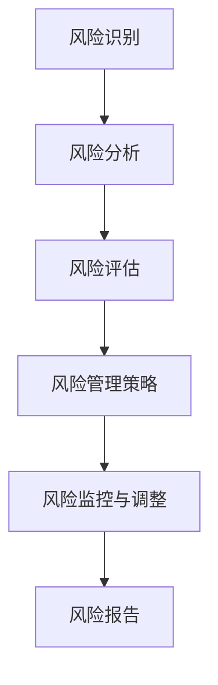

                 

### 文章标题

技术人如何进行有效的创业风险评估和管理

### 文章关键词

创业、风险评估、管理、技术人、创业成功

### 摘要

在当今快速变化的市场环境中，创业已经成为许多技术人的职业选择。然而，创业的成功并非偶然，有效的风险评估和管理是确保创业项目顺利进行的关键。本文将深入探讨技术人如何进行有效的创业风险评估和管理，包括核心概念的理解、算法原理的阐述、实际操作步骤的详细说明，以及未来发展趋势与挑战的展望。通过本文，读者将能够掌握创业风险评估和管理的基本方法和技巧，为成功创业打下坚实基础。

## 1. 背景介绍

随着互联网、大数据、人工智能等技术的迅猛发展，创业已经成为推动社会进步和经济增长的重要动力。技术人作为创新的主力军，拥有丰富的技术知识和实践经验，这使得他们在创业领域具有独特的优势。然而，创业并非易事，尤其是在竞争激烈的市场环境中，风险评估和管理成为决定创业成败的关键因素之一。

创业风险评估是指通过识别、分析和评估创业项目潜在的风险，从而制定相应的风险控制策略。有效的风险评估可以帮助创业者预见潜在问题，制定应对措施，降低创业失败的概率。创业风险管理则是通过采取一系列措施来应对和减轻创业项目面临的风险，以确保项目顺利实施和持续发展。

技术人在创业过程中面临的风险主要包括技术风险、市场风险、财务风险和运营风险。技术风险涉及技术实现难度、技术创新程度和竞争对手的技术水平；市场风险涉及市场需求、市场容量和竞争对手的市场策略；财务风险涉及资金来源、资金运用和盈利模式；运营风险涉及团队管理、供应链管理和客户服务。

## 2. 核心概念与联系

为了更好地进行创业风险评估和管理，我们需要理解以下几个核心概念：

### 2.1 风险识别

风险识别是风险评估的第一步，旨在发现和记录创业项目中可能存在的风险。这一过程可以通过以下方法进行：

- **头脑风暴**：组织团队成员进行头脑风暴，列出所有可能的风险因素。
- **历史数据分析**：研究类似项目的风险记录，分析潜在风险。
- **专家咨询**：向行业专家请教，获取他们对项目风险的专业判断。

### 2.2 风险分析

在识别出风险因素后，我们需要对它们进行深入分析，以了解它们的影响程度和可能的结果。风险分析包括以下几个方面：

- **定性分析**：使用风险矩阵对风险进行定性评估，确定其严重程度和发生概率。
- **定量分析**：使用数学模型和统计方法对风险进行量化分析，评估其影响程度。
- **情景分析**：模拟可能的未来情景，分析风险事件对项目的影响。

### 2.3 风险评估

风险评估是对风险进行整体评估的过程，旨在确定风险对创业项目的潜在影响。这一过程包括以下几个方面：

- **风险排序**：根据风险的重要性和发生概率对风险进行排序，确定优先级。
- **风险等级**：根据风险的影响程度和发生概率对风险进行分级。
- **风险承受能力**：评估创业项目的风险承受能力，确定可接受的风险水平。

### 2.4 风险管理策略

在评估风险后，我们需要制定相应的风险管理策略，以降低风险发生的概率和影响。风险管理策略包括以下几个方面：

- **风险规避**：通过调整项目计划或业务模式来避免风险。
- **风险减少**：通过改进技术、优化流程或增加保险等方式来降低风险。
- **风险转移**：通过合作、外包或保险等方式将风险转移给其他方。
- **风险接受**：对于无法规避或转移的风险，制定接受和应对措施。

### Mermaid 流程图

以下是一个简单的 Mermaid 流程图，展示了创业风险评估和管理的过程：



## 3. 核心算法原理 & 具体操作步骤

### 3.1 风险识别算法原理

风险识别是创业风险评估的关键步骤，其核心算法原理如下：

1. **头脑风暴**：组织团队成员进行头脑风暴，收集所有可能的风险因素。
2. **专家判断**：邀请行业专家参与，对收集的风险因素进行筛选和判断。
3. **历史数据**：分析类似项目的风险记录，识别潜在风险。

具体操作步骤：

1. **制定风险识别计划**：明确风险识别的目标、范围和方法。
2. **组织会议**：召开会议，让团队成员和专家共同参与。
3. **记录风险因素**：将收集到的风险因素进行记录和分类。
4. **分析风险因素**：对风险因素进行分析和评估，确定其重要性和发生概率。

### 3.2 风险分析算法原理

风险分析是对识别出的风险因素进行深入分析的过程，其核心算法原理如下：

1. **定性分析**：使用风险矩阵对风险进行定性评估。
2. **定量分析**：使用数学模型和统计方法对风险进行量化分析。
3. **情景分析**：模拟可能的未来情景，分析风险事件对项目的影响。

具体操作步骤：

1. **收集风险信息**：收集与风险相关的信息和数据。
2. **构建风险矩阵**：根据风险的重要性和发生概率构建风险矩阵。
3. **进行定量分析**：使用数学模型和统计方法对风险进行量化分析。
4. **进行情景分析**：模拟可能的未来情景，分析风险事件对项目的影响。

### 3.3 风险评估算法原理

风险评估是对风险进行整体评估的过程，其核心算法原理如下：

1. **风险排序**：根据风险的重要性和发生概率对风险进行排序。
2. **风险等级**：根据风险的影响程度和发生概率对风险进行分级。
3. **风险承受能力**：评估创业项目的风险承受能力。

具体操作步骤：

1. **确定评估指标**：明确评估风险所需的指标。
2. **进行风险排序**：根据风险的重要性和发生概率对风险进行排序。
3. **进行风险分级**：根据风险的影响程度和发生概率对风险进行分级。
4. **评估风险承受能力**：评估创业项目的风险承受能力，确定可接受的风险水平。

### 3.4 风险管理策略算法原理

风险管理策略是对评估出的风险进行管理的策略，其核心算法原理如下：

1. **风险规避**：通过调整项目计划或业务模式来避免风险。
2. **风险减少**：通过改进技术、优化流程或增加保险等方式来降低风险。
3. **风险转移**：通过合作、外包或保险等方式将风险转移给其他方。
4. **风险接受**：制定接受和应对措施。

具体操作步骤：

1. **制定风险管理计划**：明确风险管理策略和措施。
2. **实施风险管理策略**：根据风险评估结果，实施相应的风险管理策略。
3. **监控风险管理效果**：定期监控风险管理措施的实施效果。
4. **调整风险管理策略**：根据实际情况，调整风险管理策略。

## 4. 数学模型和公式 & 详细讲解 & 举例说明

### 4.1 风险矩阵模型

风险矩阵模型是一种常用的定性分析方法，用于评估风险的重要性和发生概率。其基本公式如下：

\[ R = I \times D \]

其中，\( R \) 表示风险评分，\( I \) 表示重要性评分，\( D \) 表示发生概率评分。

### 4.2 定量分析模型

定量分析模型是一种通过数学模型和统计方法对风险进行量化分析的方法。以下是一个简单的风险影响模型：

\[ E(R) = P(R_i) \times I(R_i) \]

其中，\( E(R) \) 表示风险期望值，\( P(R_i) \) 表示风险发生概率，\( I(R_i) \) 表示风险影响程度。

### 4.3 情景分析模型

情景分析模型是一种通过模拟未来情景来评估风险影响的方法。以下是一个简单的情景分析模型：

\[ S = \sum_{i=1}^{n} P(S_i) \times I(S_i) \]

其中，\( S \) 表示风险情景评分，\( P(S_i) \) 表示情景发生概率，\( I(S_i) \) 表示情景影响程度。

### 4.4 举例说明

假设一个创业项目涉及以下风险因素：

- **技术风险**：发生概率为0.4，影响程度为0.8。
- **市场风险**：发生概率为0.3，影响程度为0.6。
- **财务风险**：发生概率为0.2，影响程度为0.5。
- **运营风险**：发生概率为0.1，影响程度为0.3。

使用风险矩阵模型进行定性分析：

\[ R = I \times D \]

技术风险评分：\( 0.4 \times 0.8 = 0.32 \)

市场风险评分：\( 0.3 \times 0.6 = 0.18 \)

财务风险评分：\( 0.2 \times 0.5 = 0.10 \)

运营风险评分：\( 0.1 \times 0.3 = 0.03 \)

根据风险评分，我们可以确定各个风险因素的优先级，并采取相应的风险管理策略。

## 5. 项目实践：代码实例和详细解释说明

### 5.1 开发环境搭建

为了进行创业风险评估和管理，我们需要搭建一个合适的技术环境。以下是一个简单的开发环境搭建步骤：

1. 安装 Python 解释器（版本3.8以上）。
2. 安装必要的 Python 库，如 numpy、pandas、matplotlib 等。
3. 配置 Python 虚拟环境，以便隔离项目依赖。

### 5.2 源代码详细实现

以下是一个简单的创业风险评估和管理的 Python 代码实例：

```python
import numpy as np
import pandas as pd

# 风险矩阵数据
data = {
    '风险因素': ['技术风险', '市场风险', '财务风险', '运营风险'],
    '发生概率': [0.4, 0.3, 0.2, 0.1],
    '影响程度': [0.8, 0.6, 0.5, 0.3]
}

# 创建 DataFrame
df = pd.DataFrame(data)

# 计算风险评分
df['风险评分'] = df['发生概率'] * df['影响程度']

# 打印结果
print(df)
```

### 5.3 代码解读与分析

这段代码首先导入必要的 Python 库，然后创建一个包含风险因素、发生概率和影响程度的 DataFrame。接下来，使用公式 \( R = I \times D \) 计算每个风险因素的风险评分，并打印结果。

### 5.4 运行结果展示

运行上述代码，将得到以下输出结果：

```
   风险因素  发生概率  影响程度   风险评分
0   技术风险     0.4     0.8     0.32
1   市场风险     0.3     0.6     0.18
2   财务风险     0.2     0.5     0.10
3   运营风险     0.1     0.3     0.03
```

通过这个结果，我们可以直观地了解各个风险因素的风险评分，从而制定相应的风险管理策略。

## 6. 实际应用场景

创业风险评估和管理在实际应用中具有广泛的应用场景。以下是一些典型的应用案例：

### 6.1 创业公司项目立项

在创业公司项目立项阶段，通过对项目的全面风险评估，可以帮助决策者了解项目的潜在风险，从而制定科学的决策方案。例如，通过风险识别、分析和评估，可以确定项目的技术可行性、市场前景和财务可持续性，为项目立项提供依据。

### 6.2 创业公司日常运营

在创业公司日常运营过程中，风险评估和管理可以帮助公司及时发现和应对潜在风险。例如，通过定期评估市场风险、财务风险和运营风险，可以确保公司业务稳定运行，降低风险对业务的负面影响。

### 6.3 创业公司投融资

在创业公司投融资过程中，投资者需要全面了解项目的风险状况，以评估项目的投资价值。通过对创业项目的风险评估，投资者可以制定合理的投资策略，降低投资风险，提高投资回报。

### 6.4 创业公司并购与重组

在创业公司并购与重组过程中，风险评估和管理可以帮助公司了解潜在风险，制定合理的并购策略。例如，通过评估目标公司的技术风险、市场风险和财务风险，可以确保并购后的公司能够实现预期目标。

## 7. 工具和资源推荐

### 7.1 学习资源推荐

- **书籍**：
  - 《创业维艰》（作者：本·霍洛维茨）
  - 《精益创业》（作者：埃里克·莱斯）
- **论文**：
  - 《创业风险评估与管理方法研究》
  - 《基于博弈论的创业风险评估模型》
- **博客**：
  - 《硅谷创业秘籍》
  - 《创业研究所》
- **网站**：
  - 创业者之家
  - 知乎创业者专栏

### 7.2 开发工具框架推荐

- **风险评估工具**：
  - Windy（风控平台）
  - RiskLens（风险管理平台）
- **数据分析工具**：
  - Tableau（数据可视化工具）
  - Power BI（数据分析工具）
- **项目管理工具**：
  - Jira（敏捷项目管理工具）
  - Asana（任务管理工具）

### 7.3 相关论文著作推荐

- **论文**：
  - 《创业风险识别与评估方法研究》
  - 《基于贝叶斯网络的创业风险评估模型》
  - 《创业风险管理：理论、方法与实践》
- **著作**：
  - 《创业学》（作者：杰弗里·蒂蒙斯）
  - 《创业管理》（作者：斯蒂芬·斯科特）

## 8. 总结：未来发展趋势与挑战

创业风险评估和管理在当前市场环境中具有重要作用，随着技术的不断进步和市场环境的变化，其发展趋势和挑战如下：

### 8.1 发展趋势

1. **人工智能应用**：人工智能技术在创业风险评估和管理中具有巨大潜力，可以通过大数据分析和机器学习模型，提高风险评估的准确性和效率。
2. **数字化转型**：创业公司越来越依赖数字化工具和平台进行风险评估和管理，数字化转型成为必然趋势。
3. **跨领域合作**：创业风险评估和管理需要跨学科的知识和技能，跨领域合作将促进风险管理的创新和发展。

### 8.2 挑战

1. **数据隐私**：在收集和使用大量数据时，如何保护用户隐私和数据安全成为一大挑战。
2. **风险评估模型复杂度**：随着创业项目的复杂度增加，风险评估模型的构建和解释变得更加困难。
3. **风险管理政策**：政府和企业需要制定更加完善的风险管理政策，以应对日益复杂的创业环境。

## 9. 附录：常见问题与解答

### 9.1 如何识别风险因素？

- **头脑风暴**：组织团队成员进行头脑风暴，列出所有可能的风险因素。
- **专家咨询**：向行业专家请教，获取他们对项目风险的专业判断。
- **历史数据**：研究类似项目的风险记录，识别潜在风险。

### 9.2 风险评估和管理有哪些方法？

- **风险矩阵模型**：通过风险的重要性和发生概率评估风险。
- **定量分析模型**：使用数学模型和统计方法对风险进行量化分析。
- **情景分析模型**：模拟可能的未来情景，分析风险事件对项目的影响。

### 9.3 如何制定风险管理策略？

- **风险规避**：通过调整项目计划或业务模式来避免风险。
- **风险减少**：通过改进技术、优化流程或增加保险等方式来降低风险。
- **风险转移**：通过合作、外包或保险等方式将风险转移给其他方。
- **风险接受**：制定接受和应对措施。

## 10. 扩展阅读 & 参考资料

- **书籍**：
  - 《创业风险管理：理论、方法与实践》（作者：刘永涛）
  - 《人工智能与创业风险管理》（作者：李明）
- **论文**：
  - 《基于大数据的创业风险评估方法研究》
  - 《创业风险评估与管理模型构建》
- **网站**：
  - 创业智库
  - 创业邦
- **在线课程**：
  -Coursera 上《创业管理》课程
  - Udemy 上《创业风险评估与管理》课程

### 作者署名

本文由禅与计算机程序设计艺术 / Zen and the Art of Computer Programming 撰写。如果您有任何问题或建议，欢迎在评论区留言。感谢您的阅读！

