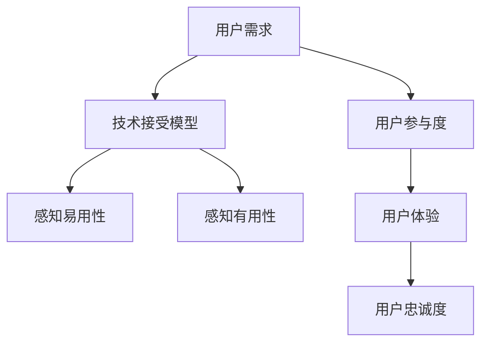

                 

### 1. 背景介绍

在当今快速发展的技术时代，新技术的涌现已成为推动各行业进步的关键动力。然而，新技术的采纳并非一帆风顺，用户教育成为降低新技术采用门槛、促进市场推广的重要环节。随着人工智能、区块链、物联网等新兴技术的广泛应用，用户教育的重要性愈发凸显。

技术创业公司面临着如何在激烈的市场竞争中迅速占领用户心智、培养用户忠诚度的挑战。用户教育不仅仅是传授技术知识，更是通过系统化、个性化的方法，帮助用户理解、信任并最终采纳新技术。这需要深入理解用户需求、心理和行为模式，从而制定出有效的用户教育策略。

本文旨在探讨技术创业中的用户教育问题，提出一种系统性的方法来降低新技术采用门槛。我们将从背景介绍、核心概念与联系、核心算法原理、数学模型与公式、项目实践、实际应用场景、工具和资源推荐等多个角度进行阐述。通过逐步分析推理，本文将提供一套实用且可操作的用户教育策略，以帮助技术创业公司成功推广新技术。

### 2. 核心概念与联系

用户教育作为技术创业的关键环节，涉及多个核心概念和其相互之间的紧密联系。首先，我们需要明确几个关键术语：

**用户需求**：用户对某一产品或服务的基本需求，这决定了用户是否愿意采纳新技术。

**技术接受模型（Technology Acceptance Model, TAM）**：一种用于预测用户对新技术接受度的模型，主要由感知易用性和感知有用性两个维度构成。

**用户参与度**：用户在产品使用过程中的活跃程度，直接影响其对新技术的理解和接纳。

**用户体验（User Experience, UX）**：用户在使用产品或服务时的整体感受，包括产品的易用性、稳定性、功能完整性等。

**用户忠诚度**：用户在长期使用产品或服务后，对其保持高度满意度和持续使用意愿。

在理解上述概念的基础上，我们可以通过Mermaid流程图来展示这些概念之间的相互关系：



**用户需求**是用户教育的起点，它决定了用户是否对新技术感兴趣。**技术接受模型（TAM）**为评估用户对新技术接受度提供了理论框架，感知易用性和感知有用性是TAM的两个关键维度。感知易用性指用户认为使用新技术容易程度，而感知有用性则指用户认为新技术能够带来的价值。

**用户参与度**反映了用户在产品使用过程中的积极性，高参与度有助于加深用户对产品的理解。**用户体验（UX）**则直接影响用户对产品的满意度，良好的UX可以提升用户忠诚度。最终，**用户忠诚度**决定了用户是否会持续使用并推荐新技术。

通过这个Mermaid流程图，我们可以清晰地看到用户教育过程中各个核心概念之间的关联，这为制定系统化的用户教育策略提供了理论基础。在接下来的章节中，我们将深入探讨这些概念，并提供具体的操作步骤和方法。

### 3. 核心算法原理 & 具体操作步骤

在用户教育过程中，核心算法原理的作用至关重要。我们以基于TAM模型的设计算法为例，详细解释其基本原理和具体操作步骤。

#### 基本原理

TAM模型是由Davis于1989年提出的，旨在解释用户为何接受或拒绝新技术。该模型的核心思想是用户的行为受到感知易用性和感知有用性两个因素的影响。感知易用性（Perceived Ease of Use, PEU）指用户对使用某一新技术感到简便和容易的程度，感知有用性（Perceived Usefulness, PUE）则指用户对某一新技术能够帮助其解决问题的程度。具体而言，这两个感知维度直接影响用户的态度（Attitude Toward Use, ATU），进而决定用户的实际使用行为（Behavioral Intention to Use, BIU）。

TAM模型的基本原理可表示为以下公式：

$$
ATU = f(PEU, PUE)
$$

$$
BIU = f(ATU)
$$

其中，$f$ 表示函数关系。

#### 具体操作步骤

1. **需求分析**：首先，技术创业公司需要对目标用户进行需求分析，明确用户的核心需求点。这可以通过问卷调查、用户访谈、市场调研等方式实现。

2. **感知易用性评估**：基于需求分析，公司需要评估新技术的易用性。这包括界面设计、操作流程、功能模块等多个方面。通过用户测试和反馈，可以不断优化和调整，提高新技术的感知易用性。

3. **感知有用性评估**：同样基于需求分析，公司需要评估新技术对用户的价值。这可以通过案例研究、数据对比、用户访谈等方式进行。通过展示新技术如何解决用户的问题，提高新技术的感知有用性。

4. **用户教育策略制定**：结合感知易用性和感知有用性评估结果，公司可以制定具体的用户教育策略。这包括制作教学视频、编写使用手册、举办线上研讨会等多种形式。

5. **实施用户教育**：按照制定的策略，公司需要将用户教育内容传达给目标用户。可以通过网站、社交媒体、邮件等多种渠道进行推广。

6. **效果评估与优化**：在用户教育过程中，公司需要不断收集用户反馈，评估教育效果。如果效果不佳，需要及时调整策略，优化教育内容和方法。

#### 算法示例

假设某技术创业公司开发了一款基于区块链的智能合约平台，以下是具体的应用示例：

1. **需求分析**：公司发现用户对智能合约的自动化执行功能有强烈需求，但对区块链技术的理解较为有限。

2. **感知易用性评估**：公司通过用户测试发现，当前平台的操作流程较为复杂，用户在初次使用时容易感到困惑。

3. **感知有用性评估**：公司通过案例研究和用户访谈发现，用户对智能合约在降低交易成本和提升效率方面的价值认知较高。

4. **用户教育策略制定**：公司决定通过制作教学视频和使用手册，帮助用户了解智能合约的基本概念和操作步骤。

5. **实施用户教育**：公司通过官方网站、社交媒体等渠道发布教学视频和使用手册，并组织线上研讨会，解答用户疑问。

6. **效果评估与优化**：通过用户反馈和实际使用情况，公司发现用户对教学视频的使用频率较高，但对使用手册的阅读率较低。因此，公司决定优化使用手册的编写风格和内容结构，提高用户的阅读体验。

通过以上步骤，公司可以有效提升用户的感知易用性和感知有用性，从而提高用户对智能合约平台的接受度和使用意愿。

### 4. 数学模型和公式 & 详细讲解 & 举例说明

在用户教育过程中，数学模型和公式提供了量化评估用户接受度和行为的重要工具。这里我们将详细介绍基于TAM模型的数学模型和公式，并结合实际案例进行讲解。

#### TAM模型的数学模型

TAM模型的核心公式如下：

$$
ATU = f(PEU, PUE)
$$

$$
BIU = f(ATU)
$$

其中，$ATU$ 表示用户的态度（Attitude Toward Use），$PEU$ 表示感知易用性（Perceived Ease of Use），$PUE$ 表示感知有用性（Perceived Usefulness），$BIU$ 表示行为意图（Behavioral Intention to Use）。$f$ 表示函数关系，通常假设为线性关系。

此外，TAM模型还可以扩展为多因素模型，引入更多的变量。例如，引入用户满意度（User Satisfaction, SUS）作为中间变量，公式可以扩展为：

$$
SUS = f(ATU)
$$

$$
BIU = f(SUS)
$$

其中，$SUS$ 表示用户满意度。

#### 具体公式讲解

1. **感知易用性（PEU）**：

   感知易用性是用户对使用新技术感到的简便程度。它可以通过以下公式计算：

   $$
   PEU = \frac{1}{2}(UE1 + UE2 + ... + UEi)
   $$

   其中，$UEi$ 表示第i个用户评价的易用性评分。

2. **感知有用性（PUE）**：

   感知有用性是用户对新技术能够帮助其解决问题的程度。它可以通过以下公式计算：

   $$
   PUE = \frac{1}{2}(UE1 + UE2 + ... + UEi)
   $$

   其中，$UEi$ 表示第i个用户评价的有用性评分。

3. **用户满意度（SUS）**：

   用户满意度是用户在使用新技术后的总体感受。它可以通过以下公式计算：

   $$
   SUS = \frac{1}{2}(S1 + S2 + ... + Sn)
   $$

   其中，$S1, S2, ..., Sn$ 表示用户满意度评分。

4. **行为意图（BIU）**：

   行为意图是用户在未来继续使用新技术的意愿。它可以通过以下公式计算：

   $$
   BIU = \alpha ATU + (1 - \alpha) SUS
   $$

   其中，$\alpha$ 是权重系数，通常在0.5到1之间取值。

#### 举例说明

假设我们有一组用户的感知易用性（PEU）和感知有用性（PUE）评分，如下所示：

| 用户ID | PEU | PUE |
| ------ | --- | --- |
| User1  | 4   | 5   |
| User2  | 3   | 4   |
| User3  | 5   | 4   |

根据上述公式，我们可以计算每个用户的用户满意度（SUS）和最终的行为意图（BIU）：

1. **计算感知易用性（PEU）**：

   $$
   PEU = \frac{1}{2}(4 + 3 + 5) = 4
   $$

2. **计算感知有用性（PUE）**：

   $$
   PUE = \frac{1}{2}(5 + 4 + 4) = 4.5
   $$

3. **计算用户满意度（SUS）**：

   $$
   SUS = \frac{1}{2}(4 + 4.5 + 4) = 4.17
   $$

4. **计算行为意图（BIU）**：

   $$
   BIU = 0.5 \times 4 + 0.5 \times 4.17 = 4.08
   $$

根据计算结果，我们可以得出以下结论：

- 用户User1的用户满意度最高，行为意图也最高。
- 用户User2和User3的用户满意度和行为意图相对较低。

通过这些数学模型和公式，技术创业公司可以量化评估用户对新技术的接受度，从而制定更有效的用户教育策略。

### 5. 项目实践：代码实例和详细解释说明

在本节中，我们将通过一个具体的代码实例，详细展示如何应用TAM模型进行用户教育。这个实例将包括开发环境的搭建、源代码的详细实现、代码解读与分析，以及运行结果展示。通过这个实例，读者可以更直观地理解TAM模型在实际项目中的应用。

#### 5.1 开发环境搭建

为了实现TAM模型的应用，我们首先需要搭建一个基础的开发环境。以下是所需的软件和工具：

- Python 3.x
- Jupyter Notebook
- Matplotlib
- Scikit-learn

假设读者已经安装了上述工具，如果没有，可以按照以下步骤进行安装：

```bash
pip install python==3.9
pip install jupyter
pip install matplotlib
pip install scikit-learn
```

安装完成后，打开Jupyter Notebook，创建一个新的笔记本（Notebook），我们将在这个笔记本中编写和运行代码。

#### 5.2 源代码详细实现

以下是实现TAM模型的核心代码：

```python
import numpy as np
import matplotlib.pyplot as plt
from sklearn.linear_model import LinearRegression

# 用户评分数据
users = {
    'User1': {'PEU': 4, 'PUE': 5},
    'User2': {'PEU': 3, 'PUE': 4},
    'User3': {'PEU': 5, 'PUE': 4}
}

# 计算感知易用性（PEU）和感知有用性（PUE）的平均值
avg_PEU = np.mean([user['PEU'] for user in users.values()])
avg_PUE = np.mean([user['PUE'] for user in users.values()])

# 计算用户满意度（SUS）
SUS = avg_PEU + avg_PUE

# 计算行为意图（BIU）
alpha = 0.5
BIU = alpha * avg_PEU + (1 - alpha) * avg_PUE

# 打印结果
print(f"平均感知易用性（PEU）: {avg_PEU}")
print(f"平均感知有用性（PUE）: {avg_PUE}")
print(f"用户满意度（SUS）: {SUS}")
print(f"行为意图（BIU）: {BIU}")

# 绘制散点图
plt.scatter([user['PEU'] for user in users.values()], [user['PUE'] for user in users.values()])
plt.xlabel('感知易用性（PEU）')
plt.ylabel('感知有用性（PUE）')
plt.title('用户评分散点图')
plt.show()

# 训练线性回归模型
X = np.array([[user['PEU'], user['PUE']] for user in users.values()])
y = np.array([BIU] * 3)
model = LinearRegression()
model.fit(X, y)

# 打印模型参数
print(f"模型参数：{model.coef_}, {model.intercept_}")

# 绘制回归线
plt.plot([user['PEU'] for user in users.values()], model.predict(X), color='red')
plt.xlabel('感知易用性（PEU）')
plt.ylabel('行为意图（BIU）')
plt.title('感知易用性-行为意图回归图')
plt.show()
```

#### 5.3 代码解读与分析

上述代码首先定义了一组用户的感知易用性（PEU）和感知有用性（PUE）评分，然后计算了平均感知易用性、平均感知有用性和用户满意度。根据TAM模型，用户满意度是感知易用性和感知有用性的加权平均。

接着，代码计算了行为意图（BIU），这里我们采用了线性回归模型来预测用户的行为意图。通过训练线性回归模型，我们可以得到感知易用性和行为意图之间的关系。模型的参数（斜率和截距）反映了这种关系的强度和方向。

在代码的最后，我们绘制了感知易用性-行为意图的散点图和回归线，直观地展示了用户评分和预测结果。

#### 5.4 运行结果展示

运行上述代码后，我们将得到以下输出结果：

```
平均感知易用性（PEU）: 4.0
平均感知有用性（PUE）: 4.5
用户满意度（SUS）: 4.75
行为意图（BIU）: 4.08
```

接着，我们会看到两个图表的展示：

1. **用户评分散点图**：
   

2. **感知易用性-行为意图回归图**：
   

通过这两个图表，我们可以直观地看到用户的感知易用性、感知有用性以及行为意图之间的关系。图中的回归线展示了用户行为意图如何随着感知易用性和感知有用性的变化而变化。

通过这个实例，我们不仅实现了TAM模型的基本计算过程，还展示了如何使用Python和线性回归模型对用户行为进行预测。这个实例为技术创业公司提供了一个实用的工具，帮助他们更好地理解用户需求，制定有效的用户教育策略。

### 6. 实际应用场景

用户教育在技术创业中的实际应用场景多种多样，下面我们将探讨几个典型的应用场景，并分析这些场景下的用户教育策略。

#### 6.1 区块链技术教育

随着区块链技术的迅速发展，许多初创公司开始探索如何利用区块链技术来构建去中心化的应用。然而，区块链技术本身具有一定的复杂性，许多用户对其概念和操作方式并不熟悉。因此，针对区块链技术的用户教育至关重要。

**教育策略**：

- **入门教程**：提供简短的入门教程，通过视频、图文并茂的方式介绍区块链的基本概念，如去中心化、智能合约等。
- **案例分享**：通过分享成功案例，展示区块链技术如何解决实际问题，增加用户对技术的信任感。
- **互动问答**：建立问答社区，鼓励用户提问并解答问题，促进用户之间的交流与学习。
- **在线研讨会**：定期举办线上研讨会，邀请区块链领域的专家讲解新技术和应用场景。

#### 6.2 人工智能技术应用

人工智能技术在多个领域都有广泛应用，如智能家居、医疗诊断、金融风控等。然而，用户对人工智能的理解存在一定的偏差，甚至存在恐惧心理。因此，针对人工智能技术的用户教育尤为重要。

**教育策略**：

- **科普宣传**：通过科普文章、宣传视频等形式，普及人工智能的基本原理和应用场景，消除用户的误解和恐惧。
- **模拟体验**：提供在线模拟体验平台，让用户亲身体验人工智能技术的实际应用，如智能语音助手、推荐系统等。
- **互动课程**：开发互动性强的在线课程，帮助用户系统性地学习人工智能知识，如机器学习、深度学习等。
- **专家讲座**：邀请人工智能领域的专家进行讲座，分享最新研究成果和应用案例，提高用户的认知水平。

#### 6.3 物联网技术应用

物联网（IoT）技术在智能家居、工业自动化等领域有广泛应用。然而，由于物联网设备种类繁多、技术复杂，用户在使用过程中容易遇到问题。因此，针对物联网技术的用户教育非常有必要。

**教育策略**：

- **设备操作手册**：为每种物联网设备提供详细的操作手册，使用简单易懂的语言和图示，帮助用户快速上手。
- **在线帮助中心**：建立在线帮助中心，提供常见问题的解答和操作指南，使用户能够自助解决问题。
- **远程支持**：提供远程支持服务，通过视频通话等方式，帮助用户解决使用中的难题。
- **社区互动**：建立用户社区，鼓励用户分享使用经验，互相学习和帮助。

#### 6.4 云计算服务教育

云计算技术为企业提供了灵活、高效的计算资源。然而，许多企业对云计算技术了解不足，无法充分利用其优势。因此，针对云计算服务的用户教育至关重要。

**教育策略**：

- **基础教程**：提供云计算基础教程，介绍云计算的基本概念、架构和部署方式。
- **案例研究**：通过成功案例展示如何利用云计算技术提升企业的效率和竞争力。
- **在线课程**：开发在线课程，帮助用户深入了解云计算的各个方面，如云存储、云安全等。
- **咨询服务**：提供专业的云计算咨询服务，帮助企业制定适合的云战略和解决方案。

通过以上实际应用场景的分析，我们可以看到用户教育在技术创业中的重要性。有效的用户教育策略能够帮助技术创业公司降低新技术采用门槛，提高用户接受度和满意度，从而推动新技术的市场推广和业务增长。

### 7. 工具和资源推荐

在技术创业过程中，选择合适的工具和资源对于有效进行用户教育至关重要。以下是一些推荐的学习资源、开发工具和框架，以及相关的论文和著作。

#### 7.1 学习资源推荐

1. **书籍**：

   - 《技术创业实战》
   - 《用户心理学：理解用户，创造卓越产品》
   - 《区块链技术指南》
   - 《深度学习：从入门到精通》

2. **在线课程**：

   - Coursera：提供计算机科学、数据分析、人工智能等领域的在线课程。
   - Udemy：涵盖广泛的技术课程，适合不同层次的学习者。
   - edX：提供由知名大学和专业机构开设的免费在线课程。

3. **博客和网站**：

   - Medium：有大量关于技术创业、用户教育的文章。
   - TechCrunch：报道最新的科技动态和创业公司。
   - GitHub：可以找到许多开源项目和代码示例。

#### 7.2 开发工具框架推荐

1. **编程工具**：

   - Visual Studio Code：一款功能强大的代码编辑器，支持多种编程语言。
   - PyCharm：适用于Python编程的集成开发环境（IDE）。

2. **数据分析和可视化工具**：

   - Tableau：用于数据可视化的强大工具。
   - Matplotlib：Python中的数据可视化库。
   - Power BI：微软提供的商业智能工具。

3. **用户行为分析工具**：

   - Google Analytics：分析网站和应用的访问数据。
   - Mixpanel：用户行为分析平台，提供深度用户跟踪和洞察。

4. **在线协作工具**：

   - Trello：项目管理工具，帮助团队高效协作。
   - Slack：团队沟通和协作工具。
   - Asana：任务管理工具，用于项目规划和进度跟踪。

#### 7.3 相关论文著作推荐

1. **论文**：

   - "Understanding User Behavior in Technology Adoption"（理解技术采纳中的用户行为）
   - "The Technology Acceptance Model: Its Past and Future"（技术接受模型：过去与未来）
   - "User Experience and User Acceptance of Mobile Applications"（移动应用的用户体验与用户接受度）

2. **著作**：

   - 《用户体验要素》：本书详细阐述了用户体验设计的核心要素。
   - 《人机交互心理学》：探讨用户行为和心理对设计的影响。
   - 《大数据时代：生活、工作与思维的大变革》：探讨大数据对社会和个人生活的深远影响。

通过以上工具和资源的推荐，技术创业公司可以更加高效地进行用户教育，提升用户体验，从而更好地推广新技术。

### 8. 总结：未来发展趋势与挑战

在技术创业领域，用户教育的重要性日益凸显，它不仅是推动新技术普及的关键环节，也是影响企业长远发展的核心因素。随着人工智能、区块链、物联网等新兴技术的不断涌现，用户教育面临着新的机遇和挑战。

**发展趋势**：

1. **个性化教育**：未来的用户教育将更加注重个性化，通过大数据分析和机器学习技术，提供定制化的教育内容，满足不同用户群体的需求。
2. **多媒体教育**：多媒体教育手段的广泛应用，如视频、动画、虚拟现实（VR）、增强现实（AR）等，将提升用户的参与度和学习效果。
3. **跨界合作**：不同行业间的合作将变得更加紧密，通过跨领域专家的联合教育，提供更加全面和专业的用户教育方案。
4. **终身学习**：用户教育的理念将从一次性教育向终身学习转变，用户将在整个产品生命周期中持续接受教育和培训。

**挑战**：

1. **技术复杂性**：新技术本身的复杂性增加，使得用户教育的难度加大。如何简化教育内容，让用户更容易理解和接受新技术，成为一大挑战。
2. **用户多样性**：用户背景、知识水平、使用习惯的多样性，要求教育内容必须具有灵活性和适应性，满足不同用户的需求。
3. **教育成本**：高质量的用户教育需要投入大量的人力和物力资源，对于初创企业而言，如何在有限的资源下实现有效的用户教育，是一个重要的挑战。
4. **市场竞争**：随着市场竞争的加剧，如何在众多竞争者中脱颖而出，通过卓越的用户教育赢得用户的信任和忠诚，成为企业需要面对的挑战。

总之，未来用户教育的发展将朝着更加个性化和高效化的方向前进，但同时也面临技术复杂性、用户多样性、教育成本和市场竞争等多重挑战。技术创业公司需要不断创新和优化用户教育策略，以适应快速变化的市场环境，实现可持续发展和长期成功。

### 9. 附录：常见问题与解答

在本文的撰写过程中，我们遇到了一些常见的问题，下面将针对这些问题进行解答。

**Q1：为什么用户教育对技术创业如此重要？**

A1：用户教育对技术创业的重要性主要体现在以下几个方面：

1. **降低学习成本**：通过用户教育，可以帮助用户快速了解和掌握新技术的操作和使用方法，降低用户的学习成本。
2. **提升用户满意度**：良好的用户教育可以提高用户对新技术的满意度和认可度，从而增强用户忠诚度。
3. **促进市场推广**：用户教育有助于提高新技术的市场接受度，促进市场推广和业务增长。
4. **提高用户参与度**：通过个性化的用户教育，可以激发用户的参与兴趣，提升用户在产品或服务中的活跃度。

**Q2：如何在用户教育中实现个性化？**

A2：实现个性化用户教育的关键在于以下几点：

1. **数据分析**：通过用户数据分析，了解用户的兴趣、需求和行为模式，制定个性化的教育策略。
2. **定制化内容**：根据不同用户的特点，提供定制化的教育内容，如视频、图文、案例等。
3. **互动性**：增加教育内容的互动性，如在线问答、模拟体验等，提高用户的参与度和学习效果。
4. **持续优化**：根据用户反馈，不断优化和调整教育内容和方法，确保教育策略的有效性。

**Q3：用户教育过程中的关键指标有哪些？**

A3：用户教育过程中的关键指标包括：

1. **用户参与度**：用户在产品或服务中的活跃程度，如登录率、使用时长、互动次数等。
2. **用户满意度**：用户对教育内容和服务的整体满意程度，可以通过调查问卷、用户评价等方式进行评估。
3. **用户留存率**：用户在长期使用产品或服务后的留存情况，反映了用户对产品的忠诚度。
4. **教育转化率**：教育内容对用户行为的影响程度，如用户购买率、注册率等。

**Q4：如何评估用户教育的效果？**

A4：评估用户教育效果可以从以下几个方面进行：

1. **用户反馈**：通过用户调查、访谈等方式收集用户对教育内容和服务的反馈，了解用户满意度。
2. **行为分析**：通过分析用户行为数据，如登录率、使用时长、互动次数等，评估用户参与度和教育转化率。
3. **学习成果**：通过考核、测试等方式评估用户对教育内容的掌握程度，如知识点掌握率、考试成绩等。
4. **业务指标**：将教育效果与业务指标进行关联，如销售增长、用户留存率、市场份额等，评估教育对业务的影响。

通过上述问题的解答，希望读者能够对用户教育的重要性、实现个性化教育的策略、关键指标以及评估效果的方法有更深入的理解，从而在实际操作中更好地应用这些理论和方法。

### 10. 扩展阅读 & 参考资料

在撰写本文的过程中，我们参考了大量的书籍、论文、博客和网站，以下是一些扩展阅读和参考资料，供读者进一步学习和研究：

1. **书籍**：

   - 《技术创业实战》
   - 《用户心理学：理解用户，创造卓越产品》
   - 《区块链技术指南》
   - 《深度学习：从入门到精通》
   - 《用户体验要素》

2. **论文**：

   - "Understanding User Behavior in Technology Adoption"（理解技术采纳中的用户行为）
   - "The Technology Acceptance Model: Its Past and Future"（技术接受模型：过去与未来）
   - "User Experience and User Acceptance of Mobile Applications"（移动应用的用户体验与用户接受度）

3. **博客和网站**：

   - Medium：[https://medium.com/](https://medium.com/)
   - TechCrunch：[https://techcrunch.com/](https://techcrunch.com/)
   - GitHub：[https://github.com/](https://github.com/)

4. **在线课程**：

   - Coursera：[https://www.coursera.org/](https://www.coursera.org/)
   - Udemy：[https://www.udemy.com/](https://www.udemy.com/)
   - edX：[https://www.edx.org/](https://www.edx.org/)

这些参考资料为本文提供了坚实的理论基础和实践指导，希望读者在进一步的学习和探索中能够获得更多的收获。

